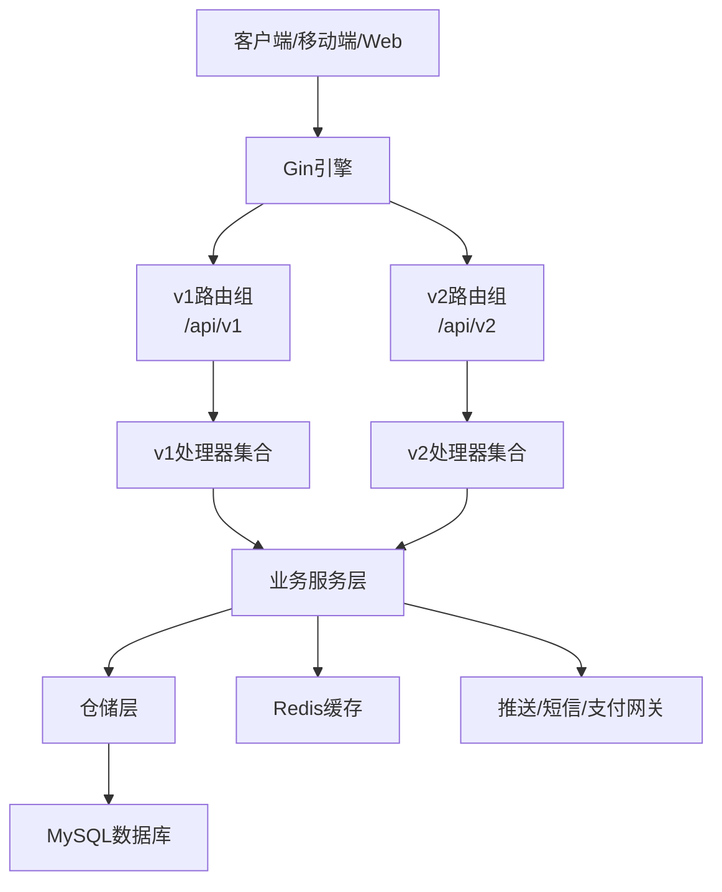
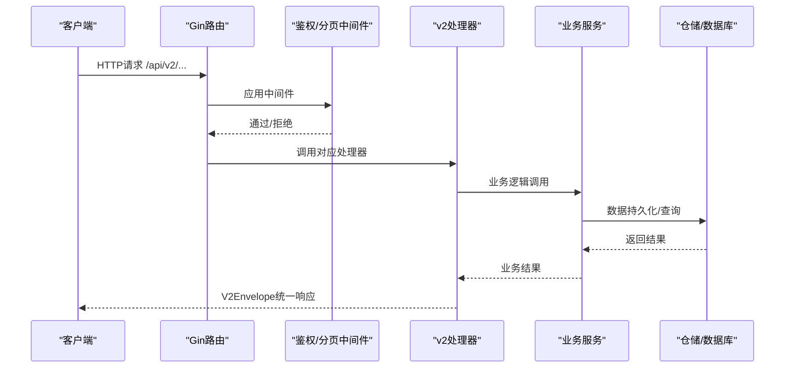
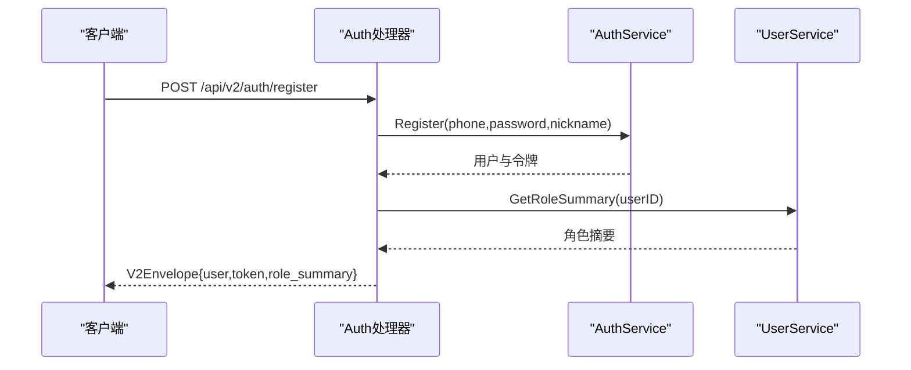
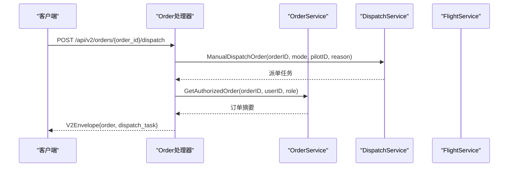
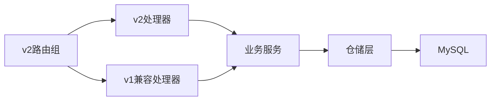

# API接口文档

<cite>
**本文档引用的文件**
- [openapi-v2.yaml](file://backend/docs/openapi-v2.yaml)
- [API_V1_V2_DIFF.md](file://backend/docs/API_V1_V2_DIFF.md)
- [main.go](file://backend/cmd/server/main.go)
- [router.go](file://backend/internal/api/v1/router.go)
- [router.go](file://backend/internal/api/v2/router.go)
- [handler.go](file://backend/internal/api/v2/auth/handler.go)
- [handler.go](file://backend/internal/api/v2/me/handler.go)
- [handler.go](file://backend/internal/api/v2/client/handler.go)
- [handler.go](file://backend/internal/api/v2/order/handler.go)
- [handler.go](file://backend/internal/api/v2/demand/handler.go)
- [handler.go](file://backend/internal/api/v2/owner/handler.go)
- [handler.go](file://backend/internal/api/v2/pilot/handler.go)
- [handler.go](file://backend/internal/api/v2/supply/handler.go)
- [handler.go](file://backend/internal/api/v2/dispatch/handler.go)
</cite>

## 目录
1. [简介](#简介)
2. [项目结构](#项目结构)
3. [核心组件](#核心组件)
4. [架构总览](#架构总览)
5. [详细组件分析](#详细组件分析)
6. [依赖关系分析](#依赖关系分析)
7. [性能考虑](#性能考虑)
8. [故障排除指南](#故障排除指南)
9. [结论](#结论)
10. [附录](#附录)

## 简介
本文件为无人机租赁平台的完整API接口文档，基于OpenAPI 3.0.3规范，聚焦于v2版本的RESTful接口。文档涵盖用户认证、角色管理、需求发布、订单处理、派单调度、飞行监控、支付结算、通知评价等全业务闭环。同时提供v1到v2的差异对照与迁移指南，帮助客户端与第三方系统完成平滑升级。

## 项目结构
后端采用Go+Gin框架，按领域划分模块化设计：
- 命令行入口：启动HTTP服务器，注册v1/v2路由，初始化数据库、Redis、WebSocket等基础设施
- API层：v1/v2两套路由体系，v2为新模型与统一响应结构
- 服务层：封装业务逻辑，解耦数据访问与外部依赖
- 数据层：基于GORM的MySQL持久化，配合迁移脚本

**图表来源**
- [main.go:249-266](file://backend/cmd/server/main.go#L249-L266)
- [router.go:58-634](file://backend/internal/api/v1/router.go#L58-L634)
- [router.go:72-283](file://backend/internal/api/v2/router.go#L72-L283)

**章节来源**
- [main.go:1-390](file://backend/cmd/server/main.go#L1-L390)
- [router.go:1-634](file://backend/internal/api/v1/router.go#L1-L634)
- [router.go:1-283](file://backend/internal/api/v2/router.go#L1-L283)

## 核心组件
- 服务器与中间件
  - CORS、日志、TraceID、分页中间件
  - JWT鉴权中间件，v2默认开启
- 路由注册
  - v1：传统多领域路由，部分写入已冻结
  - v2：统一前缀/api/v2，统一响应结构
- 处理器与服务
  - 每个领域一个Handler，调用对应Service
  - Service层封装业务规则，避免直接操作数据库

**章节来源**
- [main.go:249-266](file://backend/cmd/server/main.go#L249-L266)
- [router.go:72-90](file://backend/internal/api/v2/router.go#L72-L90)

## 架构总览
v2接口采用统一响应结构V2Envelope，支持分页列表与单对象返回。鉴权采用Bearer Token，路由按领域分组，权限控制在处理器层实现。

**图表来源**
- [router.go:72-90](file://backend/internal/api/v2/router.go#L72-L90)
- [handler.go:46-75](file://backend/internal/api/v2/auth/handler.go#L46-L75)

**章节来源**
- [router.go:72-90](file://backend/internal/api/v2/router.go#L72-L90)
- [openapi-v2.yaml:809-958](file://backend/docs/openapi-v2.yaml#L809-L958)

## 详细组件分析

### 认证与初始化
- 路由
  - POST /api/v2/auth/register：注册并返回用户信息、令牌与角色摘要
  - POST /api/v2/auth/login：登录，支持密码或验证码登录
  - POST /api/v2/auth/refresh-token：刷新令牌
  - POST /api/v2/auth/logout：登出
  - GET /api/v2/me：获取初始化数据与角色摘要
- 请求参数
  - RegisterRequest：手机号、密码、昵称、验证码
  - LoginRequest：手机号、密码或验证码
  - RefreshTokenRequest：刷新令牌
- 响应
  - V2Envelope成功响应，data包含用户信息、token与role_summary
  - 错误响应ErrorEnvelope

**图表来源**
- [handler.go:46-75](file://backend/internal/api/v2/auth/handler.go#L46-L75)
- [handler.go:19-27](file://backend/internal/api/v2/me/handler.go#L19-L27)

**章节来源**
- [handler.go:23-149](file://backend/internal/api/v2/auth/handler.go#L23-L149)
- [handler.go:19-27](file://backend/internal/api/v2/me/handler.go#L19-L27)
- [openapi-v2.yaml:38-118](file://backend/docs/openapi-v2.yaml#L38-L118)

### 客户端领域
- 路由
  - GET /api/v2/client/profile：获取客户档案
  - PATCH /api/v2/client/profile：更新客户档案
- 权限
  - 需要已登录用户上下文
- 响应
  - V2Envelope成功响应，data为客户档案对象

**章节来源**
- [handler.go:20-56](file://backend/internal/api/v2/client/handler.go#L20-L56)
- [openapi-v2.yaml:89-108](file://backend/docs/openapi-v2.yaml#L89-L108)

### 供给市场
- 路由
  - GET /api/v2/supplies：市场供给列表（支持分页与筛选）
  - GET /api/v2/supplies/{supply_id}：供给详情
  - POST /api/v2/supplies/{supply_id}/orders：直连下单
- 查询参数
  - region、cargo_scene、service_type、min_payload_kg、accepts_direct_order
- 响应
  - 列表：V2Envelope{data:{items:[...], meta:{page,page_size,total}}}

**章节来源**
- [handler.go:23-105](file://backend/internal/api/v2/supply/handler.go#L23-L105)
- [openapi-v2.yaml:108-146](file://backend/docs/openapi-v2.yaml#L108-L146)

### 需求管理
- 路由
  - POST /api/v2/demands：创建需求草稿
  - GET /api/v2/demands/my：我的需求列表
  - GET /api/v2/demands/{demand_id}：需求详情
  - PATCH /api/v2/demands/{demand_id}：更新需求草稿
  - POST /api/v2/demands/{demand_id}/publish：发布需求
  - POST /api/v2/demands/{demand_id}/cancel：取消需求
  - GET /api/v2/demands/{demand_id}/quotes：查看报价
  - POST /api/v2/demands/{demand_id}/select-provider：选择供应商并生成订单
  - POST /api/v2/demands/{demand_id}/quotes：机主创建报价
  - POST /api/v2/demands/{demand_id}/candidate：飞手报名候选
  - DELETE /api/v2/demands/{demand_id}/candidate：飞手撤销报名
- 权限
  - 需求草稿与详情需授权访问
- 响应
  - V2Envelope成功响应，data为需求详情或列表

**章节来源**
- [handler.go:24-239](file://backend/internal/api/v2/demand/handler.go#L24-L239)
- [openapi-v2.yaml:146-265](file://backend/docs/openapi-v2.yaml#L146-L265)

### 机主领域
- 路由
  - GET/PUT /api/v2/owner/profile：档案读取与更新
  - GET/POST /api/v2/owner/drones：无人机列表与创建
  - GET /api/v2/owner/drones/{drone_id}：无人机详情
  - POST /api/v2/owner/drones/{drone_id}/certifications：提交无人机资质材料
  - GET/POST /api/v2/owner/supplies：供给列表与创建
  - GET/PUT /api/v2/owner/supplies/{supply_id}：供给详情与更新
  - PATCH /api/v2/owner/supplies/{supply_id}/status：更新供给状态
  - GET /api/v2/owner/demands/recommended：推荐需求列表
  - GET /api/v2/owner/quotes：我的报价列表
  - GET/POST /api/v2/owner/pilot-bindings：绑定飞手列表与邀请
  - POST/DELETE /api/v2/owner/pilot-bindings/{binding_id}/{confirm|reject|status}：绑定状态变更
- 权限
  - 机主专属接口，需拥有owner角色

**章节来源**
- [handler.go:29-576](file://backend/internal/api/v2/owner/handler.go#L29-L576)
- [openapi-v2.yaml:265-444](file://backend/docs/openapi-v2.yaml#L265-L444)

### 飞手领域
- 路由
  - GET/PUT /api/v2/pilot/profile：档案读取与更新
  - PATCH /api/v2/pilot/availability：在线/可派单状态更新
  - GET/POST /api/v2/pilot/owner-bindings：绑定机主列表与申请
  - POST/DELETE /api/v2/pilot/owner-bindings/{binding_id}/{confirm|reject|status}：绑定状态变更
  - GET /api/v2/pilot/candidate-demands：候选需求列表
  - GET /api/v2/pilot/dispatch-tasks：正式派单任务列表
  - GET /api/v2/pilot/flight-records：飞行记录列表
- 权限
  - 飞手专属接口，需拥有pilot角色

**章节来源**
- [handler.go:24-371](file://backend/internal/api/v2/pilot/handler.go#L24-L371)
- [openapi-v2.yaml:444-539](file://backend/docs/openapi-v2.yaml#L444-L539)

### 订单与支付
- 路由
  - GET /api/v2/orders：订单列表（支持role/status过滤）
  - GET /api/v2/orders/{order_id}：订单详情
  - POST /api/v2/orders/{order_id}/provider-confirm：机主确认直连订单
  - POST /api/v2/orders/{order_id}/provider-reject：机主拒绝直连订单（含拒绝原因）
  - POST /api/v2/orders/{order_id}/pay：创建订单支付（支持mock/wechat/alipay）
  - POST /api/v2/orders/{order_id}/cancel：取消订单（未实现）
  - POST /api/v2/orders/{order_id}/start-preparing：开始准备（未实现）
  - POST /api/v2/orders/{order_id}/start-flight：开始飞行（未实现）
  - POST /api/v2/orders/{order_id}/confirm-delivery：确认交付（未实现）
  - POST /api/v2/orders/{order_id}/confirm-receipt：确认收货
  - POST /api/v2/orders/{order_id}/execution-status：更新执行状态
  - GET /api/v2/orders/{order_id}/monitor：订单监控数据
  - POST /api/v2/orders/{order_id}/dispatch：手动派单/自执行
  - GET /api/v2/orders/{order_id}/payments：订单支付记录
  - GET /api/v2/orders/{order_id}/refunds：订单退款记录
  - POST /api/v2/orders/{order_id}/refund：申请退款
  - GET /api/v2/orders/{order_id}/settlement：订单结算详情
  - GET/POST /api/v2/orders/{order_id}/disputes：争议列表与创建
  - GET/POST /api/v2/orders/{order_id}/reviews：评价列表与创建
- 参数
  - 支付请求：method枚举(mock/wechat/alipay)
  - 派单请求：dispatch_mode枚举(self_execute/bound_pilot/candidate_pool/public_pool)，可选target_pilot_user_id与reason
- 响应
  - V2Envelope成功响应，data为订单详情或监控数据

**图表来源**
- [handler.go:140-178](file://backend/internal/api/v2/order/handler.go#L140-L178)

**章节来源**
- [handler.go:32-763](file://backend/internal/api/v2/order/handler.go#L32-L763)
- [openapi-v2.yaml:569-739](file://backend/docs/openapi-v2.yaml#L569-L739)

### 派单任务
- 路由
  - GET /api/v2/dispatch-tasks：正式派单任务列表（支持role/status过滤）
  - GET /api/v2/dispatch-tasks/{dispatch_id}：派单详情（含订单与日志）
  - POST /api/v2/dispatch-tasks/{dispatch_id}/accept：飞手接受任务
  - POST /api/v2/dispatch-tasks/{dispatch_id}/reject：飞手拒绝任务（可带原因）
  - POST /api/v2/dispatch-tasks/{dispatch_id}/reassign：重新派发（支持多种模式）
- 权限
  - 机主可查看/重新派发；飞手可接受/拒绝

**章节来源**
- [handler.go:27-156](file://backend/internal/api/v2/dispatch/handler.go#L27-L156)
- [openapi-v2.yaml:739-790](file://backend/docs/openapi-v2.yaml#L739-L790)

### 通知与评价
- 路由
  - GET /api/v2/notifications：系统通知列表
  - POST /api/v2/notifications/{notification_id}/read：标记通知为已读
  - GET /api/v2/me/reviews：我的评价记录
- 权限
  - 需要已登录用户上下文

**章节来源**
- [openapi-v2.yaml:790-809](file://backend/docs/openapi-v2.yaml#L790-L809)

## 依赖关系分析
- v1与v2并行：v1路由仍在，但写入已冻结；v2为新模型与统一响应
- 兼容层：v2部分接口仍通过v1兼容处理器提供（如admin/analytics/client.admin.cargo）
- 未实现接口：v2中部分订单执行与飞行记录明细接口占位未实现

**图表来源**
- [router.go:213-281](file://backend/internal/api/v2/router.go#L213-L281)
- [router.go:599-633](file://backend/internal/api/v1/router.go#L599-L633)

**章节来源**
- [router.go:213-281](file://backend/internal/api/v2/router.go#L213-L281)
- [router.go:599-633](file://backend/internal/api/v1/router.go#L599-L633)

## 性能考虑
- 分页策略：v2默认分页中间件限制每页最大条数，建议客户端合理设置page_size
- 缓存：Redis用于令牌黑名单与会话缓存，建议结合业务场景使用
- 数据库：GORM连接池配置，注意并发与慢查询
- 响应结构：统一V2Envelope减少前端解析成本，建议客户端统一处理meta与trace_id

[本节为通用指导，无需特定文件引用]

## 故障排除指南
- 401未授权
  - 检查Authorization头是否携带有效Bearer Token
  - 确认Token未被加入黑名单
- 403禁止访问
  - 某些接口需要特定角色（机主/飞手），请确认用户角色
- 404资源不存在
  - 检查ID参数是否正确（order_id、demand_id、supply_id等）
- 422参数校验失败
  - 按照OpenAPI定义的schema修正请求体
- 500服务器错误
  - 查看trace_id定位日志，检查服务依赖（数据库、Redis、支付网关）

**章节来源**
- [openapi-v2.yaml:889-927](file://backend/docs/openapi-v2.yaml#L889-L927)

## 结论
v2版本提供了统一的API体验与清晰的角色边界，建议新功能开发优先使用v2接口。迁移过程中，遵循v1/v2差异对照文档，逐步替换旧接口。对于未实现的接口，可在v2占位完成后进行对接。

[本节为总结性内容，无需特定文件引用]

## 附录

### v1到v2差异与迁移指南
- 路由前缀：v1=/api/v1 → v2=/api/v2
- 响应结构：v1使用legacy Success/Error → v2统一V2Envelope
- 业务对象边界：demands/owner_supplies/orders/dispatch_tasks/flight_records明确分离
- 迁移建议：优先使用v2；支付联调优先mock；订单与飞行问题优先在v2查看

**章节来源**
- [API_V1_V2_DIFF.md:1-222](file://backend/docs/API_V1_V2_DIFF.md#L1-L222)

### OpenAPI规范要点
- 安全方案：BearerAuth（JWT）
- 通用参数：分页参数page/page_size，订单过滤参数role/status
- 统一响应：SuccessObject/SuccessList/ErrorEnvelope/V2Envelope
- 示例Schema：RegisterRequest/LoginRequest/PaymentCreateRequest/DispatchRequest/DisputeCreateRequest/ReviewCreateRequest

**章节来源**
- [openapi-v2.yaml:809-1058](file://backend/docs/openapi-v2.yaml#L809-L1058)