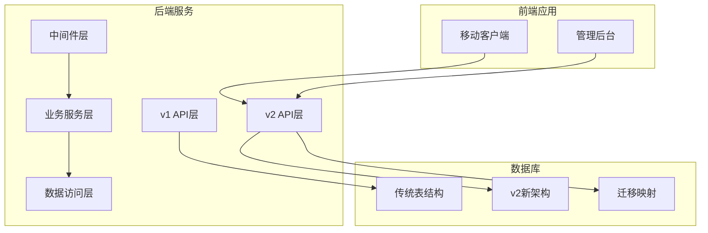
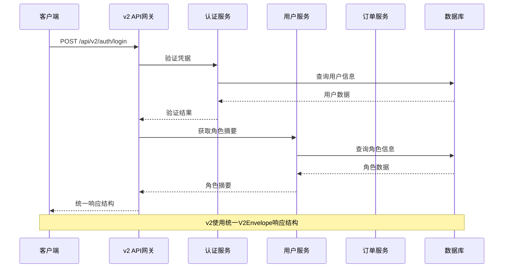
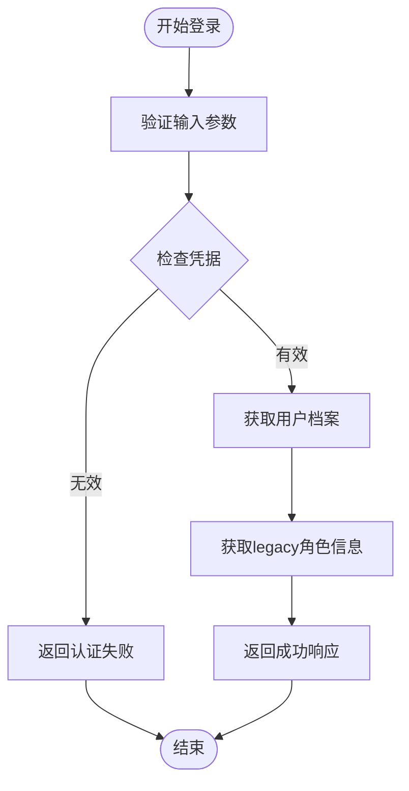
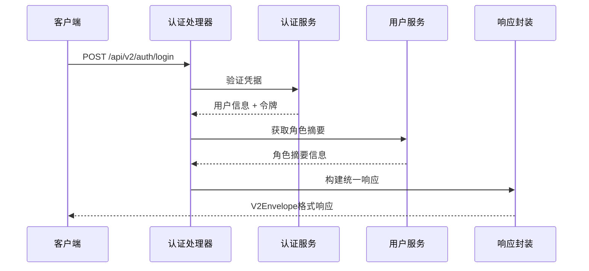
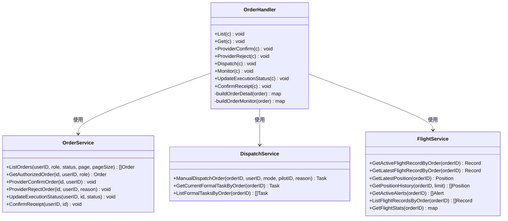
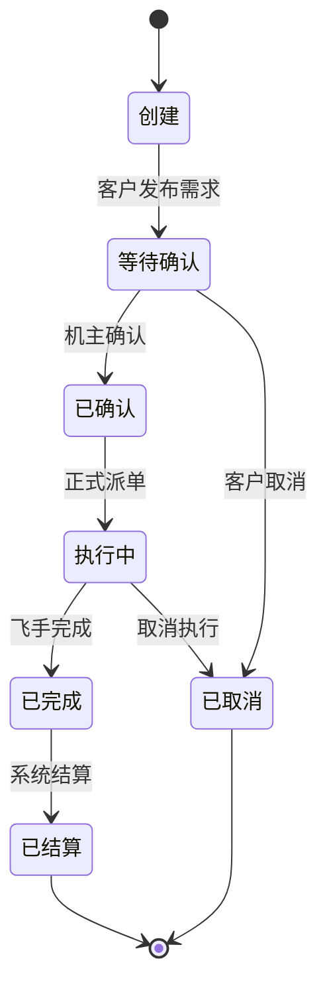
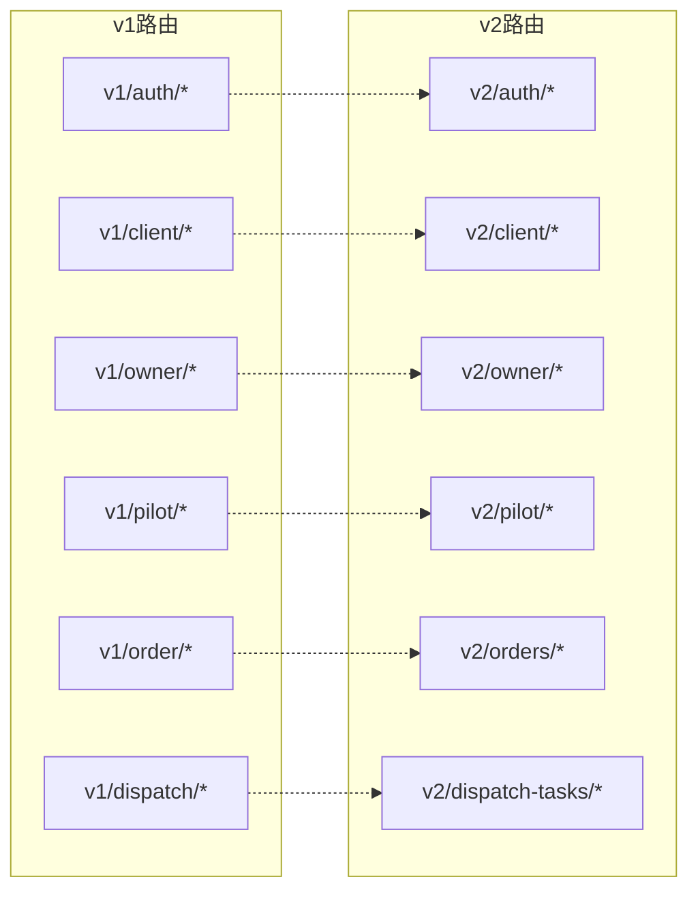

# v1到v2 API迁移指南

<cite>
**本文档引用的文件**
- [API_V1_V2_DIFF.md](file://backend/docs/API_V1_V2_DIFF.md)
- [PHASE9_MIGRATION_RUNBOOK.md](file://backend/docs/PHASE9_MIGRATION_RUNBOOK.md)
- [openapi-v2.yaml](file://backend/docs/openapi-v2.yaml)
- [router.go (v1)](file://backend/internal/api/v1/router.go)
- [router.go (v2)](file://backend/internal/api/v2/router.go)
- [v2.go (响应封装)](file://backend/internal/pkg/response/v2.go)
- [errors.go (v2错误处理)](file://backend/internal/api/v2/common/errors.go)
- [json.go (v2 JSON处理)](file://backend/internal/api/v2/common/json.go)
- [handler.go (v2认证)](file://backend/internal/api/v2/auth/handler.go)
- [handler.go (v2用户)](file://backend/internal/api/v2/me/handler.go)
- [handler.go (v2订单)](file://backend/internal/api/v2/order/handler.go)
- [main.go (迁移工具)](file://backend/cmd/migrate/main.go)
- [main.go (一致性检查)](file://backend/cmd/check_v2_parity/main.go)
- [api.ts (移动客户端)](file://mobile/src/services/api.ts)
- [api.ts (管理后台)](file://admin/src/services/api.ts)
</cite>

## 目录
1. [简介](#简介)
2. [项目结构概览](#项目结构概览)
3. [核心组件分析](#核心组件分析)
4. [架构概览](#架构概览)
5. [详细组件分析](#详细组件分析)
6. [依赖关系分析](#依赖关系分析)
7. [性能考虑](#性能考虑)
8. [故障排除指南](#故障排除指南)
9. [结论](#结论)

## 简介

本指南详细说明了无人机租赁平台从v1到v2 API的完整迁移过程。v2版本引入了统一的响应结构、清晰的业务对象边界和现代化的API设计，为平台提供了更好的可维护性和扩展性。

## 项目结构概览



**图表来源**
- [router.go (v1):58-634](file://backend/internal/api/v1/router.go#L58-L634)
- [router.go (v2):72-283](file://backend/internal/api/v2/router.go#L72-L283)

## 核心组件分析

### v1 API架构特点

v1版本采用传统的混合路由设计，将多种业务功能混合在同一API前缀下：

- **路由前缀**: `/api/v1`
- **响应结构**: 使用旧版`response.Success/Error`结构
- **业务边界**: 客户需求、供给、订单、派单等功能语义混杂
- **写入权限**: 核心业务写入仍可使用v1

### v2 API架构特点

v2版本实现了清晰的业务对象分离和统一的响应标准：

- **路由前缀**: `/api/v2`
- **响应结构**: 统一使用`V2Envelope`结构
- **业务边界**: 明确分离`demands`、`owner_supplies`、`orders`、`dispatch_tasks`、`flight_records`
- **鉴权机制**: 保持JWT鉴权，但初始化信息更加完善

**章节来源**
- [API_V1_V2_DIFF.md: 7-52:7-52](file://backend/docs/API_V1_V2_DIFF.md#L7-L52)

## 架构概览



**图表来源**
- [handler.go (v2认证):77-118](file://backend/internal/api/v2/auth/handler.go#L77-L118)
- [v2.go (响应封装):9-15](file://backend/internal/pkg/response/v2.go#L9-L15)

## 详细组件分析

### 认证与初始化流程

#### v1认证流程
v1版本的认证相对简单，主要通过手机号和密码进行登录：



#### v2认证流程
v2版本提供了更完善的认证体验，包括角色摘要和统一响应结构：



**图表来源**
- [handler.go (v2认证):77-118](file://backend/internal/api/v2/auth/handler.go#L77-L118)
- [v2.go (响应封装):39-74](file://backend/internal/pkg/response/v2.go#L39-L74)

**章节来源**
- [handler.go (v2认证):46-148](file://backend/internal/api/v2/auth/handler.go#L46-L148)
- [handler.go (v2用户):19-27](file://backend/internal/api/v2/me/handler.go#L19-L27)

### 订单处理流程

#### v2订单处理架构



**图表来源**
- [handler.go (v2订单):18-30](file://backend/internal/api/v2/order/handler.go#L18-L30)

#### 订单生命周期管理



**章节来源**
- [handler.go (v2订单):32-763](file://backend/internal/api/v2/order/handler.go#L32-L763)

### 响应结构对比

#### v1响应结构
v1版本使用混合的响应格式，不同接口可能返回不同的结构：

```javascript
// v1示例响应
{
  "code": 0,           // 0表示成功
  "message": "success",
  "data": {...},       // 具体业务数据
  "trace_id": "..."    // 追踪ID
}
```

#### v2统一响应结构
v2版本实现了统一的响应格式，所有接口遵循相同的结构：

```javascript
// v2统一响应
{
  "code": "OK",           // 统一错误码
  "message": "success",   // 统一消息
  "data": {...},         // 具体业务数据
  "meta": {...},         // 元数据信息
  "trace_id": "..."      // 追踪ID
}
```

**章节来源**
- [v2.go (响应封装):9-141](file://backend/internal/pkg/response/v2.go#L9-L141)

## 依赖关系分析

### API路由映射关系



**图表来源**
- [router.go (v1):65-597](file://backend/internal/api/v1/router.go#L65-L597)
- [router.go (v2):72-283](file://backend/internal/api/v2/router.go#L72-L283)

### 错误处理机制

#### v2错误码体系

| 错误码 | 描述 | 用途 |
|--------|------|------|
| OK | 成功 | 操作成功 |
| BAD_REQUEST | 参数错误 | 请求参数无效 |
| VALIDATION_ERROR | 校验错误 | 数据验证失败 |
| UNAUTHORIZED | 未授权 | 认证失败 |
| FORBIDDEN | 禁止访问 | 权限不足 |
| NOT_FOUND | 未找到 | 资源不存在 |
| CONFLICT | 冲突 | 数据冲突 |
| NOT_IMPLEMENTED | 未实现 | 功能暂未实现 |
| INTERNAL_ERROR | 内部错误 | 服务器错误 |

**章节来源**
- [v2.go (响应封装):27-37](file://backend/internal/pkg/response/v2.go#L27-L37)
- [errors.go (v2错误处理):13-35](file://backend/internal/api/v2/common/errors.go#L13-L35)

## 性能考虑

### 迁移性能优化策略

1. **双读校验**: 在迁移期间同时查询v1和v2数据，确保数据一致性
2. **渐进式切流**: 按功能模块逐步切换到v2，降低风险
3. **缓存策略**: 合理利用缓存减少数据库压力
4. **批量处理**: 对大量数据操作使用批量处理提高效率

### 性能监控指标

- **响应时间**: 监控API响应时间，确保v2性能不低于v1
- **并发处理**: 测试高并发场景下的系统表现
- **内存使用**: 监控内存使用情况，避免内存泄漏
- **数据库负载**: 监控数据库查询性能和连接数

## 故障排除指南

### 常见迁移问题及解决方案

#### 1. 认证失败问题
**问题描述**: 用户登录后无法获取角色摘要
**解决方案**:
- 检查用户档案是否正确创建
- 验证JWT令牌生成和验证流程
- 确认角色映射关系正确

#### 2. 数据不一致问题
**问题描述**: v1和v2数据显示不一致
**解决方案**:
- 运行双读校验工具检查数据一致性
- 检查迁移脚本执行状态
- 验证数据映射关系

#### 3. API兼容性问题
**问题描述**: 前端无法正确解析v2响应
**解决方案**:
- 检查前端响应拦截器逻辑
- 验证v2响应结构解析
- 确认错误码处理逻辑

### 迁移工具使用

#### 迁移执行工具
```bash
# 执行v2架构准备
go run ./cmd/migrate -config config.yaml -dir migrations -include 901

# 执行数据回填
go run ./cmd/migrate -config config.yaml -dir migrations -include 911

# 预览执行计划
go run ./cmd/migrate -config config.yaml -dir migrations -include 901,911 -dry-run
```

#### 数据一致性检查
```bash
# 运行双读校验
go run ./cmd/check_v2_parity -config config.yaml -limit 3
```

**章节来源**
- [PHASE9_MIGRATION_RUNBOOK.md: 26-51:26-51](file://backend/docs/PHASE9_MIGRATION_RUNBOOK.md#L26-L51)
- [main.go (迁移工具):25-87](file://backend/cmd/migrate/main.go#L25-L87)
- [main.go (一致性检查):89-145](file://backend/cmd/check_v2_parity/main.go#L89-L145)

## 结论

v1到v2 API迁移是一个复杂但有序的过程，需要充分的准备和谨慎的执行。通过本文档提供的详细指南，开发团队可以顺利完成迁移，享受v2版本带来的架构优势和性能提升。

关键成功因素包括：
- 充分理解v1和v2的差异
- 制定详细的迁移计划
- 充分测试和验证
- 建立完善的监控机制
- 准备应急回滚方案

迁移完成后，系统将具备更好的可维护性、扩展性和性能表现，为未来的业务发展奠定坚实基础。