# 个人资料管理API

<cite>
**本文档引用的文件**
- [backend/internal/api/v2/me/handler.go](file://backend/internal/api/v2/me/handler.go)
- [backend/internal/api/v2/client/handler.go](file://backend/internal/api/v2/client/handler.go)
- [backend/internal/api/v2/owner/handler.go](file://backend/internal/api/v2/owner/handler.go)
- [backend/internal/api/v2/pilot/handler.go](file://backend/internal/api/v2/pilot/handler.go)
- [backend/internal/service/user_service.go](file://backend/internal/service/user_service.go)
- [backend/internal/service/client_service.go](file://backend/internal/service/client_service.go)
- [backend/internal/service/owner_service.go](file://backend/internal/service/owner_service.go)
- [backend/internal/service/pilot_service.go](file://backend/internal/service/pilot_service.go)
- [backend/internal/model/models.go](file://backend/internal/model/models.go)
- [backend/internal/api/v2/common/errors.go](file://backend/internal/api/v2/common/errors.go)
- [backend/internal/pkg/response/response.go](file://backend/internal/pkg/response/response.go)
- [backend/internal/api/v2/router.go](file://backend/internal/api/v2/router.go)
- [backend/internal/api/middleware/auth.go](file://backend/internal/api/middleware/auth.go)
</cite>

## 目录
1. [简介](#简介)
2. [项目结构](#项目结构)
3. [核心组件](#核心组件)
4. [架构概览](#架构概览)
5. [详细组件分析](#详细组件分析)
6. [依赖关系分析](#依赖关系分析)
7. [性能考虑](#性能考虑)
8. [故障排除指南](#故障排除指南)
9. [结论](#结论)

## 简介

个人资料管理API是无人机租赁平台的核心模块之一，负责管理平台内所有用户角色的个人资料信息。该系统支持三种主要角色：Client（客户）、Owner（机主）和Pilot（飞手），每个角色都有独特的资料字段和权限控制。

系统采用分层架构设计，包含API层、业务逻辑层和服务层，确保代码的可维护性和扩展性。所有API请求都经过统一的身份验证和权限控制，确保数据安全和访问控制。

## 项目结构

个人资料管理API位于后端服务的v2版本中，采用按角色组织的模块结构：

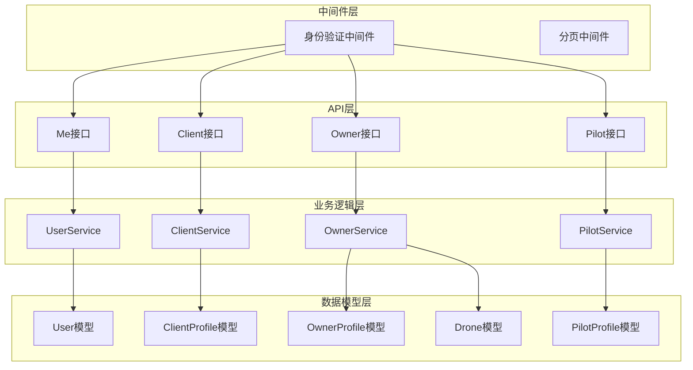

**图表来源**
- [backend/internal/api/v2/router.go:72-282](file://backend/internal/api/v2/router.go#L72-L282)
- [backend/internal/api/v2/me/handler.go:1-28](file://backend/internal/api/v2/me/handler.go#L1-L28)
- [backend/internal/api/v2/client/handler.go:1-57](file://backend/internal/api/v2/client/handler.go#L1-L57)
- [backend/internal/api/v2/owner/handler.go:1-760](file://backend/internal/api/v2/owner/handler.go#L1-L760)
- [backend/internal/api/v2/pilot/handler.go:1-541](file://backend/internal/api/v2/pilot/handler.go#L1-L541)

**章节来源**
- [backend/internal/api/v2/router.go:1-283](file://backend/internal/api/v2/router.go#L1-L283)

## 核心组件

### Me接口 - 初始化数据获取

Me接口为所有已登录用户提供统一的初始化数据获取功能，包括用户基本信息和角色摘要。

**接口定义：**
- 路径：`GET /api/v2/me`
- 权限：需要身份验证
- 功能：返回用户的个人资料和角色权限摘要

**数据结构：**
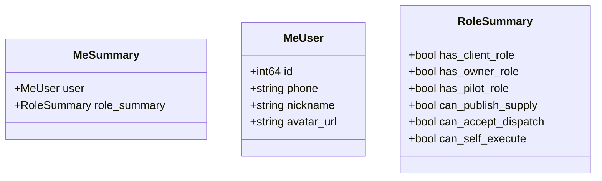

**图表来源**
- [backend/internal/service/user_service.go:12-31](file://backend/internal/service/user_service.go#L12-L31)

### Client角色 - 客户资料管理

Client角色提供完整的客户档案管理功能，包括个人客户和企业客户的差异化管理。

**核心功能：**
- 客户档案查询和更新
- 企业资质管理
- 征信查询和管理
- 货物申报管理

**数据模型：**
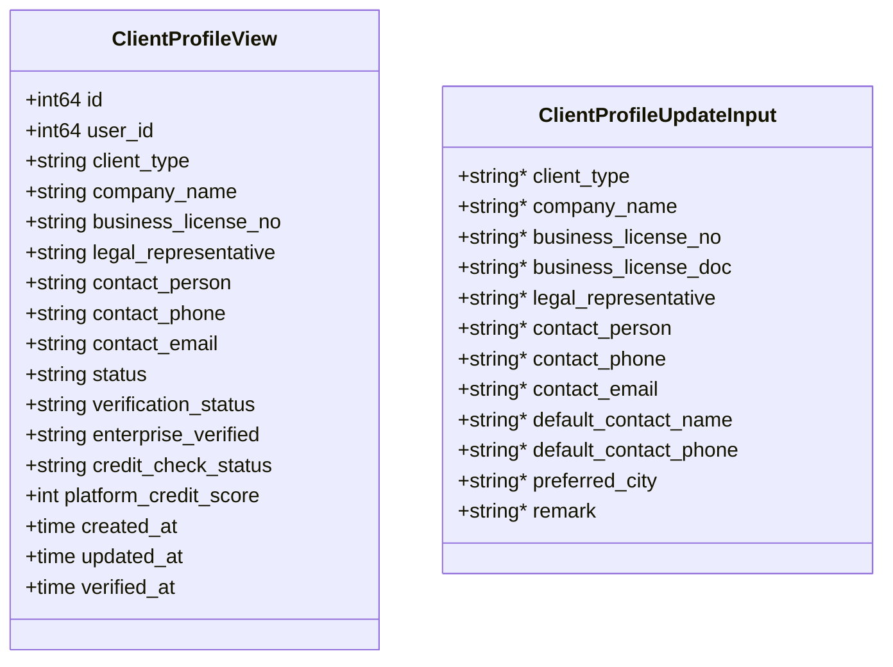

**图表来源**
- [backend/internal/service/client_service.go:57-80](file://backend/internal/service/client_service.go#L57-L80)
- [backend/internal/service/client_service.go:42-55](file://backend/internal/service/client_service.go#L42-L55)

### Owner角色 - 机主资料管理

Owner角色提供机主档案管理和无人机供给发布功能。

**核心功能：**
- 机主档案管理
- 无人机管理
- 供给发布和管理
- 飞手绑定管理
- 报价管理

**数据模型：**
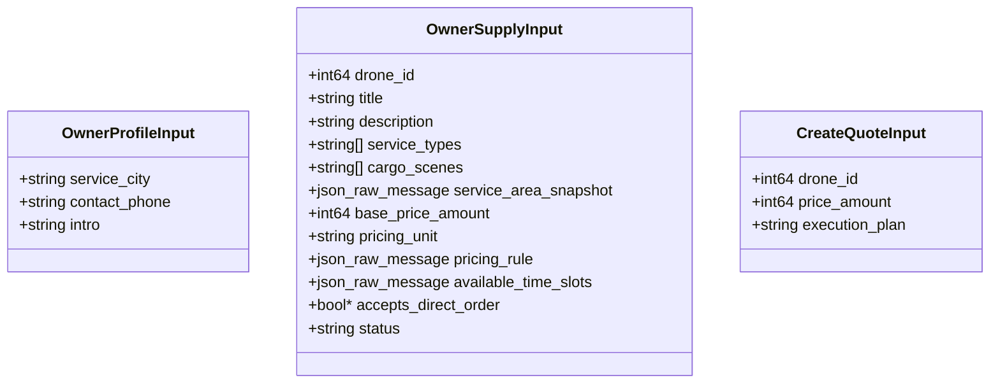

**图表来源**
- [backend/internal/service/owner_service.go:27-31](file://backend/internal/service/owner_service.go#L27-L31)
- [backend/internal/service/owner_service.go:41-60](file://backend/internal/service/owner_service.go#L41-L60)

### Pilot角色 - 飞手资料管理

Pilot角色提供飞手档案管理和任务接取功能。

**核心功能：**
- 飞手档案管理
- 接单状态管理
- 飞手绑定管理
- 候选需求管理
- 派单任务管理
- 飞行记录管理

**数据模型：**
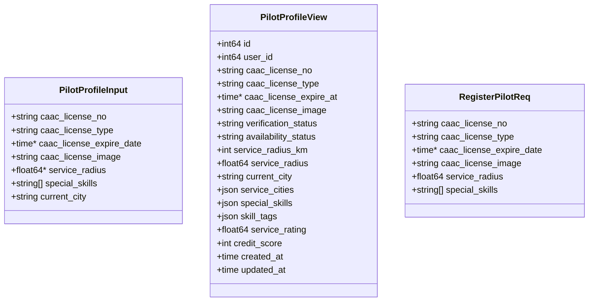

**图表来源**
- [backend/internal/service/pilot_service.go:92-121](file://backend/internal/service/pilot_service.go#L92-L121)
- [backend/internal/service/pilot_service.go:77-85](file://backend/internal/service/pilot_service.go#L77-L85)

**章节来源**
- [backend/internal/service/user_service.go:1-213](file://backend/internal/service/user_service.go#L1-L213)
- [backend/internal/service/client_service.go:1-780](file://backend/internal/service/client_service.go#L1-L780)
- [backend/internal/service/owner_service.go:1-818](file://backend/internal/service/owner_service.go#L1-L818)
- [backend/internal/service/pilot_service.go:1-1519](file://backend/internal/service/pilot_service.go#L1-L1519)

## 架构概览

系统采用分层架构设计，确保关注点分离和代码的可维护性：

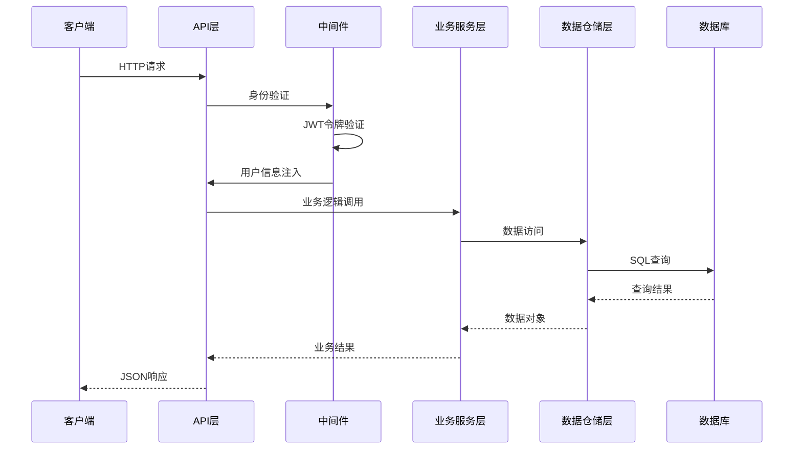

**图表来源**
- [backend/internal/api/v2/router.go:72-282](file://backend/internal/api/v2/router.go#L72-L282)
- [backend/internal/api/middleware/auth.go:22-61](file://backend/internal/api/middleware/auth.go#L22-L61)

### 错误处理机制

系统实现了统一的错误处理机制，支持多种HTTP状态码和错误类型：

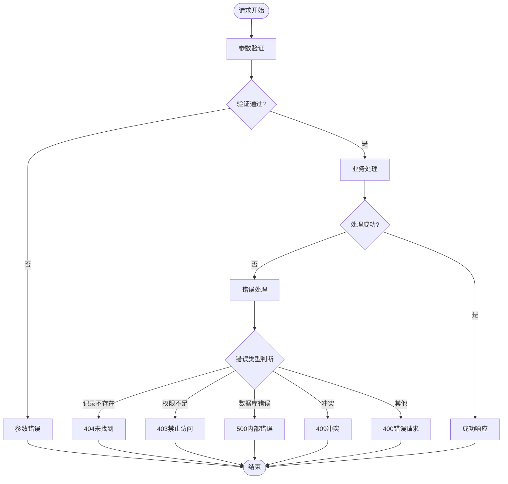

**图表来源**
- [backend/internal/api/v2/common/errors.go:13-35](file://backend/internal/api/v2/common/errors.go#L13-L35)
- [backend/internal/pkg/response/response.go:47-103](file://backend/internal/pkg/response/response.go#L47-L103)

**章节来源**
- [backend/internal/api/v2/common/errors.go:1-36](file://backend/internal/api/v2/common/errors.go#L1-L36)
- [backend/internal/pkg/response/response.go:1-104](file://backend/internal/pkg/response/response.go#L1-L104)

## 详细组件分析

### Me接口实现分析

Me接口作为系统的入口点，提供了统一的用户信息获取功能：

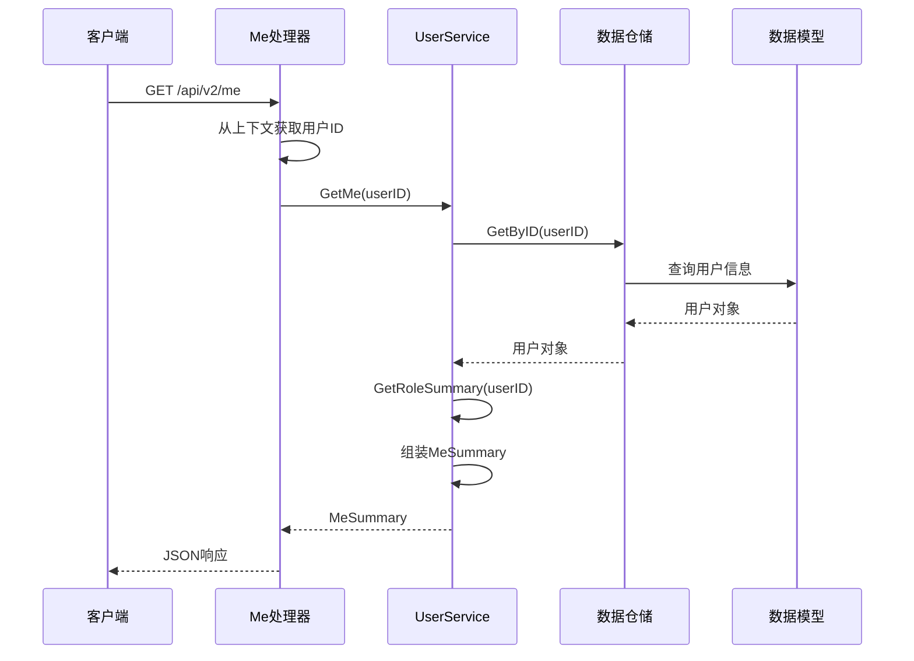

**图表来源**
- [backend/internal/api/v2/me/handler.go:19-27](file://backend/internal/api/v2/me/handler.go#L19-L27)
- [backend/internal/service/user_service.go:61-81](file://backend/internal/service/user_service.go#L61-L81)

**章节来源**
- [backend/internal/api/v2/me/handler.go:1-28](file://backend/internal/api/v2/me/handler.go#L1-L28)
- [backend/internal/service/user_service.go:61-147](file://backend/internal/service/user_service.go#L61-L147)

### Client接口实现分析

Client接口提供了完整的客户档案管理功能：

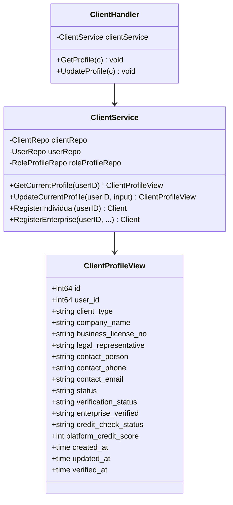

**图表来源**
- [backend/internal/api/v2/client/handler.go:12-18](file://backend/internal/api/v2/client/handler.go#L12-L18)
- [backend/internal/service/client_service.go:24-40](file://backend/internal/service/client_service.go#L24-L40)
- [backend/internal/service/client_service.go:232-247](file://backend/internal/service/client_service.go#L232-L247)

**章节来源**
- [backend/internal/api/v2/client/handler.go:1-57](file://backend/internal/api/v2/client/handler.go#L1-L57)
- [backend/internal/service/client_service.go:232-320](file://backend/internal/service/client_service.go#L232-L320)

### Owner接口实现分析

Owner接口提供了机主的完整管理功能：

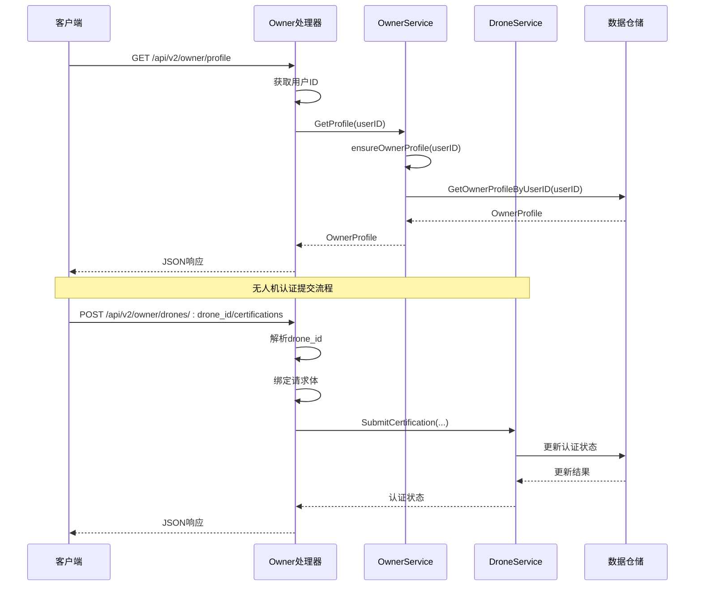

**图表来源**
- [backend/internal/api/v2/owner/handler.go:29-42](file://backend/internal/api/v2/owner/handler.go#L29-L42)
- [backend/internal/api/v2/owner/handler.go:158-258](file://backend/internal/api/v2/owner/handler.go#L158-L258)

**章节来源**
- [backend/internal/api/v2/owner/handler.go:29-258](file://backend/internal/api/v2/owner/handler.go#L29-L258)
- [backend/internal/service/owner_service.go:82-103](file://backend/internal/service/owner_service.go#L82-L103)

### Pilot接口实现分析

Pilot接口提供了飞手的完整管理功能：

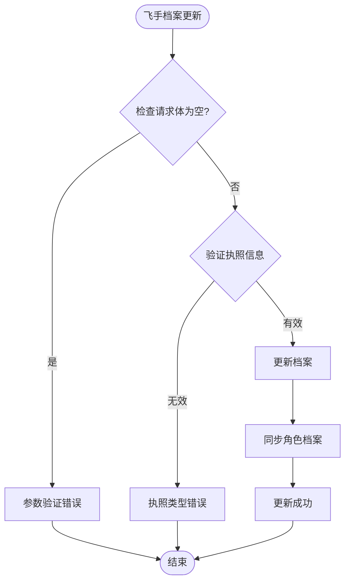

**图表来源**
- [backend/internal/api/v2/pilot/handler.go:39-62](file://backend/internal/api/v2/pilot/handler.go#L39-L62)
- [backend/internal/service/pilot_service.go:230-308](file://backend/internal/service/pilot_service.go#L230-L308)

**章节来源**
- [backend/internal/api/v2/pilot/handler.go:24-96](file://backend/internal/api/v2/pilot/handler.go#L24-L96)
- [backend/internal/service/pilot_service.go:218-308](file://backend/internal/service/pilot_service.go#L218-L308)

## 依赖关系分析

系统采用清晰的依赖关系设计，确保模块间的松耦合：

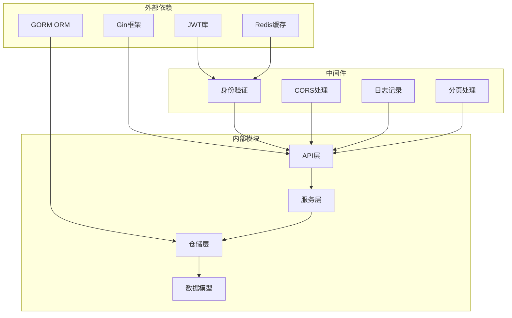

**图表来源**
- [backend/internal/api/middleware/auth.go:1-106](file://backend/internal/api/middleware/auth.go#L1-L106)
- [backend/internal/api/v2/router.go:1-283](file://backend/internal/api/v2/router.go#L1-L283)

### 数据模型关系

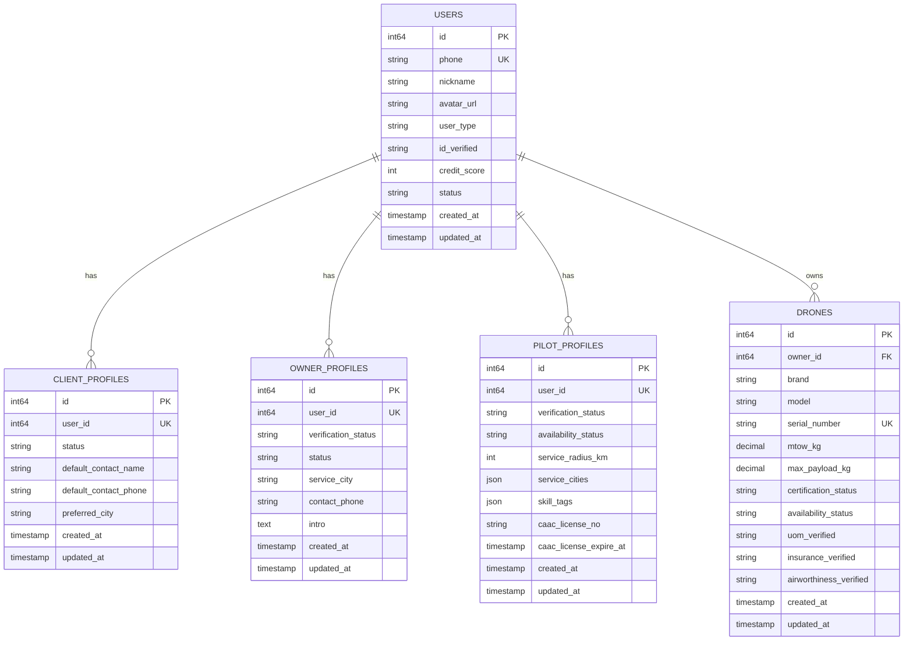

**图表来源**
- [backend/internal/model/models.go:9-26](file://backend/internal/model/models.go#L9-L26)
- [backend/internal/model/models.go:32-49](file://backend/internal/model/models.go#L32-L49)
- [backend/internal/model/models.go:51-68](file://backend/internal/model/models.go#L51-L68)
- [backend/internal/model/models.go:70-89](file://backend/internal/model/models.go#L70-L89)
- [backend/internal/model/models.go:91-152](file://backend/internal/model/models.go#L91-L152)

**章节来源**
- [backend/internal/model/models.go:1-200](file://backend/internal/model/models.go#L1-L200)

## 性能考虑

系统在设计时充分考虑了性能优化：

### 缓存策略
- Redis用于JWT令牌黑名单检查
- 分页中间件限制查询范围
- 数据模型预加载减少N+1查询

### 数据库优化
- 合理的索引设计（唯一索引、普通索引）
- 关联查询优化
- 批量操作支持

### API优化
- 统一的响应格式减少前端处理复杂度
- 错误处理标准化
- 请求参数验证提前执行

## 故障排除指南

### 常见问题及解决方案

**身份验证相关问题：**
- 缺少Authorization头部：检查JWT令牌格式
- 令牌格式错误：确保使用Bearer前缀
- 令牌过期：使用刷新令牌获取新令牌
- 令牌被撤销：检查Redis黑名单

**数据访问相关问题：**
- 记录不存在：检查用户ID和资源ID
- 权限不足：验证用户角色和资源所有权
- 数据库连接失败：检查数据库配置和连接池

**业务逻辑相关问题：**
- 参数验证失败：检查请求体格式和必填字段
- 业务规则违反：查看具体的业务约束条件
- 并发冲突：检查事务处理和锁机制

**章节来源**
- [backend/internal/api/middleware/auth.go:22-61](file://backend/internal/api/middleware/auth.go#L22-L61)
- [backend/internal/api/v2/common/errors.go:13-35](file://backend/internal/api/v2/common/errors.go#L13-L35)

## 结论

个人资料管理API系统设计合理，功能完整，具有良好的扩展性和维护性。系统通过清晰的分层架构、统一的错误处理机制和完善的权限控制，为无人机租赁平台提供了稳定可靠的个人资料管理能力。

主要特点包括：
- 支持三种角色的差异化管理
- 完整的CRUD操作支持
- 强大的权限控制机制
- 统一的错误处理和响应格式
- 良好的性能优化设计

未来可以考虑的功能增强包括：资料审核流程的进一步自动化、修改历史记录的详细追踪、多语言支持等。