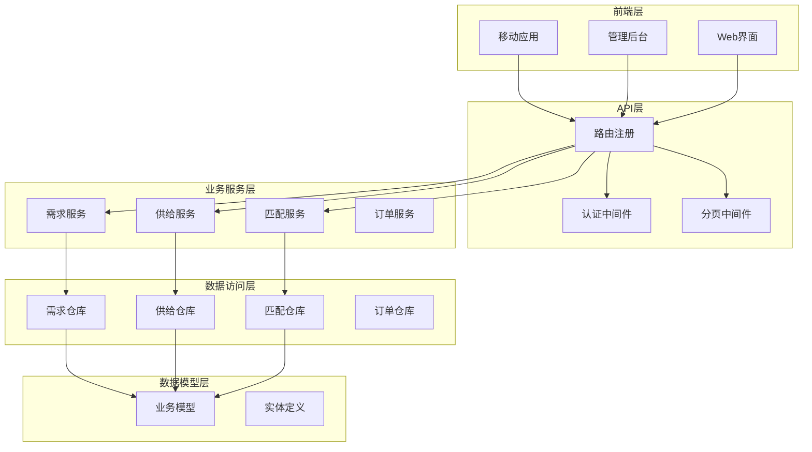
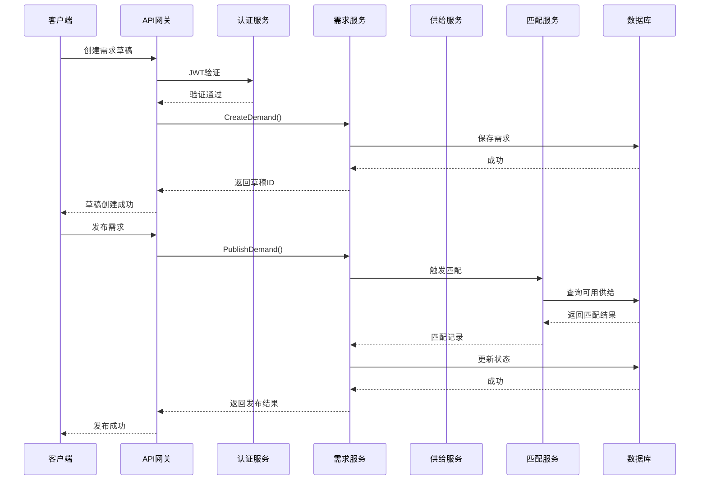
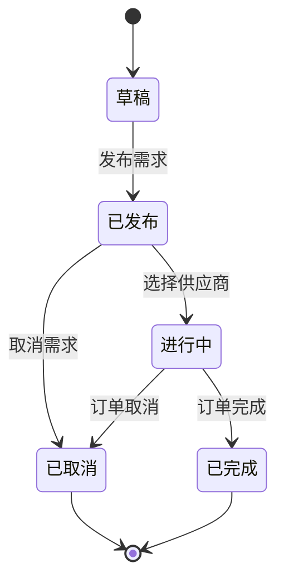
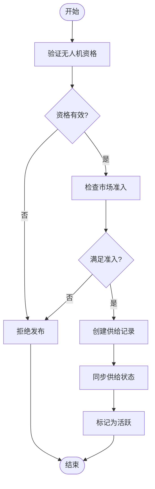
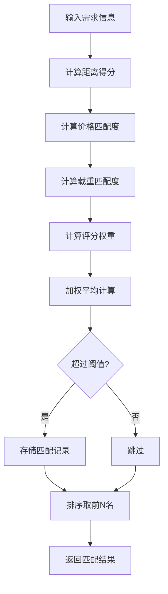
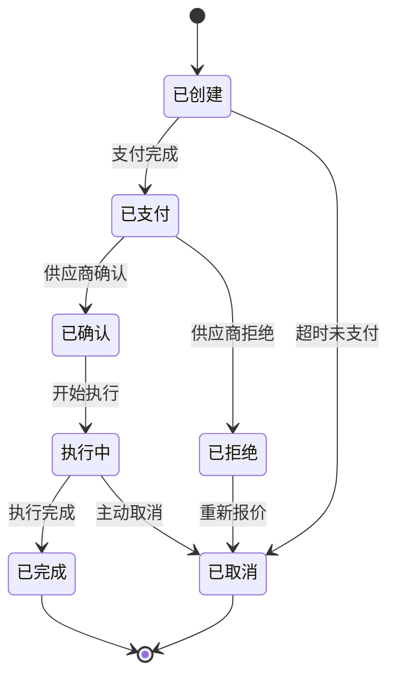
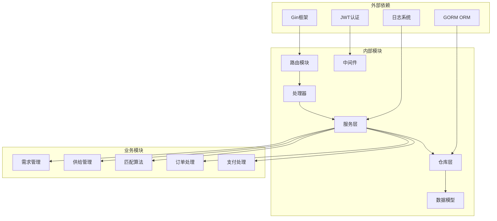

# 供需管理API

<cite>
**本文档引用的文件**
- [README.md](file://README.md)
- [openapi-v2.yaml](file://backend/docs/openapi-v2.yaml)
- [router.go](file://backend/internal/api/v2/router.go)
- [demand/handler.go](file://backend/internal/api/v2/demand/handler.go)
- [supply/handler.go](file://backend/internal/api/v2/supply/handler.go)
- [models.go](file://backend/internal/model/models.go)
- [demand_service.go](file://backend/internal/service/demand_service.go)
- [matching_service.go](file://backend/internal/service/matching_service.go)
</cite>

## 目录
1. [简介](#简介)
2. [项目结构](#项目结构)
3. [核心组件](#核心组件)
4. [架构概览](#架构概览)
5. [详细组件分析](#详细组件分析)
6. [依赖关系分析](#依赖关系分析)
7. [性能考虑](#性能考虑)
8. [故障排除指南](#故障排除指南)
9. [结论](#结论)

## 简介

供需管理API是无人机租赁平台的核心业务接口，负责管理需求发布、报价管理和供给发布等关键业务流程。该系统支持四类核心角色：客户、机主、飞手和复合身份，并实现了完整的供需匹配算法和订单执行流程。

系统基于Go语言开发，采用Gin框架构建RESTful API，支持JWT认证和权限控制。所有接口均通过OpenAPI v2规范进行文档化，确保前后端协作的一致性。

## 项目结构



**图表来源**
- [router.go:72-283](file://backend/internal/api/v2/router.go#L72-L283)
- [README.md:1-29](file://README.md#L1-L29)

**章节来源**
- [README.md:1-29](file://README.md#L1-L29)
- [router.go:72-283](file://backend/internal/api/v2/router.go#L72-L283)

## 核心组件

### 需求管理模块

需求管理模块负责处理客户需求的全生命周期管理，包括需求草稿创建、发布、取消、报价生成和供应商选择等功能。

**主要功能特性：**
- 支持多种服务类型（租赁、航拍、物流、农业）
- 多维度需求筛选和搜索
- 实时报价管理和排序
- 供应商匹配和推荐
- 飞手候选人池管理

### 供给管理模块

供给管理模块面向机主和飞手，提供无人机供给的发布和管理功能。

**核心能力：**
- 无人机供给信息维护
- 价格策略配置
- 可用时间管理
- 直接订单创建
- 供给状态监控

### 匹配算法引擎

系统内置智能匹配算法，基于多维度因素为供需双方提供精准匹配。

**匹配因子：**
- 距离权重（30%）
- 价格匹配度（20-40%）
- 载重能力匹配（10-30%）
- 评分等级（5-25%）
- 地区匹配度（25%）

**章节来源**
- [demand/handler.go:24-410](file://backend/internal/api/v2/demand/handler.go#L24-L410)
- [supply/handler.go:23-162](file://backend/internal/api/v2/supply/handler.go#L23-L162)
- [matching_service.go:54-178](file://backend/internal/service/matching_service.go#L54-L178)

## 架构概览



**图表来源**
- [router.go:107-120](file://backend/internal/api/v2/router.go#L107-L120)
- [demand/handler.go:24-133](file://backend/internal/api/v2/demand/handler.go#L24-L133)
- [matching_service.go:54-127](file://backend/internal/service/matching_service.go#L54-L127)

系统采用分层架构设计，确保各组件职责清晰、耦合度低：

**架构层次：**
1. **表现层**：HTTP API接口，处理请求和响应
2. **业务层**：核心业务逻辑和服务编排
3. **数据访问层**：数据库交互和事务管理
4. **基础设施层**：认证、日志、缓存等通用服务

**章节来源**
- [router.go:28-70](file://backend/internal/api/v2/router.go#L28-L70)
- [openapi-v2.yaml:29-800](file://backend/docs/openapi-v2.yaml#L29-L800)

## 详细组件分析

### 需求管理API详解

#### 需求生命周期管理



**状态转换规则：**
- 草稿状态：仅创建者可见，可随时修改
- 已发布状态：对所有符合条件的供应商开放
- 进行中状态：已选择供应商，进入订单执行阶段
- 已取消状态：需求终止，不可再接受报价

#### 核心接口定义

**需求创建接口**
- 方法：POST `/api/v2/demands`
- 权限：认证用户
- 请求体：需求基本信息（标题、描述、服务类型、时间要求等）
- 响应：返回新建的需求草稿ID

**需求发布接口**
- 方法：POST `/api/v2/demands/{demand_id}/publish`
- 权限：需求创建者
- 参数：demand_id（路径参数）
- 响应：返回发布后的状态信息

**报价管理接口**
- 列出报价：GET `/api/v2/demands/{demand_id}/quotes`
- 创建报价：POST `/api/v2/demands/{demand_id}/quotes`
- 选择供应商：POST `/api/v2/demands/{demand_id}/select-provider`

**章节来源**
- [demand/handler.go:14-410](file://backend/internal/api/v2/demand/handler.go#L14-L410)
- [openapi-v2.yaml:146-247](file://backend/docs/openapi-v2.yaml#L146-L247)

### 供给管理API详解

#### 供给发布流程



**准入条件：**
- 无人机最大起飞重量≥150kg
- 有效载荷≥50kg
- 可用状态为"available"
- 所有证件验证通过（适航、保险、UOM登记）

#### 供给查询接口

**市场供给查询**
- 方法：GET `/api/v2/supplies`
- 支持参数：region（地区）、cargo_scene（货物场景）、service_type（服务类型）、min_payload_kg（最小载重）、accepts_direct_order（接受直单）
- 分页支持：page、pageSize

**供给详情查询**
- 方法：GET `/api/v2/supplies/{supply_id}`
- 参数：supply_id（供给ID）

**直接订单创建**
- 方法：POST `/api/v2/supplies/{supply_id}/orders`
- 权限：认证用户
- 用途：跳过报价环节，直接创建订单

**章节来源**
- [supply/handler.go:23-162](file://backend/internal/api/v2/supply/handler.go#L23-L162)
- [models.go:169-199](file://backend/internal/model/models.go#L169-L199)

### 匹配算法详解

#### 供需匹配评分体系

系统采用加权评分算法，综合考虑多个匹配因素：

**评分权重分配：**
- 距离匹配：30%
- 价格匹配：20-40%
- 载重能力：10-30%
- 评分等级：5-25%
- 地区匹配：25%

**距离计算使用Haversine公式：**
```
a = sin²(Δφ/2) + cos φ₁ ⋅ cos φ₂ ⋅ sin²(Δλ/2)
c = 2 ⋅ atan2(√a, √(1−a))
d = R ⋅ c
```

其中R为地球半径（6371km）。

#### 匹配算法实现



**算法特点：**
- 支持多种需求类型（租赁需求、货运需求）
- 动态调整权重参数
- 实时计算和缓存优化
- 支持地理位置索引加速

**章节来源**
- [matching_service.go:378-463](file://backend/internal/service/matching_service.go#L378-L463)
- [matching_service.go:486-603](file://backend/internal/service/matching_service.go#L486-L603)

### 订单执行流程

#### 订单状态转换



**订单状态含义：**
- created：订单已创建
- paid：已支付
- confirmed：已确认
- rejected：已拒绝
- executing：执行中
- completed：已完成
- canceled：已取消

**章节来源**
- [models.go:413-480](file://backend/internal/model/models.go#L413-L480)
- [matching_service.go:265-328](file://backend/internal/service/matching_service.go#L265-L328)

## 依赖关系分析



**图表来源**
- [router.go:28-70](file://backend/internal/api/v2/router.go#L28-L70)
- [demand_service.go:13-23](file://backend/internal/service/demand_service.go#L13-L23)

**依赖特点：**
- 明确的分层架构，降低模块间耦合
- 统一的错误处理和日志记录
- 标准化的数据访问模式
- 可扩展的服务发现机制

**章节来源**
- [router.go:1-283](file://backend/internal/api/v2/router.go#L1-L283)
- [demand_service.go:1-343](file://backend/internal/service/demand_service.go#L1-L343)

## 性能考虑

### 缓存策略

系统采用多层次缓存机制：
- **Redis缓存**：热点数据缓存（用户信息、供给列表、匹配结果）
- **数据库连接池**：优化数据库访问性能
- **内存缓存**：频繁访问的静态配置数据

### 查询优化

**索引策略：**
- 用户ID、状态字段建立复合索引
- 地理位置坐标建立空间索引
- 时间字段建立时间索引
- 关键业务字段建立唯一索引

**查询优化：**
- 使用预加载避免N+1查询问题
- 实现分页查询避免大数据量传输
- 缓存常用查询结果

### 并发处理

**限流机制：**
- API请求频率限制
- 数据库连接数限制
- 内存使用限制

**并发控制：**
- 事务隔离级别设置
- 死锁检测和预防
- 超时控制和重试机制

## 故障排除指南

### 常见错误类型

**认证相关错误：**
- 401 Unauthorized：JWT令牌无效或过期
- 403 Forbidden：权限不足
- 401 Token Expired：令牌过期需要刷新

**业务逻辑错误：**
- 400 Validation Error：请求参数验证失败
- 404 Not Found：资源不存在
- 409 Conflict：业务状态冲突

**系统错误：**
- 500 Internal Server Error：服务器内部错误
- 503 Service Unavailable：服务暂时不可用

### 调试建议

**日志分析：**
- 启用详细日志记录
- 监控关键指标（响应时间、错误率）
- 分析慢查询和异常请求

**性能监控：**
- 数据库查询性能分析
- API响应时间监控
- 内存和CPU使用情况

**章节来源**
- [demand/handler.go:32-41](file://backend/internal/api/v2/demand/handler.go#L32-L41)
- [supply/handler.go:32-47](file://backend/internal/api/v2/supply/handler.go#L32-L47)

## 结论

供需管理API提供了完整的无人机租赁平台业务解决方案，具有以下优势：

**技术优势：**
- 清晰的分层架构设计
- 完善的错误处理和日志系统
- 高性能的数据库访问模式
- 可扩展的服务发现机制

**业务优势：**
- 支持多种业务场景和角色
- 智能匹配算法提升交易效率
- 完整的订单生命周期管理
- 严格的安全和权限控制

**未来发展：**
- 持续优化匹配算法精度
- 扩展更多服务类型支持
- 增强数据分析和报表功能
- 提升移动端用户体验

该系统为无人机租赁行业的数字化转型提供了坚实的技术基础，能够有效提升供需匹配效率，降低运营成本，改善用户体验。