# 支付与结算API

<cite>
**本文档引用的文件**
- [backend/internal/api/v1/payment/handler.go](file://backend/internal/api/v1/payment/handler.go)
- [backend/internal/api/v2/payment/handler.go](file://backend/internal/api/v2/payment/handler.go)
- [backend/internal/service/payment_service.go](file://backend/internal/service/payment_service.go)
- [backend/internal/pkg/payment/payment.go](file://backend/internal/pkg/payment/payment.go)
- [backend/internal/pkg/payment/providers.go](file://backend/internal/pkg/payment/providers.go)
- [backend/internal/repository/payment_repo.go](file://backend/internal/repository/payment_repo.go)
- [backend/internal/api/v1/settlement/handler.go](file://backend/internal/api/v1/settlement/handler.go)
- [backend/internal/service/settlement_service.go](file://backend/internal/service/settlement_service.go)
- [backend/internal/repository/settlement_repo.go](file://backend/internal/repository/settlement_repo.go)
- [backend/internal/api/v2/router.go](file://backend/internal/api/v2/router.go)
- [backend/migrations/011_add_settlement_tables.sql](file://backend/migrations/011_add_settlement_tables.sql)
- [backend/docs/openapi-v2.yaml](file://backend/docs/openapi-v2.yaml)
</cite>

## 目录
1. [简介](#简介)
2. [项目结构](#项目结构)
3. [核心组件](#核心组件)
4. [架构概览](#架构概览)
5. [详细组件分析](#详细组件分析)
6. [依赖关系分析](#依赖关系分析)
7. [性能考虑](#性能考虑)
8. [故障排除指南](#故障排除指南)
9. [结论](#结论)
10. [附录](#附录)

## 简介

本项目是一个无人机租赁平台，提供了完整的支付与结算API解决方案。系统支持多种支付渠道集成（微信支付、支付宝），具备完善的预存款管理、分账结算、退款处理等功能。系统采用模块化设计，通过清晰的分层架构实现了支付流程的完整闭环。

主要功能特性包括：
- 在线支付：支持微信支付、支付宝等多种支付方式
- 预存款管理：提供钱包系统和提现功能
- 分账结算：自动计算平台、飞手、机主之间的收益分配
- 退款处理：完整的退款流程管理和状态跟踪
- 支付状态同步：实时监控和处理支付回调
- 资金安全：多重安全机制保障交易安全
- 合规要求：满足金融行业标准和监管要求

## 项目结构

系统采用分层架构设计，主要分为以下层次：

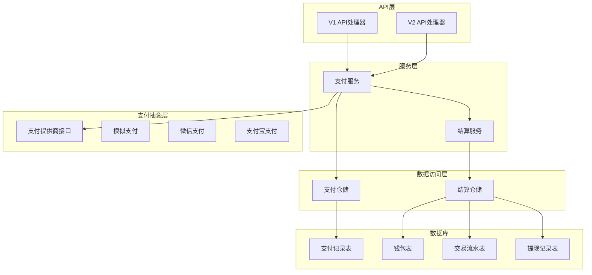

**图表来源**
- [backend/internal/api/v1/payment/handler.go:13-19](file://backend/internal/api/v1/payment/handler.go#L13-L19)
- [backend/internal/api/v2/payment/handler.go:15-25](file://backend/internal/api/v2/payment/handler.go#L15-L25)
- [backend/internal/service/payment_service.go:15-45](file://backend/internal/service/payment_service.go#L15-L45)
- [backend/internal/service/settlement_service.go:15-23](file://backend/internal/service/settlement_service.go#L15-L23)

**章节来源**
- [backend/internal/api/v1/payment/handler.go:1-118](file://backend/internal/api/v1/payment/handler.go#L1-L118)
- [backend/internal/api/v2/payment/handler.go:1-218](file://backend/internal/api/v2/payment/handler.go#L1-L218)
- [backend/internal/api/v2/router.go:72-182](file://backend/internal/api/v2/router.go#L72-L182)

## 核心组件

### 支付组件

支付系统的核心组件包括支付处理器、支付服务、支付提供商和支付仓储。

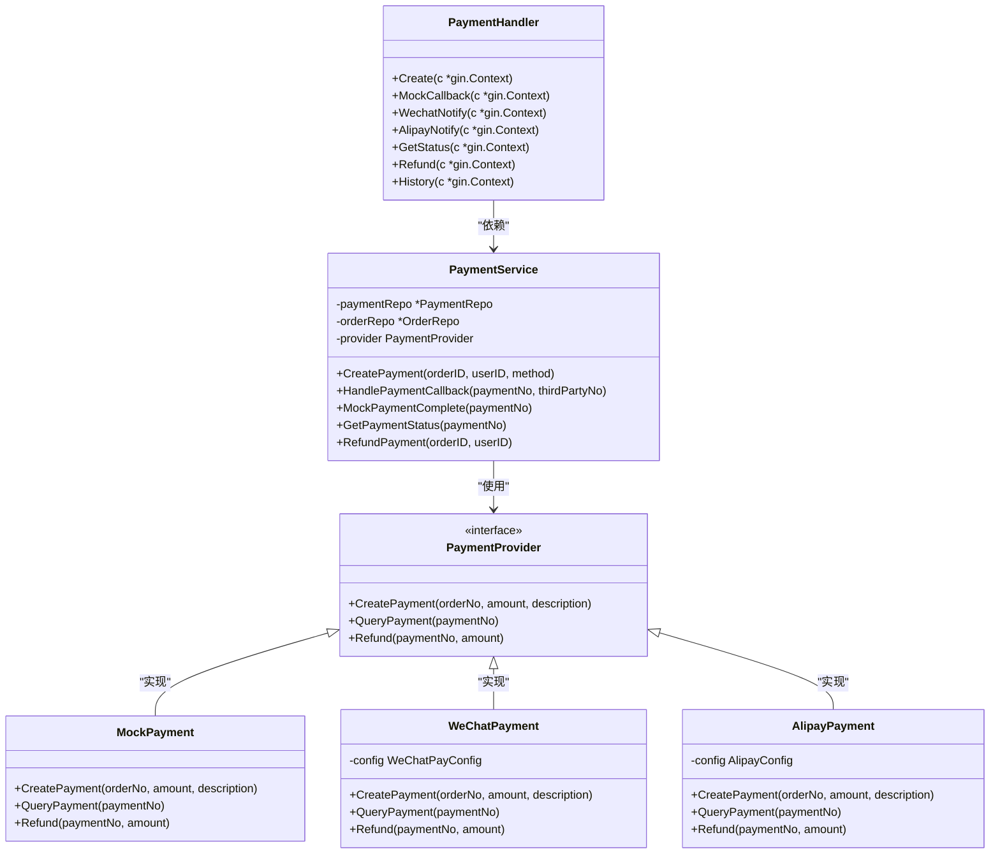

**图表来源**
- [backend/internal/api/v1/payment/handler.go:13-42](file://backend/internal/api/v1/payment/handler.go#L13-L42)
- [backend/internal/service/payment_service.go:15-92](file://backend/internal/service/payment_service.go#L15-L92)
- [backend/internal/pkg/payment/payment.go:11-31](file://backend/internal/pkg/payment/payment.go#L11-L31)
- [backend/internal/pkg/payment/providers.go:32-145](file://backend/internal/pkg/payment/providers.go#L32-L145)

### 结算组件

结算系统提供完整的财务结算功能，包括定价计算、分账处理、钱包管理和提现功能。

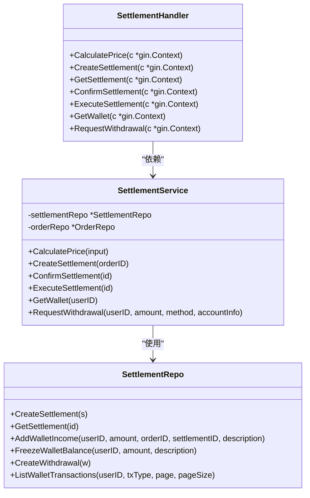

**图表来源**
- [backend/internal/api/v1/settlement/handler.go:11-90](file://backend/internal/api/v1/settlement/handler.go#L11-L90)
- [backend/internal/service/settlement_service.go:15-53](file://backend/internal/service/settlement_service.go#L15-L53)
- [backend/internal/repository/settlement_repo.go:12-46](file://backend/internal/repository/settlement_repo.go#L12-L46)

**章节来源**
- [backend/internal/service/payment_service.go:1-489](file://backend/internal/service/payment_service.go#L1-L489)
- [backend/internal/service/settlement_service.go:1-538](file://backend/internal/service/settlement_service.go#L1-L538)

## 架构概览

系统采用事件驱动的异步架构，支付回调触发订单状态转换和结算流程。

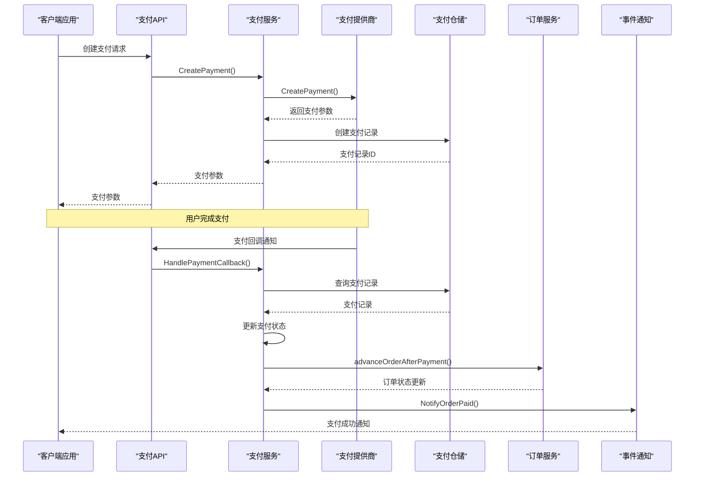

**图表来源**
- [backend/internal/api/v1/payment/handler.go:26-42](file://backend/internal/api/v1/payment/handler.go#L26-L42)
- [backend/internal/service/payment_service.go:94-143](file://backend/internal/service/payment_service.go#L94-L143)
- [backend/internal/service/payment_service.go:344-407](file://backend/internal/service/payment_service.go#L344-L407)

## 详细组件分析

### 支付流程组件

#### 支付创建流程

支付创建流程是整个支付系统的核心入口，负责生成支付订单并返回客户端支付参数。

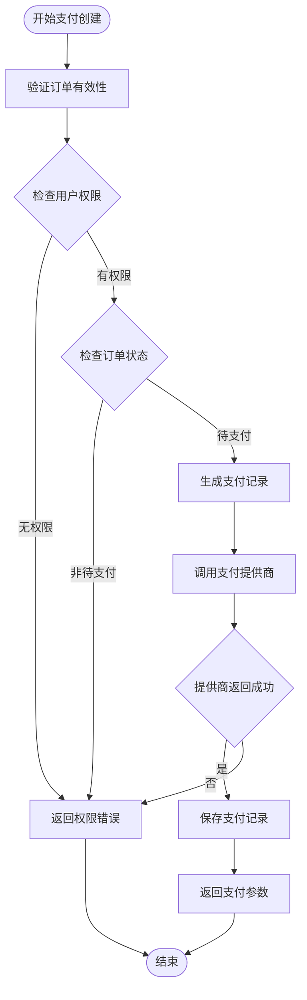

**图表来源**
- [backend/internal/service/payment_service.go:55-92](file://backend/internal/service/payment_service.go#L55-L92)

#### 支付回调处理流程

支付回调处理流程负责处理来自支付提供商的回调通知，确保支付状态的一致性。

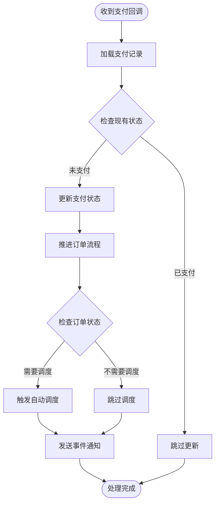

**图表来源**
- [backend/internal/service/payment_service.go:94-143](file://backend/internal/service/payment_service.go#L94-L143)
- [backend/internal/service/payment_service.go:466-488](file://backend/internal/service/payment_service.go#L466-L488)

#### 退款处理流程

退款处理流程提供完整的退款管理功能，包括退款申请、处理和状态跟踪。

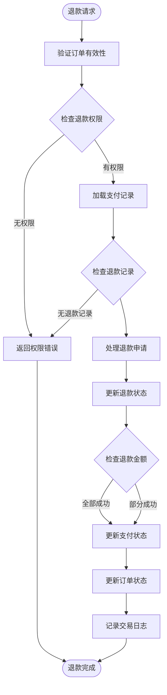

**图表来源**
- [backend/internal/service/payment_service.go:154-342](file://backend/internal/service/payment_service.go#L154-L342)

**章节来源**
- [backend/internal/api/v1/payment/handler.go:26-117](file://backend/internal/api/v1/payment/handler.go#L26-L117)
- [backend/internal/api/v2/payment/handler.go:27-172](file://backend/internal/api/v2/payment/handler.go#L27-L172)

### 结算组件

#### 定价计算引擎

结算系统内置智能定价引擎，支持多种定价策略和动态调整。

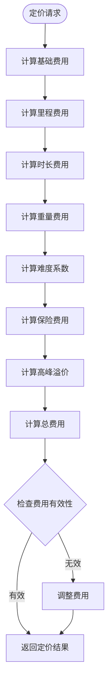

**图表来源**
- [backend/internal/service/settlement_service.go:56-101](file://backend/internal/service/settlement_service.go#L56-L101)

#### 分账结算流程

分账结算流程自动计算平台、飞手、机主之间的收益分配，并执行资金划转。

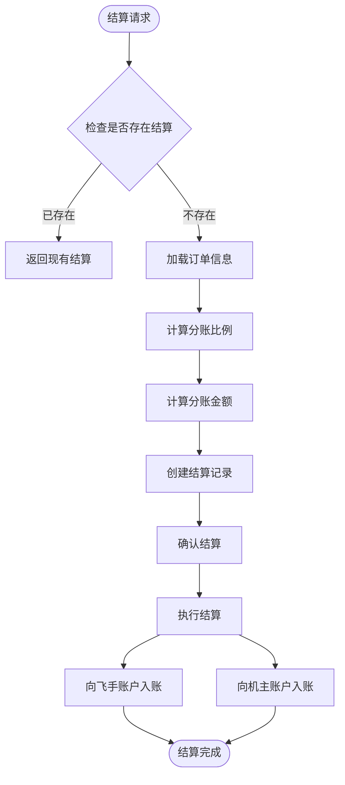

**图表来源**
- [backend/internal/service/settlement_service.go:219-285](file://backend/internal/service/settlement_service.go#L219-L285)
- [backend/internal/service/settlement_service.go:304-346](file://backend/internal/service/settlement_service.go#L304-L346)

**章节来源**
- [backend/internal/api/v1/settlement/handler.go:34-187](file://backend/internal/api/v1/settlement/handler.go#L34-L187)
- [backend/internal/service/settlement_service.go:25-538](file://backend/internal/service/settlement_service.go#L25-L538)

### 支付提供商集成

系统支持多种支付提供商，通过统一的接口抽象实现灵活的支付渠道选择。

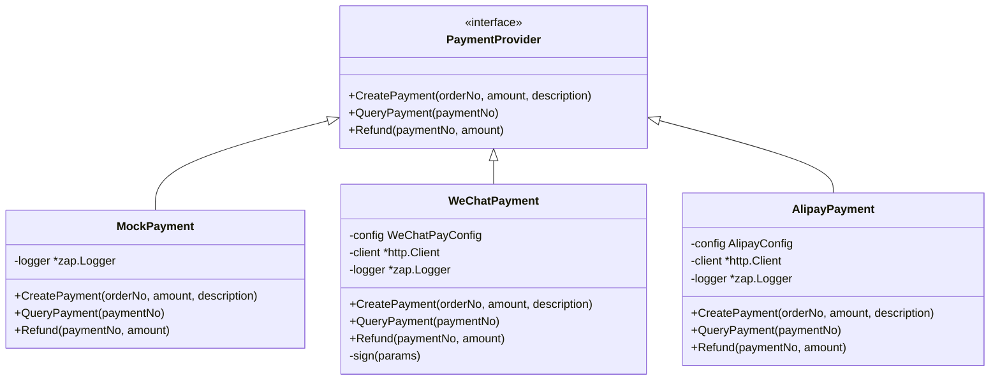

**图表来源**
- [backend/internal/pkg/payment/payment.go:11-78](file://backend/internal/pkg/payment/payment.go#L11-L78)
- [backend/internal/pkg/payment/providers.go:32-290](file://backend/internal/pkg/payment/providers.go#L32-L290)

**章节来源**
- [backend/internal/pkg/payment/payment.go:1-78](file://backend/internal/pkg/payment/payment.go#L1-L78)
- [backend/internal/pkg/payment/providers.go:1-290](file://backend/internal/pkg/payment/providers.go#L1-L290)

## 依赖关系分析

系统采用清晰的依赖层次结构，确保各组件之间的松耦合和高内聚。

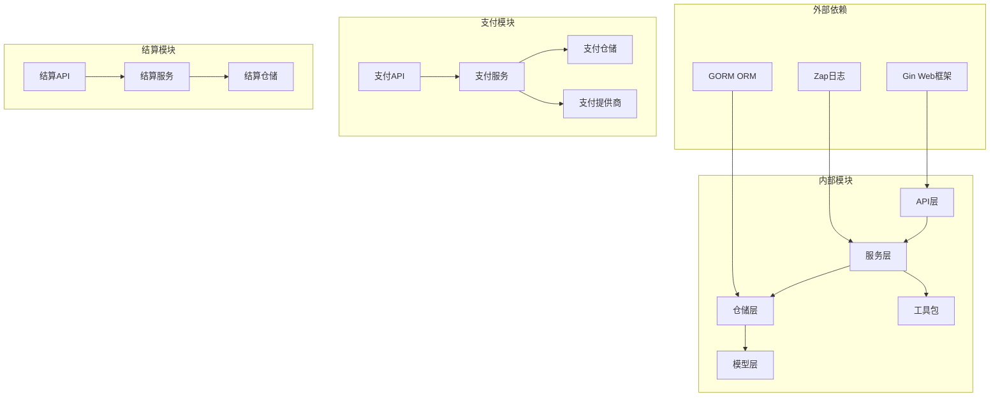

**图表来源**
- [backend/internal/service/payment_service.go:1-25](file://backend/internal/service/payment_service.go#L1-L25)
- [backend/internal/service/settlement_service.go:1-23](file://backend/internal/service/settlement_service.go#L1-L23)

**章节来源**
- [backend/internal/api/v2/router.go:49-70](file://backend/internal/api/v2/router.go#L49-L70)

## 性能考虑

系统在设计时充分考虑了性能优化，采用了多种策略来提升响应速度和吞吐量：

### 数据库优化
- 使用索引优化查询性能，特别是在高频查询字段上建立适当索引
- 采用分页查询避免大量数据一次性加载
- 实现连接池管理数据库连接资源

### 缓存策略
- 支付状态缓存减少重复查询
- 定价配置缓存提升计算效率
- 结果缓存避免重复计算

### 异步处理
- 支付回调异步处理避免阻塞主线程
- 结算批量处理提升处理效率
- 事件通知异步发送

### 并发控制
- 支付并发控制防止重复支付
- 退款并发控制确保资金安全
- 事务边界明确保证数据一致性

## 故障排除指南

### 支付相关问题

**问题：支付回调未生效**
- 检查支付提供商回调地址配置
- 验证回调签名验证逻辑
- 查看支付状态是否已更新

**问题：退款失败**
- 检查退款金额是否超过支付金额
- 验证退款状态是否正确流转
- 查看支付提供商返回的错误信息

**问题：订单状态异常**
- 检查支付回调处理日志
- 验证订单状态转换逻辑
- 确认事件通知是否正常发送

### 结算相关问题

**问题：分账金额计算错误**
- 检查定价配置参数
- 验证分账比例设置
- 确认订单金额准确性

**问题：钱包余额异常**
- 查看钱包流水记录
- 检查冻结余额解冻逻辑
- 验证提现处理流程

**问题：提现处理超时**
- 检查提现状态流转
- 验证第三方支付接口
- 查看系统日志定位问题

**章节来源**
- [backend/internal/service/payment_service.go:275-282](file://backend/internal/service/payment_service.go#L275-L282)
- [backend/internal/service/settlement_service.go:318-332](file://backend/internal/service/settlement_service.go#L318-L332)

## 结论

本支付与结算API系统提供了完整的财务处理解决方案，具有以下优势：

1. **模块化设计**：清晰的分层架构便于维护和扩展
2. **多渠道支持**：灵活的支付提供商集成机制
3. **安全保障**：多重安全机制确保交易安全
4. **合规性**：符合金融行业标准和监管要求
5. **性能优化**：高效的数据库设计和缓存策略

系统通过事件驱动的异步架构实现了支付流程的完整闭环，为无人机租赁平台提供了可靠的财务基础设施。

## 附录

### API端点概览

系统提供以下主要API端点：

**支付相关端点**
- `POST /api/v2/orders/:order_id/pay` - 创建订单支付
- `GET /api/v2/orders/:order_id/payments` - 查询订单支付记录
- `POST /api/v2/orders/:order_id/refund` - 申请订单退款
- `GET /api/v2/orders/:order_id/refunds` - 查询订单退款记录

**结算相关端点**
- `POST /api/v1/settlement/pricing/calculate` - 计算订单价格
- `POST /api/v1/settlement/create` - 创建订单结算
- `POST /api/v1/settlement/confirm` - 确认结算
- `POST /api/v1/settlement/execute` - 执行结算

**钱包相关端点**
- `GET /api/v1/settlement/wallet` - 获取钱包余额
- `GET /api/v1/settlement/wallet/transactions` - 查询钱包流水
- `POST /api/v1/settlement/withdrawal` - 申请提现
- `GET /api/v1/settlement/withdrawals` - 查询提现记录

### 数据模型

系统使用以下核心数据模型：

**支付模型**
- Payment：支付记录
- Refund：退款记录
- Order：订单信息

**结算模型**
- OrderSettlement：订单结算
- UserWallet：用户钱包
- WalletTransaction：钱包交易流水
- WithdrawalRecord：提现记录

**章节来源**
- [backend/migrations/011_add_settlement_tables.sql:54-111](file://backend/migrations/011_add_settlement_tables.sql#L54-L111)
- [backend/docs/openapi-v2.yaml:1-200](file://backend/docs/openapi-v2.yaml#L1-L200)