# 派单与飞行监控API

<cite>
**本文档引用的文件**
- [backend/internal/api/v1/dispatch/handler.go](file://backend/internal/api/v1/dispatch/handler.go)
- [backend/internal/api/v1/flight/handler.go](file://backend/internal/api/v1/flight/handler.go)
- [backend/internal/api/v1/pilot/handler.go](file://backend/internal/api/v1/pilot/handler.go)
- [backend/internal/api/v1/drone/handler.go](file://backend/internal/api/v1/drone/handler.go)
- [backend/internal/service/dispatch_service.go](file://backend/internal/service/dispatch_service.go)
- [backend/internal/service/flight_service.go](file://backend/internal/service/flight_service.go)
- [backend/internal/repository/flight_repo.go](file://backend/internal/repository/flight_repo.go)
- [backend/internal/websocket/hub.go](file://backend/internal/websocket/hub.go)
- [backend/docs/openapi-v2.yaml](file://backend/docs/openapi-v2.yaml)
- [backend/internal/model/models.go](file://backend/internal/model/models.go)
</cite>

## 目录
1. [项目概述](#项目概述)
2. [系统架构](#系统架构)
3. [核心组件](#核心组件)
4. [派单任务管理](#派单任务管理)
5. [飞手调度系统](#飞手调度系统)
6. [实时飞行监控](#实时飞行监控)
7. [电子围栏与安全规则](#电子围栏与安全规则)
8. [WebSocket实时通信](#websocket实时通信)
9. [异常处理机制](#异常处理机制)
10. [性能优化建议](#性能优化建议)
11. [故障排除指南](#故障排除指南)
12. [总结](#总结)

## 项目概述

无人机租赁平台的派单与飞行监控API提供了完整的无人机配送服务解决方案。该系统集成了智能派单算法、实时飞行监控、电子围栏管理和WebSocket实时通信功能，为无人机物流配送提供全方位的技术支持。

### 主要功能特性

- **智能派单算法**：基于多维度评分的飞手-无人机匹配系统
- **实时飞行监控**：GPS定位跟踪、飞行状态监控、异常告警
- **电子围栏管理**：禁飞区、限飞区的智能检测与管理
- **实时通信**：WebSocket推送通知、消息广播
- **轨迹录制**：飞行轨迹自动记录与分析
- **安全规则**：多重安全阈值控制与违规检测

## 系统架构

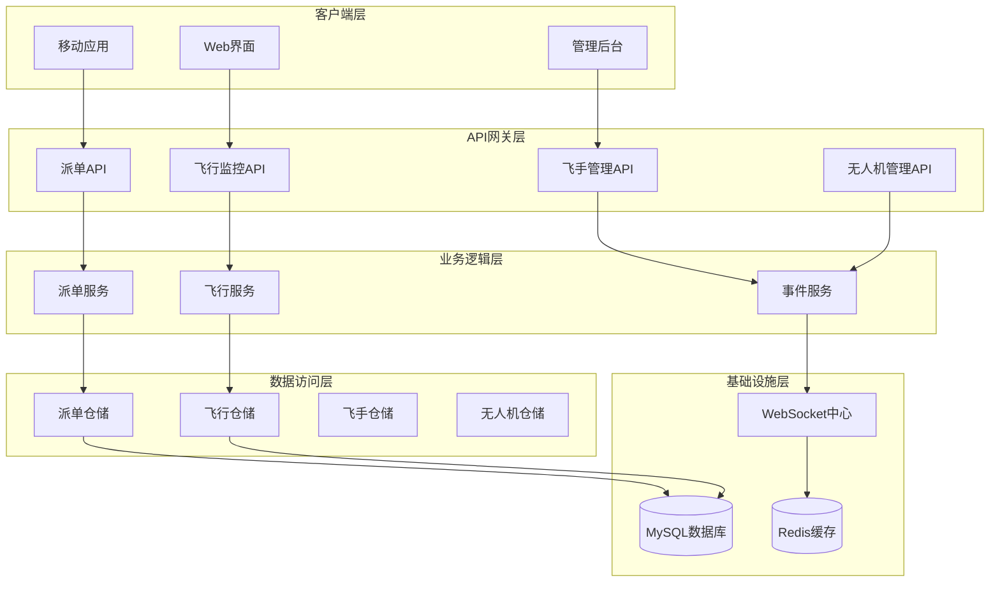

**图表来源**
- [backend/internal/api/v1/dispatch/handler.go:18-46](file://backend/internal/api/v1/dispatch/handler.go#L18-L46)
- [backend/internal/api/v1/flight/handler.go:16-27](file://backend/internal/api/v1/flight/handler.go#L16-L27)
- [backend/internal/service/dispatch_service.go:17-29](file://backend/internal/service/dispatch_service.go#L17-L29)
- [backend/internal/service/flight_service.go:17-26](file://backend/internal/service/flight_service.go#L17-L26)

## 核心组件

### 派单API处理器

派单API处理器负责处理所有与派单相关的HTTP请求，包括任务创建、飞手调度、订单管理等功能。

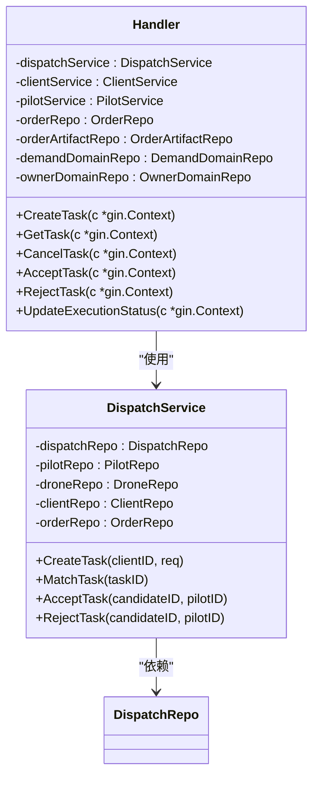

**图表来源**
- [backend/internal/api/v1/dispatch/handler.go:18-46](file://backend/internal/api/v1/dispatch/handler.go#L18-L46)
- [backend/internal/service/dispatch_service.go:17-29](file://backend/internal/service/dispatch_service.go#L17-L29)

### 飞行监控API处理器

飞行监控API处理器专门处理无人机飞行过程中的位置上报、轨迹记录、告警管理等功能。

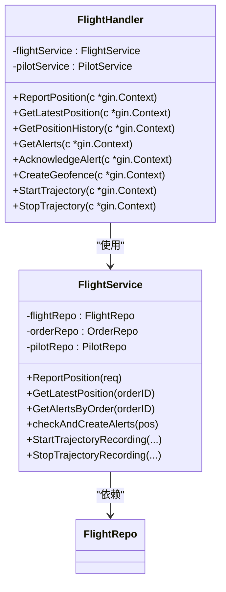

**图表来源**
- [backend/internal/api/v1/flight/handler.go:16-27](file://backend/internal/api/v1/flight/handler.go#L16-L27)
- [backend/internal/service/flight_service.go:17-26](file://backend/internal/service/flight_service.go#L17-L26)

**章节来源**
- [backend/internal/api/v1/dispatch/handler.go:18-46](file://backend/internal/api/v1/dispatch/handler.go#L18-L46)
- [backend/internal/api/v1/flight/handler.go:16-27](file://backend/internal/api/v1/flight/handler.go#L16-L27)
- [backend/internal/service/dispatch_service.go:17-29](file://backend/internal/service/dispatch_service.go#L17-L29)
- [backend/internal/service/flight_service.go:17-26](file://backend/internal/service/flight_service.go#L17-L26)

## 派单任务管理

### 任务创建流程

派单任务创建是整个系统的核心入口，支持多种任务类型和复杂的参数配置。

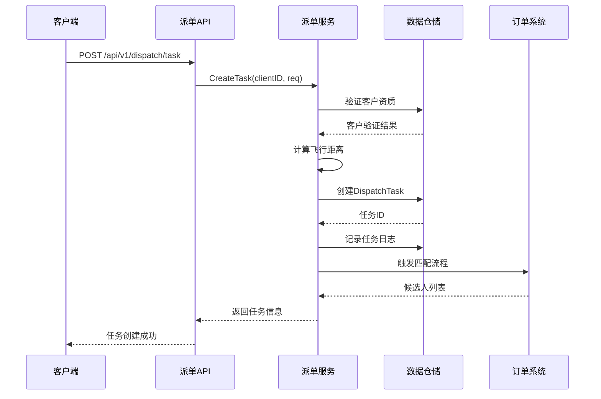

**图表来源**
- [backend/internal/api/v1/dispatch/handler.go:50-147](file://backend/internal/api/v1/dispatch/handler.go#L50-L147)
- [backend/internal/service/dispatch_service.go:189-260](file://backend/internal/service/dispatch_service.go#L189-L260)

### 智能匹配算法

系统采用多维度评分算法为任务匹配最合适的飞手和无人机组合。

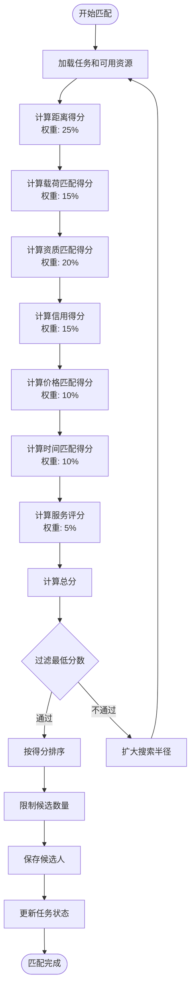

**图表来源**
- [backend/internal/service/dispatch_service.go:289-381](file://backend/internal/service/dispatch_service.go#L289-L381)
- [backend/internal/service/dispatch_service.go:383-497](file://backend/internal/service/dispatch_service.go#L383-L497)

### 任务状态管理

系统支持完整的任务生命周期管理，从创建到完成的每个阶段都有明确的状态转换。

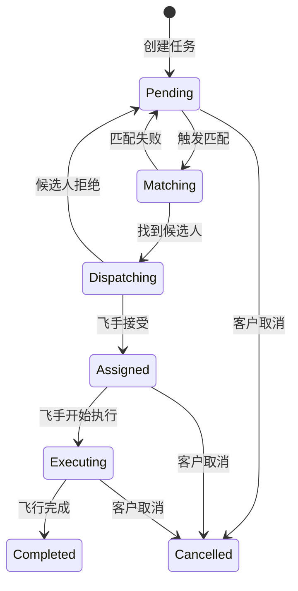

**图表来源**
- [backend/internal/service/dispatch_service.go:518-630](file://backend/internal/service/dispatch_service.go#L518-L630)

**章节来源**
- [backend/internal/api/v1/dispatch/handler.go:50-147](file://backend/internal/api/v1/dispatch/handler.go#L50-L147)
- [backend/internal/service/dispatch_service.go:189-260](file://backend/internal/service/dispatch_service.go#L189-L260)
- [backend/internal/service/dispatch_service.go:289-381](file://backend/internal/service/dispatch_service.go#L289-L381)
- [backend/internal/service/dispatch_service.go:518-630](file://backend/internal/service/dispatch_service.go#L518-L630)

## 飞手调度系统

### 飞手接单流程

飞手调度系统实现了完整的接单、拒单和订单执行流程。

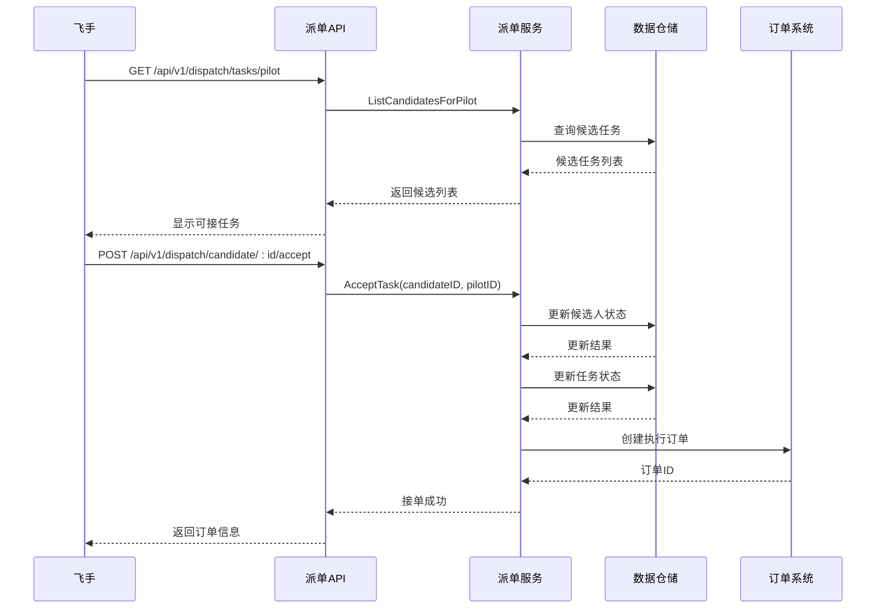

**图表来源**
- [backend/internal/api/v1/dispatch/handler.go:284-371](file://backend/internal/api/v1/dispatch/handler.go#L284-L371)
- [backend/internal/service/dispatch_service.go:538-601](file://backend/internal/service/dispatch_service.go#L538-L601)

### 飞手状态管理

系统提供全面的飞手状态管理功能，包括在线状态、接单能力和飞行记录。

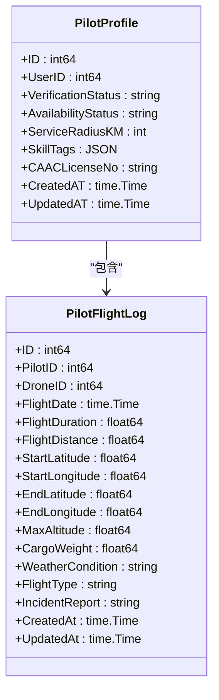

**图表来源**
- [backend/internal/model/models.go:70-85](file://backend/internal/model/models.go#L70-L85)
- [backend/internal/model/models.go:824-847](file://backend/internal/model/models.go#L824-L847)

**章节来源**
- [backend/internal/api/v1/dispatch/handler.go:284-371](file://backend/internal/api/v1/dispatch/handler.go#L284-L371)
- [backend/internal/api/v1/pilot/handler.go:1-724](file://backend/internal/api/v1/pilot/handler.go#L1-L724)
- [backend/internal/model/models.go:70-85](file://backend/internal/model/models.go#L70-L85)
- [backend/internal/model/models.go:824-847](file://backend/internal/model/models.go#L824-L847)

## 实时飞行监控

### 位置上报机制

系统支持高频次的飞行位置上报，确保实时监控能力。

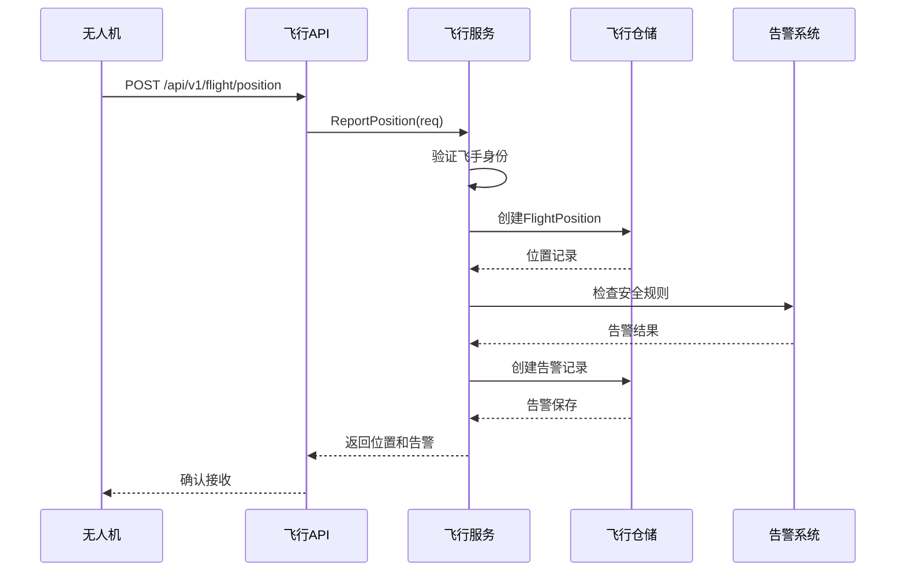

**图表来源**
- [backend/internal/api/v1/flight/handler.go:31-65](file://backend/internal/api/v1/flight/handler.go#L31-L65)
- [backend/internal/service/flight_service.go:112-158](file://backend/internal/service/flight_service.go#L112-L158)

### 飞行数据分析

系统提供全面的飞行数据分析功能，包括统计指标和趋势分析。

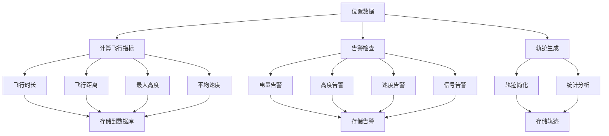

**图表来源**
- [backend/internal/service/flight_service.go:375-417](file://backend/internal/service/flight_service.go#L375-L417)
- [backend/internal/service/flight_service.go:471-533](file://backend/internal/service/flight_service.go#L471-L533)

**章节来源**
- [backend/internal/api/v1/flight/handler.go:31-65](file://backend/internal/api/v1/flight/handler.go#L31-L65)
- [backend/internal/service/flight_service.go:112-158](file://backend/internal/service/flight_service.go#L112-L158)
- [backend/internal/service/flight_service.go:375-417](file://backend/internal/service/flight_service.go#L375-L417)
- [backend/internal/service/flight_service.go:471-533](file://backend/internal/service/flight_service.go#L471-L533)

## 电子围栏与安全规则

### 围栏管理系统

系统提供完整的电子围栏管理功能，支持多种围栏类型和复杂几何形状。

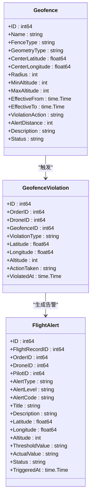

**图表来源**
- [backend/internal/model/models.go:1493-1545](file://backend/internal/model/models.go#L1493-L1545)
- [backend/internal/model/models.go:1545-1600](file://backend/internal/model/models.go#L1545-L1600)
- [backend/internal/model/models.go:1600-1650](file://backend/internal/model/models.go#L1600-L1650)

### 安全规则配置

系统支持灵活的安全规则配置，包括阈值设置和违规处理策略。

| 配置项 | 默认值 | 描述 | 用途 |
|--------|--------|------|------|
| low_battery_warning | 30% | 低电量预警阈值 | 电池监控 |
| low_battery_critical | 15% | 低电量紧急阈值 | 电池监控 |
| signal_lost_timeout | 30秒 | 信号丢失超时 | 通信监控 |
| deviation_warning_dist | 200米 | 偏航预警距离 | 航线监控 |
| deviation_critical_dist | 500米 | 偏航紧急距离 | 航线监控 |
| max_altitude_warning | 120米 | 最大高度预警 | 高度监控 |
| max_speed_warning | 15 m/s | 最大速度预警 | 速度监控 |
| position_report_interval | 3秒 | 位置上报间隔 | 实时监控 |

**章节来源**
- [backend/internal/service/flight_service.go:28-40](file://backend/internal/service/flight_service.go#L28-L40)
- [backend/internal/service/flight_service.go:42-68](file://backend/internal/service/flight_service.go#L42-L68)
- [backend/internal/repository/flight_repo.go:447-504](file://backend/internal/repository/flight_repo.go#L447-L504)

## WebSocket实时通信

### 实时通信架构

系统采用WebSocket实现实时通信，支持一对一私聊和广播消息。

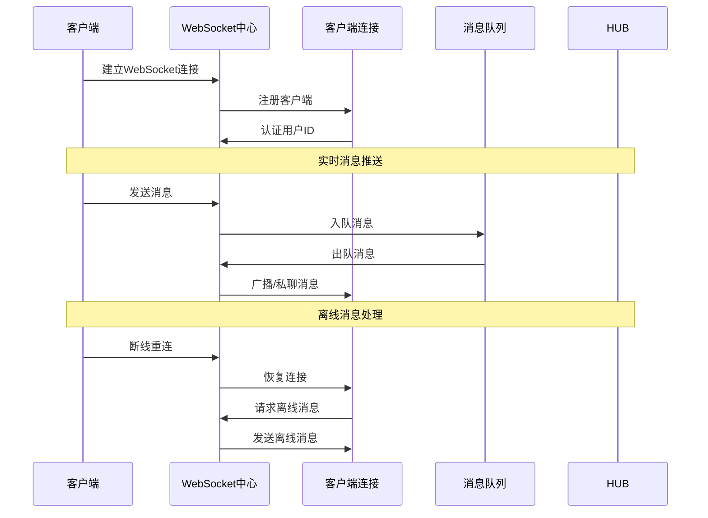

**图表来源**
- [backend/internal/websocket/hub.go:45-97](file://backend/internal/websocket/hub.go#L45-L97)

### 消息类型定义

系统支持多种消息类型，满足不同的业务场景需求。

| 消息类型 | 描述 | 使用场景 |
|----------|------|----------|
| chat | 聊天消息 | 用户间通信 |
| order_update | 订单状态更新 | 订单状态变更通知 |
| system | 系统消息 | 平台公告、维护通知 |
| matching | 匹配通知 | 新任务推荐、候选人通知 |
| flight_alert | 飞行告警 | 飞行安全告警 |
| trajectory_update | 轨迹更新 | 飞行轨迹变化通知 |

**章节来源**
- [backend/internal/websocket/hub.go:12-33](file://backend/internal/websocket/hub.go#L12-L33)
- [backend/internal/websocket/hub.go:45-97](file://backend/internal/websocket/hub.go#L45-L97)

## 异常处理机制

### 错误分类与处理

系统采用分级的异常处理机制，确保不同类型的错误得到适当的处理。

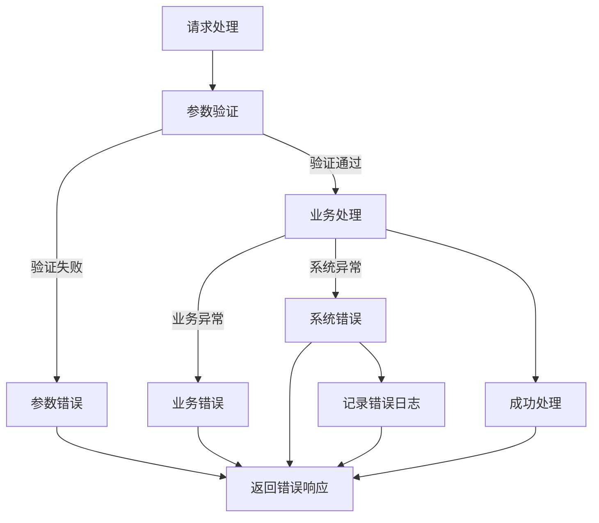

### 错误响应格式

系统统一使用标准的错误响应格式，便于客户端处理。

```json
{
  "code": 400,
  "message": "参数错误",
  "details": "无效的用户ID",
  "timestamp": "2024-01-01T12:00:00Z"
}
```

### 日志记录策略

系统采用结构化日志记录，支持详细的错误追踪和性能分析。

| 日志级别 | 用途 | 示例 |
|----------|------|------|
| Info | 正常操作记录 | 用户登录、任务创建 |
| Warn | 警告信息 | 参数不完整、权限不足 |
| Error | 错误信息 | 数据库连接失败、业务逻辑错误 |
| Debug | 调试信息 | 详细的操作流程、变量值 |

**章节来源**
- [backend/internal/websocket/hub.go:120-132](file://backend/internal/websocket/hub.go#L120-L132)

## 性能优化建议

### 数据库优化

1. **索引优化**
   - 为常用查询字段建立适当索引
   - 优化复合索引设计，避免冗余索引
   - 定期分析查询计划，调整索引策略

2. **连接池配置**
   ```go
   // 数据库连接池配置示例
   db.SetMaxOpenConns(25)
   db.SetMaxIdleConns(25)
   db.SetConnMaxLifetime(5 * time.Minute)
   ```

3. **查询优化**
   - 使用预加载减少N+1查询问题
   - 实施分页查询，避免一次性加载大量数据
   - 缓存热点数据，减少数据库压力

### 缓存策略

1. **多级缓存架构**
   - L1缓存：本地内存缓存高频数据
   - L2缓存：Redis分布式缓存
   - L3缓存：数据库查询结果缓存

2. **缓存失效策略**
   - 基于时间的TTL过期
   - 基于访问频率的LRU淘汰
   - 写入时失效的缓存穿透防护

### 异步处理

1. **消息队列**
   - 使用消息队列处理耗时操作
   - 实现异步任务处理，提升用户体验
   - 支持任务重试和失败处理

2. **批量处理**
   - 批量数据导入导出
   - 批量通知发送
   - 批量数据同步

## 故障排除指南

### 常见问题诊断

1. **派单匹配失败**
   - 检查飞手资质和可用性
   - 验证任务参数的有效性
   - 确认匹配算法配置正确

2. **飞行监控异常**
   - 检查GPS信号质量
   - 验证网络连接稳定性
   - 确认告警阈值设置合理

3. **WebSocket连接问题**
   - 检查服务器负载情况
   - 验证客户端连接状态
   - 确认消息队列正常运行

### 性能监控指标

| 指标类型 | 目标值 | 监控方法 |
|----------|--------|----------|
| API响应时间 | <200ms | Prometheus监控 |
| 数据库查询时间 | <50ms | 慢查询日志 |
| WebSocket连接数 | <1000 | 系统监控 |
| 内存使用率 | <80% | 应用监控 |
| CPU使用率 | <70% | 系统监控 |

### 故障恢复流程

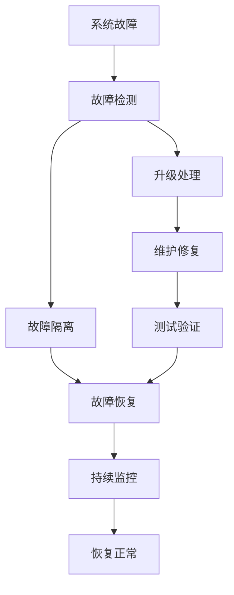

## 总结

本派单与飞行监控API系统提供了完整的无人机物流配送解决方案，具有以下特点：

### 技术优势

1. **智能化程度高**：采用多维度评分算法实现精准的飞手-无人机匹配
2. **实时性强**：支持高频次位置上报和实时告警
3. **安全性好**：完善的电子围栏和安全规则控制系统
4. **扩展性佳**：模块化设计支持功能扩展和性能优化

### 应用价值

1. **提高运营效率**：自动化派单和智能匹配减少人工干预
2. **保障飞行安全**：实时监控和告警系统确保飞行安全
3. **改善用户体验**：流畅的实时通信和状态更新
4. **降低运营成本**：高效的资源利用和优化的调度算法

### 发展方向

1. **AI算法优化**：引入机器学习提升匹配精度
2. **边缘计算**：部署边缘节点提升实时性
3. **区块链技术**：增强数据安全和可信度
4. **5G应用**：利用5G网络提升通信质量

该系统为无人机物流配送行业提供了可靠的技术支撑，具备良好的市场前景和应用价值。