# 消息通知API

<cite>
**本文档引用的文件**
- [backend/internal/api/v1/message/handler.go](file://backend/internal/api/v1/message/handler.go)
- [backend/internal/api/v2/notification/handler.go](file://backend/internal/api/v2/notification/handler.go)
- [backend/internal/service/message_service.go](file://backend/internal/service/message_service.go)
- [backend/internal/repository/message_repo.go](file://backend/internal/repository/message_repo.go)
- [backend/internal/websocket/hub.go](file://backend/internal/websocket/hub.go)
- [backend/internal/websocket/client.go](file://backend/internal/websocket/client.go)
- [backend/internal/websocket/handler.go](file://backend/internal/websocket/handler.go)
- [backend/internal/pkg/push/push.go](file://backend/internal/pkg/push/push.go)
- [backend/internal/pkg/sms/sms.go](file://backend/internal/pkg/sms/sms.go)
- [backend/internal/model/models.go](file://backend/internal/model/models.go)
- [mobile/src/services/message.ts](file://mobile/src/services/message.ts)
- [mobile/src/services/push.ts](file://mobile/src/services/push.ts)
</cite>

## 目录
1. [简介](#简介)
2. [项目结构](#项目结构)
3. [核心组件](#核心组件)
4. [架构概览](#架构概览)
5. [详细组件分析](#详细组件分析)
6. [依赖关系分析](#依赖关系分析)
7. [性能考虑](#性能考虑)
8. [故障排除指南](#故障排除指南)
9. [结论](#结论)
10. [附录](#附录)

## 简介

本项目提供了一个完整的消息通知系统，支持系统通知、即时消息、推送通知等多种通信方式。系统采用分层架构设计，包含RESTful API接口、WebSocket实时通信、消息队列和推送服务集成。

消息通知API主要功能包括：
- 即时消息发送与接收
- 系统通知管理
- WebSocket实时通信
- 推送通知服务
- 消息存储与检索
- 未读消息统计
- 多语言支持和模板化消息

## 项目结构

消息通知系统在项目中的组织结构如下：

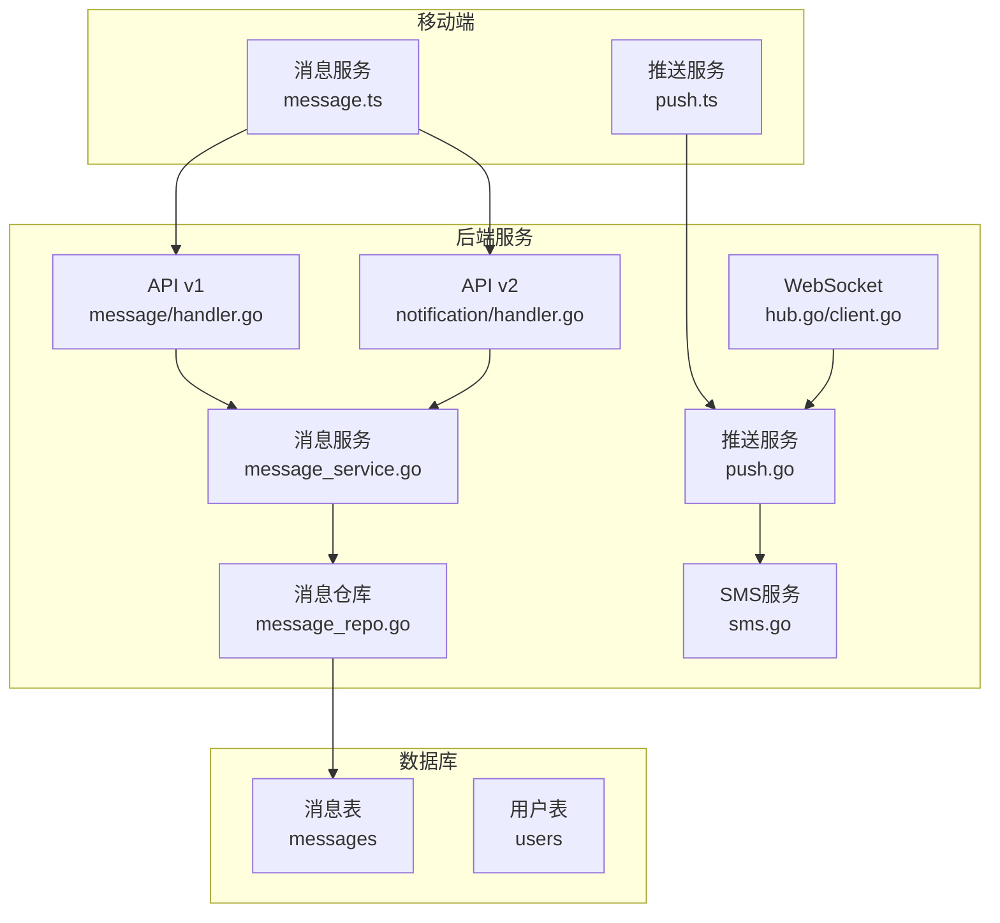

**图表来源**
- [backend/internal/api/v1/message/handler.go:1-121](file://backend/internal/api/v1/message/handler.go#L1-L121)
- [backend/internal/api/v2/notification/handler.go:1-94](file://backend/internal/api/v2/notification/handler.go#L1-L94)
- [backend/internal/service/message_service.go:1-137](file://backend/internal/service/message_service.go#L1-L137)

**章节来源**
- [backend/internal/api/v1/message/handler.go:1-121](file://backend/internal/api/v1/message/handler.go#L1-L121)
- [backend/internal/api/v2/notification/handler.go:1-94](file://backend/internal/api/v2/notification/handler.go#L1-L94)
- [backend/internal/service/message_service.go:1-137](file://backend/internal/service/message_service.go#L1-L137)

## 核心组件

### 消息模型

系统使用统一的消息模型来支持不同类型的消息：

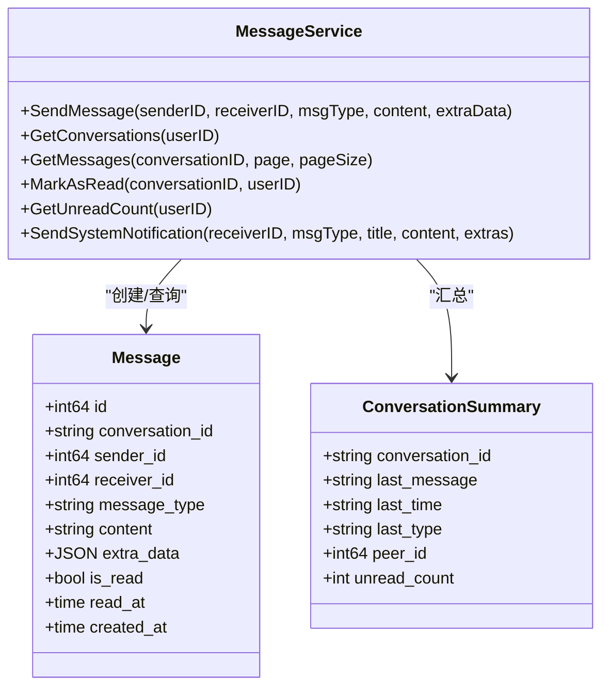

**图表来源**
- [backend/internal/model/models.go:572-583](file://backend/internal/model/models.go#L572-L583)
- [backend/internal/service/message_service.go:13-19](file://backend/internal/service/message_service.go#L13-L19)

### WebSocket实时通信

系统实现了基于Gorilla WebSocket的实时通信机制：

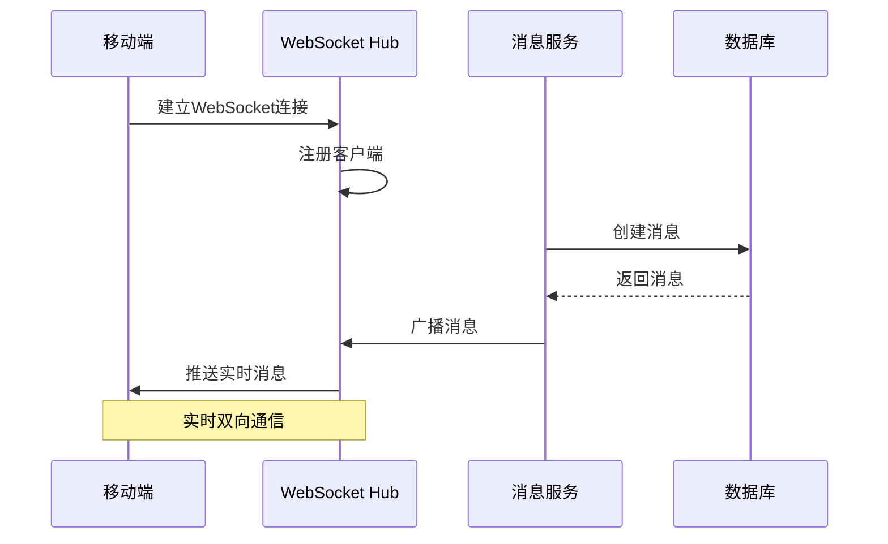

**图表来源**
- [backend/internal/websocket/handler.go:23-63](file://backend/internal/websocket/handler.go#L23-L63)
- [backend/internal/websocket/hub.go:45-97](file://backend/internal/websocket/hub.go#L45-L97)

**章节来源**
- [backend/internal/model/models.go:572-583](file://backend/internal/model/models.go#L572-L583)
- [backend/internal/websocket/hub.go:12-132](file://backend/internal/websocket/hub.go#L12-L132)
- [backend/internal/websocket/client.go:1-78](file://backend/internal/websocket/client.go#L1-L78)

## 架构概览

消息通知系统采用分层架构设计，确保各层职责清晰分离：

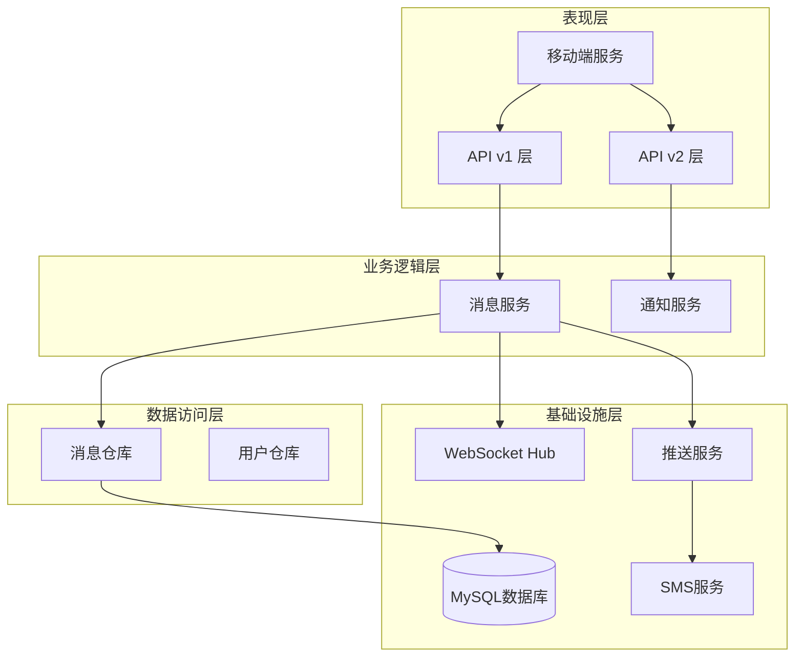

**图表来源**
- [backend/internal/api/v1/message/handler.go:14-20](file://backend/internal/api/v1/message/handler.go#L14-L20)
- [backend/internal/api/v2/notification/handler.go:16-22](file://backend/internal/api/v2/notification/handler.go#L16-L22)
- [backend/internal/service/message_service.go:13-19](file://backend/internal/service/message_service.go#L13-L19)

## 详细组件分析

### API接口层

#### 即时消息API (v1)

即时消息API提供了完整的消息通信功能：

| 接口 | 方法 | 路径 | 功能描述 |
|------|------|------|----------|
| 发送消息 | POST | `/message` | 发送即时消息给指定用户 |
| 会话列表 | GET | `/message/conversations` | 获取用户的所有会话 |
| 消息列表 | GET | `/message/:conversationId` | 获取指定会话的消息列表 |
| 标记已读 | PUT | `/message/:conversationId/read` | 标记会话中所有消息为已读 |
| 未读计数 | GET | `/message/unread-count` | 获取用户的未读消息总数 |

#### 通知API (v2)

通知API专注于系统通知管理：

| 接口 | 方法 | 路径 | 功能描述 |
|------|------|------|----------|
| 通知列表 | GET | `/notification` | 获取用户的通知列表 |
| 标记已读 | PUT | `/notification/:notification_id/read` | 标记指定通知为已读 |

**章节来源**
- [backend/internal/api/v1/message/handler.go:29-121](file://backend/internal/api/v1/message/handler.go#L29-L121)
- [backend/internal/api/v2/notification/handler.go:24-73](file://backend/internal/api/v2/notification/handler.go#L24-L73)

### 业务逻辑层

#### 消息服务

消息服务是系统的核心业务逻辑组件，负责处理消息的创建、查询和管理：

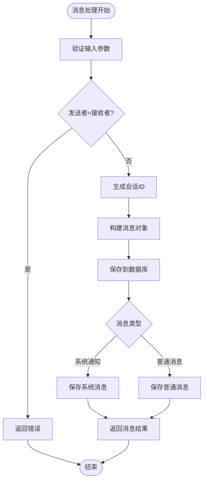

**图表来源**
- [backend/internal/service/message_service.go:21-40](file://backend/internal/service/message_service.go#L21-L40)
- [backend/internal/service/message_service.go:85-121](file://backend/internal/service/message_service.go#L85-L121)

#### 推送服务

系统集成了极光推送服务，支持用户定向推送和广播推送：

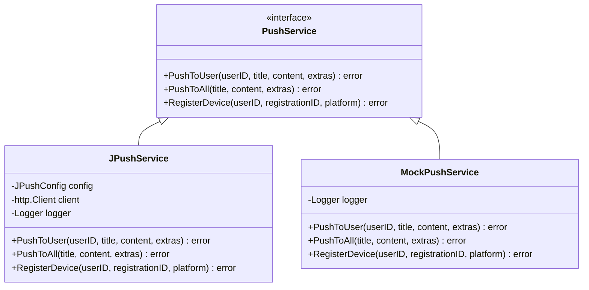

**图表来源**
- [backend/internal/pkg/push/push.go:15-23](file://backend/internal/pkg/push/push.go#L15-L23)
- [backend/internal/pkg/push/push.go:37-50](file://backend/internal/pkg/push/push.go#L37-L50)
- [backend/internal/pkg/push/push.go:228-235](file://backend/internal/pkg/push/push.go#L228-L235)

**章节来源**
- [backend/internal/service/message_service.go:85-121](file://backend/internal/service/message_service.go#L85-L121)
- [backend/internal/pkg/push/push.go:57-95](file://backend/internal/pkg/push/push.go#L57-L95)

### 数据访问层

#### 消息仓库

消息仓库实现了消息数据的持久化操作：

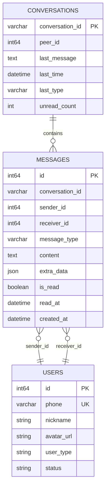

**图表来源**
- [backend/internal/model/models.go:572-583](file://backend/internal/model/models.go#L572-L583)
- [backend/internal/repository/message_repo.go:31-65](file://backend/internal/repository/message_repo.go#L31-L65)

**章节来源**
- [backend/internal/repository/message_repo.go:17-138](file://backend/internal/repository/message_repo.go#L17-L138)

### 移动端集成

#### 消息服务

移动端通过HTTP API与后端进行消息通信：

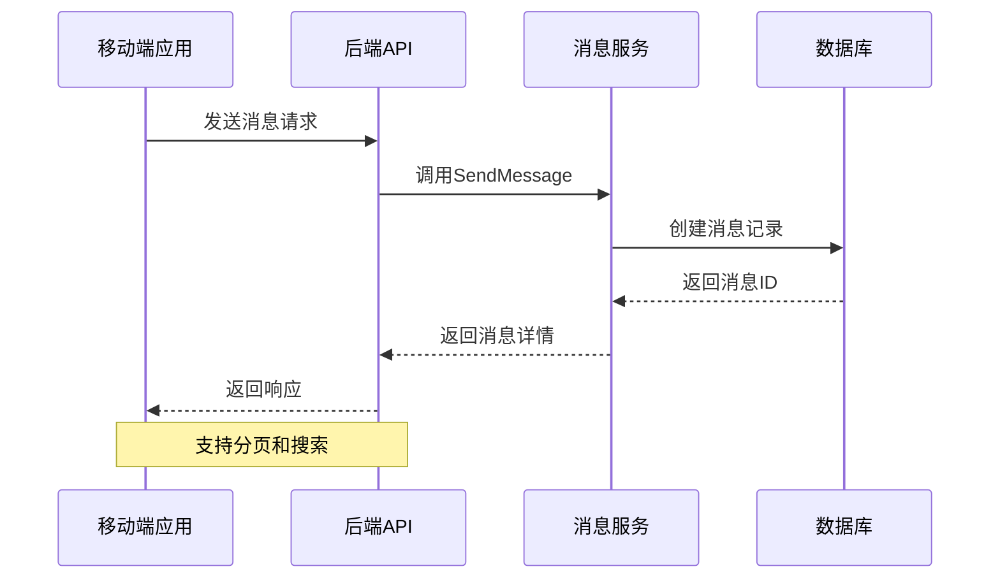

**图表来源**
- [mobile/src/services/message.ts:19-24](file://mobile/src/services/message.ts#L19-L24)
- [mobile/src/services/message.ts:33-35](file://mobile/src/services/message.ts#L33-L35)

#### 推送服务

移动端集成了推送通知功能，支持极光推送：

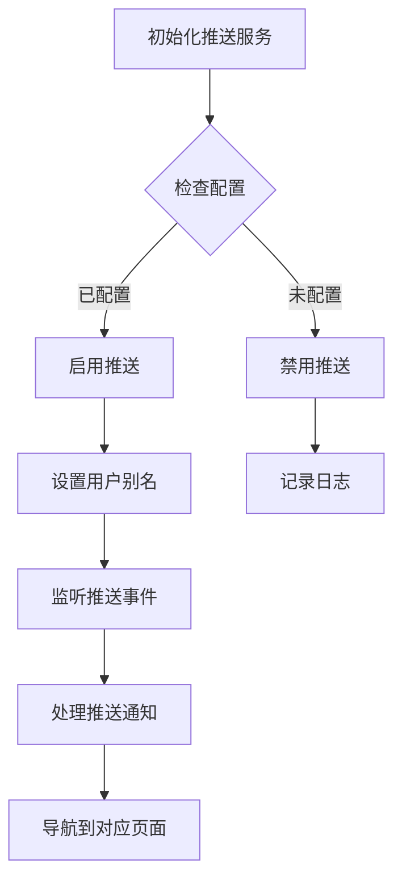

**图表来源**
- [mobile/src/services/push.ts:32-74](file://mobile/src/services/push.ts#L32-L74)
- [mobile/src/services/push.ts:120-154](file://mobile/src/services/push.ts#L120-L154)

**章节来源**
- [mobile/src/services/message.ts:1-36](file://mobile/src/services/message.ts#L1-L36)
- [mobile/src/services/push.ts:24-180](file://mobile/src/services/push.ts#L24-L180)

## 依赖关系分析

消息通知系统的依赖关系如下：

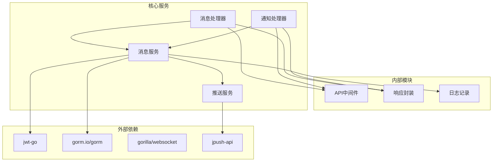

**图表来源**
- [backend/internal/api/v1/message/handler.go:3-12](file://backend/internal/api/v1/message/handler.go#L3-L12)
- [backend/internal/api/v2/notification/handler.go:3-14](file://backend/internal/api/v2/notification/handler.go#L3-L14)

**章节来源**
- [backend/internal/api/v1/message/handler.go:1-121](file://backend/internal/api/v1/message/handler.go#L1-L121)
- [backend/internal/api/v2/notification/handler.go:1-94](file://backend/internal/api/v2/notification/handler.go#L1-L94)

## 性能考虑

### 数据库优化

系统采用了多种数据库优化策略：

1. **索引优化**：在消息表的关键字段上建立了适当的索引
2. **分页查询**：支持大数据量的消息列表分页
3. **批量操作**：支持批量标记消息为已读

### WebSocket优化

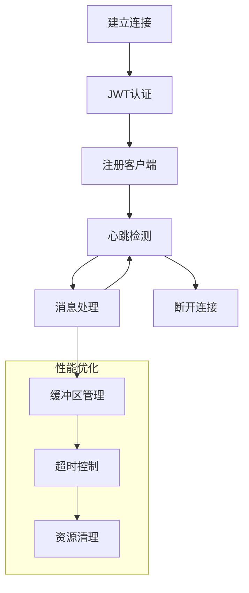

### 缓存策略

系统建议实现以下缓存策略：
- 会话摘要缓存
- 用户在线状态缓存
- 未读消息计数缓存

## 故障排除指南

### 常见问题及解决方案

#### WebSocket连接问题

**问题症状**：客户端无法连接到WebSocket服务器

**可能原因**：
1. JWT令牌无效或过期
2. CORS跨域问题
3. 服务器负载过高

**解决步骤**：
1. 验证JWT令牌格式和有效期
2. 检查CORS配置
3. 监控服务器资源使用情况

#### 消息推送失败

**问题症状**：推送通知无法送达

**可能原因**：
1. 推送服务配置错误
2. 设备注册ID失效
3. 网络连接问题

**解决步骤**：
1. 验证推送服务密钥配置
2. 重新注册设备别名
3. 检查网络连接状态

#### 数据库连接问题

**问题症状**：消息无法保存或查询失败

**可能原因**：
1. 数据库连接池耗尽
2. SQL查询超时
3. 表结构不匹配

**解决步骤**：
1. 检查数据库连接配置
2. 优化慢查询语句
3. 验证数据库迁移状态

**章节来源**
- [backend/internal/websocket/handler.go:23-63](file://backend/internal/websocket/handler.go#L23-L63)
- [backend/internal/pkg/push/push.go:57-95](file://backend/internal/pkg/push/push.go#L57-L95)
- [backend/internal/repository/message_repo.go:17-29](file://backend/internal/repository/message_repo.go#L17-L29)

## 结论

消息通知API提供了完整的企业级消息通信解决方案，具有以下特点：

1. **模块化设计**：清晰的分层架构，便于维护和扩展
2. **多协议支持**：同时支持RESTful API和WebSocket实时通信
3. **可扩展性**：插件化的推送服务，支持多种推送提供商
4. **性能优化**：针对高并发场景进行了专门优化
5. **开发友好**：完善的错误处理和日志记录机制

系统已经具备了生产环境所需的大部分功能，包括消息发送、接收、存储、读取等核心功能，以及实时通信和推送通知等高级特性。

## 附录

### API使用示例

#### 发送即时消息
```javascript
// 移动端调用示例
const response = await messageService.send(
  receiverId: 123,
  content: "你好，这是测试消息",
  messageType: "text"
);
```

#### 获取通知列表
```javascript
// 移动端调用示例
const response = await api.get('/notification?page=1&page_size=20');
```

#### WebSocket连接
```javascript
// 建立WebSocket连接
const ws = new WebSocket(`ws://localhost:8080/ws?token=${jwtToken}`);
ws.onmessage = (event) => {
  const message = JSON.parse(event.data);
  console.log('收到实时消息:', message);
};
```

### 配置选项

#### 推送服务配置
- `JPUSH_APP_KEY`: 极光推送应用密钥
- `JPUSH_MASTER_SECRET`: 极光推送密钥
- `PUSH_ENABLED`: 是否启用推送服务

#### 数据库配置
- `DATABASE_URL`: 数据库连接字符串
- `MAX_OPEN_CONNS`: 最大连接数
- `MAX_IDLE_CONNS`: 最大空闲连接数