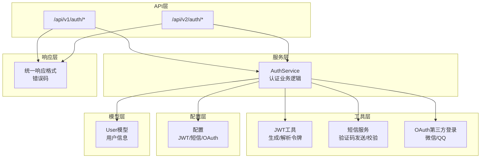
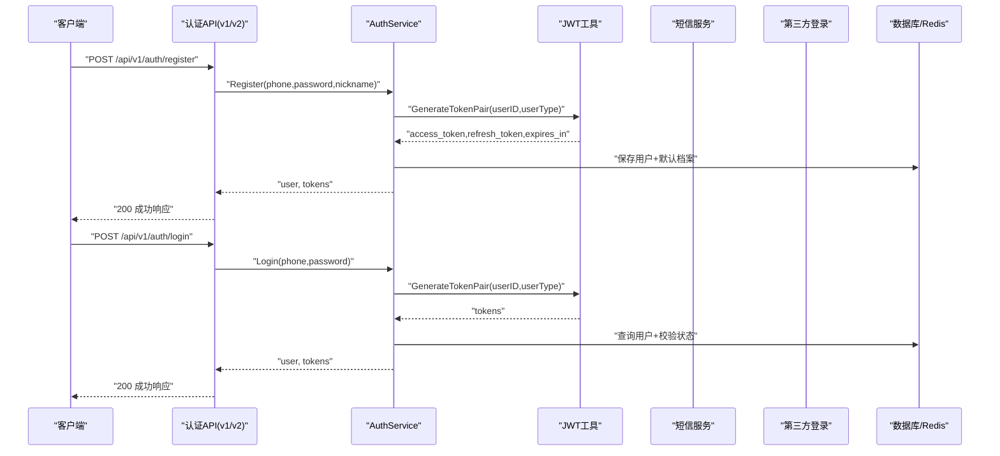
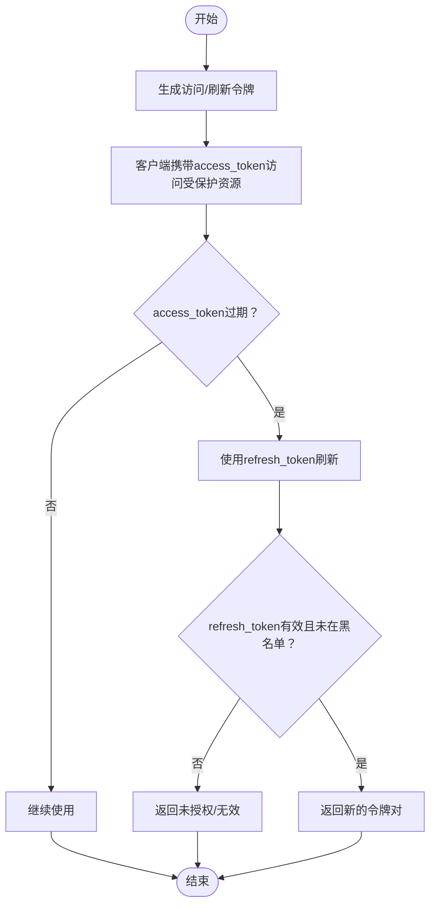
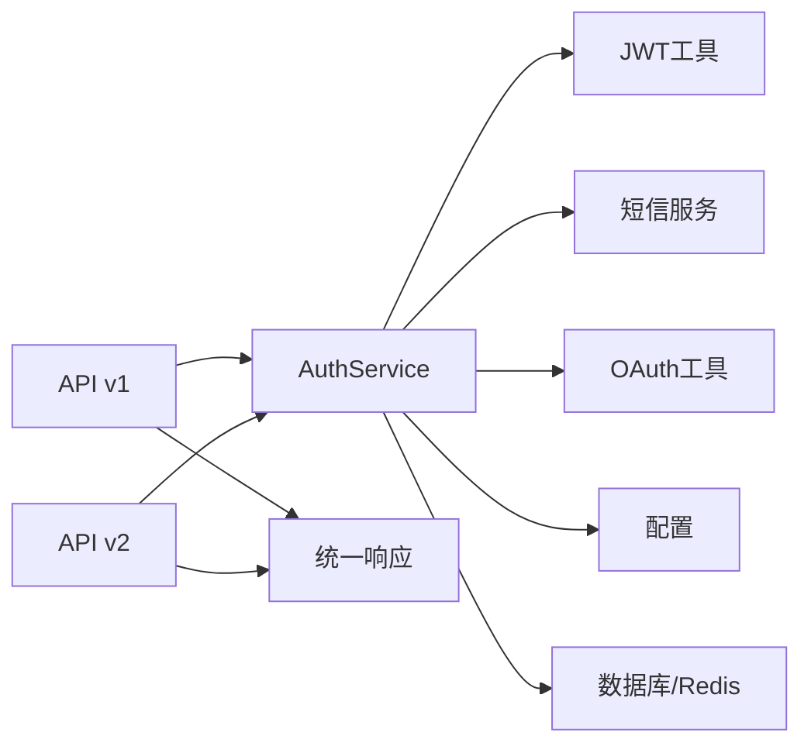

# 用户认证API

<cite>
**本文档引用的文件**
- [backend/internal/api/v1/auth/handler.go](file://backend/internal/api/v1/auth/handler.go)
- [backend/internal/api/v2/auth/handler.go](file://backend/internal/api/v2/auth/handler.go)
- [backend/internal/service/auth_service.go](file://backend/internal/service/auth_service.go)
- [backend/internal/pkg/jwt/jwt.go](file://backend/internal/pkg/jwt/jwt.go)
- [backend/internal/pkg/oauth/oauth.go](file://backend/internal/pkg/oauth/oauth.go)
- [backend/internal/pkg/sms/sms.go](file://backend/internal/pkg/sms/sms.go)
- [backend/internal/api/v1/router.go](file://backend/internal/api/v1/router.go)
- [backend/internal/api/v2/router.go](file://backend/internal/api/v2/router.go)
- [backend/internal/model/models.go](file://backend/internal/model/models.go)
- [backend/internal/config/config.go](file://backend/internal/config/config.go)
- [backend/internal/pkg/response/response.go](file://backend/internal/pkg/response/response.go)
- [mobile/src/services/auth.ts](file://mobile/src/services/auth.ts)
</cite>

## 目录
1. [简介](#简介)
2. [项目结构](#项目结构)
3. [核心组件](#核心组件)
4. [架构总览](#架构总览)
5. [详细组件分析](#详细组件分析)
6. [依赖关系分析](#依赖关系分析)
7. [性能考虑](#性能考虑)
8. [故障排除指南](#故障排除指南)
9. [结论](#结论)

## 简介
本文件面向后端开发者与移动端开发者，系统化梳理无人机租赁平台的用户认证API，包括注册、登录、登出、令牌刷新、第三方登录（微信/QQ）等完整流程。文档详细说明：
- HTTP方法、URL模式、请求参数、响应格式
- JWT令牌的生成、验证、刷新机制
- 用户凭据验证流程、密码加密存储、会话管理策略
- 请求与响应示例、错误码与处理方式
- 手机验证码、第三方登录集成等扩展能力

## 项目结构
认证相关代码主要分布在以下模块：
- API层：v1/v2路由与处理器，负责HTTP协议与参数校验
- 服务层：认证业务逻辑，包括密码哈希、令牌生成、验证码校验、第三方登录
- 工具层：JWT工具、短信服务、OAuth第三方登录
- 配置层：JWT密钥、过期时间、短信提供商、第三方登录开关
- 响应层：统一响应格式与错误码定义

图表来源
- [backend/internal/api/v1/auth/handler.go:1-215](file://backend/internal/api/v1/auth/handler.go#L1-L215)
- [backend/internal/api/v2/auth/handler.go:1-149](file://backend/internal/api/v2/auth/handler.go#L1-L149)
- [backend/internal/service/auth_service.go:1-358](file://backend/internal/service/auth_service.go#L1-L358)
- [backend/internal/pkg/jwt/jwt.go:1-87](file://backend/internal/pkg/jwt/jwt.go#L1-L87)
- [backend/internal/pkg/sms/sms.go:1-154](file://backend/internal/pkg/sms/sms.go#L1-L154)
- [backend/internal/pkg/oauth/oauth.go:1-262](file://backend/internal/pkg/oauth/oauth.go#L1-L262)
- [backend/internal/config/config.go:1-521](file://backend/internal/config/config.go#L1-L521)
- [backend/internal/model/models.go:1-200](file://backend/internal/model/models.go#L1-L200)
- [backend/internal/pkg/response/response.go:1-104](file://backend/internal/pkg/response/response.go#L1-L104)

章节来源
- [backend/internal/api/v1/router.go:65-76](file://backend/internal/api/v1/router.go#L65-L76)
- [backend/internal/api/v2/router.go:72-84](file://backend/internal/api/v2/router.go#L72-L84)

## 核心组件
- 认证处理器（v1/v2）：接收HTTP请求，参数校验，调用服务层，封装统一响应
- 认证服务：密码哈希、令牌生成/刷新、验证码发送/校验、第三方登录、会话注销
- JWT工具：HS256签名、访问令牌与刷新令牌生成、解析与过期判断
- 短信服务：阿里云/本地Mock短信，验证码生成与校验
- OAuth第三方登录：微信/QQ授权码/AccessToken获取用户信息
- 配置：JWT密钥、过期时间、短信提供商、OAuth开关
- 统一响应：成功/错误/未授权/禁止等标准格式与错误码

章节来源
- [backend/internal/service/auth_service.go:126-262](file://backend/internal/service/auth_service.go#L126-L262)
- [backend/internal/pkg/jwt/jwt.go:27-86](file://backend/internal/pkg/jwt/jwt.go#L27-L86)
- [backend/internal/pkg/sms/sms.go:45-74](file://backend/internal/pkg/sms/sms.go#L45-L74)
- [backend/internal/pkg/oauth/oauth.go:61-144](file://backend/internal/pkg/oauth/oauth.go#L61-L144)

## 架构总览
认证API采用分层架构：
- API层：暴露REST接口，绑定请求参数，调用服务层
- 服务层：业务规则与数据访问，调用工具层完成具体操作
- 工具层：JWT、短信、OAuth等基础设施
- 配置层：运行时配置注入
- 响应层：统一输出格式

图表来源
- [backend/internal/api/v1/auth/handler.go:45-107](file://backend/internal/api/v1/auth/handler.go#L45-L107)
- [backend/internal/service/auth_service.go:126-182](file://backend/internal/service/auth_service.go#L126-L182)
- [backend/internal/pkg/jwt/jwt.go:27-67](file://backend/internal/pkg/jwt/jwt.go#L27-L67)

## 详细组件分析

### v1 认证接口
- 发送验证码
  - 方法：POST
  - URL：/api/v1/auth/send-code
  - 请求体：{"phone": "string"}
  - 响应：成功返回空数据；失败返回错误码与消息
  - 说明：支持阿里云短信直发或本地Redis缓存验证码
- 手机注册
  - 方法：POST
  - URL：/api/v1/auth/register
  - 请求体：{"phone": "string", "password": "string", "nickname": "string", "code": "string"}
  - 响应：{"user": 用户信息, "token": 令牌对}
  - 说明：先校验验证码，再注册并生成JWT
- 手机登录
  - 方法：POST
  - URL：/api/v1/auth/login
  - 请求体：{"phone": "string", "password": "string", "code": "string"}
  - 响应：{"user": 用户信息, "token": 令牌对}
  - 说明：支持密码登录或验证码登录；失败返回未授权
- 刷新令牌
  - 方法：POST
  - URL：/api/v1/auth/refresh-token
  - 请求体：{"refresh_token": "string"}
  - 响应：令牌对或错误
  - 说明：校验refresh token有效性并生成新的令牌对
- 登出
  - 方法：POST
  - URL：/api/v1/auth/logout
  - 请求体：{"refresh_token": "string"}
  - 响应：成功
  - 说明：将access/refresh token加入Redis黑名单
- 微信登录
  - 方法：POST
  - URL：/api/v1/auth/wechat-login
  - 请求体：{"code": "string"}
  - 响应：{"user": 用户信息, "token": 令牌对}
  - 说明：通过微信授权码获取用户信息并登录/注册
- QQ登录
  - 方法：POST
  - URL：/api/v1/auth/qq-login
  - 请求体：{"access_token": "string"}
  - 响应：{"user": 用户信息, "token": 令牌对}
  - 说明：通过QQ AccessToken获取用户信息并登录/注册

章节来源
- [backend/internal/api/v1/auth/handler.go:25-214](file://backend/internal/api/v1/auth/handler.go#L25-L214)
- [backend/internal/api/v1/router.go:68-76](file://backend/internal/api/v1/router.go#L68-L76)

### v2 认证接口
- 注册
  - 方法：POST
  - URL：/api/v2/auth/register
  - 请求体：{"phone": "string", "password": "string", "nickname": "string"}
  - 响应：{"user": 用户简要信息, "token": 令牌对, "role_summary": 角色摘要}
- 登录
  - 方法：POST
  - URL：/api/v2/auth/login
  - 请求体：{"phone": "string", "password": "string", "code": "string"}
  - 响应：{"user": 用户简要信息, "token": 令牌对, "role_summary": 角色摘要}
- 刷新令牌
  - 方法：POST
  - URL：/api/v2/auth/refresh-token
  - 请求体：{"refresh_token": "string"}
  - 响应：令牌对
- 登出
  - 方法：POST
  - URL：/api/v2/auth/logout
  - 请求体：{"refresh_token": "string"}
  - 响应：空数据

章节来源
- [backend/internal/api/v2/auth/handler.go:46-148](file://backend/internal/api/v2/auth/handler.go#L46-L148)
- [backend/internal/api/v2/router.go:79-84](file://backend/internal/api/v2/router.go#L79-L84)

### JWT令牌机制
- 生成
  - 访问令牌：短期有效，用于日常请求鉴权
  - 刷新令牌：长期有效但需定期刷新，用于获取新的访问令牌
  - 过期时间：由配置决定，v1/v2均使用相同JWT工具
- 验证
  - 解析HS256签名，校验过期与有效性
  - v1/v2均使用同一工具解析
- 刷新
  - 使用有效的refresh token换取新的令牌对
  - 若refresh token在黑名单中则拒绝
- 黑名单
  - 登出时将access/refresh token加入Redis黑名单，键值为"token:blacklist:{token}"

图表来源
- [backend/internal/pkg/jwt/jwt.go:27-86](file://backend/internal/pkg/jwt/jwt.go#L27-L86)
- [backend/internal/service/auth_service.go:219-262](file://backend/internal/service/auth_service.go#L219-L262)

章节来源
- [backend/internal/pkg/jwt/jwt.go:10-86](file://backend/internal/pkg/jwt/jwt.go#L10-L86)
- [backend/internal/service/auth_service.go:219-262](file://backend/internal/service/auth_service.go#L219-L262)

### 用户凭据验证与密码存储
- 密码加密
  - 使用bcrypt对明文密码进行哈希存储
  - 登录时比较哈希值
- 用户状态
  - 仅状态为"active"的用户允许登录
- 自动补齐默认档案
  - 首次登录或注册后自动创建个人客户档案与角色档案

章节来源
- [backend/internal/service/auth_service.go:126-182](file://backend/internal/service/auth_service.go#L126-L182)
- [backend/internal/model/models.go:9-26](file://backend/internal/model/models.go#L9-L26)

### 会话管理策略
- 访问令牌短期有效，建议在移动端缓存并在过期前自动刷新
- 刷新令牌长期有效，建议安全存储于应用安全容器
- 登出时将当前访问/刷新令牌加入黑名单，防止复用
- 令牌黑名单基于Redis TTL控制，过期即失效

章节来源
- [backend/internal/service/auth_service.go:233-270](file://backend/internal/service/auth_service.go#L233-L270)

### 手机验证码与短信服务
- 发送验证码
  - v1接口：/api/v1/auth/send-code
  - 支持阿里云短信直发或本地Redis缓存
  - 频率限制：Redis键"sms:code:{phone}"存在时限制发送频率
- 验证码校验
  - v1接口：/api/v1/auth/register
  - 支持阿里云在线校验或本地Redis对比
- Mock短信
  - 本地开发时打印验证码至控制台

章节来源
- [backend/internal/api/v1/auth/handler.go:25-36](file://backend/internal/api/v1/auth/handler.go#L25-L36)
- [backend/internal/service/auth_service.go:89-124](file://backend/internal/service/auth_service.go#L89-L124)
- [backend/internal/pkg/sms/sms.go:45-74](file://backend/internal/pkg/sms/sms.go#L45-L74)

### 第三方登录（微信/QQ）
- 微信登录
  - v1接口：/api/v1/auth/wechat-login
  - 步骤：code换取access_token+openid -> 获取用户信息 -> 登录/注册
  - 配置：需要在配置中启用微信OAuth
- QQ登录
  - v1接口：/api/v1/auth/qq-login
  - 步骤：AccessToken获取openid -> 获取用户信息 -> 登录/注册
  - 配置：需要在配置中启用QQ OAuth
- OAuth用户信息
  - 返回字段：open_id、union_id、nickname、avatar、gender、platform

章节来源
- [backend/internal/api/v1/auth/handler.go:146-214](file://backend/internal/api/v1/auth/handler.go#L146-L214)
- [backend/internal/pkg/oauth/oauth.go:61-144](file://backend/internal/pkg/oauth/oauth.go#L61-L144)
- [backend/internal/pkg/oauth/oauth.go:177-261](file://backend/internal/pkg/oauth/oauth.go#L177-L261)
- [backend/internal/config/config.go:380-406](file://backend/internal/config/config.go#L380-L406)

### 统一响应格式与错误码
- 成功响应：{"code": 0, "message": "success", "data": ..., "timestamp": ...}
- 错误响应：{"code": 错误码, "message": "错误信息", "timestamp": ...}
- 常见错误码：
  - 参数错误：1001
  - 未授权：1002
  - 禁止访问：1003
  - 资源不存在：1004
  - 已存在：1005
  - 服务器错误：2001
  - 数据库错误：2002
  - Redis错误：2003
  - 短信错误：3001
  - 验证码错误：4001

章节来源
- [backend/internal/pkg/response/response.go:10-104](file://backend/internal/pkg/response/response.go#L10-L104)

### 请求与响应示例
- 发送验证码
  - 请求：POST /api/v1/auth/send-code
    - Body: {"phone": "13800001111"}
  - 响应：{"code": 0, "message": "success", "data": null, "timestamp": 1710000000}
- 手机注册
  - 请求：POST /api/v1/auth/register
    - Body: {"phone": "13800001111", "password": "123456", "nickname": "张三", "code": "123456"}
  - 响应：{"code": 0, "message": "success", "data": {"user": {...}, "token": {"access_token": "...", "refresh_token": "...", "expires_in": 3600}}, "timestamp": 1710000000}
- 登录
  - 请求：POST /api/v2/auth/login
    - Body: {"phone": "13800001111", "password": "123456"}
  - 响应：{"code": 0, "message": "success", "data": {"user": {"id": 1, "phone": "13800001111", "nickname": "张三", "avatar_url": null}, "token": {"access_token": "...", "refresh_token": "...", "expires_in": 3600}, "role_summary": {...}}, "timestamp": 1710000000}
- 刷新令牌
  - 请求：POST /api/v2/auth/refresh-token
    - Body: {"refresh_token": "refresh_token_value"}
  - 响应：{"code": 0, "message": "success", "data": {"access_token": "...", "refresh_token": "...", "expires_in": 3600}, "timestamp": 1710000000}
- 登出
  - 请求：POST /api/v2/auth/logout
    - Body: {"refresh_token": "refresh_token_value"}
  - 响应：{"code": 0, "message": "success", "data": {}, "timestamp": 1710000000}

章节来源
- [mobile/src/services/auth.ts:10-44](file://mobile/src/services/auth.ts#L10-L44)
- [backend/internal/api/v1/auth/handler.go:25-148](file://backend/internal/api/v1/auth/handler.go#L25-L148)
- [backend/internal/api/v2/auth/handler.go:46-148](file://backend/internal/api/v2/auth/handler.go#L46-L148)

## 依赖关系分析
- API层依赖服务层与响应层
- 服务层依赖JWT工具、短信服务、OAuth工具、配置与数据库/Redis
- JWT工具与短信服务相互独立，均由服务层统一调度
- 路由层明确划分v1/v2版本，便于演进与兼容

图表来源
- [backend/internal/api/v1/auth/handler.go:1-19](file://backend/internal/api/v1/auth/handler.go#L1-L19)
- [backend/internal/api/v2/auth/handler.go:1-21](file://backend/internal/api/v2/auth/handler.go#L1-L21)
- [backend/internal/service/auth_service.go:21-41](file://backend/internal/service/auth_service.go#L21-L41)

章节来源
- [backend/internal/api/v1/router.go:58-76](file://backend/internal/api/v1/router.go#L58-L76)
- [backend/internal/api/v2/router.go:72-84](file://backend/internal/api/v2/router.go#L72-L84)

## 性能考虑
- 令牌生成与解析为轻量计算，性能开销可忽略
- 验证码发送与校验涉及外部服务（阿里云短信）或Redis读写，需关注网络延迟与限流
- 登出时的黑名单写入按原令牌过期时间设置TTL，避免长期占用内存
- 建议在移动端实现令牌自动刷新与重试策略，减少无效请求

## 故障排除指南
- 参数错误
  - 现象：返回错误码1001
  - 处理：检查必填字段与格式
- 未授权
  - 现象：返回错误码1002
  - 处理：检查令牌有效性、是否在黑名单、是否过期
- 账号或密码错误
  - 现象：登录失败
  - 处理：确认用户状态为"active"，密码哈希匹配
- 验证码错误/过期
  - 现象：注册/登录验证码校验失败
  - 处理：重新发送验证码，检查Redis缓存与TTL
- 第三方登录未配置
  - 现象：微信/QQ登录返回参数错误
  - 处理：检查配置中的OAuth开关与密钥

章节来源
- [backend/internal/pkg/response/response.go:88-103](file://backend/internal/pkg/response/response.go#L88-L103)
- [backend/internal/service/auth_service.go:159-217](file://backend/internal/service/auth_service.go#L159-L217)
- [backend/internal/api/v1/auth/handler.go:156-206](file://backend/internal/api/v1/auth/handler.go#L156-L206)

## 结论
本认证体系以清晰的分层设计实现了完整的用户认证闭环：v1/v2双版本API满足不同阶段需求，JWT令牌机制保障安全性与可扩展性，短信与第三方登录提供灵活的用户接入方式。配合统一响应与错误码规范，便于前后端协作与问题定位。建议在生产环境中：
- 使用强密钥并定期轮换
- 启用阿里云短信并关闭Mock模式
- 在移动端实现令牌自动刷新与登出清理
- 对高频接口增加限流与防刷策略