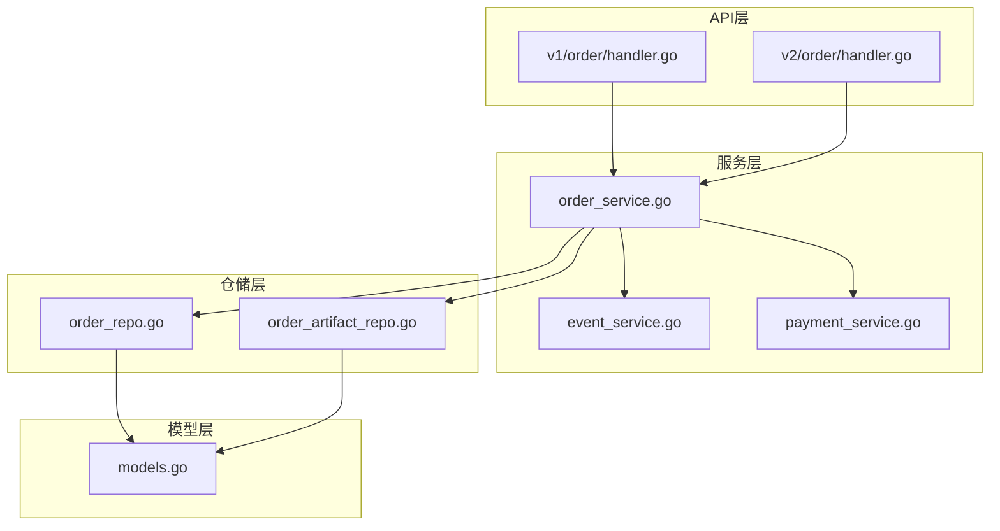
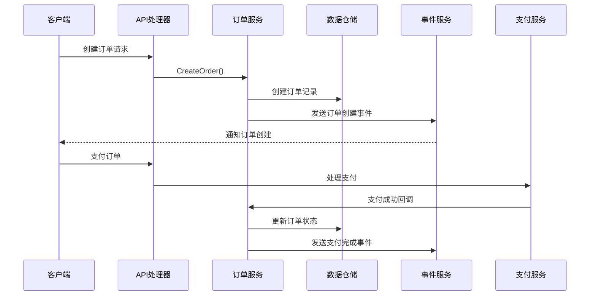
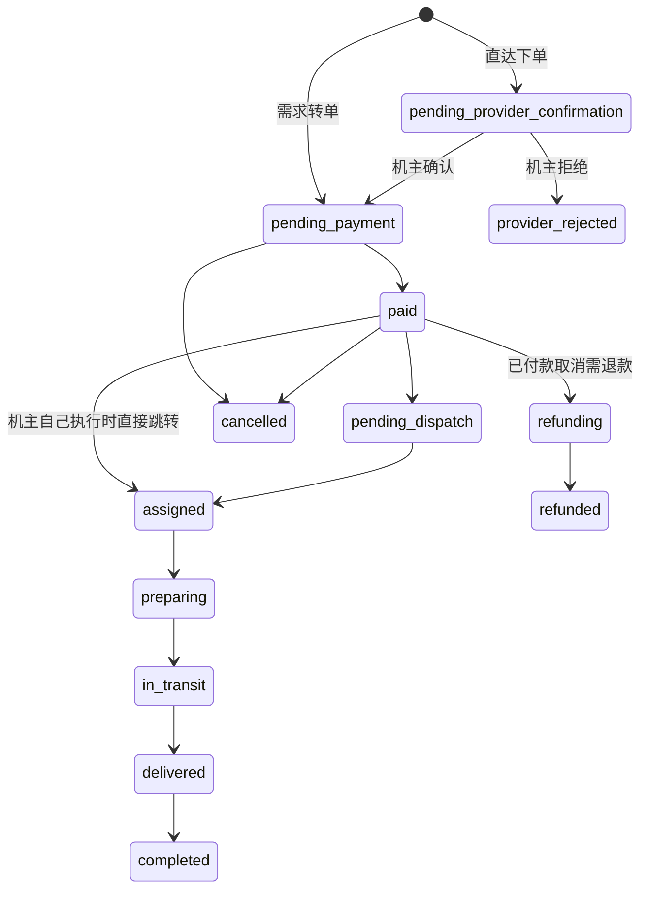
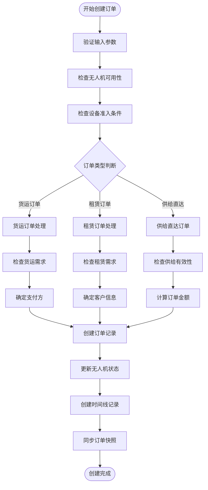
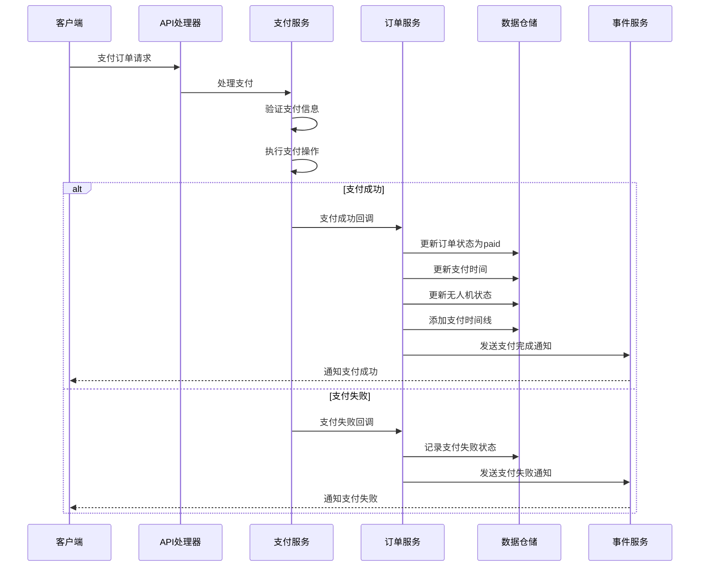
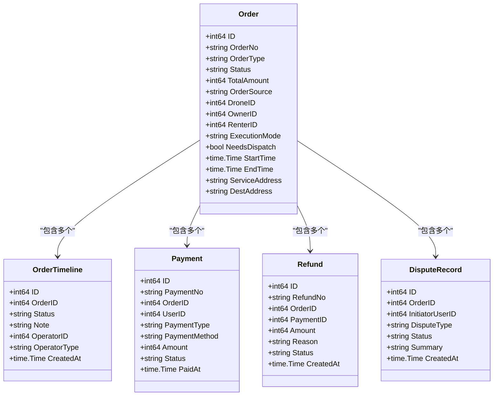
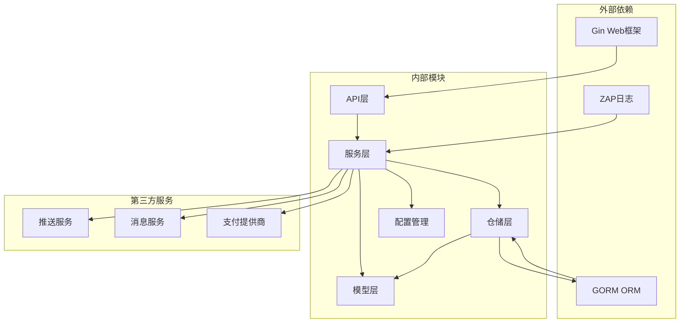

# 订单管理API

<cite>
**本文档引用的文件**
- [backend/internal/api/v1/order/handler.go](file://backend/internal/api/v1/order/handler.go)
- [backend/internal/api/v2/order/handler.go](file://backend/internal/api/v2/order/handler.go)
- [backend/internal/service/order_service.go](file://backend/internal/service/order_service.go)
- [backend/internal/repository/order_repo.go](file://backend/internal/repository/order_repo.go)
- [backend/internal/model/models.go](file://backend/internal/model/models.go)
- [backend/internal/service/event_service.go](file://backend/internal/service/event_service.go)
- [backend/internal/service/payment_service.go](file://backend/internal/service/payment_service.go)
- [backend/internal/repository/order_artifact_repo.go](file://backend/internal/repository/order_artifact_repo.go)
- [backend/migrations/105_create_order_artifacts.sql](file://backend/migrations/105_create_order_artifacts.sql)
- [BUSINESS_ROLE_REDESIGN.md](file://BUSINESS_ROLE_REDESIGN.md)
- [backend/docs/openapi-v2.yaml](file://backend/docs/openapi-v2.yaml)
- [mobile/src/services/orderFinanceV2.ts](file://mobile/src/services/orderFinanceV2.ts)
</cite>

## 目录
1. [简介](#简介)
2. [项目结构](#项目结构)
3. [核心组件](#核心组件)
4. [架构概览](#架构概览)
5. [详细组件分析](#详细组件分析)
6. [依赖关系分析](#依赖关系分析)
7. [性能考虑](#性能考虑)
8. [故障排除指南](#故障排除指南)
9. [结论](#结论)
10. [附录](#附录)

## 简介

订单管理API是无人机租赁平台的核心业务接口，负责管理订单的完整生命周期。该系统支持多种订单类型（租赁订单、货运订单、供给直达订单），提供完整的订单状态管理、支付处理、履约执行、评价反馈等功能。

系统采用分层架构设计，包含API层、服务层、仓储层和模型层，确保了良好的代码组织和可维护性。订单管理功能涵盖了从订单创建到完成的全过程，包括状态转换、事件通知、异步处理等高级特性。

## 项目结构

订单管理API位于后端项目的`backend/internal/api/v2/order/`目录下，采用标准的三层架构模式：

**图表来源**
- [backend/internal/api/v1/order/handler.go:1-155](file://backend/internal/api/v1/order/handler.go#L1-L155)
- [backend/internal/api/v2/order/handler.go:1-763](file://backend/internal/api/v2/order/handler.go#L1-L763)
- [backend/internal/service/order_service.go:1-800](file://backend/internal/service/order_service.go#L1-L800)

**章节来源**
- [backend/internal/api/v1/order/handler.go:1-155](file://backend/internal/api/v1/order/handler.go#L1-L155)
- [backend/internal/api/v2/order/handler.go:1-763](file://backend/internal/api/v2/order/handler.go#L1-L763)
- [backend/internal/service/order_service.go:1-800](file://backend/internal/service/order_service.go#L1-L800)

## 核心组件

### 订单处理器（Handler）

v2版本的订单处理器提供了完整的订单管理接口：

- **订单创建**：支持多种订单类型的创建
- **订单查询**：支持按角色、状态、分页查询
- **状态管理**：提供完整的状态转换接口
- **履约管理**：支持派单、执行状态更新
- **争议管理**：支持争议创建和查询

### 订单服务（Service）

订单服务实现了核心业务逻辑：

- **订单生命周期管理**：从创建到完成的完整流程
- **状态转换控制**：严格的权限验证和状态检查
- **事件通知**：基于事件的服务通知机制
- **数据一致性**：事务管理和数据同步

### 数据仓储（Repository）

仓储层提供了数据访问抽象：

- **订单数据访问**：CRUD操作和复杂查询
- **状态时间线**：订单状态变更历史记录
- **快照管理**：订单关键数据的快照保存

**章节来源**
- [backend/internal/api/v2/order/handler.go:18-30](file://backend/internal/api/v2/order/handler.go#L18-L30)
- [backend/internal/service/order_service.go:18-63](file://backend/internal/service/order_service.go#L18-L63)
- [backend/internal/repository/order_repo.go:10-20](file://backend/internal/repository/order_repo.go#L10-L20)

## 架构概览

订单管理系统采用事件驱动的架构模式，实现了松耦合的设计：

**图表来源**
- [backend/internal/api/v2/order/handler.go:56-80](file://backend/internal/api/v2/order/handler.go#L56-L80)
- [backend/internal/service/order_service.go:65-90](file://backend/internal/service/order_service.go#L65-L90)
- [backend/internal/service/event_service.go:95-113](file://backend/internal/service/event_service.go#L95-L113)

系统架构特点：

1. **分层清晰**：API层、服务层、仓储层职责明确
2. **事件驱动**：通过事件服务实现松耦合的通知机制
3. **事务管理**：关键操作使用数据库事务保证数据一致性
4. **扩展性强**：支持新的订单类型和状态的扩展

## 详细组件分析

### 订单状态机

订单状态机定义了订单在整个生命周期中的状态转换规则：

**图表来源**
- [BUSINESS_ROLE_REDESIGN.md:729-746](file://BUSINESS_ROLE_REDESIGN.md#L729-L746)

#### 状态转换规则

| 状态变更 | 触发方 | 触发方式 | 权限要求 |
|---------|--------|----------|----------|
| `pending_provider_confirmation → pending_payment` | 机主 | 确认订单 | 机主身份验证 |
| `pending_provider_confirmation → provider_rejected` | 机主 | 拒绝订单 | 机主身份验证 |
| `pending_payment → paid` | 系统 | 支付成功 | 无 |
| `paid → pending_dispatch` | 系统 | 支付完成后 | 无 |
| `assigned → preparing` | 执行飞手 | 开始准备 | 飞手身份验证 |
| `preparing → in_transit` | 系统 | 飞手上报起飞 | 无 |
| `in_transit → delivered` | 执行飞手 | 确认投送 | 飞手身份验证 |
| `delivered → completed` | 客户/系统 | 签收确认 | 客户身份验证 |

### 订单创建流程

订单创建流程包含了多种订单类型的支持：

**图表来源**
- [backend/internal/service/order_service.go:92-243](file://backend/internal/service/order_service.go#L92-L243)

### 支付处理流程

支付处理流程确保了订单状态的正确转换：

**图表来源**
- [backend/internal/service/payment_service.go:357-407](file://backend/internal/service/payment_service.go#L357-L407)

### 异步处理机制

系统采用了多种异步处理机制来提升性能和可靠性：

1. **事件通知异步化**：通过事件服务异步发送通知
2. **状态变更异步化**：订单状态变更通过时间线记录
3. **数据同步异步化**：订单快照通过后台任务同步

### 数据模型设计

订单相关的数据模型设计体现了系统的业务复杂性：

**图表来源**
- [backend/internal/model/models.go:500-570](file://backend/internal/model/models.go#L500-L570)

**章节来源**
- [BUSINESS_ROLE_REDESIGN.md:726-785](file://BUSINESS_ROLE_REDESIGN.md#L726-L785)
- [backend/internal/service/order_service.go:65-243](file://backend/internal/service/order_service.go#L65-L243)
- [backend/internal/service/payment_service.go:357-407](file://backend/internal/service/payment_service.go#L357-L407)
- [backend/internal/model/models.go:500-570](file://backend/internal/model/models.go#L500-L570)

## 依赖关系分析

订单管理系统的依赖关系体现了清晰的分层架构：

**图表来源**
- [backend/internal/api/v2/order/handler.go:1-20](file://backend/internal/api/v2/order/handler.go#L1-L20)
- [backend/internal/service/order_service.go:1-31](file://backend/internal/service/order_service.go#L1-L31)

### 核心依赖关系

1. **API层依赖服务层**：所有HTTP请求都委托给服务层处理
2. **服务层依赖仓储层**：业务逻辑通过仓储层访问数据
3. **仓储层依赖GORM**：使用GORM进行数据库操作
4. **服务层依赖事件服务**：通过事件服务发送通知

**章节来源**
- [backend/internal/api/v2/order/handler.go:1-20](file://backend/internal/api/v2/order/handler.go#L1-L20)
- [backend/internal/service/order_service.go:1-31](file://backend/internal/service/order_service.go#L1-L31)

## 性能考虑

### 数据库优化

1. **索引策略**：为常用查询字段建立适当索引
2. **预加载策略**：使用GORM的预加载功能减少N+1查询
3. **分页查询**：默认分页限制防止大数据集查询

### 缓存策略

1. **订单状态缓存**：热点订单状态的缓存
2. **用户信息缓存**：频繁访问的用户信息缓存
3. **配置信息缓存**：系统配置的缓存

### 异步处理

1. **事件异步化**：通过事件服务异步处理通知
2. **批处理**：定时任务处理批量数据
3. **队列机制**：重要但非紧急的操作放入队列

## 故障排除指南

### 常见问题及解决方案

#### 订单状态异常

**问题**：订单状态无法正常转换
**可能原因**：
- 权限验证失败
- 状态检查条件不满足
- 数据库事务冲突

**解决方案**：
1. 检查用户权限和角色
2. 验证订单当前状态
3. 查看事务日志和错误信息

#### 支付处理失败

**问题**：支付回调无法正确处理
**可能原因**：
- 支付网关回调延迟
- 数据库连接异常
- 事务回滚

**解决方案**：
1. 检查支付网关回调配置
2. 验证数据库连接状态
3. 查看支付日志和错误信息

#### 事件通知失败

**问题**：订单状态变更通知未送达
**可能原因**：
- 推送服务不可用
- 消息队列阻塞
- 用户设备离线

**解决方案**：
1. 检查推送服务状态
2. 监控消息队列长度
3. 实现重试机制

**章节来源**
- [backend/internal/service/order_service.go:721-811](file://backend/internal/service/order_service.go#L721-L811)
- [backend/internal/service/event_service.go:359-382](file://backend/internal/service/event_service.go#L359-L382)

## 结论

订单管理API系统设计合理，实现了完整的订单生命周期管理。系统具有以下优势：

1. **架构清晰**：分层架构确保了代码的可维护性和可扩展性
2. **功能完整**：涵盖了订单管理的所有核心功能
3. **可靠性高**：通过事务管理和事件驱动机制保证数据一致性
4. **性能良好**：合理的数据库设计和异步处理机制

未来可以考虑的改进方向：
- 增加更多的监控和告警机制
- 优化复杂的查询性能
- 扩展更多的订单类型支持
- 增强异常处理和恢复能力

## 附录

### API接口列表

#### v2版本订单接口

| 接口 | 方法 | 路径 | 功能描述 |
|------|------|------|----------|
| 订单列表 | GET | `/api/v2/orders` | 获取订单列表 |
| 订单详情 | GET | `/api/v2/orders/{order_id}` | 获取订单详情 |
| 订单创建 | POST | `/api/v2/supplies/{supply_id}/orders` | 从供给创建订单 |
| 机主确认 | POST | `/api/v2/orders/{order_id}/provider_confirm` | 机主确认订单 |
| 机主拒绝 | POST | `/api/v2/orders/{order_id}/provider_reject` | 机主拒绝订单 |
| 订单监控 | GET | `/api/v2/orders/{order_id}/monitor` | 订单监控信息 |
| 执行状态更新 | POST | `/api/v2/orders/{order_id}/execution_status` | 更新执行状态 |
| 签收确认 | POST | `/api/v2/orders/{order_id}/confirm_receipt` | 确认签收 |
| 创建争议 | POST | `/api/v2/orders/{order_id}/disputes` | 创建争议 |
| 争议列表 | GET | `/api/v2/orders/{order_id}/disputes` | 获取争议列表 |

**章节来源**
- [backend/docs/openapi-v2.yaml:130-146](file://backend/docs/openapi-v2.yaml#L130-L146)
- [mobile/src/services/orderFinanceV2.ts:44-54](file://mobile/src/services/orderFinanceV2.ts#L44-L54)

### 订单状态说明

| 状态码 | 中文名称 | 描述 |
|--------|----------|------|
| created | 已创建 | 订单已创建但未处理 |
| pending_provider_confirmation | 待机主确认 | 直达订单等待机主确认 |
| provider_rejected | 机主已拒绝 | 机主拒绝订单 |
| pending_payment | 待支付 | 等待客户支付 |
| paid | 已支付 | 客户已完成支付 |
| pending_dispatch | 待派单 | 等待派发给飞手 |
| assigned | 已分配执行 | 已分配给飞手执行 |
| preparing | 准备中 | 飞手正在准备执行 |
| in_transit | 运输中 | 货物正在运输途中 |
| delivered | 已送达 | 货物已送达 |
| completed | 已完成 | 订单已完成 |
| cancelled | 已取消 | 订单已取消 |
| refunding | 退款中 | 正在处理退款 |
| refunded | 已退款 | 退款已完成 |