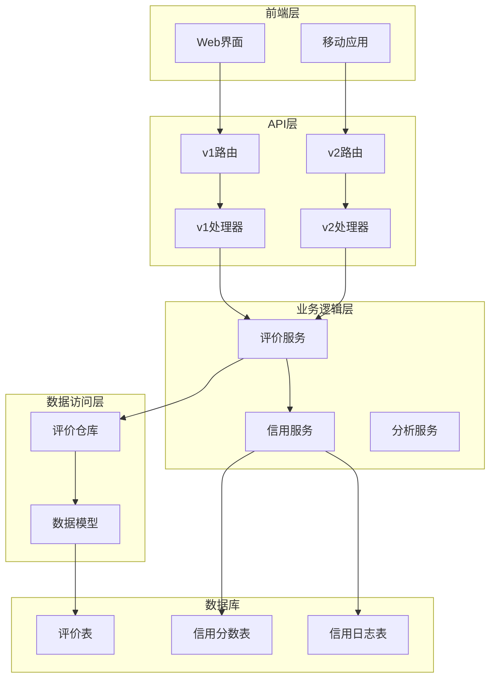
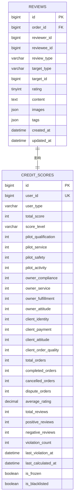
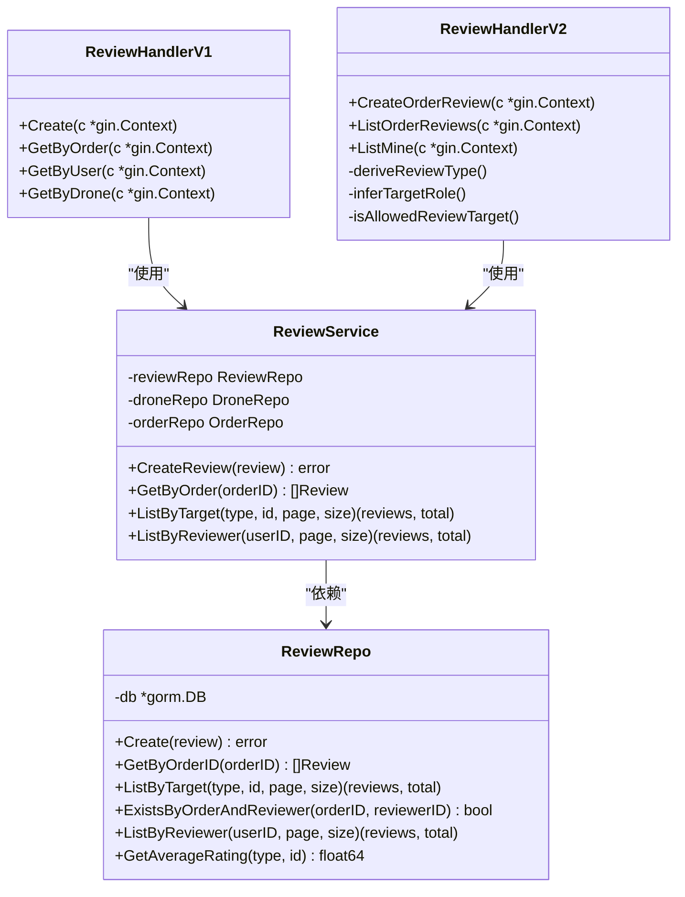
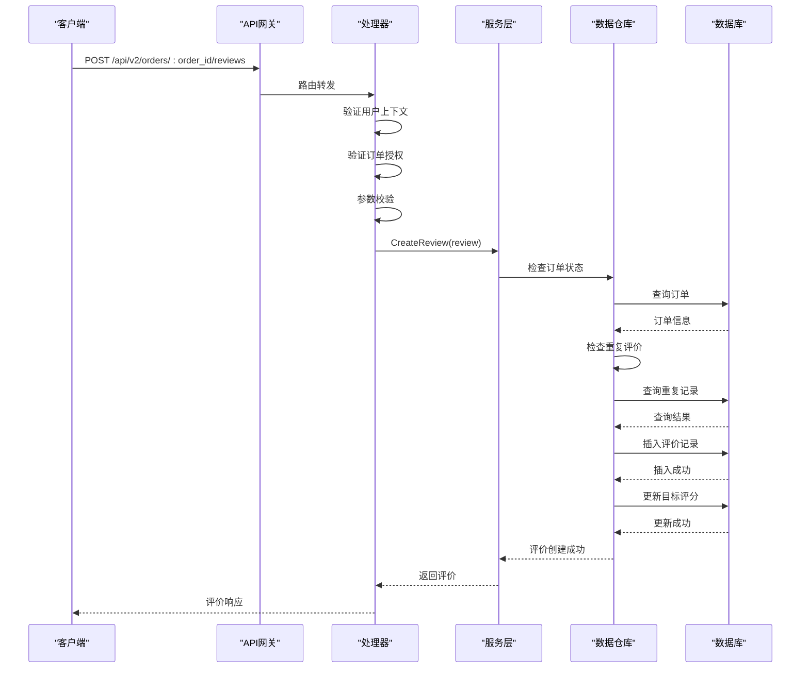
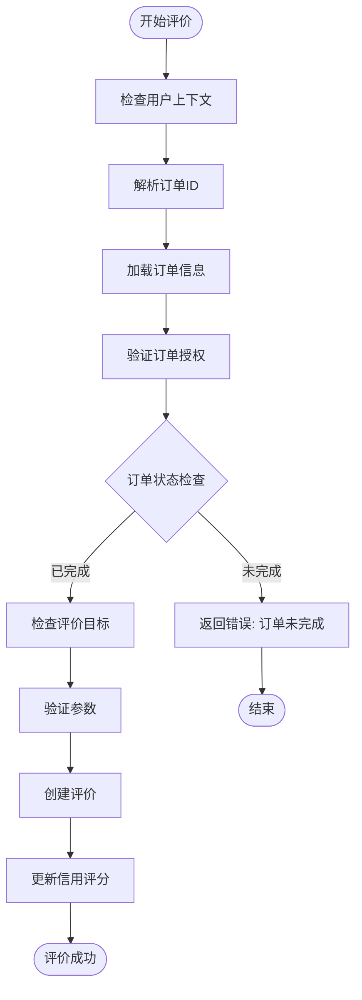
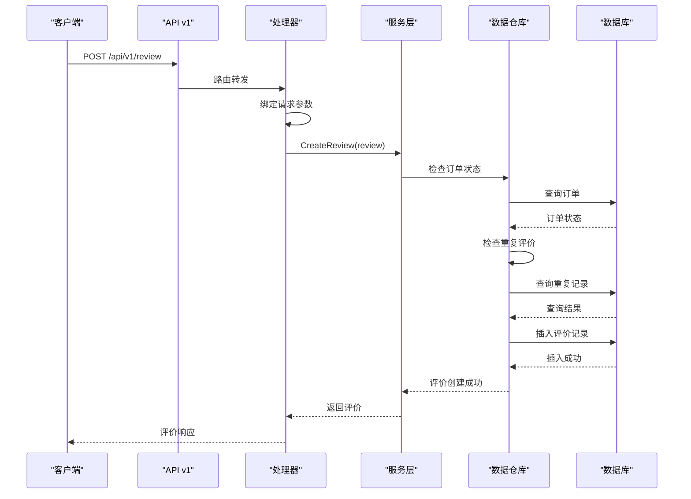
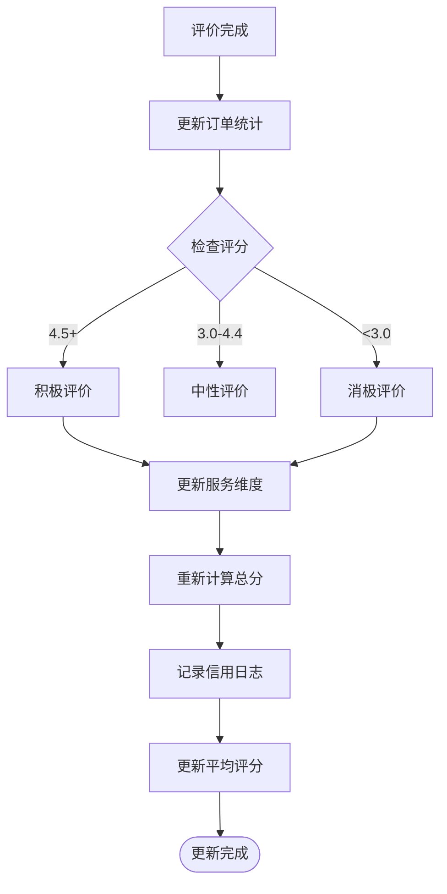
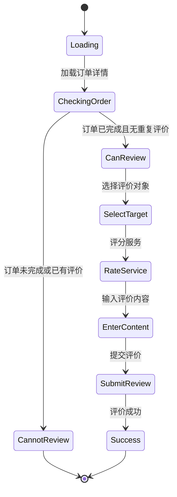
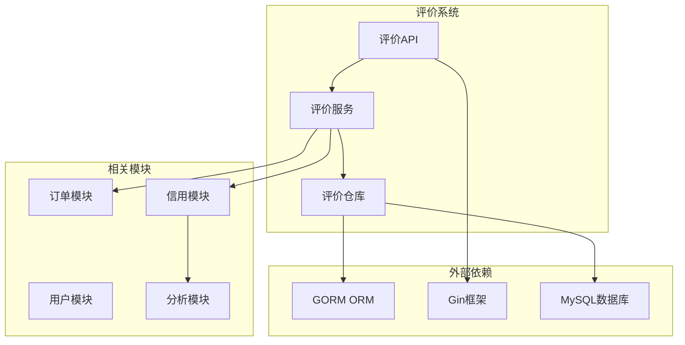

# 评价与评分API

<cite>
**本文档引用的文件**
- [backend/internal/api/v1/review/handler.go](file://backend/internal/api/v1/review/handler.go)
- [backend/internal/api/v2/review/handler.go](file://backend/internal/api/v2/review/handler.go)
- [backend/internal/repository/review_repo.go](file://backend/internal/repository/review_repo.go)
- [backend/internal/service/review_service.go](file://backend/internal/service/review_service.go)
- [backend/internal/api/v1/router.go](file://backend/internal/api/v1/router.go)
- [backend/internal/api/v2/router.go](file://backend/internal/api/v2/router.go)
- [mobile/src/services/review.ts](file://mobile/src/services/review.ts)
- [mobile/src/screens/order/ReviewScreen.tsx](file://mobile/src/screens/order/ReviewScreen.tsx)
- [backend/internal/model/models.go](file://backend/internal/model/models.go)
- [backend/migrations/001_init_schema.sql](file://backend/migrations/001_init_schema.sql)
- [backend/internal/service/credit_service.go](file://backend/internal/service/credit_service.go)
- [backend/internal/service/analytics_service.go](file://backend/internal/service/analytics_service.go)
- [backend/docs/openapi-v2.yaml](file://backend/docs/openapi-v2.yaml)
</cite>

## 目录
1. [简介](#简介)
2. [项目结构](#项目结构)
3. [核心组件](#核心组件)
4. [架构概览](#架构概览)
5. [详细组件分析](#详细组件分析)
6. [依赖关系分析](#依赖关系分析)
7. [性能考虑](#性能考虑)
8. [故障排除指南](#故障排除指南)
9. [结论](#结论)
10. [附录](#附录)

## 简介

本文件详细说明无人机租赁平台的评价与评分API系统。该系统提供完整的用户评价、服务评分、内容审核等功能接口，支持订单维度的评价管理，包含评价创建、查看、回复、举报等操作流程。

系统采用双版本API架构，v1版本提供基础的评价功能，v2版本引入了更严格的订单授权验证和角色识别机制。评价数据与信用评分系统深度集成，形成完整的信誉管理体系。

## 项目结构

评价与评分系统在代码库中的组织结构如下：

**图表来源**
- [backend/internal/api/v1/router.go:201-208](file://backend/internal/api/v1/router.go#L201-L208)
- [backend/internal/api/v2/router.go:159-182](file://backend/internal/api/v2/router.go#L159-L182)

**章节来源**
- [backend/internal/api/v1/router.go:201-208](file://backend/internal/api/v1/router.go#L201-L208)
- [backend/internal/api/v2/router.go:159-182](file://backend/internal/api/v2/router.go#L159-L182)

## 核心组件

### 数据模型设计

评价系统基于以下核心数据模型：

**图表来源**
- [backend/migrations/001_init_schema.sql:237-256](file://backend/migrations/001_init_schema.sql#L237-L256)
- [backend/internal/model/models.go:2087-2144](file://backend/internal/model/models.go#L2087-L2144)

### 评价服务架构

**图表来源**
- [backend/internal/api/v1/review/handler.go:14-35](file://backend/internal/api/v1/review/handler.go#L14-L35)
- [backend/internal/api/v2/review/handler.go:16-84](file://backend/internal/api/v2/review/handler.go#L16-L84)
- [backend/internal/service/review_service.go:10-49](file://backend/internal/service/review_service.go#L10-L49)
- [backend/internal/repository/review_repo.go:9-67](file://backend/internal/repository/review_repo.go#L9-L67)

**章节来源**
- [backend/internal/service/review_service.go:10-62](file://backend/internal/service/review_service.go#L10-L62)
- [backend/internal/repository/review_repo.go:9-67](file://backend/internal/repository/review_repo.go#L9-L67)

## 架构概览

评价系统采用分层架构设计，确保功能模块的清晰分离和可维护性：

**图表来源**
- [backend/internal/api/v2/review/handler.go:28-84](file://backend/internal/api/v2/review/handler.go#L28-L84)
- [backend/internal/service/review_service.go:20-49](file://backend/internal/service/review_service.go#L20-L49)

## 详细组件分析

### v2版本评价API

v2版本引入了更严格的安全控制和业务逻辑：

#### 订单授权验证

**图表来源**
- [backend/internal/api/v2/review/handler.go:28-84](file://backend/internal/api/v2/review/handler.go#L28-L84)

#### 评价类型推导机制

系统支持多种评价类型，通过角色识别自动推导：

| 评价类型 | 角色组合 | 用途场景 |
|---------|----------|----------|
| user_to_user | 用户对用户 | 一般用户评价 |
| client_to_owner | 客户对机主 | 租赁服务评价 |
| owner_to_client | 机主对客户 | 服务提供评价 |
| client_to_pilot | 客户对飞手 | 飞行服务评价 |
| pilot_to_client | 飞手对客户 | 飞行服务评价 |
| client_to_drone | 客户对无人机 | 设备使用评价 |

**章节来源**
- [backend/internal/api/v2/review/handler.go:152-174](file://backend/internal/api/v2/review/handler.go#L152-L174)

### v1版本评价API

v1版本提供基础的评价功能，适合简单的评价需求：

#### 基础评价流程

**图表来源**
- [backend/internal/api/v1/review/handler.go:22-35](file://backend/internal/api/v1/review/handler.go#L22-L35)

**章节来源**
- [backend/internal/api/v1/review/handler.go:22-70](file://backend/internal/api/v1/review/handler.go#L22-L70)

### 信用评分集成

评价系统与信用评分系统深度集成，形成完整的信誉管理体系：

#### 信用评分更新机制

**图表来源**
- [backend/internal/service/credit_service.go:133-223](file://backend/internal/service/credit_service.go#L133-L223)

**章节来源**
- [backend/internal/service/credit_service.go:133-223](file://backend/internal/service/credit_service.go#L133-L223)

### 移动端集成

移动端提供了完整的评价功能界面：

#### 评价界面交互流程

**图表来源**
- [mobile/src/screens/order/ReviewScreen.tsx:135-162](file://mobile/src/screens/order/ReviewScreen.tsx#L135-L162)

**章节来源**
- [mobile/src/screens/order/ReviewScreen.tsx:135-162](file://mobile/src/screens/order/ReviewScreen.tsx#L135-L162)

## 依赖关系分析

评价系统与其他模块的依赖关系如下：

**图表来源**
- [backend/internal/service/review_service.go:10-18](file://backend/internal/service/review_service.go#L10-L18)
- [backend/internal/repository/review_repo.go:3-7](file://backend/internal/repository/review_repo.go#L3-L7)

**章节来源**
- [backend/internal/service/review_service.go:10-18](file://backend/internal/service/review_service.go#L10-L18)
- [backend/internal/repository/review_repo.go:3-7](file://backend/internal/repository/review_repo.go#L3-L7)

## 性能考虑

### 数据库优化策略

1. **索引优化**
   - 评价表针对 `order_id`、`reviewer_id`、`reviewee_id`、`target_type` 和 `target_id` 建立复合索引
   - 支持高频查询场景的快速检索

2. **分页查询**
   - 默认每页20条记录，最大支持100条/页
   - 支持大数据量下的高效分页

3. **缓存策略**
   - 平均评分采用数据库聚合函数计算
   - 定期统计分析可考虑引入Redis缓存

### API性能优化

1. **并发控制**
   - 评价创建采用数据库事务保证一致性
   - 避免重复评价的双重检查机制

2. **错误处理**
   - 详细的错误码和错误信息
   - 用户友好的错误提示

## 故障排除指南

### 常见问题及解决方案

#### 评价创建失败

**问题症状**：用户无法提交评价

**可能原因**：
1. 订单状态不是已完成
2. 用户重复评价同一订单
3. 评价目标不合法

**解决步骤**：
1. 检查订单状态是否为 `completed`
2. 验证用户是否已对该订单评价过
3. 确认评价目标是否为订单参与者

#### 信用评分异常

**问题症状**：信用评分计算不准确

**可能原因**：
1. 评价数据丢失
2. 信用评分计算逻辑错误
3. 数据库连接问题

**解决步骤**：
1. 检查评价数据完整性
2. 验证信用评分计算逻辑
3. 重新计算信用评分

**章节来源**
- [backend/internal/service/review_service.go:20-49](file://backend/internal/service/review_service.go#L20-L49)
- [backend/internal/service/credit_service.go:133-223](file://backend/internal/service/credit_service.go#L133-L223)

## 结论

评价与评分API系统提供了完整、安全、可扩展的评价管理功能。系统采用双版本架构，v1版本满足基础需求，v2版本提供更强的安全控制和业务逻辑。与信用评分系统的深度集成形成了完整的信誉管理体系。

系统的主要优势包括：
- 双版本API架构，满足不同需求层次
- 严格的订单授权验证机制
- 与信用评分系统的无缝集成
- 完善的错误处理和性能优化
- 移动端友好界面设计

## 附录

### API接口规范

#### v2版本评价接口

| 方法 | 路径 | 功能 | 权限 |
|------|------|------|------|
| POST | `/api/v2/orders/:order_id/reviews` | 创建订单评价 | 已登录用户 |
| GET | `/api/v2/orders/:order_id/reviews` | 获取订单评价列表 | 已登录用户 |
| GET | `/api/v2/me/reviews` | 获取我的评价记录 | 已登录用户 |

#### v1版本评价接口

| 方法 | 路径 | 功能 | 权限 |
|------|------|------|------|
| POST | `/api/v1/review` | 创建评价 | 已登录用户 |
| GET | `/api/v1/review/order/:orderId` | 按订单查询评价 | 已登录用户 |
| GET | `/api/v1/review/user/:userId` | 按用户查询评价 | 已登录用户 |
| GET | `/api/v1/review/drone/:droneId` | 按无人机查询评价 | 已登录用户 |

**章节来源**
- [backend/docs/openapi-v2.yaml:79-88](file://backend/docs/openapi-v2.yaml#L79-L88)
- [backend/internal/api/v1/router.go:201-208](file://backend/internal/api/v1/router.go#L201-L208)
- [backend/internal/api/v2/router.go:159-182](file://backend/internal/api/v2/router.go#L159-L182)

### 数据模型字段说明

#### 评价表字段

| 字段名 | 类型 | 说明 | 约束 |
|--------|------|------|------|
| id | bigint | 主键 | 自增 |
| order_id | bigint | 订单ID | 外键 |
| reviewer_id | bigint | 评价者ID | 必填 |
| reviewee_id | bigint | 被评价者ID | 必填 |
| review_type | varchar | 评价类型 | 必填 |
| target_type | varchar | 评价目标类型 | 必填 |
| target_id | bigint | 评价目标ID | 必填 |
| rating | tinyint | 评分 | 1-5 |
| content | text | 评价内容 | 可选 |
| images | json | 图片附件 | 可选 |
| tags | json | 标签 | 可选 |
| created_at | datetime | 创建时间 | 自动 |
| updated_at | datetime | 更新时间 | 自动 |

**章节来源**
- [backend/migrations/001_init_schema.sql:237-256](file://backend/migrations/001_init_schema.sql#L237-L256)