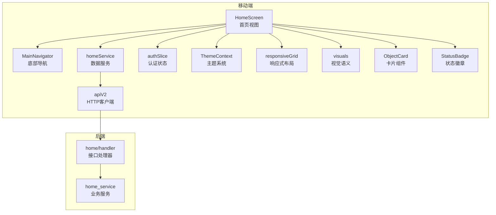
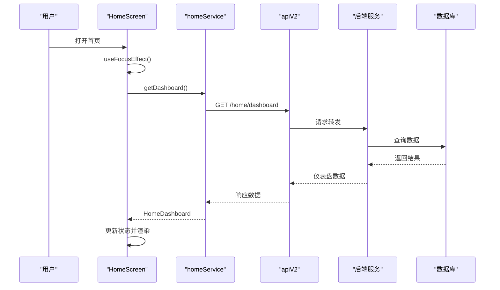
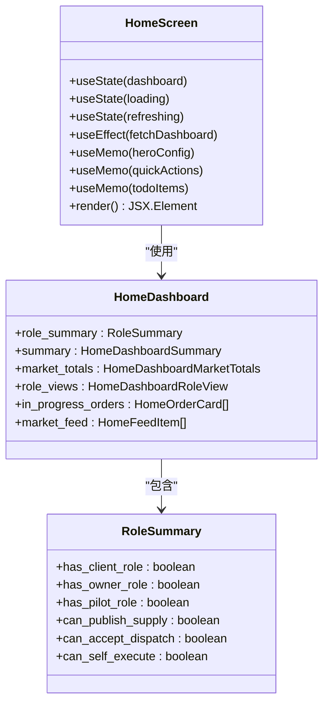
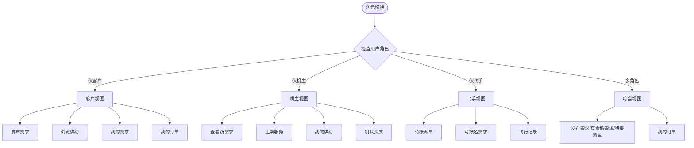
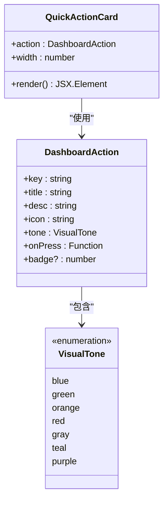
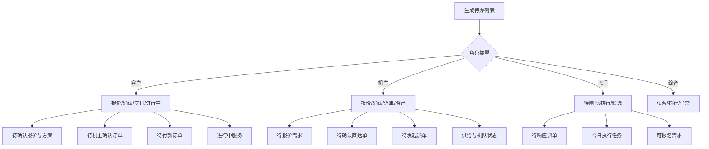
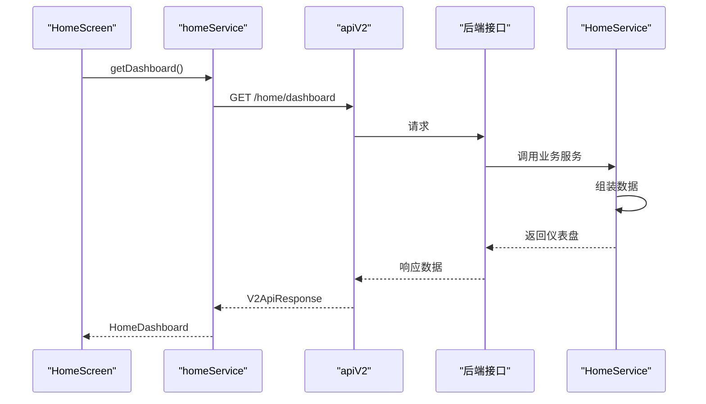
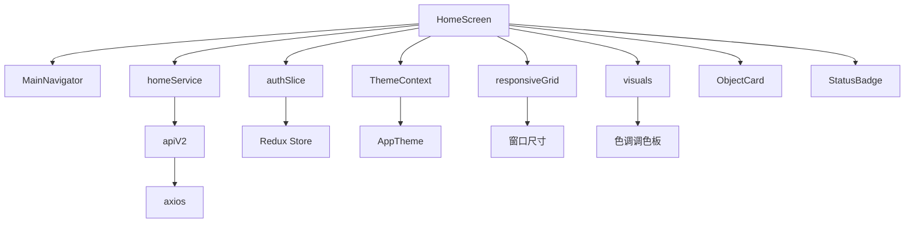
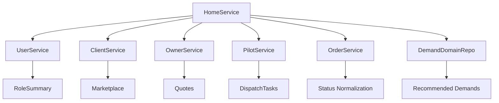

# 移动端首页（Mobile Home Screen）

<cite>
**本文档引用的文件**
- [HomeScreen.tsx](file://mobile/src/screens/home/HomeScreen.tsx)
- [home.ts](file://mobile/src/services/home.ts)
- [MainNavigator.tsx](file://mobile/src/navigation/MainNavigator.tsx)
- [authSlice.ts](file://mobile/src/store/slices/authSlice.ts)
- [visuals.ts](file://mobile/src/components/business/visuals.ts)
- [responsiveGrid.ts](file://mobile/src/utils/responsiveGrid.ts)
- [ThemeContext.tsx](file://mobile/src/theme/ThemeContext.tsx)
- [ObjectCard.tsx](file://mobile/src/components/business/ObjectCard.tsx)
- [StatusBadge.tsx](file://mobile/src/components/business/StatusBadge.tsx)
- [api.ts](file://mobile/src/services/api.ts)
- [index.ts](file://mobile/src/types/index.ts)
- [home_service.go](file://backend/internal/service/home_service.go)
- [handler.go](file://backend/internal/api/v2/home/handler.go)
</cite>

## 目录
1. [简介](#简介)
2. [项目结构](#项目结构)
3. [核心组件](#核心组件)
4. [架构总览](#架构总览)
5. [详细组件分析](#详细组件分析)
6. [依赖关系分析](#依赖关系分析)
7. [性能考虑](#性能考虑)
8. [故障排除指南](#故障排除指南)
9. [结论](#结论)

## 简介
移动端首页是无人机租赁平台的核心入口，为不同角色（客户、机主、飞手）提供个性化的仪表盘视图。该页面通过统一的数据源聚合各角色的关键指标、待办事项、快捷操作和进行中的任务，帮助用户快速定位当前最重要的业务动作。

## 项目结构
移动端首页位于 `mobile/src/screens/home/HomeScreen.tsx`，采用模块化设计：
- 视图层：HomeScreen 负责渲染界面、处理交互和状态管理
- 服务层：home.ts 封装 API 调用，使用 apiV2 客户端
- 导航层：MainNavigator 将 HomeScreen 注册为底部导航标签
- 状态层：Redux slice 提供认证状态和角色摘要
- 组件层：ObjectCard、StatusBadge 等业务组件复用性强
- 工具层：responsiveGrid 实现响应式布局，visuals 提供视觉语义

**图表来源**
- [HomeScreen.tsx:251-1175](file://mobile/src/screens/home/HomeScreen.tsx#L251-1175)
- [MainNavigator.tsx:111-129](file://mobile/src/navigation/MainNavigator.tsx#L111-129)
- [home.ts:4-7](file://mobile/src/services/home.ts#L4-7)
- [api.ts:16-155](file://mobile/src/services/api.ts#L16-155)
- [authSlice.ts:22-65](file://mobile/src/store/slices/authSlice.ts#L22-65)
- [ThemeContext.tsx:14-31](file://mobile/src/theme/ThemeContext.tsx#L14-31)
- [responsiveGrid.ts:14-37](file://mobile/src/utils/responsiveGrid.ts#L14-37)
- [visuals.ts:59-60](file://mobile/src/components/business/visuals.ts#L59-60)
- [ObjectCard.tsx:18-52](file://mobile/src/components/business/ObjectCard.tsx#L18-52)
- [StatusBadge.tsx:12-29](file://mobile/src/components/business/StatusBadge.tsx#L12-29)
- [handler.go:20-34](file://backend/internal/api/v2/home/handler.go#L20-34)
- [home_service.go:157-216](file://backend/internal/service/home_service.go#L157-216)

**章节来源**
- [HomeScreen.tsx:251-1175](file://mobile/src/screens/home/HomeScreen.tsx#L251-1175)
- [MainNavigator.tsx:111-129](file://mobile/src/navigation/MainNavigator.tsx#L111-129)

## 核心组件
移动端首页包含以下关键组件：

### 主题系统
- 支持深色/浅色主题切换
- 每个角色拥有专属渐变色彩方案
- 动态应用到英雄区、徽章和按钮

### 响应式布局
- 自适应两列网格布局
- 根据屏幕宽度动态调整卡片尺寸
- 底部安全区域适配

### 角色化视图
- 客户视图：强调需求发布、报价筛选、支付流程
- 机主视图：突出获客、报价和履约准备
- 飞手视图：聚焦派单响应、执行任务和飞行记录
- 综合视图：按角色组合展示关键指标

### 数据聚合
- 仪表盘摘要：进行中订单、今日订单、今日收入、异常提醒
- 市场总览：供给/需求数量
- 角色指标：各角色特有的业务指标
- 进行中订单：最近的3个执行中订单
- 市场动态：最新供给和需求

**章节来源**
- [HomeScreen.tsx:81-124](file://mobile/src/screens/home/HomeScreen.tsx#L81-124)
- [HomeScreen.tsx:210-249](file://mobile/src/screens/home/HomeScreen.tsx#L210-249)
- [HomeScreen.tsx:371-380](file://mobile/src/screens/home/HomeScreen.tsx#L371-380)
- [index.ts:79-90](file://mobile/src/types/index.ts#L79-90)

## 架构总览
移动端首页采用分层架构，确保职责清晰和可维护性：

**图表来源**
- [HomeScreen.tsx:334-363](file://mobile/src/screens/home/HomeScreen.tsx#L334-363)
- [home.ts:4-7](file://mobile/src/services/home.ts#L4-7)
- [api.ts:16-155](file://mobile/src/services/api.ts#L16-155)
- [handler.go:20-34](file://backend/internal/api/v2/home/handler.go#L20-34)
- [home_service.go:157-216](file://backend/internal/service/home_service.go#L157-216)

## 详细组件分析

### HomeScreen 主组件
HomeScreen 是整个首页的核心，负责：
- 认证状态监听和数据加载控制
- 角色切换和视图渲染
- 下拉刷新和错误处理
- 响应式布局计算

**图表来源**
- [HomeScreen.tsx:251-1175](file://mobile/src/screens/home/HomeScreen.tsx#L251-1175)
- [index.ts:79-90](file://mobile/src/types/index.ts#L79-90)
- [index.ts:13-25](file://mobile/src/types/index.ts#L13-25)

**章节来源**
- [HomeScreen.tsx:251-363](file://mobile/src/screens/home/HomeScreen.tsx#L251-363)
- [HomeScreen.tsx:370-607](file://mobile/src/screens/home/HomeScreen.tsx#L370-607)

### 角色视图系统
系统支持三种角色视图，每种都有独特的指标和操作：

**图表来源**
- [HomeScreen.tsx:280-316](file://mobile/src/screens/home/HomeScreen.tsx#L280-316)
- [HomeScreen.tsx:608-762](file://mobile/src/screens/home/HomeScreen.tsx#L608-762)

**章节来源**
- [HomeScreen.tsx:280-316](file://mobile/src/screens/home/HomeScreen.tsx#L280-316)
- [HomeScreen.tsx:608-762](file://mobile/src/screens/home/HomeScreen.tsx#L608-762)

### 快捷操作组件
QuickActionCard 提供统一的操作入口，支持徽章显示和主题适配：

**图表来源**
- [HomeScreen.tsx:165-208](file://mobile/src/screens/home/HomeScreen.tsx#L165-208)
- [HomeScreen.tsx:57-65](file://mobile/src/screens/home/HomeScreen.tsx#L57-65)
- [visuals.ts:1-8](file://mobile/src/components/business/visuals.ts#L1-8)

**章节来源**
- [HomeScreen.tsx:165-208](file://mobile/src/screens/home/HomeScreen.tsx#L165-208)
- [HomeScreen.tsx:57-65](file://mobile/src/screens/home/HomeScreen.tsx#L57-65)

### 待办事项系统
TodoItem 提供个性化的待办提醒，支持不同角色的任务优先级：

**图表来源**
- [HomeScreen.tsx:764-941](file://mobile/src/screens/home/HomeScreen.tsx#L764-941)

**章节来源**
- [HomeScreen.tsx:764-941](file://mobile/src/screens/home/HomeScreen.tsx#L764-941)

### 数据服务层
homeService 封装了首页数据获取逻辑，使用 apiV2 客户端：

**图表来源**
- [home.ts:4-7](file://mobile/src/services/home.ts#L4-7)
- [api.ts:16-155](file://mobile/src/services/api.ts#L16-155)
- [handler.go:20-34](file://backend/internal/api/v2/home/handler.go#L20-34)
- [home_service.go:157-216](file://backend/internal/service/home_service.go#L157-216)

**章节来源**
- [home.ts:4-7](file://mobile/src/services/home.ts#L4-7)
- [api.ts:16-155](file://mobile/src/services/api.ts#L16-155)

## 依赖关系分析

### 前端依赖图

**图表来源**
- [HomeScreen.tsx:251-1175](file://mobile/src/screens/home/HomeScreen.tsx#L251-1175)
- [MainNavigator.tsx:111-129](file://mobile/src/navigation/MainNavigator.tsx#L111-129)
- [home.ts:4-7](file://mobile/src/services/home.ts#L4-7)
- [authSlice.ts:22-65](file://mobile/src/store/slices/authSlice.ts#L22-65)
- [ThemeContext.tsx:14-31](file://mobile/src/theme/ThemeContext.tsx#L14-31)
- [responsiveGrid.ts:14-37](file://mobile/src/utils/responsiveGrid.ts#L14-37)
- [visuals.ts:59-60](file://mobile/src/components/business/visuals.ts#L59-60)
- [ObjectCard.tsx:18-52](file://mobile/src/components/business/ObjectCard.tsx#L18-52)
- [StatusBadge.tsx:12-29](file://mobile/src/components/business/StatusBadge.tsx#L12-29)
- [api.ts:16-155](file://mobile/src/services/api.ts#L16-155)

### 后端服务依赖
后端 HomeService 依赖多个子服务来构建完整的仪表盘数据：

**图表来源**
- [home_service.go:103-128](file://backend/internal/service/home_service.go#L103-128)
- [home_service.go:157-216](file://backend/internal/service/home_service.go#L157-216)

**章节来源**
- [authSlice.ts:22-65](file://mobile/src/store/slices/authSlice.ts#L22-65)
- [home_service.go:103-128](file://backend/internal/service/home_service.go#L103-128)

## 性能考虑
移动端首页在性能方面采用了多项优化策略：

### 渲染优化
- 使用 React.memo 优化复杂计算
- useMemo 缓存计算结果，避免重复渲染
- useCallback 优化回调函数引用
- useFocusEffect 确保页面聚焦时才加载数据

### 网络优化
- 单次请求获取完整仪表盘数据
- 15秒超时设置，避免长时间等待
- 自动令牌刷新机制，减少鉴权失败重试

### 内存管理
- 及时清理异步操作引用
- 条件渲染避免不必要的组件创建
- 固定数量的进行中订单展示（最多3个）

### 响应式设计
- 动态计算网格布局，适应不同屏幕尺寸
- 按需显示徽章，避免过度拥挤
- 适当的阴影和渐变效果平衡美观与性能

## 故障排除指南

### 常见问题诊断
1. **数据加载失败**
   - 检查网络连接状态
   - 验证认证令牌有效性
   - 查看后端服务日志

2. **角色视图异常**
   - 确认用户角色摘要正确
   - 检查权限配置
   - 验证角色切换逻辑

3. **布局错乱**
   - 检查窗口尺寸计算
   - 验证响应式网格参数
   - 确认主题颜色配置

### 错误处理机制
- 组件内部捕获并处理 API 错误
- 使用空状态占位符避免空白界面
- 提供下拉刷新功能重新加载数据
- 认证失效时自动登出并重定向

**章节来源**
- [HomeScreen.tsx:334-353](file://mobile/src/screens/home/HomeScreen.tsx#L334-353)
- [api.ts:79-147](file://mobile/src/services/api.ts#L79-147)

## 结论
移动端首页通过精心设计的角色化视图、响应式布局和高效的数据聚合，为不同角色的用户提供了直观、高效的业务入口。其模块化的架构设计确保了代码的可维护性和扩展性，同时通过多项性能优化保证了良好的用户体验。该实现体现了现代移动应用开发的最佳实践，为后续的功能扩展奠定了坚实基础。