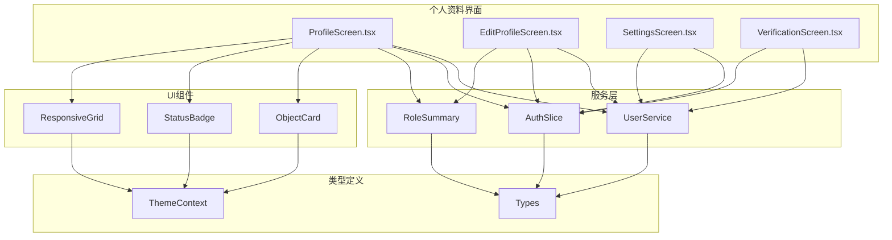
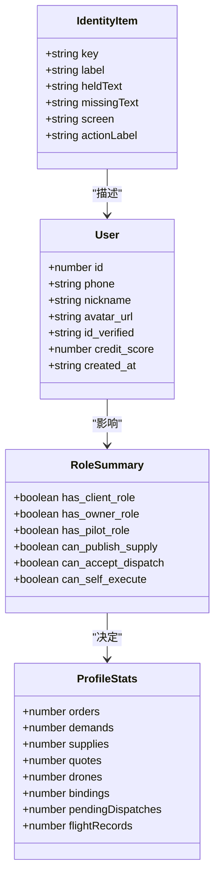
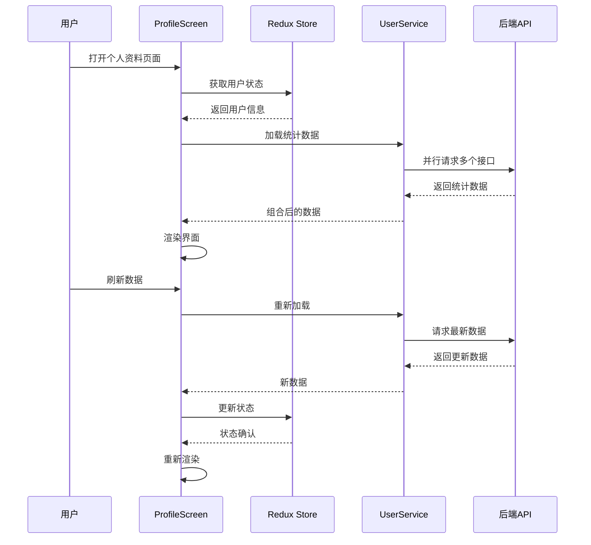
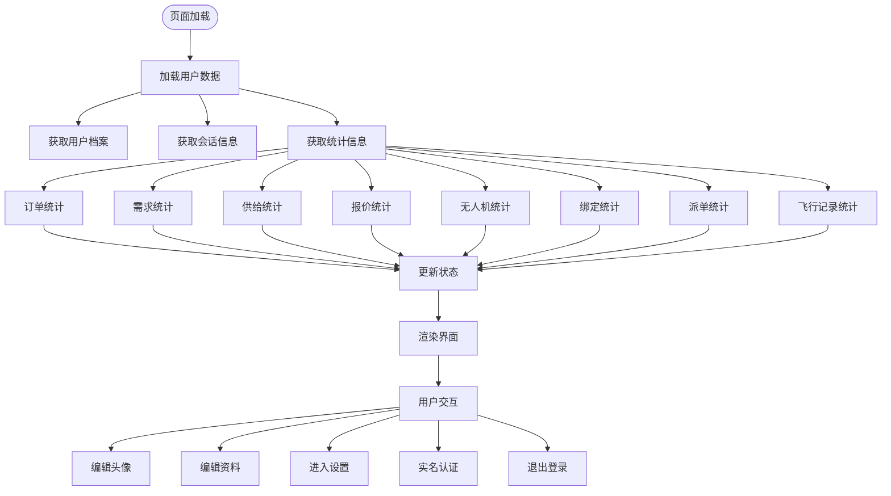
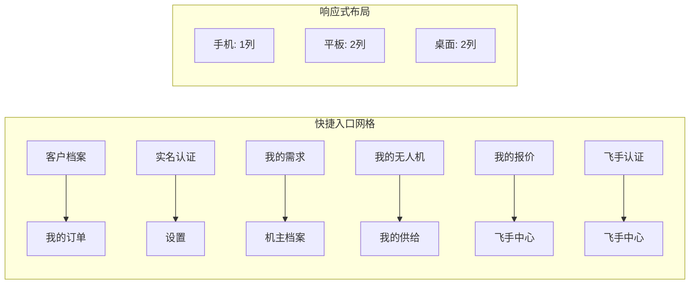
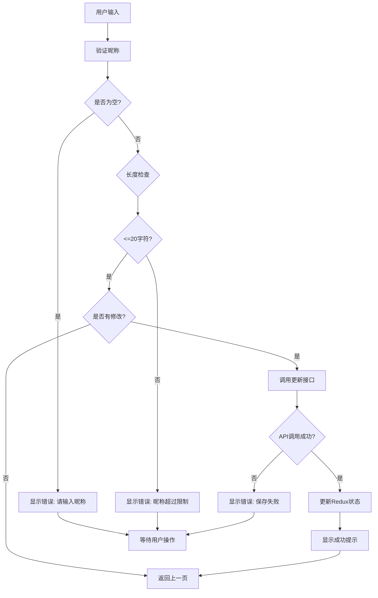
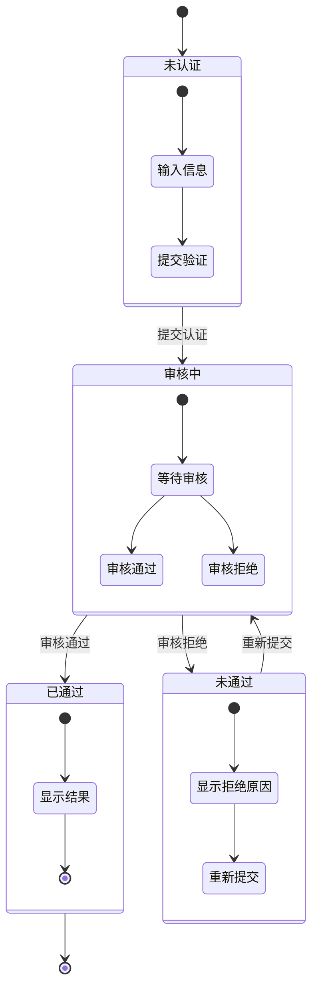
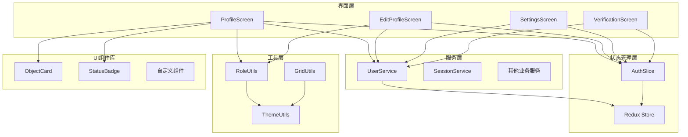

# 移动端个人资料界面文档

<cite>
**本文档引用的文件**
- [ProfileScreen.tsx](file://mobile/src/screens/profile/ProfileScreen.tsx)
- [EditProfileScreen.tsx](file://mobile/src/screens/profile/EditProfileScreen.tsx)
- [SettingsScreen.tsx](file://mobile/src/screens/profile/SettingsScreen.tsx)
- [VerificationScreen.tsx](file://mobile/src/screens/profile/VerificationScreen.tsx)
- [user.ts](file://mobile/src/services/user.ts)
- [authSlice.ts](file://mobile/src/store/slices/authSlice.ts)
- [roleSummary.ts](file://mobile/src/utils/roleSummary.ts)
- [ObjectCard.tsx](file://mobile/src/components/business/ObjectCard.tsx)
- [StatusBadge.tsx](file://mobile/src/components/business/StatusBadge.tsx)
- [responsiveGrid.ts](file://mobile/src/utils/responsiveGrid.ts)
- [ThemeContext.tsx](file://mobile/src/theme/ThemeContext.tsx)
- [index.ts](file://mobile/src/types/index.ts)
</cite>

## 目录
1. [简介](#简介)
2. [项目结构](#项目结构)
3. [核心组件](#核心组件)
4. [架构概览](#架构概览)
5. [详细组件分析](#详细组件分析)
6. [依赖关系分析](#依赖关系分析)
7. [性能考虑](#性能考虑)
8. [故障排除指南](#故障排除指南)
9. [结论](#结论)

## 简介

移动端个人资料界面是无人机租赁平台的核心功能模块之一，为用户提供个人档案管理、身份认证、设置配置等综合服务。该界面采用响应式设计，支持多种用户角色（客户、机主、飞手），并集成了完整的数据流管理和状态同步机制。

## 项目结构

个人资料相关文件组织结构如下：

**图表来源**
- [ProfileScreen.tsx:1-50](file://mobile/src/screens/profile/ProfileScreen.tsx#L1-L50)
- [user.ts:1-25](file://mobile/src/services/user.ts#L1-L25)
- [authSlice.ts:1-65](file://mobile/src/store/slices/authSlice.ts#L1-L65)

**章节来源**
- [ProfileScreen.tsx:1-881](file://mobile/src/screens/profile/ProfileScreen.tsx#L1-L881)
- [user.ts:1-25](file://mobile/src/services/user.ts#L1-L25)

## 核心组件

### 主要功能模块

个人资料界面包含以下核心功能模块：

1. **用户信息展示** - 头像、昵称、手机号、实名状态
2. **快捷入口** - 常用功能快速访问
3. **身份管理** - 多角色身份切换和管理
4. **设置配置** - 通知、主题、账户设置
5. **实名认证** - 身份信息验证流程

### 数据模型

**图表来源**
- [index.ts:1-120](file://mobile/src/types/index.ts#L1-L120)
- [ProfileScreen.tsx:43-118](file://mobile/src/screens/profile/ProfileScreen.tsx#L43-L118)

**章节来源**
- [index.ts:1-909](file://mobile/src/types/index.ts#L1-L909)
- [ProfileScreen.tsx:43-136](file://mobile/src/screens/profile/ProfileScreen.tsx#L43-L136)

## 架构概览

个人资料界面采用MVVM架构模式，结合Redux状态管理和React Hooks响应式编程：

**图表来源**
- [ProfileScreen.tsx:165-222](file://mobile/src/screens/profile/ProfileScreen.tsx#L165-L222)
- [user.ts:4-24](file://mobile/src/services/user.ts#L4-L24)

## 详细组件分析

### ProfileScreen 主界面

ProfileScreen是个人资料的核心界面，采用卡片式布局设计：

#### 页面结构

**图表来源**
- [ProfileScreen.tsx:165-222](file://mobile/src/screens/profile/ProfileScreen.tsx#L165-L222)
- [ProfileScreen.tsx:235-307](file://mobile/src/screens/profile/ProfileScreen.tsx#L235-L307)

#### 快捷入口系统

快捷入口采用响应式网格布局，根据屏幕宽度自动调整列数：

**图表来源**
- [ProfileScreen.tsx:382-428](file://mobile/src/screens/profile/ProfileScreen.tsx#L382-L428)
- [responsiveGrid.ts:14-37](file://mobile/src/utils/responsiveGrid.ts#L14-L37)

#### 身份卡片系统

身份卡片展示用户的多重身份状态：

| 身份类型 | 状态标识 | 功能特性 |
|---------|----------|----------|
| 客户身份 | 已拥有/默认档案未就绪 | 查看需求、订单统计 |
| 机主身份 | 已拥有/待建立 | 管理无人机、供给、绑定 |
| 飞手身份 | 已认证/去认证 | 接收派单、飞行记录 |

**章节来源**
- [ProfileScreen.tsx:91-118](file://mobile/src/screens/profile/ProfileScreen.tsx#L91-L118)
- [ProfileScreen.tsx:318-362](file://mobile/src/screens/profile/ProfileScreen.tsx#L318-L362)

### EditProfileScreen 编辑界面

编辑个人资料界面提供简洁的数据修改功能：

#### 表单验证流程

**图表来源**
- [EditProfileScreen.tsx:25-57](file://mobile/src/screens/profile/EditProfileScreen.tsx#L25-L57)

**章节来源**
- [EditProfileScreen.tsx:14-137](file://mobile/src/screens/profile/EditProfileScreen.tsx#L14-L137)

### SettingsScreen 设置界面

设置界面提供全面的账户配置选项：

#### 设置分类

| 设置类别 | 功能项 | 状态管理 |
|---------|--------|----------|
| 账户信息 | 手机号、昵称、实名认证 | Redux状态同步 |
| 通知设置 | 推送通知、消息提醒、订单通知 | 本地状态管理 |
| 通用设置 | 清除缓存、版本信息 | 应用内处理 |
| 关于信息 | 用户协议、隐私政策 | 外部链接 |

**章节来源**
- [SettingsScreen.tsx:13-178](file://mobile/src/screens/profile/SettingsScreen.tsx#L13-L178)

### VerificationScreen 实名认证

实名认证界面支持完整的身份验证流程：

#### 认证状态流程

**图表来源**
- [VerificationScreen.tsx:13-50](file://mobile/src/screens/profile/VerificationScreen.tsx#L13-L50)

**章节来源**
- [VerificationScreen.tsx:15-231](file://mobile/src/screens/profile/VerificationScreen.tsx#L15-L231)

## 依赖关系分析

个人资料界面的依赖关系呈现清晰的层次结构：

**图表来源**
- [ProfileScreen.tsx:23-36](file://mobile/src/screens/profile/ProfileScreen.tsx#L23-L36)
- [authSlice.ts:22-61](file://mobile/src/store/slices/authSlice.ts#L22-L61)

**章节来源**
- [ProfileScreen.tsx:138-592](file://mobile/src/screens/profile/ProfileScreen.tsx#L138-L592)
- [authSlice.ts:1-65](file://mobile/src/store/slices/authSlice.ts#L1-L65)

## 性能考虑

### 数据加载优化

1. **并发请求**：使用Promise.all并行加载多个统计数据
2. **防抖处理**：避免重复请求和状态更新
3. **缓存策略**：利用Redux状态缓存减少重复渲染

### 渲染性能

1. **Memo优化**：使用useMemo优化复杂计算
2. **懒加载**：高级功能采用折叠式加载
3. **响应式布局**：自适应不同屏幕尺寸

### 内存管理

1. **引用优化**：使用useRef存储引用避免不必要的重渲染
2. **清理机制**：组件卸载时清理定时器和订阅

## 故障排除指南

### 常见问题及解决方案

| 问题类型 | 症状描述 | 解决方案 |
|---------|----------|----------|
| 数据加载失败 | 统计数据显示异常或空白 | 检查网络连接，重新刷新页面 |
| 头像上传失败 | 上传后无变化 | 检查图片格式，重新选择图片 |
| 实名认证失败 | 提交后状态不变 | 检查身份证格式，重新提交 |
| 设置无法保存 | 修改后立即恢复原值 | 检查网络状态，重新尝试 |

### 调试建议

1. **开发者工具**：使用React DevTools检查组件状态
2. **网络监控**：检查API请求和响应
3. **状态检查**：验证Redux状态更新

**章节来源**
- [ProfileScreen.tsx:258-307](file://mobile/src/screens/profile/ProfileScreen.tsx#L258-L307)
- [EditProfileScreen.tsx:52-56](file://mobile/src/screens/profile/EditProfileScreen.tsx#L52-L56)

## 结论

移动端个人资料界面是一个功能完整、设计精良的用户管理系统。通过合理的架构设计和优化策略，实现了良好的用户体验和性能表现。界面支持多角色身份管理，提供了完整的个人信息管理和配置功能，是无人机租赁平台的重要组成部分。

该界面的设计体现了现代移动应用的最佳实践，包括响应式布局、状态管理、错误处理等方面，为后续的功能扩展奠定了坚实的基础。