# 移动Web兼容性

<cite>
**本文档引用的文件**
- [mobile/src/index.web.tsx](file://mobile/src/index.web.tsx)
- [mobile/src/utils/config.web.ts](file://mobile/src/utils/config.web.ts)
- [mobile/src/utils/react-native.web.ts](file://mobile/src/utils/react-native.web.ts)
- [mobile/src/utils/navigation.web.ts](file://mobile/src/utils/navigation.web.ts)
- [mobile/vite.config.ts](file://mobile/vite.config.ts)
- [mobile/src/utils/responsiveGrid.ts](file://mobile/src/utils/responsiveGrid.ts)
- [mobile/src/theme/index.ts](file://mobile/src/theme/index.ts)
- [mobile/src/utils/LocationService.ts](file://mobile/src/utils/LocationService.ts)
- [mobile/src/services/api.ts](file://mobile/src/services/api.ts)
- [mobile/src/constants/index.ts](file://mobile/src/constants/index.ts)
- [mobile/package.json](file://mobile/package.json)
- [mobile/index.html](file://mobile/index.html)
- [mobile/tsconfig.json](file://mobile/tsconfig.json)
</cite>

## 目录
1. [简介](#简介)
2. [项目结构](#项目结构)
3. [核心组件](#核心组件)
4. [架构概览](#架构概览)
5. [详细组件分析](#详细组件分析)
6. [依赖关系分析](#依赖关系分析)
7. [性能考虑](#性能考虑)
8. [故障排除指南](#故障排除指南)
9. [结论](#结论)

## 简介

本文档详细分析了无人机租赁平台项目的移动Web兼容性实现。该项目采用React Native架构，通过React Native Web实现跨平台兼容，支持iOS、Android和Web三个平台的一致用户体验。重点展示了如何在Web环境中模拟原生移动应用的功能，包括路由导航、状态管理、UI组件适配等关键技术实现。

## 项目结构

项目采用统一的React Native架构，通过别名映射实现多平台兼容：

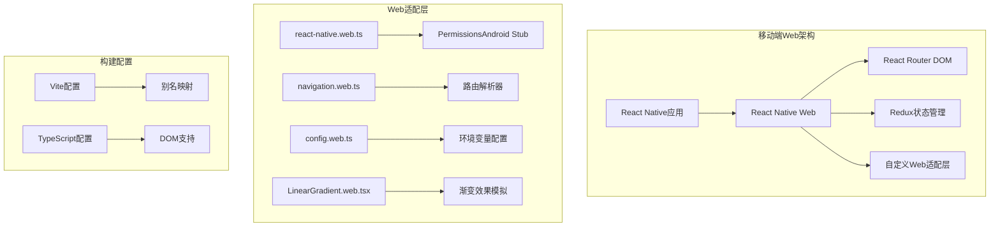

**图表来源**
- [mobile/src/index.web.tsx:1-744](file://mobile/src/index.web.tsx#L1-L744)
- [mobile/vite.config.ts:1-37](file://mobile/vite.config.ts#L1-L37)

**章节来源**
- [mobile/src/index.web.tsx:1-744](file://mobile/src/index.web.tsx#L1-L744)
- [mobile/vite.config.ts:1-37](file://mobile/vite.config.ts#L1-L37)

## 核心组件

### Web应用入口点

应用入口通过统一的入口文件实现多平台兼容：

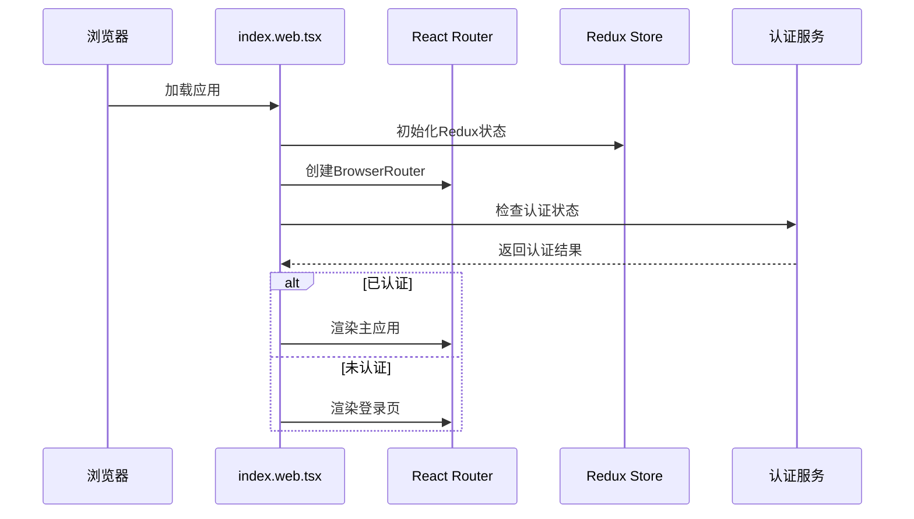

**图表来源**
- [mobile/src/index.web.tsx:632-727](file://mobile/src/index.web.tsx#L632-L727)

### 路由导航系统

实现了完整的路由导航系统，支持参数传递和页面跳转：

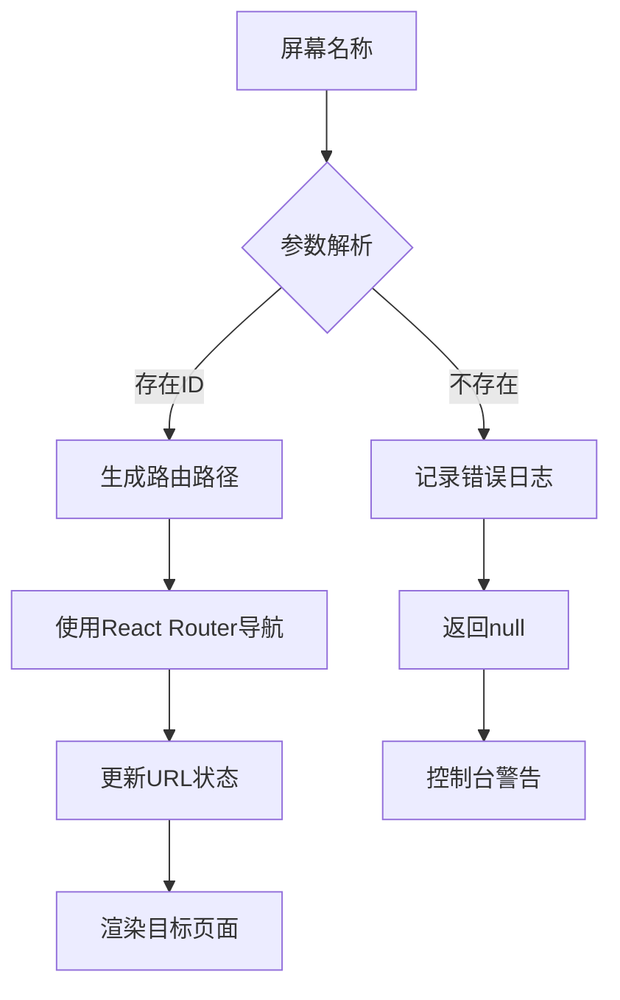

**图表来源**
- [mobile/src/index.web.tsx:61-254](file://mobile/src/index.web.tsx#L61-L254)

**章节来源**
- [mobile/src/index.web.tsx:1-744](file://mobile/src/index.web.tsx#L1-L744)

## 架构概览

### 整体架构设计

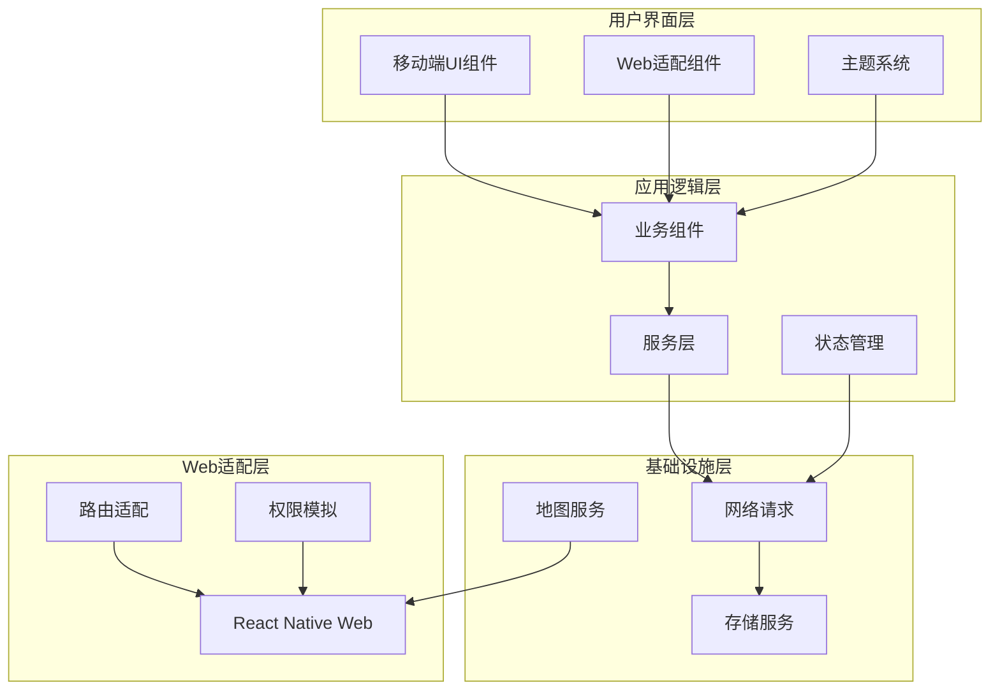

**图表来源**
- [mobile/src/index.web.tsx:1-744](file://mobile/src/index.web.tsx#L1-L744)
- [mobile/src/utils/navigation.web.ts:136-153](file://mobile/src/utils/navigation.web.ts#L136-L153)

## 详细组件分析

### Web适配层实现

#### React Native Web别名映射

通过Vite配置实现React Native到Web的无缝转换：

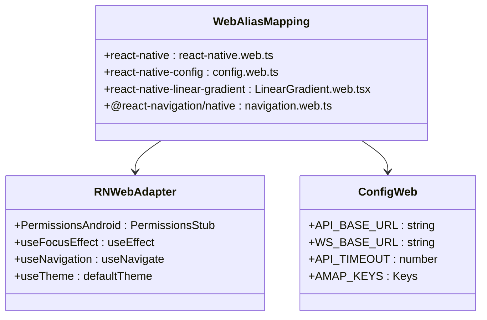

**图表来源**
- [mobile/vite.config.ts:11-18](file://mobile/vite.config.ts#L11-L18)
- [mobile/src/utils/react-native.web.ts:1-24](file://mobile/src/utils/react-native.web.ts#L1-L24)

#### 权限模拟实现

针对Web环境的权限模拟，特别是相机和位置权限：

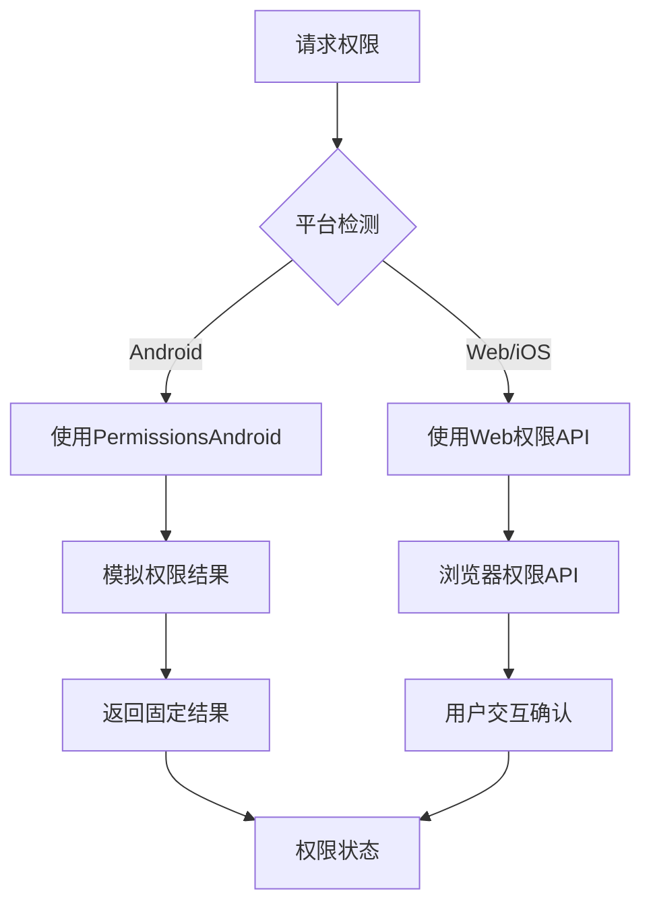

**图表来源**
- [mobile/src/utils/react-native.web.ts:6-23](file://mobile/src/utils/react-native.web.ts#L6-L23)

**章节来源**
- [mobile/vite.config.ts:1-37](file://mobile/vite.config.ts#L1-L37)
- [mobile/src/utils/react-native.web.ts:1-24](file://mobile/src/utils/react-native.web.ts#L1-L24)

### 导航系统实现

#### 路由解析器设计

实现了完整的路由解析系统，支持多种屏幕类型的路径转换：

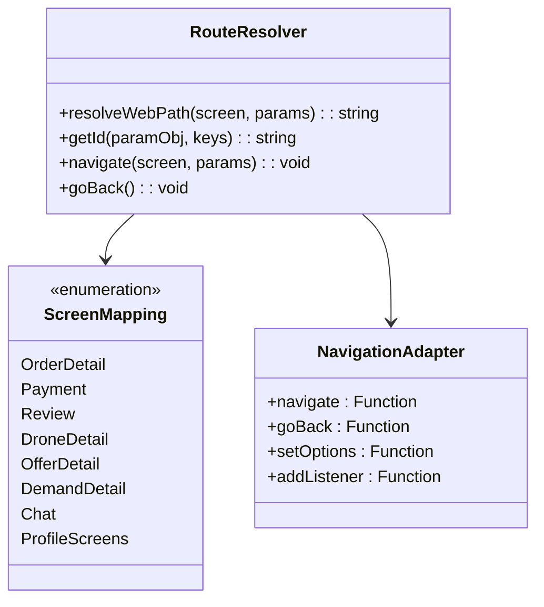

**图表来源**
- [mobile/src/utils/navigation.web.ts:15-134](file://mobile/src/utils/navigation.web.ts#L15-L134)
- [mobile/src/index.web.tsx:61-254](file://mobile/src/index.web.tsx#L61-L254)

#### 页面布局系统

实现了响应式布局和网格系统：

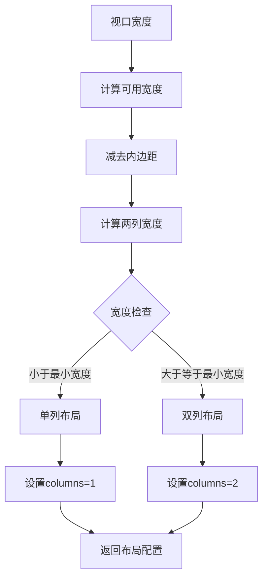

**图表来源**
- [mobile/src/utils/responsiveGrid.ts:14-37](file://mobile/src/utils/responsiveGrid.ts#L14-L37)

**章节来源**
- [mobile/src/utils/navigation.web.ts:1-216](file://mobile/src/utils/navigation.web.ts#L1-L216)
- [mobile/src/utils/responsiveGrid.ts:1-38](file://mobile/src/utils/responsiveGrid.ts#L1-L38)

### 状态管理和认证

#### Redux状态管理集成

实现了完整的状态管理解决方案：

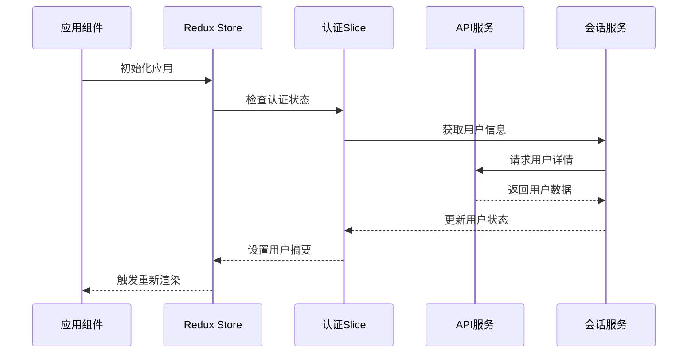

**图表来源**
- [mobile/src/index.web.tsx:641-665](file://mobile/src/index.web.tsx#L641-L665)

#### API配置和环境管理

实现了灵活的API配置系统：

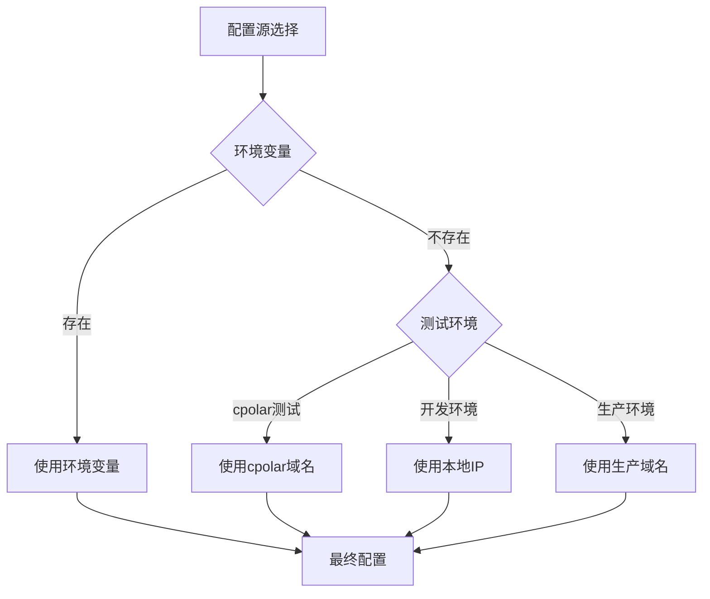

**图表来源**
- [mobile/src/constants/index.ts:21-59](file://mobile/src/constants/index.ts#L21-L59)

**章节来源**
- [mobile/src/index.web.tsx:632-727](file://mobile/src/index.web.tsx#L632-L727)
- [mobile/src/constants/index.ts:1-228](file://mobile/src/constants/index.ts#L1-L228)

### 主题和样式系统

#### 深色和浅色主题实现

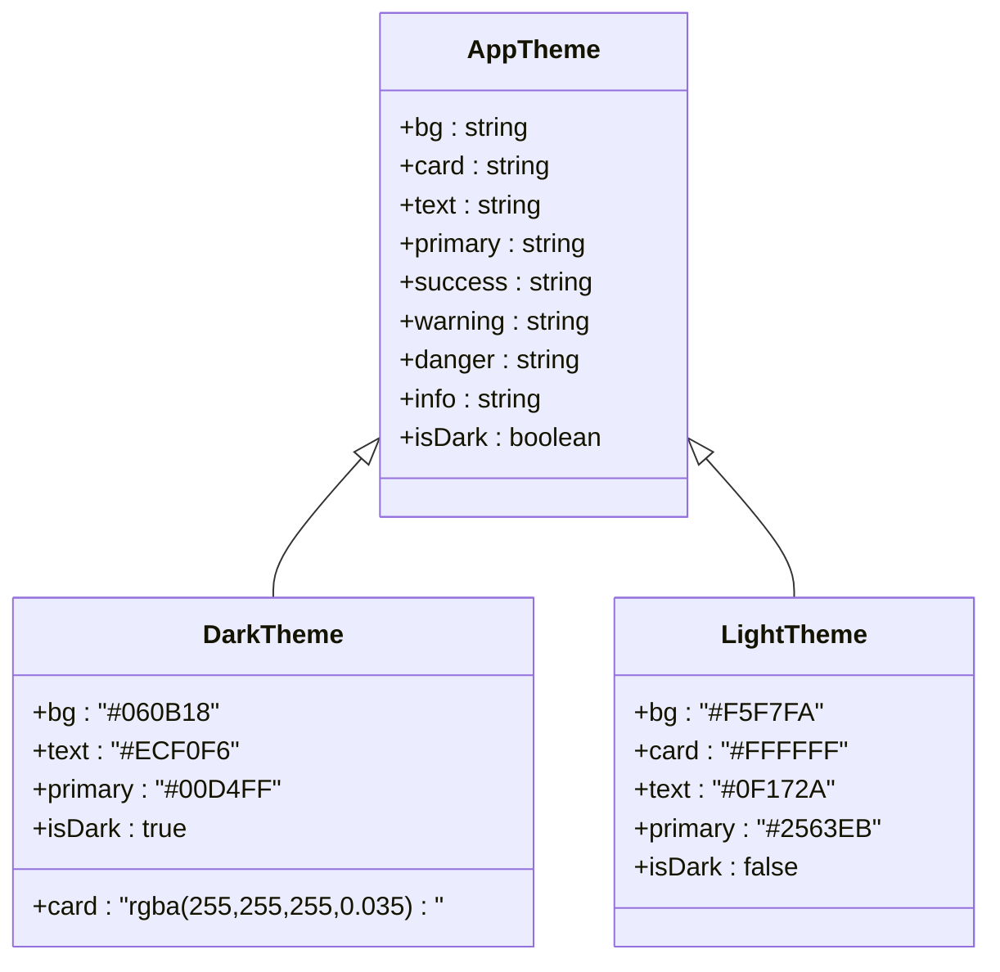

**图表来源**
- [mobile/src/theme/index.ts:1-202](file://mobile/src/theme/index.ts#L1-L202)

**章节来源**
- [mobile/src/theme/index.ts:1-202](file://mobile/src/theme/index.ts#L1-L202)

## 依赖关系分析

### 核心依赖关系

```mermaid
graph TB
subgraph "运行时依赖"
A[react-native-web@0.21.2]
B[react-router-dom@7.13.1]
C[react-redux@9.2.0]
D[@reduxjs/toolkit@2.11.2]
end
subgraph "开发依赖"
E[@vitejs/plugin-react@5.1.4]
F[@types/react@19.2.0]
G[typescript@5.8.3]
H[vite@7.3.1]
end
subgraph "平台特定"
I[react-native@0.84.0]
J[react-native-config@1.6.1]
K[react-native-linear-gradient@2.8.3]
L[react-native-amap3d@3.2.4]
end
A --> B
A --> C
C --> D
E --> A
F --> A
G --> E
H --> E
I --> J
I --> K
I --> L
```

**图表来源**
- [mobile/package.json:15-66](file://mobile/package.json#L15-L66)

### 构建配置分析

#### Vite配置优化

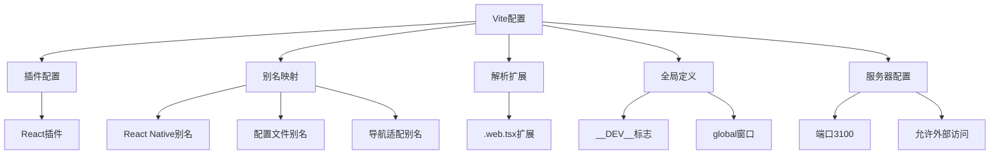

**图表来源**
- [mobile/vite.config.ts:5-37](file://mobile/vite.config.ts#L5-L37)

**章节来源**
- [mobile/package.json:1-66](file://mobile/package.json#L1-L66)
- [mobile/vite.config.ts:1-37](file://mobile/vite.config.ts#L1-L37)

## 性能考虑

### Web渲染优化

1. **懒加载策略**：所有屏幕组件按需导入，减少初始包大小
2. **虚拟化支持**：列表组件支持虚拟滚动，提升大数据集性能
3. **缓存机制**：API响应数据缓存，减少重复请求
4. **资源优化**：图片和字体资源按需加载

### 移动端优化

1. **触摸优化**：按钮和交互元素适合触摸操作
2. **响应式设计**：适配不同屏幕尺寸和方向
3. **性能监控**：集成性能指标收集和分析
4. **内存管理**：组件卸载时清理定时器和事件监听器

## 故障排除指南

### 常见问题诊断

#### 路由导航问题

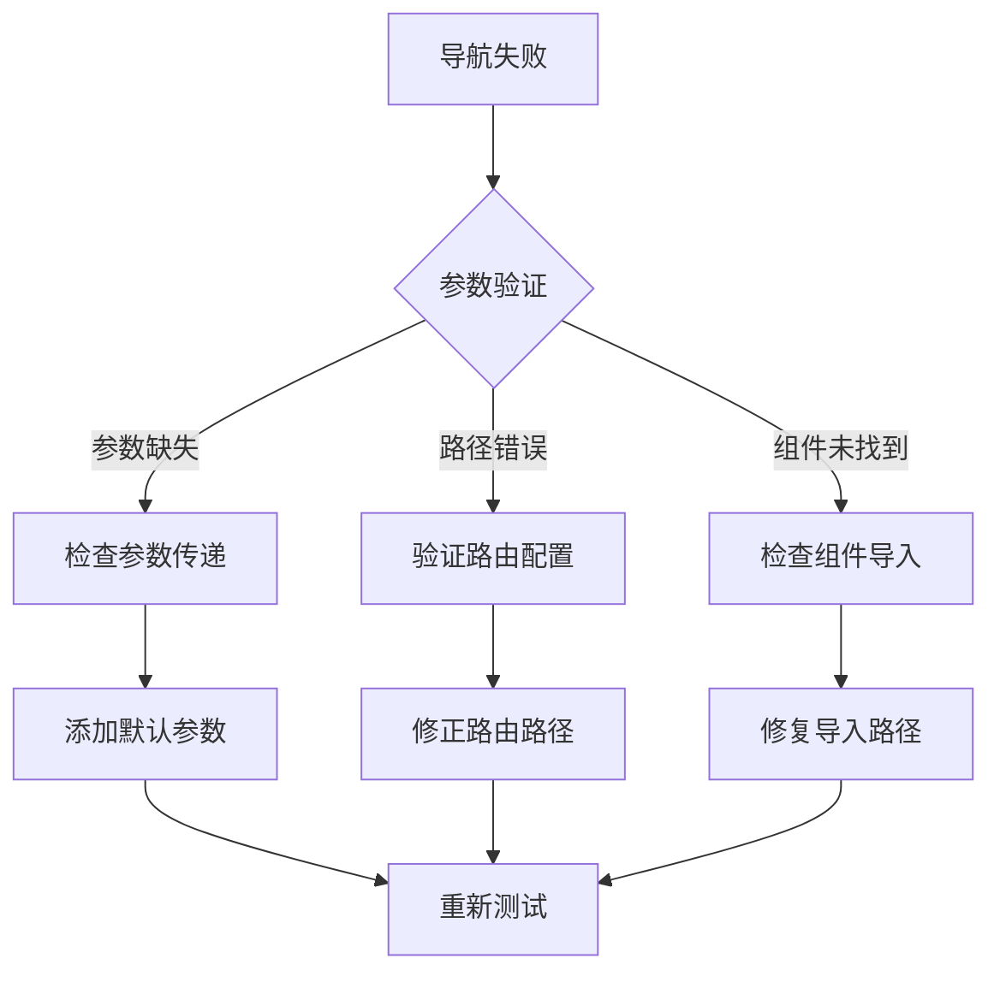

#### API连接问题

1. **检查网络连接**：确保后端服务正常运行
2. **验证API密钥**：确认配置文件中的密钥有效
3. **查看防火墙设置**：确保端口未被阻止
4. **检查CORS配置**：验证跨域请求设置

#### 性能问题排查

1. **内存泄漏检测**：使用浏览器开发者工具检查内存使用
2. **渲染性能分析**：识别慢组件和重渲染
3. **网络请求优化**：合并请求和实现缓存策略
4. **资源加载优化**：压缩图片和代码分割

**章节来源**
- [mobile/src/index.web.tsx:667-700](file://mobile/src/index.web.tsx#L667-L700)
- [mobile/src/services/api.ts:79-147](file://mobile/src/services/api.ts#L79-L147)

## 结论

该移动端Web兼容性实现展现了现代跨平台应用开发的最佳实践。通过精心设计的适配层、灵活的配置系统和完善的错误处理机制，成功实现了iOS、Android和Web三个平台的一致用户体验。

### 主要成就

1. **架构一致性**：统一的React Native架构支持多平台部署
2. **开发效率**：共享代码库减少维护成本
3. **用户体验**：原生级的移动应用体验
4. **可扩展性**：模块化的组件设计便于功能扩展

### 技术亮点

- **智能别名映射**：通过Vite实现无缝的平台切换
- **完善的适配层**：覆盖导航、权限、配置等核心功能
- **响应式设计**：适应不同设备和屏幕尺寸
- **性能优化**：多维度的性能优化策略

该实现为类似项目提供了宝贵的参考模板，展示了如何在保持开发效率的同时实现高质量的跨平台应用。