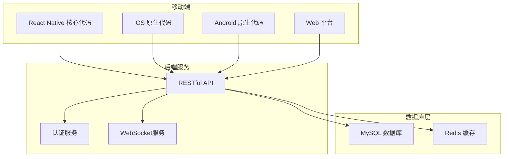
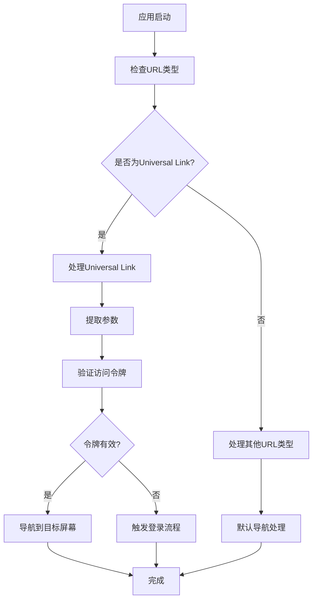
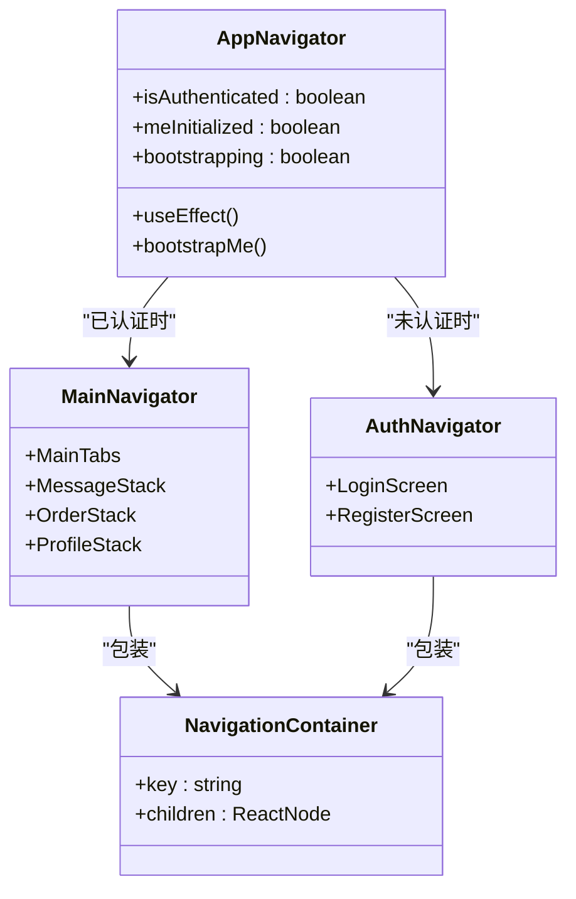
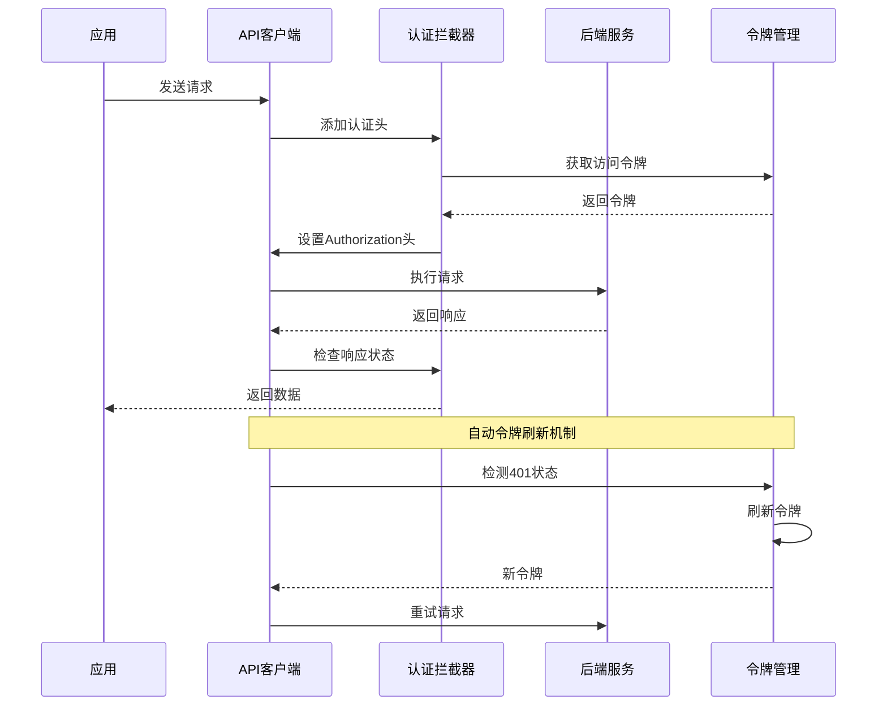
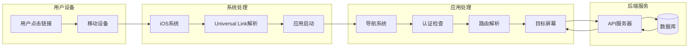
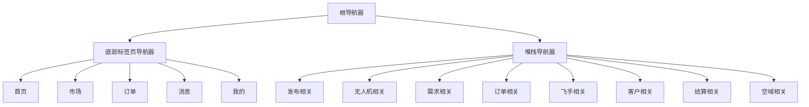
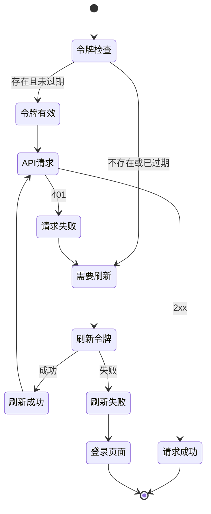
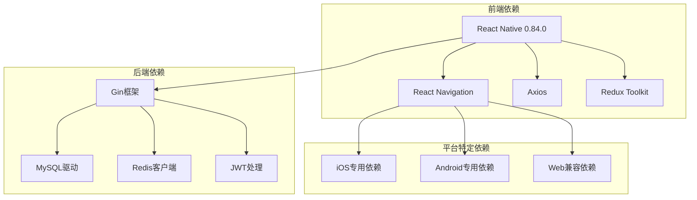

# Universal Link支持

<cite>
**本文档引用的文件**
- [mobile/src/services/api.ts](file://mobile/src/services/api.ts)
- [backend/cmd/server/main.go](file://backend/cmd/server/main.go)
- [mobile/android/app/src/main/AndroidManifest.xml](file://mobile/android/app/src/main/AndroidManifest.xml)
- [mobile/ios/WurenjiMobile/Info.plist](file://mobile/ios/WurenjiMobile/Info.plist)
- [mobile/src/navigation/AppNavigator.tsx](file://mobile/src/navigation/AppNavigator.tsx)
- [mobile/src/navigation/AuthNavigator.tsx](file://mobile/src/navigation/AuthNavigator.tsx)
- [mobile/src/navigation/MainNavigator.tsx](file://mobile/src/navigation/MainNavigator.tsx)
- [mobile/src/utils/navigation.web.ts](file://mobile/src/utils/navigation.web.ts)
- [mobile/src/utils/react-native.web.ts](file://mobile/src/utils/react-native.web.ts)
- [mobile/package.json](file://mobile/package.json)
</cite>

## 目录
1. [简介](#简介)
2. [项目结构](#项目结构)
3. [核心组件](#核心组件)
4. [架构概览](#架构概览)
5. [详细组件分析](#详细组件分析)
6. [依赖关系分析](#依赖关系分析)
7. [性能考虑](#性能考虑)
8. [故障排除指南](#故障排除指南)
9. [结论](#结论)

## 简介

本文档详细分析了无人机租赁平台项目的Universal Link（通用链接）支持功能。Universal Link是苹果iOS系统提供的现代深度链接技术，允许应用通过标准HTTP/HTTPS URL进行深度导航，提供更好的用户体验和安全性。

该系统支持以下主要功能：
- iOS平台的Universal Link集成
- Android平台的Deep Link处理
- Web平台的路由映射
- 跨平台的统一导航体验
- 安全的用户身份验证和会话管理

## 项目结构

项目采用混合移动应用架构，包含原生iOS、Android应用以及React Native共享代码：

**图表来源**
- [backend/cmd/server/main.go:249-266](file://backend/cmd/server/main.go#L249-L266)
- [mobile/src/services/api.ts:1-155](file://mobile/src/services/api.ts#L1-L155)

**章节来源**
- [backend/cmd/server/main.go:1-390](file://backend/cmd/server/main.go#L1-L390)
- [mobile/src/services/api.ts:1-155](file://mobile/src/services/api.ts#L1-L155)

## 核心组件

### 1. Universal Link配置

#### iOS平台配置
iOS平台通过Info.plist文件配置Universal Link支持：

**图表来源**
- [mobile/ios/WurenjiMobile/Info.plist:80-95](file://mobile/ios/WurenjiMobile/Info.plist#L80-L95)
- [mobile/src/navigation/AppNavigator.tsx:13-77](file://mobile/src/navigation/AppNavigator.tsx#L13-L77)

#### Android平台配置
Android平台通过AndroidManifest.xml配置Deep Link支持：

**章节来源**
- [mobile/ios/WurenjiMobile/Info.plist:80-95](file://mobile/ios/WurenjiMobile/Info.plist#L80-L95)
- [mobile/android/app/src/main/AndroidManifest.xml:45-50](file://mobile/android/app/src/main/AndroidManifest.xml#L45-L50)

### 2. 导航系统架构

应用采用React Navigation实现跨平台导航：

**图表来源**
- [mobile/src/navigation/AppNavigator.tsx:13-77](file://mobile/src/navigation/AppNavigator.tsx#L13-L77)
- [mobile/src/navigation/AuthNavigator.tsx:8-15](file://mobile/src/navigation/AuthNavigator.tsx#L8-L15)
- [mobile/src/navigation/MainNavigator.tsx:131-203](file://mobile/src/navigation/MainNavigator.tsx#L131-L203)

**章节来源**
- [mobile/src/navigation/AppNavigator.tsx:1-88](file://mobile/src/navigation/AppNavigator.tsx#L1-L88)
- [mobile/src/navigation/AuthNavigator.tsx:1-16](file://mobile/src/navigation/AuthNavigator.tsx#L1-L16)
- [mobile/src/navigation/MainNavigator.tsx:1-204](file://mobile/src/navigation/MainNavigator.tsx#L1-L204)

### 3. API通信层

应用使用Axios实现统一的API通信，包含认证拦截器和错误处理：

**图表来源**
- [mobile/src/services/api.ts:18-152](file://mobile/src/services/api.ts#L18-L152)

**章节来源**
- [mobile/src/services/api.ts:1-155](file://mobile/src/services/api.ts#L1-L155)

## 架构概览

### Universal Link处理流程

**图表来源**
- [mobile/src/navigation/AppNavigator.tsx:21-65](file://mobile/src/navigation/AppNavigator.tsx#L21-L65)
- [mobile/src/services/api.ts:82-140](file://mobile/src/services/api.ts#L82-L140)

## 详细组件分析

### 1. iOS Universal Link配置

#### URL Scheme配置
iOS应用在Info.plist中配置了微信相关的URL Scheme，用于支持微信登录和回调：

**章节来源**
- [mobile/ios/WurenjiMobile/Info.plist:80-95](file://mobile/ios/WurenjiMobile/Info.plist#L80-L95)

### 2. Android Deep Link配置

#### Intent Filter设置
Android应用在AndroidManifest.xml中配置了Deep Link的Intent Filter：

**章节来源**
- [mobile/android/app/src/main/AndroidManifest.xml:45-50](file://mobile/android/app/src/main/AndroidManifest.xml#L45-L50)

### 3. 导航系统实现

#### 主导航器结构
应用使用多层导航结构实现复杂的页面导航：

**图表来源**
- [mobile/src/navigation/MainNavigator.tsx:111-203](file://mobile/src/navigation/MainNavigator.tsx#L111-L203)

**章节来源**
- [mobile/src/navigation/MainNavigator.tsx:1-204](file://mobile/src/navigation/MainNavigator.tsx#L1-L204)

### 4. Web平台适配

#### 路由映射系统
Web平台实现了完整的路由映射系统，将React Navigation的屏幕名称映射到Web URL：

**章节来源**
- [mobile/src/utils/navigation.web.ts:15-134](file://mobile/src/utils/navigation.web.ts#L15-L134)

### 5. 认证和会话管理

#### 令牌管理系统
应用实现了完整的令牌管理系统，包括自动刷新和错误处理：

**图表来源**
- [mobile/src/services/api.ts:82-140](file://mobile/src/services/api.ts#L82-L140)

**章节来源**
- [mobile/src/services/api.ts:32-152](file://mobile/src/services/api.ts#L32-L152)

## 依赖关系分析

### 1. 核心依赖关系

**图表来源**
- [mobile/package.json:15-38](file://mobile/package.json#L15-L38)
- [backend/cmd/server/main.go:3-50](file://backend/cmd/server/main.go#L3-L50)

**章节来源**
- [mobile/package.json:1-68](file://mobile/package.json#L1-L68)
- [backend/cmd/server/main.go:1-50](file://backend/cmd/server/main.go#L1-L50)

### 2. 第三方服务集成

#### OAuth提供商集成
应用集成了多种OAuth提供商，包括微信和QQ：

**章节来源**
- [backend/cmd/server/main.go:162-180](file://backend/cmd/server/main.go#L162-L180)

## 性能考虑

### 1. 导航性能优化

应用采用了多种性能优化策略：

- **懒加载导航器**：只在需要时加载导航器组件
- **缓存策略**：使用Redux缓存用户数据和导航状态
- **条件渲染**：根据用户认证状态动态渲染不同导航器
- **Web优化**：为Web平台提供轻量级导航实现

### 2. API性能优化

- **请求拦截器**：统一处理认证和错误
- **并发控制**：避免重复的令牌刷新请求
- **超时处理**：设置合理的请求超时时间
- **错误恢复**：自动处理网络异常和服务器错误

## 故障排除指南

### 1. Universal Link常见问题

#### iOS Universal Link不工作
1. **检查关联域名配置**
   - 确保在Apple Developer中正确配置Associated Domains
   - 验证apple-app-site-association文件可访问

2. **检查Info.plist配置**
   - 确认URL Types配置正确
   - 验证Bundle Identifier匹配

3. **调试步骤**
   - 使用Xcode调试Universal Link
   - 检查系统日志中的相关错误信息

#### Android Deep Link问题
1. **Intent Filter配置**
   - 确认AndroidManifest.xml中的Intent Filter正确
   - 验证URL模式匹配规则

2. **Activity配置**
   - 确认MainActivity具有正确的launchMode
   - 验证singleTask配置

### 2. 导航问题诊断

#### 页面跳转失败
1. **检查导航器配置**
   - 确认屏幕名称与导航器定义一致
   - 验证参数传递正确性

2. **调试方法**
   - 使用React DevTools检查导航状态
   - 查看控制台中的错误信息

#### 认证问题
1. **令牌失效**
   - 检查令牌刷新逻辑
   - 验证刷新令牌的有效性

2. **会话管理**
   - 确认Redux状态同步
   - 检查WebSocket连接状态

**章节来源**
- [mobile/src/navigation/AppNavigator.tsx:21-65](file://mobile/src/navigation/AppNavigator.tsx#L21-L65)
- [mobile/src/services/api.ts:82-140](file://mobile/src/services/api.ts#L82-L140)

## 结论

该无人机租赁平台项目实现了完整的Universal Link支持，提供了跨平台的一致用户体验。系统的主要优势包括：

1. **完整的平台支持**：同时支持iOS Universal Link、Android Deep Link和Web路由
2. **安全的认证机制**：实现了自动令牌管理和错误处理
3. **灵活的导航系统**：支持复杂的页面导航和状态管理
4. **良好的扩展性**：模块化设计便于功能扩展和维护

未来可以考虑的改进方向：
- 增强Universal Link的安全性验证
- 优化导航性能和用户体验
- 扩展更多的第三方服务集成
- 加强错误监控和日志记录