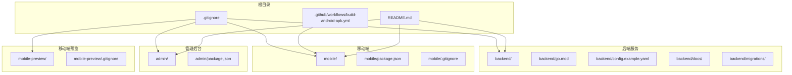
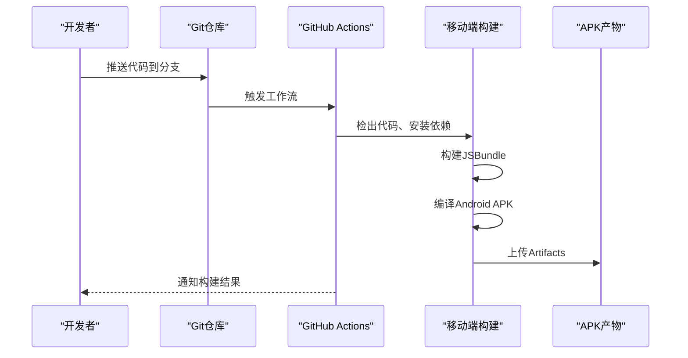
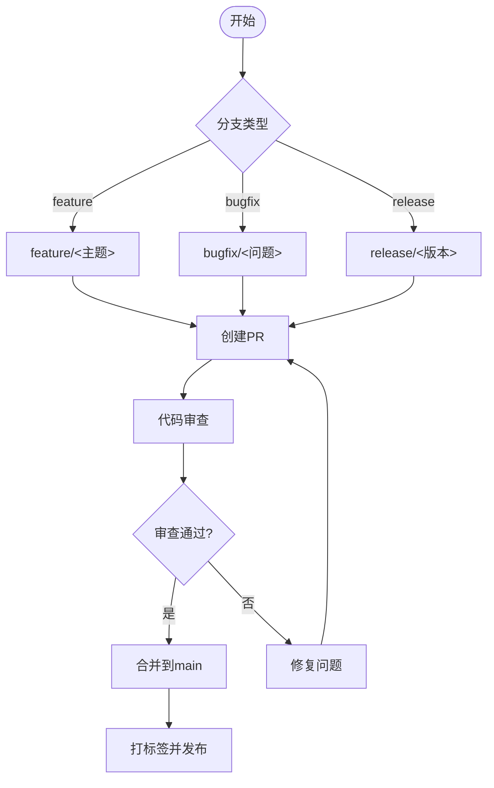
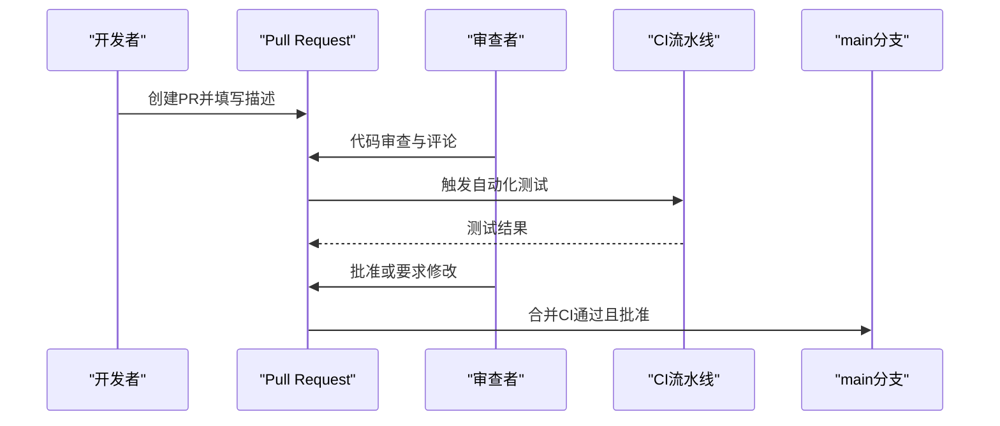
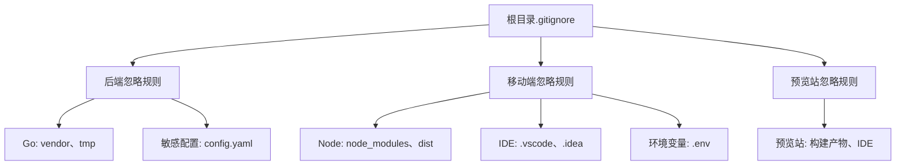
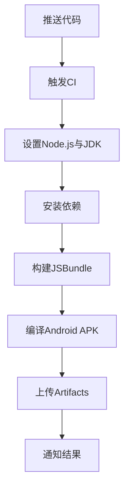
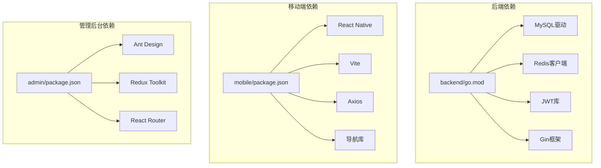

# Git版本控制与工作流程规范

<cite>
**本文引用的文件**
- [.gitignore](file://.gitignore)
- [mobile/.gitignore](file://mobile/.gitignore)
- [mobile-preview/.gitignore](file://mobile-preview/.gitignore)
- [.github/workflows/build-android-apk.yml](file://.github/workflows/build-android-apk.yml)
- [backend/config.example.yaml](file://backend/config.example.yaml)
- [README.md](file://README.md)
- [BUSINESS_API_CONTRACT.md](file://BUSINESS_API_CONTRACT.md)
- [BUSINESS_ROLE_REDESIGN.md](file://BUSINESS_ROLE_REDESIGN.md)
- [REFACTOR_MASTER_TASKLIST.md](file://REFACTOR_MASTER_TASKLIST.md)
- [TEST_CHECKLIST.md](file://TEST_CHECKLIST.md)
- [backend/go.mod](file://backend/go.mod)
- [mobile/package.json](file://mobile/package.json)
- [admin/package.json](file://admin/package.json)
</cite>

## 目录
1. [简介](#简介)
2. [项目结构](#项目结构)
3. [核心组件](#核心组件)
4. [架构概览](#架构概览)
5. [详细组件分析](#详细组件分析)
6. [依赖分析](#依赖分析)
7. [性能考虑](#性能考虑)
8. [故障排除指南](#故障排除指南)
9. [结论](#结论)
10. [附录](#附录)

## 简介
本文件为无人机租赁平台项目的Git版本控制与工作流程规范，旨在建立统一的分支命名、提交信息格式、合并请求（Pull Request）流程、代码审查、冲突解决、版本标签与发布控制、.gitignore配置、大型文件处理、历史记录管理与备份策略。同时结合项目现有的GitHub Actions工作流，提供持续集成、自动化测试触发与部署流水线管理的实践指导。

## 项目结构
该项目采用多模块结构，包含后端Go服务、移动端React Native应用、管理后台（Ant Design）、移动端预览站、Docker编排与数据库迁移脚本。根目录包含全局.gitignore与README，.github/workflows目录包含CI工作流配置。

**图表来源**
- [.gitignore:1-61](file://.gitignore#L1-L61)
- [.github/workflows/build-android-apk.yml:1-74](file://.github/workflows/build-android-apk.yml#L1-L74)
- [README.md:1-29](file://README.md#L1-L29)

**章节来源**
- [.gitignore:1-61](file://.gitignore#L1-L61)
- [README.md:1-29](file://README.md#L1-L29)

## 核心组件
- 分支管理与命名规范：采用feature、bugfix、release分支命名，配合develop/main主干保护策略。
- 提交信息格式：采用约定式提交（Conventional Commits），包含type、scope、subject，必要时附body与footer。
- 合并请求（PR）规范：PR标题遵循提交信息格式；描述包含需求链接、变更摘要、测试要点；至少一名审查者批准后方可合并。
- 代码审查流程：审查者需关注功能正确性、安全性、性能、可维护性与测试覆盖率；审查通过后自动触发CI。
- 冲突解决策略：优先使用rebase保持线性历史；冲突集中在核心模块时，需在PR讨论中明确解决方案与回归测试。
- 版本标签与发布控制：使用语义化版本（SemVer），在合并到main后打标签并创建Release；发布前进行自动化测试与安全扫描。
- .gitignore配置：根目录与各子模块分别配置，屏蔽构建产物、依赖、IDE、系统文件与敏感配置。
- 大型文件处理：禁止将大型文件直接提交到仓库；使用Git LFS或外部存储，记录文件哈希并在README中说明。
- 历史记录管理：避免修改已推送的历史；如需修复，使用git commit --amend或cherry-pick。
- 备份策略：定期备份远程仓库与关键配置；使用GitHub Releases与Docker镜像仓库作为发布备份。

**章节来源**
- [BUSINESS_API_CONTRACT.md:1-1122](file://BUSINESS_API_CONTRACT.md#L1-L1122)
- [BUSINESS_ROLE_REDESIGN.md:1-1598](file://BUSINESS_ROLE_REDESIGN.md#L1-L1598)
- [REFACTOR_MASTER_TASKLIST.md:1-512](file://REFACTOR_MASTER_TASKLIST.md#L1-L512)

## 架构概览
本项目采用多模块CI/CD流水线，后端Go服务通过GitHub Actions构建Android APK，移动端应用通过React Native与Vite构建，管理后台使用Ant Design与Vite，移动端预览站提供Web预览能力。

**图表来源**
- [.github/workflows/build-android-apk.yml:1-74](file://.github/workflows/build-android-apk.yml#L1-L74)

**章节来源**
- [.github/workflows/build-android-apk.yml:1-74](file://.github/workflows/build-android-apk.yml#L1-L74)

## 详细组件分析

### 分支命名规范与主干保护
- feature/*：用于新功能开发，命名示例feature/user-authentication。
- bugfix/*：用于缺陷修复，命名示例bugfix/login-validation。
- release/*：用于发布准备，命名示例release/v1.2.3。
- develop/main：主干分支，严格保护，禁止直接推送，必须通过PR合并。

[本图为概念性流程图，不直接映射具体源文件]

### 提交信息格式标准（Conventional Commits）
- type：feat、fix、docs、style、refactor、perf、test、build、ci、chore、revert
- scope：可选，模块或功能域，如backend、mobile、admin
- subject：简短描述，不超过50字符
- body：详细说明，解释动机与对比
- footer：关闭Issue或Breaking Changes

示例路径参考：
- [提交信息格式示例:37-49](file://BUSINESS_API_CONTRACT.md#L37-L49)
- [统一响应结构:39-49](file://BUSINESS_API_CONTRACT.md#L39-L49)

**章节来源**
- [BUSINESS_API_CONTRACT.md:37-49](file://BUSINESS_API_CONTRACT.md#L37-L49)

### 合并请求（PR）规范
- 标题：遵循Conventional Commits格式，包含type、scope、subject。
- 描述：包含需求链接、变更摘要、影响范围、测试要点与风险说明。
- 审查：至少一名审查者批准；审查者需验证功能、安全、性能与测试。
- 合并：通过审查后自动触发CI；CI通过后方可合并到main。

[本图为概念性流程图，不直接映射具体源文件]

### 代码审查流程
- 安全性：检查敏感信息（密钥、令牌）与第三方依赖漏洞。
- 性能：关注算法复杂度、数据库查询与网络请求。
- 可维护性：代码风格、注释、模块化与可测试性。
- 测试：覆盖率与回归测试，确保关键路径有测试覆盖。

**章节来源**
- [REFACTOR_MASTER_TASKLIST.md:18-26](file://REFACTOR_MASTER_TASKLIST.md#L18-L26)

### 冲突解决策略
- 优先使用git rebase保持线性历史，减少不必要的merge commit。
- 集中式冲突：在PR讨论中明确解决方案，必要时进行代码评审与重构。
- 回归测试：冲突解决后运行相关测试，确保功能不变。

**章节来源**
- [REFACTOR_MASTER_TASKLIST.md:20-26](file://REFACTOR_MASTER_TASKLIST.md#L20-L26)

### 版本标签管理与发布流程
- 标签策略：使用SemVer，遵循语义化版本规则。
- 发布流程：合并到main后打标签，创建Release；发布前运行自动化测试与安全扫描。
- 文档同步：更新CHANGELOG与发布说明，确保与PR描述一致。

**章节来源**
- [BUSINESS_API_CONTRACT.md:20-30](file://BUSINESS_API_CONTRACT.md#L20-L30)

### .gitignore配置规则
- 根目录忽略：二进制文件、Go vendor、Node构建产物、IDE、系统文件、环境变量与敏感配置。
- 子模块忽略：移动端与预览站分别配置，屏蔽构建产物、依赖、IDE、系统文件与环境变量。
- 后端敏感配置：仅保留示例配置，实际配置文件不在仓库中。

**图表来源**
- [.gitignore:1-61](file://.gitignore#L1-L61)
- [mobile/.gitignore:1-83](file://mobile/.gitignore#L1-L83)
- [mobile-preview/.gitignore:1-25](file://mobile-preview/.gitignore#L1-L25)

**章节来源**
- [.gitignore:1-61](file://.gitignore#L1-L61)
- [mobile/.gitignore:1-83](file://mobile/.gitignore#L1-L83)
- [mobile-preview/.gitignore:1-25](file://mobile-preview/.gitignore#L1-L25)

### 大型文件处理与历史记录管理
- 大型文件：禁止直接提交到仓库；使用Git LFS或外部存储，记录文件哈希并在README中说明。
- 历史记录：避免修改已推送的历史；如需修复，使用git commit --amend或cherry-pick。

**章节来源**
- [README.md:1-29](file://README.md#L1-L29)

### 备份策略
- 仓库备份：定期备份远程仓库与关键配置。
- 发布备份：使用GitHub Releases与Docker镜像仓库作为发布备份。
- 数据备份：数据库迁移脚本与备份文件定期归档。

**章节来源**
- [BUSINESS_DATABASE_MIGRATION_PLAN.md](file://BUSINESS_DATABASE_MIGRATION_PLAN.md)

### 持续集成与自动化测试
- CI触发：push到main/master分支或手动触发workflow。
- 环境准备：Node.js 20、JDK 17、Android SDK。
- 构建步骤：安装依赖、创建JSBundle、编译Android APK、上传Artifacts。
- 测试与质量：结合项目测试清单与自动化测试脚本。

**图表来源**
- [.github/workflows/build-android-apk.yml:1-74](file://.github/workflows/build-android-apk.yml#L1-L74)

**章节来源**
- [.github/workflows/build-android-apk.yml:1-74](file://.github/workflows/build-android-apk.yml#L1-L74)

## 依赖分析
项目依赖包括后端Go模块、移动端React Native与Vite、管理后台Ant Design与Vite，以及Docker编排与数据库迁移脚本。

**图表来源**
- [backend/go.mod:1-80](file://backend/go.mod#L1-L80)
- [mobile/package.json:1-64](file://mobile/package.json#L1-L64)
- [admin/package.json:1-33](file://admin/package.json#L1-L33)

**章节来源**
- [backend/go.mod:1-80](file://backend/go.mod#L1-L80)
- [mobile/package.json:1-64](file://mobile/package.json#L1-L64)
- [admin/package.json:1-33](file://admin/package.json#L1-L33)

## 性能考虑
- 代码审查：通过自动化工具与审查者共同保证代码质量，减少后期性能问题。
- 构建优化：使用缓存策略（Node缓存、Gradle缓存）提升CI构建速度。
- 依赖管理：定期更新依赖，避免安全漏洞与性能退化。
- 测试覆盖：确保关键路径有测试覆盖，减少回归导致的性能问题。

[本节为通用指导，不直接分析具体文件]

## 故障排除指南
- CI构建失败：检查Node.js与JDK版本、依赖安装、构建命令与Artifacts上传。
- 本地环境问题：检查端口占用、依赖安装、环境变量与配置文件。
- 代码审查问题：根据审查意见修改代码，补充测试与文档。

**章节来源**
- [.github/workflows/build-android-apk.yml:1-74](file://.github/workflows/build-android-apk.yml#L1-L74)
- [TEST_CHECKLIST.md:431-448](file://TEST_CHECKLIST.md#L431-L448)

## 结论
本规范为项目提供了完整的Git版本控制与工作流程指导，涵盖分支管理、提交规范、PR流程、代码审查、冲突解决、版本标签与发布控制、.gitignore配置、大型文件处理、历史记录管理与备份策略，并结合现有CI工作流提供自动化测试与部署实践。建议团队严格遵守本规范，确保代码质量与发布效率。

[本节为总结性内容，不直接分析具体文件]

## 附录
- 术语表：Conventional Commits、SemVer、PR、CI、Artifacts。
- 参考文档：业务API契约、角色重构、重构任务总表、测试清单。

**章节来源**
- [BUSINESS_API_CONTRACT.md:1-1122](file://BUSINESS_API_CONTRACT.md#L1-L1122)
- [BUSINESS_ROLE_REDESIGN.md:1-1598](file://BUSINESS_ROLE_REDESIGN.md#L1-L1598)
- [REFACTOR_MASTER_TASKLIST.md:1-512](file://REFACTOR_MASTER_TASKLIST.md#L1-L512)
- [TEST_CHECKLIST.md:1-448](file://TEST_CHECKLIST.md#L1-L448)