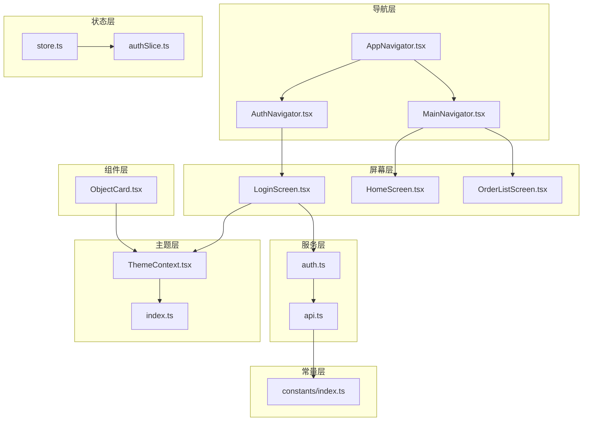
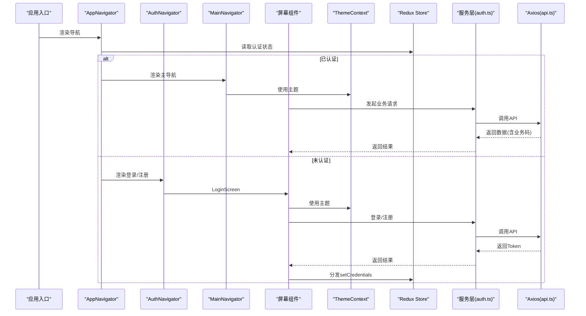
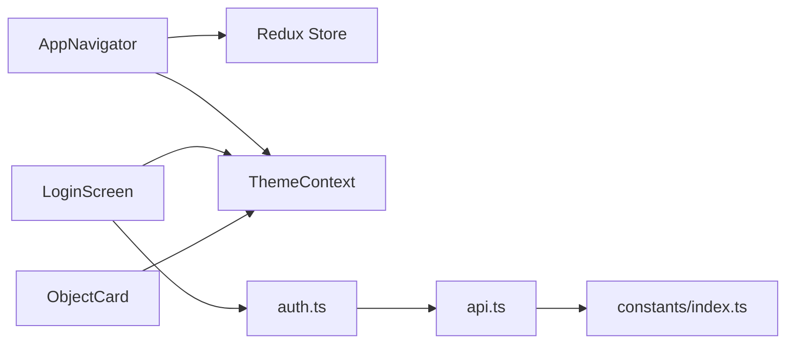

# React Native移动端开发规范

<cite>
**本文档引用的文件**
- [AppNavigator.tsx](file://mobile/src/navigation/AppNavigator.tsx)
- [AuthNavigator.tsx](file://mobile/src/navigation/AuthNavigator.tsx)
- [MainNavigator.tsx](file://mobile/src/navigation/MainNavigator.tsx)
- [ThemeContext.tsx](file://mobile/src/theme/ThemeContext.tsx)
- [index.ts](file://mobile/src/theme/index.ts)
- [store.ts](file://mobile/src/store/store.ts)
- [authSlice.ts](file://mobile/src/store/slices/authSlice.ts)
- [api.ts](file://mobile/src/services/api.ts)
- [auth.ts](file://mobile/src/services/auth.ts)
- [LoginScreen.tsx](file://mobile/src/screens/auth/LoginScreen.tsx)
- [ObjectCard.tsx](file://mobile/src/components/business/ObjectCard.tsx)
- [index.ts](file://mobile/src/constants/index.ts)
- [package.json](file://mobile/package.json)
</cite>

## 目录
1. [简介](#简介)
2. [项目结构](#项目结构)
3. [核心组件](#核心组件)
4. [架构总览](#架构总览)
5. [详细组件分析](#详细组件分析)
6. [依赖关系分析](#依赖关系分析)
7. [性能考虑](#性能考虑)
8. [故障排查指南](#故障排查指南)
9. [结论](#结论)
10. [附录](#附录)

## 简介
本规范面向React Native移动端应用，聚焦于组件命名约定、导航器配置标准、屏幕组件设计模式、服务层调用规范；同时覆盖UI组件开发规范、主题系统使用、响应式布局实现、状态管理最佳实践；并包含导航参数传递、页面跳转规范、手势处理模式、原生模块集成标准。文档提供具体示例路径，解释性能优化策略、内存管理与设备兼容性处理，帮助团队统一开发质量与交付效率。

## 项目结构
移动应用采用分层清晰的组织方式：
- 导航层：AppNavigator根据认证状态切换Auth或Main导航栈
- 屏幕层：按业务域划分screens，如auth、order、drone等
- 组件层：通用业务组件components/business
- 服务层：封装API调用与拦截器services
- 状态层：Redux Toolkit store与slice
- 主题层：ThemeContext提供深浅主题切换
- 常量层：API、WebSocket、业务枚举等配置constants

**图表来源**
- [AppNavigator.tsx:1-88](file://mobile/src/navigation/AppNavigator.tsx#L1-L88)
- [AuthNavigator.tsx:1-16](file://mobile/src/navigation/AuthNavigator.tsx#L1-L16)
- [MainNavigator.tsx:1-195](file://mobile/src/navigation/MainNavigator.tsx#L1-L195)
- [LoginScreen.tsx:1-444](file://mobile/src/screens/auth/LoginScreen.tsx#L1-L444)
- [ObjectCard.tsx:1-53](file://mobile/src/components/business/ObjectCard.tsx#L1-L53)
- [auth.ts:1-45](file://mobile/src/services/auth.ts#L1-L45)
- [api.ts:1-155](file://mobile/src/services/api.ts#L1-L155)
- [store.ts:1-12](file://mobile/src/store/store.ts#L1-L12)
- [authSlice.ts:1-65](file://mobile/src/store/slices/authSlice.ts#L1-L65)
- [ThemeContext.tsx:1-31](file://mobile/src/theme/ThemeContext.tsx#L1-L31)
- [index.ts:1-202](file://mobile/src/theme/index.ts#L1-L202)
- [index.ts:1-228](file://mobile/src/constants/index.ts#L1-L228)

**章节来源**
- [AppNavigator.tsx:1-88](file://mobile/src/navigation/AppNavigator.tsx#L1-L88)
- [AuthNavigator.tsx:1-16](file://mobile/src/navigation/AuthNavigator.tsx#L1-L16)
- [MainNavigator.tsx:1-195](file://mobile/src/navigation/MainNavigator.tsx#L1-L195)
- [LoginScreen.tsx:1-444](file://mobile/src/screens/auth/LoginScreen.tsx#L1-L444)
- [ObjectCard.tsx:1-53](file://mobile/src/components/business/ObjectCard.tsx#L1-L53)
- [auth.ts:1-45](file://mobile/src/services/auth.ts#L1-L45)
- [api.ts:1-155](file://mobile/src/services/api.ts#L1-L155)
- [store.ts:1-12](file://mobile/src/store/store.ts#L1-L12)
- [authSlice.ts:1-65](file://mobile/src/store/slices/authSlice.ts#L1-L65)
- [ThemeContext.tsx:1-31](file://mobile/src/theme/ThemeContext.tsx#L1-L31)
- [index.ts:1-202](file://mobile/src/theme/index.ts#L1-L202)
- [index.ts:1-228](file://mobile/src/constants/index.ts#L1-L228)

## 核心组件
- 导航器
  - AppNavigator：根据认证状态与引导流程动态渲染Auth或Main导航栈，并在认证后建立WebSocket连接
  - AuthNavigator：无头部的登录/注册栈
  - MainNavigator：底部Tab + 多个Native Stack组合，集中管理所有业务页面
- 主题系统
  - ThemeContext：提供深浅主题切换与上下文注入
  - 主题定义：统一的AppTheme接口与深色/浅色两套主题值
- 状态管理
  - Redux Store：集中管理认证态与用户摘要
  - authSlice：定义setCredentials、setMeSummary、logout等动作
- 服务层
  - api.ts：Axios实例与拦截器，含鉴权头注入、业务码校验、Token刷新防并发
  - auth.ts：封装登录、注册、刷新、第三方登录等API调用
- 屏幕组件
  - LoginScreen：登录表单、验证码倒计时、快速登录、主题切换
- 通用组件
  - ObjectCard：卡片容器，支持高亮边框与点击回调

**章节来源**
- [AppNavigator.tsx:13-77](file://mobile/src/navigation/AppNavigator.tsx#L13-L77)
- [AuthNavigator.tsx:8-15](file://mobile/src/navigation/AuthNavigator.tsx#L8-L15)
- [MainNavigator.tsx:111-129](file://mobile/src/navigation/MainNavigator.tsx#L111-L129)
- [ThemeContext.tsx:14-30](file://mobile/src/theme/ThemeContext.tsx#L14-L30)
- [index.ts:1-202](file://mobile/src/theme/index.ts#L1-L202)
- [store.ts:4-11](file://mobile/src/store/store.ts#L4-L11)
- [authSlice.ts:22-64](file://mobile/src/store/slices/authSlice.ts#L22-L64)
- [api.ts:6-155](file://mobile/src/services/api.ts#L6-L155)
- [auth.ts:10-44](file://mobile/src/services/auth.ts#L10-L44)
- [LoginScreen.tsx:45-160](file://mobile/src/screens/auth/LoginScreen.tsx#L45-L160)
- [ObjectCard.tsx:18-52](file://mobile/src/components/business/ObjectCard.tsx#L18-L52)

## 架构总览
应用采用“导航驱动 + 主题上下文 + Redux状态 + Axios服务层”的架构模式，确保认证态贯穿全局、主题一致、数据流清晰、网络层健壮。

**图表来源**
- [AppNavigator.tsx:13-77](file://mobile/src/navigation/AppNavigator.tsx#L13-L77)
- [AuthNavigator.tsx:8-15](file://mobile/src/navigation/AuthNavigator.tsx#L8-L15)
- [MainNavigator.tsx:131-194](file://mobile/src/navigation/MainNavigator.tsx#L131-L194)
- [LoginScreen.tsx:111-134](file://mobile/src/screens/auth/LoginScreen.tsx#L111-L134)
- [auth.ts:21-26](file://mobile/src/services/auth.ts#L21-L26)
- [api.ts:67-147](file://mobile/src/services/api.ts#L67-L147)
- [store.ts:4-11](file://mobile/src/store/store.ts#L4-L11)

## 详细组件分析

### 导航器配置标准
- 导航栈结构
  - AppNavigator：根据isAuthenticated与meInitialized决定显示Loading或Auth/Main
  - AuthNavigator：无头部，仅包含登录与注册
  - MainNavigator：底部Tab + 多个Native Stack，集中声明所有业务页面
- 导航参数传递
  - 使用NavigationContainer的key属性在认证状态变化时重建导航树，避免状态残留
  - 页面间通过navigation.navigate(name, params)传参，建议在目标页面使用类型约束
- 页面跳转规范
  - 登录成功后dispatch setCredentials，触发AppNavigator内部状态更新，自动切换到MainNavigator
  - 所有页面共享ThemeContext，统一使用主题色与样式
- 手势处理模式
  - 使用@react-navigation/native-stack默认手势，保持与系统一致的交互体验
- 原生模块集成标准
  - 通过react-native-config读取环境变量，确保不同环境的API与WebSocket地址可配置
  - 高德地图、推送等第三方能力通过常量配置集中管理

**章节来源**
- [AppNavigator.tsx:13-77](file://mobile/src/navigation/AppNavigator.tsx#L13-L77)
- [AuthNavigator.tsx:8-15](file://mobile/src/navigation/AuthNavigator.tsx#L8-L15)
- [MainNavigator.tsx:131-194](file://mobile/src/navigation/MainNavigator.tsx#L131-L194)
- [index.ts:115-131](file://mobile/src/constants/index.ts#L115-L131)

### 屏幕组件设计模式
- LoginScreen设计要点
  - 表单状态管理：手机号、验证码/密码、登录模式切换、倒计时
  - 请求去重：beginSubmit/isLatestRequest/finalize流程，避免竞态与内存泄漏
  - 错误处理：统一Alert提示与调试信息输出
  - 主题适配：渐变背景、输入框、按钮、链接等均使用ThemeContext提供的颜色
  - 快速登录：开发模式下提供多角色账号一键登录，便于联调
- 设计模式建议
  - 将UI与逻辑分离，屏幕组件专注视图与交互，业务逻辑下沉至服务层
  - 使用受控组件与不可变更新，减少不必要的重渲染
  - 对长列表与图片懒加载场景，结合FlatList与Image组件的最佳实践

**章节来源**
- [LoginScreen.tsx:45-160](file://mobile/src/screens/auth/LoginScreen.tsx#L45-L160)
- [LoginScreen.tsx:354-444](file://mobile/src/screens/auth/LoginScreen.tsx#L354-L444)

### UI组件开发规范
- ObjectCard组件
  - 支持自定义背景色、高亮边框与点击回调
  - 使用ThemeContext统一卡片样式，保证深浅主题一致性
  - 内容通过children传入，保持组件复用性
- 响应式布局
  - 使用react-native-safe-area-context适配刘海屏与安全区域
  - 通过StyleSheet.create生成稳定样式对象，避免运行时计算
  - 在键盘弹起场景使用KeyboardAvoidingView与ScrollView配合

**章节来源**
- [ObjectCard.tsx:18-52](file://mobile/src/components/business/ObjectCard.tsx#L18-L52)
- [LoginScreen.tsx:176-182](file://mobile/src/screens/auth/LoginScreen.tsx#L176-L182)

### 主题系统使用
- 主题接口与两套主题值
  - AppTheme定义背景、文字、输入框、分割线、Tab/Nav、按钮、状态色、导航栏、刷新控件等键
  - darkTheme与lightTheme提供完整的视觉体系
- 主题切换
  - ThemeProvider基于useState维护isDark，toggleTheme切换深浅主题
  - useTheme返回当前主题与切换函数，供任意组件消费
- 使用建议
  - 所有颜色与尺寸从theme中读取，避免硬编码
  - 深浅主题差异通过isDark开关控制，确保对比度符合WCAG AA

**章节来源**
- [index.ts:1-202](file://mobile/src/theme/index.ts#L1-L202)
- [ThemeContext.tsx:14-30](file://mobile/src/theme/ThemeContext.tsx#L14-L30)

### 状态管理最佳实践
- Redux Store
  - configureStore集中注册auth reducer
  - RootState与AppDispatch导出，确保类型安全
- authSlice
  - setCredentials：写入用户、Token与角色摘要，标记已认证
  - setMeSummary：拉取用户摘要后合并到用户信息，标记初始化完成
  - logout：清空认证态，回到未认证状态
- 最佳实践
  - 动作粒度细化，避免一次性大对象替换
  - 使用payload类型约束，提升IDE提示与TS校验
  - 在AppNavigator中监听认证状态变化，控制WebSocket连接生命周期

**章节来源**
- [store.ts:4-11](file://mobile/src/store/store.ts#L4-L11)
- [authSlice.ts:22-64](file://mobile/src/store/slices/authSlice.ts#L22-L64)
- [AppNavigator.tsx:21-30](file://mobile/src/navigation/AppNavigator.tsx#L21-L30)

### 服务层调用规范
- Axios实例与拦截器
  - api与apiV2分别对应v1与v2后端，统一注入Authorization头
  - 业务码校验：v1使用code=0，v2使用code='OK'
  - Token刷新：防并发刷新，pendingRequests队列等待新Token
- auth服务
  - 提供sendCode、register、login、refreshToken、logout、第三方登录等方法
  - 统一返回V2ApiResponse或ApiResponse，便于上层处理
- 调用建议
  - 屏幕组件只负责调用服务层，不直接操作网络细节
  - 对可能失败的请求，捕获错误并友好提示
  - 对高频请求，结合缓存与节流策略

**章节来源**
- [api.ts:6-155](file://mobile/src/services/api.ts#L6-L155)
- [auth.ts:10-44](file://mobile/src/services/auth.ts#L10-L44)

### 导航参数传递与页面跳转
- 参数传递
  - 使用navigation.navigate('ScreenName', {param})
  - 在目标页面通过route.params读取
- 页面跳转
  - 登录成功后dispatch setCredentials，AppNavigator内部根据状态切换
  - 主导航使用Bottom Tabs + Stack组合，Tab内嵌Message子栈
- 手势与动画
  - 默认手势与转场动画，保持系统一致性
- 原生模块集成
  - 通过react-native-config读取API与WebSocket地址
  - 高德地图、推送等能力通过常量集中配置

**章节来源**
- [AppNavigator.tsx:13-77](file://mobile/src/navigation/AppNavigator.tsx#L13-L77)
- [MainNavigator.tsx:131-194](file://mobile/src/navigation/MainNavigator.tsx#L131-L194)
- [index.ts:115-131](file://mobile/src/constants/index.ts#L115-L131)

## 依赖关系分析
- 组件耦合
  - AppNavigator依赖Redux状态与ThemeContext，控制导航树重建
  - LoginScreen依赖ThemeContext与服务层，完成登录流程
  - ObjectCard依赖ThemeContext，作为通用UI组件
- 外部依赖
  - @react-navigation系列：导航与堆栈
  - @reduxjs/toolkit：状态管理
  - axios：HTTP客户端
  - react-native-config：环境变量读取
- 循环依赖
  - 当前结构未见循环导入，导航与服务解耦良好

**图表来源**
- [AppNavigator.tsx:13-77](file://mobile/src/navigation/AppNavigator.tsx#L13-L77)
- [LoginScreen.tsx:45-160](file://mobile/src/screens/auth/LoginScreen.tsx#L45-L160)
- [auth.ts:10-44](file://mobile/src/services/auth.ts#L10-L44)
- [api.ts:6-155](file://mobile/src/services/api.ts#L6-L155)
- [ObjectCard.tsx:18-52](file://mobile/src/components/business/ObjectCard.tsx#L18-L52)
- [index.ts:115-131](file://mobile/src/constants/index.ts#L115-L131)

**章节来源**
- [package.json:14-35](file://mobile/package.json#L14-L35)

## 性能考虑
- 渲染优化
  - 使用React.memo与useMemo/useCallback缓存昂贵计算与子组件
  - 列表使用FlatList，合理设置windowSize与removeClippedSubviews
- 网络优化
  - Axios超时与重试策略，避免长时间阻塞UI
  - Token刷新防并发，减少重复请求
- 内存管理
  - 登录流程中使用mountedRef与requestIdRef避免竞态与泄漏
  - 及时清理定时器与订阅
- 设备兼容
  - 使用safe-area、Platform判断与环境变量，适配iOS/Android/Web
  - 主题系统确保深浅模式下的可读性与对比度

[本节为通用指导，无需特定文件引用]

## 故障排查指南
- 登录失败
  - 检查API地址与环境变量配置，确认constants中的API_BASE_URL
  - 查看服务层返回的业务码与错误信息，定位后端问题
- Token过期
  - 观察api.ts中的刷新逻辑与pendingRequests队列，确保并发安全
  - 若刷新失败，会触发logout，需重新登录
- 导航异常
  - 确认AppNavigator的key变化是否导致导航树重建
  - 检查MainNavigator中screenOptions与tabBar配置
- 主题不生效
  - 确认ThemeContext已包裹根组件，且useTheme正确消费

**章节来源**
- [index.ts:115-131](file://mobile/src/constants/index.ts#L115-L131)
- [api.ts:67-147](file://mobile/src/services/api.ts#L67-L147)
- [AppNavigator.tsx:13-77](file://mobile/src/navigation/AppNavigator.tsx#L13-L77)
- [ThemeContext.tsx:14-30](file://mobile/src/theme/ThemeContext.tsx#L14-L30)

## 结论
本规范总结了导航、主题、状态、服务与UI组件的关键实践，建议团队在新增页面与功能时遵循以下原则：
- 导航：以AppNavigator为中心，按认证态切换，参数传递规范化
- 主题：全部颜色来自ThemeContext，确保一致性与可维护性
- 状态：Redux最小必要状态，动作明确，类型安全
- 服务：统一拦截器与错误处理，避免在网络层分散逻辑
- UI：通用组件抽象与响应式布局，提升复用性与可访问性

[本节为总结性内容，无需特定文件引用]

## 附录

### 组件命名约定
- 屏幕组件：Screen结尾，如LoginScreen、OrderListScreen
- 导航器：Navigator结尾，如AuthNavigator、MainNavigator
- 服务：名词短语，如auth.ts、api.ts
- 类型：首字母大写，如User、RoleSummary、ApiResponse

**章节来源**
- [LoginScreen.tsx:45](file://mobile/src/screens/auth/LoginScreen.tsx#L45)
- [AuthNavigator.tsx:8](file://mobile/src/navigation/AuthNavigator.tsx#L8)
- [MainNavigator.tsx:131](file://mobile/src/navigation/MainNavigator.tsx#L131)
- [auth.ts:10](file://mobile/src/services/auth.ts#L10)
- [api.ts:6](file://mobile/src/services/api.ts#L6)
- [index.ts:1](file://mobile/src/types/index.ts#L1)

### 具体示例路径（正确与错误实现对照）
- 正确：登录流程在LoginScreen中完成，调用authService.login，成功后dispatch setCredentials
  - 示例路径：[LoginScreen.tsx:111-134](file://mobile/src/screens/auth/LoginScreen.tsx#L111-L134)，[auth.ts:21-26](file://mobile/src/services/auth.ts#L21-L26)，[authSlice.ts:26-33](file://mobile/src/store/slices/authSlice.ts#L26-L33)
- 错误：在屏幕组件中直接拼接URL或硬编码API地址
  - 建议：统一通过constants/index.ts读取，避免分散配置

**章节来源**
- [LoginScreen.tsx:111-134](file://mobile/src/screens/auth/LoginScreen.tsx#L111-L134)
- [auth.ts:21-26](file://mobile/src/services/auth.ts#L21-L26)
- [authSlice.ts:26-33](file://mobile/src/store/slices/authSlice.ts#L26-L33)
- [index.ts:115-131](file://mobile/src/constants/index.ts#L115-L131)