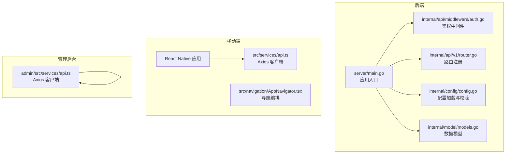
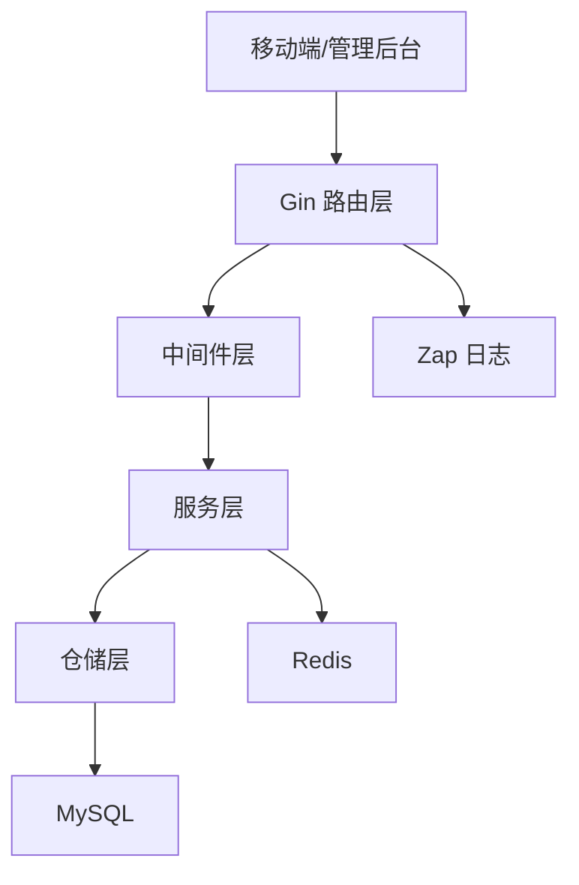
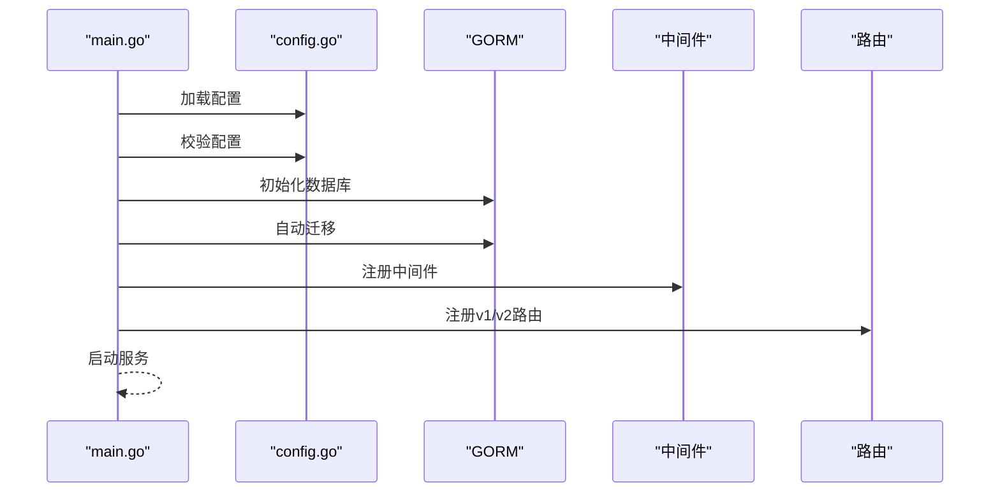
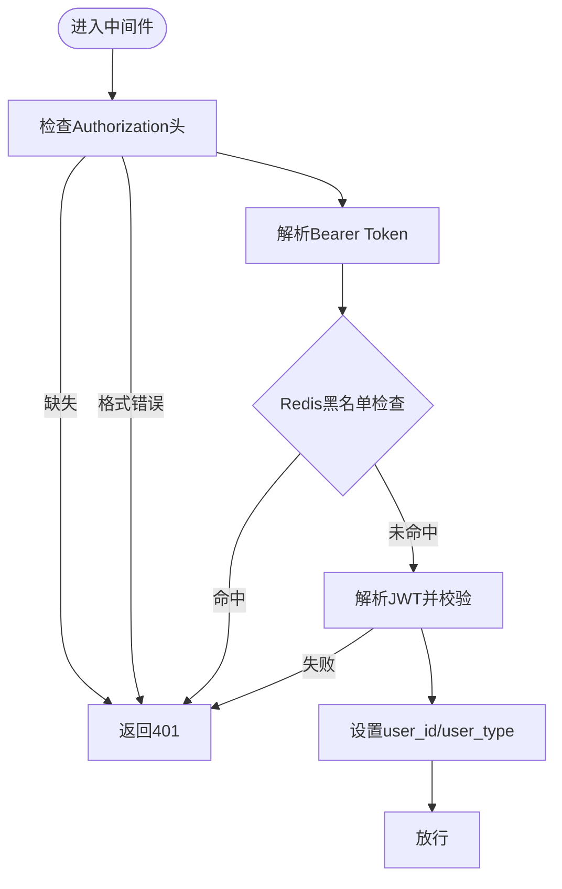
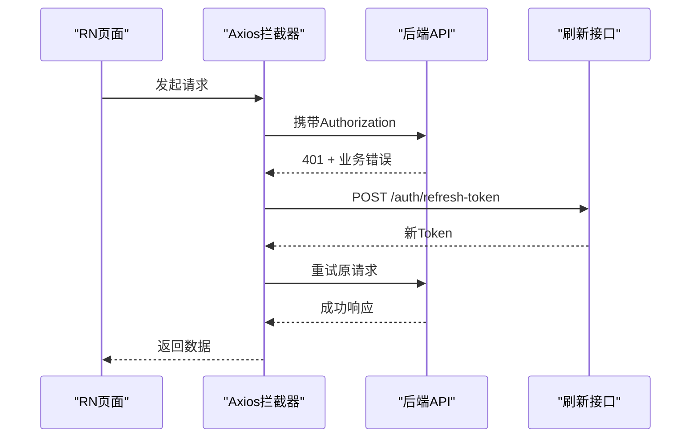
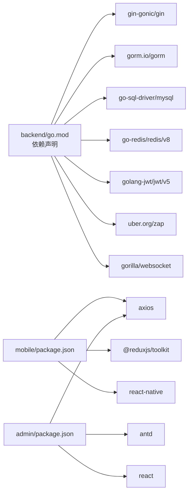

# 代码规范标准

<cite>
**本文引用的文件**   
- [backend/go.mod](file://backend/go.mod)
- [backend/cmd/server/main.go](file://backend/cmd/server/main.go)
- [backend/internal/config/config.go](file://backend/internal/config/config.go)
- [backend/internal/api/middleware/auth.go](file://backend/internal/api/middleware/auth.go)
- [backend/internal/api/v1/router.go](file://backend/internal/api/v1/router.go)
- [backend/internal/model/models.go](file://backend/internal/model/models.go)
- [mobile/package.json](file://mobile/package.json)
- [mobile/.eslintrc.js](file://mobile/.eslintrc.js)
- [mobile/.prettierrc.js](file://mobile/.prettierrc.js)
- [mobile/tsconfig.json](file://mobile/tsconfig.json)
- [mobile/src/services/api.ts](file://mobile/src/services/api.ts)
- [mobile/src/navigation/AppNavigator.tsx](file://mobile/src/navigation/AppNavigator.tsx)
- [admin/package.json](file://admin/package.json)
- [admin/tsconfig.json](file://admin/tsconfig.json)
- [admin/src/services/api.ts](file://admin/src/services/api.ts)
</cite>

## 目录
1. [引言](#引言)
2. [项目结构](#项目结构)
3. [核心组件](#核心组件)
4. [架构总览](#架构总览)
5. [详细组件分析](#详细组件分析)
6. [依赖关系分析](#依赖关系分析)
7. [性能考虑](#性能考虑)
8. [故障排查指南](#故障排查指南)
9. [结论](#结论)
10. [附录](#附录)

## 引言
本规范旨在为无人机租赁平台提供统一、可执行的代码规范标准，覆盖后端 Go、前端 TypeScript/JavaScript、移动端 React Native、样式与 Git 提交规范。内容基于仓库现有实现提炼，强调可读性、一致性、安全性与可维护性，并给出具体示例路径以便对照。

## 项目结构
项目采用多模块分层组织：
- 后端：Gin + GORM 的 Go 微服务，按领域拆分 API 层、中间件、服务层、仓储层、模型层与配置层
- 移动端：React Native + Redux Toolkit + Axios，按业务域划分 screens、services、store、navigation、components
- 管理后台：Vite + React + Ant Design，Axios + 环境变量驱动
- 工具链：ESLint、Prettier、TypeScript 编译配置

图表来源
- [backend/cmd/server/main.go:52-266](file://backend/cmd/server/main.go#L52-L266)
- [backend/internal/config/config.go:415-435](file://backend/internal/config/config.go#L415-L435)
- [backend/internal/api/middleware/auth.go:22-61](file://backend/internal/api/middleware/auth.go#L22-L61)
- [backend/internal/api/v1/router.go:58-634](file://backend/internal/api/v1/router.go#L58-L634)
- [backend/internal/model/models.go:9-26](file://backend/internal/model/models.go#L9-L26)
- [mobile/src/services/api.ts:6-155](file://mobile/src/services/api.ts#L6-L155)
- [mobile/src/navigation/AppNavigator.tsx:13-77](file://mobile/src/navigation/AppNavigator.tsx#L13-L77)
- [admin/src/services/api.ts:15-139](file://admin/src/services/api.ts#L15-L139)

章节来源
- [backend/cmd/server/main.go:52-266](file://backend/cmd/server/main.go#L52-L266)
- [backend/internal/config/config.go:415-435](file://backend/internal/config/config.go#L415-L435)
- [backend/internal/api/v1/router.go:58-634](file://backend/internal/api/v1/router.go#L58-L634)

## 核心组件
- 应用入口与初始化：加载配置、校验、数据库连接、自动迁移、中间件注册、路由注册、启动服务
- 配置系统：集中式 YAML 配置，环境变量覆盖，严格校验与生产校验
- 中间件：统一鉴权、CORS、日志、分页、冻结写入保护
- 路由体系：v1/v2 双版本 API，按领域分组，公开/受保护/管理员三类路由
- 数据模型：统一的领域模型与 JSON 字段，支持复杂业务实体
- 移动端 API 客户端：Axios 封装、Token 自动注入、响应拦截与刷新、并发刷新去重
- 管理后台 API 客户端：Axios 封装、本地存储 Token、响应拦截与刷新、接口聚合

章节来源
- [backend/cmd/server/main.go:52-266](file://backend/cmd/server/main.go#L52-L266)
- [backend/internal/config/config.go:437-489](file://backend/internal/config/config.go#L437-L489)
- [backend/internal/api/middleware/auth.go:22-106](file://backend/internal/api/middleware/auth.go#L22-L106)
- [backend/internal/api/v1/router.go:58-634](file://backend/internal/api/v1/router.go#L58-L634)
- [backend/internal/model/models.go:9-26](file://backend/internal/model/models.go#L9-L26)
- [mobile/src/services/api.ts:6-155](file://mobile/src/services/api.ts#L6-L155)
- [admin/src/services/api.ts:15-139](file://admin/src/services/api.ts#L15-L139)

## 架构总览
后端采用“控制器-服务-仓储-模型”分层；移动端与管理后台通过 Axios 与后端交互；配置中心统一管理运行参数。

图表来源
- [backend/cmd/server/main.go:224-247](file://backend/cmd/server/main.go#L224-L247)
- [backend/internal/api/v1/router.go:58-634](file://backend/internal/api/v1/router.go#L58-L634)
- [backend/internal/config/config.go:415-435](file://backend/internal/config/config.go#L415-L435)

## 详细组件分析

### 后端：应用入口与初始化
- 配置加载与校验：支持环境变量覆盖，打印配置状态，确保上传目录存在
- 数据库初始化：GORM 连接、连接池参数、字符集设置、自动迁移
- 服务初始化：Redis、WebSocket Hub、各业务服务与处理器装配
- 中间件注册：CORS、日志、恢复、鉴权
- 路由注册：v1/v2 路由分组与权限控制

图表来源
- [backend/cmd/server/main.go:52-266](file://backend/cmd/server/main.go#L52-L266)
- [backend/internal/config/config.go:415-435](file://backend/internal/config/config.go#L415-L435)

章节来源
- [backend/cmd/server/main.go:52-266](file://backend/cmd/server/main.go#L52-L266)
- [backend/internal/config/config.go:415-435](file://backend/internal/config/config.go#L415-L435)

### 后端：鉴权中间件
- Authorization 头解析、Bearer 格式校验
- Token 黑名单检查（Redis）
- JWT Claims 解析与用户类型校验
- 401/403 统一响应（区分 v1/v2）

图表来源
- [backend/internal/api/middleware/auth.go:22-106](file://backend/internal/api/middleware/auth.go#L22-L106)

章节来源
- [backend/internal/api/middleware/auth.go:22-106](file://backend/internal/api/middleware/auth.go#L22-L106)

### 后端：路由与权限
- 分组策略：公开、受保护、管理员三类
- v1/v2 双版本 API，响应体结构差异
- 冻结写入中间件保护历史接口
- WebSocket 与静态资源

章节来源
- [backend/internal/api/v1/router.go:58-634](file://backend/internal/api/v1/router.go#L58-L634)

### 后端：配置系统
- 集中式配置结构：Server、Database、Redis、JWT、Upload、SMS、Payment、Amap、WebSocket、Log、CORS、Push、OAuth
- 环境变量覆盖与映射
- 严格校验：端口范围、模式枚举、密钥长度与占位符检测、支付启用检测、生产模式限制
- 生产校验：禁止 mock 短信、至少启用一种支付方式

章节来源
- [backend/internal/config/config.go:16-31](file://backend/internal/config/config.go#L16-L31)
- [backend/internal/config/config.go:437-489](file://backend/internal/config/config.go#L437-L489)

### 后端：数据模型
- 统一的领域模型，含 JSON 字段承载复杂业务属性
- 关系型表设计支持多角色、供需匹配、订单、支付、飞行监控、空域合规、风控与信用、保险与理赔、统计分析等

章节来源
- [backend/internal/model/models.go:9-26](file://backend/internal/model/models.go#L9-L26)

### 移动端：API 客户端与拦截器
- Axios 实例：v1/v2 基础地址分离
- 请求拦截：自动注入 Authorization
- 响应拦截：统一业务码校验、401 自动刷新、并发刷新去重、错误提取
- Token 刷新：并发状态标记、等待队列、失败回退登出

图表来源
- [mobile/src/services/api.ts:66-147](file://mobile/src/services/api.ts#L66-L147)

章节来源
- [mobile/src/services/api.ts:6-155](file://mobile/src/services/api.ts#L6-L155)

### 移动端：导航编排
- 根据认证状态切换 Auth/Main 导航器
- 首次认证后拉取用户资料并初始化
- WebSocket 连接随认证状态变化

章节来源
- [mobile/src/navigation/AppNavigator.tsx:13-77](file://mobile/src/navigation/AppNavigator.tsx#L13-L77)

### 管理后台：API 客户端
- Axios 实例：基于环境变量动态 baseURL
- 请求拦截：本地存储 Token 注入
- 响应拦截：统一业务码校验、401 并发刷新、失败登出
- 接口聚合：认证、仪表盘、用户/无人机/飞手/客户/订单/支付/统计/分析等

章节来源
- [admin/src/services/api.ts:15-139](file://admin/src/services/api.ts#L15-L139)

## 依赖关系分析
- 后端依赖：Gin、GORM、MySQL、Redis、JWT、Zap、WebSocket、短信/支付/推送等外部服务
- 移动端依赖：Axios、Redux Toolkit、导航库、地图 SDK、RN 生态
- 管理后台依赖：Ant Design、Axios、Vite、TypeScript

图表来源
- [backend/go.mod:5-21](file://backend/go.mod#L5-L21)
- [mobile/package.json:14-35](file://mobile/package.json#L14-L35)
- [admin/package.json:14-24](file://admin/package.json#L14-L24)

章节来源
- [backend/go.mod:5-21](file://backend/go.mod#L5-L21)
- [mobile/package.json:14-35](file://mobile/package.json#L14-L35)
- [admin/package.json:14-24](file://admin/package.json#L14-L24)

## 性能考虑
- 数据库连接池：合理设置最大空闲/打开连接数，避免高并发下的连接争用
- 日志级别：生产使用生产日志，减少开销
- 响应拦截与并发刷新：避免重复刷新请求，降低后端压力
- 路由冻结写入：对历史接口启用冻结中间件，减少误操作风险
- 静态资源与上传目录：统一管理，避免磁盘 IO 瓶颈

## 故障排查指南
- 配置校验失败：检查端口、模式、密钥长度与占位符、支付启用状态
- 数据库连接失败：确认 DSN 参数、字符集、连接池配置
- 鉴权失败：确认 Authorization 头格式、Token 黑名单、JWT 有效与签名密钥
- 401 自动刷新失败：检查刷新接口可用性、并发刷新状态、本地存储 Token
- 路由访问受限：确认中间件顺序与权限组配置

章节来源
- [backend/internal/config/config.go:437-489](file://backend/internal/config/config.go#L437-L489)
- [backend/internal/api/middleware/auth.go:22-106](file://backend/internal/api/middleware/auth.go#L22-L106)
- [mobile/src/services/api.ts:66-147](file://mobile/src/services/api.ts#L66-L147)

## 结论
本规范以现有实现为基础，明确了 Go 后端、TypeScript/JavaScript 前端、React Native 移动端、管理后台与 Git 提交的编码与流程标准。建议在团队内推广并持续演进，结合静态分析与自动化检查，提升整体质量与交付效率。

## 附录

### 代码风格与命名规范（示例路径）
- Go 变量/函数命名：遵循现有驼峰与大写开头习惯（如 Config、Handlers、AuthMiddleware）
- 路由分组与路径：参考 v1 路由分组与领域命名（如 /user、/drone、/order）
- 响应拦截器：参考移动端与管理后台的统一业务码校验与错误提取
- 类型与接口：参考移动端 API 客户端的 AxiosInstance 与拦截器类型

章节来源
- [backend/internal/api/v1/router.go:58-634](file://backend/internal/api/v1/router.go#L58-L634)
- [mobile/src/services/api.ts:66-147](file://mobile/src/services/api.ts#L66-L147)
- [admin/src/services/api.ts:66-139](file://admin/src/services/api.ts#L66-L139)

### 代码格式化与静态分析
- ESLint：移动端继承 @react-native 配置
- Prettier：单引号、尾逗号、箭头括号简化
- TypeScript：严格模式、路径别名、模块解析策略

章节来源
- [mobile/.eslintrc.js:1-5](file://mobile/.eslintrc.js#L1-L5)
- [mobile/.prettierrc.js:1-6](file://mobile/.prettierrc.js#L1-L6)
- [mobile/tsconfig.json:1-15](file://mobile/tsconfig.json#L1-L15)
- [admin/tsconfig.json:1-25](file://admin/tsconfig.json#L1-L25)

### Git 提交规范（建议）
- 类型：feat、fix、docs、style、refactor、perf、test、build、ci、chore、revert
- 格式：type(scope): subject
- 示例：feat(api): 添加用户认证接口

[本节为通用建议，不直接分析具体文件]