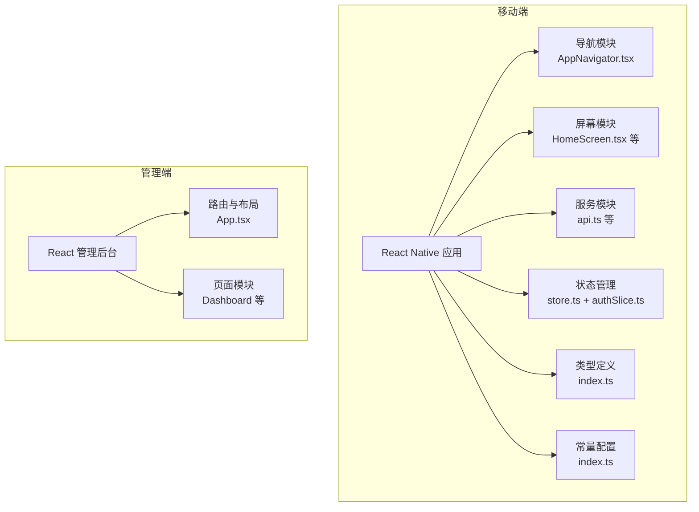
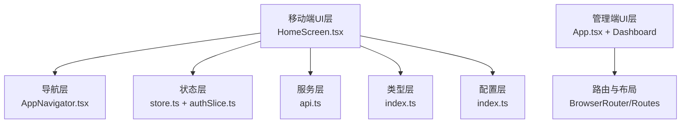
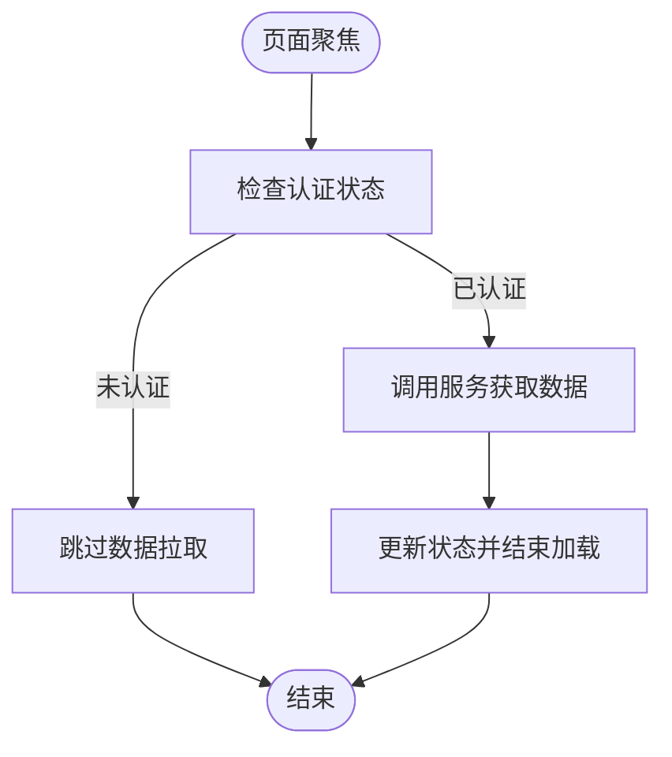
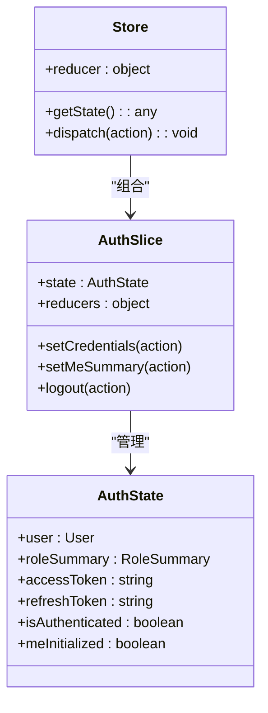
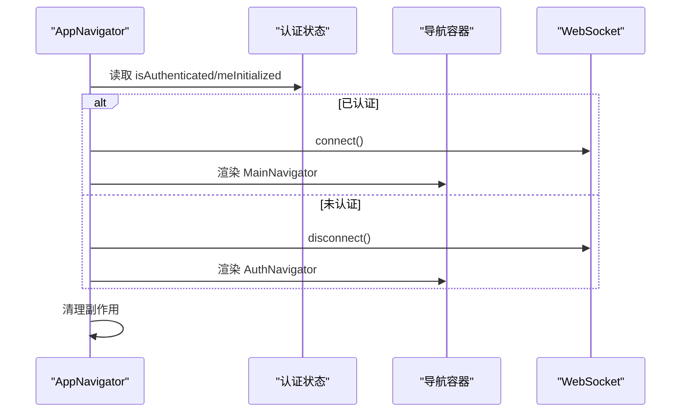
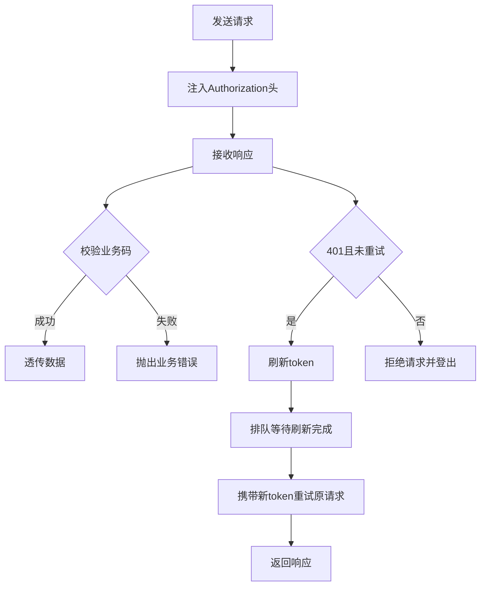
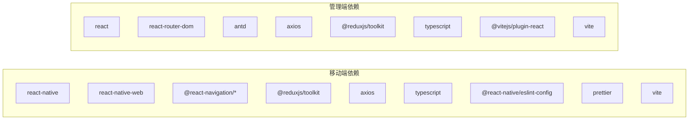

# 前端JavaScript/TypeScript编码规范

<cite>
**本文档引用的文件**
- [package.json](file://mobile/package.json)
- [package.json](file://admin/package.json)
- [.eslintrc.js](file://mobile/.eslintrc.js)
- [.prettierrc.js](file://mobile/.prettierrc.js)
- [tsconfig.json](file://mobile/tsconfig.json)
- [tsconfig.json](file://admin/tsconfig.json)
- [vite.config.ts](file://mobile/vite.config.ts)
- [vite.config.ts](file://admin/vite.config.ts)
- [store.ts](file://mobile/src/store/store.ts)
- [authSlice.ts](file://mobile/src/store/slices/authSlice.ts)
- [AppNavigator.tsx](file://mobile/src/navigation/AppNavigator.tsx)
- [App.tsx](file://admin/src/App.tsx)
- [api.ts](file://mobile/src/services/api.ts)
- [HomeScreen.tsx](file://mobile/src/screens/home/HomeScreen.tsx)
- [ObjectCard.tsx](file://mobile/src/components/business/ObjectCard.tsx)
- [index.ts](file://mobile/src/types/index.ts)
- [index.ts](file://mobile/src/constants/index.ts)
- [index.tsx](file://admin/src/pages/Dashboard/index.tsx)
</cite>

## 目录
1. [引言](#引言)
2. [项目结构](#项目结构)
3. [核心组件](#核心组件)
4. [架构总览](#架构总览)
5. [详细组件分析](#详细组件分析)
6. [依赖关系分析](#依赖关系分析)
7. [性能考虑](#性能考虑)
8. [故障排查指南](#故障排查指南)
9. [结论](#结论)
10. [附录](#附录)

## 引言
本规范面向无人机租赁平台的前端团队，覆盖移动端（React Native）与管理端（React + Vite）的 JavaScript/TypeScript 编码实践。内容包括变量命名、函数定义、接口类型声明、组件结构设计、React Hooks 使用最佳实践、状态管理（Redux Toolkit）、路由配置标准、ESLint 规则、Prettier 格式化、TypeScript 类型约束、模块导入导出规范，并结合项目现有实现给出可落地的示例与流程图。

## 项目结构
项目采用多包结构：
- 移动端（React Native + Vite Web）：src 下包含导航、屏幕、服务、状态、主题、类型、工具等模块
- 管理端（React + Ant Design + Vite）：src 下包含页面、服务、路由等模块
- 通用配置：ESLint、Prettier、TypeScript、Vite

图表来源
- [AppNavigator.tsx:13-77](file://mobile/src/navigation/AppNavigator.tsx#L13-L77)
- [HomeScreen.tsx:264-381](file://mobile/src/screens/home/HomeScreen.tsx#L264-L381)
- [api.ts:1-155](file://mobile/src/services/api.ts#L1-L155)
- [store.ts:1-12](file://mobile/src/store/store.ts#L1-L12)
- [authSlice.ts:1-65](file://mobile/src/store/slices/authSlice.ts#L1-L65)
- [App.tsx:109-130](file://admin/src/App.tsx#L109-L130)
- [index.tsx:15-211](file://admin/src/pages/Dashboard/index.tsx#L15-L211)

章节来源
- [package.json:1-64](file://mobile/package.json#L1-L64)
- [package.json:1-33](file://admin/package.json#L1-L33)
- [vite.config.ts:1-37](file://mobile/vite.config.ts#L1-L37)
- [vite.config.ts:1-64](file://admin/vite.config.ts#L1-L64)

## 核心组件
- 组件结构设计
  - 屏幕组件采用函数式组件 + Hooks 模式，按职责拆分内部子组件（如 MetricTile、ActionPill、QuickActionCard），提升可读性与复用性
  - 使用 useMemo/useCallback 优化渲染与回调稳定性，避免不必要的重渲染
  - 使用 useFocusEffect 管理页面聚焦时的数据拉取，确保在路由切换时正确清理副作用
- 状态管理
  - Redux Toolkit 管理认证态与用户摘要，提供 setCredentials、setMeSummary、logout 等标准化 reducer
  - 通过 RootState 提供类型安全的 useSelector 使用
- 路由配置
  - 移动端：基于 NavigationContainer 的条件渲染，根据认证状态切换 AuthNavigator/MainNavigator
  - 管理端：BrowserRouter + Routes + Menu 导航，支持侧边栏折叠与菜单跳转
- 服务层
  - Axios 封装，统一注入 Authorization 头，拦截器处理业务错误码与 Token 刷新
  - 支持 v1/v2 两套 API，通过版本化客户端与成功码判断适配不同协议

章节来源
- [HomeScreen.tsx:127-221](file://mobile/src/screens/home/HomeScreen.tsx#L127-L221)
- [HomeScreen.tsx:347-381](file://mobile/src/screens/home/HomeScreen.tsx#L347-L381)
- [AppNavigator.tsx:13-77](file://mobile/src/navigation/AppNavigator.tsx#L13-L77)
- [App.tsx:40-107](file://admin/src/App.tsx#L40-L107)
- [store.ts:1-12](file://mobile/src/store/store.ts#L1-L12)
- [authSlice.ts:22-61](file://mobile/src/store/slices/authSlice.ts#L22-L61)
- [api.ts:6-155](file://mobile/src/services/api.ts#L6-L155)

## 架构总览
移动端与管理端分别构建，共享类型与常量配置；移动端通过 Vite Web 适配 react-native-web，实现跨端一致性。

图表来源
- [HomeScreen.tsx:264-381](file://mobile/src/screens/home/HomeScreen.tsx#L264-L381)
- [AppNavigator.tsx:13-77](file://mobile/src/navigation/AppNavigator.tsx#L13-L77)
- [store.ts:1-12](file://mobile/src/store/store.ts#L1-L12)
- [authSlice.ts:1-65](file://mobile/src/store/slices/authSlice.ts#L1-L65)
- [api.ts:1-155](file://mobile/src/services/api.ts#L1-L155)
- [index.ts:1-909](file://mobile/src/types/index.ts#L1-L909)
- [index.ts:1-228](file://mobile/src/constants/index.ts#L1-L228)
- [App.tsx:109-130](file://admin/src/App.tsx#L109-L130)
- [index.tsx:15-211](file://admin/src/pages/Dashboard/index.tsx#L15-L211)

## 详细组件分析

### 组件结构设计与Hooks使用
- 子组件拆分：将复杂界面拆分为 MetricTile、ActionPill、QuickActionCard 等纯展示或轻交互组件，便于测试与复用
- 渲染优化：使用 useMemo 计算派生数据（如 heroConfig、quickActions、todoItems），useCallback 包装回调以稳定引用
- 生命周期：useFocusEffect 替代 useEffect 在页面聚焦时触发数据拉取，避免栈外页面触发无效请求
- 副作用清理：在 AppNavigator 中对 WebSocket 连接进行条件建立与清理，防止内存泄漏

图表来源
- [HomeScreen.tsx:368-376](file://mobile/src/screens/home/HomeScreen.tsx#L368-L376)
- [AppNavigator.tsx:21-30](file://mobile/src/navigation/AppNavigator.tsx#L21-L30)

章节来源
- [HomeScreen.tsx:127-221](file://mobile/src/screens/home/HomeScreen.tsx#L127-L221)
- [HomeScreen.tsx:347-381](file://mobile/src/screens/home/HomeScreen.tsx#L347-L381)
- [AppNavigator.tsx:13-77](file://mobile/src/navigation/AppNavigator.tsx#L13-L77)

### 状态管理模式（Redux Toolkit）
- Store 结构：根 reducer 下挂载 auth，导出 RootState 与 AppDispatch 保证类型安全
- Slice 设计：集中管理认证凭据、用户摘要、初始化标记与登出逻辑，提供 setCredentials、setMeSummary、logout 等动作
- 类型约束：通过 TypeScript 接口定义 State 结构，确保 reducer 内部赋值符合预期

图表来源
- [store.ts:1-12](file://mobile/src/store/store.ts#L1-L12)
- [authSlice.ts:1-65](file://mobile/src/store/slices/authSlice.ts#L1-L65)
- [index.ts:1-31](file://mobile/src/types/index.ts#L1-L31)

章节来源
- [store.ts:1-12](file://mobile/src/store/store.ts#L1-L12)
- [authSlice.ts:1-65](file://mobile/src/store/slices/authSlice.ts#L1-L65)
- [index.ts:1-31](file://mobile/src/types/index.ts#L1-L31)

### 路由配置标准
- 移动端：AppNavigator 条件渲染 AuthNavigator 或 MainNavigator，根据认证状态与初始化状态控制加载态
- 管理端：BrowserRouter 包裹 Routes，侧边栏 Menu 与路由路径一一对应，支持菜单点击跳转与兜底路由

图表来源
- [AppNavigator.tsx:13-77](file://mobile/src/navigation/AppNavigator.tsx#L13-L77)

章节来源
- [AppNavigator.tsx:13-77](file://mobile/src/navigation/AppNavigator.tsx#L13-L77)
- [App.tsx:40-107](file://admin/src/App.tsx#L40-L107)

### 服务层与HTTP拦截器
- 请求头注入：统一为每个请求添加 Authorization: Bearer token
- 业务拦截：根据 v1/v2 成功码判断业务成功，失败时抛出错误
- Token 刷新：并发刷新去重，pendingRequests 队列确保重试请求拿到新 token 后重放
- 错误处理：提取后端 message/error 字段作为前端提示，兜底网络错误

图表来源
- [api.ts:18-155](file://mobile/src/services/api.ts#L18-L155)

章节来源
- [api.ts:1-155](file://mobile/src/services/api.ts#L1-L155)

### 类型系统与接口声明
- 用户与角色：User、RoleSummary、MeSummary 明确用户身份与角色能力
- 首页仪表盘：HomeDashboard、HomeClientDashboard、HomeOwnerDashboard、HomePilotDashboard 等聚合指标
- API 响应：V1/V2 两种响应结构，含 code/message/data/meta/trace_id 等字段
- 页面数据：PageData、V2PageMeta、V2ListData 等分页结构
- 业务枚举：订单状态、服务类型、货物类型、无人机状态、支付方式、认证状态等

章节来源
- [index.ts:1-909](file://mobile/src/types/index.ts#L1-L909)

### 常量与配置
- API/WS 基础地址：优先从环境变量读取，支持远程内网穿透（cpolar）与本地网络 IP 回退
- 版本切换：switchApiVersion 动态切换 v1/v2
- 平台差异：Android/iOS/Web 不同默认回退地址
- 业务枚举：统一导出 ORDER_STATUS、SERVICE_TYPES、CARGO_TYPES、DRONE_STATUS、PAYMENT_METHODS、VERIFY_STATUS

章节来源
- [index.ts:1-228](file://mobile/src/constants/index.ts#L1-L228)

## 依赖关系分析
- 移动端依赖
  - React、React Native、React Navigation、Redux Toolkit、Axios、Ant Design（Web 适配）
  - 开发依赖：ESLint（@react-native）、Prettier、TypeScript、Vite
- 管理端依赖
  - React、React Router DOM、Ant Design、Axios、Redux Toolkit
  - 开发依赖：TypeScript、Vite、@vitejs/plugin-react

图表来源
- [package.json:14-59](file://mobile/package.json#L14-L59)
- [package.json:14-31](file://admin/package.json#L14-L31)

章节来源
- [package.json:1-64](file://mobile/package.json#L1-L64)
- [package.json:1-33](file://admin/package.json#L1-L33)

## 性能考虑
- 渲染优化
  - 使用 useMemo/useCallback 缓存计算结果与回调，减少子组件重渲染
  - 将大列表项拆分为独立组件，配合 key 与稳定引用
- 网络优化
  - Axios 超时统一设置，避免长时间阻塞
  - 业务拦截器统一处理错误，减少重复错误分支
- 状态管理
  - Redux slice 按领域拆分，避免单一 reducer 过大
  - 使用 Typed Selector（RootState）减少类型断言
- 构建优化
  - 管理端使用 Vite 分包策略 vendor/antd，降低首屏体积
  - 移动端 Web 适配通过别名与 optimizeDeps 提升依赖预构建效率

## 故障排查指南
- 登录态异常
  - 检查 AppNavigator 中认证状态与 WebSocket 连接绑定逻辑
  - 确认 authSlice 的 setCredentials/setMeSummary/logout 行为
- 请求失败
  - 查看 api.ts 拦截器对 401 的处理与 token 刷新流程
  - 核对 constants 中 API/WS 基础地址与版本切换逻辑
- 类型错误
  - 使用 index.ts 中的接口定义核对服务返回结构
  - 确保 Redux state 更新符合 AuthState 接口

章节来源
- [AppNavigator.tsx:13-77](file://mobile/src/navigation/AppNavigator.tsx#L13-L77)
- [authSlice.ts:22-61](file://mobile/src/store/slices/authSlice.ts#L22-L61)
- [api.ts:66-155](file://mobile/src/services/api.ts#L66-L155)
- [index.ts:1-909](file://mobile/src/types/index.ts#L1-L909)
- [index.ts:1-228](file://mobile/src/constants/index.ts#L1-L228)

## 结论
本规范基于项目现有实现总结了移动端与管理端的编码最佳实践，建议团队在后续开发中：
- 严格遵循组件拆分与 Hooks 使用规范，保持渲染与副作用可控
- 统一类型声明与接口约束，确保状态与服务层的类型安全
- 优化网络与构建策略，持续监控性能指标
- 完善 ESLint/Prettier 规则，保证代码风格一致

## 附录

### ESLint 配置规则
- 移动端：继承 @react-native 配置，建议补充 React Hooks 规则与 import/no-cycle 等
- 管理端：建议新增 react-hooks、import、typescript-eslint 等规则集

章节来源
- [.eslintrc.js:1-5](file://mobile/.eslintrc.js#L1-L5)

### Prettier 格式化设置
- 移动端：箭头函数括号省略、单引号、尾随逗号全部
- 建议：与团队统一缩进、行尾分号策略

章节来源
- [.prettierrc.js:1-6](file://mobile/.prettierrc.js#L1-L6)

### TypeScript 类型约束
- 严格模式：开启 strict，关闭 noUnusedLocals/noUnusedParameters 以平衡现有代码
- 模块解析：bundler，允许 TS 扩展名与 JSON 模块
- 路径映射：移动端通过 tsconfig.json paths 指向自定义 d.ts

章节来源
- [tsconfig.json:1-25](file://admin/tsconfig.json#L1-L25)
- [tsconfig.json:1-15](file://mobile/tsconfig.json#L1-L15)

### 模块导入导出规范
- 统一使用相对路径与明确的模块边界
- 类型与常量集中导出，避免循环依赖
- 服务层统一通过 api.ts 导出客户端实例

章节来源
- [api.ts:1-155](file://mobile/src/services/api.ts#L1-L155)
- [index.ts:1-909](file://mobile/src/types/index.ts#L1-L909)
- [index.ts:1-228](file://mobile/src/constants/index.ts#L1-L228)