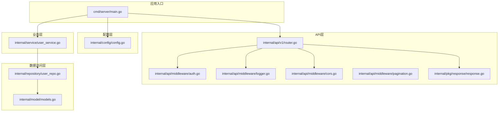
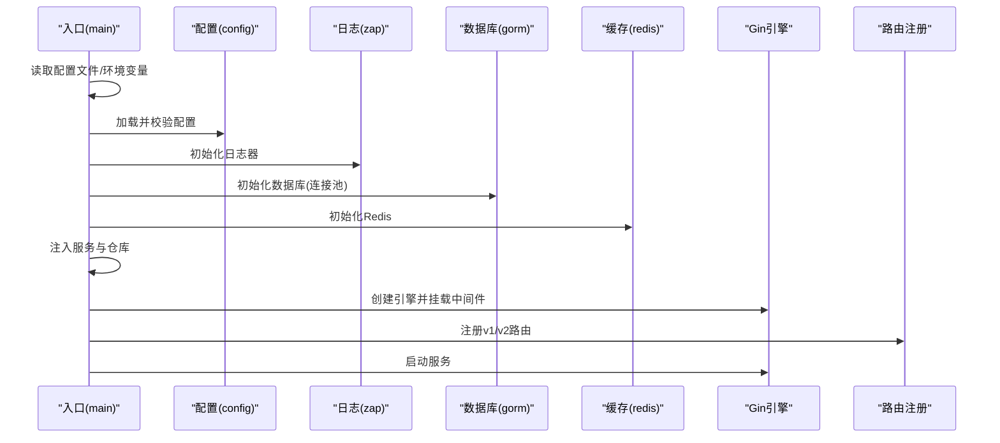
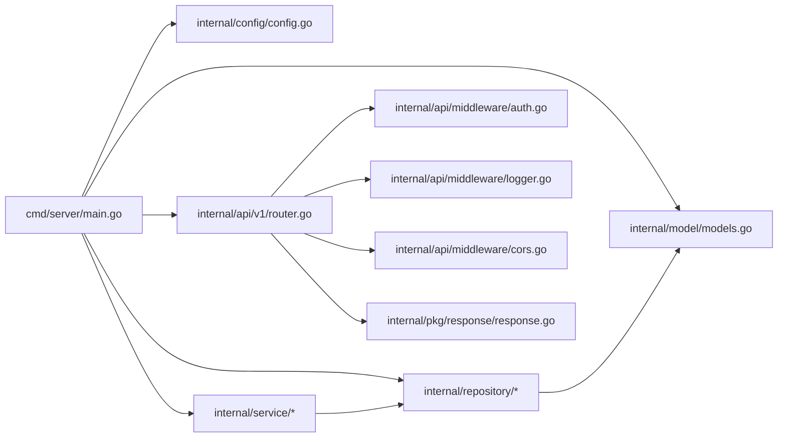

# 后端Go语言编码规范

<cite>
**本文档引用的文件**
- [go.mod](file://backend/go.mod)
- [main.go](file://backend/cmd/server/main.go)
- [config.go](file://backend/internal/config/config.go)
- [auth.go](file://backend/internal/api/middleware/auth.go)
- [logger.go](file://backend/internal/api/middleware/logger.go)
- [cors.go](file://backend/internal/api/middleware/cors.go)
- [pagination.go](file://backend/internal/api/middleware/pagination.go)
- [legacy_write_freeze.go](file://backend/internal/api/middleware/legacy_write_freeze.go)
- [router.go](file://backend/internal/api/v1/router.go)
- [response.go](file://backend/internal/pkg/response/response.go)
- [models.go](file://backend/internal/model/models.go)
- [user_service.go](file://backend/internal/service/user_service.go)
- [user_repo.go](file://backend/internal/repository/user_repo.go)
- [config.example.yaml](file://backend/config.example.yaml)
- [errors.go](file://backend/internal/api/v2/common/errors.go)
</cite>

## 目录
1. [引言](#引言)
2. [项目结构](#项目结构)
3. [核心组件](#核心组件)
4. [架构总览](#架构总览)
5. [详细组件分析](#详细组件分析)
6. [依赖关系分析](#依赖关系分析)
7. [性能考虑](#性能考虑)
8. [故障排查指南](#故障排查指南)
9. [结论](#结论)
10. [附录](#附录)

## 引言
本编码规范面向Go后端服务，旨在统一命名约定、文件组织、错误处理、接口设计、Gin框架使用、GORM ORM最佳实践、数据库连接池配置、中间件编写规范、代码注释、单元测试、日志记录与配置管理。文档结合现有代码库的实际实现，提供可操作的规范与示例路径，帮助团队建立一致、可维护、高性能的后端工程。

## 项目结构
后端采用分层架构与按功能模块划分的组织方式：
- cmd：应用入口与命令行工具
- internal：核心业务逻辑
  - api：路由与中间件
  - config：配置加载与校验
  - model：数据模型定义
  - repository：数据访问层
  - service：业务服务层
  - pkg：通用工具包
  - websocket：WebSocket Hub
- migrations：数据库迁移脚本
- scripts：运维脚本
- config.example.yaml：配置模板

**图表来源**
- [main.go:52-266](file://backend/cmd/server/main.go#L52-L266)
- [router.go:58-634](file://backend/internal/api/v1/router.go#L58-L634)
- [auth.go:22-61](file://backend/internal/api/middleware/auth.go#L22-L61)
- [logger.go:10-31](file://backend/internal/api/middleware/logger.go#L10-L31)
- [cors.go:10-19](file://backend/internal/api/middleware/cors.go#L10-L19)
- [pagination.go:14-71](file://backend/internal/api/middleware/pagination.go#L14-L71)
- [response.go:10-104](file://backend/internal/pkg/response/response.go#L10-L104)
- [user_service.go:33-55](file://backend/internal/service/user_service.go#L33-L55)
- [user_repo.go:9-15](file://backend/internal/repository/user_repo.go#L9-L15)
- [models.go:9-30](file://backend/internal/model/models.go#L9-L30)

**章节来源**
- [main.go:1-390](file://backend/cmd/server/main.go#L1-L390)
- [router.go:1-634](file://backend/internal/api/v1/router.go#L1-L634)

## 核心组件
- 配置系统：集中式配置加载、环境变量覆盖、严格校验与生产环境验证
- 中间件体系：认证、CORS、日志、分页、写入冻结
- 路由注册：按功能模块分组，区分公开、鉴权、管理员路由
- 业务服务：围绕领域对象构建服务，职责清晰
- 数据访问：Repository封装GORM，提供常用CRUD与聚合查询
- 错误处理：统一响应格式，按场景映射HTTP语义与业务错误码

**章节来源**
- [config.go:16-31](file://backend/internal/config/config.go#L16-L31)
- [auth.go:22-61](file://backend/internal/api/middleware/auth.go#L22-L61)
- [router.go:58-634](file://backend/internal/api/v1/router.go#L58-L634)
- [user_service.go:33-55](file://backend/internal/service/user_service.go#L33-L55)
- [user_repo.go:9-15](file://backend/internal/repository/user_repo.go#L9-L15)
- [response.go:10-104](file://backend/internal/pkg/response/response.go#L10-L104)

## 架构总览
整体采用“入口初始化 → 配置校验 → 依赖注入 → 路由注册 → 服务启动”的流程；Gin作为Web框架，GORM负责ORM，Redis用于缓存与令牌黑名单，Zap提供结构化日志。

**图表来源**
- [main.go:52-266](file://backend/cmd/server/main.go#L52-L266)
- [config.go:415-435](file://backend/internal/config/config.go#L415-L435)

**章节来源**
- [main.go:52-266](file://backend/cmd/server/main.go#L52-L266)

## 详细组件分析

### 命名约定与文件组织
- 包名：小写、简洁、不缩写；如 config、repository、service、pkg
- 变量/常量：驼峰命名；常量使用 UPPER_SNAKE_CASE
- 函数：首字母大写导出函数，内部函数小写开头
- 结构体字段：首字母大写（JSON导出），敏感字段加 "-" 隐藏
- 文件：按职责命名，handler.go、repo.go、service.go、models.go
- 目录：按功能模块划分，避免交叉依赖

示例路径参考：
- [models.go:9-30](file://backend/internal/model/models.go#L9-L30)
- [user_repo.go:9-15](file://backend/internal/repository/user_repo.go#L9-L15)
- [user_service.go:33-55](file://backend/internal/service/user_service.go#L33-L55)

**章节来源**
- [models.go:9-30](file://backend/internal/model/models.go#L9-L30)
- [user_repo.go:9-15](file://backend/internal/repository/user_repo.go#L9-L15)
- [user_service.go:33-55](file://backend/internal/service/user_service.go#L33-L55)

### Gin框架使用规范
- 模式设置：通过配置控制运行模式（debug/release/test）
- 中间件顺序：Recovery → CORS → Logger → 自定义中间件
- 路由分组：按API版本与权限分组，明确公开、鉴权、管理员路由
- 静态资源：上传目录静态映射
- WebSocket：独立路由接入Hub

示例路径参考：
- [main.go:249-258](file://backend/cmd/server/main.go#L249-L258)
- [router.go:58-634](file://backend/internal/api/v1/router.go#L58-L634)

**章节来源**
- [main.go:249-258](file://backend/cmd/server/main.go#L249-L258)
- [router.go:58-634](file://backend/internal/api/v1/router.go#L58-L634)

### GORM ORM最佳实践
- 连接池：显式设置最大空闲/打开连接数，设置字符集
- 自动迁移：启动时执行，覆盖主要业务表
- 查询封装：Repository层封装常用查询，避免在服务层直接拼SQL
- 事务：复杂业务使用事务，失败回滚
- 软删除：使用 DeletedAt 索引字段

示例路径参考：
- [main.go:268-292](file://backend/cmd/server/main.go#L268-L292)
- [main.go:294-389](file://backend/cmd/server/main.go#L294-L389)
- [user_repo.go:45-57](file://backend/internal/repository/user_repo.go#L45-L57)

**章节来源**
- [main.go:268-292](file://backend/cmd/server/main.go#L268-L292)
- [main.go:294-389](file://backend/cmd/server/main.go#L294-L389)
- [user_repo.go:45-57](file://backend/internal/repository/user_repo.go#L45-L57)

### 数据库连接池配置
- MaxIdleConns：空闲连接数
- MaxOpenConns：最大打开连接数
- Names utf8mb4：确保字符集与排序规则正确
- 启动时设置并校验

示例路径参考：
- [main.go:281-291](file://backend/cmd/server/main.go#L281-L291)
- [config.go:62-78](file://backend/internal/config/config.go#L62-L78)

**章节来源**
- [main.go:281-291](file://backend/cmd/server/main.go#L281-L291)
- [config.go:62-78](file://backend/internal/config/config.go#L62-L78)

### 中间件编写规范
- 认证中间件：解析Authorization头，校验Bearer Token，支持黑名单检查
- 管理员中间件：基于上下文用户类型判断
- CORS中间件：允许跨域、暴露长度、凭证与缓存
- 日志中间件：记录状态码、方法、路径、查询、IP、耗时、响应体大小
- 分页中间件：解析page/page_size，限制最大页大小
- 写入冻结中间件：对非GET/HEAD/OPTIONS请求进行拦截，引导至v2

示例路径参考：
- [auth.go:22-61](file://backend/internal/api/middleware/auth.go#L22-L61)
- [auth.go:63-73](file://backend/internal/api/middleware/auth.go#L63-L73)
- [cors.go:10-19](file://backend/internal/api/middleware/cors.go#L10-L19)
- [logger.go:10-31](file://backend/internal/api/middleware/logger.go#L10-L31)
- [pagination.go:14-71](file://backend/internal/api/middleware/pagination.go#L14-L71)
- [legacy_write_freeze.go:12-31](file://backend/internal/api/middleware/legacy_write_freeze.go#L12-L31)

**章节来源**
- [auth.go:22-61](file://backend/internal/api/middleware/auth.go#L22-L61)
- [auth.go:63-73](file://backend/internal/api/middleware/auth.go#L63-L73)
- [cors.go:10-19](file://backend/internal/api/middleware/cors.go#L10-L19)
- [logger.go:10-31](file://backend/internal/api/middleware/logger.go#L10-L31)
- [pagination.go:14-71](file://backend/internal/api/middleware/pagination.go#L14-L71)
- [legacy_write_freeze.go:12-31](file://backend/internal/api/middleware/legacy_write_freeze.go#L12-L31)

### 错误处理模式
- 统一响应结构：包含code、message、data、timestamp
- v1/v2响应差异：v2使用特定错误映射函数
- 业务错误分类：参数错误、未授权、禁止、未找到、服务器错误、数据库错误、Redis错误、短信错误、支付错误、上传错误、验证码错误、订单错误
- v2错误处理：根据错误字符串特征映射到相应HTTP语义

示例路径参考：
- [response.go:10-104](file://backend/internal/pkg/response/response.go#L10-L104)
- [errors.go:13-35](file://backend/internal/api/v2/common/errors.go#L13-L35)

**章节来源**
- [response.go:10-104](file://backend/internal/pkg/response/response.go#L10-L104)
- [errors.go:13-35](file://backend/internal/api/v2/common/errors.go#L13-L35)

### 接口设计原则
- Handler职责：接收请求、参数校验、调用服务、返回响应
- Service职责：编排业务流程、调用Repository、处理领域逻辑
- Repository职责：封装数据访问、提供领域查询
- 中间件职责：横切关注点（认证、日志、CORS、分页）

示例路径参考：
- [router.go:34-56](file://backend/internal/api/v1/router.go#L34-L56)
- [user_service.go:33-55](file://backend/internal/service/user_service.go#L33-L55)
- [user_repo.go:9-15](file://backend/internal/repository/user_repo.go#L9-L15)

**章节来源**
- [router.go:34-56](file://backend/internal/api/v1/router.go#L34-L56)
- [user_service.go:33-55](file://backend/internal/service/user_service.go#L33-L55)
- [user_repo.go:9-15](file://backend/internal/repository/user_repo.go#L9-L15)

### 代码注释标准
- 包注释：简述模块职责
- 结构体注释：字段含义与约束
- 方法注释：输入、输出、异常、注意事项
- 关键流程注释：复杂逻辑、边界条件、性能考量

示例路径参考：
- [models.go:9-30](file://backend/internal/model/models.go#L9-L30)
- [user_service.go:57-81](file://backend/internal/service/user_service.go#L57-L81)

**章节来源**
- [models.go:9-30](file://backend/internal/model/models.go#L9-L30)
- [user_service.go:57-81](file://backend/internal/service/user_service.go#L57-L81)

### 单元测试编写规范
- 测试文件：与被测文件同名，后缀_test.go
- 测试用例：覆盖正常路径、边界条件、异常路径
- Mock与Stub：对外部依赖进行替换
- 断言：明确期望值与错误类型

示例路径参考：
- [pagination_test.go](file://backend/internal/api/middleware/pagination_test.go)
- [order_repo_test.go](file://backend/internal/repository/order_repo_test.go)
- [user_repo_test.go](file://backend/internal/repository/user_repo_test.go)

**章节来源**
- [pagination_test.go](file://backend/internal/api/middleware/pagination_test.go)
- [order_repo_test.go](file://backend/internal/repository/order_repo_test.go)
- [user_repo_test.go](file://backend/internal/repository/user_repo_test.go)

### 日志记录规范
- 使用zap结构化日志
- 记录字段：状态码、方法、路径、查询、IP、耗时、响应体大小
- 不记录敏感信息（密码、身份证等）
- 按运行模式切换开发/生产日志

示例路径参考：
- [logger.go:10-31](file://backend/internal/api/middleware/logger.go#L10-L31)
- [main.go:77-84](file://backend/cmd/server/main.go#L77-L84)

**章节来源**
- [logger.go:10-31](file://backend/internal/api/middleware/logger.go#L10-L31)
- [main.go:77-84](file://backend/cmd/server/main.go#L77-L84)

### 配置文件管理
- YAML配置文件，支持环境变量覆盖
- 严格校验：端口、模式、数据库、Redis、JWT、上传、短信、支付、WebSocket等
- 生产环境验证：强制release模式、禁止mock短信、至少配置一种支付方式
- 配置打印：启动时输出关键配置状态

示例路径参考：
- [config.go:415-435](file://backend/internal/config/config.go#L415-L435)
- [config.go:437-464](file://backend/internal/config/config.go#L437-L464)
- [config.go:466-489](file://backend/internal/config/config.go#L466-L489)
- [config.go:491-508](file://backend/internal/config/config.go#L491-L508)
- [config.example.yaml:1-338](file://backend/config.example.yaml#L1-L338)

**章节来源**
- [config.go:415-435](file://backend/internal/config/config.go#L415-L435)
- [config.go:437-464](file://backend/internal/config/config.go#L437-L464)
- [config.go:466-489](file://backend/internal/config/config.go#L466-L489)
- [config.go:491-508](file://backend/internal/config/config.go#L491-L508)
- [config.example.yaml:1-338](file://backend/config.example.yaml#L1-L338)

### 并发安全与内存管理
- 中间件与服务层避免共享可变状态
- 使用context传递请求级上下文
- 合理使用连接池，避免频繁创建/销毁DB/Redis连接
- 大对象序列化与反序列化时注意内存占用

[本节为通用指导，无需特定文件引用]

### 性能优化建议
- 路由与中间件顺序优化，减少不必要的处理
- 分页中间件限制最大页大小，防止超大数据集
- GORM查询添加索引与必要字段选择，避免SELECT *
- 缓存热点数据，合理设置TTL
- 日志异步化，避免阻塞请求

[本节为通用指导，无需特定文件引用]

## 依赖关系分析

**图表来源**
- [main.go:52-266](file://backend/cmd/server/main.go#L52-L266)
- [router.go:58-634](file://backend/internal/api/v1/router.go#L58-L634)
- [auth.go:22-61](file://backend/internal/api/middleware/auth.go#L22-L61)
- [logger.go:10-31](file://backend/internal/api/middleware/logger.go#L10-L31)
- [cors.go:10-19](file://backend/internal/api/middleware/cors.go#L10-L19)
- [response.go:10-104](file://backend/internal/pkg/response/response.go#L10-L104)
- [user_service.go:33-55](file://backend/internal/service/user_service.go#L33-L55)
- [user_repo.go:9-15](file://backend/internal/repository/user_repo.go#L9-L15)
- [models.go:9-30](file://backend/internal/model/models.go#L9-L30)

**章节来源**
- [main.go:52-266](file://backend/cmd/server/main.go#L52-L266)
- [router.go:58-634](file://backend/internal/api/v1/router.go#L58-L634)

## 性能考虑
- 启动阶段：尽早完成配置校验与依赖初始化，避免运行时失败
- 请求处理：中间件顺序与短路返回，减少无效计算
- 数据库：批量查询、索引优化、连接池参数调优
- 缓存：热点数据缓存、失效策略、降级方案

[本节为通用指导，无需特定文件引用]

## 故障排查指南
- 配置问题：检查配置文件与环境变量覆盖，确认生产环境验证通过
- 认证失败：检查Authorization头格式、Token是否在黑名单、JWT密钥与过期时间
- 数据库连接：检查DSN、字符集、连接池参数
- 路由访问：确认中间件顺序与分组，写入冻结中间件是否导致请求被拒绝
- 日志定位：查看zap日志中的状态码、耗时、路径、查询参数

**章节来源**
- [config.go:437-464](file://backend/internal/config/config.go#L437-L464)
- [auth.go:22-61](file://backend/internal/api/middleware/auth.go#L22-L61)
- [main.go:268-292](file://backend/cmd/server/main.go#L268-L292)
- [router.go:58-634](file://backend/internal/api/v1/router.go#L58-L634)
- [logger.go:10-31](file://backend/internal/api/middleware/logger.go#L10-L31)

## 结论
本规范基于现有代码库提炼出可落地的Go后端工程实践，涵盖从入口初始化、配置管理、中间件、路由、服务与数据访问到错误处理与日志的关键环节。建议团队在新功能开发与重构中遵循上述规范，持续提升代码质量与系统稳定性。

## 附录
- 示例路径汇总
  - [main.go:52-266](file://backend/cmd/server/main.go#L52-L266)
  - [config.go:415-435](file://backend/internal/config/config.go#L415-L435)
  - [router.go:58-634](file://backend/internal/api/v1/router.go#L58-L634)
  - [auth.go:22-61](file://backend/internal/api/middleware/auth.go#L22-L61)
  - [logger.go:10-31](file://backend/internal/api/middleware/logger.go#L10-L31)
  - [cors.go:10-19](file://backend/internal/api/middleware/cors.go#L10-L19)
  - [pagination.go:14-71](file://backend/internal/api/middleware/pagination.go#L14-L71)
  - [legacy_write_freeze.go:12-31](file://backend/internal/api/middleware/legacy_write_freeze.go#L12-L31)
  - [response.go:10-104](file://backend/internal/pkg/response/response.go#L10-L104)
  - [user_service.go:33-55](file://backend/internal/service/user_service.go#L33-L55)
  - [user_repo.go:9-15](file://backend/internal/repository/user_repo.go#L9-L15)
  - [models.go:9-30](file://backend/internal/model/models.go#L9-L30)
  - [errors.go:13-35](file://backend/internal/api/v2/common/errors.go#L13-L35)
  - [config.example.yaml:1-338](file://backend/config.example.yaml#L1-L338)