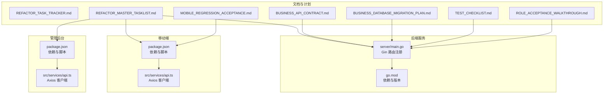
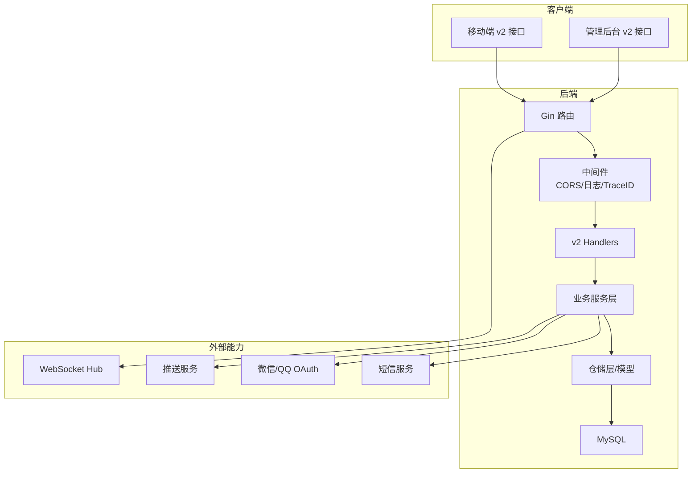
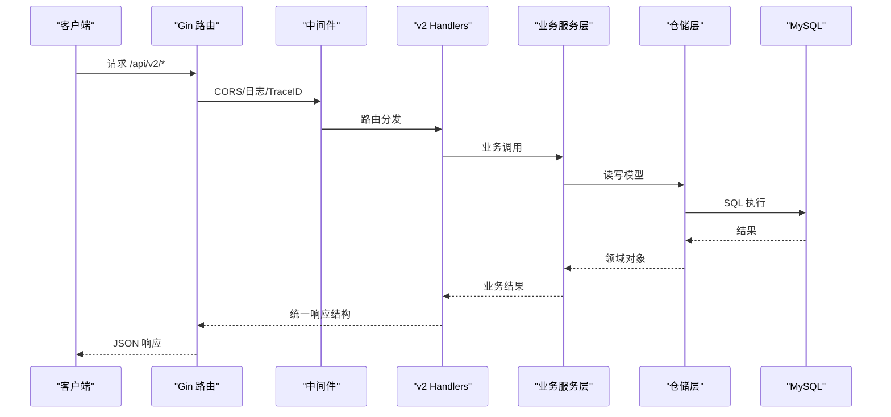
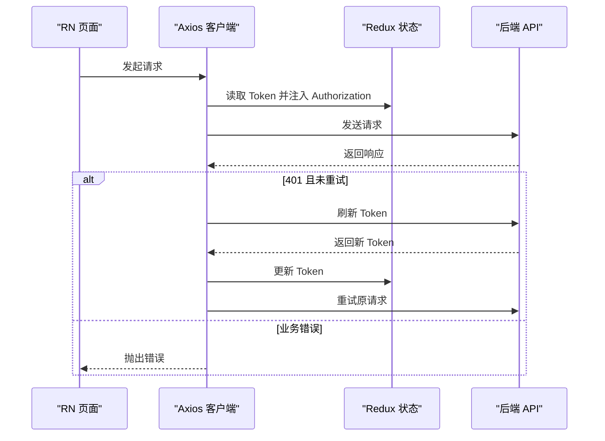
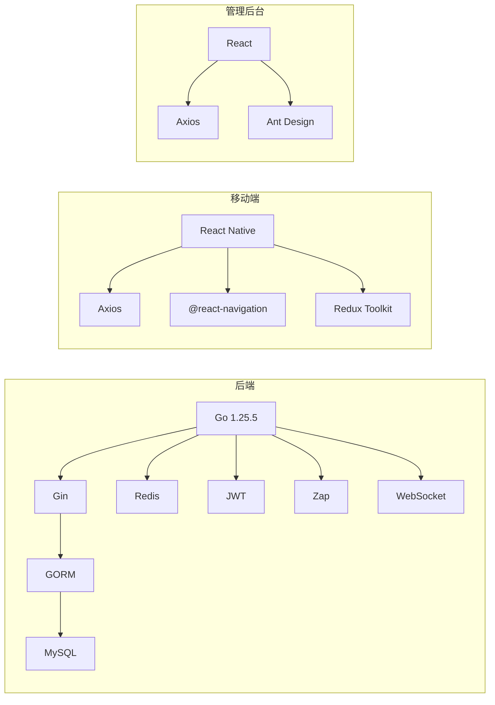

# 开发指南

<cite>
**本文引用的文件**
- [README.md](file://README.md)
- [REFACTOR_MASTER_TASKLIST.md](file://REFACTOR_MASTER_TASKLIST.md)
- [REFACTOR_TASK_TRACKER.md](file://REFACTOR_TASK_TRACKER.md)
- [BUSINESS_API_CONTRACT.md](file://BUSINESS_API_CONTRACT.md)
- [BUSINESS_DATABASE_MIGRATION_PLAN.md](file://BUSINESS_DATABASE_MIGRATION_PLAN.md)
- [TEST_CHECKLIST.md](file://TEST_CHECKLIST.md)
- [MOBILE_REGRESSION_ACCEPTANCE.md](file://MOBILE_REGRESSION_ACCEPTANCE.md)
- [ROLE_ACCEPTANCE_WALKTHROUGH.md](file://ROLE_ACCEPTANCE_WALKTHROUGH.md)
- [backend/go.mod](file://backend/go.mod)
- [backend/cmd/server/main.go](file://backend/cmd/server/main.go)
- [mobile/package.json](file://mobile/package.json)
- [admin/package.json](file://admin/package.json)
- [mobile/.eslintrc.js](file://mobile/.eslintrc.js)
- [mobile/.prettierrc.js](file://mobile/.prettierrc.js)
- [mobile/src/services/api.ts](file://mobile/src/services/api.ts)
- [admin/src/services/api.ts](file://admin/src/services/api.ts)
</cite>

## 目录
1. [简介](#简介)
2. [项目结构](#项目结构)
3. [核心组件](#核心组件)
4. [架构总览](#架构总览)
5. [详细组件分析](#详细组件分析)
6. [依赖分析](#依赖分析)
7. [性能考虑](#性能考虑)
8. [故障排查指南](#故障排查指南)
9. [结论](#结论)
10. [附录](#附录)

## 简介
本开发指南面向无人机租赁平台重构后的 v2 项目，围绕统一的开发标准、流程规范与质量治理，提供从代码规范、开发流程、重构计划、任务管理、质量标准、到环境配置、调试技巧、性能优化、贡献与发布流程的完整指导。项目当前聚焦“重载末端货物吊运”，统一角色（客户/机主/飞手/复合身份）、核心对象（需求/供给/订单/正式派单/飞行记录）与 API v2 契约，配合数据库迁移与双读校验，确保前后端一致、页面语义清晰、状态机闭环。

## 项目结构
项目采用多模块组织，包含后端 Go 服务、移动端 React Native 应用、管理后台 React 应用与数据库迁移脚本，辅以阶段化验收文档与测试清单，支撑 v2 重构的持续交付。

图表来源
- [backend/cmd/server/main.go:1-266](file://backend/cmd/server/main.go#L1-L266)
- [backend/go.mod:1-80](file://backend/go.mod#L1-L80)
- [mobile/package.json:1-63](file://mobile/package.json#L1-L63)
- [admin/package.json:1-33](file://admin/package.json#L1-L33)
- [mobile/src/services/api.ts:1-155](file://mobile/src/services/api.ts#L1-L155)
- [admin/src/services/api.ts:1-139](file://admin/src/services/api.ts#L1-L139)
- [REFACTOR_MASTER_TASKLIST.md:1-512](file://REFACTOR_MASTER_TASKLIST.md#L1-L512)
- [BUSINESS_API_CONTRACT.md:1-1122](file://BUSINESS_API_CONTRACT.md#L1-L1122)
- [BUSINESS_DATABASE_MIGRATION_PLAN.md:1-550](file://BUSINESS_DATABASE_MIGRATION_PLAN.md#L1-L550)
- [TEST_CHECKLIST.md:1-448](file://TEST_CHECKLIST.md#L1-L448)
- [MOBILE_REGRESSION_ACCEPTANCE.md:1-337](file://MOBILE_REGRESSION_ACCEPTANCE.md#L1-L337)
- [ROLE_ACCEPTANCE_WALKTHROUGH.md:1-217](file://ROLE_ACCEPTANCE_WALKTHROUGH.md#L1-L217)

章节来源
- [README.md:1-29](file://README.md#L1-L29)
- [REFACTOR_MASTER_TASKLIST.md:1-512](file://REFACTOR_MASTER_TASKLIST.md#L1-L512)
- [BUSINESS_API_CONTRACT.md:1-1122](file://BUSINESS_API_CONTRACT.md#L1-L1122)
- [BUSINESS_DATABASE_MIGRATION_PLAN.md:1-550](file://BUSINESS_DATABASE_MIGRATION_PLAN.md#L1-L550)
- [TEST_CHECKLIST.md:1-448](file://TEST_CHECKLIST.md#L1-L448)
- [MOBILE_REGRESSION_ACCEPTANCE.md:1-337](file://MOBILE_REGRESSION_ACCEPTANCE.md#L1-L337)
- [ROLE_ACCEPTANCE_WALKTHROUGH.md:1-217](file://ROLE_ACCEPTANCE_WALKTHROUGH.md#L1-L217)

## 核心组件
- 后端服务（Go/Gin）：统一 v1/v2 路由、中间件、服务层装配与自动迁移，支持短信、上传、推送、OAuth、WebSocket 等能力模块。
- 移动端（React Native/Axios）：v1/v2 双客户端，统一拦截器、鉴权头注入、业务错误码校验与 Token 刷新。
- 管理后台（React/Ant Design）：基于 v2 接口的运营与审计看板，涵盖用户、无人机、飞手、客户、订单、派单、飞行、支付、迁移审计等。
- 文档与计划：重构总表、任务跟踪、API 契约、数据库迁移方案、测试与验收文档，构成统一的质量与交付基线。

章节来源
- [backend/cmd/server/main.go:1-266](file://backend/cmd/server/main.go#L1-L266)
- [mobile/src/services/api.ts:1-155](file://mobile/src/services/api.ts#L1-L155)
- [admin/src/services/api.ts:1-139](file://admin/src/services/api.ts#L1-L139)
- [REFACTOR_MASTER_TASKLIST.md:1-512](file://REFACTOR_MASTER_TASKLIST.md#L1-L512)
- [BUSINESS_API_CONTRACT.md:1-1122](file://BUSINESS_API_CONTRACT.md#L1-L1122)
- [BUSINESS_DATABASE_MIGRATION_PLAN.md:1-550](file://BUSINESS_DATABASE_MIGRATION_PLAN.md#L1-L550)
- [TEST_CHECKLIST.md:1-448](file://TEST_CHECKLIST.md#L1-L448)
- [MOBILE_REGRESSION_ACCEPTANCE.md:1-337](file://MOBILE_REGRESSION_ACCEPTANCE.md#L1-L337)
- [ROLE_ACCEPTANCE_WALKTHROUGH.md:1-217](file://ROLE_ACCEPTANCE_WALKTHROUGH.md#L1-L217)

## 架构总览
v2 架构以“角色 + 对象 + API v2 + 数据库迁移”为核心，前后端通过统一响应结构与鉴权头交互，移动端与管理后台并行演进，阶段化验收保障质量。

图表来源
- [backend/cmd/server/main.go:1-266](file://backend/cmd/server/main.go#L1-L266)
- [backend/go.mod:1-80](file://backend/go.mod#L1-L80)

章节来源
- [BUSINESS_API_CONTRACT.md:1-1122](file://BUSINESS_API_CONTRACT.md#L1-L1122)
- [BUSINESS_DATABASE_MIGRATION_PLAN.md:1-550](file://BUSINESS_DATABASE_MIGRATION_PLAN.md#L1-L550)
- [backend/cmd/server/main.go:1-266](file://backend/cmd/server/main.go#L1-L266)

## 详细组件分析

### 后端服务（Go/Gin）
- 路由与中间件：统一 CORS、日志、TraceID、鉴权黑名单、自动迁移与 WebSocket Hub。
- 服务装配：按领域拆分服务（认证、用户、机主、飞手、客户、订单、派单、飞行、支付、结算、消息、风控、保险、分析等），通过依赖注入与事件服务串联。
- 数据库：GORM 自动迁移核心模型，字符集与连接池配置。
- 外部能力：短信、上传、支付、推送、OAuth、AMap 地图服务。

图表来源
- [backend/cmd/server/main.go:1-266](file://backend/cmd/server/main.go#L1-L266)

章节来源
- [backend/cmd/server/main.go:1-266](file://backend/cmd/server/main.go#L1-L266)
- [backend/go.mod:1-80](file://backend/go.mod#L1-L80)

### 移动端 API 客户端
- 双客户端：v1 与 v2，分别指向不同 baseURL，拦截器统一处理鉴权头、业务错误码与 401 Token 刷新。
- Token 刷新：并发去重、等待队列、失败回退登出。
- 统一响应：v1 使用数值码，v2 使用字符串码，拦截器统一校验。

图表来源
- [mobile/src/services/api.ts:1-155](file://mobile/src/services/api.ts#L1-L155)

章节来源
- [mobile/src/services/api.ts:1-155](file://mobile/src/services/api.ts#L1-L155)
- [mobile/package.json:1-63](file://mobile/package.json#L1-L63)

### 管理后台 API 客户端
- 基于环境变量的 baseURL 与 API 前缀，v2 专属接口封装。
- 管理端鉴权：localStorage 存取 admin_token/admin_refresh_token，401 自动跳转登录。
- 覆盖运营与审计：用户、无人机、飞手、客户、订单、派单、飞行、支付、迁移审计、统计报表等。

章节来源
- [admin/src/services/api.ts:1-139](file://admin/src/services/api.ts#L1-L139)
- [admin/package.json:1-33](file://admin/package.json#L1-L33)

### API v2 契约与统一响应
- 版本建议：v1 仅用于历史页面与数据比对，v2 为新页面与新状态机。
- 认证：Authorization: Bearer <token>。
- 统一响应结构：code/message/data/meta/trace_id；列表接口 data.items + meta.page/page_size/total。
- 平台边界：默认 heavy_cargo_lift_transport，供给市场仅返回满足重载门槛的生效供给。

章节来源
- [BUSINESS_API_CONTRACT.md:1-1122](file://BUSINESS_API_CONTRACT.md#L1-L1122)

### 数据库迁移与双读校验
- 目标模型：账号与身份、设备与供给、撮合、履约、财务与争议分层清晰。
- 迁移原则：以目标模型为准、撮合与履约分层、角色不再由单字段承担、新表先建旧表并存、平台范围准入在迁移期落地。
- 执行阶段：建新表→批量回填→后端双读校验→新接口切流→前端切新页面→下线旧依赖。
- 双读校验：关键页面（首页、订单、派单、飞行）输出新旧对比结果，定位异常与审计清单。

章节来源
- [BUSINESS_DATABASE_MIGRATION_PLAN.md:1-550](file://BUSINESS_DATABASE_MIGRATION_PLAN.md#L1-L550)
- [backend/cmd/server/main.go:294-389](file://backend/cmd/server/main.go#L294-L389)

### 重构任务总表与任务跟踪
- 重构总表：明确阶段、复杂度、任务拆分、验收标准与影响范围，作为唯一执行清单。
- 任务跟踪：差异分析、优先级、技术架构差异、模块任务列表与完成状态。
- 建议执行顺序：先锁死领域模型与状态机，再完成 API v2，随后按页面域分批切移动端，后台管理与数据迁移收尾。

章节来源
- [REFACTOR_MASTER_TASKLIST.md:1-512](file://REFACTOR_MASTER_TASKLIST.md#L1-L512)
- [REFACTOR_TASK_TRACKER.md:1-1047](file://REFACTOR_TASK_TRACKER.md#L1-L1047)

### 测试与验收
- 自动角色验收：脚本准备演示数据、执行主链路、输出报告与 JSON 结果。
- 移动端回归：关键页面对象边界、角色入口、状态/编号/来源标签一致性、布局与入口完整性。
- 验收矩阵：首页驾驶舱、供给市场、需求市场、订单/派单、飞行监控/记录、我的页与档案等。
- 测试清单：覆盖认证、无人机、飞手、客户、智能派单、订单执行、支付结算、信用评价、保险理赔、数据分析、空域管理等。

章节来源
- [ROLE_ACCEPTANCE_WALKTHROUGH.md:1-217](file://ROLE_ACCEPTANCE_WALKTHROUGH.md#L1-L217)
- [MOBILE_REGRESSION_ACCEPTANCE.md:1-337](file://MOBILE_REGRESSION_ACCEPTANCE.md#L1-L337)
- [TEST_CHECKLIST.md:1-448](file://TEST_CHECKLIST.md#L1-L448)

## 依赖分析
- 后端依赖：Gin、GORM、MySQL、Redis、JWT、Zap、WebSocket、Viper、Alibaba Cloud 短信等。
- 移动端依赖：React Native、Axios、Redux Toolkit、@react-navigation、Ant Design（管理端）、Vite/TypeScript 等。
- 依赖耦合：后端服务层通过仓储层与模型解耦；移动端/管理后台通过统一 API v2 与后端交互；测试与验收文档为质量门禁。

图表来源
- [backend/go.mod:1-80](file://backend/go.mod#L1-L80)
- [mobile/package.json:1-63](file://mobile/package.json#L1-L63)
- [admin/package.json:1-33](file://admin/package.json#L1-L33)

章节来源
- [backend/go.mod:1-80](file://backend/go.mod#L1-L80)
- [mobile/package.json:1-63](file://mobile/package.json#L1-L63)
- [admin/package.json:1-33](file://admin/package.json#L1-L33)

## 性能考虑
- 数据库连接池与字符集：合理设置最大空闲/活跃连接数，显式设置 utf8mb4。
- 自动迁移与幂等：迁移脚本幂等、结构与数据分离，避免频繁 DDL。
- 双读校验：关键页面对比输出，减少回滚风险与性能波动。
- 前端构建：Web 构建 chunk 优化（如存在），避免首屏阻塞。
- 日志与追踪：统一 TraceID，便于定位慢请求与热点路径。

章节来源
- [backend/cmd/server/main.go:268-292](file://backend/cmd/server/main.go#L268-L292)
- [MOBILE_REGRESSION_ACCEPTANCE.md:1-337](file://MOBILE_REGRESSION_ACCEPTANCE.md#L1-L337)

## 故障排查指南
- 后端服务：检查配置加载、数据库连接、Redis 可用性、自动迁移是否成功。
- 移动端：检查 API 地址、鉴权头、Token 刷新流程、401 重试与错误提示。
- 管理后台：检查 admin_token/admin_refresh_token、401 刷新与登录跳转。
- 数据迁移：核对迁移脚本执行顺序、映射表与审计清单、双读校验结果。
- 验收问题：按角色验收矩阵逐项检查页面对象边界、状态一致性与入口完整性。

章节来源
- [TEST_CHECKLIST.md:416-448](file://TEST_CHECKLIST.md#L416-L448)
- [MOBILE_REGRESSION_ACCEPTANCE.md:1-337](file://MOBILE_REGRESSION_ACCEPTANCE.md#L1-L337)
- [ROLE_ACCEPTANCE_WALKTHROUGH.md:1-217](file://ROLE_ACCEPTANCE_WALKTHROUGH.md#L1-L217)

## 结论
本指南以 v2 重构为主线，结合统一 API 契约、数据库迁移方案、阶段化验收与测试清单，形成从开发到发布的全流程标准。团队应严格遵循任务总表与任务跟踪，统一代码规范与质量门禁，确保角色与对象语义清晰、状态机闭环、页面与接口一致、数据迁移安全可控。

## 附录

### 代码规范与质量标准
- ESLint 与 Prettier：移动端使用 React Native 标准配置与单引号、尾逗号风格。
- 统一响应与错误码：v1 数值码、v2 字符串码，拦截器统一校验。
- 统一鉴权：Authorization: Bearer <token>，401 自动刷新与登出。

章节来源
- [mobile/.eslintrc.js:1-5](file://mobile/.eslintrc.js#L1-L5)
- [mobile/.prettierrc.js:1-6](file://mobile/.prettierrc.js#L1-L6)
- [mobile/src/services/api.ts:1-155](file://mobile/src/services/api.ts#L1-L155)
- [admin/src/services/api.ts:1-139](file://admin/src/services/api.ts#L1-L139)
- [BUSINESS_API_CONTRACT.md:1-1122](file://BUSINESS_API_CONTRACT.md#L1-L1122)

### 开发流程与任务管理
- 任务来源：重构总表与任务跟踪，按阶段与优先级推进。
- 验收基线：角色验收脚本、移动端回归矩阵、测试清单。
- 双读校验：迁移阶段关键页面一致性验证。

章节来源
- [REFACTOR_MASTER_TASKLIST.md:1-512](file://REFACTOR_MASTER_TASKLIST.md#L1-L512)
- [REFACTOR_TASK_TRACKER.md:1-1047](file://REFACTOR_TASK_TRACKER.md#L1-L1047)
- [ROLE_ACCEPTANCE_WALKTHROUGH.md:1-217](file://ROLE_ACCEPTANCE_WALKTHROUGH.md#L1-L217)
- [MOBILE_REGRESSION_ACCEPTANCE.md:1-337](file://MOBILE_REGRESSION_ACCEPTANCE.md#L1-L337)
- [TEST_CHECKLIST.md:1-448](file://TEST_CHECKLIST.md#L1-L448)

### 重构路线图与技术债务处理
- 路线图：阶段 1~10 的执行顺序与关键里程碑。
- 技术债务：以目标模型为准、新表先建旧表并存、平台范围准入在迁移期落地、开发测试环境优先“清洁重构”。

章节来源
- [REFACTOR_MASTER_TASKLIST.md:497-512](file://REFACTOR_MASTER_TASKLIST.md#L497-L512)
- [BUSINESS_DATABASE_MIGRATION_PLAN.md:18-87](file://BUSINESS_DATABASE_MIGRATION_PLAN.md#L18-L87)

### 新功能开发与 Bug 修复流程
- 新功能：基于 API 契约定义接口，后端服务层与仓储层实现，移动端/管理后台按页面域并行开发，阶段化回归与验收。
- Bug 修复：定位响应结构与状态机一致性、迁移审计清单、双读校验结果，必要时回滚到旧接口兼容层。

章节来源
- [BUSINESS_API_CONTRACT.md:1-1122](file://BUSINESS_API_CONTRACT.md#L1-L1122)
- [MOBILE_REGRESSION_ACCEPTANCE.md:1-337](file://MOBILE_REGRESSION_ACCEPTANCE.md#L1-L337)
- [TEST_CHECKLIST.md:1-448](file://TEST_CHECKLIST.md#L1-L448)

### 代码审查标准
- 统一响应结构与错误码、鉴权头与 Token 刷新、跨域与日志中间件。
- 服务层职责单一、仓储层与模型解耦、迁移脚本幂等与可回滚。
- 前端拦截器与状态管理一致性、页面对象边界与状态一致性。

章节来源
- [BUSINESS_API_CONTRACT.md:1-1122](file://BUSINESS_API_CONTRACT.md#L1-L1122)
- [backend/cmd/server/main.go:1-266](file://backend/cmd/server/main.go#L1-L266)
- [mobile/src/services/api.ts:1-155](file://mobile/src/services/api.ts#L1-L155)
- [admin/src/services/api.ts:1-139](file://admin/src/services/api.ts#L1-L139)

### 开发环境配置与调试技巧
- 后端：配置文件加载、数据库连接、Redis、WebSocket Hub、自动迁移。
- 移动端：v1/v2 双客户端、拦截器、Token 刷新、错误提示。
- 管理后台：环境变量 baseURL/API 前缀、鉴权存储与 401 处理。

章节来源
- [backend/cmd/server/main.go:52-104](file://backend/cmd/server/main.go#L52-L104)
- [mobile/src/services/api.ts:1-155](file://mobile/src/services/api.ts#L1-L155)
- [admin/src/services/api.ts:1-139](file://admin/src/services/api.ts#L1-L139)

### 版本发布流程
- 阶段化发布：先移动端到 v2，再后台到 v2，最后冻结 v1 写入。
- 回归与验收：角色验收脚本、移动端回归矩阵、测试清单。
- 文档同步：测试与演示文档随业务模型更新。

章节来源
- [REFACTOR_MASTER_TASKLIST.md:459-469](file://REFACTOR_MASTER_TASKLIST.md#L459-L469)
- [ROLE_ACCEPTANCE_WALKTHROUGH.md:110-127](file://ROLE_ACCEPTANCE_WALKTHROUGH.md#L110-L127)
- [MOBILE_REGRESSION_ACCEPTANCE.md:1-337](file://MOBILE_REGRESSION_ACCEPTANCE.md#L1-L337)
- [TEST_CHECKLIST.md:1-448](file://TEST_CHECKLIST.md#L1-L448)

### 常见问题与最佳实践
- 问题：验证码发送失败、登录后页面空白、接口 401、数据库连接失败。
- 处理：检查服务状态、Redis/MySQL 容器、API 地址与鉴权头、配置文件。
- 最佳实践：统一响应结构、鉴权头注入、拦截器错误处理、迁移脚本幂等与审计清单、页面对象边界与状态一致性。

章节来源
- [TEST_CHECKLIST.md:431-448](file://TEST_CHECKLIST.md#L431-L448)
- [MOBILE_REGRESSION_ACCEPTANCE.md:1-337](file://MOBILE_REGRESSION_ACCEPTANCE.md#L1-L337)
- [BUSINESS_API_CONTRACT.md:1-1122](file://BUSINESS_API_CONTRACT.md#L1-L1122)