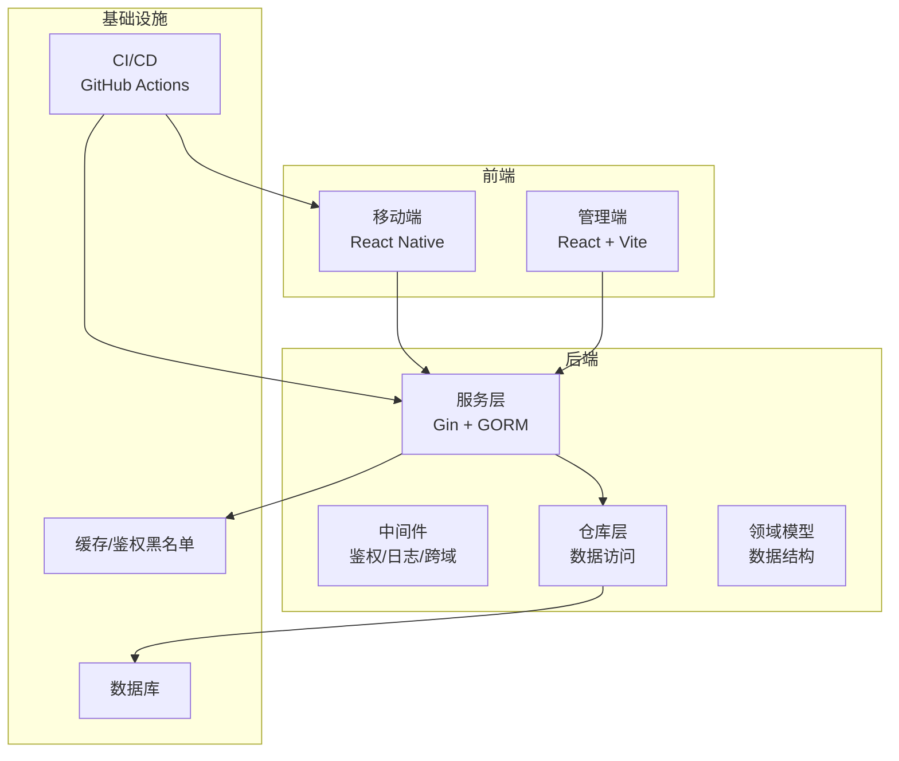
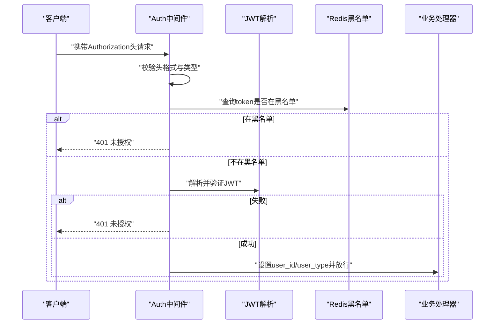
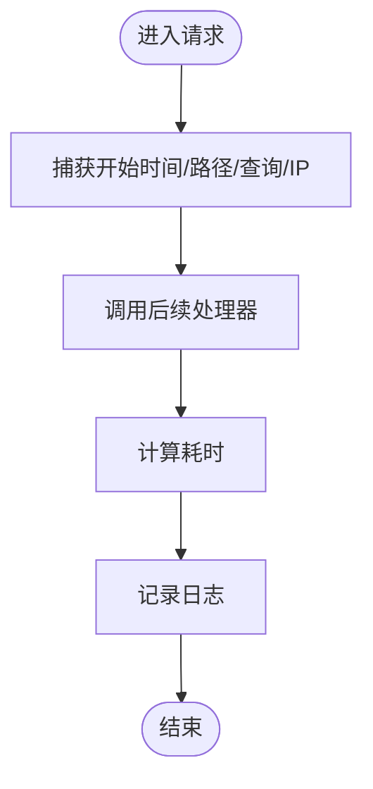
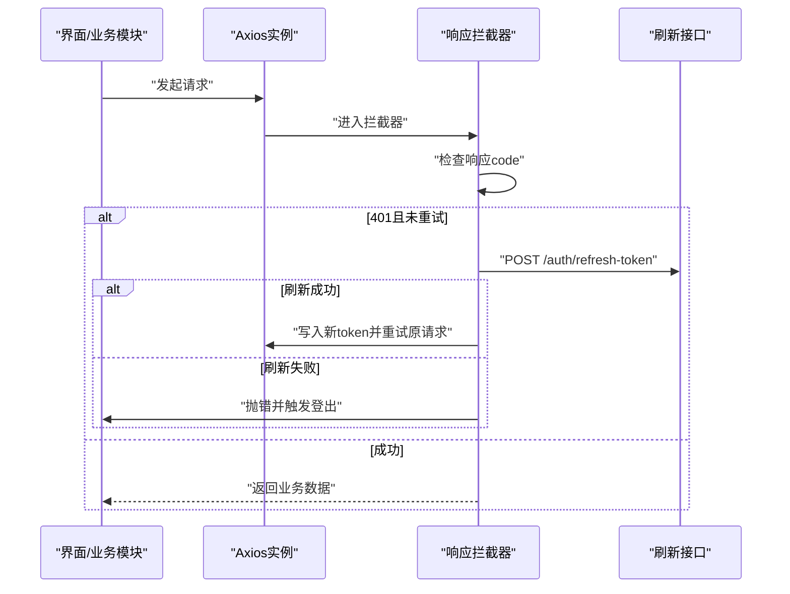
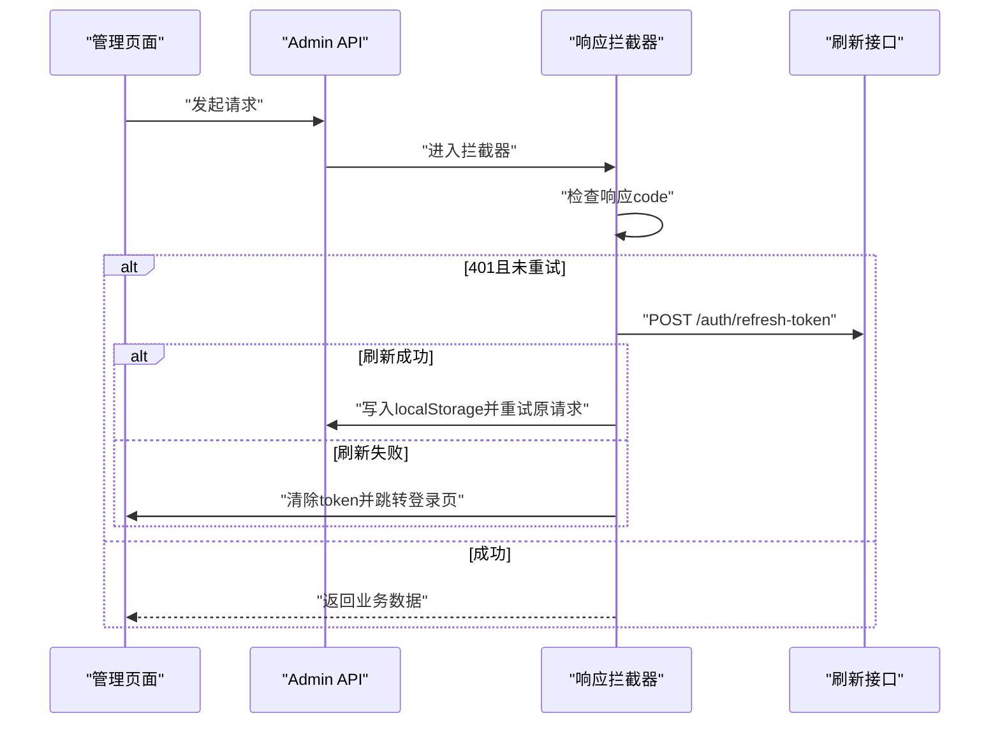
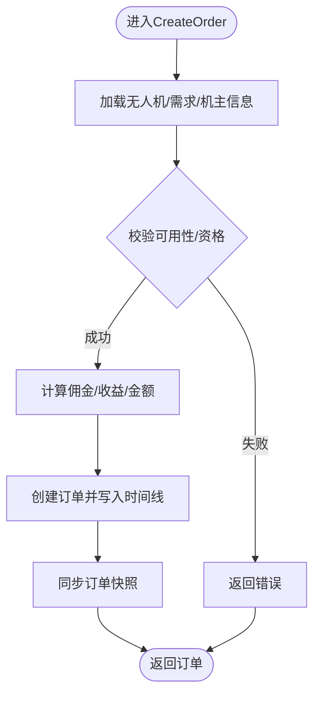
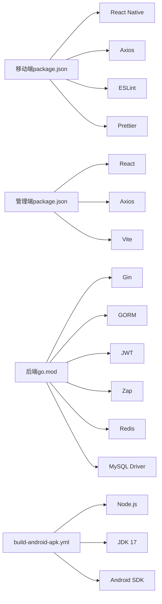

# 代码审查流程

<cite>
**本文引用的文件**
- [README.md](file://README.md)
- [build-android-apk.yml](file://.github/workflows/build-android-apk.yml)
- [.eslintrc.js](file://mobile/.eslintrc.js)
- [.prettierrc.js](file://mobile/.prettierrc.js)
- [package.json（移动端）](file://mobile/package.json)
- [package.json（管理端）](file://admin/package.json)
- [api.ts（移动端）](file://mobile/src/services/api.ts)
- [api.ts（管理端）](file://admin/src/services/api.ts)
- [auth.go（后端中间件）](file://backend/internal/api/middleware/auth.go)
- [logger.go（后端中间件）](file://backend/internal/api/middleware/logger.go)
- [pagination_test.go（后端中间件测试）](file://backend/internal/api/middleware/pagination_test.go)
- [drone_test.go（后端模型测试）](file://backend/internal/model/drone_test.go)
- [order_service.go（后端服务）](file://backend/internal/service/order_service.go)
- [order_service_test.go（后端服务测试）](file://backend/internal/service/order_service_test.go)
- [App.test.tsx（移动端测试）](file://mobile/__tests__/App.test.tsx)
- [go.mod（后端模块）](file://backend/go.mod)
</cite>

## 目录
1. [引言](#引言)
2. [项目结构](#项目结构)
3. [核心组件](#核心组件)
4. [架构总览](#架构总览)
5. [详细组件分析](#详细组件分析)
6. [依赖分析](#依赖分析)
7. [性能考虑](#性能考虑)
8. [故障排查指南](#故障排查指南)
9. [结论](#结论)
10. [附录](#附录)

## 引言
本文件面向无人机租赁平台的代码审查工作，系统化定义审查标准、流程、工具与责任人，覆盖功能代码、架构设计、性能优化与安全等维度。同时提供Pull Request创建规范、审查清单、反馈处理机制、决策与争议解决流程、结果跟踪方法，并给出新手开发者指导与效率提升建议。

## 项目结构
项目采用多仓库分层组织：前端（移动端与管理端）、后端（Go 语言服务）、CI/CD（GitHub Actions）、文档与测试。整体结构如下：

图表来源
- [build-android-apk.yml:1-74](file://.github/workflows/build-android-apk.yml#L1-L74)
- [auth.go（后端中间件）:1-106](file://backend/internal/api/middleware/auth.go#L1-L106)
- [logger.go（后端中间件）:1-32](file://backend/internal/api/middleware/logger.go#L1-L32)
- [api.ts（移动端）:1-155](file://mobile/src/services/api.ts#L1-L155)
- [api.ts（管理端）:1-402](file://admin/src/services/api.ts#L1-L402)

章节来源
- [README.md:1-29](file://README.md#L1-L29)
- [build-android-apk.yml:1-74](file://.github/workflows/build-android-apk.yml#L1-L74)

## 核心组件
- 移动端与管理端：统一通过Axios封装请求，内置鉴权头注入与Token刷新拦截逻辑；管理端支持开发代理与生产直连。
- 后端服务：基于Gin框架，中间件负责鉴权、跨域、日志与分页；服务层封装业务规则（如订单创建与状态流转）。
- 测试体系：Jest（移动端）、Go testing（后端），覆盖接口行为与关键算法。
- 代码质量工具：ESLint（React Native）、Prettier（格式化）。

章节来源
- [api.ts（移动端）:1-155](file://mobile/src/services/api.ts#L1-L155)
- [api.ts（管理端）:1-402](file://admin/src/services/api.ts#L1-L402)
- [auth.go（后端中间件）:1-106](file://backend/internal/api/middleware/auth.go#L1-L106)
- [logger.go（后端中间件）:1-32](file://backend/internal/api/middleware/logger.go#L1-L32)
- [order_service.go（后端服务）:1-800](file://backend/internal/service/order_service.go#L1-L800)
- [App.test.tsx（移动端测试）:1-14](file://mobile/__tests__/App.test.tsx#L1-L14)
- [pagination_test.go（后端中间件测试）:1-42](file://backend/internal/api/middleware/pagination_test.go#L1-L42)
- [drone_test.go（后端模型测试）:1-39](file://backend/internal/model/drone_test.go#L1-L39)
- [order_service_test.go（后端服务测试）:1-105](file://backend/internal/service/order_service_test.go#L1-L105)
- [.eslintrc.js:1-5](file://mobile/.eslintrc.js#L1-L5)
- [.prettierrc.js:1-6](file://mobile/.prettierrc.js#L1-L6)
- [package.json（移动端）:1-64](file://mobile/package.json#L1-L64)
- [package.json（管理端）:1-33](file://admin/package.json#L1-L33)

## 架构总览
审查关注点与职责划分：
- 功能代码：确保业务正确性、边界条件与可测试性（单元/集成测试覆盖）。
- 架构设计：关注分层清晰度、依赖方向、接口契约与扩展点。
- 性能优化：关注请求链路、数据库查询、缓存命中与并发控制。
- 安全性：鉴权、授权、敏感信息处理、输入校验与错误信息脱敏。

审查流程（概念示意）：

```mermaid
flowchart TD
PR["创建PR"] --> Auto["自动化检查<br/>CI/测试/格式化"]
Auto --> AutoPass{"全部通过？"}
AutoPass --> |否| Fix["修复问题并更新PR"]
Fix --> Auto
AutoPass --> |是| Assign["分配审查者"]
Assign --> Review["审查者评估<br/>标准/流程/工具/责任"]
Review --> Decision{"通过/需要修改/复审？"}
Decision --> |需要修改| Feedback["提出具体反馈与清单"]
Feedback --> Iterate["作者迭代修改"]
Iterate --> Review
Decision --> |通过| Merge["合并PR"]
Decision --> |复审| ReReview["重新审查"]
ReReview --> Decision
```

## 详细组件分析

### 组件A：鉴权与授权中间件（后端）
- 关键职责：解析Authorization头、校验JWT、黑名单检查、设置用户上下文、区分v1/v2响应格式。
- 审查要点：
  - JWT解析与过期处理一致性。
  - 黑名单Redis键空间与过期策略。
  - v1/v2响应路径分支正确性。
  - 错误码与日志字段完整性。

图表来源
- [auth.go（后端中间件）:22-61](file://backend/internal/api/middleware/auth.go#L22-L61)

章节来源
- [auth.go（后端中间件）:1-106](file://backend/internal/api/middleware/auth.go#L1-L106)

### 组件B：日志中间件（后端）
- 关键职责：记录请求路径、方法、查询参数、IP、耗时与响应体大小。
- 审查要点：
  - 日志字段完整性与敏感信息脱敏。
  - 性能影响与采样策略（如需）。

图表来源
- [logger.go（后端中间件）:10-31](file://backend/internal/api/middleware/logger.go#L10-L31)

章节来源
- [logger.go（后端中间件）:1-32](file://backend/internal/api/middleware/logger.go#L1-L32)

### 组件C：移动端Axios封装与Token刷新
- 关键职责：统一基地址、超时、鉴权头注入、响应成功码判断、并发刷新去重、401自动刷新与兜底登出。
- 审查要点：
  - 并发刷新状态标记与等待队列处理。
  - 刷新失败后的错误传播与登出流程。
  - v1/v2成功码差异处理。

图表来源
- [api.ts（移动端）:66-147](file://mobile/src/services/api.ts#L66-L147)

章节来源
- [api.ts（移动端）:1-155](file://mobile/src/services/api.ts#L1-L155)

### 组件D：管理端Axios封装与Token刷新
- 关键职责：开发环境代理、生产直连、鉴权头注入、响应成功码判断、并发刷新与本地存储。
- 审查要点：
  - 环境变量配置与默认值。
  - 刷新失败后的路由跳转与清理逻辑。

图表来源
- [api.ts（管理端）:65-137](file://admin/src/services/api.ts#L65-L137)

章节来源
- [api.ts（管理端）:1-402](file://admin/src/services/api.ts#L1-L402)

### 组件E：订单服务（后端）
- 关键职责：订单创建、状态机流转、直达/市场/货运等场景处理、事务与快照同步。
- 审查要点：
  - 事务边界与回滚一致性。
  - 状态机转换条件与幂等性。
  - 关键字段（佣金、机主收益、押金）计算准确性。

图表来源
- [order_service.go（后端服务）:65-243](file://backend/internal/service/order_service.go#L65-L243)

章节来源
- [order_service.go（后端服务）:1-800](file://backend/internal/service/order_service.go#L1-L800)

## 依赖分析
- 前端依赖：React Native、Redux Toolkit、Axios、ESLint、Prettier、Vite等。
- 后端依赖：Gin、GORM、MySQL驱动、JWT、Zap日志、Redis、Viper配置等。
- CI/CD：Android APK构建流水线，包含Node.js、JDK、Android SDK与打包步骤。

图表来源
- [package.json（移动端）:1-64](file://mobile/package.json#L1-L64)
- [package.json（管理端）:1-33](file://admin/package.json#L1-L33)
- [go.mod（后端模块）:1-80](file://backend/go.mod#L1-L80)
- [build-android-apk.yml:1-74](file://.github/workflows/build-android-apk.yml#L1-L74)

章节来源
- [package.json（移动端）:1-64](file://mobile/package.json#L1-L64)
- [package.json（管理端）:1-33](file://admin/package.json#L1-L33)
- [go.mod（后端模块）:1-80](file://backend/go.mod#L1-L80)
- [build-android-apk.yml:1-74](file://.github/workflows/build-android-apk.yml#L1-L74)

## 性能考虑
- 请求链路：减少不必要的鉴权/日志开销，避免重复序列化。
- 缓存：合理利用Redis缓存热点数据与黑名单，注意键空间与过期策略。
- 数据库：批量查询、索引覆盖、事务最小化范围。
- 并发：前端并发刷新去重，后端限流与连接池配置。
- 日志：按级别输出，避免大对象序列化。

## 故障排查指南
- 鉴权失败
  - 检查Authorization头格式与Bearer前缀。
  - 核对JWT签名密钥与过期时间。
  - 确认Redis黑名单键是否存在。
- 响应拦截器异常
  - 校验v1/v2成功码映射。
  - 检查刷新接口返回结构与token对齐。
- 订单状态异常
  - 对照状态机转换条件与事务边界。
  - 核对时间线记录与快照同步时机。

章节来源
- [auth.go（后端中间件）:22-61](file://backend/internal/api/middleware/auth.go#L22-L61)
- [api.ts（移动端）:66-147](file://mobile/src/services/api.ts#L66-L147)
- [api.ts（管理端）:65-137](file://admin/src/services/api.ts#L65-L137)
- [order_service.go（后端服务）:542-792](file://backend/internal/service/order_service.go#L542-L792)

## 结论
通过明确的审查标准、流程与工具配置，结合前后端关键组件的审查要点，可以有效提升代码质量、降低风险并加速交付。建议持续完善测试覆盖率与文档，建立审查结果追踪与知识沉淀机制。

## 附录

### Pull Request创建规范
- 标题与描述
  - 标题简洁明确，描述包含背景、变更内容、影响范围与测试要点。
- 分支与提交
  - 单一主题提交，避免混杂无关改动。
- 变更范围
  - 明确功能、架构、性能、安全四类审查侧重点。
- 依赖与兼容
  - 前后端依赖升级需说明兼容性与迁移成本。

### 审查清单（示例）
- 功能正确性：边界条件、异常路径、幂等性、事务一致性。
- 架构设计：分层清晰、依赖方向、接口契约、扩展点。
- 性能：查询计划、缓存命中、并发控制、日志开销。
- 安全：鉴权/授权、敏感信息、输入校验、错误脱敏。
- 可测试性：单元测试覆盖、集成测试、可观察性。
- 代码风格：ESLint/Prettier配置、命名规范、注释与文档。

### 审查反馈处理
- 具体化：指出文件路径、函数/行号、问题与改进建议。
- 可追溯：保留讨论记录与修改历史。
- 快速迭代：小步提交，及时更新PR。

### 审查决策机制与争议解决
- 决策机制：至少一名审查者同意；涉及安全/架构重大变更需多人同意。
- 争议解决：无法达成一致时，提请技术负责人仲裁；必要时进行技术评审会。

### 审查结果跟踪
- 使用标签/里程碑/任务看板跟踪审查项完成情况。
- 定期回顾审查质量与效率指标（平均耗时、通过率、返工次数）。

### 新手开发者指导
- 熟悉项目结构与模块职责。
- 从简单功能入手，逐步承担复杂模块审查。
- 学习现有测试用例与审查清单，养成自检习惯。
- 主动参与代码评审会议，积累经验。

### 效率提升方法
- 自动化：ESLint/Prettier在提交前执行，CI中强制检查。
- 规范先行：统一代码风格与目录结构，减少分歧。
- 小而美：拆分大PR，聚焦单一目标，便于快速反馈。
- 工具链：IDE插件、格式化脚本、一键修复建议。