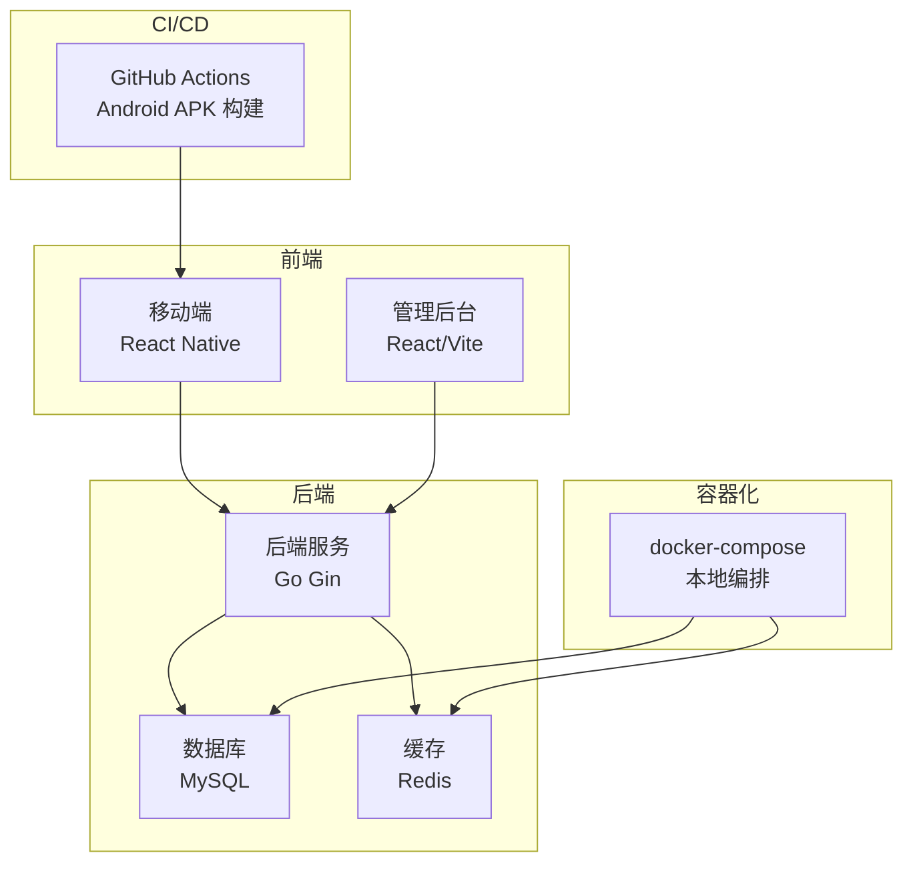
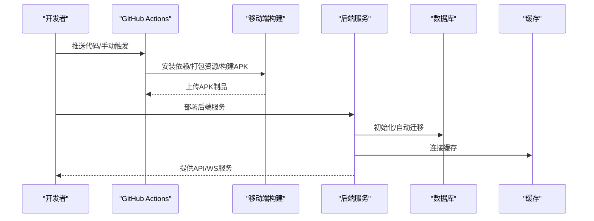
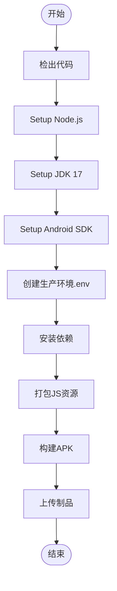
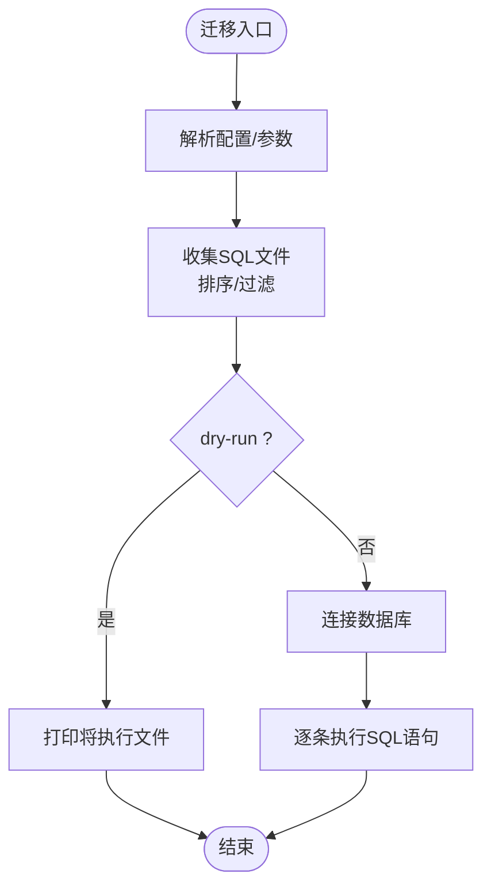
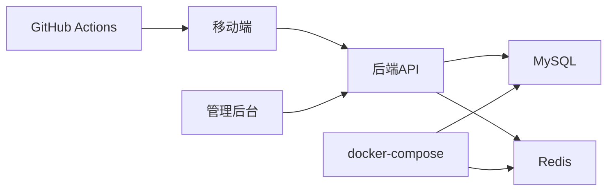

# 发布部署流程

<cite>
**本文引用的文件**
- [README.md](file://README.md)
- [build-android-apk.yml](file://.github/workflows/build-android-apk.yml)
- [docker-compose.yml](file://docker/docker-compose.yml)
- [config.example.yaml](file://backend/config.example.yaml)
- [main.go（后端服务入口）](file://backend/cmd/server/main.go)
- [main.go（迁移工具）](file://backend/cmd/migrate/main.go)
- [vite.config.ts（管理后台前端）](file://admin/vite.config.ts)
- [package.json（移动端）](file://mobile/package.json)
- [app.json（移动端）](file://mobile/app.json)
- [phase10_role_acceptance.sh](file://backend/scripts/phase10_role_acceptance.sh)
- [wurenji_backup.sql](file://docker/wurenji_backup.sql)
- [go.mod（后端模块）](file://backend/go.mod)
</cite>

## 目录
1. [简介](#简介)
2. [项目结构](#项目结构)
3. [核心组件](#核心组件)
4. [架构总览](#架构总览)
5. [详细组件分析](#详细组件分析)
6. [依赖关系分析](#依赖关系分析)
7. [性能考量](#性能考量)
8. [故障排查指南](#故障排查指南)
9. [结论](#结论)
10. [附录](#附录)

## 简介
本文件面向无人机租赁平台的发布与部署团队，提供从版本计划、构建、部署到回滚的完整流程说明，并覆盖CI/CD流水线、自动化脚本、环境管理、灰度与蓝绿发布策略、部署前后检查与验证、监控告警、紧急发布与热修复、数据备份与恢复，以及开发/测试/生产环境的差异与注意事项。

## 项目结构
项目采用前后端分离与多子项目的组织方式：
- 后端（Go）：提供REST API、WebSocket、定时任务与迁移工具
- 移动端（React Native）：Android/iOS客户端
- 管理后台（React/Vite）：基于Ant Design的企业管理界面
- Docker：本地开发与演示环境编排
- GitHub Actions：Android APK自动化构建

图表来源
- [docker-compose.yml:1-27](file://docker/docker-compose.yml#L1-L27)
- [main.go（后端服务入口）:52-266](file://backend/cmd/server/main.go#L52-L266)
- [build-android-apk.yml:1-74](file://.github/workflows/build-android-apk.yml#L1-L74)

章节来源
- [README.md:1-29](file://README.md#L1-L29)
- [docker-compose.yml:1-27](file://docker/docker-compose.yml#L1-L27)
- [main.go（后端服务入口）:52-266](file://backend/cmd/server/main.go#L52-L266)
- [build-android-apk.yml:1-74](file://.github/workflows/build-android-apk.yml#L1-L74)

## 核心组件
- 后端服务（Go）：负责API路由注册、中间件、业务服务装配、数据库与Redis初始化、WebSocket Hub启动、自动迁移等
- 数据库与缓存：通过docker-compose提供本地MySQL与Redis，支持迁移脚本与服务启动时的自动迁移
- 移动端（RN）：提供Android调试APK构建与运行脚本，支持环境变量注入
- 管理后台（Vite）：开发与构建配置，支持代理转发到后端API与WebSocket
- CI/CD：GitHub Actions工作流负责Android APK构建与制品上传
- 迁移工具：命令行迁移器，支持范围与精确编号执行、干跑校验、SQL语句拆分与执行

章节来源
- [main.go（后端服务入口）:52-266](file://backend/cmd/server/main.go#L52-L266)
- [docker-compose.yml:1-27](file://docker/docker-compose.yml#L1-L27)
- [package.json（移动端）:1-64](file://mobile/package.json#L1-L64)
- [vite.config.ts（管理后台前端）:1-64](file://admin/vite.config.ts#L1-L64)
- [build-android-apk.yml:1-74](file://.github/workflows/build-android-apk.yml#L1-L74)
- [main.go（迁移工具）:25-87](file://backend/cmd/migrate/main.go#L25-L87)

## 架构总览
后端服务在启动时加载配置、初始化日志、连接数据库与Redis、启动WebSocket Hub、注册v1/v2路由，并进行模型自动迁移。前端通过HTTP与WebSocket访问后端，CI/CD负责移动端构建与制品归档。

图表来源
- [build-android-apk.yml:1-74](file://.github/workflows/build-android-apk.yml#L1-L74)
- [main.go（后端服务入口）:52-266](file://backend/cmd/server/main.go#L52-L266)

## 详细组件分析

### 版本发布计划
- 版本号管理
  - 移动端版本号定义于应用元数据与包管理配置中，可用于构建产物标识
- 发布节奏
  - 建议采用小步快跑，配合灰度发布与回滚策略
- 变更影响评估
  - 关注数据库迁移、API变更、第三方服务配置变更（短信、支付、地图）

章节来源
- [app.json（移动端）:1-5](file://mobile/app.json#L1-L5)
- [package.json（移动端）:1-64](file://mobile/package.json#L1-L64)

### 构建流程
- Android APK构建（CI）
  - 步骤包括：检出代码、安装Node与JDK、配置Android SDK、创建生产环境.env、安装依赖、打包JS Bundle、构建调试APK、上传制品
  - 环境变量注入：API_BASE_URL、WS_BASE_URL、API_TIMEOUT、APP_ENV、DEBUG_MODE
- 移动端本地构建
  - 支持调试运行与Web预览，构建脚本与依赖由包管理文件定义
- 管理后台构建
  - Vite配置支持开发代理、分包策略、全局常量注入

图表来源
- [build-android-apk.yml:12-74](file://.github/workflows/build-android-apk.yml#L12-L74)

章节来源
- [build-android-apk.yml:1-74](file://.github/workflows/build-android-apk.yml#L1-L74)
- [package.json（移动端）:5-12](file://mobile/package.json#L5-L12)
- [vite.config.ts（管理后台前端）:44-62](file://admin/vite.config.ts#L44-L62)

### 部署策略
- 生产环境部署
  - 后端：通过容器或裸机部署，确保配置文件正确、数据库与缓存可达、端口开放
  - 前端：静态资源托管或反向代理到后端API与WebSocket
- 灰度发布
  - 通过负载均衡/网关将部分流量导入新版本实例，结合健康检查与指标观察
- 蓝绿部署
  - 维护两套环境，切换流量至新版本，失败则立即切回

章节来源
- [main.go（后端服务入口）:52-266](file://backend/cmd/server/main.go#L52-L266)
- [config.example.yaml:14-22](file://backend/config.example.yaml#L14-L22)

### 回滚机制
- 快速回滚
  - 停止新版本实例，重启旧版本实例；回滚前确保配置与依赖一致
- 数据回滚
  - 使用迁移工具回退到上一版本迁移编号，或基于备份恢复
- 回滚验证
  - 通过健康检查、关键接口测试与日志审计确认

章节来源
- [main.go（迁移工具）:25-87](file://backend/cmd/migrate/main.go#L25-L87)
- [wurenji_backup.sql:1-21](file://docker/wurenji_backup.sql#L1-L21)

### CI/CD流水线配置
- 触发条件：推送到主分支或手动触发
- 关键步骤：环境准备、依赖安装、资源打包、APK构建、制品上传
- 产物管理：保留期限与命名规范

章节来源
- [build-android-apk.yml:3-74](file://.github/workflows/build-android-apk.yml#L3-L74)

### 自动化部署脚本
- 数据库迁移
  - 支持范围执行（from/to）、精确编号（include）、干跑（dry-run）、SQL语句拆分与逐条执行
- 角色验收脚本
  - 自动准备演示数据、登录、创建需求/供给、报价、下单、支付、派单等全流程验证，并生成报告

图表来源
- [main.go（迁移工具）:25-87](file://backend/cmd/migrate/main.go#L25-L87)

章节来源
- [main.go（迁移工具）:25-87](file://backend/cmd/migrate/main.go#L25-L87)
- [phase10_role_acceptance.sh:422-606](file://backend/scripts/phase10_role_acceptance.sh#L422-L606)

### 环境管理
- 开发环境
  - docker-compose提供本地MySQL与Redis，便于快速启动
- 测试环境
  - 与生产隔离，使用独立配置与数据库实例
- 生产环境
  - 强制使用独立数据库与缓存，严格配置校验与最小权限原则

章节来源
- [docker-compose.yml:1-27](file://docker/docker-compose.yml#L1-L27)
- [config.example.yaml:28-76](file://backend/config.example.yaml#L28-L76)

### 灰度发布与蓝绿部署操作
- 灰度发布
  - 将新版本实例加入集群，逐步提升权重；若异常则降权或回滚
- 蓝绿部署
  - 新版本作为“绿”环境，流量切换后监控；失败则立即切回“蓝”

（本节为概念性说明，无需源码映射）

### 部署前检查清单
- 后端
  - 配置文件存在且校验通过、数据库与缓存连通、端口开放、自动迁移成功
- 前端
  - API与WebSocket代理配置正确、静态资源可访问
- CI/CD
  - 制品可用、签名与版本匹配
- 数据库
  - 迁移工具可执行、备份可用

章节来源
- [main.go（后端服务入口）:59-75](file://backend/cmd/server/main.go#L59-L75)
- [vite.config.ts（管理后台前端）:22-41](file://admin/vite.config.ts#L22-L41)
- [build-android-apk.yml:68-74](file://.github/workflows/build-android-apk.yml#L68-L74)
- [main.go（迁移工具）:25-45](file://backend/cmd/migrate/main.go#L25-L45)

### 部署后验证步骤
- 健康检查：/api/v2/status
- 关键接口：登录、角色信息、首页仪表盘、订单/派单/飞行记录等
- WebSocket：连接与消息推送
- 数据一致性：迁移是否完整、关键数据是否存在

章节来源
- [phase10_role_acceptance.sh:422-428](file://backend/scripts/phase10_role_acceptance.sh#L422-L428)
- [main.go（后端服务入口）:256-258](file://backend/cmd/server/main.go#L256-L258)

### 监控告警配置
- 建议指标
  - 请求延迟、错误率、数据库连接数、缓存命中率、队列长度、进程存活
- 告警阈值
  - 错误率超过阈值、延迟持续升高、数据库/缓存不可用、迁移失败
- 观测手段
  - 结合后端日志、数据库慢查询、缓存统计与外部APM

（本节为通用指导，无需源码映射）

### 紧急发布流程与热修复
- 紧急发布
  - 快速修复、最小改动、灰度优先、自动回滚
- 热修复
  - 仅修复关键缺陷，避免引入新功能；通过补丁版本发布

（本节为通用指导，无需源码映射）

### 数据备份与恢复
- 备份
  - 使用数据库导出工具定期备份，保留多份历史备份
- 恢复
  - 在隔离环境中验证备份完整性，按需回滚到指定时间点
- 迁移与回滚
  - 使用迁移工具精确回退到目标编号

章节来源
- [wurenji_backup.sql:1-21](file://docker/wurenji_backup.sql#L1-L21)
- [main.go（迁移工具）:25-87](file://backend/cmd/migrate/main.go#L25-L87)

### 不同环境的部署差异与注意事项
- 开发环境
  - docker-compose本地启动，简化依赖；日志级别可为开发模式
- 测试环境
  - 与生产隔离，使用独立数据库与缓存，模拟真实流量
- 生产环境
  - 严格的配置校验、最小权限、只读数据库账号、禁用调试模式、启用TLS与限流

章节来源
- [docker-compose.yml:1-27](file://docker/docker-compose.yml#L1-L27)
- [config.example.yaml:14-22](file://backend/config.example.yaml#L14-L22)
- [go.mod（后端模块）:1-80](file://backend/go.mod#L1-L80)

## 依赖关系分析

图表来源
- [docker-compose.yml:1-27](file://docker/docker-compose.yml#L1-L27)
- [main.go（后端服务入口）:86-104](file://backend/cmd/server/main.go#L86-L104)
- [build-android-apk.yml:1-74](file://.github/workflows/build-android-apk.yml#L1-L74)

章节来源
- [docker-compose.yml:1-27](file://docker/docker-compose.yml#L1-L27)
- [main.go（后端服务入口）:86-104](file://backend/cmd/server/main.go#L86-L104)
- [build-android-apk.yml:1-74](file://.github/workflows/build-android-apk.yml#L1-L74)

## 性能考量
- 数据库
  - 连接池参数与字符集设置，避免慢查询与锁竞争
- 缓存
  - 合理设置TTL与淘汰策略，热点数据本地化
- API
  - 中间件链路优化、批量接口与分页策略
- WebSocket
  - 消息大小限制、心跳与超时配置

章节来源
- [main.go（后端服务入口）:268-292](file://backend/cmd/server/main.go#L268-L292)
- [config.example.yaml:234-246](file://backend/config.example.yaml#L234-L246)

## 故障排查指南
- 启动失败
  - 检查配置文件加载与校验、数据库连接、Redis连通性
- 迁移失败
  - 使用迁移工具dry-run校验SQL，定位失败语句并修正
- 验收失败
  - 使用角色验收脚本生成报告，逐项核对返回码与状态

章节来源
- [main.go（后端服务入口）:59-75](file://backend/cmd/server/main.go#L59-L75)
- [main.go（迁移工具）:66-84](file://backend/cmd/migrate/main.go#L66-L84)
- [phase10_role_acceptance.sh:57-68](file://backend/scripts/phase10_role_acceptance.sh#L57-L68)

## 结论
本文提供了从版本计划、构建、部署、回滚到监控告警与紧急发布的全链路实践指南。建议在生产环境严格执行配置校验、最小权限与灰度策略，并配套完善的备份与演练机制，确保发布过程可控、可观测、可回溯。

## 附录
- API文档与业务契约
  - 参考后端OpenAPI与业务文档链接
- 数据库迁移方案
  - 参考迁移计划与脚本说明

章节来源
- [README.md:9-28](file://README.md#L9-L28)