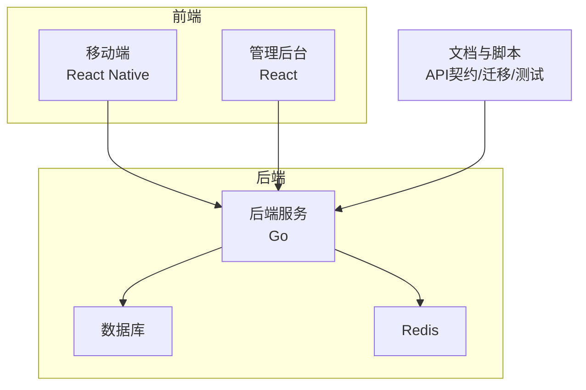
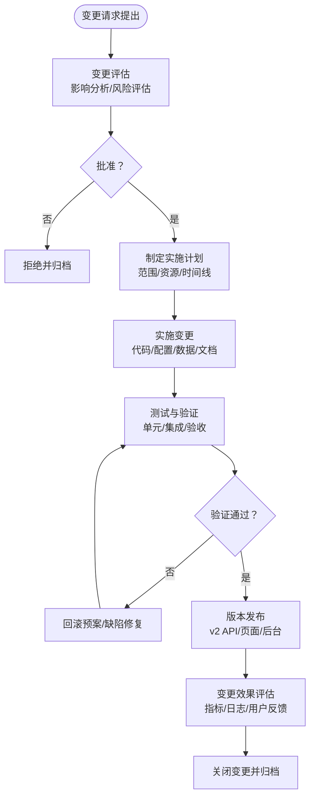
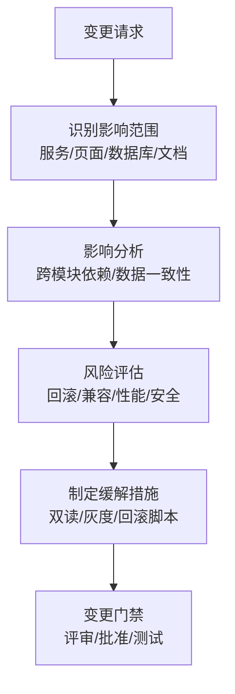
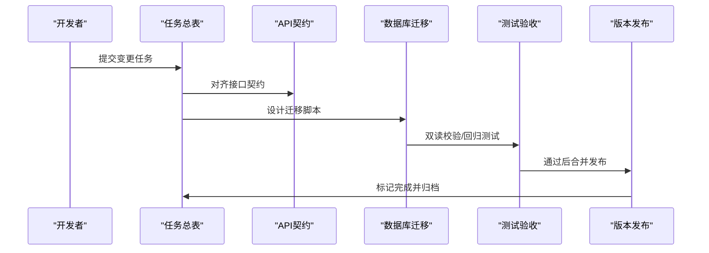
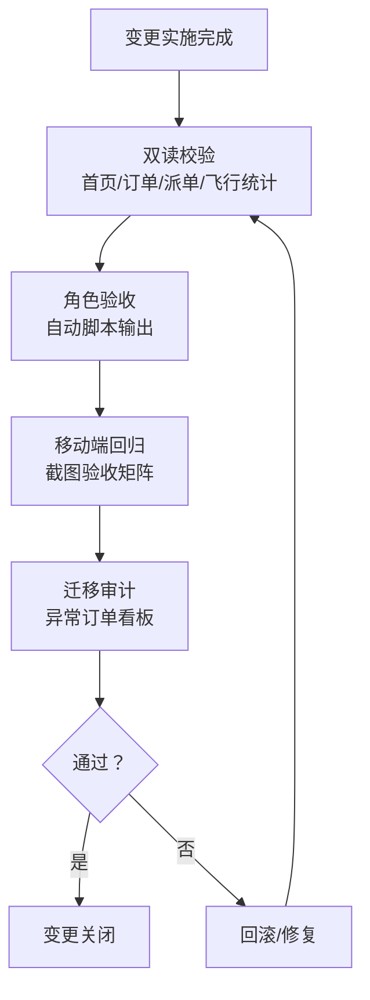
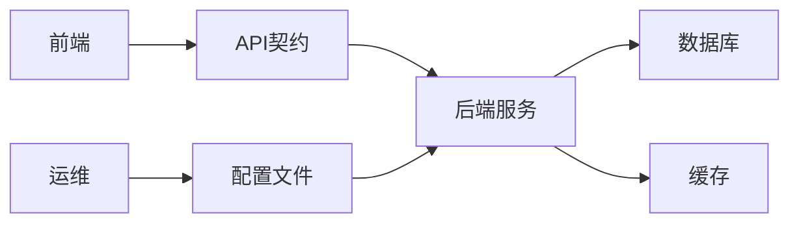

# 变更管理流程

<cite>
**本文档引用的文件**
- [README.md](file://README.md)
- [REFACTOR_MASTER_TASKLIST.md](file://REFACTOR_MASTER_TASKLIST.md)
- [REFACTOR_TASK_TRACKER.md](file://REFACTOR_TASK_TRACKER.md)
- [BUSINESS_API_CONTRACT.md](file://BUSINESS_API_CONTRACT.md)
- [BUSINESS_DATABASE_MIGRATION_PLAN.md](file://BUSINESS_DATABASE_MIGRATION_PLAN.md)
- [TEST_CHECKLIST.md](file://TEST_CHECKLIST.md)
- [MOBILE_REGRESSION_ACCEPTANCE.md](file://MOBILE_REGRESSION_ACCEPTANCE.md)
- [ROLE_ACCEPTANCE_WALKTHROUGH.md](file://ROLE_ACCEPTANCE_WALKTHROUGH.md)
- [DEMO_ACCOUNTS.md](file://DEMO_ACCOUNTS.md)
- [backend/config.yaml](file://backend/config.yaml)
- [backend/docs/openapi-v2.yaml](file://backend/docs/openapi-v2.yaml)
- [backend/docs/PHASE9_MIGRATION_RUNBOOK.md](file://backend/docs/PHASE9_MIGRATION_RUNBOOK.md)
</cite>

## 目录
1. [简介](#简介)
2. [项目结构](#项目结构)
3. [核心组件](#核心组件)
4. [架构总览](#架构总览)
5. [详细组件分析](#详细组件分析)
6. [依赖分析](#依赖分析)
7. [性能考虑](#性能考虑)
8. [故障排除指南](#故障排除指南)
9. [结论](#结论)
10. [附录](#附录)

## 简介
本文件为无人机租赁平台的变更管理流程文档，基于项目现有的重构任务清单、数据库迁移方案、API契约与测试验收文档，构建覆盖“提出—评估—批准—实施—验证”的完整变更管理闭环。文档特别针对功能变更、架构变更、数据变更、配置变更四类变更类型，给出管理要求、影响分析、风险评估与回滚预案；并提供变更记录模板、变更跟踪表格、变更通知机制、变更与版本发布的协调方式、变更对测试的影响、变更对文档的更新要求、紧急变更处理流程与变更效果评估方法。

## 项目结构
项目采用前后端分离与多模块协作的组织方式：
- 后端（Go）：提供 v2 API、领域服务、数据迁移与运维工具
- 移动端（React Native）：承载用户交互与页面对象边界重构
- 管理后台（React）：承载运营与审计看板
- 文档与脚本：提供 API 文档、迁移执行说明、验收脚本与测试清单

图表来源
- [backend/docs/openapi-v2.yaml:1-800](file://backend/docs/openapi-v2.yaml#L1-L800)
- [backend/config.yaml:1-69](file://backend/config.yaml#L1-L69)

章节来源
- [README.md:1-29](file://README.md#L1-L29)
- [backend/docs/openapi-v2.yaml:1-800](file://backend/docs/openapi-v2.yaml#L1-L800)
- [backend/config.yaml:1-69](file://backend/config.yaml#L1-L69)

## 核心组件
- 变更请求与跟踪：基于重构任务总表与任务跟踪表，统一变更状态、影响范围与验收标准
- API契约与版本：v2 API 作为变更实施的统一出口，确保前后端一致性
- 数据库迁移：阶段化迁移与双读校验，保障数据一致性与可回滚
- 测试与验收：角色视角验收、移动端回归、测试清单与自动验收脚本
- 配置与环境：统一配置文件与环境变量，支撑变更的可重复执行

章节来源
- [REFACTOR_MASTER_TASKLIST.md:1-512](file://REFACTOR_MASTER_TASKLIST.md#L1-L512)
- [BUSINESS_API_CONTRACT.md:1-800](file://BUSINESS_API_CONTRACT.md#L1-L800)
- [BUSINESS_DATABASE_MIGRATION_PLAN.md:1-550](file://BUSINESS_DATABASE_MIGRATION_PLAN.md#L1-L550)
- [TEST_CHECKLIST.md:1-448](file://TEST_CHECKLIST.md#L1-L448)

## 架构总览
变更管理流程围绕“任务驱动 + API契约 + 数据迁移 + 测试验收 + 文档更新”的闭环展开，贯穿开发、测试、发布与运维各阶段。

## 详细组件分析

### 变更类型与管理要求
- 功能变更
  - 管理要点：以 API 契约为准，确保前后端一致；变更需覆盖移动端/管理端页面与交互
  - 示例：新增接口、页面重构、交互优化
- 架构变更
  - 管理要点：以数据库迁移方案为准，分阶段执行；实施前后需双读校验
  - 示例：v2 数据模型、服务层重构、路由切换
- 数据变更
  - 管理要点：严格遵循迁移脚本与审计清单；回填与校验并行
  - 示例：历史数据回填、字段补齐、索引/约束变更
- 配置变更
  - 管理要点：统一配置文件与环境变量；变更需通过测试验证
  - 示例：JWT密钥、短信/支付配置、上传大小限制

章节来源
- [BUSINESS_API_CONTRACT.md:1-800](file://BUSINESS_API_CONTRACT.md#L1-L800)
- [BUSINESS_DATABASE_MIGRATION_PLAN.md:1-550](file://BUSINESS_DATABASE_MIGRATION_PLAN.md#L1-L550)
- [backend/config.yaml:1-69](file://backend/config.yaml#L1-L69)

### 变更评估与影响分析
- 影响范围识别：基于任务总表中的“影响范围”字段，明确后端服务、前端页面、数据库与文档
- 风险评估：结合迁移方案中的“风险与回退策略”与“开发测试环境优先”原则
- 依赖关系：关注 v1/v2 并存期的兼容层与冻结策略

图表来源
- [REFACTOR_MASTER_TASKLIST.md:18-27](file://REFACTOR_MASTER_TASKLIST.md#L18-L27)
- [BUSINESS_DATABASE_MIGRATION_PLAN.md:55-87](file://BUSINESS_DATABASE_MIGRATION_PLAN.md#L55-L87)

章节来源
- [REFACTOR_MASTER_TASKLIST.md:18-27](file://REFACTOR_MASTER_TASKLIST.md#L18-L27)
- [BUSINESS_DATABASE_MIGRATION_PLAN.md:55-87](file://BUSINESS_DATABASE_MIGRATION_PLAN.md#L55-L87)

### 变更批准与实施
- 批准流程：任务总表中“状态标记统一使用”与“完成并通过验收标准后才允许勾选”的规则
- 实施策略：分阶段执行（建新表/回填/双读/切流/下线），并行测试与文档更新
- 版本协调：v2 API 作为默认出口，v1 写入冻结，保留只读兼容

图表来源
- [REFACTOR_MASTER_TASKLIST.md:18-27](file://REFACTOR_MASTER_TASKLIST.md#L18-L27)
- [BUSINESS_API_CONTRACT.md:20-30](file://BUSINESS_API_CONTRACT.md#L20-L30)
- [BUSINESS_DATABASE_MIGRATION_PLAN.md:446-484](file://BUSINESS_DATABASE_MIGRATION_PLAN.md#L446-L484)

章节来源
- [REFACTOR_MASTER_TASKLIST.md:18-27](file://REFACTOR_MASTER_TASKLIST.md#L18-L27)
- [BUSINESS_DATABASE_MIGRATION_PLAN.md:446-484](file://BUSINESS_DATABASE_MIGRATION_PLAN.md#L446-L484)

### 变更验证与回滚预案
- 验证方法：双读校验工具、角色视角验收、移动端回归、测试清单
- 回滚策略：数据库快照、结构迁移不适合通用反向SQL、迁移审计清单兜底
- 验收标准：阶段 10 的验收报告与自动验收脚本输出

图表来源
- [backend/docs/PHASE9_MIGRATION_RUNBOOK.md:42-51](file://backend/docs/PHASE9_MIGRATION_RUNBOOK.md#L42-L51)
- [ROLE_ACCEPTANCE_WALKTHROUGH.md:110-127](file://ROLE_ACCEPTANCE_WALKTHROUGH.md#L110-L127)
- [MOBILE_REGRESSION_ACCEPTANCE.md:1-337](file://MOBILE_REGRESSION_ACCEPTANCE.md#L1-L337)

章节来源
- [backend/docs/PHASE9_MIGRATION_RUNBOOK.md:42-51](file://backend/docs/PHASE9_MIGRATION_RUNBOOK.md#L42-L51)
- [ROLE_ACCEPTANCE_WALKTHROUGH.md:110-127](file://ROLE_ACCEPTANCE_WALKTHROUGH.md#L110-L127)
- [MOBILE_REGRESSION_ACCEPTANCE.md:1-337](file://MOBILE_REGRESSION_ACCEPTANCE.md#L1-L337)

### 变更记录模板与跟踪表格
- 变更记录模板（建议字段）
  - 变更编号、变更主题、变更类型、提出人、提出时间、影响范围、风险评估、批准状态、负责人、计划开始/结束时间、实际开始/结束时间、测试结果、回滚状态、备注
- 变更跟踪表格（建议列）
  - 任务编号、任务名称、状态、依赖、影响范围、验收标准、测试结果、完成时间、责任人、备注

章节来源
- [REFACTOR_MASTER_TASKLIST.md:18-27](file://REFACTOR_MASTER_TASKLIST.md#L18-L27)
- [REFACTOR_TASK_TRACKER.md:1-800](file://REFACTOR_TASK_TRACKER.md#L1-L800)

### 变更通知机制
- 通知渠道：管理后台运营看板、系统通知、邮件/IM（按项目配置）
- 通知内容：变更主题、影响范围、时间窗、回滚预案、责任人
- 通知频率：变更门禁评审、实施前、验证中、发布后、回滚后

章节来源
- [BUSINESS_DATABASE_MIGRATION_PLAN.md:446-484](file://BUSINESS_DATABASE_MIGRATION_PLAN.md#L446-L484)

### 变更与版本发布的协调
- 发布策略：v2 API 作为默认出口，v1 写入冻结，保留只读兼容
- 发布顺序：移动端 → 管理后台 → 冻结 v1 写入
- 发布门禁：双读校验通过、角色验收通过、移动端回归通过、迁移审计无阻断

章节来源
- [BUSINESS_API_CONTRACT.md:20-30](file://BUSINESS_API_CONTRACT.md#L20-L30)
- [BUSINESS_DATABASE_MIGRATION_PLAN.md:446-484](file://BUSINESS_DATABASE_MIGRATION_PLAN.md#L446-L484)

### 变更对测试的影响
- 测试覆盖：单元测试、服务层测试、集成测试、移动端回归、角色验收
- 测试执行：自动验收脚本、手动回归清单、截图验收矩阵
- 测试基线：阶段 10 的验收报告与测试清单

章节来源
- [TEST_CHECKLIST.md:1-448](file://TEST_CHECKLIST.md#L1-L448)
- [MOBILE_REGRESSION_ACCEPTANCE.md:1-337](file://MOBILE_REGRESSION_ACCEPTANCE.md#L1-L337)
- [ROLE_ACCEPTANCE_WALKTHROUGH.md:110-127](file://ROLE_ACCEPTANCE_WALKTHROUGH.md#L110-L127)

### 变更对文档的更新要求
- 文档同步：API契约、数据库迁移方案、测试清单、演示账号说明
- 更新策略：变更完成后同步更新被影响文档，确保与实现一致

章节来源
- [BUSINESS_API_CONTRACT.md:1-800](file://BUSINESS_API_CONTRACT.md#L1-L800)
- [BUSINESS_DATABASE_MIGRATION_PLAN.md:1-550](file://BUSINESS_DATABASE_MIGRATION_PLAN.md#L1-L550)
- [DEMO_ACCOUNTS.md:1-116](file://DEMO_ACCOUNTS.md#L1-L116)

### 紧急变更处理流程
- 适用场景：生产故障修复、安全补丁、合规要求
- 处理原则：最小化影响、快速回滚、快速验证、事后复盘
- 执行步骤：紧急评审 → 快速方案 → 代码冻结 → 快速测试 → 紧急发布 → 回滚预案 → 监控与复盘

章节来源
- [backend/docs/PHASE9_MIGRATION_RUNBOOK.md:52-71](file://backend/docs/PHASE9_MIGRATION_RUNBOOK.md#L52-L71)

### 变更效果评估方法
- 评估指标：页面一致性、状态一致性、编号一致性、对象边界一致性
- 评估工具：双读校验、角色验收脚本、移动端回归截图、迁移审计看板
- 评估周期：变更发布后 72 小时内进行初步评估，1 周内完成总结报告

章节来源
- [MOBILE_REGRESSION_ACCEPTANCE.md:262-271](file://MOBILE_REGRESSION_ACCEPTANCE.md#L262-L271)
- [ROLE_ACCEPTANCE_WALKTHROUGH.md:187-217](file://ROLE_ACCEPTANCE_WALKTHROUGH.md#L187-L217)
- [backend/docs/PHASE9_MIGRATION_RUNBOOK.md:91-96](file://backend/docs/PHASE9_MIGRATION_RUNBOOK.md#L91-L96)

## 依赖分析
- 后端服务依赖数据库与缓存，变更需关注连接池、超时与一致性
- 前端依赖后端 API，变更需关注契约一致性与兼容层
- 运维依赖配置文件与环境变量，变更需关注配置验证与回滚

图表来源
- [backend/docs/openapi-v2.yaml:1-800](file://backend/docs/openapi-v2.yaml#L1-L800)
- [backend/config.yaml:1-69](file://backend/config.yaml#L1-L69)

章节来源
- [backend/docs/openapi-v2.yaml:1-800](file://backend/docs/openapi-v2.yaml#L1-L800)
- [backend/config.yaml:1-69](file://backend/config.yaml#L1-L69)

## 性能考虑
- 变更对性能的影响需在评估阶段量化，包括数据库查询、缓存命中、接口延迟
- 迁移阶段需避免热点数据写入高峰，采用分批回填与索引优化
- 发布后持续监控关键指标，及时发现性能回归

## 故障排除指南
- 常见问题：验证码发送失败、登录后页面空白、接口 401、数据库连接失败
- 排查步骤：检查服务状态、Redis/MySQL 容器、配置文件、Token 有效性
- 参考文档：测试清单中的常见问题排查章节

章节来源
- [TEST_CHECKLIST.md:431-448](file://TEST_CHECKLIST.md#L431-L448)

## 结论
本变更管理流程以任务驱动为核心，依托 API 契约、数据库迁移方案与测试验收体系，确保变更的可控、可追溯与可回滚。通过阶段化执行与双读校验，降低变更风险；通过角色验收与移动端回归，保障用户体验一致性；通过文档同步与配置管理，维持系统稳定性。

## 附录
- 变更记录模板（字段建议）
  - 变更编号、变更主题、变更类型、提出人、提出时间、影响范围、风险评估、批准状态、负责人、计划开始/结束时间、实际开始/结束时间、测试结果、回滚状态、备注
- 变更跟踪表格（列建议）
  - 任务编号、任务名称、状态、依赖、影响范围、验收标准、测试结果、完成时间、责任人、备注
- 变更通知模板（内容建议）
  - 变更主题、影响范围、时间窗、回滚预案、责任人、联系方式