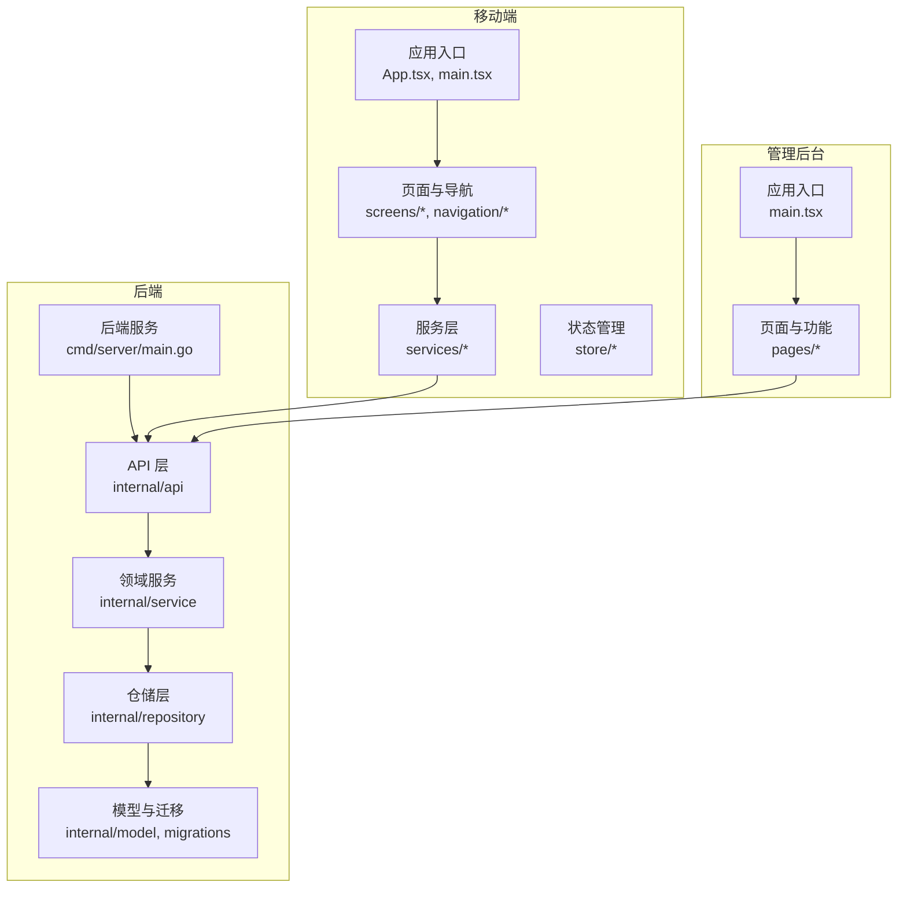
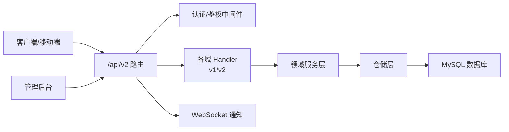
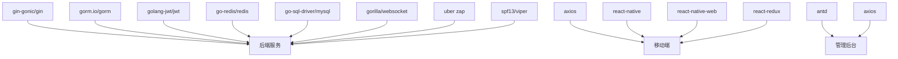

# 开发实施流程

<cite>
**本文引用的文件**
- [README.md](file://README.md)
- [REFACTOR_MASTER_TASKLIST.md](file://REFACTOR_MASTER_TASKLIST.md)
- [REFACTOR_TASK_TRACKER.md](file://REFACTOR_TASK_TRACKER.md)
- [BUSINESS_API_CONTRACT.md](file://BUSINESS_API_CONTRACT.md)
- [BUSINESS_DATABASE_MIGRATION_PLAN.md](file://BUSINESS_DATABASE_MIGRATION_PLAN.md)
- [TEST_CHECKLIST.md](file://TEST_CHECKLIST.md)
- [MOBILE_REGRESSION_ACCEPTANCE.md](file://MOBILE_REGRESSION_ACCEPTANCE.md)
- [ROLE_ACCEPTANCE_WALKTHROUGH.md](file://ROLE_ACCEPTANCE_WALKTHROUGH.md)
- [DEMO_ACCOUNTS.md](file://DEMO_ACCOUNTS.md)
- [backend/go.mod](file://backend/go.mod)
- [backend/config.example.yaml](file://backend/config.example.yaml)
- [mobile/package.json](file://mobile/package.json)
- [admin/package.json](file://admin/package.json)
- [mobile/.eslintrc.js](file://mobile/.eslintrc.js)
- [mobile/.prettierrc.js](file://mobile/.prettierrc.js)
</cite>

## 目录
1. [引言](#引言)
2. [项目结构](#项目结构)
3. [核心组件](#核心组件)
4. [架构总览](#架构总览)
5. [详细组件分析](#详细组件分析)
6. [依赖分析](#依赖分析)
7. [性能考虑](#性能考虑)
8. [故障排查指南](#故障排查指南)
9. [结论](#结论)
10. [附录](#附录)

## 引言
本文件面向无人机租赁平台的重构与迭代开发，系统化梳理开发任务分配、编码规范、代码审查、单元测试与集成测试流程，明确开发环境配置、分支管理策略与代码合并流程，给出后端服务重构、前端页面重构与数据库迁移的实施步骤，并提供开发工具使用指南、调试技巧与性能优化建议，以及问题处理机制与进度跟踪方法。

## 项目结构
项目采用前后端分离与多端并行的组织方式：
- 后端（Go）：位于 backend/，包含服务端主程序、API 路由、领域服务、仓库层、模型与迁移脚本。
- 移动端（React Native）：位于 mobile/，包含页面、服务层、导航、Redux 状态、主题与工具。
- 管理后台（React）：位于 admin/，包含运营与管理页面。
- 文档与脚本：根目录包含业务契约、迁移方案、测试清单、演示账号与验收文档，以及迁移脚本与工作流。

图表来源
- [backend/cmd/server/main.go](file://backend/cmd/server/main.go)
- [backend/internal/api/router.go](file://backend/internal/api/router.go)
- [backend/internal/service/](file://backend/internal/service/)
- [backend/internal/repository/](file://backend/internal/repository/)
- [backend/internal/model/models.go](file://backend/internal/model/models.go)
- [mobile/src/App.tsx](file://mobile/src/App.tsx)
- [admin/src/App.tsx](file://admin/src/App.tsx)

章节来源
- [README.md:1-29](file://README.md#L1-L29)

## 核心组件
- 重构总任务清单与执行基线：提供阶段划分、任务编号、验收标准与完成标记，作为开发与验收的唯一执行清单。
- 业务契约与 API v2：统一响应结构、分页、DTO、版本策略与接口契约，指导前后端协作。
- 数据库迁移方案：定义目标模型、分层关系、映射规则与迁移阶段，确保历史数据安全回填与新旧并行。
- 测试与验收：阶段 10 的自动验收脚本、移动端回归清单与截图验收标准，确保主链路稳定。
- 开发环境与配置：后端配置模板、依赖清单与前端工程配置，支撑本地与 CI 环境。

章节来源
- [REFACTOR_MASTER_TASKLIST.md:1-512](file://REFACTOR_MASTER_TASKLIST.md#L1-L512)
- [BUSINESS_API_CONTRACT.md:1-1122](file://BUSINESS_API_CONTRACT.md#L1-L1122)
- [BUSINESS_DATABASE_MIGRATION_PLAN.md:1-550](file://BUSINESS_DATABASE_MIGRATION_PLAN.md#L1-L550)
- [TEST_CHECKLIST.md:1-448](file://TEST_CHECKLIST.md#L1-L448)
- [MOBILE_REGRESSION_ACCEPTANCE.md:1-337](file://MOBILE_REGRESSION_ACCEPTANCE.md#L1-L337)
- [ROLE_ACCEPTANCE_WALKTHROUGH.md:1-217](file://ROLE_ACCEPTANCE_WALKTHROUGH.md#L1-L217)
- [DEMO_ACCOUNTS.md:1-116](file://DEMO_ACCOUNTS.md#L1-L116)

## 架构总览
系统围绕“v2 业务模型”展开，后端提供统一的 v2 API，移动端与管理后台按角色与职责调用相应接口，数据库通过迁移脚本与双读校验保障一致性。

图表来源
- [BUSINESS_API_CONTRACT.md:20-49](file://BUSINESS_API_CONTRACT.md#L20-L49)
- [backend/internal/api/middleware/auth.go](file://backend/internal/api/middleware/auth.go)
- [backend/internal/api/v1/router.go](file://backend/internal/api/v1/router.go)
- [backend/internal/api/v2/router.go](file://backend/internal/api/v2/router.go)
- [backend/internal/service/](file://backend/internal/service/)
- [backend/internal/repository/](file://backend/internal/repository/)
- [backend/internal/websocket/hub.go](file://backend/internal/websocket/hub.go)

## 详细组件分析

### 1. 开发任务分配与进度跟踪
- 任务来源：以“重构总任务清单”为唯一来源，按阶段与任务编号推进。
- 任务状态：统一使用“[ ] 未开始 / [x] 已完成”，完成即勾选并同步更新被影响文档与接口文档。
- 执行顺序：建议先完成阶段 1/2（模型与状态机），再完成阶段 3（v2 API），随后按页面域分批切移动端，后台管理在阶段 8，最后阶段 9/10 完成数据切流与回归验收。
- 进度可视化：结合“重构任务跟踪”与“阶段 10 验收文档”，持续更新通过项与产物编号。

章节来源
- [REFACTOR_MASTER_TASKLIST.md:18-27](file://REFACTOR_MASTER_TASKLIST.md#L18-L27)
- [REFACTOR_MASTER_TASKLIST.md:497-504](file://REFACTOR_MASTER_TASKLIST.md#L497-L504)
- [REFACTOR_TASK_TRACKER.md:1-800](file://REFACTOR_TASK_TRACKER.md#L1-L800)
- [ROLE_ACCEPTANCE_WALKTHROUGH.md:110-217](file://ROLE_ACCEPTANCE_WALKTHROUGH.md#L110-L217)

### 2. 编码规范与代码风格
- ESLint 与 Prettier：移动端工程已配置 ESLint 与 Prettier，统一代码风格与格式。
- 规范要点：箭头函数括号省略、单引号、尾逗号等约定，确保跨平台一致性。

章节来源
- [mobile/.eslintrc.js:1-5](file://mobile/.eslintrc.js#L1-L5)
- [mobile/.prettierrc.js:1-6](file://mobile/.prettierrc.js#L1-L6)

### 3. 代码审查流程
- 审查范围：后端服务层、仓储层、API 路由与中间件；移动端页面、服务层与状态管理；管理后台页面与路由。
- 审查要点：接口契约一致性、DTO 与响应结构、分页与错误码、状态机与来源追溯、迁移脚本幂等与回滚能力。
- 审查工具：结合 ESLint、单元测试覆盖率与集成测试报告，确保质量门禁。

章节来源
- [BUSINESS_API_CONTRACT.md:37-99](file://BUSINESS_API_CONTRACT.md#L37-L99)
- [TEST_CHECKLIST.md:369-413](file://TEST_CHECKLIST.md#L369-L413)

### 4. 单元测试与集成测试
- 单元测试：后端服务层与仓储层测试，覆盖关键流程（需求转单、直达下单、派单重派、飞行统计、退款）。
- 集成测试：移动端关键页面回归清单与截图验收标准，确保对象边界、角色入口、状态与编号一致性。
- 阶段 10 验收：自动验收脚本与报告，覆盖四类角色主链路与产物编号校验。

章节来源
- [REFACTOR_MASTER_TASKLIST.md:473-477](file://REFACTOR_MASTER_TASKLIST.md#L473-L477)
- [MOBILE_REGRESSION_ACCEPTANCE.md:47-337](file://MOBILE_REGRESSION_ACCEPTANCE.md#L47-L337)
- [TEST_CHECKLIST.md:1-448](file://TEST_CHECKLIST.md#L1-L448)
- [ROLE_ACCEPTANCE_WALKTHROUGH.md:110-217](file://ROLE_ACCEPTANCE_WALKTHROUGH.md#L110-L217)

### 5. 开发环境配置
- 后端配置：提供 config.example.yaml，包含服务器、数据库、Redis、JWT、短信、支付、地图、WebSocket、日志、CORS、推送与 OAuth 等配置项。
- 前端工程：移动端与管理后台分别提供 package.json，包含依赖与脚本，支持本地开发、构建与预览。
- 启动顺序：后端服务 → 移动端预览 → 管理后台。

章节来源
- [backend/config.example.yaml:1-338](file://backend/config.example.yaml#L1-L338)
- [mobile/package.json:1-64](file://mobile/package.json#L1-L64)
- [admin/package.json:1-33](file://admin/package.json#L1-L33)
- [TEST_CHECKLIST.md:42-61](file://TEST_CHECKLIST.md#L42-L61)

### 6. 分支管理策略与代码合并
- 分支策略：建议采用 feature/任务编号/功能名 的命名，合并前需通过代码审查与测试。
- 合并流程：创建 Pull Request → 代码审查 → 自动化测试通过 → 合并到 develop → 预发布分支 → stage 验收 → main 合并。
- 迁移脚本：高位编号脚本（如 901/911）与开发期脚本分离，确保可重复执行与幂等。

章节来源
- [BUSINESS_DATABASE_MIGRATION_PLAN.md:486-505](file://BUSINESS_DATABASE_MIGRATION_PLAN.md#L486-L505)

### 7. 后端服务重构实施步骤
- 领域模型与状态机：锁定 v2 模型与状态机（阶段 1/2），确保撮合层与履约层彻底分层。
- API v2 实现：建立路由骨架、统一响应结构、错误码与分页中间件（阶段 3），按角色域落地接口。
- 服务层重构：账号与初始化、客户域、机主域、飞手域、撮合、订单、派单、飞行、通知与事件服务。
- 双读校验与切流：关键页面对比 v1/v2 结果，先切移动端到 v2，再切后台，最后冻结 v1 写入（阶段 9）。

章节来源
- [REFACTOR_MASTER_TASKLIST.md:111-166](file://REFACTOR_MASTER_TASKLIST.md#L111-L166)
- [REFACTOR_MASTER_TASKLIST.md:223-272](file://REFACTOR_MASTER_TASKLIST.md#L223-L272)
- [REFACTOR_MASTER_TASKLIST.md:439-470](file://REFACTOR_MASTER_TASKLIST.md#L439-L470)
- [BUSINESS_DATABASE_MIGRATION_PLAN.md:398-485](file://BUSINESS_DATABASE_MIGRATION_PLAN.md#L398-L485)

### 8. 前端页面重构实施步骤
- 移动端基础重构：接入 RoleSummary 与 v2 API 客户端，统一状态徽标、来源标签与卡片组件（阶段 4）。
- 市场域重构：首页驾驶舱、供给市场、需求市场、我的需求/报价/供给、供给发布与编辑流程（阶段 5）。
- 履约域重构：订单列表/详情、直达下单待确认、正式派单列表/详情、飞行监控与飞行记录、支付/退款/评价与售后（阶段 6）。
- 我的页与档案重构：我的首页、客户/机主/飞手档案、绑定飞手管理、系统通知与会话消息（阶段 7）。
- 管理后台适配：后台对新角色模型的适配与运营看板（阶段 8）。

章节来源
- [REFACTOR_MASTER_TASKLIST.md:273-438](file://REFACTOR_MASTER_TASKLIST.md#L273-L438)
- [MOBILE_REGRESSION_ACCEPTANCE.md:47-337](file://MOBILE_REGRESSION_ACCEPTANCE.md#L47-L337)

### 9. 数据库迁移具体操作
- 目标模型：账号与身份、设备与供给、撮合、履约、财务与争议分层清晰。
- 映射规则：用户、需求、订单、派单、飞行记录与财务/争议的映射与回填策略。
- 迁移阶段：建新表（不切流）→ 批量回填 → 双读校验 → 新接口切到 v2 → 前端切到新页面 → 下线旧依赖。
- 平台边界：重载准入字段与校验规则在迁移期落地，不符合平台范围的历史数据进入审计清单。

章节来源
- [BUSINESS_DATABASE_MIGRATION_PLAN.md:89-187](file://BUSINESS_DATABASE_MIGRATION_PLAN.md#L89-L187)
- [BUSINESS_DATABASE_MIGRATION_PLAN.md:188-397](file://BUSINESS_DATABASE_MIGRATION_PLAN.md#L188-L397)
- [BUSINESS_DATABASE_MIGRATION_PLAN.md:398-550](file://BUSINESS_DATABASE_MIGRATION_PLAN.md#L398-L550)

### 10. 开发工具使用指南与调试技巧
- 后端：使用 go run 启动服务，配合 curl 或 Postman 测试 API；通过 Redis 查看验证码；日志级别与输出方式可配置。
- 移动端：npm run dev 启动 Web 预览，使用截图验收标准进行回归；ESLint 与 Prettier 保障代码质量。
- 管理后台：npm run dev 启动开发服务器，访问 http://localhost:3000。

章节来源
- [TEST_CHECKLIST.md:42-61](file://TEST_CHECKLIST.md#L42-L61)
- [mobile/package.json:5-13](file://mobile/package.json#L5-L13)
- [admin/package.json:5-9](file://admin/package.json#L5-L9)

### 11. 性能优化建议
- 后端：合理设置数据库连接池、启用慢查询日志、使用索引优化高频查询；WebSocket 心跳与消息大小限制。
- 前端：按需加载、组件懒加载、图片压缩与缓存；移动端 Web 预览构建产物体积优化。
- 迁移：分阶段回填与双读校验，避免一次性大冲击；高位编号脚本确保幂等与可回滚。

章节来源
- [backend/config.example.yaml:52-57](file://backend/config.example.yaml#L52-L57)
- [backend/config.example.yaml:234-247](file://backend/config.example.yaml#L234-L247)
- [MOBILE_REGRESSION_ACCEPTANCE.md:31-33](file://MOBILE_REGRESSION_ACCEPTANCE.md#L31-L33)

### 12. 问题处理机制与进度跟踪
- 问题分级：按影响面与紧急程度分级，优先处理阻塞性问题。
- 处理流程：问题登记 → 分析定位 → 制定方案 → 实施修复 → 回归验证 → 关闭问题。
- 进度跟踪：每日站会同步任务进展，里程碑评审验收，阶段 10 自动验收报告作为最终验收依据。

章节来源
- [REFACTOR_MASTER_TASKLIST.md:18-27](file://REFACTOR_MASTER_TASKLIST.md#L18-L27)
- [ROLE_ACCEPTANCE_WALKTHROUGH.md:110-217](file://ROLE_ACCEPTANCE_WALKTHROUGH.md#L110-L217)

## 依赖分析
后端依赖主要集中在 Gin、GORM、JWT、Redis、MySQL、WebSocket、Zap 日志与配置管理等模块；移动端与管理后台依赖 React、React Navigation、Ant Design、Axios、Redux Toolkit 等生态组件。

图表来源
- [backend/go.mod:5-21](file://backend/go.mod#L5-L21)
- [mobile/package.json:14-35](file://mobile/package.json#L14-L35)
- [admin/package.json:14-24](file://admin/package.json#L14-L24)

章节来源
- [backend/go.mod:1-80](file://backend/go.mod#L1-L80)
- [mobile/package.json:1-64](file://mobile/package.json#L1-L64)
- [admin/package.json:1-33](file://admin/package.json#L1-L33)

## 性能考虑
- 数据库层面：连接池参数与慢查询优化、索引设计与分区策略（按需）。
- 接口层面：分页与过滤、缓存热点数据、批量查询与去重。
- 前端层面：组件懒加载、图片与资源压缩、减少不必要的重渲染。
- 迁移层面：分阶段回填与双读校验，避免一次性大冲击。

## 故障排查指南
- 后端常见问题：验证码无法发送、登录 401、数据库连接失败；检查服务状态、Redis 与配置文件。
- 移动端常见问题：页面空白、接口返回异常；检查 API 地址、网络与控制台错误。
- 管理后台常见问题：页面无法加载、权限不足；检查路由与权限配置。

章节来源
- [TEST_CHECKLIST.md:431-448](file://TEST_CHECKLIST.md#L431-L448)

## 结论
本开发实施流程以“重构总任务清单”为核心，结合“业务契约与 API v2”“数据库迁移方案”“测试与验收”与“开发环境配置”，形成从任务分配、编码规范、代码审查、单元测试与集成测试，到后端服务与前端页面重构、数据库迁移与切流的完整闭环。通过阶段化推进与阶段 10 自动验收，确保系统稳定性与可演进性。

## 附录
- 演示账号与角色摘要：用于联调、演示与验收，角色能力以 /api/v2/me 返回为准。
- 验收脚本与报告：阶段 10 自动验收脚本与报告文件，作为最终验收依据。

章节来源
- [DEMO_ACCOUNTS.md:1-116](file://DEMO_ACCOUNTS.md#L1-L116)
- [ROLE_ACCEPTANCE_WALKTHROUGH.md:110-217](file://ROLE_ACCEPTANCE_WALKTHROUGH.md#L110-L217)