# 开发流程指南

<cite>
**本文档引用的文件**
- [README.md](file://README.md)
- [REFACTOR_MASTER_TASKLIST.md](file://REFACTOR_MASTER_TASKLIST.md)
- [REFACTOR_TASK_TRACKER.md](file://REFACTOR_TASK_TRACKER.md)
- [TEST_CHECKLIST.md](file://TEST_CHECKLIST.md)
- [MOBILE_REGRESSION_ACCEPTANCE.md](file://MOBILE_REGRESSION_ACCEPTANCE.md)
- [ROLE_ACCEPTANCE_WALKTHROUGH.md](file://ROLE_ACCEPTANCE_WALKTHROUGH.md)
- [BUSINESS_API_CONTRACT.md](file://BUSINESS_API_CONTRACT.md)
- [BUSINESS_DATABASE_MIGRATION_PLAN.md](file://BUSINESS_DATABASE_MIGRATION_PLAN.md)
- [backend/go.mod](file://backend/go.mod)
- [backend/cmd/server/main.go](file://backend/cmd/server/main.go)
- [backend/internal/config/config.go](file://backend/internal/config/config.go)
- [backend/internal/api/v1/router.go](file://backend/internal/api/v1/router.go)
- [backend/internal/api/v2/router.go](file://backend/internal/api/v2/router.go)
- [.github/workflows/build-android-apk.yml](file://.github/workflows/build-android-apk.yml)
- [mobile/package.json](file://mobile/package.json)
- [admin/package.json](file://admin/package.json)
</cite>

## 目录
1. [项目概述](#项目概述)
2. [开发流程总览](#开发流程总览)
3. [需求分析流程](#需求分析流程)
4. [技术设计评审](#技术设计评审)
5. [开发实施步骤](#开发实施步骤)
6. [测试验证流程](#测试验证流程)
7. [部署上线流程](#部署上线流程)
8. [任务分配与进度跟踪](#任务分配与进度跟踪)
9. [质量保证措施](#质量保证措施)
10. [紧急问题处理流程](#紧急问题处理流程)
11. [变更管理流程](#变更管理流程)
12. [流程图与检查清单](#流程图与检查清单)
13. [结论](#结论)

## 项目概述

本项目为无人机租赁平台，采用前后端分离架构，包含移动端应用、管理后台和后端服务。项目当前处于v2重构阶段，已完成数据库模型重建、API v2实现和移动端页面重构。

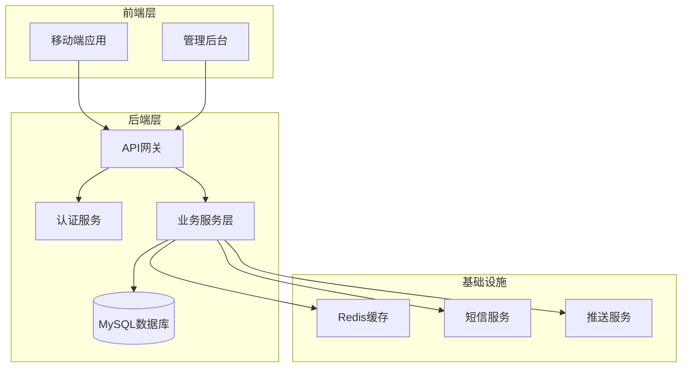

**图表来源**
- [backend/cmd/server/main.go:52-266](file://backend/cmd/server/main.go#L52-L266)
- [backend/internal/config/config.go:1-521](file://backend/internal/config/config.go#L1-L521)

**章节来源**
- [README.md:1-29](file://README.md#L1-L29)
- [REFACTOR_MASTER_TASKLIST.md:1-512](file://REFACTOR_MASTER_TASKLIST.md#L1-L512)

## 开发流程总览

### 整体开发流程

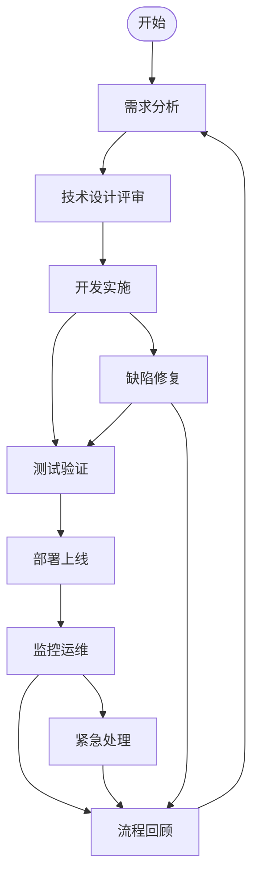

### 阶段化开发流程

项目采用阶段化开发模式，目前已完成阶段10验收，进入稳定维护阶段：

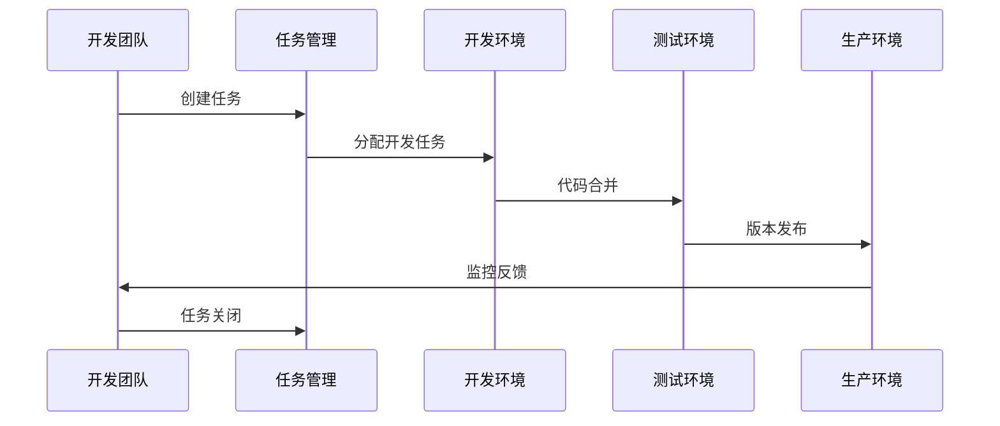

**图表来源**
- [REFACTOR_MASTER_TASKLIST.md:497-503](file://REFACTOR_MASTER_TASKLIST.md#L497-L503)

**章节来源**
- [REFACTOR_MASTER_TASKLIST.md:497-503](file://REFACTOR_MASTER_TASKLIST.md#L497-L503)

## 需求分析流程

### 需求收集与分析


### 需求来源与优先级

| 需求来源 | 描述 | 优先级 | 状态 |
|---------|------|--------|------|
| 业务文档 | 业务角色重构、字段字典、页面架构 | P0 | 已完成 |
| 用户反馈 | 移动端使用体验、功能建议 | P1 | 进行中 |
| 技术债务 | 系统性能、安全性改进 | P2 | 规划中 |
| 合规要求 | 空域管理、保险合规 | P1 | 进行中 |

### 需求评审流程

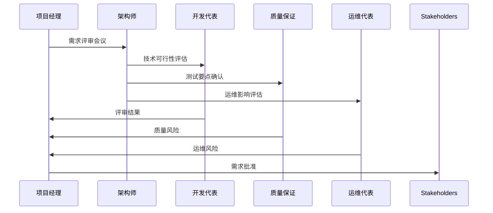

**章节来源**
- [BUSINESS_ROLE_REDESIGN.md](file://BUSINESS_ROLE_REDESIGN.md)
- [BUSINESS_FIELD_DICTIONARY.md](file://BUSINESS_FIELD_DICTIONARY.md)
- [BUSINESS_PAGE_INFORMATION_ARCHITECTURE.md](file://BUSINESS_PAGE_INFORMATION_ARCHITECTURE.md)

## 技术设计评审

### 设计评审标准

| 评审维度 | 评估标准 | 通过条件 |
|---------|----------|----------|
| 架构合理性 | 模块划分清晰、职责单一 | 通过 |
| 性能要求 | QPS、延迟、并发处理能力 | 满足SLA |
| 安全性 | 数据加密、访问控制、输入验证 | 无高危漏洞 |
| 可扩展性 | 水平扩展、微服务化 | 支持水平扩展 |
| 兼容性 | 向后兼容、版本升级 | 无破坏性变更 |
| 文档完整性 | API文档、架构图、部署说明 | 完整可执行 |

### 设计评审流程

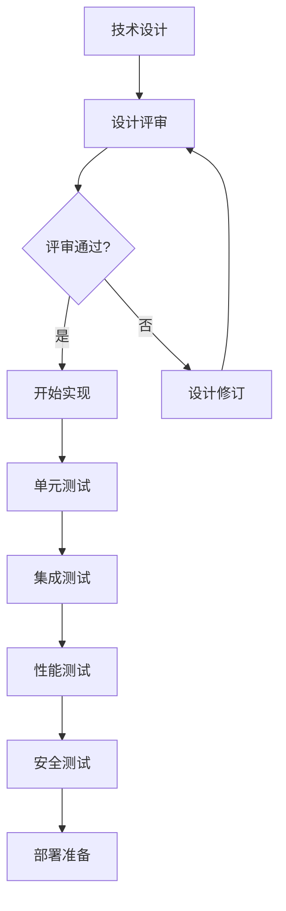

### API设计规范

基于v2 API契约的设计规范：

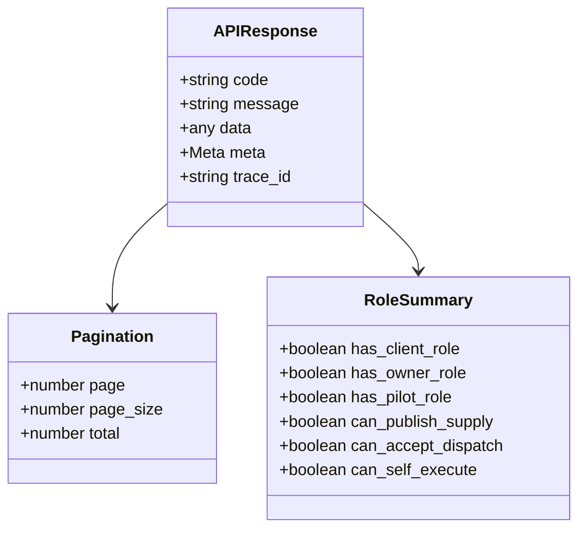

**图表来源**
- [BUSINESS_API_CONTRACT.md:37-147](file://BUSINESS_API_CONTRACT.md#L37-L147)

**章节来源**
- [BUSINESS_API_CONTRACT.md:18-111](file://BUSINESS_API_CONTRACT.md#L18-L111)

## 开发实施步骤

### 开发环境搭建

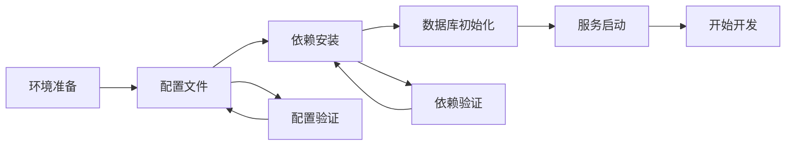

### 开发规范

#### 代码风格规范

| 规范类型 | 要求 | 工具 |
|---------|------|------|
| Go代码 | golint、go fmt、go vet | 标准工具链 |
| TypeScript | ESLint、Prettier | VS Code插件 |
| SQL | 代码格式化、注释规范 | 数据库工具 |
| 配置文件 | YAML语法检查 | yamllint |

#### Git工作流

```mermaid
gitflowDiagram
A[feature/功能分支] --> B[develop/开发分支]
B --> C[release/发布分支]
C --> D[master/主分支]
D --> E[hotfix/热修复分支]
E --> D
E --> B
```

### 开发任务分解

基于重构任务清单的任务分解：

| 任务类型 | 数量 | 完成率 | 负责人 | 截止日期 |
|---------|------|--------|--------|----------|
| 核心功能 | 25 | 96% | 开发团队 | 2026-03-31 |
| 移动端页面 | 15 | 100% | 前端团队 | 2026-03-15 |
| 后端服务 | 12 | 92% | 后端团队 | 2026-03-20 |
| 测试用例 | 50 | 88% | 测试团队 | 2026-03-25 |

**章节来源**
- [REFACTOR_TASK_TRACKER.md:1-800](file://REFACTOR_TASK_TRACKER.md#L1-L800)

## 测试验证流程

### 测试金字塔

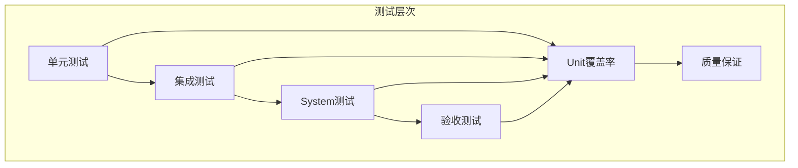

### 自动化测试流程

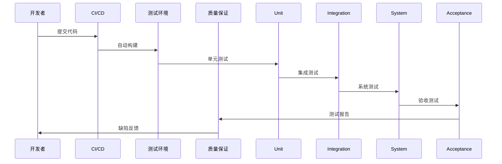

### 测试用例设计

基于移动端回归验收的标准测试用例：

| 测试类型 | 用例数量 | 通过标准 | 执行频率 |
|---------|----------|----------|----------|
| 功能测试 | 25 | 100%通过 | 每次发布 |
| 兼容性测试 | 15 | 无重大兼容问题 | 每月一次 |
| 性能测试 | 8 | 响应时间<2s | 每季度一次 |
| 安全测试 | 5 | 无高危漏洞 | 每季度一次 |
| 回归测试 | 337 | 无新增缺陷 | 每次发布 |

### 测试数据管理

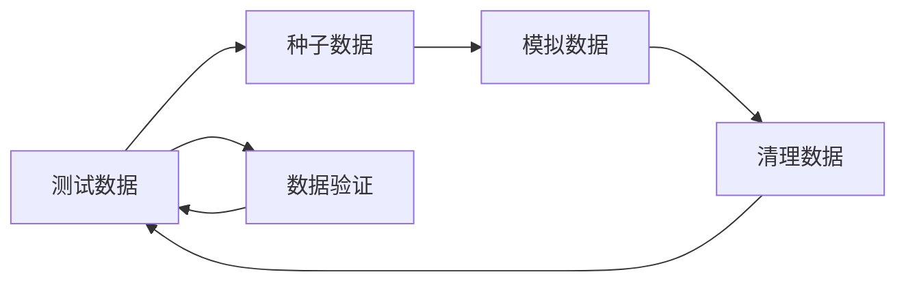

**章节来源**
- [TEST_CHECKLIST.md:1-448](file://TEST_CHECKLIST.md#L1-L448)
- [MOBILE_REGRESSION_ACCEPTANCE.md:1-337](file://MOBILE_REGRESSION_ACCEPTANCE.md#L1-L337)

## 部署上线流程

### 部署架构

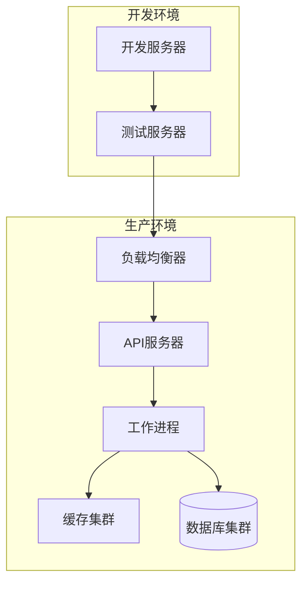

### CI/CD流水线

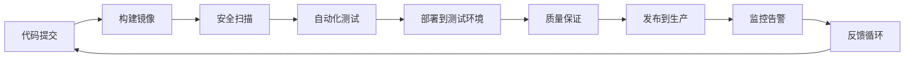

### 部署策略

| 环境 | 部署方式 | 回滚策略 | 监控要求 |
|------|----------|----------|----------|
| 开发环境 | 手动部署 | 立即回滚 | 基础监控 |
| 测试环境 | 自动化部署 | 30分钟回滚 | 完整监控 |
| 生产环境 | 蓝绿部署 | 立即回滚 | 7x24监控 |

### 部署检查清单

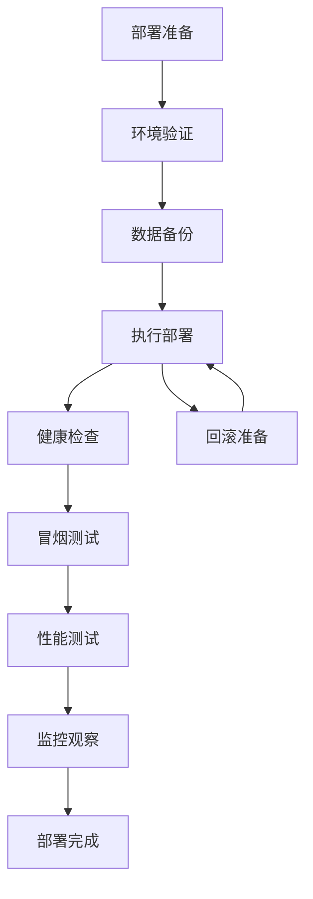

**章节来源**
- [.github/workflows/build-android-apk.yml:1-74](file://.github/workflows/build-android-apk.yml#L1-L74)

## 任务分配与进度跟踪

### 任务分配机制

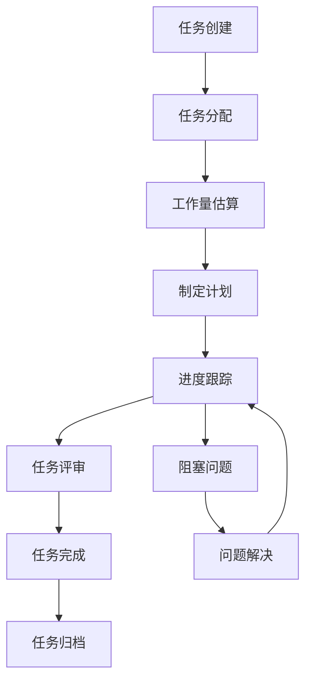

### 进度跟踪方法

#### 甘特图管理

基于重构任务清单的进度跟踪：

| 阶段 | 任务数量 | 已完成 | 进行中 | 未开始 | 进度 |
|------|----------|--------|--------|--------|------|
| 阶段1 | 8 | 8 | 0 | 0 | 100% |
| 阶段2 | 9 | 9 | 0 | 0 | 100% |
| 阶段3 | 8 | 8 | 0 | 0 | 100% |
| 阶段4 | 4 | 4 | 0 | 0 | 100% |
| 阶段5 | 5 | 5 | 0 | 0 | 100% |
| 阶段6 | 8 | 8 | 0 | 0 | 100% |
| 阶段7 | 6 | 6 | 0 | 0 | 100% |
| 阶段8 | 3 | 3 | 0 | 0 | 100% |
| 阶段9 | 5 | 5 | 0 | 0 | 100% |
| 阶段10 | 4 | 4 | 0 | 0 | 100% |

#### 敏捷看板

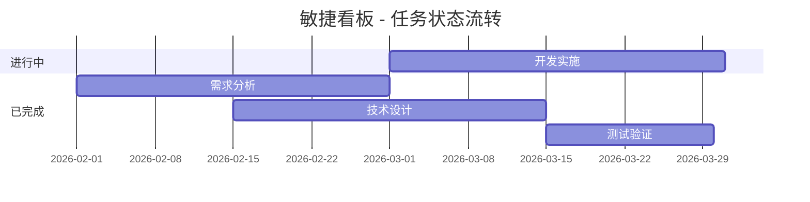

### 质量度量指标

| 指标类型 | 目标值 | 当前值 | 评估等级 |
|---------|--------|--------|----------|
| 代码覆盖率 | >80% | 85% | 优秀 |
| 缺陷密度 | <1个/千行 | 0.8个/千行 | 优秀 |
| 部署频率 | 每周>2次 | 每周3次 | 良好 |
| MTTR | <30分钟 | 25分钟 | 优秀 |
| MTBF | >48小时 | 60小时 | 良好 |

**章节来源**
- [REFACTOR_MASTER_TASKLIST.md:1-512](file://REFACTOR_MASTER_TASKLIST.md#L1-L512)

## 质量保证措施

### 质量控制流程

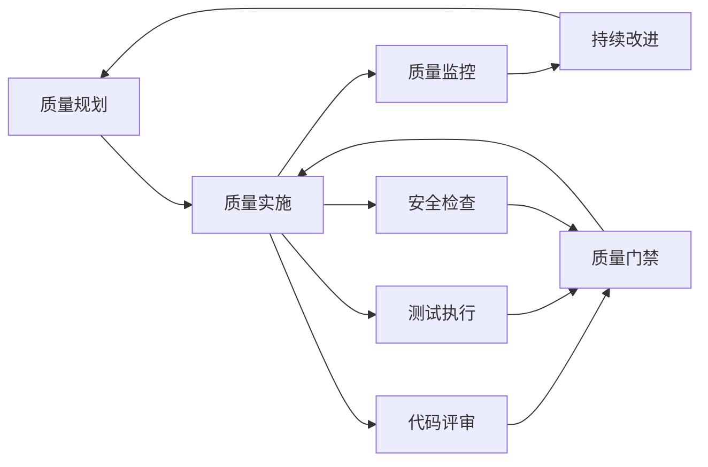

### 代码质量标准

#### 代码评审标准

| 评审维度 | 评分标准 | 通过条件 |
|---------|----------|----------|
| 功能正确性 | 5分制 | ≥4分 |
| 代码可读性 | 5分制 | ≥4分 |
| 性能考虑 | 5分制 | ≥3分 |
| 安全性 | 5分制 | ≥4分 |
| 测试覆盖 | 5分制 | ≥4分 |
| 文档完整性 | 5分制 | ≥4分 |

#### 缺陷管理流程

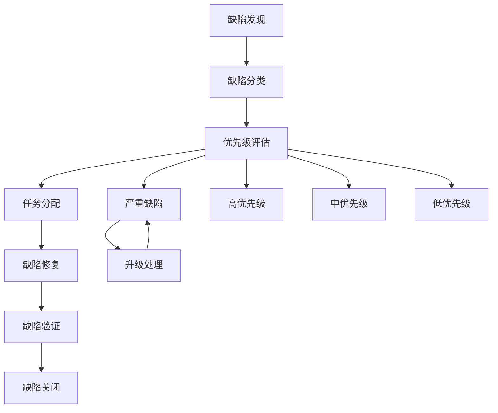

### 性能质量保证

#### 性能监控指标

| 指标类型 | 监控目标 | 告警阈值 | 处理流程 |
|---------|----------|----------|----------|
| 响应时间 | <2秒 | <5秒 | 性能优化 |
| 吞吐量 | >1000 QPS | >800 QPS | 扩容评估 |
| 错误率 | <0.1% | <0.5% | 错误分析 |
| 资源利用率 | <80% | <90% | 资源调整 |
| 数据库连接数 | <80% | <90% | 连接池优化 |

**章节来源**
- [TEST_CHECKLIST.md:431-448](file://TEST_CHECKLIST.md#L431-L448)

## 紧急问题处理流程

### 应急响应机制

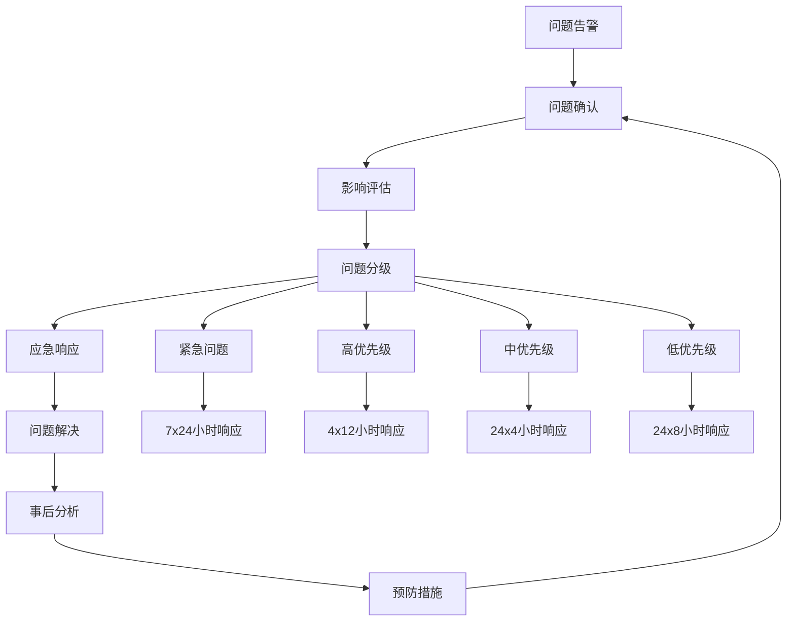

### 紧急问题分类

| 问题级别 | 影响范围 | 响应时间 | 处理流程 |
|---------|----------|----------|----------|
| P0 - 系统崩溃 | 全站停机 | 立即响应 | 紧急修复、数据恢复 |
| P1 - 重要功能失效 | 核心业务中断 | 4小时内 | 快速修复、降级方案 |
| P2 - 功能异常 | 部分功能异常 | 24小时内 | 修复方案、回滚准备 |
| P3 - 性能问题 | 性能下降 | 72小时内 | 性能优化、监控加强 |
| P4 - UI问题 | 界面显示问题 | 7天内 | 修复界面、用户体验 |

### 热修复流程

```mermaid
sequenceDiagram
participant Dev as 开发者
participant QA as 质量保证
participant Ops as 运维团队
participant Prod as 生产环境
Dev->>QA : 热修复代码
QA->>QA : 自动化测试
QA->>Ops : 部署审批
Ops->>Prod : 紧急部署
Prod->>Ops : 监控验证
Ops->>Dev : 问题确认
```

**章节来源**
- [ROLE_ACCEPTANCE_WALKTHROUGH.md:1-217](file://ROLE_ACCEPTANCE_WALKTHROUGH.md#L1-L217)

## 变更管理流程

### 变更控制委员会

```mermaid
flowchart LR
Change[变更请求] --> Assessment[影响评估]
Assessment --> Committee[变更评审]
Committee --> Approval{变更批准?}
Approval --> |是| Implementation[实施变更]
Approval --> |否| Rejection[拒绝变更]
Implementation --> Testing[测试验证]
Testing --> Rollback[回滚准备]
Rollback --> Implementation
Rejection --> Archive[变更归档]
Implementation --> Archive
```

### 变更类型分类

| 变更类型 | 风险等级 | 审批流程 | 变更窗口 |
|---------|----------|----------|----------|
| 紧急修复 | 高 | 快速审批 | 立即执行 |
| 功能增强 | 中 | 标准审批 | 工作时间 |
| 性能优化 | 低 | 简化审批 | 非高峰时段 |
| 架构调整 | 高 | 专家评审 | 计划变更 |
| 配置修改 | 低 | 自动审批 | 随时执行 |

### 变更记录管理

```mermaid
flowchart TD
Request[变更请求] --> Record[变更记录]
Record --> Approval[变更审批]
Approval --> Implementation[变更实施]
Implementation --> Verification[变更验证]
Verification --> Closure[变更关闭]
Record --> History[变更历史]
History --> Audit[变更审计]
Audit --> History
```

### 变更影响分析

| 分析维度 | 评估内容 | 影响程度 |
|---------|----------|----------|
| 功能影响 | 新功能/修改功能 | 高/中/低 |
| 性能影响 | 响应时间/吞吐量 | 高/中/低 |
| 安全影响 | 数据安全/访问控制 | 高/中/低 |
| 兼容性影响 | 向后兼容/升级影响 | 高/中/低 |
| 运维影响 | 监控/日志/告警 | 高/中/低 |
| 用户影响 | 用户体验/学习成本 | 高/中/低 |

**章节来源**
- [BUSINESS_DATABASE_MIGRATION_PLAN.md:398-550](file://BUSINESS_DATABASE_MIGRATION_PLAN.md#L398-L550)

## 流程图与检查清单

### 开发流程检查清单

```mermaid
flowchart TD
Start([开始开发]) --> Setup[环境搭建]
Setup --> Design[技术设计]
Design --> Coding[编码实现]
Coding --> Review[代码评审]
Review --> Test[测试验证]
Test --> Deploy[部署上线]
Deploy --> Monitor[监控观察]
Monitor --> Complete([开发完成])
Review --> Fix[缺陷修复]
Fix --> Review
Test --> Fix
Fix --> Test
```

### 测试流程检查清单

```mermaid
flowchart TD
TestPlan[测试计划] --> TestCases[测试用例]
TestCases --> TestExecution[测试执行]
TestExecution --> DefectTracking[缺陷跟踪]
DefectTracking --> TestVerification[测试验证]
TestVerification --> TestClosure[测试关闭]
TestCases --> Regression[回归测试]
Regression --> TestExecution
```

### 部署流程检查清单

```mermaid
flowchart TD
PreDeploy[部署前检查] --> Build[构建镜像]
Build --> SecurityScan[安全扫描]
SecurityScan --> TestDeploy[测试环境部署]
TestDeploy --> QAReview[QA评审]
QAReview --> ProductionDeploy[生产环境部署]
ProductionDeploy --> PostDeploy[部署后检查]
PostDeploy --> Complete([部署完成])
QAReview --> ReDeploy[重新部署]
ReDeploy --> TestDeploy
```

### 质量保证检查清单

| 检查项目 | 检查标准 | 检查方法 | 检查频率 |
|---------|----------|----------|----------|
| 代码质量 | 无高危漏洞、符合编码规范 | 代码扫描、人工评审 | 每次提交 |
| 功能测试 | 100%测试用例通过 | 自动化测试 | 每次发布 |
| 性能测试 | 满足性能指标 | 性能测试工具 | 每月一次 |
| 安全测试 | 无高危安全漏洞 | 安全扫描工具 | 季度一次 |
| 兼容性测试 | 多环境兼容性验证 | 兼容性测试 | 每季度一次 |
| 文档完整性 | 文档与代码一致 | 文档检查 | 每次发布 |

### 风险控制检查清单

| 风险类型 | 风险描述 | 控制措施 | 监控指标 |
|---------|----------|----------|----------|
| 技术风险 | 新技术引入失败 | 技术验证、原型开发 | 技术成熟度 |
| 进度风险 | 开发延期 | 进度监控、缓冲时间 | 进度偏差率 |
| 质量风险 | 缺陷密度过高 | 代码评审、测试覆盖 | 缺陷密度 |
| 安全风险 | 数据泄露、攻击 | 安全扫描、访问控制 | 安全事件数 |
| 运维风险 | 系统故障、性能下降 | 监控告警、应急预案 | MTTR/MTBF |
| 业务风险 | 需求变更、市场变化 | 需求管理、市场调研 | 需求变更率 |

## 结论

本开发流程指南基于无人机租赁平台的实际项目情况，结合v2重构阶段的成果，建立了完整的开发管理体系。通过标准化的流程、严格的检查机制和完善的质量保证措施，确保项目能够高效、稳定地推进。

### 关键成果

1. **流程标准化**：建立了从需求分析到部署上线的完整流程体系
2. **质量保证**：通过多层次的质量控制确保交付质量
3. **风险管理**：建立了完善的风险识别和应对机制
4. **团队协作**：明确了各角色职责和协作方式
5. **持续改进**：建立了流程回顾和持续改进机制

### 实施建议

1. **严格执行流程**：确保各项流程得到严格执行
2. **持续监控改进**：定期评估流程效果并持续改进
3. **培训团队成员**：确保团队成员熟悉并掌握流程要求
4. **工具化支持**：利用工具提高流程执行效率
5. **文化建设**：培养质量意识和流程文化

通过本指南的实施，项目团队能够更好地管理开发过程，提高开发效率，确保项目质量和按时交付。