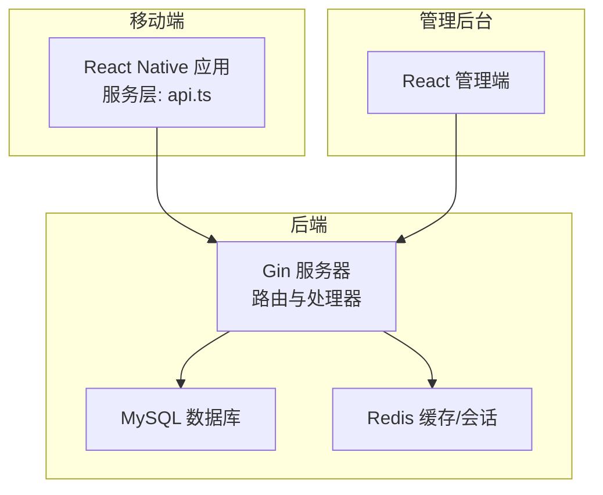
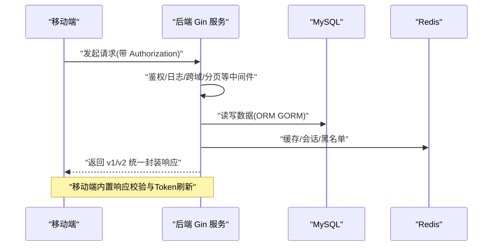
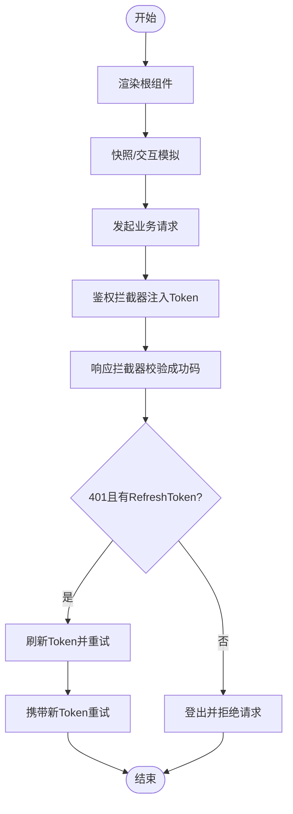
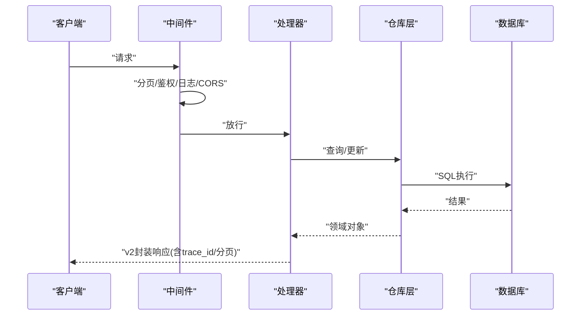
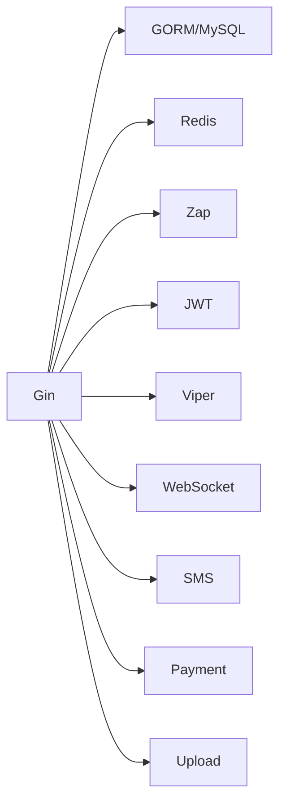

# 测试验证流程

<cite>
**本文引用的文件**
- [mobile/jest.config.js](file://mobile/jest.config.js)
- [mobile/__tests__/App.test.tsx](file://mobile/__tests__/App.test.tsx)
- [mobile/src/services/api.ts](file://mobile/src/services/api.ts)
- [backend/go.mod](file://backend/go.mod)
- [backend/cmd/server/main.go](file://backend/cmd/server/main.go)
- [backend/internal/api/middleware/legacy_write_freeze_test.go](file://backend/internal/api/middleware/legacy_write_freeze_test.go)
- [backend/internal/api/middleware/pagination_test.go](file://backend/internal/api/middleware/pagination_test.go)
- [backend/internal/pkg/response/v2_test.go](file://backend/internal/pkg/response/v2_test.go)
- [backend/internal/model/drone_test.go](file://backend/internal/model/drone_test.go)
- [backend/internal/repository/order_repo_test.go](file://backend/internal/repository/order_repo_test.go)
- [TEST_CHECKLIST.md](file://TEST_CHECKLIST.md)
- [MOBILE_REGRESSION_ACCEPTANCE.md](file://MOBILE_REGRESSION_ACCEPTANCE.md)
- [.github/workflows/build-android-apk.yml](file://.github/workflows/build-android-apk.yml)
</cite>

## 目录
1. [引言](#引言)
2. [项目结构](#项目结构)
3. [核心组件](#核心组件)
4. [架构总览](#架构总览)
5. [详细组件分析](#详细组件分析)
6. [依赖分析](#依赖分析)
7. [性能考虑](#性能考虑)
8. [故障排查指南](#故障排查指南)
9. [结论](#结论)
10. [附录](#附录)

## 引言
本文件面向无人机租赁平台，系统化梳理测试验证流程，覆盖单元测试、集成测试、端到端测试、回归测试的执行标准与方法；明确测试用例设计原则、测试数据准备与环境搭建；细化移动端、后端 API、数据库测试要点；提供测试工具使用指南、自动化测试配置与测试报告生成建议；解释测试覆盖率要求、缺陷跟踪流程与测试验收标准；并给出性能测试、安全测试、兼容性测试的实施方案。

## 项目结构
平台由三部分组成：
- 移动端（React Native）：负责用户交互、业务页面与 API 通信。
- 后端（Go/Gin）：提供 REST API、业务服务、数据持久化与中间件。
- 管理后台（React/Vite）：用于运营与数据分析。

图表来源
- [backend/cmd/server/main.go:52-266](file://backend/cmd/server/main.go#L52-L266)
- [mobile/src/services/api.ts:15-155](file://mobile/src/services/api.ts#L15-L155)

章节来源
- [backend/cmd/server/main.go:52-266](file://backend/cmd/server/main.go#L52-L266)
- [mobile/src/services/api.ts:15-155](file://mobile/src/services/api.ts#L15-L155)

## 核心组件
- 移动端测试基础
  - Jest 预设配置与基础渲染测试样例。
  - API 客户端封装与鉴权拦截器、响应体校验与 Token 刷新机制。
- 后端测试基础
  - Gin 中间件与响应封装的单元测试样例（冻结旧写路径、分页、v2 响应封装）。
  - 模型与仓库层的单元测试样例（无人机门槛与市场准入、订单空值归一化）。
- 端到端与回归
  - 手工测试清单与移动端回归验收矩阵，指导页面对象边界、角色入口、状态一致性与布局完整性。
  - GitHub Actions 构建 Android APK 的流水线，便于自动化构建与产物归档。

章节来源
- [mobile/jest.config.js:1-4](file://mobile/jest.config.js#L1-L4)
- [mobile/__tests__/App.test.tsx:1-14](file://mobile/__tests__/App.test.tsx#L1-L14)
- [mobile/src/services/api.ts:15-155](file://mobile/src/services/api.ts#L15-L155)
- [backend/internal/api/middleware/legacy_write_freeze_test.go:12-81](file://backend/internal/api/middleware/legacy_write_freeze_test.go#L12-L81)
- [backend/internal/api/middleware/pagination_test.go:11-41](file://backend/internal/api/middleware/pagination_test.go#L11-L41)
- [backend/internal/pkg/response/v2_test.go:12-79](file://backend/internal/pkg/response/v2_test.go#L12-L79)
- [backend/internal/model/drone_test.go:5-38](file://backend/internal/model/drone_test.go#L5-L38)
- [backend/internal/repository/order_repo_test.go:5-24](file://backend/internal/repository/order_repo_test.go#L5-L24)
- [TEST_CHECKLIST.md:42-448](file://TEST_CHECKLIST.md#L42-L448)
- [MOBILE_REGRESSION_ACCEPTANCE.md:1-337](file://MOBILE_REGRESSION_ACCEPTANCE.md#L1-L337)
- [.github/workflows/build-android-apk.yml:1-74](file://.github/workflows/build-android-apk.yml#L1-L74)

## 架构总览
后端服务启动时完成配置加载、日志初始化、数据库连接与自动迁移、Redis 初始化、WebSocket Hub、中间件注册、处理器与路由注册，并根据配置启动 HTTP 服务。移动端通过 axios 客户端访问后端 API，支持 v1/v2 两套协议，内置鉴权头注入、响应体校验与 Token 刷新。

图表来源
- [backend/cmd/server/main.go:52-266](file://backend/cmd/server/main.go#L52-L266)
- [mobile/src/services/api.ts:15-155](file://mobile/src/services/api.ts#L15-L155)

章节来源
- [backend/cmd/server/main.go:52-266](file://backend/cmd/server/main.go#L52-L266)
- [mobile/src/services/api.ts:15-155](file://mobile/src/services/api.ts#L15-L155)

## 详细组件分析

### 移动端测试
- 单元测试
  - 使用 Jest 预设与 React Test Renderer 渲染应用根组件，验证渲染正确性。
  - 建议补充：对页面组件进行快照测试、用户交互模拟（点击、输入）、异步状态断言。
- API 层测试
  - 鉴权拦截器：自动注入 Bearer Token。
  - 响应拦截器：校验 v1/v2 成功码，处理 401 并触发 Token 刷新队列。
  - 建议补充：对拦截器行为进行单元测试，覆盖 401、并发刷新、失败回退等分支。
- 端到端测试
  - 使用移动端回归验收矩阵，逐项检查页面对象边界、角色入口、状态与编号一致性、布局完整性。
  - 建议补充：基于设备模式与截图比对的自动化回归脚本，结合 CI 归档对比结果。

图表来源
- [mobile/src/services/api.ts:18-155](file://mobile/src/services/api.ts#L18-L155)
- [mobile/__tests__/App.test.tsx:9-13](file://mobile/__tests__/App.test.tsx#L9-L13)

章节来源
- [mobile/jest.config.js:1-4](file://mobile/jest.config.js#L1-L4)
- [mobile/__tests__/App.test.tsx:1-14](file://mobile/__tests__/App.test.tsx#L1-L14)
- [mobile/src/services/api.ts:15-155](file://mobile/src/services/api.ts#L15-L155)
- [MOBILE_REGRESSION_ACCEPTANCE.md:35-46](file://MOBILE_REGRESSION_ACCEPTANCE.md#L35-L46)

### 后端 API 测试
- 中间件测试
  - 写冻结中间件：对旧写路径进行封禁，仅允许读请求；支持白名单前缀绕过。
  - 分页中间件：默认页码/大小与上限校验，确保安全与性能。
- 响应封装测试
  - v2 成功列表响应：自动注入 trace_id、分页元数据；未授权响应同样遵循 v2 封装。
- 模型与仓库测试
  - 无人机模型：重载阈值判断与市场准入条件。
  - 订单仓库：空值字段归一化（如 pilot_id=0 归为 NULL），避免脏数据。

图表来源
- [backend/internal/api/middleware/pagination_test.go:11-34](file://backend/internal/api/middleware/pagination_test.go#L11-L34)
- [backend/internal/pkg/response/v2_test.go:12-79](file://backend/internal/pkg/response/v2_test.go#L12-L79)
- [backend/internal/model/drone_test.go:5-38](file://backend/internal/model/drone_test.go#L5-L38)
- [backend/internal/repository/order_repo_test.go:5-24](file://backend/internal/repository/order_repo_test.go#L5-L24)

章节来源
- [backend/internal/api/middleware/legacy_write_freeze_test.go:12-81](file://backend/internal/api/middleware/legacy_write_freeze_test.go#L12-L81)
- [backend/internal/api/middleware/pagination_test.go:11-41](file://backend/internal/api/middleware/pagination_test.go#L11-L41)
- [backend/internal/pkg/response/v2_test.go:12-79](file://backend/internal/pkg/response/v2_test.go#L12-L79)
- [backend/internal/model/drone_test.go:5-38](file://backend/internal/model/drone_test.go#L5-L38)
- [backend/internal/repository/order_repo_test.go:5-24](file://backend/internal/repository/order_repo_test.go#L5-L24)

### 数据库测试
- 启动流程
  - 服务启动时建立数据库连接、设置连接池参数、设置字符集、执行自动迁移。
- 建议测试策略
  - 单元测试：针对 SQL 查询与事务边界编写测试，使用内存数据库或 Docker MySQL。
  - 集成测试：在隔离环境中执行迁移脚本，验证表结构与索引。
  - 回归测试：在 CI 中拉起 MySQL 容器，执行迁移与关键业务查询。

章节来源
- [backend/cmd/server/main.go:268-292](file://backend/cmd/server/main.go#L268-L292)
- [backend/cmd/server/main.go:294-389](file://backend/cmd/server/main.go#L294-L389)

### 端到端测试与回归
- 手工测试清单
  - 覆盖用户认证、无人机管理、飞手模块、业主/客户模块、智能派单、订单执行、支付结算、信用评价、保险理赔、数据分析、空域管理等。
  - 提供命令行快速验证后端 API 的步骤与预期。
- 移动端回归验收
  - 明确验收目的、环境、截图标准与关键页面回归矩阵。
  - 对空状态、加载态、错误态进行专项检查，保证一致性与完整性。

章节来源
- [TEST_CHECKLIST.md:42-448](file://TEST_CHECKLIST.md#L42-L448)
- [MOBILE_REGRESSION_ACCEPTANCE.md:1-337](file://MOBILE_REGRESSION_ACCEPTANCE.md#L1-L337)

### 自动化测试配置与报告
- 移动端
  - Jest 预设已配置，建议扩展测试覆盖率统计与报告生成。
- 后端
  - Go 单元测试通过 go test 执行，建议在 CI 中收集覆盖率并生成报告。
- 移动端 APK 构建
  - GitHub Actions 已提供 Android APK 构建流水线，可扩展测试步骤与产物归档。

章节来源
- [mobile/jest.config.js:1-4](file://mobile/jest.config.js#L1-L4)
- [.github/workflows/build-android-apk.yml:1-74](file://.github/workflows/build-android-apk.yml#L1-L74)

## 依赖分析
- 后端依赖
  - Web 框架：Gin
  - ORM：GORM + MySQL 驱动
  - 缓存：Redis
  - 日志：Zap
  - 加密：crypto、jwt
  - 配置：Viper
  - 其他：WebSocket、短信、支付、上传等模块

图表来源
- [backend/go.mod:5-21](file://backend/go.mod#L5-L21)

章节来源
- [backend/go.mod:1-80](file://backend/go.mod#L1-L80)

## 性能考虑
- 接口性能
  - 合理设置分页上限与默认值，避免大列表一次性返回。
  - 对热点接口启用缓存（Redis），降低数据库压力。
- 移动端体验
  - 控制首屏资源体积，拆分 chunk，减少白屏时间。
  - 对高频请求进行去抖/节流与本地缓存。
- 数据库性能
  - 为常用查询字段建立索引，避免全表扫描。
  - 连接池参数需与并发峰值匹配，防止连接争用。

## 故障排查指南
- 常见问题
  - 无法发送验证码：检查后端服务与 Redis 容器状态。
  - 登录后页面空白：检查浏览器控制台与 API 地址配置。
  - 接口返回 401：确认 Token 是否过期，Authorization 头格式是否正确。
  - 数据库连接失败：检查 MySQL 容器与配置文件。
- 建议流程
  - 逐步定位：前端网络面板 → 后端日志 → 数据库/缓存状态。
  - 使用手工测试清单与移动端回归矩阵快速复现问题。

章节来源
- [TEST_CHECKLIST.md:431-448](file://TEST_CHECKLIST.md#L431-L448)

## 结论
本测试验证流程以手工测试清单与移动端回归矩阵为入口，结合移动端与后端单元测试、数据库迁移验证与 GitHub Actions 构建流水线，形成从单元到端到端的闭环。建议在 CI 中引入覆盖率统计与报告生成，完善自动化回归与截图对比，持续提升质量与交付效率。

## 附录

### 测试用例设计原则
- 原子性：每个用例聚焦单一功能点。
- 可重复：前置条件清晰，执行步骤可重复。
- 可观测：断言明确，失败可定位。
- 覆盖关键路径：登录、核心业务流程、异常与边界场景。

### 测试数据准备
- 预置账号：普通用户、机主、飞手、管理员。
- 预置无人机：数据库已初始化多台，分布主要城市。
- Redis/MySQL：确保服务可用，必要时执行迁移脚本。

章节来源
- [TEST_CHECKLIST.md:416-429](file://TEST_CHECKLIST.md#L416-L429)

### 测试环境搭建
- 后端：启动 Gin 服务，加载配置，初始化数据库与 Redis。
- 移动端：启动预览服务，确保 API 地址与 WebSocket 地址正确。
- 管理后台：启动开发服务器，访问管理端登录页。

章节来源
- [TEST_CHECKLIST.md:42-61](file://TEST_CHECKLIST.md#L42-L61)

### 测试工具与报告
- 移动端：Jest 预设，建议扩展覆盖率与报告。
- 后端：go test + 覆盖率收集，建议生成 HTML 报告。
- 构建：GitHub Actions 输出 APK，建议归档测试日志与截图。

章节来源
- [mobile/jest.config.js:1-4](file://mobile/jest.config.js#L1-L4)
- [.github/workflows/build-android-apk.yml:68-74](file://.github/workflows/build-android-apk.yml#L68-L74)

### 测试覆盖率与验收标准
- 覆盖率：建议后端关键包覆盖率不低于 80%，移动端关键页面与交互不低于 70%。
- 验收标准：手工测试清单与移动端回归矩阵通过，截图无截断/错位，状态与编号一致。

章节来源
- [MOBILE_REGRESSION_ACCEPTANCE.md:35-46](file://MOBILE_REGRESSION_ACCEPTANCE.md#L35-L46)

### 缺陷跟踪流程
- 发现问题：在手工测试或自动化回归中发现。
- 记录缺陷：明确步骤、期望/实际结果、环境信息。
- 分配与修复：指派给对应模块负责人，设定优先级与截止时间。
- 回归验证：修复后在手工测试清单与移动端回归矩阵中复测。

章节来源
- [TEST_CHECKLIST.md:42-61](file://TEST_CHECKLIST.md#L42-L61)

### 性能测试、安全测试、兼容性测试
- 性能测试：对核心接口进行并发压测，关注 P95/P99 延迟与错误率。
- 安全测试：鉴权绕过、SQL 注入、XSS、CSRF 等基线检查。
- 兼容性测试：主流机型与系统版本、浏览器兼容性、网络环境（弱网、切换）。

[本节为通用实践建议，无需特定文件引用]