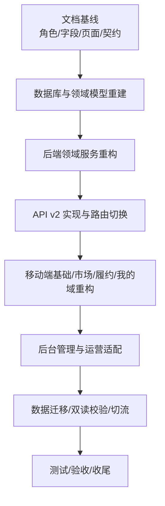
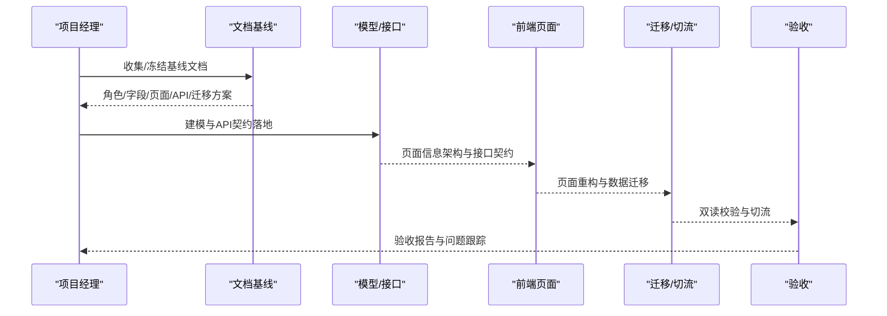
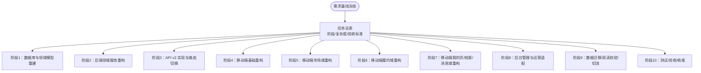
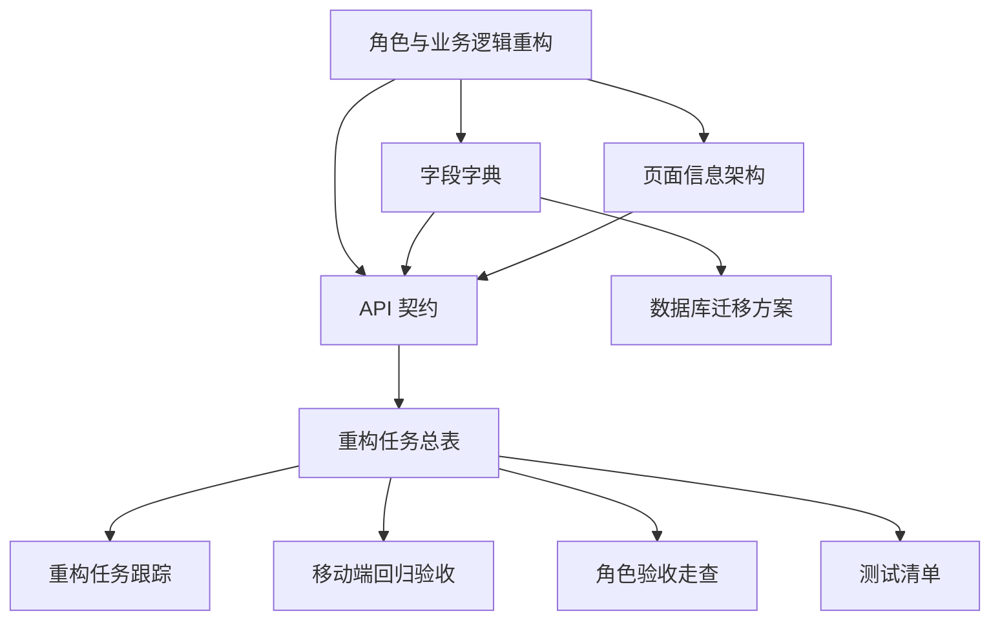

# 需求管理流程

<cite>
**本文档引用的文件**
- [README.md](file://README.md)
- [REFACTOR_MASTER_TASKLIST.md](file://REFACTOR_MASTER_TASKLIST.md)
- [REFACTOR_TASK_TRACKER.md](file://REFACTOR_TASK_TRACKER.md)
- [BUSINESS_API_CONTRACT.md](file://BUSINESS_API_CONTRACT.md)
- [BUSINESS_DATABASE_MIGRATION_PLAN.md](file://BUSINESS_DATABASE_MIGRATION_PLAN.md)
- [BUSINESS_ROLE_REDESIGN.md](file://BUSINESS_ROLE_REDESIGN.md)
- [BUSINESS_FIELD_DICTIONARY.md](file://BUSINESS_FIELD_DICTIONARY.md)
- [BUSINESS_PAGE_INFORMATION_ARCHITECTURE.md](file://BUSINESS_PAGE_INFORMATION_ARCHITECTURE.md)
- [MOBILE_REGRESSION_ACCEPTANCE.md](file://MOBILE_REGRESSION_ACCEPTANCE.md)
- [ROLE_ACCEPTANCE_WALKTHROUGH.md](file://ROLE_ACCEPTANCE_WALKTHROUGH.md)
- [TEST_CHECKLIST.md](file://TEST_CHECKLIST.md)
</cite>

## 目录
1. [引言](#引言)
2. [项目结构](#项目结构)
3. [核心组件](#核心组件)
4. [架构总览](#架构总览)
5. [详细组件分析](#详细组件分析)
6. [依赖分析](#依赖分析)
7. [性能考虑](#性能考虑)
8. [故障排除指南](#故障排除指南)
9. [结论](#结论)
10. [附录](#附录)

## 引言
本文件面向无人机租赁平台的重构与演进，系统化梳理需求管理流程，覆盖需求收集、分析、评审、分解、分配、变更、优先级排序、跟踪与验收等全生命周期。结合项目现有文档与任务清单，给出可操作的流程规范、评审与验收标准、工具使用指南与状态跟踪模板，并阐明需求与任务分解的关系及紧急需求与冲突处理机制。

## 项目结构
项目采用前后端分离与多端并行的架构，核心业务对象围绕“需求/供给/订单/派单任务/飞行记录”展开，配合 v2 API 与移动端、管理后台的页面域重构。整体结构以“文档基线—模型重建—API 实现—前端重构—迁移切流—验收收尾”为主线推进。

**图表来源**
- [REFACTOR_MASTER_TASKLIST.md](file://REFACTOR_MASTER_TASKLIST.md)
- [BUSINESS_ROLE_REDESIGN.md](file://BUSINESS_ROLE_REDESIGN.md)
- [BUSINESS_PAGE_INFORMATION_ARCHITECTURE.md](file://BUSINESS_PAGE_INFORMATION_ARCHITECTURE.md)
- [BUSINESS_API_CONTRACT.md](file://BUSINESS_API_CONTRACT.md)

**章节来源**
- [README.md](file://README.md)
- [REFACTOR_MASTER_TASKLIST.md](file://REFACTOR_MASTER_TASKLIST.md)

## 核心组件
- 需求对象与生命周期：需求草稿/发布/报价/选定/转单/过期/取消，支持有效期与自动关闭。
- 供给对象与准入：仅满足重载门槛（MTOW≥150kg、最大载重≥50kg）的无人机可进入主市场与生效供给。
- 订单来源与责任关系：支持“需求转单”和“供给直达下单”两种来源，明确客户/承接方/执行方/无人机归属。
- 派单与执行：固定调度优先级（绑定飞手→候选飞手→普通飞手池），自动重派与异常回退。
- 飞行记录与统计：履约飞行记录独立于历史手工日志，真实数据驱动统计与页面展示。
- API v2 契约：统一响应结构、分页、鉴权、DTO 约定与版本路径，页面与接口一一对应。

**章节来源**
- [BUSINESS_ROLE_REDESIGN.md](file://BUSINESS_ROLE_REDESIGN.md)
- [BUSINESS_FIELD_DICTIONARY.md](file://BUSINESS_FIELD_DICTIONARY.md)
- [BUSINESS_API_CONTRACT.md](file://BUSINESS_API_CONTRACT.md)
- [BUSINESS_PAGE_INFORMATION_ARCHITECTURE.md](file://BUSINESS_PAGE_INFORMATION_ARCHITECTURE.md)

## 架构总览
需求管理贯穿“文档—模型—接口—前端—迁移—验收”的闭环，关键节点包括：
- 文档基线冻结：角色体系、字段字典、页面信息架构、API 契约、数据库迁移方案。
- 阶段化推进：以任务清单为执行清单，按阶段完成模型与接口落地，再进行前端页面重构与迁移切流。
- 验收与回归：移动端关键页面回归与截图验收、角色视角业务验收、测试清单与演示账号。

**图表来源**
- [REFACTOR_MASTER_TASKLIST.md](file://REFACTOR_MASTER_TASKLIST.md)
- [MOBILE_REGRESSION_ACCEPTANCE.md](file://MOBILE_REGRESSION_ACCEPTANCE.md)
- [ROLE_ACCEPTANCE_WALKTHROUGH.md](file://ROLE_ACCEPTANCE_WALKTHROUGH.md)

## 详细组件分析

### 需求收集与分析
- 收集来源：业务背景、角色职责、页面对象边界、API 契约、字段字典、迁移方案。
- 分析要点：平台边界（重载末端吊运）、角色能力边界、需求/供给/订单/派单/飞行记录四类对象的职责与边界、状态机与来源追溯。
- 输出：需求基线文档（角色/字段/页面/API/迁移）与差异分析矩阵。

**章节来源**
- [BUSINESS_ROLE_REDESIGN.md](file://BUSINESS_ROLE_REDESIGN.md)
- [BUSINESS_FIELD_DICTIONARY.md](file://BUSINESS_FIELD_DICTIONARY.md)
- [BUSINESS_PAGE_INFORMATION_ARCHITECTURE.md](file://BUSINESS_PAGE_INFORMATION_ARCHITECTURE.md)
- [BUSINESS_API_CONTRACT.md](file://BUSINESS_API_CONTRACT.md)
- [BUSINESS_DATABASE_MIGRATION_PLAN.md](file://BUSINESS_DATABASE_MIGRATION_PLAN.md)

### 需求评审与验收标准
- 评审标准：对象边界清晰、角色入口正确、状态/编号/来源标签一致、布局无截断/溢出/错位、入口不断链。
- 验收矩阵：首页驾驶舱、供给市场/详情/直达下单确认、需求市场/详情、我的需求/报价/供给、订单/派单、飞行监控/记录、我的页。
- 验收结论：四类角色主链路跑通，无角色误导、状态错位、编号错位、入口断链。

**章节来源**
- [MOBILE_REGRESSION_ACCEPTANCE.md](file://MOBILE_REGRESSION_ACCEPTANCE.md)
- [ROLE_ACCEPTANCE_WALKTHROUGH.md](file://ROLE_ACCEPTANCE_WALKTHROUGH.md)

### 需求分解与任务分配
- 分解原则：以“需求/供给/订单/派单/飞行记录”为核心对象，按阶段拆解为数据库建模、领域服务、API 实现、前端页面、迁移与切流。
- 任务清单：以重构总表为唯一执行清单，状态标记统一（[ ] 未开始、[x] 已完成），完成并通过验收后才允许勾选。
- 子任务补充：若任务拆分出子任务，优先补充在本文件对应阶段，不另起零散待办。

**图表来源**
- [REFACTOR_MASTER_TASKLIST.md](file://REFACTOR_MASTER_TASKLIST.md)

**章节来源**
- [REFACTOR_MASTER_TASKLIST.md](file://REFACTOR_MASTER_TASKLIST.md)

### 需求变更管理
- 变更触发：业务方案变更、字段字典调整、页面信息架构修订、API 契约更新、迁移方案演进。
- 变更流程：先更新业务文档，再更新任务总表与被影响文档、接口文档、测试清单；完成任务时同步更新。
- 变更记录：每次完成任务时注明完成的任务编号，确保可追溯。

**章节来源**
- [REFACTOR_MASTER_TASKLIST.md](file://REFACTOR_MASTER_TASKLIST.md)

### 需求优先级排序
- 优先级维度：P0（核心角色/智能派单/空域管理/支付结算/信用评价/保险/数据分析/无人机SDK）。
- 执行顺序：先做阶段1/2锁死领域模型与状态机，再做阶段3保证v2 API可联调，然后按页面域分批切移动端，后台管理放在阶段8，最后阶段9/10完成数据切流与回归验收。

**章节来源**
- [REFACTOR_TASK_TRACKER.md](file://REFACTOR_TASK_TRACKER.md)
- [REFACTOR_MASTER_TASKLIST.md](file://REFACTOR_MASTER_TASKLIST.md)

### 需求跟踪机制
- 任务跟踪：以“重构任务跟踪”文档记录差异分析、功能模块任务列表、优先级与状态。
- 验收跟踪：移动端回归验收清单与截图验收标准、角色视角业务验收走查、测试清单与演示账号说明。
- 状态可视化：任务总表状态标记、验收矩阵与截图命名规范、自动验收脚本与产物编号。

**章节来源**
- [REFACTOR_TASK_TRACKER.md](file://REFACTOR_TASK_TRACKER.md)
- [MOBILE_REGRESSION_ACCEPTANCE.md](file://MOBILE_REGRESSION_ACCEPTANCE.md)
- [ROLE_ACCEPTANCE_WALKTHROUGH.md](file://ROLE_ACCEPTANCE_WALKTHROUGH.md)
- [TEST_CHECKLIST.md](file://TEST_CHECKLIST.md)

### 需求文档编写规范
- 文档清单：角色重构、字段字典、页面信息架构、API 契约、数据库迁移方案。
- 统一规范：字段命名、状态枚举、来源追溯规则、DTO 结构、响应结构、分页规则、平台边界约束。
- 版本与路径：v2 接口统一挂载 /api/v2，历史页面与数据比对使用 v1。

**章节来源**
- [BUSINESS_ROLE_REDESIGN.md](file://BUSINESS_ROLE_REDESIGN.md)
- [BUSINESS_FIELD_DICTIONARY.md](file://BUSINESS_FIELD_DICTIONARY.md)
- [BUSINESS_PAGE_INFORMATION_ARCHITECTURE.md](file://BUSINESS_PAGE_INFORMATION_ARCHITECTURE.md)
- [BUSINESS_API_CONTRACT.md](file://BUSINESS_API_CONTRACT.md)

### 需求评审与验收标准
- 评审重点：页面对象边界、角色入口、状态/编号/来源标签一致性、布局完整性。
- 验收矩阵：首页驾驶舱、供给市场/详情/直达下单确认、需求市场/详情、我的需求/报价/供给、订单/派单、飞行监控/记录、我的页。
- 验收结论：四类角色主链路跑通，无角色误导、状态错位、编号错位、入口断链。

**章节来源**
- [MOBILE_REGRESSION_ACCEPTANCE.md](file://MOBILE_REGRESSION_ACCEPTANCE.md)
- [ROLE_ACCEPTANCE_WALKTHROUGH.md](file://ROLE_ACCEPTANCE_WALKTHROUGH.md)

### 需求与任务分解的关系
- 需求→对象：需求/供给/订单/派单/飞行记录四类核心对象。
- 对象→服务：领域服务（账号/客户/机主/飞手/撮合/订单/派单/飞行/通知/事件/财务/保险/信用/风控/数据分析）。
- 服务→接口：v2 API 路由与端点，统一响应结构与 DTO。
- 接口→页面：移动端市场/履约/我的域页面，后台管理页面。
- 页面→迁移：数据库迁移脚本与双读校验，最终切流冻结 v1 写入。

**章节来源**
- [BUSINESS_ROLE_REDESIGN.md](file://BUSINESS_ROLE_REDESIGN.md)
- [BUSINESS_API_CONTRACT.md](file://BUSINESS_API_CONTRACT.md)
- [BUSINESS_PAGE_INFORMATION_ARCHITECTURE.md](file://BUSINESS_PAGE_INFORMATION_ARCHITECTURE.md)
- [BUSINESS_DATABASE_MIGRATION_PLAN.md](file://BUSINESS_DATABASE_MIGRATION_PLAN.md)

### 紧急需求处理流程
- 快速通道：P0 优先级需求（飞手认证体系、机主认证增强、智能派单系统、空域管理、订单生命周期、支付分账系统、信用评价体系、保险理赔系统、数据分析平台、无人机 SDK 集成）。
- 处理原则：优先完成核心角色与智能派单，确保 v2 API 可联调；迁移与切流阶段严格双读校验；验收通过后方可下线 v1 写入。

**章节来源**
- [REFACTOR_TASK_TRACKER.md](file://REFACTOR_TASK_TRACKER.md)
- [BUSINESS_DATABASE_MIGRATION_PLAN.md](file://BUSINESS_DATABASE_MIGRATION_PLAN.md)

### 需求冲突解决机制
- 冲突类型：角色语义冲突（user_type 与角色真相源）、页面对象混用（需求/订单/派单/飞行记录）、状态机错位、编号错位、入口断链。
- 解决路径：以文档基线为准（角色/字段/页面/API/迁移），统一状态与来源追溯，页面与接口一一对应，通过验收矩阵与自动验收脚本定位问题。
- 回退能力：任意阶段切换失败，仍可退回旧页面与旧接口，新旧模型并行期间旧数据不被破坏。

**章节来源**
- [BUSINESS_ROLE_REDESIGN.md](file://BUSINESS_ROLE_REDESIGN.md)
- [BUSINESS_PAGE_INFORMATION_ARCHITECTURE.md](file://BUSINESS_PAGE_INFORMATION_ARCHITECTURE.md)
- [BUSINESS_DATABASE_MIGRATION_PLAN.md](file://BUSINESS_DATABASE_MIGRATION_PLAN.md)
- [ROLE_ACCEPTANCE_WALKTHROUGH.md](file://ROLE_ACCEPTANCE_WALKTHROUGH.md)

## 依赖分析
需求管理流程与各文档/任务之间存在强耦合关系，关键依赖如下：

**图表来源**
- [BUSINESS_ROLE_REDESIGN.md](file://BUSINESS_ROLE_REDESIGN.md)
- [BUSINESS_FIELD_DICTIONARY.md](file://BUSINESS_FIELD_DICTIONARY.md)
- [BUSINESS_PAGE_INFORMATION_ARCHITECTURE.md](file://BUSINESS_PAGE_INFORMATION_ARCHITECTURE.md)
- [BUSINESS_API_CONTRACT.md](file://BUSINESS_API_CONTRACT.md)
- [BUSINESS_DATABASE_MIGRATION_PLAN.md](file://BUSINESS_DATABASE_MIGRATION_PLAN.md)
- [REFACTOR_MASTER_TASKLIST.md](file://REFACTOR_MASTER_TASKLIST.md)
- [REFACTOR_TASK_TRACKER.md](file://REFACTOR_TASK_TRACKER.md)
- [MOBILE_REGRESSION_ACCEPTANCE.md](file://MOBILE_REGRESSION_ACCEPTANCE.md)
- [ROLE_ACCEPTANCE_WALKTHROUGH.md](file://ROLE_ACCEPTANCE_WALKTHROUGH.md)
- [TEST_CHECKLIST.md](file://TEST_CHECKLIST.md)

**章节来源**
- [REFACTOR_MASTER_TASKLIST.md](file://REFACTOR_MASTER_TASKLIST.md)
- [REFACTOR_TASK_TRACKER.md](file://REFACTOR_TASK_TRACKER.md)

## 性能考虑
- 数据库迁移：采用“新表先建，旧表并存，逐步切流”，结构迁移与数据回填分离，脚本幂等可回滚。
- 双读校验：关键列表与详情页对比 v1/v2 结果，确保一致性与性能。
- 前端切流：先切移动端到 v2，再切后台到 v2，最后冻结 v1 写入，减少系统抖动。
- 验收自动化：自动角色验收脚本与回归验收清单，缩短反馈周期。

**章节来源**
- [BUSINESS_DATABASE_MIGRATION_PLAN.md](file://BUSINESS_DATABASE_MIGRATION_PLAN.md)
- [MOBILE_REGRESSION_ACCEPTANCE.md](file://MOBILE_REGRESSION_ACCEPTANCE.md)
- [ROLE_ACCEPTANCE_WALKTHROUGH.md](file://ROLE_ACCEPTANCE_WALKTHROUGH.md)

## 故障排除指南
- 验收不通过：对照移动端回归验收清单逐项检查页面对象边界、角色入口、状态/编号/来源标签一致性、布局完整性。
- 角色断链：检查 /api/v2/me 与角色摘要，确保不再依赖旧 user_type 语义。
- 数据不一致：使用双读校验工具对比 v1/v2 关键页面结果，定位迁移审计清单与异常订单。
- 切流失败：回退到旧页面与旧接口，确保旧数据不被破坏，逐步修复后再尝试切流。

**章节来源**
- [MOBILE_REGRESSION_ACCEPTANCE.md](file://MOBILE_REGRESSION_ACCEPTANCE.md)
- [ROLE_ACCEPTANCE_WALKTHROUGH.md](file://ROLE_ACCEPTANCE_WALKTHROUGH.md)
- [BUSINESS_DATABASE_MIGRATION_PLAN.md](file://BUSINESS_DATABASE_MIGRATION_PLAN.md)

## 结论
通过以文档基线为起点、以任务总表为执行清单、以验收矩阵为质量保障的闭环流程，无人机租赁平台实现了需求从收集到验收的全生命周期管理。结合 P0 优先级与阶段化推进策略，确保核心能力优先落地；通过迁移与切流的双读校验与自动化验收，保障系统稳定性与可追溯性。

## 附录

### 需求管理工具使用指南
- 任务总表：统一状态标记（[ ] 未开始、[x] 已完成），完成并通过验收后才允许勾选。
- 任务跟踪：记录差异分析、功能模块任务列表、优先级与状态，便于跨阶段协调。
- 验收工具：移动端回归验收清单与截图验收标准、角色视角业务验收走查、自动验收脚本与产物编号。

**章节来源**
- [REFACTOR_MASTER_TASKLIST.md](file://REFACTOR_MASTER_TASKLIST.md)
- [REFACTOR_TASK_TRACKER.md](file://REFACTOR_TASK_TRACKER.md)
- [MOBILE_REGRESSION_ACCEPTANCE.md](file://MOBILE_REGRESSION_ACCEPTANCE.md)
- [ROLE_ACCEPTANCE_WALKTHROUGH.md](file://ROLE_ACCEPTANCE_WALKTHROUGH.md)

### 需求状态跟踪表格模板
- 任务编号：R1.01/R2.03/R3.07 等
- 阶段：阶段1/2/3/.../10
- 状态：[ ] 未开始 / [x] 已完成
- 验收标准：对应阶段验收结论
- 影响范围：后端/前端/后台/数据库
- 依赖：前置任务编号
- 备注：变更记录与完成任务编号

**章节来源**
- [REFACTOR_MASTER_TASKLIST.md](file://REFACTOR_MASTER_TASKLIST.md)