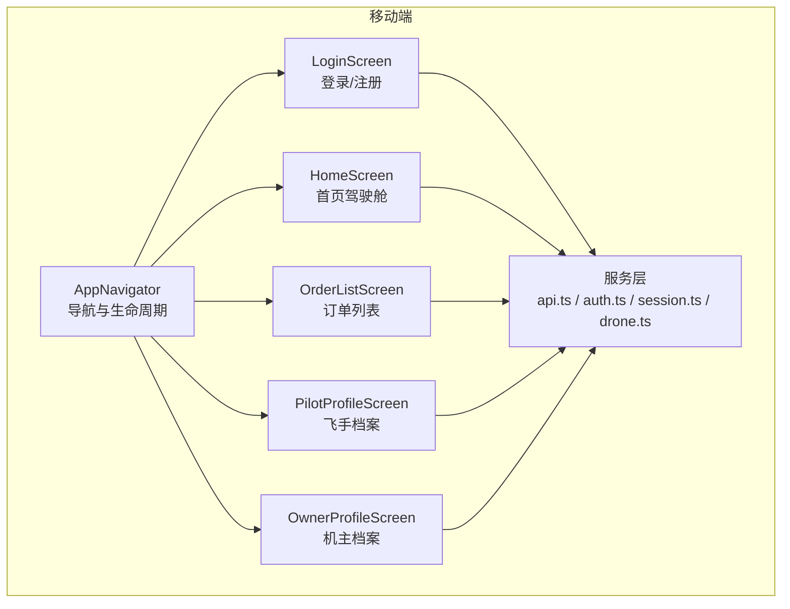
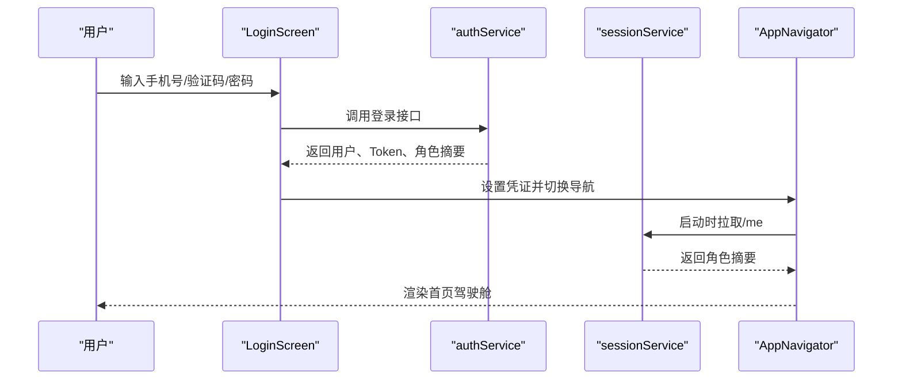
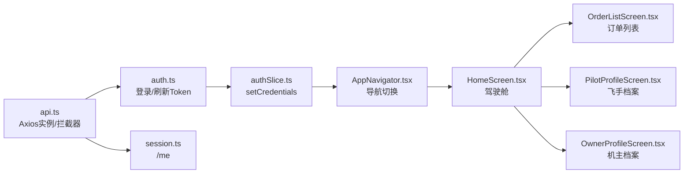

# 手动测试检查清单

<cite>
**本文引用的文件**
- [TEST_CHECKLIST.md](file://TEST_CHECKLIST.md)
- [DEMO_ACCOUNTS.md](file://DEMO_ACCOUNTS.md)
- [README.md](file://README.md)
- [mobile/src/services/api.ts](file://mobile/src/services/api.ts)
- [mobile/src/constants/index.ts](file://mobile/src/constants/index.ts)
- [mobile/src/navigation/AppNavigator.tsx](file://mobile/src/navigation/AppNavigator.tsx)
- [mobile/src/store/slices/authSlice.ts](file://mobile/src/store/slices/authSlice.ts)
- [mobile/src/services/auth.ts](file://mobile/src/services/auth.ts)
- [mobile/src/services/session.ts](file://mobile/src/services/session.ts)
- [mobile/src/services/drone.ts](file://mobile/src/services/drone.ts)
- [mobile/src/screens/auth/LoginScreen.tsx](file://mobile/src/screens/auth/LoginScreen.tsx)
- [mobile/src/screens/home/HomeScreen.tsx](file://mobile/src/screens/home/HomeScreen.tsx)
- [mobile/src/screens/order/OrderListScreen.tsx](file://mobile/src/screens/order/OrderListScreen.tsx)
- [mobile/src/screens/pilot/PilotProfileScreen.tsx](file://mobile/src/screens/pilot/PilotProfileScreen.tsx)
- [mobile/src/screens/owner/OwnerProfileScreen.tsx](file://mobile/src/screens/owner/OwnerProfileScreen.tsx)
</cite>

## 目录
1. [引言](#引言)
2. [项目结构](#项目结构)
3. [核心组件](#核心组件)
4. [架构概览](#架构概览)
5. [详细组件分析](#详细组件分析)
6. [依赖关系分析](#依赖关系分析)
7. [性能考虑](#性能考虑)
8. [故障排除指南](#故障排除指南)
9. [结论](#结论)
10. [附录](#附录)

## 引言
本文件基于仓库中的测试清单与演示账号说明，为无人机租赁平台移动端提供标准化的手动测试检查清单。测试覆盖用户认证、无人机管理、飞手模块、业主/客户模块、智能派单、订单执行、支付结算、信用评价、保险理赔、数据分析、空域管理等11个主要功能模块。每个模块均包含测试步骤、预期结果与验证方法，帮助测试人员按流程完成端到端功能验证。

## 项目结构
移动端采用React Native技术栈，核心目录与文件如下：
- 导航与状态管理：AppNavigator、authSlice
- 服务层：api.ts（HTTP客户端）、auth.ts、session.ts、drone.ts等
- 屏幕组件：auth、home、order、pilot、owner等模块页面
- 常量与配置：constants/index.ts（API地址、枚举、主题）

图表来源
- [mobile/src/navigation/AppNavigator.tsx:13-76](file://mobile/src/navigation/AppNavigator.tsx#L13-L76)
- [mobile/src/screens/auth/LoginScreen.tsx:45-160](file://mobile/src/screens/auth/LoginScreen.tsx#L45-L160)
- [mobile/src/screens/home/HomeScreen.tsx:264-376](file://mobile/src/screens/home/HomeScreen.tsx#L264-L376)
- [mobile/src/screens/order/OrderListScreen.tsx:151-234](file://mobile/src/screens/order/OrderListScreen.tsx#L151-L234)
- [mobile/src/screens/pilot/PilotProfileScreen.tsx:48-99](file://mobile/src/screens/pilot/PilotProfileScreen.tsx#L48-L99)
- [mobile/src/screens/owner/OwnerProfileScreen.tsx:25-68](file://mobile/src/screens/owner/OwnerProfileScreen.tsx#L25-L68)
- [mobile/src/services/api.ts:1-155](file://mobile/src/services/api.ts#L1-L155)

章节来源
- [README.md:1-29](file://README.md#L1-L29)
- [mobile/src/constants/index.ts:1-228](file://mobile/src/constants/index.ts#L1-L228)

## 核心组件
- API客户端与拦截器：支持v1/v2版本切换、鉴权头注入、业务码校验、Token刷新
- 导航与会话：根据登录状态切换Auth/Main导航，启动时拉取/me信息
- 认证与会话：手机号登录、验证码登录、密码登录、刷新Token
- 业务服务：无人机、订单、飞手、机主等模块的HTTP封装

章节来源
- [mobile/src/services/api.ts:1-155](file://mobile/src/services/api.ts#L1-L155)
- [mobile/src/navigation/AppNavigator.tsx:13-76](file://mobile/src/navigation/AppNavigator.tsx#L13-L76)
- [mobile/src/store/slices/authSlice.ts:1-65](file://mobile/src/store/slices/authSlice.ts#L1-L65)
- [mobile/src/services/auth.ts:1-45](file://mobile/src/services/auth.ts#L1-L45)
- [mobile/src/services/session.ts:1-7](file://mobile/src/services/session.ts#L1-L7)
- [mobile/src/services/drone.ts:1-31](file://mobile/src/services/drone.ts#L1-L31)

## 架构概览
移动端通过统一的API客户端访问后端服务，支持v1/v2版本切换；登录后自动拉取用户角色摘要，驱动首页驾驶舱与各模块入口展示。

图表来源
- [mobile/src/screens/auth/LoginScreen.tsx:111-134](file://mobile/src/screens/auth/LoginScreen.tsx#L111-L134)
- [mobile/src/services/auth.ts:21-26](file://mobile/src/services/auth.ts#L21-L26)
- [mobile/src/services/session.ts:4-6](file://mobile/src/services/session.ts#L4-L6)
- [mobile/src/navigation/AppNavigator.tsx:32-65](file://mobile/src/navigation/AppNavigator.tsx#L32-L65)

## 详细组件分析

### 1. 用户认证模块
- 测试目标：验证手机号登录、验证码登录、快速登录（演示账号）
- 关键路径：LoginScreen -> authService.login -> authSlice.setCredentials -> AppNavigator切换
- 验证要点：
  - 登录成功后跳转首页，导航键随登录状态切换
  - 启动时自动拉取/me，设置角色摘要
  - 开发模式支持快速登录，失败时显示详细错误信息

测试步骤
- 打开移动端预览 http://localhost:3100
- 输入手机号并发送验证码（开发模式下查看控制台）
- 输入验证码并点击登录，验证跳转首页
- 或使用开发模式快速登录（客户/机主/飞手/复合身份）
- 验证首页驾驶舱显示正确的角色摘要

预期结果
- 登录成功后显示首页驾驶舱
- 首页根据角色显示不同入口与指标
- 启动时自动拉取用户信息，无异常提示

章节来源
- [TEST_CHECKLIST.md:63-81](file://TEST_CHECKLIST.md#L63-L81)
- [mobile/src/screens/auth/LoginScreen.tsx:91-134](file://mobile/src/screens/auth/LoginScreen.tsx#L91-L134)
- [mobile/src/services/auth.ts:21-26](file://mobile/src/services/auth.ts#L21-L26)
- [mobile/src/navigation/AppNavigator.tsx:32-65](file://mobile/src/navigation/AppNavigator.tsx#L32-L65)

### 2. 无人机管理模块
- 测试目标：浏览无人机列表、发布无人机、无人机认证与维护记录
- 关键路径：HomeScreen -> DroneList/MyDrones -> 发布/认证
- 验证要点：
  - 首页可进入无人机列表
  - 机主可发布无人机并设置价格与状态
  - 无人机详情页支持认证管理与维护记录

测试步骤
- 登录后进入首页，点击“我的无人机”
- 查看无人机列表，点击任意无人机进入详情
- 机主入口发布新无人机，填写品牌/型号/价格并提交
- 在详情页进行认证管理（UOM登记、保险、适航证书）
- 添加维护记录并查看历史

预期结果
- 无人机列表正常展示
- 发布成功后返回列表并显示新设备
- 认证状态显示“审核中”，维护记录可查询

章节来源
- [TEST_CHECKLIST.md:83-112](file://TEST_CHECKLIST.md#L83-L112)
- [mobile/src/services/drone.ts:4-30](file://mobile/src/services/drone.ts#L4-L30)
- [mobile/src/screens/home/HomeScreen.tsx:446-494](file://mobile/src/screens/home/HomeScreen.tsx#L446-L494)

### 3. 飞手模块
- 测试目标：飞手注册、档案管理、接单状态、飞行记录
- 关键路径：PilotProfileScreen -> 飞手注册/认证 -> 接单状态切换 -> 飞行监控
- 验证要点：
  - 飞手档案显示认证状态、接单状态、服务区域、技能标签
  - 可切换在线/离线状态
  - 可查看待响应派单与执行中任务

测试步骤
- 进入“我的” -> “飞手中心”
- 查看认证状态与接单状态
- 切换接单状态（在线/离线）
- 设置服务城市与服务半径
- 选择技能标签并保存
- 进入“正式派单”查看待接单任务
- 进入“飞行监控”查看实时轨迹

预期结果
- 接单状态可正常切换
- 服务设置保存成功
- 派单任务列表显示待响应与执行中任务
- 飞行监控页面显示实时位置与飞行数据

章节来源
- [TEST_CHECKLIST.md:114-142](file://TEST_CHECKLIST.md#L114-L142)
- [mobile/src/screens/pilot/PilotProfileScreen.tsx:106-162](file://mobile/src/screens/pilot/PilotProfileScreen.tsx#L106-L162)

### 4. 业主/客户模块
- 测试目标：客户视角下的需求发布、供给浏览、订单管理
- 关键路径：HomeScreen（客户视图）-> 发布需求/浏览供给 -> 订单列表
- 验证要点：
  - 客户首页显示“待选方案/待确认/待支付/进行中”等指标
  - 可发布需求并查看报价与转单流程
  - 订单列表按状态分组与角色过滤

测试步骤
- 使用客户账号登录，进入首页
- 查看“发布需求”、“浏览供给”、“我的订单”入口
- 发布运输任务（选择货物、设置起点/终点/时间/预算）
- 查看报价列表与转单流程
- 进入订单列表，按状态与角色筛选

预期结果
- 首页指标与入口与角色匹配
- 发布任务成功，进入匹配中状态
- 订单列表按状态与角色正确聚合

章节来源
- [TEST_CHECKLIST.md:145-164](file://TEST_CHECKLIST.md#L145-L164)
- [mobile/src/screens/home/HomeScreen.tsx:396-444](file://mobile/src/screens/home/HomeScreen.tsx#L396-L444)
- [mobile/src/screens/order/OrderListScreen.tsx:182-228](file://mobile/src/screens/order/OrderListScreen.tsx#L182-L228)

### 5. 智能派单模块
- 测试目标：发布运输任务、查看匹配候选人、飞手接单
- 关键路径：发布任务 -> 匹配中 -> 候选人列表 -> 飞手接单
- 验证要点：
  - 任务发布后显示匹配中状态
  - 候选人按评分排序，可查看资质与距离
  - 飞手可接受或拒绝任务

测试步骤
- 机主发布运输任务（选择已申报货物、设置时间与预算）
- 查看任务详情与匹配候选人
- 飞手登录后在“待接派单”列表接受/拒绝任务
- 验证任务状态流转

预期结果
- 任务发布成功，状态为“匹配中”
- 候选人列表按评分排序，信息完整
- 接单后状态更新为“已接单”，拒绝后分配下一候选人

章节来源
- [TEST_CHECKLIST.md:167-195](file://TEST_CHECKLIST.md#L167-L195)

### 6. 订单执行模块
- 测试目标：订单状态流转、飞行监控
- 关键路径：订单详情 -> 实时监控
- 验证要点：
  - 订单状态按流程更新（已确认/准备中/装货中/运输中/已送达/已完成）
  - 飞行监控显示实时位置、高度、速度、电量与告警

测试步骤
- 飞手接单后在订单详情查看状态
- 依次执行“申请空域”、“装货确认”、“卸货确认”、“收货人签收”
- 在订单详情点击“实时监控”，查看无人机位置与飞行数据

预期结果
- 状态按流程正确更新
- 飞行监控页面显示实时数据与告警信息

章节来源
- [TEST_CHECKLIST.md:198-218](file://TEST_CHECKLIST.md#L198-L218)

### 7. 支付结算模块
- 测试目标：订单支付、钱包与提现
- 关键路径：订单详情 -> 支付页面 -> 钱包
- 验证要点：
  - 支付页面显示订单金额明细，支持微信/支付宝
  - 钱包显示余额、收入明细、可提现金额
  - 提现申请提交成功

测试步骤
- 客户在订单详情进入支付页面
- 选择支付方式并完成支付
- 查看钱包余额与收入明细
- 申请提现并提交

预期结果
- 支付成功后订单状态更新
- 钱包数据与收入明细正确
- 提现申请提交成功

章节来源
- [TEST_CHECKLIST.md:221-246](file://TEST_CHECKLIST.md#L221-L246)

### 8. 信用评价模块
- 测试目标：信用分查看、违规记录与保证金管理
- 关键路径：信用中心 -> 违规记录 -> 保证金
- 验证要点：
  - 信用中心显示信用分数与维度明细
  - 违规记录可查看与申诉
  - 保证金状态可查看、缴纳与申请退还

测试步骤
- 进入“我的” -> “信用中心”
- 查看信用分与维度明细
- 查看违规记录并提交申诉
- 查看保证金状态并操作

预期结果
- 信用分与维度明细显示正确
- 违规记录与申诉流程正常
- 保证金状态与操作成功

章节来源
- [TEST_CHECKLIST.md:249-272](file://TEST_CHECKLIST.md#L249-L272)

### 9. 保险理赔模块
- 测试目标：保险产品查看、购买、理赔报案与审核
- 关键路径：保险服务 -> 购买保险 -> 我的保单 -> 理赔报案
- 验证要点：
  - 保险产品列表与保障说明
  - 购买流程与保单生成
  - 理赔报案与进度查看
  - 管理端审核流程

测试步骤
- 进入“我的” -> “保险服务”
- 查看保险产品并购买
- 查看“我的保单”并申请理赔
- 填写事故信息并上传证据
- 查看理赔进度

预期结果
- 保险产品与购买流程正常
- 保单生成与理赔报案成功
- 理赔进度可追踪

章节来源
- [TEST_CHECKLIST.md:275-311](file://TEST_CHECKLIST.md#L275-L311)

### 10. 数据分析模块（管理端）
- 测试目标：运营看板、数据报表、趋势分析
- 验证要点：
  - 实时看板显示订单、收入、在线运力、区域热力图
  - 报表生成与导出
  - 趋势分析按时间筛选

测试步骤
- 管理端登录后进入“数据分析”
- 查看运营看板各项指标
- 生成并导出数据报表
- 查看订单/收入/用户增长趋势

预期结果
- 看板数据实时更新
- 报表生成与导出成功
- 趋势分析按时间筛选有效

章节来源
- [TEST_CHECKLIST.md:314-341](file://TEST_CHECKLIST.md#L314-L341)

### 11. 空域管理模块
- 测试目标：禁飞区查看、空域申请与审批
- 关键路径：地图禁飞区标记 -> 空域申请 -> 审批
- 验证要点：
  - 地图显示禁飞区并提示警告
  - 飞手提交空域申请并查看状态
  - 管理端审批通过/拒绝

测试步骤
- 在地图上查看禁飞区并规划路线
- 飞手接单后进入“空域申请”，填写飞行计划并提交
- 查看申请状态
- 管理端审批通过/拒绝

预期结果
- 禁飞区提示与路线检测正常
- 空域申请提交成功，状态可追踪
- 审批流程正常

章节来源
- [TEST_CHECKLIST.md:343-366](file://TEST_CHECKLIST.md#L343-L366)

## 依赖关系分析
移动端通过统一API客户端访问后端，支持v1/v2版本切换与Token刷新；登录后自动拉取用户角色摘要，驱动界面渲染。

图表来源
- [mobile/src/services/api.ts:1-155](file://mobile/src/services/api.ts#L1-L155)
- [mobile/src/services/auth.ts:1-45](file://mobile/src/services/auth.ts#L1-L45)
- [mobile/src/services/session.ts:1-7](file://mobile/src/services/session.ts#L1-L7)
- [mobile/src/store/slices/authSlice.ts:22-61](file://mobile/src/store/slices/authSlice.ts#L22-L61)
- [mobile/src/navigation/AppNavigator.tsx:13-76](file://mobile/src/navigation/AppNavigator.tsx#L13-L76)
- [mobile/src/screens/home/HomeScreen.tsx:264-376](file://mobile/src/screens/home/HomeScreen.tsx#L264-L376)
- [mobile/src/screens/order/OrderListScreen.tsx:151-234](file://mobile/src/screens/order/OrderListScreen.tsx#L151-L234)
- [mobile/src/screens/pilot/PilotProfileScreen.tsx:48-99](file://mobile/src/screens/pilot/PilotProfileScreen.tsx#L48-L99)
- [mobile/src/screens/owner/OwnerProfileScreen.tsx:25-68](file://mobile/src/screens/owner/OwnerProfileScreen.tsx#L25-L68)

章节来源
- [mobile/src/constants/index.ts:61-70](file://mobile/src/constants/index.ts#L61-L70)

## 性能考虑
- API超时与重试：默认超时15秒，v1/v2业务码校验，401自动刷新Token
- 首屏加载：启动时拉取/me，避免重复请求
- 列表渲染：订单列表按角色与状态聚合，减少重复数据

章节来源
- [mobile/src/services/api.ts:9-13](file://mobile/src/services/api.ts#L9-L13)
- [mobile/src/navigation/AppNavigator.tsx:32-65](file://mobile/src/navigation/AppNavigator.tsx#L32-L65)
- [mobile/src/screens/order/OrderListScreen.tsx:182-228](file://mobile/src/screens/order/OrderListScreen.tsx#L182-L228)

## 故障排除指南
- 无法发送验证码：检查后端服务与Redis运行状态
- 登录后页面空白：检查浏览器控制台与API地址配置
- 接口返回401：Token过期，重新登录获取新Token
- 数据库连接失败：检查MySQL容器与配置文件

章节来源
- [TEST_CHECKLIST.md:431-448](file://TEST_CHECKLIST.md#L431-L448)

## 结论
本检查清单基于仓库现有测试清单与演示账号说明，覆盖移动端11个核心功能模块。通过标准化的测试步骤与验证方法，测试人员可高效完成端到端功能验证。建议优先使用演示账号进行角色验收，并结合自动化脚本与回归测试提升效率。

## 附录
- 测试环境启动与访问地址
  - 后端服务：cd backend && go run cmd/server/main.go
  - 移动端预览：cd mobile-preview && npm run dev
  - 管理后台：cd admin && npm run dev
  - 访问地址：移动端预览 http://localhost:3100，管理后台 http://localhost:3000，后端API http://localhost:8080

- 演示账号说明
  - 客户、机主、飞手、复合身份账号，角色能力以 /api/v2/me 返回的 role_summary 为准
  - 推荐演示顺序：客户登录 -> 机主登录 -> 飞手登录 -> 复合身份登录

章节来源
- [TEST_CHECKLIST.md:42-61](file://TEST_CHECKLIST.md#L42-L61)
- [DEMO_ACCOUNTS.md:13-78](file://DEMO_ACCOUNTS.md#L13-L78)