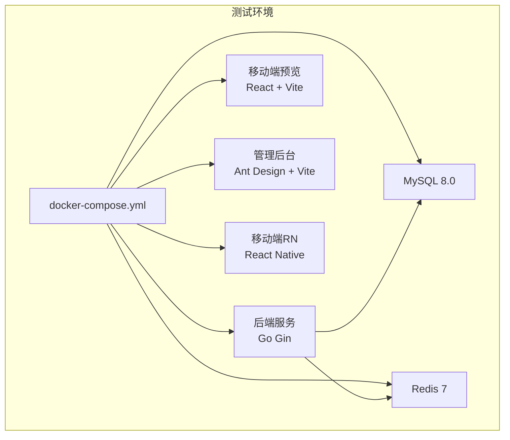
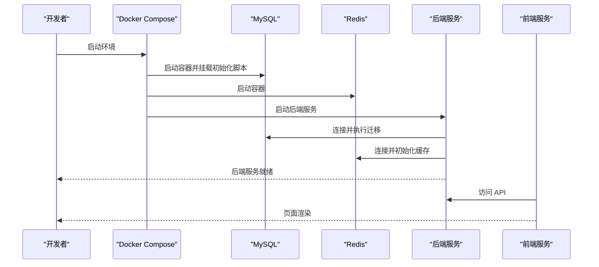
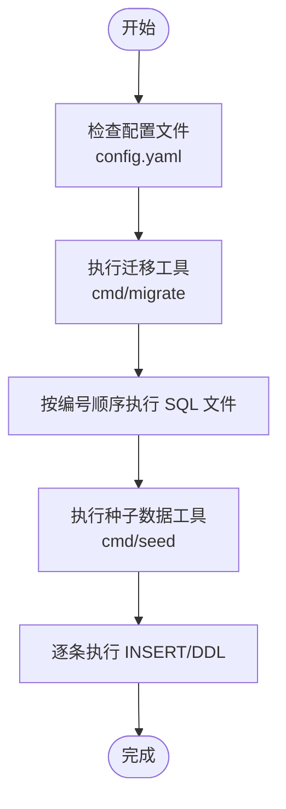
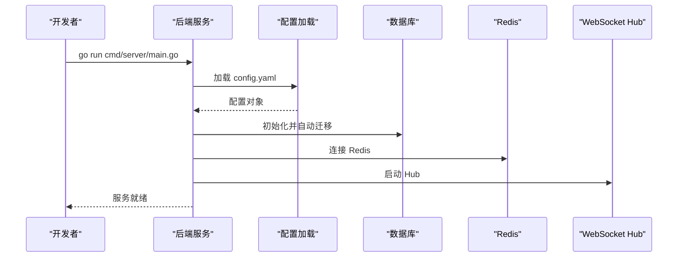
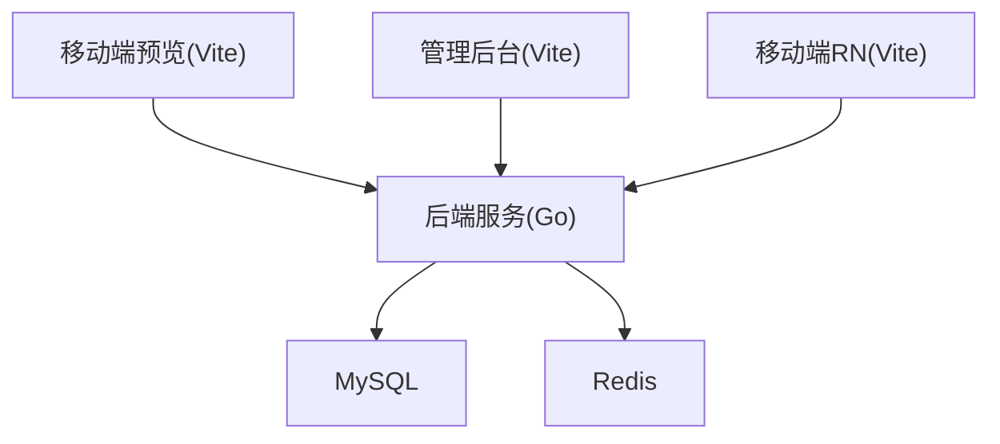

# 测试环境配置

<cite>
**本文引用的文件**
- [docker-compose.yml](file://docker/docker-compose.yml)
- [config.example.yaml](file://backend/config.example.yaml)
- [001_init_schema.sql](file://backend/migrations/001_init_schema.sql)
- [002_seed_data.sql](file://backend/migrations/002_seed_data.sql)
- [migrate/main.go](file://backend/cmd/migrate/main.go)
- [seed/main.go](file://backend/cmd/seed/main.go)
- [server/main.go](file://backend/cmd/server/main.go)
- [phase10_role_acceptance.sh](file://backend/scripts/phase10_role_acceptance.sh)
- [DEMO_ACCOUNTS.md](file://DEMO_ACCOUNTS.md)
- [TEST_CHECKLIST.md](file://TEST_CHECKLIST.md)
- [README.md](file://README.md)
- [package.json](file://mobile-preview/package.json)
- [package.json](file://admin/package.json)
- [package.json](file://mobile/package.json)
</cite>

## 目录
1. [简介](#简介)
2. [项目结构](#项目结构)
3. [核心组件](#核心组件)
4. [架构概览](#架构概览)
5. [详细组件分析](#详细组件分析)
6. [依赖关系分析](#依赖关系分析)
7. [性能考虑](#性能考虑)
8. [故障排除指南](#故障排除指南)
9. [结论](#结论)
10. [附录](#附录)

## 简介
本文件为无人机租赁平台的完整测试环境配置指南，目标是帮助测试工程师与开发者快速搭建包含 MySQL、Redis、后端服务、移动端预览与管理后台的测试环境。文档基于仓库中的 docker-compose.yml 与 config.example.yaml，详细说明环境变量配置、服务端口映射、数据库初始化与测试数据准备流程，并提供不同测试场景（压力测试、集成测试、性能测试）的差异化配置方案，以及常见问题的故障排除方法。

## 项目结构
测试环境涉及的关键目录与文件如下：
- Docker 编排：docker/docker-compose.yml
- 后端配置模板：backend/config.example.yaml
- 数据库迁移脚本：backend/migrations/*.sql
- 数据迁移与种子数据工具：backend/cmd/migrate/main.go、backend/cmd/seed/main.go
- 后端服务启动入口：backend/cmd/server/main.go
- 自动化验收脚本：backend/scripts/phase10_role_acceptance.sh
- 测试与演示文档：DEMO_ACCOUNTS.md、TEST_CHECKLIST.md、README.md
- 前端服务：mobile-preview、admin、mobile

**图表来源**
- [docker-compose.yml:1-27](file://docker/docker-compose.yml#L1-L27)
- [server/main.go:52-104](file://backend/cmd/server/main.go#L52-L104)
- [package.json:6-11](file://mobile-preview/package.json#L6-L11)
- [package.json:5-9](file://admin/package.json#L5-L9)
- [package.json:5-13](file://mobile/package.json#L5-L13)

**章节来源**
- [docker-compose.yml:1-27](file://docker/docker-compose.yml#L1-L27)
- [README.md:1-29](file://README.md#L1-L29)

## 核心组件
- 依赖服务
  - MySQL 8.0：持久化存储，初始化脚本位于 backend/migrations/001_init_schema.sql，测试数据位于 backend/migrations/002_seed_data.sql
  - Redis 7：验证码缓存、会话与限流
- 后端服务
  - Go Gin 应用，支持 v1/v2 API，自动迁移与配置校验，WebSocket Hub
- 前端服务
  - 移动端预览：React + Vite，端口 3100
  - 管理后台：Ant Design + Vite，端口 3000
  - 移动端 RN：React Native + React Native Web，端口 8080（后端）

**章节来源**
- [docker-compose.yml:3-22](file://docker/docker-compose.yml#L3-L22)
- [001_init_schema.sql:1-200](file://backend/migrations/001_init_schema.sql#L1-L200)
- [002_seed_data.sql:1-178](file://backend/migrations/002_seed_data.sql#L1-L178)
- [server/main.go:52-104](file://backend/cmd/server/main.go#L52-L104)
- [package.json:6-11](file://mobile-preview/package.json#L6-L11)
- [package.json:5-9](file://admin/package.json#L5-L9)
- [package.json:5-13](file://mobile/package.json#L5-L13)

## 架构概览
测试环境采用 Docker Compose 编排，MySQL 与 Redis 作为后端依赖，后端服务启动后自动执行数据库迁移与种子数据导入，前端服务通过 Vite 开发服务器提供界面。

**图表来源**
- [docker-compose.yml:1-27](file://docker/docker-compose.yml#L1-L27)
- [migrate/main.go:25-87](file://backend/cmd/migrate/main.go#L25-L87)
- [seed/main.go:16-40](file://backend/cmd/seed/main.go#L16-L40)
- [server/main.go:86-104](file://backend/cmd/server/main.go#L86-L104)

## 详细组件分析

### 1. Docker Compose 服务编排
- MySQL 服务
  - 镜像：mysql:8.0
  - 环境变量：ROOT 密码、数据库名
  - 端口映射：3306:3306
  - 初始化：挂载 backend/migrations/001_init_schema.sql 作为初始化脚本
  - 命令：设置字符集与认证插件
- Redis 服务
  - 镜像：redis:7-alpine
  - 端口映射：6379:6379
  - 数据卷：redis_data
- 数据卷
  - mysql_data、redis_data

**章节来源**
- [docker-compose.yml:1-27](file://docker/docker-compose.yml#L1-L27)

### 2. 后端配置模板与环境变量
- 服务器配置
  - 端口：8080
  - 运行模式：debug（开发模式）
- 数据库配置
  - 主机：127.0.0.1
  - 端口：3306
  - 用户/密码：需修改
  - 数据库名：wurenji
  - 字符集：utf8mb4
  - 连接池：最大空闲连接、最大打开连接
- Redis 配置
  - 主机：127.0.0.1
  - 端口：6379
  - 密码：留空（开发）
  - DB：0
- JWT 配置
  - 密钥：至少32位随机字符串
  - Access/Refresh 过期时间
- 文件上传配置
  - 最大文件大小、保存路径、允许扩展名
- 短信服务配置
  - provider：mock（开发测试）
  - 签名名称、模板ID
- 支付配置
  - 平台佣金比例
  - 微信/支付宝参数（开发可留空）
- 高德地图配置
  - Web服务 API Key、Web端 Key
- WebSocket 配置
  - 最大消息大小、写入超时、Pong/Ping 参数
- 日志配置
  - 级别、输出方式、文件路径、轮转参数
- CORS 配置
  - 允许的源、方法、头
- 推送服务配置
  - provider：mock
- OAuth 配置
  - 微信/QQ 登录参数

**章节来源**
- [config.example.yaml:14-338](file://backend/config.example.yaml#L14-L338)

### 3. 数据库初始化与种子数据
- 初始化脚本
  - backend/migrations/001_init_schema.sql：创建数据库与核心表（用户、无人机、订单、支付等）
- 种子数据脚本
  - backend/migrations/002_seed_data.sql：插入测试用户、无人机、订单、消息、评价等数据
- 迁移工具
  - backend/cmd/migrate/main.go：扫描 migrations 目录，按编号顺序执行 SQL 文件
- 种子数据工具
  - backend/cmd/seed/main.go：读取 002_seed_data.sql 并逐条执行 INSERT/DDL

**图表来源**
- [migrate/main.go:25-87](file://backend/cmd/migrate/main.go#L25-L87)
- [seed/main.go:16-109](file://backend/cmd/seed/main.go#L16-L109)
- [001_init_schema.sql:1-200](file://backend/migrations/001_init_schema.sql#L1-L200)
- [002_seed_data.sql:1-178](file://backend/migrations/002_seed_data.sql#L1-L178)

**章节来源**
- [migrate/main.go:25-87](file://backend/cmd/migrate/main.go#L25-L87)
- [seed/main.go:16-109](file://backend/cmd/seed/main.go#L16-L109)
- [001_init_schema.sql:1-200](file://backend/migrations/001_init_schema.sql#L1-L200)
- [002_seed_data.sql:1-178](file://backend/migrations/002_seed_data.sql#L1-L178)

### 4. 后端服务启动与自动迁移
- 启动入口
  - backend/cmd/server/main.go：加载配置、校验配置、初始化日志、数据库、Redis、WebSocket Hub
- 自动迁移
  - 通过 GORM 执行数据库迁移，确保表结构与配置一致
- 依赖注入
  - 仓储层、服务层、短信、上传、支付、推送、OAuth 等服务初始化

**图表来源**
- [server/main.go:52-104](file://backend/cmd/server/main.go#L52-L104)
- [server/main.go:182-200](file://backend/cmd/server/main.go#L182-L200)

**章节来源**
- [server/main.go:52-104](file://backend/cmd/server/main.go#L52-L104)
- [server/main.go:182-200](file://backend/cmd/server/main.go#L182-L200)

### 5. 前端服务与端口映射
- 移动端预览
  - 脚本：npm run dev
  - 端口：3100
- 管理后台
  - 脚本：npm run dev
  - 端口：3000
- 移动端 RN
  - 脚本：npm run web
  - 端口：8080（后端 API）
- 访问地址
  - 移动端预览：http://localhost:3100
  - 管理后台：http://localhost:3000
  - 后端 API：http://localhost:8080

**章节来源**
- [package.json:6-11](file://mobile-preview/package.json#L6-L11)
- [package.json:5-9](file://admin/package.json#L5-L9)
- [package.json:5-13](file://mobile/package.json#L5-L13)
- [TEST_CHECKLIST.md:42-61](file://TEST_CHECKLIST.md#L42-L61)

### 6. 自动化验收与测试数据准备
- 自动化验收脚本
  - backend/scripts/phase10_role_acceptance.sh：自动准备演示数据、登录、创建需求、报价、下单、支付、派单等全流程
  - 支持环境变量：BASE_URL、REDIS_*、MYSQL_*、PREPARE_DEMO_DATA、演示账号等
- 演示账号
  - DEMO_ACCOUNTS.md：提供客户、机主、飞手、复合身份的手机号与角色摘要
- 测试清单
  - TEST_CHECKLIST.md：包含 API 测试命令、常见问题排查、预置账号与无人机数据说明

**章节来源**
- [phase10_role_acceptance.sh:1-606](file://backend/scripts/phase10_role_acceptance.sh#L1-L606)
- [DEMO_ACCOUNTS.md:1-116](file://DEMO_ACCOUNTS.md#L1-L116)
- [TEST_CHECKLIST.md:1-448](file://TEST_CHECKLIST.md#L1-L448)

## 依赖关系分析
- 组件耦合
  - 后端服务依赖 MySQL 与 Redis；前端通过后端 API 交互
- 外部依赖
  - Docker Compose、Go 运行时、Node.js 生态（Vite、React、Ant Design）
- 配置契约
  - config.yaml 中的数据库、Redis、JWT、短信、支付、地图、推送、OAuth 等配置项直接影响服务行为

**图表来源**
- [server/main.go:86-104](file://backend/cmd/server/main.go#L86-L104)
- [docker-compose.yml:1-27](file://docker/docker-compose.yml#L1-L27)
- [package.json:6-11](file://mobile-preview/package.json#L6-L11)
- [package.json:5-9](file://admin/package.json#L5-L9)
- [package.json:5-13](file://mobile/package.json#L5-L13)

**章节来源**
- [server/main.go:86-104](file://backend/cmd/server/main.go#L86-L104)
- [docker-compose.yml:1-27](file://docker/docker-compose.yml#L1-L27)

## 性能考虑
- 数据库连接池
  - 合理设置 max_idle_conns 与 max_open_conns，避免连接过多导致资源紧张
- Redis 缓存
  - 验证码、会话与限流使用 Redis，建议在测试环境中开启持久化与合理内存上限
- 后端并发
  - Gin 默认并发模型，建议在压力测试时观察 CPU/内存占用，必要时调整运行模式与日志级别
- 前端构建
  - 开发模式下使用 Vite 热更新，生产构建建议使用生产模式优化包体与加载性能

## 故障排除指南
- 无法发送验证码
  - 检查后端服务是否启动：curl http://localhost:8080/api/v1/auth/send-code
  - 检查 Redis 是否运行：docker ps | grep redis
- 登录后页面空白
  - 检查浏览器控制台错误
  - 确认 API 地址配置正确
- 接口返回 401
  - Token 已过期，重新登录获取新 Token
  - 检查 Authorization 头格式：Bearer <token>
- 数据库连接失败
  - 检查 MySQL 容器：docker ps | grep mysql
  - 检查配置文件：backend/config.yaml
- 验证码读取为空
  - 使用 docker exec wurenji-redis redis-cli GET "sms:code:<手机号>"
- 端口冲突
  - 修改 docker-compose.yml 中的端口映射或停止占用进程

**章节来源**
- [TEST_CHECKLIST.md:431-448](file://TEST_CHECKLIST.md#L431-L448)
- [TEST_CHECKLIST.md:369-412](file://TEST_CHECKLIST.md#L369-L412)

## 结论
通过 docker-compose.yml 与 config.example.yaml 的配合，测试团队可以快速搭建包含 MySQL、Redis、后端服务、移动端预览与管理后台的完整测试环境。配合迁移与种子数据工具，以及自动化验收脚本，能够高效完成角色验收与功能回归测试。针对不同测试场景，建议在 config.yaml 中调整数据库连接池、日志级别与运行模式，并在 docker-compose.yml 中按需增加资源限制与网络策略。

## 附录

### A. 环境变量与配置要点
- 后端配置文件：backend/config.yaml（复制 config.example.yaml 并按需修改）
- 关键配置项
  - database.host/port/user/password/dbname
  - redis.host/port/password/db
  - jwt.secret/access_expire/refresh_expire
  - server.port/mode
  - sms.provider/sign_name/template_code
  - upload.save_path/max_size/allowed_exts
  - amap.api_key/web_key
  - websocket.* 与 log.*、cors.*、push.*、oauth.*

**章节来源**
- [config.example.yaml:14-338](file://backend/config.example.yaml#L14-L338)

### B. 端口映射与访问地址
- MySQL：3306:3306
- Redis：6379:6379
- 后端 API：8080
- 移动端预览：3100
- 管理后台：3000

**章节来源**
- [docker-compose.yml:9-22](file://docker/docker-compose.yml#L9-L22)
- [TEST_CHECKLIST.md:42-61](file://TEST_CHECKLIST.md#L42-L61)

### C. 不同测试场景的差异化配置
- 压力测试环境
  - 后端：将 server.mode 设为 release，减少日志输出
  - 数据库：适当提高 max_open_conns，启用连接复用
  - Redis：开启持久化与内存上限，避免 OOM
- 集成测试环境
  - 后端：保持 debug 模式，便于调试
  - 数据库：使用独立测试库，避免污染主测试数据
  - 前端：使用代理或 Mock API，隔离外部依赖
- 性能测试环境
  - 后端：启用 pprof 或性能分析工具（如需要）
  - 数据库：使用专用测试实例，关闭冗余日志
  - Redis：使用内存型存储，缩短持久化周期

[本节为通用指导，无需特定文件引用]

### D. 环境搭建步骤（基于仓库文件）
- 准备工作
  - 复制配置文件：cp backend/config.example.yaml backend/config.yaml
  - 修改 config.yaml 中的数据库、Redis、JWT、短信、支付、地图、推送、OAuth 等配置
- 启动依赖服务
  - docker-compose up -d mysql redis
- 初始化数据库
  - 执行迁移：go run backend/cmd/migrate/main.go -dir backend/migrations
  - 执行种子数据：go run backend/cmd/seed/main.go
- 启动后端服务
  - go run backend/cmd/server/main.go
- 启动前端服务
  - 移动端预览：cd mobile-preview && npm run dev
  - 管理后台：cd admin && npm run dev
- 验收与测试
  - 执行自动化验收脚本：cd backend && PREPARE_DEMO_DATA=1 ./scripts/phase10_role_acceptance.sh
  - 参考测试清单与演示账号进行功能验证

**章节来源**
- [docker-compose.yml:1-27](file://docker/docker-compose.yml#L1-L27)
- [config.example.yaml:14-338](file://backend/config.example.yaml#L14-L338)
- [migrate/main.go:25-87](file://backend/cmd/migrate/main.go#L25-L87)
- [seed/main.go:16-109](file://backend/cmd/seed/main.go#L16-L109)
- [server/main.go:52-104](file://backend/cmd/server/main.go#L52-L104)
- [phase10_role_acceptance.sh:1-606](file://backend/scripts/phase10_role_acceptance.sh#L1-L606)
- [TEST_CHECKLIST.md:42-61](file://TEST_CHECKLIST.md#L42-L61)
- [DEMO_ACCOUNTS.md:1-116](file://DEMO_ACCOUNTS.md#L1-L116)