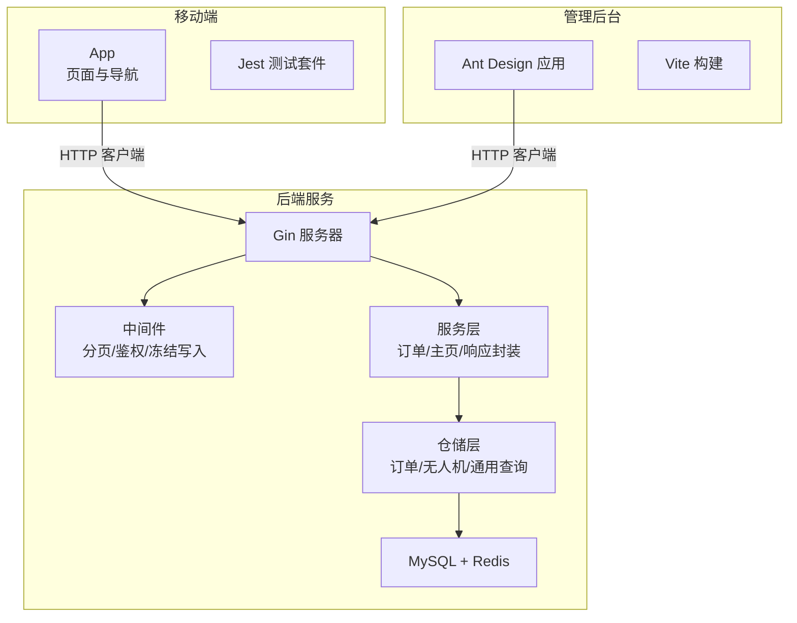
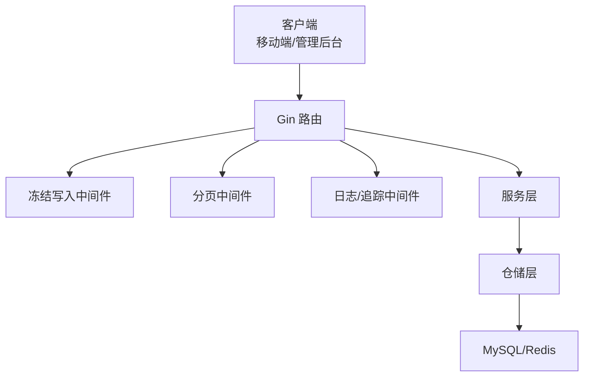
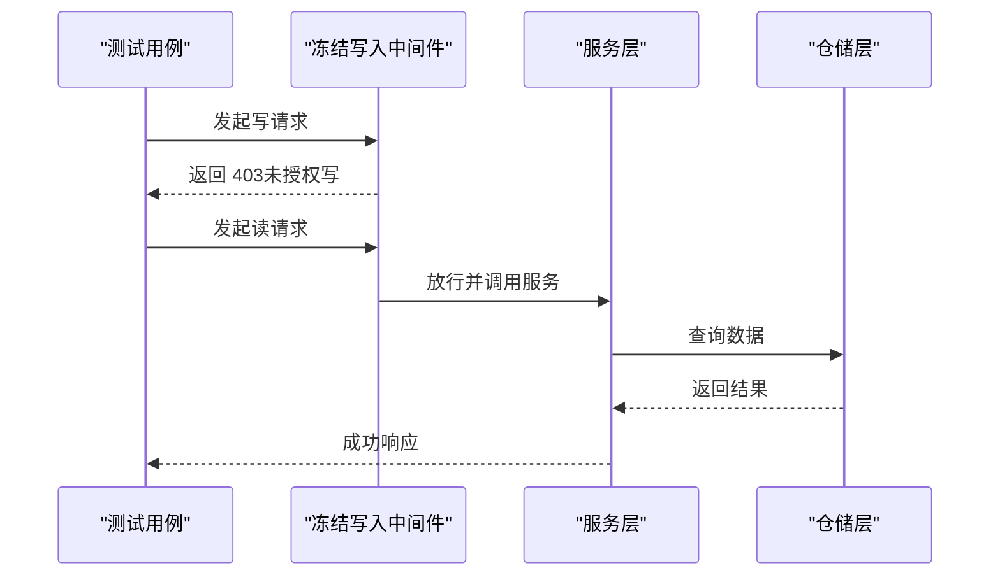
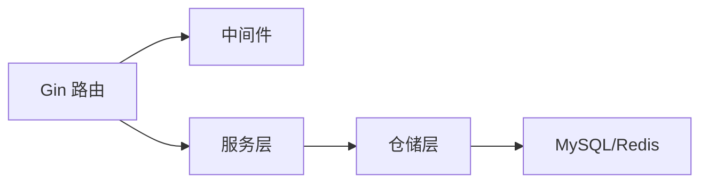

# 测试规范要求

<cite>
**本文引用的文件**
- [mobile/jest.config.js](file://mobile/jest.config.js)
- [mobile/package.json](file://mobile/package.json)
- [mobile/__tests__/App.test.tsx](file://mobile/__tests__/App.test.tsx)
- [mobile/README.md](file://mobile/README.md)
- [backend/go.mod](file://backend/go.mod)
- [backend/cmd/server/main.go](file://backend/cmd/server/main.go)
- [backend/internal/api/middleware/legacy_write_freeze_test.go](file://backend/internal/api/middleware/legacy_write_freeze_test.go)
- [backend/internal/api/middleware/pagination_test.go](file://backend/internal/api/middleware/pagination_test.go)
- [backend/internal/pkg/response/v2_test.go](file://backend/internal/pkg/response/v2_test.go)
- [backend/internal/model/drone_test.go](file://backend/internal/model/drone_test.go)
- [backend/internal/repository/order_repo_test.go](file://backend/internal/repository/order_repo_test.go)
- [backend/internal/service/home_service_test.go](file://backend/internal/service/home_service_test.go)
- [backend/internal/service/order_service_test.go](file://backend/internal/service/order_service_test.go)
- [TEST_CHECKLIST.md](file://TEST_CHECKLIST.md)
- [MOBILE_REGRESSION_ACCEPTANCE.md](file://MOBILE_REGRESSION_ACCEPTANCE.md)
- [README.md](file://README.md)
</cite>

## 目录
1. [引言](#引言)
2. [项目结构](#项目结构)
3. [核心组件](#核心组件)
4. [架构总览](#架构总览)
5. [详细组件分析](#详细组件分析)
6. [依赖分析](#依赖分析)
7. [性能考虑](#性能考虑)
8. [故障排查指南](#故障排查指南)
9. [结论](#结论)
10. [附录](#附录)

## 引言
本测试规范面向无人机租赁平台（v2 业务模型），旨在建立统一的测试方法论与实施标准，覆盖单元测试、集成测试、端到端测试、性能测试、移动端专项测试与回归测试策略。文档结合仓库现有测试脚手架与验收清单，给出可落地的测试用例设计原则、测试数据准备、测试环境配置、自动化测试流程、测试报告与缺陷跟踪建议，并提供最佳实践与示例路径，确保质量与覆盖率。

## 项目结构
平台由三部分组成：
- 移动端应用（React Native）：负责用户交互、业务页面与移动端特性。
- 管理后台（React/Vite）：负责运营与管理功能。
- 后端服务（Go/Gin）：提供 REST API、中间件、服务层与数据访问层。

图表来源
- [mobile/package.json:1-63](file://mobile/package.json#L1-L63)
- [backend/go.mod:1-80](file://backend/go.mod#L1-L80)
- [backend/cmd/server/main.go](file://backend/cmd/server/main.go)

章节来源
- [README.md:1-29](file://README.md#L1-L29)
- [mobile/package.json:1-63](file://mobile/package.json#L1-L63)
- [backend/go.mod:1-80](file://backend/go.mod#L1-L80)

## 核心组件
- 移动端测试基础
  - Jest 预设与测试脚本：移动端已配置 Jest 与测试脚本，便于单元测试与渲染测试。
  - 示例测试：包含基础渲染测试，可扩展为页面与组件级测试。
- 后端测试基础
  - Gin 中间件测试：分页中间件、冻结写入中间件、响应封装测试，验证请求参数校验、安全策略与统一响应格式。
  - 服务层测试：主页汇总、直连订单金额计算、地址与时间窗口解析等。
  - 模型与仓储测试：无人机阈值判断、市场准入、订单空值字段归一化等。

章节来源
- [mobile/jest.config.js:1-4](file://mobile/jest.config.js#L1-L4)
- [mobile/__tests__/App.test.tsx:1-14](file://mobile/__tests__/App.test.tsx#L1-L14)
- [backend/internal/api/middleware/pagination_test.go:1-42](file://backend/internal/api/middleware/pagination_test.go#L1-L42)
- [backend/internal/api/middleware/legacy_write_freeze_test.go:1-82](file://backend/internal/api/middleware/legacy_write_freeze_test.go#L1-L82)
- [backend/internal/pkg/response/v2_test.go:1-80](file://backend/internal/pkg/response/v2_test.go#L1-L80)
- [backend/internal/service/home_service_test.go:1-62](file://backend/internal/service/home_service_test.go#L1-L62)
- [backend/internal/service/order_service_test.go:1-105](file://backend/internal/service/order_service_test.go#L1-L105)
- [backend/internal/model/drone_test.go:1-39](file://backend/internal/model/drone_test.go#L1-L39)
- [backend/internal/repository/order_repo_test.go:1-25](file://backend/internal/repository/order_repo_test.go#L1-L25)

## 架构总览
后端采用分层架构：路由层（Gin）、中间件层（鉴权/跨域/冻结写入/分页/日志/追踪 ID）、服务层（业务逻辑）、仓储层（数据库访问）、外部服务（短信/支付/地图）。统一响应体与 Trace ID 便于端到端追踪与问题定位。

图表来源
- [backend/internal/api/middleware/legacy_write_freeze_test.go:12-43](file://backend/internal/api/middleware/legacy_write_freeze_test.go#L12-L43)
- [backend/internal/api/middleware/pagination_test.go:11-34](file://backend/internal/api/middleware/pagination_test.go#L11-L34)
- [backend/internal/pkg/response/v2_test.go:12-50](file://backend/internal/pkg/response/v2_test.go#L12-L50)

## 详细组件分析

### 单元测试规范
- 测试组织
  - 移动端：使用 Jest 预设，测试文件位于 mobile/__tests__，示例渲染测试可扩展为组件快照与交互测试。
  - 后端：按模块划分测试文件（middleware、service、repository、model），保持与源码目录一致。
- 断言与期望
  - 响应码与负载结构：统一响应体包含 code、trace_id、meta 等字段；错误场景断言 4xx/5xx 与错误码。
  - 参数边界：分页参数越界时应被限制到最大值；冻结写入中间件对写操作应返回 403。
  - 业务逻辑：直连订单金额计算、地址与时间窗口解析、无人机准入条件等。
- 测试数据
  - 使用结构化输入构造边界与异常场景（零值、负数、空字符串、nil、越界值）。
  - 使用固定时间戳与坐标模拟典型业务场景，保证可重复性。

章节来源
- [mobile/jest.config.js:1-4](file://mobile/jest.config.js#L1-L4)
- [mobile/__tests__/App.test.tsx:9-13](file://mobile/__tests__/App.test.tsx#L9-L13)
- [backend/internal/pkg/response/v2_test.go:12-50](file://backend/internal/pkg/response/v2_test.go#L12-L50)
- [backend/internal/api/middleware/legacy_write_freeze_test.go:12-43](file://backend/internal/api/middleware/legacy_write_freeze_test.go#L12-L43)
- [backend/internal/api/middleware/pagination_test.go:11-34](file://backend/internal/api/middleware/pagination_test.go#L11-L34)
- [backend/internal/service/order_service_test.go:11-104](file://backend/internal/service/order_service_test.go#L11-L104)
- [backend/internal/model/drone_test.go:5-38](file://backend/internal/model/drone_test.go#L5-L38)
- [backend/internal/repository/order_repo_test.go:5-24](file://backend/internal/repository/order_repo_test.go#L5-L24)

### 集成测试策略
- 接口契约与版本差异
  - 使用 OpenAPI v2 文档与 API v1/v2 差异对照，明确接口行为与字段约束，避免回归。
- 中间件与服务链路
  - 冻结写入中间件：对特定路径组启用写操作冻结，管理员路径可绕过，验证 403 与放行。
  - 分页中间件：校验默认值与上限，确保列表接口稳定性。
  - 响应封装：统一 code、trace_id、meta.page/page_size/total，便于端到端校验。
- 数据访问层
  - 订单空值字段归一化：将 pilot_id=0 归一为 nil，避免脏数据污染。
  - 无人机准入与阈值：验证 MTOW/MaxPayload 与认证状态组合下的市场准入。

图表来源
- [backend/internal/api/middleware/legacy_write_freeze_test.go:12-43](file://backend/internal/api/middleware/legacy_write_freeze_test.go#L12-L43)

章节来源
- [backend/internal/api/middleware/legacy_write_freeze_test.go:12-82](file://backend/internal/api/middleware/legacy_write_freeze_test.go#L12-L82)
- [backend/internal/api/middleware/pagination_test.go:11-42](file://backend/internal/api/middleware/pagination_test.go#L11-L42)
- [backend/internal/pkg/response/v2_test.go:12-80](file://backend/internal/pkg/response/v2_test.go#L12-L80)
- [backend/internal/repository/order_repo_test.go:5-24](file://backend/internal/repository/order_repo_test.go#L5-L24)
- [backend/internal/model/drone_test.go:5-38](file://backend/internal/model/drone_test.go#L5-L38)

### 端到端测试要求
- 环境与启动
  - 后端：监听 8080 端口；可使用 server/main.go 启动。
  - 移动端预览：监听 3100 端口；管理后台：监听 3000 端口。
- 验收清单与截图基线
  - 使用功能测试清单进行手动验收，结合移动端关键页面回归与截图验收标准，形成可重复的回归矩阵。
- 数据与账号
  - 预置测试账号与无人机数据，便于快速验证登录、下单、派单、支付、飞行监控等主链路。

章节来源
- [TEST_CHECKLIST.md:42-61](file://TEST_CHECKLIST.md#L42-L61)
- [TEST_CHECKLIST.md:369-412](file://TEST_CHECKLIST.md#L369-L412)
- [MOBILE_REGRESSION_ACCEPTANCE.md:14-33](file://MOBILE_REGRESSION_ACCEPTANCE.md#L14-L33)

### 性能测试标准
- 接口性能
  - 列表接口：分页上限与默认值需满足性能目标；避免一次性返回超大数据集。
  - 计算密集型：直连订单金额计算应考虑时间与距离计算的复杂度，必要时引入缓存或降采样。
- 并发与稳定性
  - 冻结写入中间件在高并发下应保持一致的拒绝策略，防止脏写。
- 监控与追踪
  - 统一 trace_id 便于端到端链路追踪与性能瓶颈定位。

章节来源
- [backend/internal/api/middleware/pagination_test.go:11-34](file://backend/internal/api/middleware/pagination_test.go#L11-L34)
- [backend/internal/pkg/response/v2_test.go:12-50](file://backend/internal/pkg/response/v2_test.go#L12-L50)
- [backend/internal/service/order_service_test.go:11-68](file://backend/internal/service/order_service_test.go#L11-L68)

### 测试用例设计原则
- 覆盖率与边界
  - 业务函数：正向、反向、边界值、空值、非法字符。
  - 接口：2xx/4xx/5xx 场景，含鉴权缺失、参数越界、资源不存在。
- 可重复性
  - 使用固定种子数据与时间戳，避免随机性导致的不稳定。
- 可观测性
  - 统一响应体与 trace_id，便于日志关联与问题复现。

章节来源
- [backend/internal/service/order_service_test.go:70-104](file://backend/internal/service/order_service_test.go#L70-L104)
- [backend/internal/pkg/response/v2_test.go:52-79](file://backend/internal/pkg/response/v2_test.go#L52-L79)

### 测试数据准备
- 账号与角色
  - 使用预置账号进行登录与功能验证；管理员账号用于后台管理。
- 业务数据
  - 无人机列表、需求/供给、订单、派单、飞行记录等，确保主链路可用。
- 环境变量
  - 后端可通过脚本准备演示数据，便于自动化验收。

章节来源
- [TEST_CHECKLIST.md:416-448](file://TEST_CHECKLIST.md#L416-L448)

### 测试环境配置
- 移动端
  - 使用 npm 脚本启动测试与开发；Jest 预设已配置。
- 后端
  - Go 模块依赖已声明；可直接运行 server/main.go。
- 管理后台
  - Vite 开发与构建脚本可用。

章节来源
- [mobile/package.json:5-12](file://mobile/package.json#L5-L12)
- [backend/go.mod:1-80](file://backend/go.mod#L1-L80)

### 自动化测试流程
- 单元测试
  - 移动端：npm test 或 Jest 命令；后端：go test。
- 集成测试
  - 通过中间件与服务层测试验证链路；结合 OpenAPI 文档与差异对照。
- 端到端测试
  - 使用功能测试清单与移动端回归截图基线，形成可重复的验收矩阵。
- 性能测试
  - 对关键接口进行压力与稳定性测试，关注分页与计算成本。

章节来源
- [mobile/package.json:5-12](file://mobile/package.json#L5-L12)
- [backend/cmd/server/main.go](file://backend/cmd/server/main.go)

### 测试报告与缺陷跟踪
- 报告
  - 单元测试输出应包含通过/失败统计；端到端验收建议附带截图与 trace_id。
- 缺陷跟踪
  - 每个缺陷应包含：重现步骤、预期/实际结果、trace_id、截图、环境信息。
- 回归基线
  - 移动端关键页面回归矩阵与截图命名规范，确保回归可执行与可比对。

章节来源
- [MOBILE_REGRESSION_ACCEPTANCE.md:272-318](file://MOBILE_REGRESSION_ACCEPTANCE.md#L272-L318)

### 移动端专项测试要求
- 截图验收
  - 关注页面对象边界、角色入口、状态/编号/来源标签一致性、布局截断与错位。
- 加载态/错误态/空状态
  - 每个主列表页补充空状态、首屏加载态、请求失败态检查。
- 命名规范
  - 建议使用统一命名格式，便于版本对比与归档。

章节来源
- [MOBILE_REGRESSION_ACCEPTANCE.md:35-46](file://MOBILE_REGRESSION_ACCEPTANCE.md#L35-L46)
- [MOBILE_REGRESSION_ACCEPTANCE.md:244-261](file://MOBILE_REGRESSION_ACCEPTANCE.md#L244-L261)
- [MOBILE_REGRESSION_ACCEPTANCE.md:272-318](file://MOBILE_REGRESSION_ACCEPTANCE.md#L272-L318)

## 依赖分析
- 组件耦合
  - 路由层依赖中间件与服务层；服务层依赖仓储层；仓储层依赖数据库。
- 外部依赖
  - MySQL/Redis 用于持久化；短信/支付/地图等外部服务通过封装接入。
- 循环依赖
  - 按层解耦，避免模块间循环导入。

图表来源
- [backend/go.mod:5-21](file://backend/go.mod#L5-L21)

章节来源
- [backend/go.mod:1-80](file://backend/go.mod#L1-L80)

## 性能考虑
- 列表接口
  - 分页上限与默认值需平衡用户体验与系统负载。
- 计算成本
  - 距离与时间计算应避免在热路径重复计算，必要时引入缓存。
- 并发控制
  - 冻结写入中间件在高并发下保持一致策略，防止数据竞争。

章节来源
- [backend/internal/api/middleware/pagination_test.go:11-34](file://backend/internal/api/middleware/pagination_test.go#L11-L34)
- [backend/internal/service/order_service_test.go:37-68](file://backend/internal/service/order_service_test.go#L37-L68)

## 故障排查指南
- 无法发送验证码
  - 检查后端服务与 Redis 是否运行。
- 登录后页面空白
  - 检查浏览器控制台与 API 地址配置。
- 接口返回 401
  - Token 过期或 Authorization 头格式错误。
- 数据库连接失败
  - 检查 MySQL 容器与配置文件。

章节来源
- [TEST_CHECKLIST.md:431-448](file://TEST_CHECKLIST.md#L431-L448)

## 结论
本测试规范以仓库现有测试脚手架与验收清单为基础，明确了单元、集成、端到端与性能测试的实施路径与标准。通过统一的响应体、中间件策略与移动端回归基线，确保测试可执行、可回归、可追踪。建议在持续集成中引入自动化测试与截图验收，配合缺陷跟踪与回归矩阵，持续提升平台质量与交付效率。

## 附录
- 测试清单与验收基线
  - 功能测试清单与移动端关键页面回归矩阵，作为验收与回归执行依据。
- API 文档与契约
  - OpenAPI v2、API v1/v2 差异对照与业务 API 契约，指导接口测试与回归。

章节来源
- [TEST_CHECKLIST.md:1-448](file://TEST_CHECKLIST.md#L1-L448)
- [MOBILE_REGRESSION_ACCEPTANCE.md:1-337](file://MOBILE_REGRESSION_ACCEPTANCE.md#L1-L337)
- [README.md:9-28](file://README.md#L9-L28)