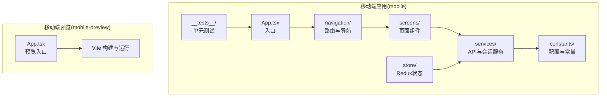
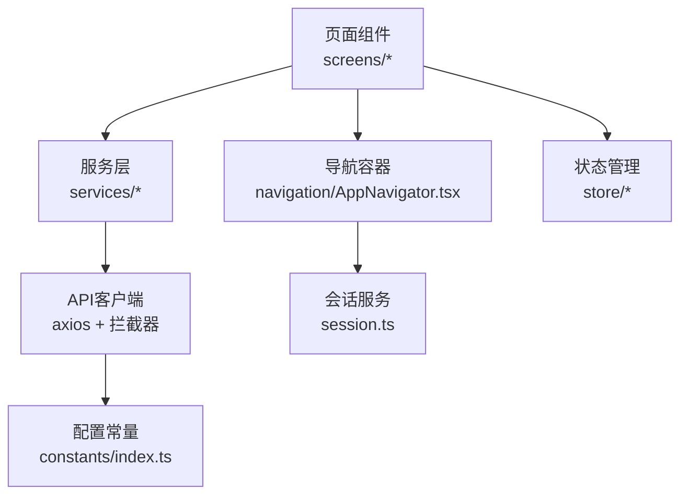
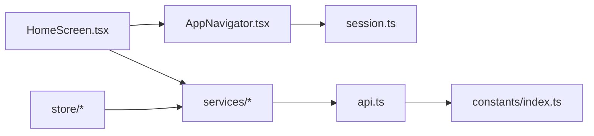

# 移动端回归测试

<cite>
**本文引用的文件**
- [MOBILE_REGRESSION_ACCEPTANCE.md](file://MOBILE_REGRESSION_ACCEPTANCE.md)
- [mobile/README.md](file://mobile/README.md)
- [mobile/__tests__/App.test.tsx](file://mobile/__tests__/App.test.tsx)
- [mobile/jest.config.js](file://mobile/jest.config.js)
- [mobile/package.json](file://mobile/package.json)
- [mobile/src/constants/index.ts](file://mobile/src/constants/index.ts)
- [mobile/src/services/api.ts](file://mobile/src/services/api.ts)
- [mobile/src/services/session.ts](file://mobile/src/services/session.ts)
- [mobile/src/navigation/AppNavigator.tsx](file://mobile/src/navigation/AppNavigator.tsx)
- [mobile/src/screens/home/HomeScreen.tsx](file://mobile/src/screens/home/HomeScreen.tsx)
- [mobile-preview/README.md](file://mobile-preview/README.md)
</cite>

## 目录
1. [简介](#简介)
2. [项目结构](#项目结构)
3. [核心组件](#核心组件)
4. [架构总览](#架构总览)
5. [详细组件分析](#详细组件分析)
6. [依赖分析](#依赖分析)
7. [性能考虑](#性能考虑)
8. [故障排查指南](#故障排查指南)
9. [结论](#结论)
10. [附录](#附录)

## 简介
本文件面向无人机租赁平台移动端应用，基于仓库中的移动端回归与截图验收标准文档，制定一套可重复执行的移动端回归测试流程、测试范围与验收标准。内容覆盖UI界面回归测试、功能流程回归测试、性能回归测试、兼容性测试，并提供移动端预览版本的测试方法、截图验收标准、版本对比策略；解释跨平台兼容性测试（iOS/Android）、不同屏幕尺寸适配测试、网络环境模拟测试；包含回归测试报告模板、缺陷跟踪流程与测试结果评估标准。

## 项目结构
移动端应用采用 React Native + TypeScript 构建，包含以下关键目录与文件：
- 移动端工程：mobile
  - 源码：src（screens、services、navigation、store、components、utils、theme、types 等）
  - 测试：__tests__（Jest + React Test Renderer）
  - 构建与脚本：package.json、jest.config.js、metro.config.js、babel.config.js、vite.config.ts
  - 平台原生：android、ios
- 移动端预览版本：mobile-preview（React + Vite + TypeScript，用于Web端快速验证）

**图表来源**
- [mobile/src/navigation/AppNavigator.tsx](file://mobile/src/navigation/AppNavigator.tsx)
- [mobile/src/screens/home/HomeScreen.tsx](file://mobile/src/screens/home/HomeScreen.tsx)
- [mobile/src/services/api.ts](file://mobile/src/services/api.ts)
- [mobile/src/constants/index.ts](file://mobile/src/constants/index.ts)
- [mobile/__tests__/App.test.tsx](file://mobile/__tests__/App.test.tsx)
- [mobile-preview/README.md](file://mobile-preview/README.md)

**章节来源**
- [mobile/README.md](file://mobile/README.md)
- [mobile/package.json](file://mobile/package.json)
- [mobile/jest.config.js](file://mobile/jest.config.js)

## 核心组件
- 配置与常量
  - API 基础地址、v1/v2 版本切换、WebSocket 地址、超时等均通过常量集中管理，支持开发、测试、生产多环境与远程内网穿透配置。
- API 客户端与拦截器
  - 基于 axios 创建 v1/v2 客户端，统一注入鉴权头与业务响应拦截器，处理 401 自动刷新令牌、统一错误提示。
- 会话与引导
  - 登录态与用户资料通过会话服务拉取，启动时在导航容器中进行引导与 WebSocket 连接管理。
- 页面与导航
  - 首页驾驶舱根据角色动态渲染，支持综合/客户/机主/飞手视图，包含指标卡、快捷入口、待办事项等。
- 测试框架
  - Jest + React Test Renderer，提供基础渲染测试入口。

**章节来源**
- [mobile/src/constants/index.ts](file://mobile/src/constants/index.ts)
- [mobile/src/services/api.ts](file://mobile/src/services/api.ts)
- [mobile/src/services/session.ts](file://mobile/src/services/session.ts)
- [mobile/src/navigation/AppNavigator.tsx](file://mobile/src/navigation/AppNavigator.tsx)
- [mobile/src/screens/home/HomeScreen.tsx](file://mobile/src/screens/home/HomeScreen.tsx)
- [mobile/__tests__/App.test.tsx](file://mobile/__tests__/App.test.tsx)
- [mobile/jest.config.js](file://mobile/jest.config.js)

## 架构总览
移动端应用采用“页面组件 + 服务层 + 状态管理 + 配置常量”的分层架构。页面组件通过服务层调用 API，服务层通过 axios 客户端与拦截器与后端交互；状态管理负责登录态与用户资料；配置常量提供环境化参数。

**图表来源**
- [mobile/src/screens/home/HomeScreen.tsx](file://mobile/src/screens/home/HomeScreen.tsx)
- [mobile/src/services/api.ts](file://mobile/src/services/api.ts)
- [mobile/src/services/session.ts](file://mobile/src/services/session.ts)
- [mobile/src/navigation/AppNavigator.tsx](file://mobile/src/navigation/AppNavigator.tsx)
- [mobile/src/constants/index.ts](file://mobile/src/constants/index.ts)

## 详细组件分析

### 回归测试范围与验收标准
- 验收重点
  - 页面对象边界是否正确
  - 角色入口是否正确
  - 状态、编号、来源标签是否一致
  - 布局是否存在截断、溢出、错位、入口断链
- 验收环境
  - 后端：http://127.0.0.1:8080
  - 移动端 Web 预览：http://127.0.0.1:3100
  - 推荐截图宽度：手机 390 x 844；Web 预览 Chrome 设备模式 iPhone 14 Pro
  - 默认主链路已切到 /api/v2
- 关键页面域（已纳入 R10.02 回归基线）
  - 首页驾驶舱、供给市场、需求市场、订单、正式派单、飞行监控/记录、我的页
- 截图统一标准
  - 顶部标题完整可见、底部主操作区完整可见、卡片圆角/阴影/边距一致、编号/状态/来源标签/金额/动作可见、空状态说明与建议动作、错误/加载态不破坏布局、列表与详情状态文案一致

**章节来源**
- [MOBILE_REGRESSION_ACCEPTANCE.md](file://MOBILE_REGRESSION_ACCEPTANCE.md)

### UI 界面回归测试
- 测试目标
  - 验证关键页面在不同角色下的入口与展示一致性，确保布局与视觉规范符合验收标准。
- 测试要点
  - 首页驾驶舱：综合/机主/飞手视图切换、指标卡、快捷入口、待办事项、市场动态
  - 供给/需求市场：准入筛选、卡片信息完整性、列表与详情对象一致性
  - 订单/派单：状态口径与来源标签、详情摘要与时间线
  - 我的页：角色档案入口、绑定关系、统计数据与列表一致性
- 截图策略
  - 按验收矩阵要求对每类角色与场景拍摄截图，命名遵循建议格式

**章节来源**
- [MOBILE_REGRESSION_ACCEPTANCE.md](file://MOBILE_REGRESSION_ACCEPTANCE.md)

### 功能流程回归测试
- 测试目标
  - 验证从入口到关键节点的端到端流程，确保业务对象边界清晰、状态流转正确。
- 测试要点
  - 供给直达下单：详情页信息、下单确认页字段、提交后状态
  - 需求报价/候选：机主报价入口、飞手候选报名/取消、客户报价列表入口
  - 订单与派单：列表与详情状态一致、派单接受/重派入口
  - 飞行监控：两个入口进入同一监控页、监控摘要与时间线
- 用例设计
  - 使用真实账号在不同角色下执行，覆盖空状态、首屏加载态、请求失败态

**章节来源**
- [MOBILE_REGRESSION_ACCEPTANCE.md](file://MOBILE_REGRESSION_ACCEPTANCE.md)

### 性能回归测试
- 测试目标
  - 评估页面加载、渲染与交互性能，识别回归问题。
- 测试维度
  - 首屏加载时间、关键交互延迟、内存占用趋势
  - Web 预览与真机表现对比
- 工具与方法
  - 使用浏览器开发者工具或 React DevTools Profiler 进行性能采样
  - 在不同设备与网络条件下执行基准测试

**章节来源**
- [mobile-preview/README.md](file://mobile-preview/README.md)

### 兼容性测试
- 跨平台兼容性
  - iOS 与 Android 原生差异：导航栏高度、安全区、输入法遮挡、手势返回差异
  - Web 预览与移动端样式差异：字体、字号、间距、点击热区
- 屏幕尺寸适配
  - 小屏（< 390）、中屏（390±）、大屏（> 440）下的布局与排版
  - 横竖屏切换对关键信息可见性的影响
- 网络环境模拟
  - 低带宽、高延迟、弱网与断网场景下的错误提示与重试机制
  - 401 未授权自动刷新令牌流程的有效性

**章节来源**
- [mobile/src/constants/index.ts](file://mobile/src/constants/index.ts)
- [mobile/src/services/api.ts](file://mobile/src/services/api.ts)

### 移动端预览版本测试方法
- 启动与构建
  - 使用 Vite 启动预览服务，或构建产物进行静态部署
  - 通过 Chrome 设备模式模拟不同机型与屏幕尺寸
- 与移动端联调
  - 使用内网穿透或局域网 IP 访问后端接口，确保预览与移动端一致
  - 对比预览与真机在交互、动画、输入法遮挡等方面的差异

**章节来源**
- [mobile-preview/README.md](file://mobile-preview/README.md)
- [mobile/package.json](file://mobile/package.json)

### 截图验收标准与版本对比策略
- 截图标准
  - 顶部标题完整可见、底部主操作区完整可见、卡片圆角/阴影/边距一致、编号/状态/来源标签/金额/动作可见、空状态说明与建议动作、错误/加载态不破坏布局、列表与详情状态文案一致
- 命名规范
  - 建议使用：home-composite-YYYYMMDD.png、market-supplies-YYYYMMDD.png 等
- 版本对比
  - 以回归基线为基准，对比新版本截图，关注布局截断、状态文案变化、入口断链等问题

**章节来源**
- [MOBILE_REGRESSION_ACCEPTANCE.md](file://MOBILE_REGRESSION_ACCEPTANCE.md)

### 回归测试报告模板
- 基本信息
  - 执行日期、执行人、版本号、环境信息（后端、预览地址）
- 测试范围
  - 覆盖页面域与角色视图
- 执行结果
  - 通过/需修复，逐项记录问题与截图路径
- 附件
  - 截图、日志、回放步骤

**章节来源**
- [MOBILE_REGRESSION_ACCEPTANCE.md](file://MOBILE_REGRESSION_ACCEPTANCE.md)

### 缺陷跟踪流程
- 缺陷登记
  - 明确页面、角色、步骤、期望/实际、截图与日志
- 分级与分配
  - UI 布局类、功能流程类、兼容性类、性能类分级
- 修复验证
  - 修复后回归验证，更新测试报告

**章节来源**
- [MOBILE_REGRESSION_ACCEPTANCE.md](file://MOBILE_REGRESSION_ACCEPTANCE.md)

### 测试结果评估标准
- 通过标准
  - 所有验收点满足，截图无明显布局问题，状态与编号一致
- 需修复
  - 存在布局截断、状态不一致、入口断链、错误态破坏布局等问题

**章节来源**
- [MOBILE_REGRESSION_ACCEPTANCE.md](file://MOBILE_REGRESSION_ACCEPTANCE.md)

## 依赖分析
移动端应用的依赖关系围绕“页面组件 → 服务层 → API 客户端 → 配置常量”展开，状态管理贯穿登录态与用户资料。

**图表来源**
- [mobile/src/screens/home/HomeScreen.tsx](file://mobile/src/screens/home/HomeScreen.tsx)
- [mobile/src/navigation/AppNavigator.tsx](file://mobile/src/navigation/AppNavigator.tsx)
- [mobile/src/services/api.ts](file://mobile/src/services/api.ts)
- [mobile/src/services/session.ts](file://mobile/src/services/session.ts)
- [mobile/src/constants/index.ts](file://mobile/src/constants/index.ts)

**章节来源**
- [mobile/src/screens/home/HomeScreen.tsx](file://mobile/src/screens/home/HomeScreen.tsx)
- [mobile/src/navigation/AppNavigator.tsx](file://mobile/src/navigation/AppNavigator.tsx)
- [mobile/src/services/api.ts](file://mobile/src/services/api.ts)
- [mobile/src/services/session.ts](file://mobile/src/services/session.ts)
- [mobile/src/constants/index.ts](file://mobile/src/constants/index.ts)

## 性能考虑
- 网络层
  - 合理设置超时与重试，避免长时间无响应导致页面卡顿
  - 401 自动刷新令牌避免频繁失败重试
- 渲染层
  - 首屏关键路径最小化，避免一次性渲染过多节点
  - 使用懒加载与虚拟列表优化长列表性能
- 资源层
  - 图片与图标资源按需加载，避免大体积资源影响首屏
- 预览与真机
  - Web 预览侧重交互与布局验证，真机侧重性能与兼容性

**章节来源**
- [mobile/src/constants/index.ts](file://mobile/src/constants/index.ts)
- [mobile/src/services/api.ts](file://mobile/src/services/api.ts)

## 故障排查指南
- 网络与鉴权
  - 检查 API 基础地址与版本切换是否正确
  - 确认鉴权头是否注入，401 时刷新令牌流程是否触发
- 导航与会话
  - 登录态变化时导航容器是否正确切换，会话引导是否完成
- 截图与验收
  - 截图尺寸与设备模式是否符合标准，空状态/错误态是否按要求呈现

**章节来源**
- [mobile/src/constants/index.ts](file://mobile/src/constants/index.ts)
- [mobile/src/services/api.ts](file://mobile/src/services/api.ts)
- [mobile/src/navigation/AppNavigator.tsx](file://mobile/src/navigation/AppNavigator.tsx)
- [MOBILE_REGRESSION_ACCEPTANCE.md](file://MOBILE_REGRESSION_ACCEPTANCE.md)

## 结论
本回归测试文档以移动端关键页面域为依据，结合验收标准与预览版本能力，提供了可落地的测试流程与评估方法。通过 UI 回归、功能流程、性能与兼容性测试，配合截图验收与缺陷跟踪，能够有效保障移动端主链路质量与一致性。

## 附录
- 测试执行清单
  - 环境准备（后端、预览、设备/模拟器）
  - 角色与账号准备
  - 截图与日志收集
  - 缺陷登记与修复验证
- 常用命令
  - 移动端：启动 Metro、运行 Android/iOS、Web 构建
  - 预览：Vite 启动与构建

**章节来源**
- [mobile/README.md](file://mobile/README.md)
- [mobile/package.json](file://mobile/package.json)
- [mobile-preview/README.md](file://mobile-preview/README.md)