# API端到端测试

<cite>
**本文档引用的文件**
- [openapi-v2.yaml](file://backend/docs/openapi-v2.yaml)
- [main.go](file://backend/cmd/server/main.go)
- [router.go](file://backend/internal/api/v1/router.go)
- [router.go](file://backend/internal/api/v2/router.go)
- [auth.go](file://backend/internal/api/middleware/auth.go)
- [pagination.go](file://backend/internal/api/middleware/pagination.go)
- [logger.go](file://backend/internal/api/middleware/logger.go)
- [response.go](file://backend/internal/pkg/response/response.go)
- [v2.go](file://backend/internal/pkg/response/v2.go)
- [jwt.go](file://backend/internal/pkg/jwt/jwt.go)
- [handler.go](file://backend/internal/api/v2/auth/handler.go)
- [handler.go](file://backend/internal/api/v2/me/handler.go)
- [handler.go](file://backend/internal/api/v2/order/handler.go)
- [TEST_CHECKLIST.md](file://TEST_CHECKLIST.md)
- [DEMO_ACCOUNTS.md](file://DEMO_ACCOUNTS.md)
</cite>

## 目录
1. [引言](#引言)
2. [项目结构](#项目结构)
3. [核心组件](#核心组件)
4. [架构概览](#架构概览)
5. [详细组件分析](#详细组件分析)
6. [依赖关系分析](#依赖关系分析)
7. [性能考虑](#性能考虑)
8. [故障排除指南](#故障排除指南)
9. [结论](#结论)
10. [附录](#附录)

## 引言

本文档为无人机租赁平台的API接口创建了完整的端到端测试指南。基于OpenAPI规范和现有的检查工具，详细说明了API测试的完整流程和策略。该平台采用Go语言开发，使用Gin框架构建RESTful API，支持v1和v2两个版本的API接口。

平台的核心业务包括无人机租赁、飞手管理、订单执行、支付结算、信用评价等多个模块，通过统一的API接口为移动端应用、管理后台和第三方系统提供服务。

## 项目结构

无人机租赁平台采用分层架构设计，主要分为以下层次：

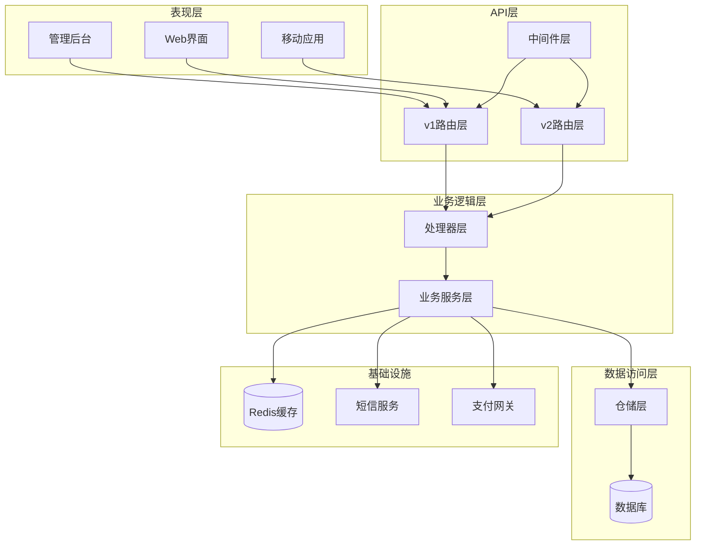

**图表来源**
- [main.go:52-266](file://backend/cmd/server/main.go#L52-L266)
- [router.go:58-634](file://backend/internal/api/v1/router.go#L58-L634)
- [router.go:72-283](file://backend/internal/api/v2/router.go#L72-L283)

**章节来源**
- [main.go:1-390](file://backend/cmd/server/main.go#L1-L390)
- [router.go:1-634](file://backend/internal/api/v1/router.go#L1-L634)
- [router.go:1-283](file://backend/internal/api/v2/router.go#L1-L283)

## 核心组件

### API版本管理

平台同时支持v1和v2两个版本的API接口，通过不同的路由前缀进行区分：

- **v1 API**: 位于 `/api/v1` 路径，包含完整的传统接口
- **v2 API**: 位于 `/api/v2` 路径，提供精简化的接口版本

### 中间件体系

系统实现了完整的中间件栈来处理认证、授权、日志记录等横切关注点：

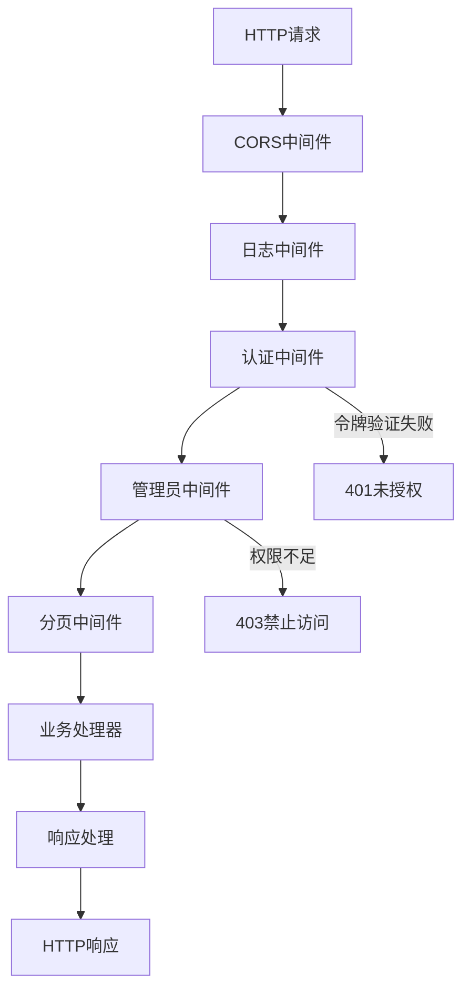

**图表来源**
- [auth.go:22-73](file://backend/internal/api/middleware/auth.go#L22-L73)
- [pagination.go:14-36](file://backend/internal/api/middleware/pagination.go#L14-L36)
- [logger.go:10-31](file://backend/internal/api/middleware/logger.go#L10-L31)

### 响应格式标准化

系统提供了两套响应格式标准：

- **v1响应格式**: 使用统一的Response结构体
- **v2响应格式**: 使用带追踪ID的V2Envelope结构体

**章节来源**
- [auth.go:1-106](file://backend/internal/api/middleware/auth.go#L1-L106)
- [pagination.go:1-71](file://backend/internal/api/middleware/pagination.go#L1-L71)
- [logger.go:1-32](file://backend/internal/api/middleware/logger.go#L1-L32)
- [response.go:1-104](file://backend/internal/pkg/response/response.go#L1-L104)
- [v2.go:1-141](file://backend/internal/pkg/response/v2.go#L1-L141)

## 架构概览

### API路由架构

```mermaid
graph TB
subgraph "v2 API架构"
V2Root[/api/v2] --> Status[状态检查]
V2Root --> Auth[认证模块]
V2Root --> Authenticated[认证后路由]
Authenticated --> Me[用户信息]
Authenticated --> Client[客户模块]
Authenticated --> Supply[供给模块]
Authenticated --> Demand[需求模块]
Authenticated --> Owner[机主模块]
Authenticated --> Pilot[飞手模块]
Authenticated --> Order[订单模块]
Authenticated --> Dispatch[派单模块]
Authenticated --> Payment[支付模块]
Authenticated --> Settlement[结算模块]
Authenticated --> Notification[通知模块]
Authenticated --> Review[评价模块]
end
subgraph "v1 API架构"
V1Root[/api/v1] --> Public[公共路由]
V1Root --> AuthenticatedV1[认证后路由]
AuthenticatedV1 --> User[用户模块]
AuthenticatedV1 --> Drone[无人机模块]
AuthenticatedV1 --> OrderV1[订单模块]
AuthenticatedV1 --> PaymentV1[支付模块]
AuthenticatedV1 --> Message[消息模块]
AuthenticatedV1 --> ReviewV1[评价模块]
AuthenticatedV1 --> PilotV1[飞手模块]
AuthenticatedV1 --> ClientV1[客户模块]
AuthenticatedV1 --> DispatchV1[派单模块]
AuthenticatedV1 --> Flight[飞行模块]
AuthenticatedV1 --> Airspace[空域模块]
AuthenticatedV1 --> SettlementV1[结算模块]
AuthenticatedV1 --> Credit[信用模块]
AuthenticatedV1 --> Insurance[保险模块]
AuthenticatedV1 --> Analytics[分析模块]
end
```

**图表来源**
- [router.go:72-283](file://backend/internal/api/v2/router.go#L72-L283)
- [router.go:58-634](file://backend/internal/api/v1/router.go#L58-L634)

### 认证流程

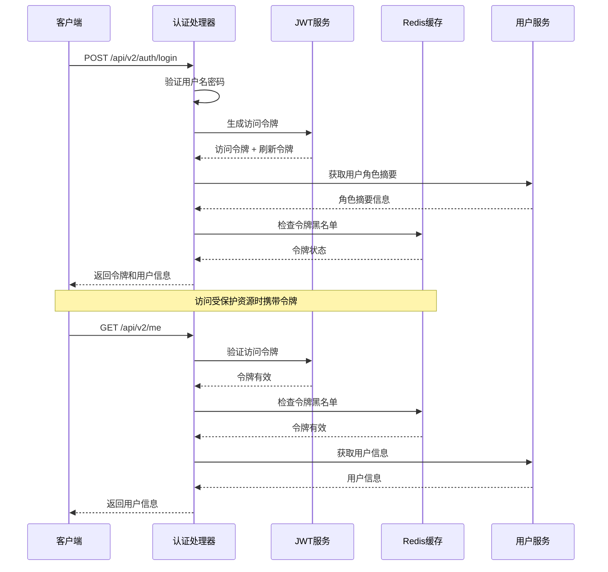

**图表来源**
- [handler.go:77-118](file://backend/internal/api/v2/auth/handler.go#L77-L118)
- [jwt.go:27-67](file://backend/internal/pkg/jwt/jwt.go#L27-L67)
- [auth.go:22-61](file://backend/internal/api/middleware/auth.go#L22-L61)

**章节来源**
- [router.go:72-283](file://backend/internal/api/v2/router.go#L72-L283)
- [handler.go:1-149](file://backend/internal/api/v2/auth/handler.go#L1-L149)
- [jwt.go:1-87](file://backend/internal/pkg/jwt/jwt.go#L1-L87)

## 详细组件分析

### 订单处理组件

订单处理是平台的核心业务组件，涵盖了从需求创建到订单完成的完整生命周期：

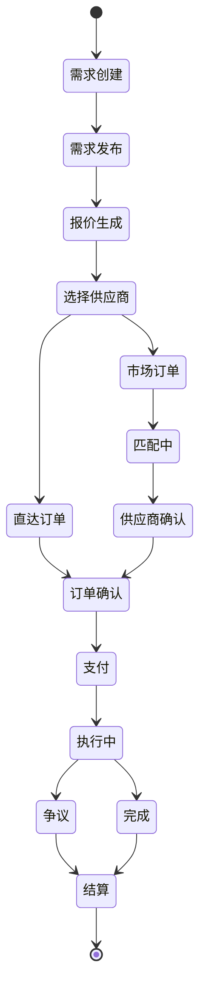

**图表来源**
- [handler.go:32-80](file://backend/internal/api/v2/order/handler.go#L32-L80)

#### 订单状态管理

订单状态流转遵循严格的业务规则，每个状态转换都经过完整的验证和授权检查：

| 状态 | 描述 | 触发条件 | 权限要求 |
|------|------|----------|----------|
| 需求创建 | 创建需求草稿 | 客户身份 | 客户 |
| 需求发布 | 发布需求 | 需求完善 | 客户 |
| 报价生成 | 机主报价 | 有合适无人机 | 机主 |
| 选择供应商 | 客户选择报价 | 选择最优报价 | 客户 |
| 直达订单 | 直接下单 | 机主确认 | 客户 |
| 市场订单 | 市场匹配 | 系统匹配 | 系统 |
| 订单确认 | 供应商确认 | 机主确认 | 机主 |
| 支付 | 客户支付 | 支付完成 | 客户 |
| 执行中 | 飞手执行 | 飞手接单 | 飞手 |
| 完成 | 订单完成 | 任务完成 | 客户/飞手 |
| 争议 | 发生争议 | 争议产生 | 任意方 |
| 结算 | 资金结算 | 订单完成 | 系统 |

**章节来源**
- [handler.go:1-763](file://backend/internal/api/v2/order/handler.go#L1-L763)

### 认证与授权组件

系统实现了多层次的安全防护机制：

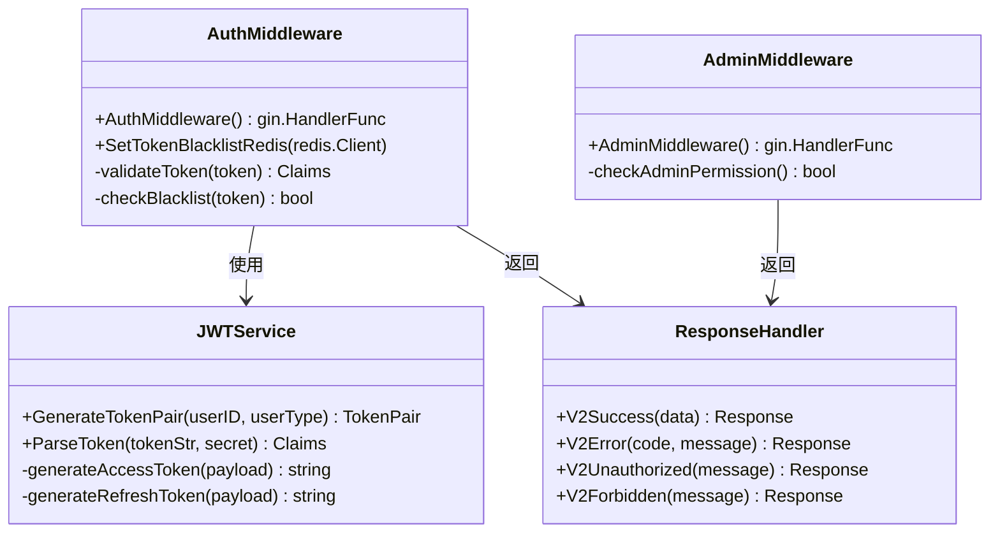

**图表来源**
- [auth.go:22-73](file://backend/internal/api/middleware/auth.go#L22-L73)
- [jwt.go:27-67](file://backend/internal/pkg/jwt/jwt.go#L27-L67)
- [v2.go:39-109](file://backend/internal/pkg/response/v2.go#L39-L109)

#### 分页处理组件

系统提供了灵活的分页处理机制，支持默认值和最大值限制：

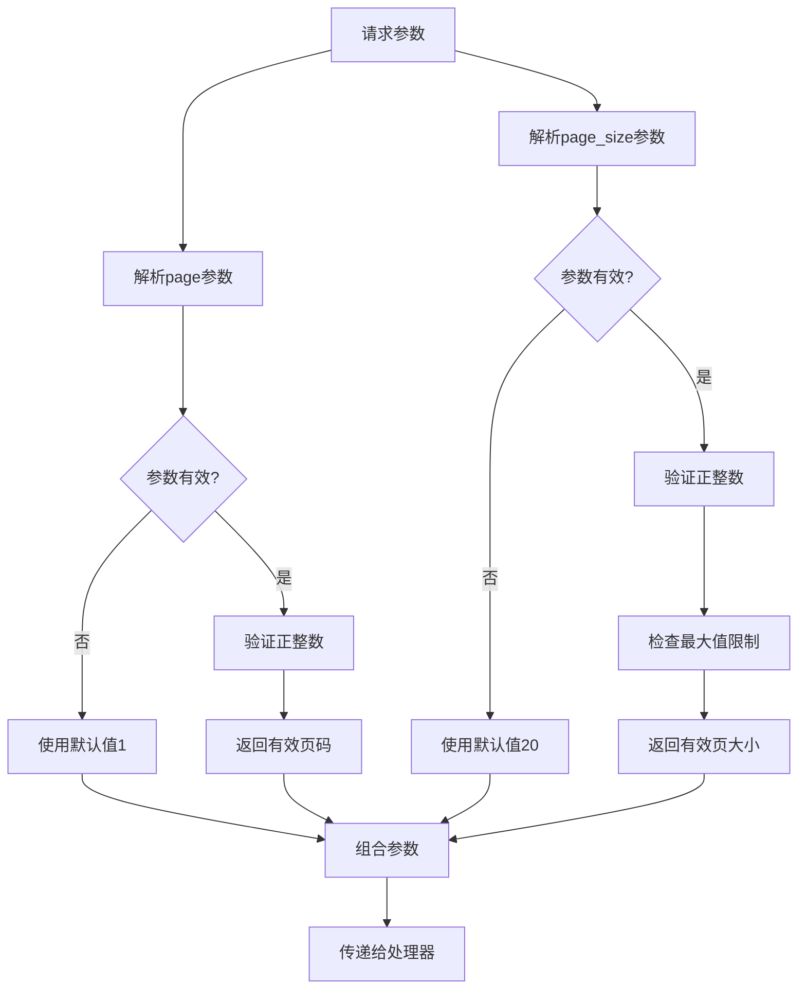

**图表来源**
- [pagination.go:14-36](file://backend/internal/api/middleware/pagination.go#L14-L36)

**章节来源**
- [auth.go:1-106](file://backend/internal/api/middleware/auth.go#L1-L106)
- [jwt.go:1-87](file://backend/internal/pkg/jwt/jwt.go#L1-L87)
- [pagination.go:1-71](file://backend/internal/api/middleware/pagination.go#L1-L71)
- [v2.go:1-141](file://backend/internal/pkg/response/v2.go#L1-L141)

## 依赖关系分析

### 服务依赖图

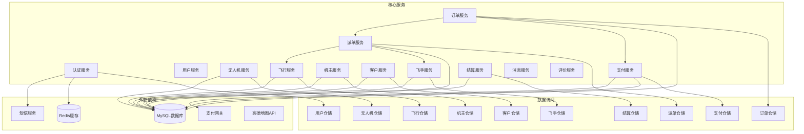

**图表来源**
- [main.go:109-219](file://backend/cmd/server/main.go#L109-L219)
- [main.go:224-247](file://backend/cmd/server/main.go#L224-L247)

### API契约测试

基于OpenAPI规范，系统实现了完整的API契约测试：

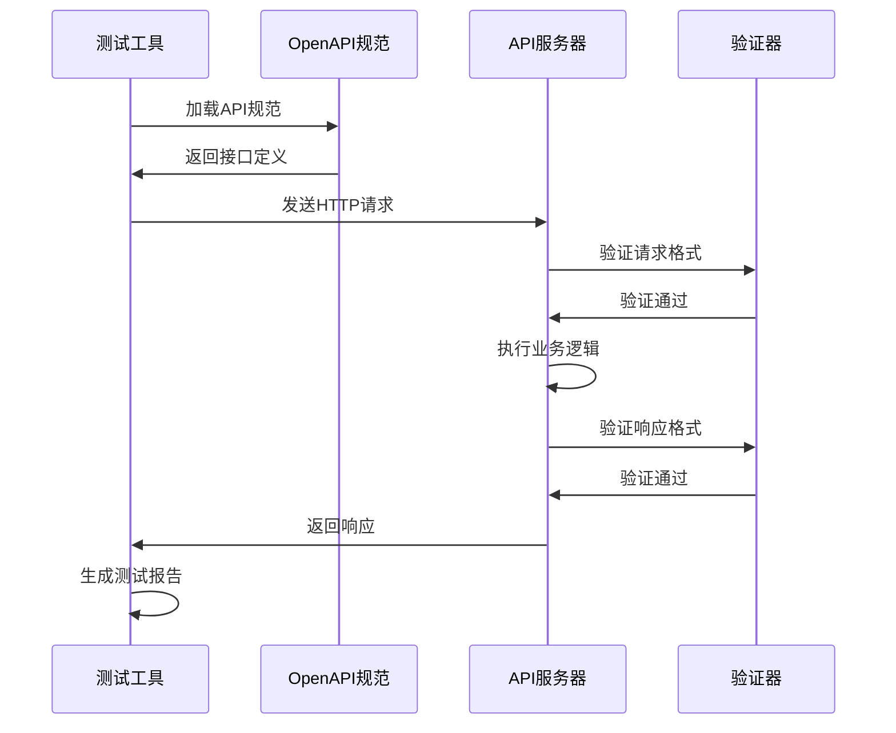

**图表来源**
- [openapi-v2.yaml:29-800](file://backend/docs/openapi-v2.yaml#L29-L800)

**章节来源**
- [openapi-v2.yaml:1-1058](file://backend/docs/openapi-v2.yaml#L1-L1058)
- [main.go:109-219](file://backend/cmd/server/main.go#L109-L219)

## 性能考虑

### 并发测试策略

系统支持高并发场景下的API测试：

1. **负载测试**: 使用JMeter或Gatling进行压力测试
2. **并发测试**: 模拟多用户同时操作的场景
3. **性能基准**: 建立API响应时间基准线
4. **资源监控**: 监控CPU、内存、数据库连接使用情况

### 缓存策略

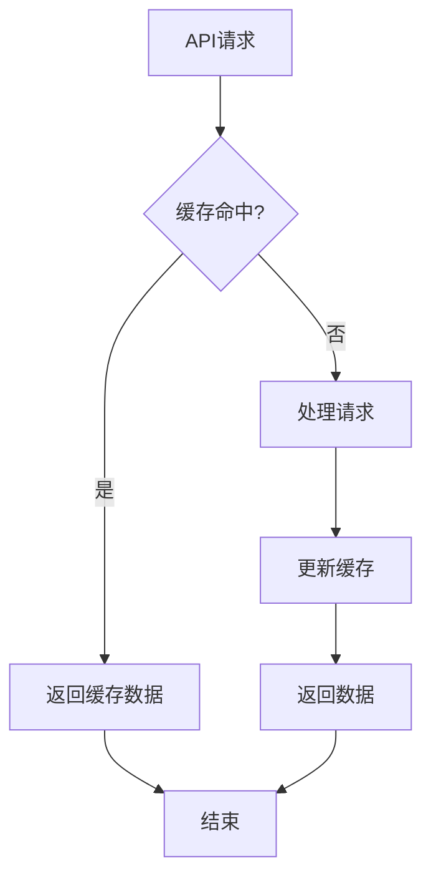

**图表来源**
- [auth.go:40-48](file://backend/internal/api/middleware/auth.go#L40-L48)

## 故障排除指南

### 常见错误场景

| 错误类型 | 错误代码 | 触发原因 | 解决方案 |
|----------|----------|----------|----------|
| 未授权访问 | 401 | 缺少或无效的认证令牌 | 重新登录获取新令牌 |
| 权限不足 | 403 | 用户权限不足 | 检查用户角色和权限 |
| 参数错误 | 400 | 请求参数格式错误 | 检查OpenAPI规范 |
| 服务器错误 | 500 | 服务器内部错误 | 查看日志文件 |
| 资源不存在 | 404 | 请求的资源不存在 | 检查资源ID |

### 日志分析

系统提供了详细的日志记录机制：

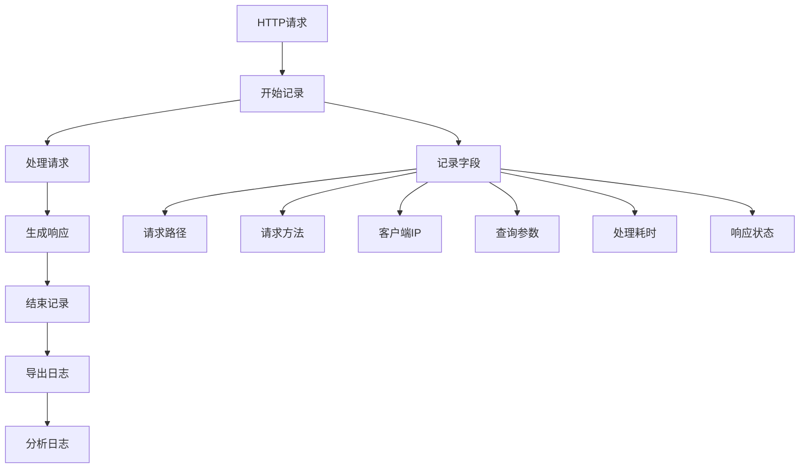

**图表来源**
- [logger.go:10-31](file://backend/internal/api/middleware/logger.go#L10-L31)

**章节来源**
- [logger.go:1-32](file://backend/internal/api/middleware/logger.go#L1-L32)
- [response.go:55-85](file://backend/internal/pkg/response/response.go#L55-L85)
- [v2.go:84-109](file://backend/internal/pkg/response/v2.go#L84-L109)

## 结论

无人机租赁平台的API测试体系涵盖了从基础认证授权到复杂业务流程的全方位测试策略。通过结合OpenAPI规范、中间件安全机制、标准化响应格式和完善的日志监控，确保了API接口的可靠性、安全性和性能。

建议在实际测试中重点关注：
1. **认证流程测试**: 确保JWT令牌的有效性和安全性
2. **业务流程测试**: 验证完整的订单生命周期
3. **并发性能测试**: 模拟高并发场景
4. **错误处理测试**: 验证异常情况的处理
5. **数据一致性测试**: 确保业务数据的准确性

## 附录

### 测试数据管理

平台提供了完整的测试数据管理机制：

- **演示账号**: 基于阶段10验收的演示账号
- **测试环境**: 隔离的测试数据库和缓存
- **数据清理**: 自动化的测试数据清理机制
- **环境配置**: 支持多环境配置管理

### 回归测试策略

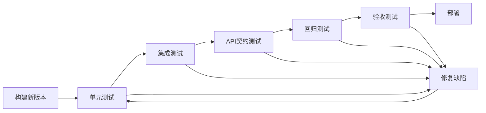

**图表来源**
- [TEST_CHECKLIST.md:9-448](file://TEST_CHECKLIST.md#L9-L448)

### Postman使用指南

1. **导入OpenAPI**: 在Postman中导入openapi-v2.yaml文件
2. **配置环境变量**: 设置BASE_URL、TOKEN等环境变量
3. **创建集合**: 按模块创建API测试集合
4. **编写测试脚本**: 为关键接口编写断言脚本
5. **运行测试**: 执行完整的测试套件

**章节来源**
- [TEST_CHECKLIST.md:1-448](file://TEST_CHECKLIST.md#L1-L448)
- [DEMO_ACCOUNTS.md:1-116](file://DEMO_ACCOUNTS.md#L1-L116)