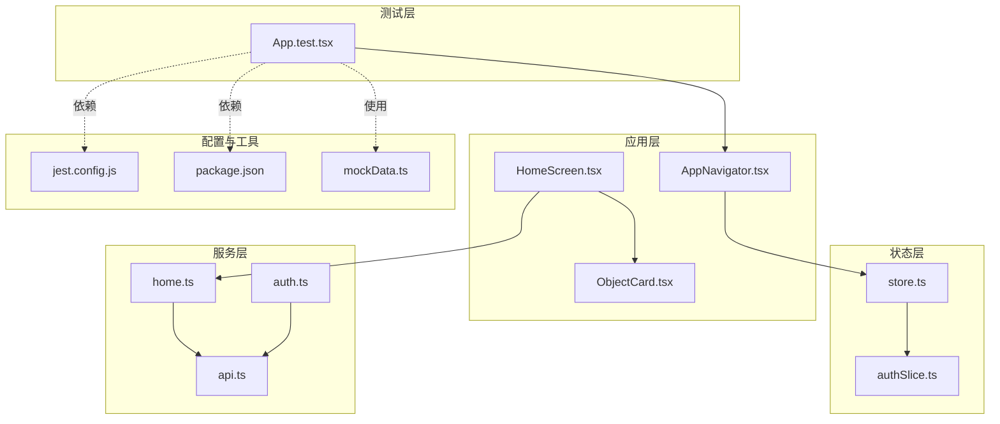
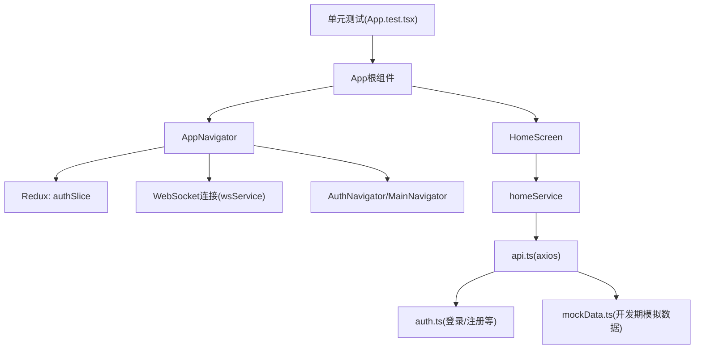
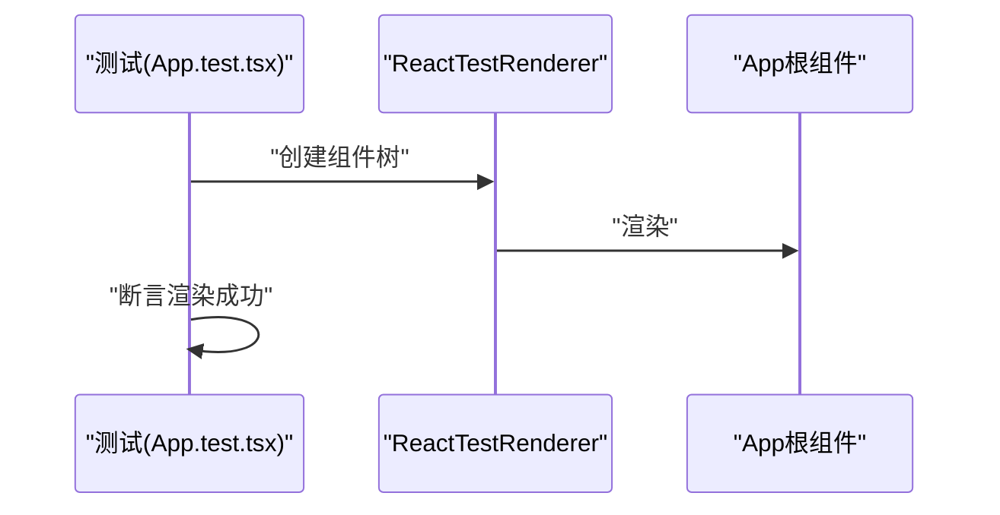
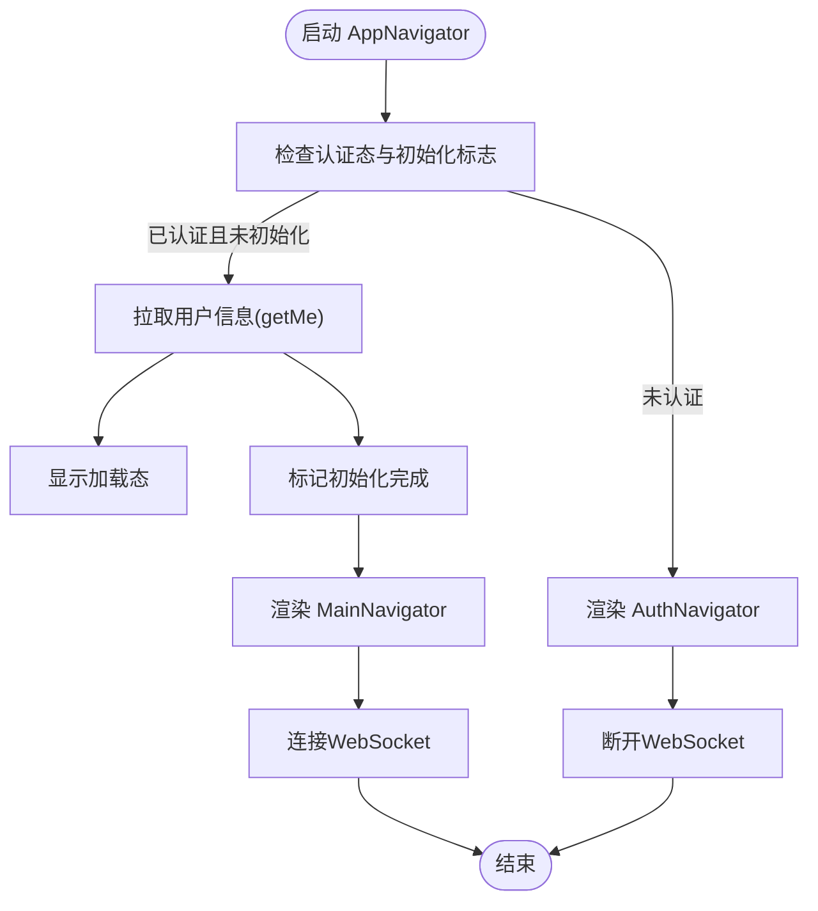
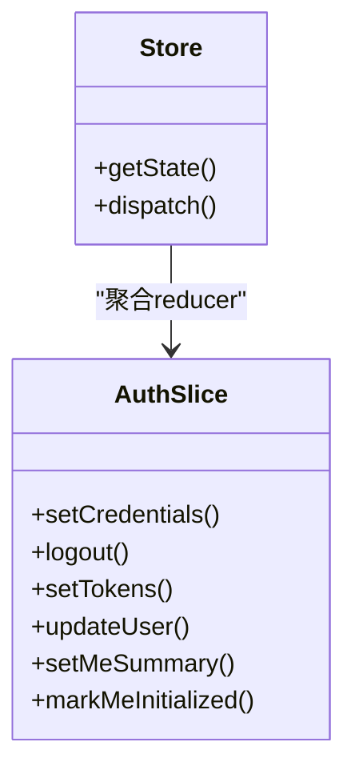
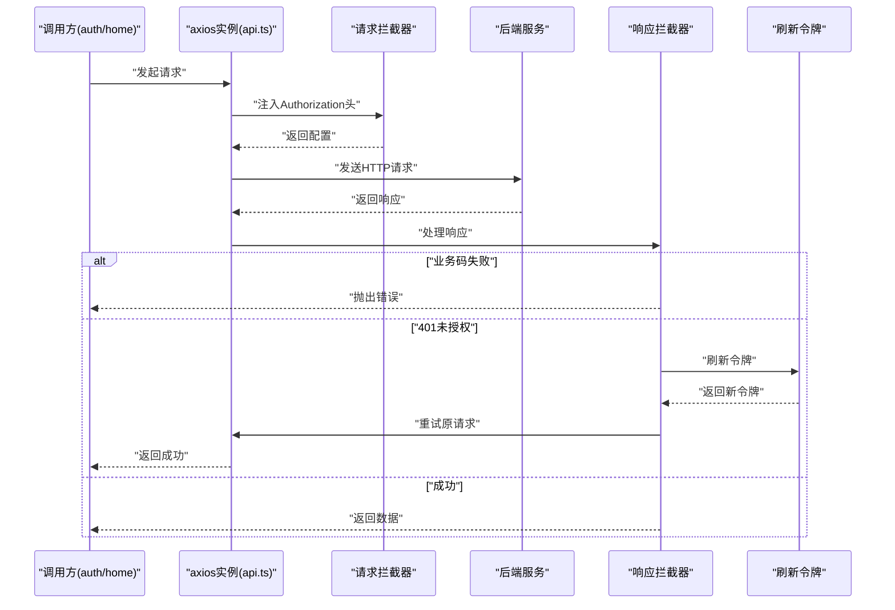
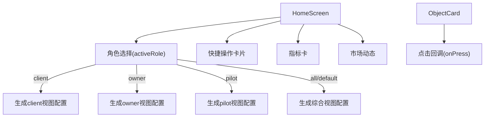
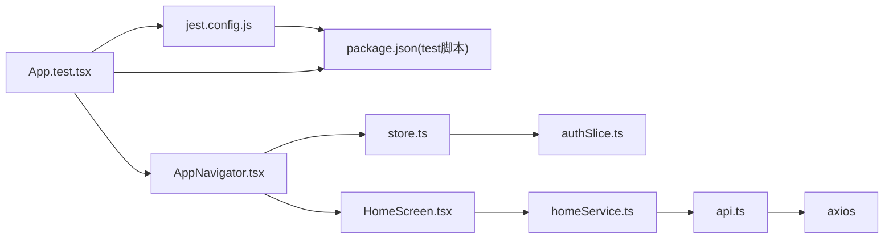

# 前端单元测试

<cite>
**本文引用的文件**
- [mobile/__tests__/App.test.tsx](file://mobile/__tests__/App.test.tsx)
- [mobile/jest.config.js](file://mobile/jest.config.js)
- [mobile/package.json](file://mobile/package.json)
- [mobile/src/config/mockData.ts](file://mobile/src/config/mockData.ts)
- [mobile/src/store/store.ts](file://mobile/src/store/store.ts)
- [mobile/src/store/slices/authSlice.ts](file://mobile/src/store/slices/authSlice.ts)
- [mobile/src/navigation/AppNavigator.tsx](file://mobile/src/navigation/AppNavigator.tsx)
- [mobile/src/services/api.ts](file://mobile/src/services/api.ts)
- [mobile/src/services/auth.ts](file://mobile/src/services/auth.ts)
- [mobile/src/services/home.ts](file://mobile/src/services/home.ts)
- [mobile/src/screens/home/HomeScreen.tsx](file://mobile/src/screens/home/HomeScreen.tsx)
- [mobile/src/components/business/ObjectCard.tsx](file://mobile/src/components/business/ObjectCard.tsx)
</cite>

## 目录
1. [简介](#简介)
2. [项目结构](#项目结构)
3. [核心组件](#核心组件)
4. [架构总览](#架构总览)
5. [详细组件分析](#详细组件分析)
6. [依赖分析](#依赖分析)
7. [性能考虑](#性能考虑)
8. [故障排查指南](#故障排查指南)
9. [结论](#结论)
10. [附录](#附录)

## 简介
本文件面向React Native移动端应用的前端单元测试，围绕现有App.test.tsx测试文件，系统化阐述Jest测试框架的配置与使用方法，覆盖React组件测试、导航逻辑验证、状态管理（Redux）测试、异步流程与错误处理测试，并给出Mock数据策略、测试用例编写规范以及在CI中的运行建议。目标是帮助开发者以最小成本建立稳定、可维护的前端测试体系。

## 项目结构
移动端前端位于mobile目录，测试文件位于mobile/__tests__，Jest配置位于jest.config.js，包管理脚本与依赖定义于package.json。核心业务模块包括：
- 导航层：AppNavigator负责根据认证状态切换AuthNavigator/MainNavigator
- 状态层：Redux Toolkit Store与authSlice管理认证态
- 服务层：api.ts封装axios客户端与拦截器；auth.ts、home.ts等业务服务
- 屏幕与组件：HomeScreen等页面组件，ObjectCard等通用组件
- Mock数据：mockData.ts提供开发期模拟数据

图表来源
- [mobile/__tests__/App.test.tsx:1-14](file://mobile/__tests__/App.test.tsx#L1-L14)
- [mobile/src/navigation/AppNavigator.tsx:1-88](file://mobile/src/navigation/AppNavigator.tsx#L1-L88)
- [mobile/src/screens/home/HomeScreen.tsx:1-800](file://mobile/src/screens/home/HomeScreen.tsx#L1-L800)
- [mobile/src/components/business/ObjectCard.tsx:1-53](file://mobile/src/components/business/ObjectCard.tsx#L1-L53)
- [mobile/src/store/store.ts:1-12](file://mobile/src/store/store.ts#L1-L12)
- [mobile/src/store/slices/authSlice.ts:1-65](file://mobile/src/store/slices/authSlice.ts#L1-L65)
- [mobile/src/services/api.ts:1-155](file://mobile/src/services/api.ts#L1-L155)
- [mobile/src/services/auth.ts:1-45](file://mobile/src/services/auth.ts#L1-L45)
- [mobile/src/services/home.ts:1-8](file://mobile/src/services/home.ts#L1-L8)
- [mobile/jest.config.js:1-4](file://mobile/jest.config.js#L1-L4)
- [mobile/package.json:1-64](file://mobile/package.json#L1-L64)
- [mobile/src/config/mockData.ts:1-204](file://mobile/src/config/mockData.ts#L1-L204)

章节来源
- [mobile/__tests__/App.test.tsx:1-14](file://mobile/__tests__/App.test.tsx#L1-L14)
- [mobile/jest.config.js:1-4](file://mobile/jest.config.js#L1-L4)
- [mobile/package.json:1-64](file://mobile/package.json#L1-L64)

## 核心组件
- Jest配置：使用react-native预设，确保RN生态兼容性
- 测试入口：App.test.tsx对根组件进行快照式渲染校验
- Mock数据：mockData.ts提供默认位置与附近无人机等开发期数据
- Redux状态：store.ts集中配置，authSlice.ts管理认证相关状态
- 导航：AppNavigator依据认证态与初始化状态切换导航栈并连接WebSocket
- 服务层：api.ts统一注入Authorization头、处理业务码与Token刷新；auth.ts、home.ts封装具体业务接口

章节来源
- [mobile/jest.config.js:1-4](file://mobile/jest.config.js#L1-L4)
- [mobile/__tests__/App.test.tsx:1-14](file://mobile/__tests__/App.test.tsx#L1-L14)
- [mobile/src/config/mockData.ts:1-204](file://mobile/src/config/mockData.ts#L1-L204)
- [mobile/src/store/store.ts:1-12](file://mobile/src/store/store.ts#L1-L12)
- [mobile/src/store/slices/authSlice.ts:1-65](file://mobile/src/store/slices/authSlice.ts#L1-L65)
- [mobile/src/navigation/AppNavigator.tsx:1-88](file://mobile/src/navigation/AppNavigator.tsx#L1-L88)
- [mobile/src/services/api.ts:1-155](file://mobile/src/services/api.ts#L1-L155)
- [mobile/src/services/auth.ts:1-45](file://mobile/src/services/auth.ts#L1-L45)
- [mobile/src/services/home.ts:1-8](file://mobile/src/services/home.ts#L1-L8)

## 架构总览
下图展示从测试到应用、状态与服务的整体关系，便于理解测试覆盖点与断言方向。

图表来源
- [mobile/__tests__/App.test.tsx:1-14](file://mobile/__tests__/App.test.tsx#L1-L14)
- [mobile/src/navigation/AppNavigator.tsx:1-88](file://mobile/src/navigation/AppNavigator.tsx#L1-L88)
- [mobile/src/store/slices/authSlice.ts:1-65](file://mobile/src/store/slices/authSlice.ts#L1-L65)
- [mobile/src/services/home.ts:1-8](file://mobile/src/services/home.ts#L1-L8)
- [mobile/src/services/api.ts:1-155](file://mobile/src/services/api.ts#L1-L155)
- [mobile/src/services/auth.ts:1-45](file://mobile/src/services/auth.ts#L1-L45)
- [mobile/src/config/mockData.ts:1-204](file://mobile/src/config/mockData.ts#L1-L204)

## 详细组件分析

### 组件测试：App.test.tsx
- 目标：验证App根组件在渲染时无异常
- 方法：使用react-test-renderer创建树并包裹在Act中，保证异步更新完成
- 建议扩展：增加屏幕级快照测试（如HomeScreen），断言关键UI元素存在

图表来源
- [mobile/__tests__/App.test.tsx:1-14](file://mobile/__tests__/App.test.tsx#L1-L14)

章节来源
- [mobile/__tests__/App.test.tsx:1-14](file://mobile/__tests__/App.test.tsx#L1-L14)

### 导航逻辑测试：AppNavigator
- 关注点：
  - 认证态变化时，key切换至main或auth，触发导航栈重建
  - 初始化时拉取用户信息，期间显示加载态
  - 连接/断开WebSocket，生命周期内正确清理
- 测试要点：
  - 使用内存存储模拟Redux状态，驱动isAuthenticated与meInitialized
  - 断言加载态出现/消失时机
  - 断言AuthNavigator/MainNavigator的渲染分支
  - 断言WebSocket连接/断开行为

图表来源
- [mobile/src/navigation/AppNavigator.tsx:1-88](file://mobile/src/navigation/AppNavigator.tsx#L1-L88)
- [mobile/src/store/slices/authSlice.ts:1-65](file://mobile/src/store/slices/authSlice.ts#L1-L65)

章节来源
- [mobile/src/navigation/AppNavigator.tsx:1-88](file://mobile/src/navigation/AppNavigator.tsx#L1-L88)
- [mobile/src/store/slices/authSlice.ts:1-65](file://mobile/src/store/slices/authSlice.ts#L1-L65)

### 状态管理测试：Redux Store与authSlice
- 关注点：
  - Store聚合reducer，导出RootState与AppDispatch类型
  - authSlice提供setCredentials、logout、setTokens等动作
- 测试要点：
  - 使用内存Store实例化authSlice，分别断言setCredentials后各字段值
  - 断言logout清空认证态
  - 断言setTokens更新访问/刷新令牌
  - 结合useSelector的组件测试，验证渲染分支

图表来源
- [mobile/src/store/store.ts:1-12](file://mobile/src/store/store.ts#L1-L12)
- [mobile/src/store/slices/authSlice.ts:1-65](file://mobile/src/store/slices/authSlice.ts#L1-L65)

章节来源
- [mobile/src/store/store.ts:1-12](file://mobile/src/store/store.ts#L1-L12)
- [mobile/src/store/slices/authSlice.ts:1-65](file://mobile/src/store/slices/authSlice.ts#L1-L65)

### 异步与API测试：api.ts与auth.ts/home.ts
- 关注点：
  - 请求拦截器注入Authorization头
  - 响应拦截器解析业务码，401时尝试刷新令牌
  - 并发刷新去重，pendingRequests队列处理
  - 成功/失败消息提取与错误抛出
- 测试要点：
  - Mock axios实例，断言请求头含Bearer Token
  - 断言业务码校验逻辑
  - 断言401时触发刷新流程与后续重试
  - 断言刷新失败时登出并拒绝请求
  - 对auth.ts与home.ts的接口进行参数与返回值断言

图表来源
- [mobile/src/services/api.ts:1-155](file://mobile/src/services/api.ts#L1-L155)
- [mobile/src/services/auth.ts:1-45](file://mobile/src/services/auth.ts#L1-L45)
- [mobile/src/services/home.ts:1-8](file://mobile/src/services/home.ts#L1-L8)

章节来源
- [mobile/src/services/api.ts:1-155](file://mobile/src/services/api.ts#L1-L155)
- [mobile/src/services/auth.ts:1-45](file://mobile/src/services/auth.ts#L1-L45)
- [mobile/src/services/home.ts:1-8](file://mobile/src/services/home.ts#L1-L8)

### 组件交互与UI测试：HomeScreen与ObjectCard
- 关注点：
  - HomeScreen根据角色动态生成仪表盘、快捷操作与待办项
  - ObjectCard支持点击回调与主题样式
- 测试要点：
  - 使用ReactTestRenderer或React Native Testing Library断言关键文本/按钮存在
  - 模拟Redux状态，断言不同角色下的渲染差异
  - 断言ObjectCard的点击事件回调被触发
  - 断言刷新控制与加载态

图表来源
- [mobile/src/screens/home/HomeScreen.tsx:1-800](file://mobile/src/screens/home/HomeScreen.tsx#L1-L800)
- [mobile/src/components/business/ObjectCard.tsx:1-53](file://mobile/src/components/business/ObjectCard.tsx#L1-L53)

章节来源
- [mobile/src/screens/home/HomeScreen.tsx:1-800](file://mobile/src/screens/home/HomeScreen.tsx#L1-L800)
- [mobile/src/components/business/ObjectCard.tsx:1-53](file://mobile/src/components/business/ObjectCard.tsx#L1-L53)

## 依赖分析
- 测试框架与配置
  - Jest版本与react-native预设确保RN组件与Metro生态兼容
  - 脚本test指向jest，便于本地与CI执行
- 组件与服务依赖
  - AppNavigator依赖Redux状态与WebSocket服务
  - HomeScreen依赖homeService与主题上下文
  - 服务层统一依赖api.ts的拦截器与业务码处理

图表来源
- [mobile/jest.config.js:1-4](file://mobile/jest.config.js#L1-L4)
- [mobile/package.json:1-64](file://mobile/package.json#L1-L64)
- [mobile/__tests__/App.test.tsx:1-14](file://mobile/__tests__/App.test.tsx#L1-L14)
- [mobile/src/navigation/AppNavigator.tsx:1-88](file://mobile/src/navigation/AppNavigator.tsx#L1-L88)
- [mobile/src/store/store.ts:1-12](file://mobile/src/store/store.ts#L1-L12)
- [mobile/src/store/slices/authSlice.ts:1-65](file://mobile/src/store/slices/authSlice.ts#L1-L65)
- [mobile/src/screens/home/HomeScreen.tsx:1-800](file://mobile/src/screens/home/HomeScreen.tsx#L1-L800)
- [mobile/src/services/home.ts:1-8](file://mobile/src/services/home.ts#L1-L8)
- [mobile/src/services/api.ts:1-155](file://mobile/src/services/api.ts#L1-L155)

章节来源
- [mobile/jest.config.js:1-4](file://mobile/jest.config.js#L1-L4)
- [mobile/package.json:1-64](file://mobile/package.json#L1-L64)

## 性能考虑
- 测试执行速度
  - 尽量使用内存Store与局部渲染，避免完整应用启动
  - 合理使用act包裹异步更新，减少超时重试
- 覆盖率与稳定性
  - 优先覆盖关键分支（认证态、角色视图、错误路径）
  - 对异步流程采用Promise/async断言，避免竞态
- CI集成
  - 在CI中设置缓存与并行执行，缩短构建时间

## 故障排查指南
- 渲染异常
  - 确认测试中已使用act包裹异步渲染
  - 检查组件依赖的上下文（Theme、Navigation）是否提供
- 导航不切换
  - 核对Redux状态变更是否触发key更新
  - 检查WebSocket连接/断开逻辑
- API请求失败
  - 校验Authorization头是否注入
  - 检查业务码判断与401处理分支
  - 确认刷新令牌流程未并发冲突
- Mock数据问题
  - 确保开发模式下使用mockData.ts，生产环境禁用

章节来源
- [mobile/__tests__/App.test.tsx:1-14](file://mobile/__tests__/App.test.tsx#L1-L14)
- [mobile/src/navigation/AppNavigator.tsx:1-88](file://mobile/src/navigation/AppNavigator.tsx#L1-L88)
- [mobile/src/services/api.ts:1-155](file://mobile/src/services/api.ts#L1-L155)
- [mobile/src/config/mockData.ts:1-204](file://mobile/src/config/mockData.ts#L1-L204)

## 结论
通过现有App.test.tsx与Jest配置，结合Redux状态、导航与服务层的清晰职责划分，可以构建一套稳健的前端单元测试体系。建议逐步扩展到屏幕与组件层面，完善异步与错误路径测试，并在CI中强制执行，以保障代码质量与交付效率。

## 附录

### 测试用例编写规范
- 文件命名：组件测试使用ComponentName.test.tsx
- 断言风格：优先使用明确的断言（存在/不存在、值相等、抛错）
- 异步处理：使用act包裹异步渲染与状态更新
- Mock策略：按需Mock axios、导航容器、主题上下文

### Mock数据处理策略
- 开发期：使用mockData.ts提供的默认位置与模拟数据
- 测试期：在测试文件中导入并按需替换真实API返回
- 生产期：严禁使用模拟数据，确保与后端一致

### 异步测试方法
- 使用jest.useFakeTimers与advanceTimersByTime处理定时器
- 使用Promise/async/await配合expect.assertions进行严格断言
- 对并发刷新场景，使用队列pendingRequests模拟并发请求

### 测试覆盖率与CI
- 覆盖率目标：关键分支与函数达到中高覆盖率
- CI流程：安装依赖 → 运行测试 → 生成覆盖率报告 → 上传Artifacts
- 命令参考：npm test 或 yarn test（由package.json scripts定义）

章节来源
- [mobile/package.json:1-64](file://mobile/package.json#L1-L64)
- [mobile/src/config/mockData.ts:1-204](file://mobile/src/config/mockData.ts#L1-L204)