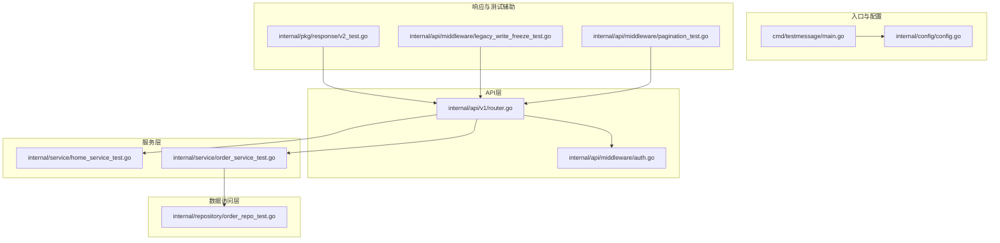
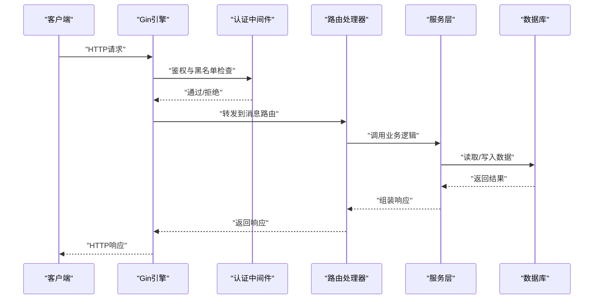
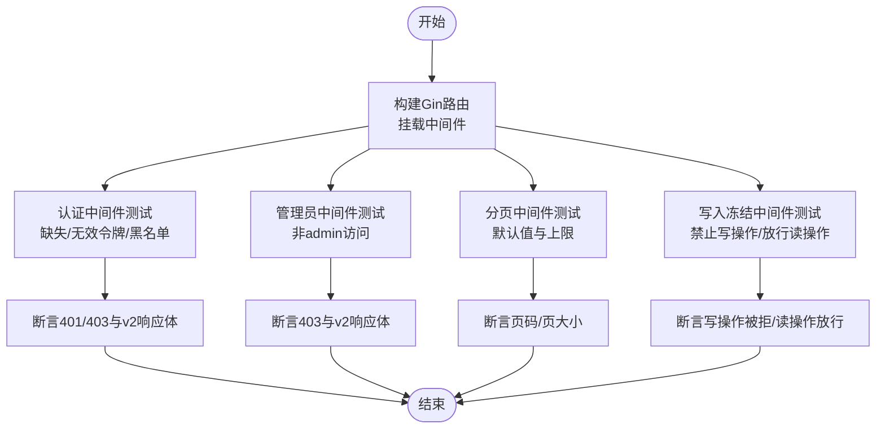
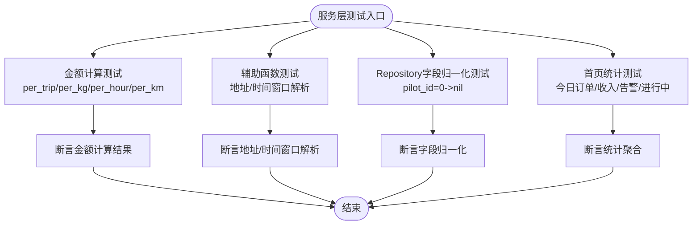
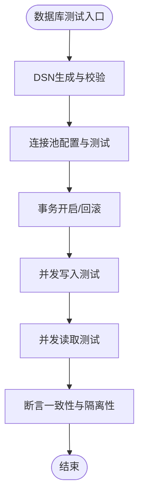
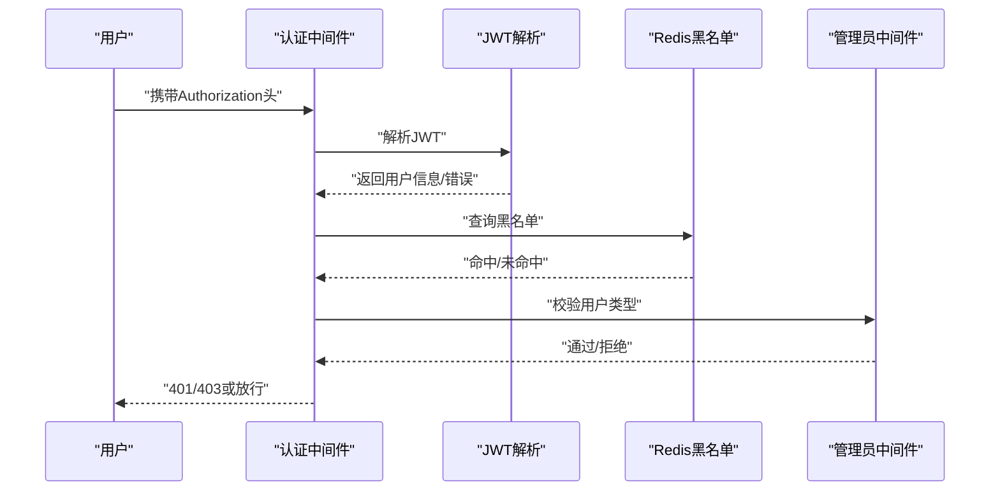
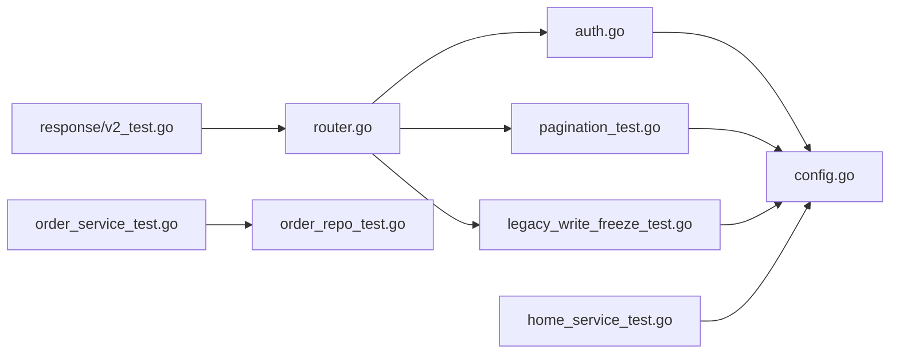

# 后端集成测试

<cite>
**本文档引用的文件**
- [backend/cmd/testmessage/main.go](file://backend/cmd/testmessage/main.go)
- [backend/internal/api/middleware/auth.go](file://backend/internal/api/middleware/auth.go)
- [backend/internal/api/v1/router.go](file://backend/internal/api/v1/router.go)
- [backend/internal/config/config.go](file://backend/internal/config/config.go)
- [backend/internal/api/middleware/legacy_write_freeze_test.go](file://backend/internal/api/middleware/legacy_write_freeze_test.go)
- [backend/internal/api/middleware/pagination_test.go](file://backend/internal/api/middleware/pagination_test.go)
- [backend/internal/pkg/response/v2_test.go](file://backend/internal/pkg/response/v2_test.go)
- [backend/internal/repository/order_repo_test.go](file://backend/internal/repository/order_repo_test.go)
- [backend/internal/service/order_service_test.go](file://backend/internal/service/order_service_test.go)
- [backend/internal/service/home_service_test.go](file://backend/internal/service/home_service_test.go)
- [backend/config.example.yaml](file://backend/config.example.yaml)
- [backend/go.mod](file://backend/go.mod)
</cite>

## 目录
1. [简介](#简介)
2. [项目结构](#项目结构)
3. [核心组件](#核心组件)
4. [架构总览](#架构总览)
5. [详细组件分析](#详细组件分析)
6. [依赖分析](#依赖分析)
7. [性能考虑](#性能考虑)
8. [故障排查指南](#故障排查指南)
9. [结论](#结论)
10. [附录](#附录)

## 简介
本文件面向Go后端服务，提供一套完整的集成测试策略与实现方法，围绕现有testmessage测试程序展开，系统性覆盖API路由、中间件、服务层、数据访问层的端到端集成验证。重点包括：
- 数据库连接与事务测试
- 外部服务（短信、支付、地图）集成测试
- 认证授权（JWT、Redis黑名单、管理员权限）测试
- 分页、冻结写入等中间件集成测试
- v2响应体规范与追踪ID传播测试
- 性能与负载测试策略

## 项目结构
后端采用模块化分层设计：cmd命令入口、api路由与中间件、service业务逻辑、repository数据访问、config配置管理、websocket实时通信。集成测试应覆盖从Gin路由到各层组件的完整链路。

**图表来源**
- [backend/cmd/testmessage/main.go:1-60](file://backend/cmd/testmessage/main.go#L1-L60)
- [backend/internal/config/config.go:1-521](file://backend/internal/config/config.go#L1-L521)
- [backend/internal/api/v1/router.go:1-634](file://backend/internal/api/v1/router.go#L1-L634)
- [backend/internal/api/middleware/auth.go:1-106](file://backend/internal/api/middleware/auth.go#L1-L106)
- [backend/internal/service/home_service_test.go:1-62](file://backend/internal/service/home_service_test.go#L1-L62)
- [backend/internal/service/order_service_test.go:1-105](file://backend/internal/service/order_service_test.go#L1-L105)
- [backend/internal/repository/order_repo_test.go:1-25](file://backend/internal/repository/order_repo_test.go#L1-L25)
- [backend/internal/pkg/response/v2_test.go:1-80](file://backend/internal/pkg/response/v2_test.go#L1-L80)
- [backend/internal/api/middleware/legacy_write_freeze_test.go:1-82](file://backend/internal/api/middleware/legacy_write_freeze_test.go#L1-L82)
- [backend/internal/api/middleware/pagination_test.go:1-42](file://backend/internal/api/middleware/pagination_test.go#L1-L42)

**章节来源**
- [backend/cmd/testmessage/main.go:1-60](file://backend/cmd/testmessage/main.go#L1-L60)
- [backend/internal/api/v1/router.go:1-634](file://backend/internal/api/v1/router.go#L1-L634)
- [backend/internal/config/config.go:1-521](file://backend/internal/config/config.go#L1-L521)

## 核心组件
- 配置系统：集中管理数据库、Redis、JWT、支付、短信、WebSocket等配置，并提供加载与校验。
- 路由注册：统一在router.go中注册v1版本的所有API路由，按功能域分组并挂载中间件。
- 中间件体系：认证（JWT+Redis黑名单）、管理员权限、分页、写入冻结等。
- 服务层：业务规则与算法（如订单金额计算、首页汇总统计）。
- 数据访问层：ORM映射与字段归一化处理。
- 响应封装：v2响应体规范与追踪ID传播测试。

**章节来源**
- [backend/internal/config/config.go:1-521](file://backend/internal/config/config.go#L1-L521)
- [backend/internal/api/v1/router.go:1-634](file://backend/internal/api/v1/router.go#L1-L634)
- [backend/internal/api/middleware/auth.go:1-106](file://backend/internal/api/middleware/auth.go#L1-L106)
- [backend/internal/service/order_service_test.go:1-105](file://backend/internal/service/order_service_test.go#L1-L105)
- [backend/internal/repository/order_repo_test.go:1-25](file://backend/internal/repository/order_repo_test.go#L1-L25)
- [backend/internal/pkg/response/v2_test.go:1-80](file://backend/internal/pkg/response/v2_test.go#L1-L80)

## 架构总览
集成测试应覆盖从HTTP请求进入Gin引擎，经由中间件链路，到达Handler，再调用Service与Repository，最终访问数据库与外部服务的完整流程。下图展示了典型的消息路由与认证中间件链路：

**图表来源**
- [backend/internal/api/v1/router.go:189-199](file://backend/internal/api/v1/router.go#L189-L199)
- [backend/internal/api/middleware/auth.go:22-61](file://backend/internal/api/middleware/auth.go#L22-L61)

## 详细组件分析

### API路由与中间件集成测试
- 目标：验证路由注册、中间件顺序与行为、v2响应体规范、追踪ID传播。
- 关键点：
  - 认证中间件：校验Authorization头格式、解析JWT、黑名单检查、注入用户信息。
  - 管理员中间件：校验用户类型为admin。
  - 分页中间件：默认页码与页大小、上限控制。
  - 写入冻结中间件：对特定路径组禁止写操作，支持白名单前缀。
- 测试策略：
  - 使用httptest构造请求，断言状态码与响应体字段。
  - 验证v2错误响应的code、message、trace_id传播。
  - 验证分页参数边界与默认值。
  - 验证写入冻结对POST/PUT/DELETE的拦截与GET放行。

**图表来源**
- [backend/internal/api/middleware/auth.go:22-106](file://backend/internal/api/middleware/auth.go#L22-L106)
- [backend/internal/api/middleware/pagination_test.go:11-42](file://backend/internal/api/middleware/pagination_test.go#L11-L42)
- [backend/internal/api/middleware/legacy_write_freeze_test.go:12-82](file://backend/internal/api/middleware/legacy_write_freeze_test.go#L12-L82)
- [backend/internal/pkg/response/v2_test.go:12-80](file://backend/internal/pkg/response/v2_test.go#L12-L80)

**章节来源**
- [backend/internal/api/middleware/auth.go:1-106](file://backend/internal/api/middleware/auth.go#L1-L106)
- [backend/internal/api/middleware/pagination_test.go:1-42](file://backend/internal/api/middleware/pagination_test.go#L1-L42)
- [backend/internal/api/middleware/legacy_write_freeze_test.go:1-82](file://backend/internal/api/middleware/legacy_write_freeze_test.go#L1-L82)
- [backend/internal/pkg/response/v2_test.go:1-80](file://backend/internal/pkg/response/v2_test.go#L1-L80)

### 服务层与数据访问层集成测试
- 目标：验证业务规则、字段归一化、金额计算、首页统计等。
- 关键点：
  - 订单金额计算：按次、按公斤、按小时、按公里等不同计价单位。
  - 地址与时间窗口解析：优先级与默认值处理。
  - 订单字段归一化：将pilot_id=0转换为NULL。
  - 首页统计：今日订单数、收入、进行中订单、告警数。
- 测试策略：
  - 构造多种输入组合，断言金额计算结果与边界条件。
  - 验证地址解析优先级与时间窗口规范化。
  - 验证Repository层字段归一化逻辑。
  - 验证Service层统计数据聚合逻辑。

**图表来源**
- [backend/internal/service/order_service_test.go:11-105](file://backend/internal/service/order_service_test.go#L11-L105)
- [backend/internal/repository/order_repo_test.go:5-25](file://backend/internal/repository/order_repo_test.go#L5-L25)
- [backend/internal/service/home_service_test.go:10-62](file://backend/internal/service/home_service_test.go#L10-L62)

**章节来源**
- [backend/internal/service/order_service_test.go:1-105](file://backend/internal/service/order_service_test.go#L1-L105)
- [backend/internal/repository/order_repo_test.go:1-25](file://backend/internal/repository/order_repo_test.go#L1-L25)
- [backend/internal/service/home_service_test.go:1-62](file://backend/internal/service/home_service_test.go#L1-L62)

### 数据库连接与事务测试
- 目标：验证数据库连接、DSN生成、事务隔离与回滚、并发安全。
- 关键点：
  - DSN生成：字符集、时区、排序规则、参数插值。
  - 连接池：最大空闲/打开连接数配置。
  - 事务：在测试中开启事务并在结束后回滚，保证测试隔离。
  - 并发：使用多个goroutine并发写入，验证连接池与锁机制。
- 测试策略：
  - 使用真实数据库实例，构造最小化测试数据集。
  - 在BeforeEach中初始化DB连接与Schema，AfterEach中回滚事务。
  - 断言写入一致性与查询结果。

**图表来源**
- [backend/internal/config/config.go:73-95](file://backend/internal/config/config.go#L73-L95)
- [backend/cmd/testmessage/main.go:21-26](file://backend/cmd/testmessage/main.go#L21-L26)

**章节来源**
- [backend/internal/config/config.go:1-521](file://backend/internal/config/config.go#L1-L521)
- [backend/cmd/testmessage/main.go:1-60](file://backend/cmd/testmessage/main.go#L1-L60)

### 外部服务集成测试
- 短信服务：Mock/阿里云/腾讯云三种Provider，测试发送成功与失败分支。
- 支付服务：微信/支付宝回调与通知，测试签名验证与状态更新。
- 地图服务：高德API代理，测试查询成功与限流降级。
- 测试策略：
  - 使用Mock Provider在测试环境中快速验证流程。
  - 对真实Provider，构造有效/无效签名与参数，断言回调处理。
  - 对地图服务，构造网络异常与超时，验证重试与降级。

**章节来源**
- [backend/internal/config/config.go:192-242](file://backend/internal/config/config.go#L192-L242)
- [backend/internal/config/config.go:248-290](file://backend/internal/config/config.go#L248-L290)
- [backend/internal/config/config.go:296-314](file://backend/internal/config/config.go#L296-L314)

### 认证授权测试
- 目标：验证JWT签发与解析、Redis黑名单、管理员权限。
- 关键点：
  - JWT签发：secret配置、过期时间、刷新流程。
  - 黑名单：Redis键空间与过期策略。
  - 管理员：用户类型校验与拒绝。
- 测试策略：
  - 生成有效/无效/过期Token，断言中间件行为。
  - 将Token加入黑名单，断言后续请求被拒绝。
  - 使用admin用户访问管理路由，断言成功；普通用户断言拒绝。

**图表来源**
- [backend/internal/api/middleware/auth.go:22-106](file://backend/internal/api/middleware/auth.go#L22-L106)

**章节来源**
- [backend/internal/api/middleware/auth.go:1-106](file://backend/internal/api/middleware/auth.go#L1-L106)

## 依赖分析
- Gin路由与中间件：路由注册集中在router.go，中间件通过Use串联。
- 配置依赖：所有组件依赖config.Config加载与校验。
- 外部依赖：MySQL驱动、GORM ORM、Redis客户端、JWT库、Viper配置解析。
- 测试依赖：Gin TestMode、httptest、JSON断言。

**图表来源**
- [backend/internal/api/v1/router.go:1-634](file://backend/internal/api/v1/router.go#L1-L634)
- [backend/internal/api/middleware/auth.go:1-106](file://backend/internal/api/middleware/auth.go#L1-L106)
- [backend/internal/api/middleware/pagination_test.go:1-42](file://backend/internal/api/middleware/pagination_test.go#L1-L42)
- [backend/internal/api/middleware/legacy_write_freeze_test.go:1-82](file://backend/internal/api/middleware/legacy_write_freeze_test.go#L1-L82)
- [backend/internal/pkg/response/v2_test.go:1-80](file://backend/internal/pkg/response/v2_test.go#L1-L80)
- [backend/internal/service/order_service_test.go:1-105](file://backend/internal/service/order_service_test.go#L1-L105)
- [backend/internal/repository/order_repo_test.go:1-25](file://backend/internal/repository/order_repo_test.go#L1-L25)
- [backend/internal/service/home_service_test.go:1-62](file://backend/internal/service/home_service_test.go#L1-L62)
- [backend/internal/config/config.go:1-521](file://backend/internal/config/config.go#L1-L521)

**章节来源**
- [backend/go.mod:1-80](file://backend/go.mod#L1-L80)

## 性能考虑
- 连接池与并发：合理设置max_idle_conns与max_open_conns，避免连接争用。
- 中间件开销：认证与分页中间件应尽量轻量，避免阻塞请求。
- 事务批量：写入密集场景使用事务批量提交，减少往返。
- 缓存策略：热点数据使用Redis缓存，注意过期与一致性。
- 负载测试：使用压测工具模拟峰值流量，观察延迟与错误率，定位瓶颈。

## 故障排查指南
- 配置校验失败：检查config.example.yaml中的必填项与格式，确保LoadConfig成功。
- 认证失败：确认JWT secret、过期时间、黑名单Redis连通性。
- 路由不生效：检查router.go中路由注册顺序与中间件挂载位置。
- 响应体异常：核对v2响应体字段与trace_id注入逻辑。
- 数据库连接失败：核对DSN参数、字符集与时区设置。

**章节来源**
- [backend/internal/config/config.go:437-489](file://backend/internal/config/config.go#L437-L489)
- [backend/internal/api/middleware/auth.go:75-89](file://backend/internal/api/middleware/auth.go#L75-L89)
- [backend/internal/api/v1/router.go:58-634](file://backend/internal/api/v1/router.go#L58-L634)

## 结论
通过以上集成测试策略与实现方法，可以系统性验证后端服务在路由、中间件、服务层、数据访问层以及外部依赖上的集成效果。建议在CI中引入数据库与Redis容器、Mock外部服务，结合性能与负载测试，持续保障系统稳定性与可靠性。

## 附录
- 测试环境搭建要点：
  - 准备独立的测试数据库与Redis实例。
  - 使用config.example.yaml复制并修改为测试配置。
  - 在测试前执行数据库迁移脚本，确保Schema一致。
- 测试数据准备：
  - 使用事务包裹测试数据，测试结束后回滚。
  - 对于外部服务，使用Mock Provider与桩数据。
- 性能与负载测试：
  - 使用压测工具模拟高并发请求，关注P95/P99延迟与错误率。
  - 对关键路径（认证、下单、支付回调）进行专项压测。