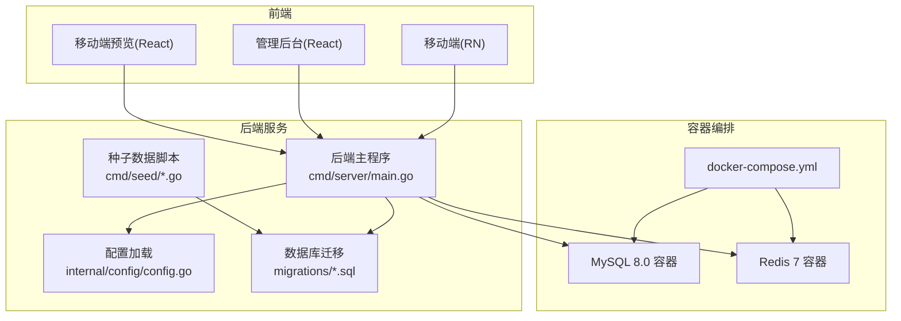
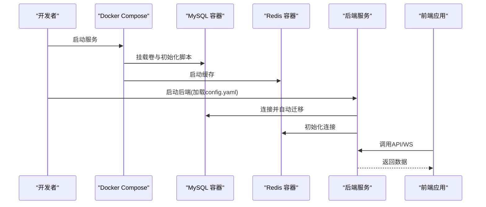
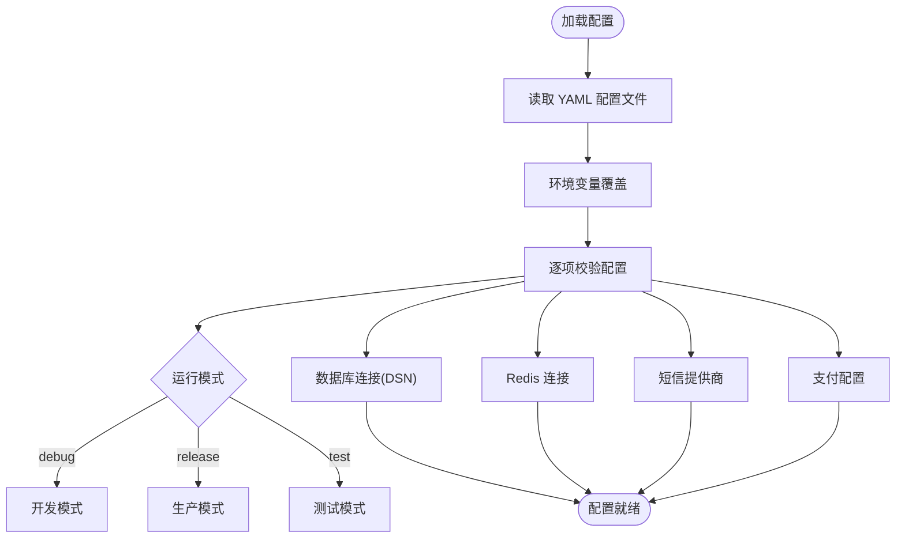
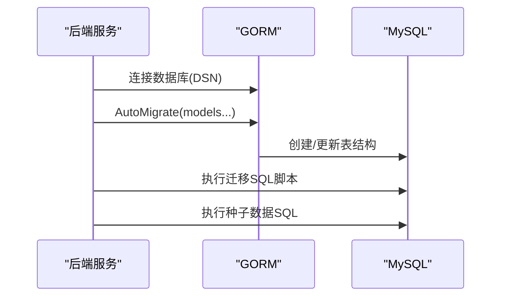
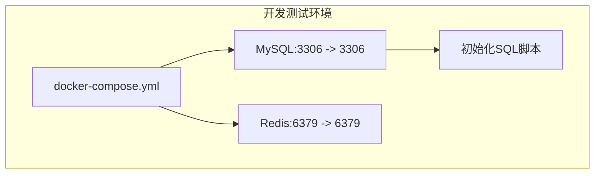
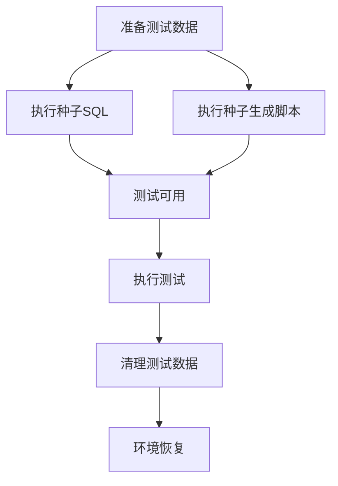
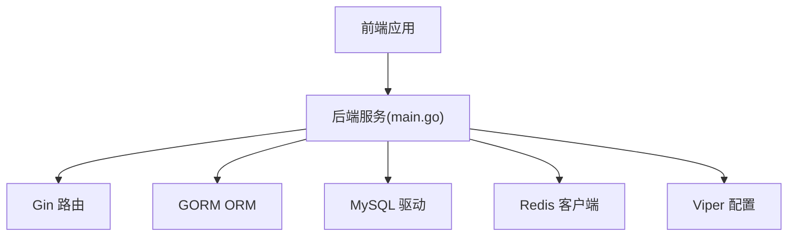

# 测试环境管理

<cite>
**本文引用的文件**
- [docker-compose.yml](file://docker/docker-compose.yml)
- [wurenji_backup.sql](file://docker/wurenji_backup.sql)
- [config.example.yaml](file://backend/config.example.yaml)
- [config.go](file://backend/internal/config/config.go)
- [main.go](file://backend/cmd/server/main.go)
- [001_init_schema.sql](file://backend/migrations/001_init_schema.sql)
- [002_seed_data.sql](file://backend/migrations/002_seed_data.sql)
- [seed/main.go](file://backend/cmd/seed/main.go)
- [seed_data/main.go](file://backend/cmd/seed_data/main.go)
- [build-android-apk.yml](file://.github/workflows/build-android-apk.yml)
- [TEST_CHECKLIST.md](file://TEST_CHECKLIST.md)
- [phase10_role_acceptance.sh](file://backend/scripts/phase10_role_acceptance.sh)
</cite>

## 目录
1. [简介](#简介)
2. [项目结构](#项目结构)
3. [核心组件](#核心组件)
4. [架构总览](#架构总览)
5. [详细组件分析](#详细组件分析)
6. [依赖关系分析](#依赖关系分析)
7. [性能考量](#性能考量)
8. [故障排查指南](#故障排查指南)
9. [结论](#结论)
10. [附录](#附录)

## 简介
本文件面向“无人机租赁平台”的测试环境管理，目标是帮助测试工程师与运维人员快速搭建与维护开发测试、预生产、性能测试三类环境；明确Docker容器化部署策略、数据库隔离与备份恢复机制；制定测试数据准备与清理策略；规范权限与安全配置；并在CI/CD流水线中集成测试环境的自动化部署与销毁；最后提供监控、故障排查与性能优化建议。

## 项目结构
- 后端采用Go语言，提供REST API与WebSocket服务，使用Gin框架、GORM ORM、MySQL与Redis。
- 前端包含移动端React Native应用、管理后台React应用与移动端预览应用。
- Docker编排提供MySQL与Redis服务，便于本地与CI环境快速拉起测试数据库与缓存。
- 配置系统基于YAML，支持环境变量覆盖，便于在不同环境中切换运行模式与连接参数。



图表来源
- [docker-compose.yml:1-27](file://docker/docker-compose.yml#L1-L27)
- [main.go:52-266](file://backend/cmd/server/main.go#L52-L266)
- [config.go:415-435](file://backend/internal/config/config.go#L415-L435)
- [001_init_schema.sql:1-200](file://backend/migrations/001_init_schema.sql#L1-L200)
- [002_seed_data.sql:1-178](file://backend/migrations/002_seed_data.sql#L1-L178)
- [seed/main.go:16-109](file://backend/cmd/seed/main.go#L16-L109)

章节来源
- [docker-compose.yml:1-27](file://docker/docker-compose.yml#L1-L27)
- [config.example.yaml:1-338](file://backend/config.example.yaml#L1-L338)
- [config.go:415-435](file://backend/internal/config/config.go#L415-L435)
- [main.go:52-266](file://backend/cmd/server/main.go#L52-L266)

## 核心组件
- 配置系统：支持YAML配置文件与环境变量覆盖，提供运行模式、数据库、Redis、JWT、短信、支付、地图、WebSocket、日志、CORS、推送、OAuth等配置项。
- 数据库与迁移：通过GORM自动迁移初始化Schema，并提供SQL脚本与种子数据工具。
- 容器化服务：MySQL与Redis通过Docker Compose提供测试环境数据库与缓存。
- CI/CD流水线：Android构建工作流展示了如何在CI中准备环境变量与产物。

章节来源
- [config.go:16-31](file://backend/internal/config/config.go#L16-L31)
- [config.example.yaml:14-338](file://backend/config.example.yaml#L14-L338)
- [001_init_schema.sql:1-200](file://backend/migrations/001_init_schema.sql#L1-L200)
- [002_seed_data.sql:1-178](file://backend/migrations/002_seed_data.sql#L1-L178)
- [seed/main.go:16-109](file://backend/cmd/seed/main.go#L16-L109)
- [build-android-apk.yml:1-74](file://.github/workflows/build-android-apk.yml#L1-L74)

## 架构总览
测试环境的关键交互如下：
- 开发测试环境：本地Docker Compose拉起MySQL与Redis，后端读取本地config.yaml，启动服务。
- 预生产环境：通过环境变量覆盖配置，连接独立的数据库与缓存实例。
- 性能测试环境：隔离数据库与缓存，使用独立的测试账号与数据集，限制并发与资源占用。
- CI/CD：在流水线中注入API地址、WebSocket地址、超时等环境变量，构建APK并上传制品。



图表来源
- [docker-compose.yml:1-27](file://docker/docker-compose.yml#L1-L27)
- [main.go:86-104](file://backend/cmd/server/main.go#L86-L104)
- [config.go:415-435](file://backend/internal/config/config.go#L415-L435)

## 详细组件分析

### 配置与环境管理
- 运行模式：支持debug、release、test三种模式，测试环境建议使用test模式以降低日志噪声并便于自动化。
- 数据库DSN：统一生成连接串，包含字符集、时区、参数绑定等，确保一致性。
- Redis连接：通过host/port/db组合，建议不同环境使用不同db编号避免冲突。
- 短信与支付：开发环境可使用mock，生产环境需配置真实提供商。
- 环境变量覆盖：Viper支持将环境变量映射到配置键，便于CI与容器化部署。



图表来源
- [config.go:415-464](file://backend/internal/config/config.go#L415-L464)
- [config.example.yaml:14-338](file://backend/config.example.yaml#L14-L338)

章节来源
- [config.go:415-464](file://backend/internal/config/config.go#L415-L464)
- [config.example.yaml:14-338](file://backend/config.example.yaml#L14-L338)

### 数据库与迁移
- 初始化Schema：通过SQL脚本创建核心表与索引，确保字符集与排序规则一致。
- 自动迁移：后端启动时调用GORM自动迁移，创建或更新表结构。
- 种子数据：提供SQL脚本与Go脚本两种方式，前者适合快速导入，后者适合动态生成测试数据。



图表来源
- [main.go:268-292](file://backend/cmd/server/main.go#L268-L292)
- [main.go:294-389](file://backend/cmd/server/main.go#L294-L389)
- [001_init_schema.sql:1-200](file://backend/migrations/001_init_schema.sql#L1-L200)
- [002_seed_data.sql:1-178](file://backend/migrations/002_seed_data.sql#L1-L178)

章节来源
- [main.go:268-292](file://backend/cmd/server/main.go#L268-L292)
- [main.go:294-389](file://backend/cmd/server/main.go#L294-L389)
- [001_init_schema.sql:1-200](file://backend/migrations/001_init_schema.sql#L1-L200)
- [002_seed_data.sql:1-178](file://backend/migrations/002_seed_data.sql#L1-L178)
- [seed/main.go:16-109](file://backend/cmd/seed/main.go#L16-L109)
- [seed_data/main.go:54-86](file://backend/cmd/seed_data/main.go#L54-L86)

### 容器化与部署策略
- Docker Compose：定义MySQL与Redis服务，挂载数据卷与初始化脚本，暴露端口便于本地调试。
- 环境隔离：通过不同compose文件或环境变量区分开发、预生产与性能测试环境。
- 数据持久化：MySQL与Redis使用命名卷，避免容器删除导致数据丢失。
- 初始化策略：容器首次启动时执行初始化SQL脚本，确保测试数据库具备基础Schema。



图表来源
- [docker-compose.yml:1-27](file://docker/docker-compose.yml#L1-L27)
- [001_init_schema.sql:1-200](file://backend/migrations/001_init_schema.sql#L1-L200)

章节来源
- [docker-compose.yml:1-27](file://docker/docker-compose.yml#L1-L27)
- [wurenji_backup.sql:1-21](file://docker/wurenji_backup.sql#L1-L21)

### 测试数据准备、清理与管理
- 预置数据：002_seed_data.sql提供完整测试数据集，包含用户、无人机、供给、需求、订单、支付、消息、评价、匹配记录、系统配置与管理员日志。
- 动态生成：seed_data/main.go可批量生成用户、无人机、供给与需求，便于大规模性能测试。
- 清理策略：测试结束后可执行删除语句清空测试表，或重建数据库容器以恢复干净状态。
- 数据隔离：不同环境使用不同Redis db编号与独立数据库，避免交叉污染。



图表来源
- [002_seed_data.sql:1-178](file://backend/migrations/002_seed_data.sql#L1-L178)
- [seed_data/main.go:54-86](file://backend/cmd/seed_data/main.go#L54-L86)
- [seed/main.go:16-109](file://backend/cmd/seed/main.go#L16-L109)

章节来源
- [002_seed_data.sql:1-178](file://backend/migrations/002_seed_data.sql#L1-L178)
- [seed_data/main.go:54-86](file://backend/cmd/seed_data/main.go#L54-L86)
- [seed/main.go:16-109](file://backend/cmd/seed/main.go#L16-L109)

### 权限控制与安全配置
- JWT密钥：必须使用强随机密钥，生产环境禁止使用示例密钥。
- 运行模式：测试环境使用test模式，生产环境必须使用release模式。
- 短信与支付：开发环境使用mock，生产环境必须配置真实提供商。
- CORS：生产环境需限制允许的源与方法，避免跨域风险。
- 文件上传：限制文件大小与扩展名，使用安全保存路径。

章节来源
- [config.go:139-162](file://backend/internal/config/config.go#L139-L162)
- [config.go:466-489](file://backend/internal/config/config.go#L466-L489)
- [config.example.yaml:82-338](file://backend/config.example.yaml#L82-L338)

### CI/CD集成与自动化
- Android构建：流水线中设置API地址、WebSocket地址、超时等环境变量，打包APK并上传制品。
- 自动化验收：提供角色验收脚本，可在CI中执行并生成报告，便于回归验证。
- 环境变量注入：通过环境变量覆盖后端配置，实现不同环境的无缝切换。

```mermaid
sequenceDiagram
participant CI as "CI 系统"
participant RN as "RN 构建"
participant AND as "Android 打包"
participant ART as "制品存储"
CI->>RN : 设置环境变量(.env)
RN->>AND : 打包APK
AND->>ART : 上传APK
CI-->>CI : 触发后续步骤
```

图表来源
- [build-android-apk.yml:32-72](file://.github/workflows/build-android-apk.yml#L32-L72)
- [phase10_role_acceptance.sh:1-55](file://backend/scripts/phase10_role_acceptance.sh#L1-L55)

章节来源
- [build-android-apk.yml:1-74](file://.github/workflows/build-android-apk.yml#L1-L74)
- [phase10_role_acceptance.sh:1-55](file://backend/scripts/phase10_role_acceptance.sh#L1-L55)

## 依赖关系分析
- 后端依赖：Gin路由、GORM ORM、MySQL驱动、Redis客户端、Zap日志、Viper配置。
- 前端依赖：React生态、React Native、WebSocket客户端。
- 基础设施：Docker Compose、MySQL、Redis。



图表来源
- [main.go:3-50](file://backend/cmd/server/main.go#L3-L50)

章节来源
- [main.go:3-50](file://backend/cmd/server/main.go#L3-L50)

## 性能考量
- 数据库连接池：合理设置最大空闲与最大打开连接数，避免连接争用。
- Redis缓存：使用独立db编号，避免与其他环境共享键空间；必要时开启持久化与备份。
- 日志级别：测试环境使用info或warn，减少IO开销；生产环境使用error级别。
- WebSocket：合理设置消息大小与心跳周期，避免内存泄漏。
- 前端网络：设置合理的超时与重试策略，避免阻塞UI线程。

## 故障排查指南
- 无法发送验证码：检查后端服务是否启动、Redis是否运行。
- 登录后页面空白：检查浏览器控制台错误、确认API地址配置正确。
- 接口返回401：检查Token是否过期、Authorization头格式是否为Bearer。
- 数据库连接失败：检查MySQL容器状态、确认config.yaml配置正确。
- CI构建失败：检查环境变量是否注入、依赖安装是否成功。

章节来源
- [TEST_CHECKLIST.md:431-448](file://TEST_CHECKLIST.md#L431-L448)

## 结论
通过Docker容器化、完善的配置体系、标准化的数据库迁移与种子数据、以及CI/CD流水线集成，本项目能够高效地搭建与维护多环境测试体系。建议在实际落地中进一步完善自动化脚本、监控告警与备份恢复流程，持续提升测试效率与稳定性。

## 附录
- 测试环境配置示例
  - 开发测试环境：使用默认config.yaml，Docker Compose启动MySQL与Redis，运行后端服务。
  - 预生产环境：通过环境变量覆盖数据库与Redis连接参数，使用独立db编号。
  - 性能测试环境：隔离数据库与缓存，使用独立测试账号与数据集，限制并发。
- 监控与日志
  - 后端日志：通过Zap输出，支持文件与控制台；生产环境建议集中化收集。
  - 前端日志：通过浏览器控制台与网络面板定位问题。
- 备份与恢复
  - 备份：定期导出数据库与Redis快照，保存到安全位置。
  - 恢复：使用备份SQL与快照快速恢复测试环境。