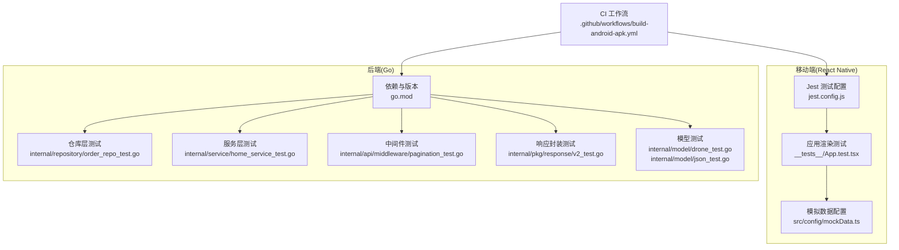
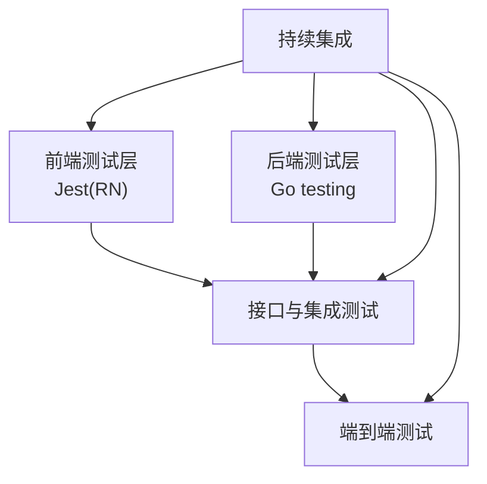
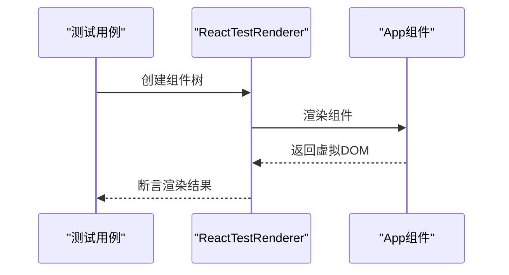
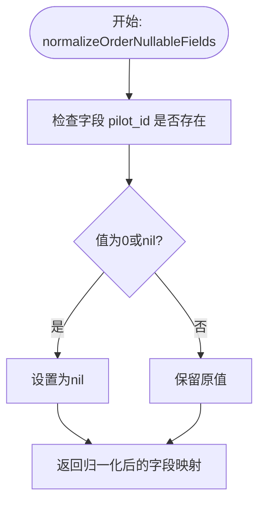
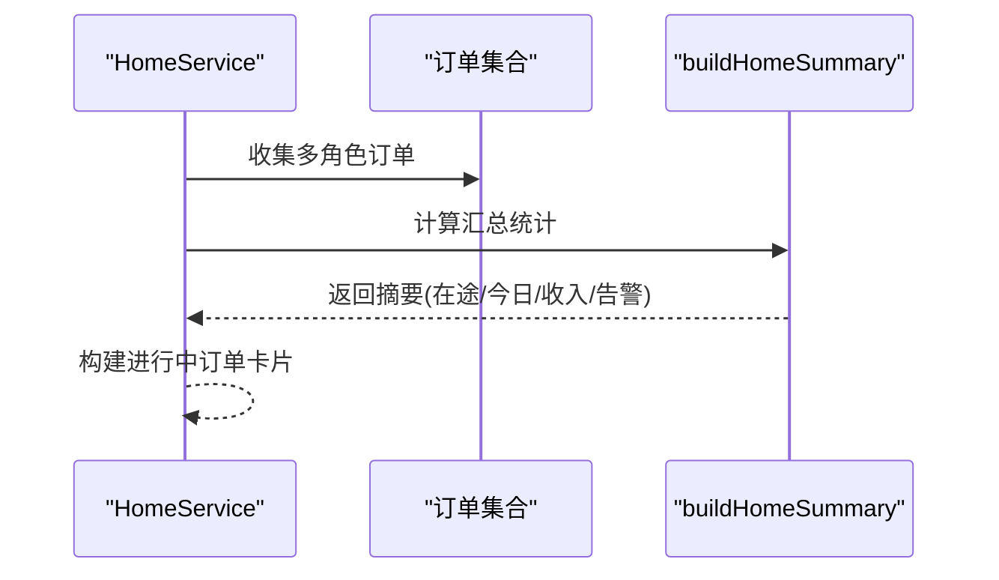
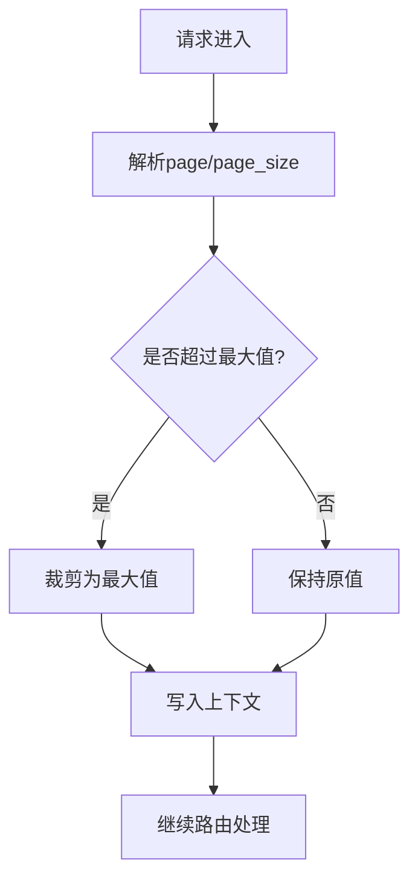
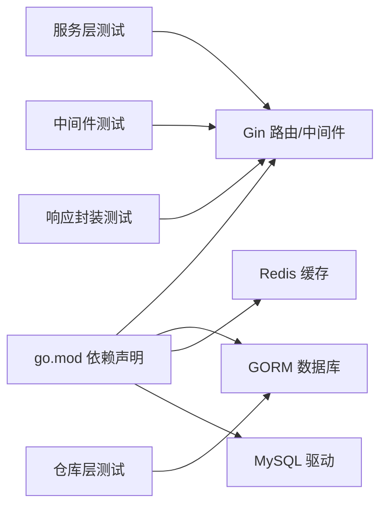

# 自动化测试策略

<cite>
**本文引用的文件**
- [mobile/jest.config.js](file://mobile/jest.config.js)
- [mobile/__tests__/App.test.tsx](file://mobile/__tests__/App.test.tsx)
- [mobile/src/config/mockData.ts](file://mobile/src/config/mockData.ts)
- [backend/go.mod](file://backend/go.mod)
- [backend/internal/repository/order_repo.go](file://backend/internal/repository/order_repo.go)
- [backend/internal/repository/order_repo_test.go](file://backend/internal/repository/order_repo_test.go)
- [backend/internal/service/home_service.go](file://backend/internal/service/home_service.go)
- [backend/internal/service/home_service_test.go](file://backend/internal/service/home_service_test.go)
- [backend/internal/api/middleware/pagination.go](file://backend/internal/api/middleware/pagination.go)
- [backend/internal/api/middleware/pagination_test.go](file://backend/internal/api/middleware/pagination_test.go)
- [backend/internal/api/middleware/legacy_write_freeze_test.go](file://backend/internal/api/middleware/legacy_write_freeze_test.go)
- [backend/internal/pkg/response/v2_test.go](file://backend/internal/pkg/response/v2_test.go)
- [backend/internal/model/drone_test.go](file://backend/internal/model/drone_test.go)
- [backend/internal/model/json_test.go](file://backend/internal/model/json_test.go)
- [.github/workflows/build-android-apk.yml](file://.github/workflows/build-android-apk.yml)
</cite>

## 目录
1. [引言](#引言)
2. [项目结构](#项目结构)
3. [核心组件](#核心组件)
4. [架构总览](#架构总览)
5. [详细组件分析](#详细组件分析)
6. [依赖分析](#依赖分析)
7. [性能考虑](#性能考虑)
8. [故障排查指南](#故障排查指南)
9. [结论](#结论)
10. [附录](#附录)

## 引言
本文件为无人机租赁平台制定全面的自动化测试策略，覆盖前端React Native应用与后端Go服务的单元测试、集成测试与端到端测试。结合现有测试文件与配置，明确测试框架、用例设计原则、测试数据管理、环境隔离与持续集成流程，并提供可维护的测试代码示例路径与覆盖率监控建议。

## 项目结构
- 移动端（React Native）位于 mobile/，采用Jest作为单元测试框架，测试入口位于 __tests__/App.test.tsx，Jest配置位于 jest.config.js。
- 后端（Go）位于 backend/，使用标准库 testing 包进行单元测试，测试文件按功能模块分布在 internal/* 对应目录下。
- 持续集成工作流位于 .github/workflows/build-android-apk.yml，可用于扩展测试任务。

**图表来源**
- [mobile/jest.config.js:1-4](file://mobile/jest.config.js#L1-L4)
- [mobile/__tests__/App.test.tsx:1-14](file://mobile/__tests__/App.test.tsx#L1-L14)
- [mobile/src/config/mockData.ts:1-204](file://mobile/src/config/mockData.ts#L1-L204)
- [backend/go.mod:1-80](file://backend/go.mod#L1-L80)
- [backend/internal/repository/order_repo_test.go:1-25](file://backend/internal/repository/order_repo_test.go#L1-L25)
- [backend/internal/service/home_service_test.go:1-62](file://backend/internal/service/home_service_test.go#L1-L62)
- [backend/internal/api/middleware/pagination_test.go:1-42](file://backend/internal/api/middleware/pagination_test.go#L1-L42)
- [backend/internal/pkg/response/v2_test.go:1-80](file://backend/internal/pkg/response/v2_test.go#L1-L80)
- [backend/internal/model/drone_test.go:1-39](file://backend/internal/model/drone_test.go#L1-L39)
- [backend/internal/model/json_test.go:1-19](file://backend/internal/model/json_test.go#L1-L19)
- [.github/workflows/build-android-apk.yml](file://.github/workflows/build-android-apk.yml)

**章节来源**
- [mobile/jest.config.js:1-4](file://mobile/jest.config.js#L1-L4)
- [mobile/__tests__/App.test.tsx:1-14](file://mobile/__tests__/App.test.tsx#L1-L14)
- [mobile/src/config/mockData.ts:1-204](file://mobile/src/config/mockData.ts#L1-L204)
- [backend/go.mod:1-80](file://backend/go.mod#L1-L80)
- [.github/workflows/build-android-apk.yml](file://.github/workflows/build-android-apk.yml)

## 核心组件
- 前端单元测试框架与配置
  - Jest预设：react-native，满足RN组件渲染与异步行为测试。
  - 示例测试：渲染正确性验证，使用ReactTestRenderer创建组件树。
- 测试数据管理
  - 开发模式模拟数据：mockData.ts提供默认位置、附近无人机等真实API返回格式的模拟数据，支持开发调试与降级场景。
- 后端测试框架与组织
  - Go标准库 testing，按模块划分测试文件，覆盖仓库层、服务层、中间件与响应封装。
  - 依赖管理：go.mod声明Gin、GORM、Redis、MySQL等外部依赖，支撑测试运行。

**章节来源**
- [mobile/jest.config.js:1-4](file://mobile/jest.config.js#L1-L4)
- [mobile/__tests__/App.test.tsx:1-14](file://mobile/__tests__/App.test.tsx#L1-L14)
- [mobile/src/config/mockData.ts:1-204](file://mobile/src/config/mockData.ts#L1-L204)
- [backend/go.mod:1-80](file://backend/go.mod#L1-L80)

## 架构总览
测试架构围绕“前端单元测试 + 后端单元测试 + 接口与集成测试 + 端到端测试”的分层策略展开，配合CI流水线执行。

[此图为概念性架构图，无需图表来源]

## 详细组件分析

### 前端：单元测试框架与最佳实践
- 测试框架与配置
  - 使用Jest预设 react-native，简化RN测试环境初始化。
  - 示例测试覆盖组件渲染正确性，适合基础快照与行为验证。
- 测试数据与Mock策略
  - 使用 mockData.ts 提供默认位置与附近无人机等数据，便于在API不可用时进行降级测试。
  - 建议在测试中通过 __DEV__ 条件切换，确保生产环境不使用模拟数据。
- 可维护性建议
  - 将通用Mock数据抽取为独立工厂函数，减少重复。
  - 使用测试专用的全局变量或上下文，避免污染全局状态。
  - 为异步渲染与网络请求提供统一的Mock层，便于替换与扩展。

**图表来源**
- [mobile/__tests__/App.test.tsx:9-13](file://mobile/__tests__/App.test.tsx#L9-L13)

**章节来源**
- [mobile/jest.config.js:1-4](file://mobile/jest.config.js#L1-L4)
- [mobile/__tests__/App.test.tsx:1-14](file://mobile/__tests__/App.test.tsx#L1-L14)
- [mobile/src/config/mockData.ts:178-203](file://mobile/src/config/mockData.ts#L178-L203)

### 后端：仓库层测试（Repository）
- 测试目标
  - 验证OrderRepo对nullable字段的归一化处理，确保pilot_id为0时转换为nil，避免写入无效值。
- 测试方法
  - 直接调用normalizeOrderNullableFields并断言结果，覆盖零值与正数场景。
- 可维护性建议
  - 将字段归一化规则抽象为可配置策略，便于扩展其他nullable字段。
  - 为复杂查询增加边界条件测试，如空结果集、分页越界等。

**图表来源**
- [backend/internal/repository/order_repo.go:90-117](file://backend/internal/repository/order_repo.go#L90-L117)
- [backend/internal/repository/order_repo_test.go:5-24](file://backend/internal/repository/order_repo_test.go#L5-L24)

**章节来源**
- [backend/internal/repository/order_repo.go:90-117](file://backend/internal/repository/order_repo.go#L90-L117)
- [backend/internal/repository/order_repo_test.go:1-25](file://backend/internal/repository/order_repo_test.go#L1-L25)

### 后端：服务层测试（Service）
- 测试目标
  - HomeService构建首页汇总统计与卡片数据，需验证时间窗口、状态归一化与收入计算。
- 测试方法
  - 构造不同创建时间与状态的订单集合，断言今日订单数、在途订单数、今日收入与告警数量。
  - 验证供应与需求文本提取优先级，确保服务地址优先于其他快照。
- 可维护性建议
  - 将时间窗口与阈值参数化，便于调整业务规则。
  - 抽象状态归一化逻辑，避免重复实现。

**图表来源**
- [backend/internal/service/home_service.go:157-216](file://backend/internal/service/home_service.go#L157-L216)
- [backend/internal/service/home_service_test.go:10-61](file://backend/internal/service/home_service_test.go#L10-L61)

**章节来源**
- [backend/internal/service/home_service.go:157-216](file://backend/internal/service/home_service.go#L157-L216)
- [backend/internal/service/home_service_test.go:1-62](file://backend/internal/service/home_service_test.go#L1-L62)

### 后端：中间件测试（Middleware）
- 分页中间件
  - 测试默认值、上限裁剪与非法输入处理，确保分页参数安全可靠。
- 写冻结中间件
  - 测试对写操作的拦截、读操作放行与白名单前缀绕过机制，保障迁移期数据安全。

**图表来源**
- [backend/internal/api/middleware/pagination.go:14-36](file://backend/internal/api/middleware/pagination.go#L14-L36)
- [backend/internal/api/middleware/pagination_test.go:11-34](file://backend/internal/api/middleware/pagination_test.go#L11-L34)

**章节来源**
- [backend/internal/api/middleware/pagination.go:1-71](file://backend/internal/api/middleware/pagination.go#L1-L71)
- [backend/internal/api/middleware/pagination_test.go:1-42](file://backend/internal/api/middleware/pagination_test.go#L1-L42)
- [backend/internal/api/middleware/legacy_write_freeze_test.go:1-82](file://backend/internal/api/middleware/legacy_write_freeze_test.go#L1-L82)

### 后端：响应封装测试（Response）
- 测试目标
  - 验证v2响应封装在成功列表、未授权等场景下的结构一致性，包括trace_id与分页元数据。
- 测试方法
  - 通过httptest构造请求，断言响应码与载荷字段，确保中间件与响应封装协同工作。

**章节来源**
- [backend/internal/pkg/response/v2_test.go:1-80](file://backend/internal/pkg/response/v2_test.go#L1-L80)

### 后端：模型测试（Model）
- JSON类型扫描稳定性
  - 验证从数据库驱动复制字节后，原始切片修改不影响已扫描JSON内容。
- 无人机模型规则
  - 验证重型吊装阈值判断与市场准入条件（可用、认证、UOM、保险、适航均需通过）。

**章节来源**
- [backend/internal/model/json_test.go:1-19](file://backend/internal/model/json_test.go#L1-L19)
- [backend/internal/model/drone_test.go:1-39](file://backend/internal/model/drone_test.go#L1-L39)

## 依赖分析
- 前端
  - Jest预设 react-native 适配RN组件测试；组件渲染测试依赖 ReactTestRenderer。
  - 模拟数据通过 mockData.ts 提供，开发模式下可替代真实API。
- 后端
  - Gin路由与中间件、GORM数据库访问、Redis缓存、MySQL驱动等均在 go.mod 中声明，测试需保证依赖可用。
  - 测试文件按模块分布，仓库层、服务层、中间件与响应封装分别对应独立测试文件，耦合度低、内聚性强。

**图表来源**
- [backend/go.mod:5-21](file://backend/go.mod#L5-L21)
- [backend/internal/repository/order_repo_test.go:1-25](file://backend/internal/repository/order_repo_test.go#L1-L25)
- [backend/internal/service/home_service_test.go:1-62](file://backend/internal/service/home_service_test.go#L1-L62)
- [backend/internal/api/middleware/pagination_test.go:1-42](file://backend/internal/api/middleware/pagination_test.go#L1-L42)
- [backend/internal/pkg/response/v2_test.go:1-80](file://backend/internal/pkg/response/v2_test.go#L1-L80)

**章节来源**
- [backend/go.mod:1-80](file://backend/go.mod#L1-L80)

## 性能考虑
- 前端
  - 测试渲染复杂组件时，优先使用浅渲染或片段渲染，减少不必要的子树计算。
  - 控制测试数据规模，避免在单测中加载大量Mock数据导致内存压力。
- 后端
  - 测试中尽量使用内存数据库或最小化依赖，缩短测试执行时间。
  - 对复杂查询与聚合逻辑，拆分为可独立测试的小函数，提升可维护性与执行效率。

[本节为通用指导，无需章节来源]

## 故障排查指南
- 前端
  - 若渲染测试失败，检查组件是否正确处理异步状态与错误边界；确认 __DEV__ 条件下的Mock数据切换逻辑。
  - 若Mock数据不生效，核对 mockData.ts 的导出与导入路径，确保在测试环境中启用开发模式。
- 后端
  - 中间件测试失败通常源于参数解析或上下文传递问题，检查默认值与裁剪逻辑。
  - 仓库层测试失败多与nullable字段处理有关，确认归一化函数对不同数值类型的处理一致。
  - 服务层测试失败可能由于时间窗口或状态归一化差异，核对业务规则与断言条件。

**章节来源**
- [mobile/src/config/mockData.ts:178-203](file://mobile/src/config/mockData.ts#L178-L203)
- [backend/internal/api/middleware/pagination_test.go:11-34](file://backend/internal/api/middleware/pagination_test.go#L11-L34)
- [backend/internal/repository/order_repo.go:90-117](file://backend/internal/repository/order_repo.go#L90-L117)
- [backend/internal/service/home_service.go:436-452](file://backend/internal/service/home_service.go#L436-L452)

## 结论
通过现有测试文件与配置可以看出，项目已在前端与后端建立了基础的单元测试体系。建议在此基础上进一步完善：
- 前端：引入更丰富的交互测试与异步行为测试，完善Mock数据工厂与环境隔离。
- 后端：扩展集成测试与API测试，补充数据库事务与并发场景测试。
- 全局：在CI中加入测试覆盖率报告与失败重试策略，确保质量与稳定性。

[本节为总结，无需章节来源]

## 附录

### 测试用例设计原则
- 单一职责：每个测试聚焦一个功能点或边界条件。
- 可重复性：测试不依赖外部状态，具备可重复执行能力。
- 明确断言：断言清晰表达期望结果，避免模糊匹配。
- 最小化依赖：尽量使用Mock与Fake对象，减少外部系统耦合。

### 测试数据管理
- 开发模式：使用 mockData.ts 提供真实API格式的降级数据，确保开发与调试效率。
- 测试模式：为测试构造独立的Mock数据集，避免污染共享数据源。
- 生产隔离：严禁在生产环境使用任何模拟数据。

**章节来源**
- [mobile/src/config/mockData.ts:1-204](file://mobile/src/config/mockData.ts#L1-L204)

### 测试环境隔离
- 前端：通过 __DEV__ 切换与Jest配置隔离开发与测试环境。
- 后端：使用测试数据库或内存数据库，确保测试互不干扰。

### 持续集成流程
- 当前工作流：Android APK构建流程，可扩展添加测试步骤。
- 建议：在CI中增加前端与后端测试阶段，失败即阻断合并。

**章节来源**
- [.github/workflows/build-android-apk.yml](file://.github/workflows/build-android-apk.yml)