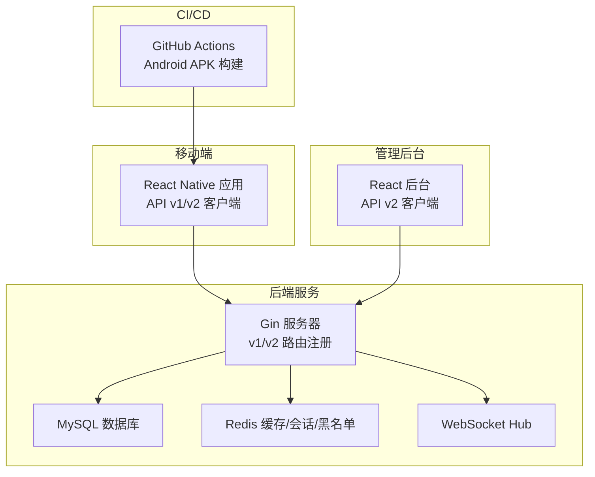
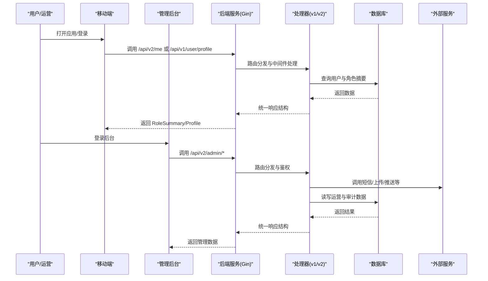
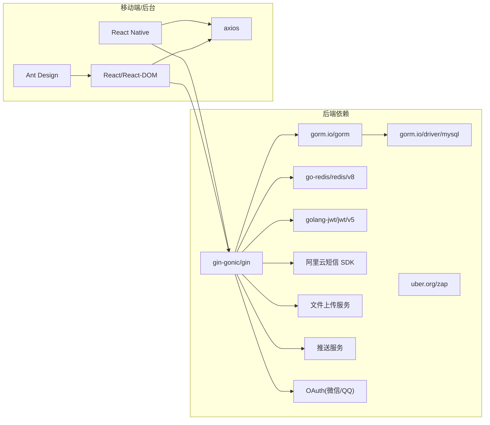

# 贡献指南

<cite>
**本文引用的文件**
- [README.md](file://README.md)
- [BUSINESS_API_CONTRACT.md](file://BUSINESS_API_CONTRACT.md)
- [BUSINESS_ROLE_REDESIGN.md](file://BUSINESS_ROLE_REDESIGN.md)
- [REFACTOR_MASTER_TASKLIST.md](file://REFACTOR_MASTER_TASKLIST.md)
- [TEST_CHECKLIST.md](file://TEST_CHECKLIST.md)
- [MOBILE_REGRESSION_ACCEPTANCE.md](file://MOBILE_REGRESSION_ACCEPTANCE.md)
- [ROLE_ACCEPTANCE_WALKTHROUGH.md](file://ROLE_ACCEPTANCE_WALKTHROUGH.md)
- [DEMO_ACCOUNTS.md](file://DEMO_ACCOUNTS.md)
- [backend/go.mod](file://backend/go.mod)
- [mobile/package.json](file://mobile/package.json)
- [admin/package.json](file://admin/package.json)
- [.github/workflows/build-android-apk.yml](file://.github/workflows/build-android-apk.yml)
- [backend/cmd/server/main.go](file://backend/cmd/server/main.go)
- [mobile/src/services/api.ts](file://mobile/src/services/api.ts)
- [admin/src/services/api.ts](file://admin/src/services/api.ts)
</cite>

## 目录
1. [简介](#简介)
2. [项目结构](#项目结构)
3. [核心组件](#核心组件)
4. [架构总览](#架构总览)
5. [详细组件分析](#详细组件分析)
6. [依赖分析](#依赖分析)
7. [性能考虑](#性能考虑)
8. [故障排查指南](#故障排查指南)
9. [结论](#结论)
10. [附录](#附录)

## 简介
本指南面向希望参与无人机租赁平台开源项目的贡献者，涵盖开发环境搭建、代码与文档贡献流程、Issue 与 Pull Request 提交流程、代码审查参与方式、社区行为准则、治理结构与决策流程、版本与发布节奏、新贡献者入门、常见问题与联系方式等内容。项目当前聚焦 v2 重构，围绕“重载末端货物吊运”业务，统一了角色、对象与接口契约，提供前后端一体化的协作范式。

## 项目结构
项目采用多模块分层组织：
- 后端服务（Go/Gin）：提供 v1/v2 双栈 API、领域服务、仓储与 Websocket。
- 移动端（React Native/Vite）：接入 v1/v2 双客户端，按角色与页面域重构。
- 管理后台（React/Vite）：基于 v2 接口的运营与审计看板。
- GitHub Actions：自动化构建 Android APK。
- 文档与任务清单：业务契约、角色重构、迁移方案、测试验收与演示账号说明。

图表来源
- [backend/cmd/server/main.go:249-266](file://backend/cmd/server/main.go#L249-L266)
- [.github/workflows/build-android-apk.yml:1-74](file://.github/workflows/build-android-apk.yml#L1-L74)

章节来源
- [README.md:1-29](file://README.md#L1-L29)
- [backend/cmd/server/main.go:249-266](file://backend/cmd/server/main.go#L249-L266)
- [.github/workflows/build-android-apk.yml:1-74](file://.github/workflows/build-android-apk.yml#L1-L74)

## 核心组件
- 接口契约与版本策略：v2 作为新页面与新服务层的统一出口，v1 保留用于历史页面与数据比对。
- 认证与初始化：统一 Bearer Token 认证，提供注册、登录与角色摘要初始化。
- 业务对象与状态机：需求、供给、订单、派单任务、飞行记录五类核心对象，配套生命周期与状态推进规则。
- 双端客户端：移动端与管理后台分别接入 v1/v2 客户端，统一响应结构与错误处理。
- 运维与测试：阶段化任务清单、自动验收脚本、移动端回归清单与演示账号。

章节来源
- [BUSINESS_API_CONTRACT.md:20-111](file://BUSINESS_API_CONTRACT.md#L20-L111)
- [BUSINESS_ROLE_REDESIGN.md:689-798](file://BUSINESS_ROLE_REDESIGN.md#L689-L798)
- [mobile/src/services/api.ts:1-155](file://mobile/src/services/api.ts#L1-L155)
- [admin/src/services/api.ts:1-402](file://admin/src/services/api.ts#L1-L402)

## 架构总览
后端服务通过 Gin 注册 v1/v2 路由，注入认证、日志、CORS、分页与追踪中间件；领域服务通过仓储层访问数据库与外部服务（短信、上传、推送、OAuth 等）；移动端与管理后台通过 Axios 客户端访问 API，统一处理鉴权与业务错误。

图表来源
- [backend/cmd/server/main.go:249-266](file://backend/cmd/server/main.go#L249-L266)
- [mobile/src/services/api.ts:1-155](file://mobile/src/services/api.ts#L1-L155)
- [admin/src/services/api.ts:1-402](file://admin/src/services/api.ts#L1-L402)

## 详细组件分析

### 开发环境搭建
- 后端
  - Go 版本与依赖：项目使用 Go 模块管理，包含 Gin、GORM、Redis、JWT、Zap 等依赖。
  - 启动方式：通过后端入口程序加载配置、初始化数据库与 Redis、注册 v1/v2 路由并启动服务。
- 移动端
  - Node 版本要求：工程配置要求 Node >= 22.11.0。
  - 依赖安装与运行：使用 npm 脚本启动开发服务器与测试。
- 管理后台
  - 依赖安装与运行：使用 npm 脚本启动开发服务器。
- CI/CD
  - Android APK 构建：GitHub Actions 在推送或手动触发时，配置 Node 与 JDK，打包并上传产物。

章节来源
- [backend/go.mod:1-80](file://backend/go.mod#L1-L80)
- [backend/cmd/server/main.go:52-100](file://backend/cmd/server/main.go#L52-L100)
- [mobile/package.json:59-62](file://mobile/package.json#L59-L62)
- [admin/package.json:5-9](file://admin/package.json#L5-L9)
- [.github/workflows/build-android-apk.yml:1-74](file://.github/workflows/build-android-apk.yml#L1-L74)

### 接口契约与版本策略
- 版本建议：v1 仅用于历史页面与数据比对，v2 为新页面与新服务层统一出口。
- 认证方式：除登录注册外，统一使用 Bearer Token。
- 统一响应结构：code/message/data/meta/trace_id；列表接口 data.items + meta.page/page_size/total。
- 平台边界：限定为“重载末端货物吊运”，服务类型与准入门槛固定。

章节来源
- [BUSINESS_API_CONTRACT.md:20-111](file://BUSINESS_API_CONTRACT.md#L20-L111)

### 角色与业务对象
- 角色模型：平台账号 + 能力档案 + 业务关系，支持客户、机主、飞手与复合身份。
- 四类核心对象：需求、供给、订单、派单任务、飞行记录。
- 生命周期与状态推进：需求、供给、订单、派单任务与飞行记录均有明确状态机与推进规则。

章节来源
- [BUSINESS_ROLE_REDESIGN.md:44-130](file://BUSINESS_ROLE_REDESIGN.md#L44-L130)
- [BUSINESS_ROLE_REDESIGN.md:689-798](file://BUSINESS_ROLE_REDESIGN.md#L689-L798)

### 双端客户端与错误处理
- 移动端：同时维护 v1/v2 客户端，统一鉴权头与业务错误处理，支持 Token 刷新与并发请求排队。
- 管理后台：基于 v2 接口封装，统一鉴权头与业务错误处理，支持 Token 刷新与登录态持久化。

章节来源
- [mobile/src/services/api.ts:1-155](file://mobile/src/services/api.ts#L1-L155)
- [admin/src/services/api.ts:1-402](file://admin/src/services/api.ts#L1-L402)

### 测试与验收
- 阶段 10 自动验收：提供自动脚本生成验收报告与角色主链路清单。
- 移动端回归：提供关键页面回归清单与截图验收标准。
- 演示账号：提供测试账户与角色说明，便于快速验证。

章节来源
- [TEST_CHECKLIST.md:9-41](file://TEST_CHECKLIST.md#L9-L41)
- [MOBILE_REGRESSION_ACCEPTANCE.md](file://MOBILE_REGRESSION_ACCEPTANCE.md)
- [DEMO_ACCOUNTS.md](file://DEMO_ACCOUNTS.md)

### 重构任务总览与执行顺序
- 阶段划分：文档基线、数据库与领域模型、后端服务、API v2 实现、移动端基础与市场/履约/我的域、后台适配、数据迁移与切流、测试验收。
- 建议执行顺序：先模型与状态机，再 API，随后按页面域分批切移动端，后台在不影响主链路前提下并行推进，最后数据切流与回归。

章节来源
- [REFACTOR_MASTER_TASKLIST.md:497-504](file://REFACTOR_MASTER_TASKLIST.md#L497-L504)

## 依赖分析
后端依赖采用模块化组织，核心包括 Web 框架、ORM、缓存、JWT、日志、短信、上传、推送与 OAuth 等。移动端与管理后台通过 Axios 客户端访问 API，统一处理认证与业务错误。

图表来源
- [backend/go.mod:1-80](file://backend/go.mod#L1-L80)
- [mobile/package.json:14-35](file://mobile/package.json#L14-L35)
- [admin/package.json:14-24](file://admin/package.json#L14-L24)

章节来源
- [backend/go.mod:1-80](file://backend/go.mod#L1-L80)
- [mobile/package.json:14-35](file://mobile/package.json#L14-L35)
- [admin/package.json:14-24](file://admin/package.json#L14-L24)

## 性能考虑
- 日志与中间件：生产模式使用生产日志，启用 CORS、日志与恢复中间件，减少异常对服务的影响。
- 数据库连接池：合理设置最大空闲与最大连接数，显式设置字符集。
- 缓存与会话：使用 Redis 存储会话与黑名单，降低数据库压力。
- API 响应：统一响应结构与分页，前端按需加载，避免一次性拉取大量数据。

章节来源
- [backend/cmd/server/main.go:77-100](file://backend/cmd/server/main.go#L77-L100)
- [backend/cmd/server/main.go:268-292](file://backend/cmd/server/main.go#L268-L292)

## 故障排查指南
- 401 未授权：检查 Authorization 头格式与 Token 是否过期，必要时使用刷新接口获取新 Token。
- 网络请求失败：检查 API 地址配置、超时设置与跨域策略。
- 数据库连接失败：确认 MySQL 容器运行状态与配置文件。
- 移动端页面空白：检查浏览器控制台错误与 API 地址配置。
- CI 构建失败：检查 Node/JDK 版本、Android SDK 与环境变量。

章节来源
- [mobile/src/services/api.ts:74-146](file://mobile/src/services/api.ts#L74-L146)
- [admin/src/services/api.ts:74-137](file://admin/src/services/api.ts#L74-L137)
- [TEST_CHECKLIST.md:431-448](file://TEST_CHECKLIST.md#L431-L448)
- [.github/workflows/build-android-apk.yml:1-74](file://.github/workflows/build-android-apk.yml#L1-L74)

## 结论
本项目以 v2 为核心，通过统一接口契约、角色模型与业务对象，实现了需求、供给、订单、派单与飞行记录的闭环。贡献者可通过阶段化任务清单与自动验收流程，高效参与重构与迭代。建议从环境搭建、接口契约与角色模型入手，逐步深入到页面域与后台运营，配合测试与验收文档，确保质量与一致性。

## 附录

### 如何参与贡献
- 新手入门
  - 阅读 README 与业务契约，理解 v2 业务边界与角色模型。
  - 搭建本地开发环境，启动后端、移动端与管理后台。
  - 查看阶段 10 验收与移动端回归清单，熟悉主链路与验收标准。
- 提交 Issue
  - 在仓库 Issues 中新建 Issue，选择模板并填写预期行为、实际行为、复现步骤与日志。
- 创建 Pull Request
  - 基于最新分支创建功能分支，遵循统一响应结构与错误处理规范。
  - 在 PR 描述中引用相关任务编号与验收文档链接。
- 代码审查
  - 关注接口一致性、状态机与生命周期、错误码与提示文案。
  - 确保测试覆盖关键流程，必要时补充单元测试与集成测试。

章节来源
- [README.md:1-29](file://README.md#L1-L29)
- [BUSINESS_API_CONTRACT.md:37-111](file://BUSINESS_API_CONTRACT.md#L37-L111)
- [REFACTOR_MASTER_TASKLIST.md:18-26](file://REFACTOR_MASTER_TASKLIST.md#L18-L26)
- [TEST_CHECKLIST.md:9-41](file://TEST_CHECKLIST.md#L9-L41)

### 社区行为准则
- 尊重与包容：保持友善与尊重，避免人身攻击与歧视性言论。
- 透明沟通：在 Issue/PR 中提供充分上下文与复现信息。
- 质量优先：关注代码质量、测试覆盖率与文档完善度。
- 合规与安全：遵守开源许可证，不泄露敏感信息。

### 治理结构与决策流程
- 任务驱动：以阶段化任务清单为依据，完成一项勾选一项并同步更新相关文档。
- 版本与发布：v2 作为主要发布面，v1 保留只读兼容；通过 CI 构建 APK 与联调。
- 验收与回归：阶段 10 自动验收与移动端回归清单作为验收依据。

章节来源
- [REFACTOR_MASTER_TASKLIST.md:18-26](file://REFACTOR_MASTER_TASKLIST.md#L18-L26)
- [.github/workflows/build-android-apk.yml:1-74](file://.github/workflows/build-android-apk.yml#L1-L74)

### 版本发布周期
- 阶段化发布：按阶段推进，先模型与状态机，再 API，随后页面域与后台，最后切流与回归。
- 自动化构建：通过 GitHub Actions 构建 Android APK，便于快速验证与演示。

章节来源
- [REFACTOR_MASTER_TASKLIST.md:497-504](file://REFACTOR_MASTER_TASKLIST.md#L497-L504)
- [.github/workflows/build-android-apk.yml:1-74](file://.github/workflows/build-android-apk.yml#L1-L74)

### 常见问题
- 如何切换到 v2 接口？在移动端与管理后台中使用 v2 客户端，统一鉴权头与响应结构。
- 如何验证主链路？参考阶段 10 验收脚本与移动端回归清单。
- 如何获取演示账号？参阅演示账号说明文档。

章节来源
- [mobile/src/services/api.ts:1-155](file://mobile/src/services/api.ts#L1-L155)
- [admin/src/services/api.ts:1-402](file://admin/src/services/api.ts#L1-L402)
- [TEST_CHECKLIST.md:9-41](file://TEST_CHECKLIST.md#L9-L41)
- [DEMO_ACCOUNTS.md](file://DEMO_ACCOUNTS.md)