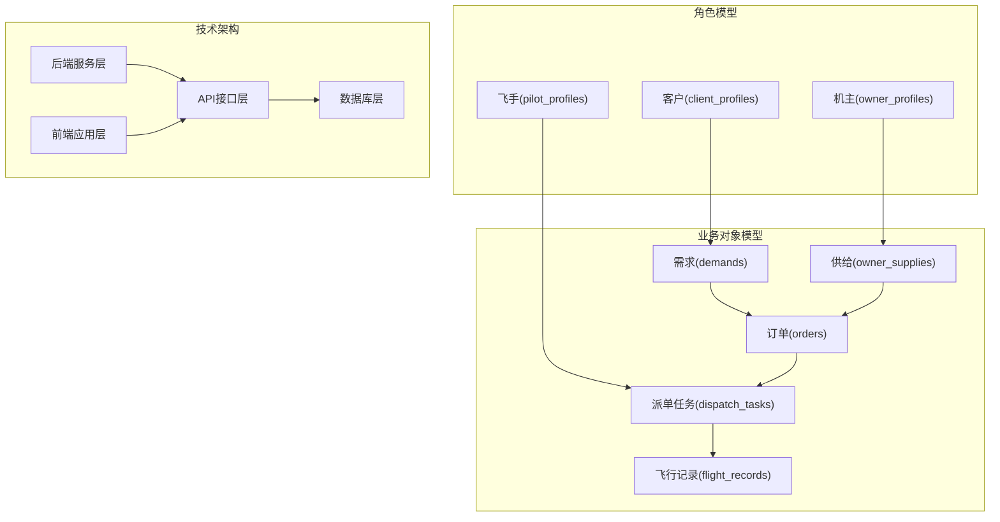
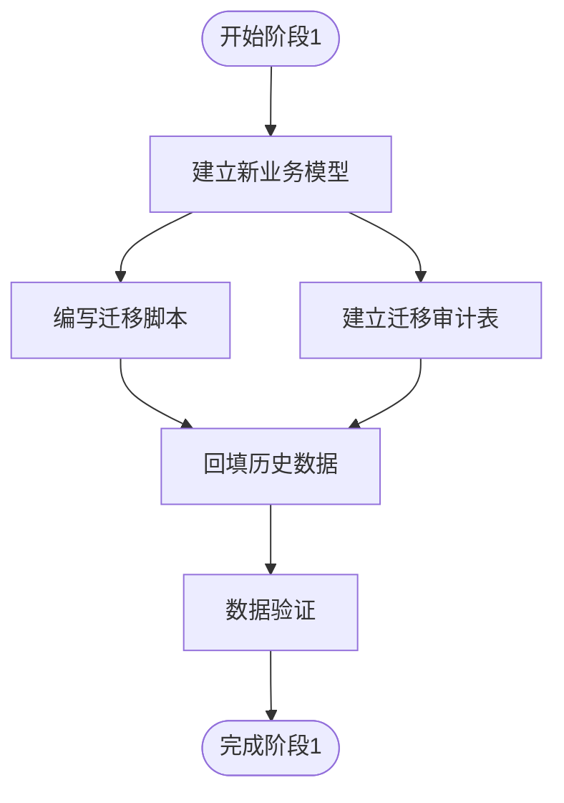
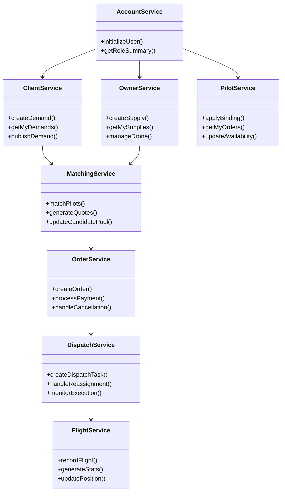
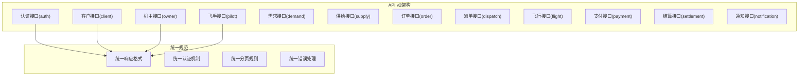
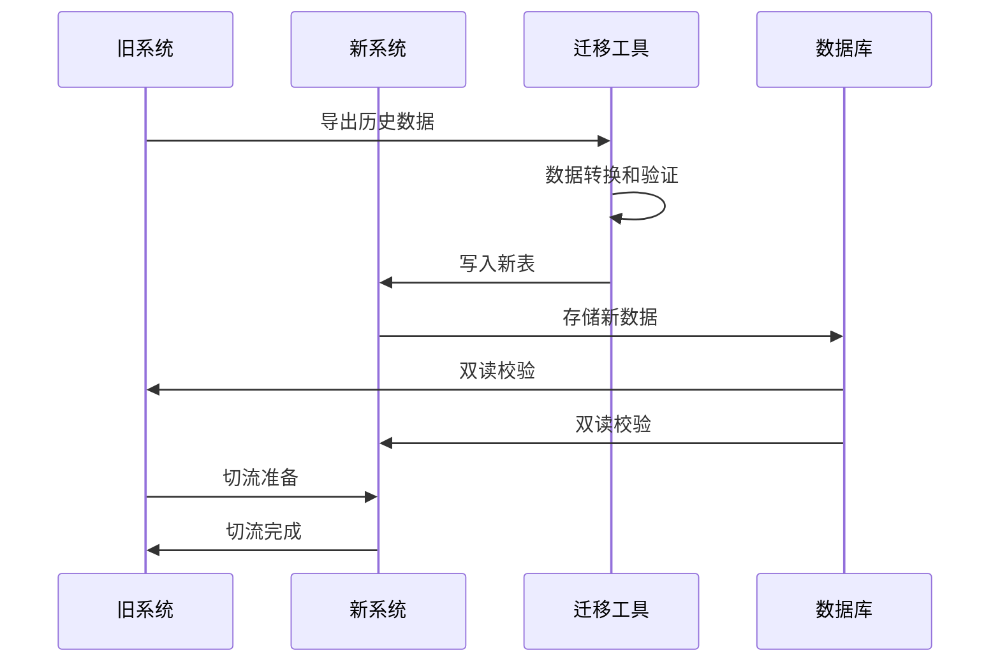
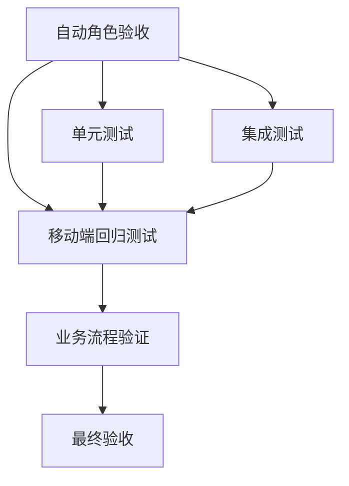
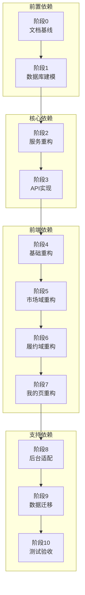

# 重构任务分类与优先级

<cite>
**本文档引用的文件**
- [REFACTOR_MASTER_TASKLIST.md](file://REFACTOR_MASTER_TASKLIST.md)
- [BUSINESS_ROLE_REDESIGN.md](file://BUSINESS_ROLE_REDESIGN.md)
- [BUSINESS_FIELD_DICTIONARY.md](file://BUSINESS_FIELD_DICTIONARY.md)
- [BUSINESS_PAGE_INFORMATION_ARCHITECTURE.md](file://BUSINESS_PAGE_INFORMATION_ARCHITECTURE.md)
- [BUSINESS_API_CONTRACT.md](file://BUSINESS_API_CONTRACT.md)
- [BUSINESS_DATABASE_MIGRATION_PLAN.md](file://BUSINESS_DATABASE_MIGRATION_PLAN.md)
- [TEST_CHECKLIST.md](file://TEST_CHECKLIST.md)
</cite>

## 目录
1. [引言](#引言)
2. [项目结构](#项目结构)
3. [核心组件](#核心组件)
4. [架构概览](#架构概览)
5. [详细组件分析](#详细组件分析)
6. [依赖分析](#依赖分析)
7. [性能考虑](#性能考虑)
8. [故障排除指南](#故障排除指南)
9. [结论](#结论)
10. [附录](#附录)

## 引言

本文档为无人机租赁平台的重构任务分类与优先级管理提供系统化的指导框架。基于重构总表，我们将详细阐述任务的分类体系（阶段0-10）、优先级划分原则、依赖关系矩阵，并解释每个阶段的核心目标、任务特征和执行顺序建议。

重构项目旨在将平台从传统的混合业务模式转变为清晰的业务对象模型：需求、供给、订单、派单任务、飞行记录。这一转变不仅涉及技术架构的重构，还包括业务流程、页面信息架构、API契约以及数据库模型的全面升级。

## 项目结构

重构项目采用分阶段、分层次的实施策略，涵盖后端领域服务、移动端界面、后台管理以及数据迁移等多个方面：

**图表来源**
- [REFACTOR_MASTER_TASKLIST.md:497-503](file://REFACTOR_MASTER_TASKLIST.md#L497-L503)

**章节来源**
- [REFACTOR_MASTER_TASKLIST.md:54-52](file://REFACTOR_MASTER_TASKLIST.md#L54-L52)

## 核心组件

### 重构阶段分类体系

重构任务按照11个阶段进行系统化管理，每个阶段都有明确的目标、复杂度评估和依赖关系：

| 阶段 | 核心目标 | 复杂度 | 主要任务类型 |
|------|----------|--------|--------------|
| 阶段0 | 文档基线与业务冻结 | M | 文档完善、基线确认 |
| 阶段1 | 数据库与领域模型重建 | XL | 数据库建模、迁移脚本 |
| 阶段2 | 后端领域服务重构 | XL | 服务层重构、业务逻辑 |
| 阶段3 | API v2实现与路由切换 | L | 接口实现、路由配置 |
| 阶段4 | 移动端基础重构 | M | 应用初始化、导航重构 |
| 阶段5 | 移动端市场域重构 | L | 市场页面、供需匹配 |
| 阶段6 | 移动端履约域重构 | XL | 订单执行、飞行监控 |
| 阶段7 | 移动端我的页重构 | M | 档案管理、消息系统 |
| 阶段8 | 后台管理与运营适配 | M | 管理后台、运营看板 |
| 阶段9 | 数据迁移、双读校验与切流 | XL | 数据迁移、校验工具 |
| 阶段10 | 测试、验收与收尾 | L | 回归测试、验收标准 |

### 优先级划分原则

重构任务的优先级基于以下双重维度进行评估：

#### 业务价值维度
- **核心业务流程**：直接影响平台主要业务链路的任务优先级更高
- **用户体验影响**：直接影响用户操作体验的任务优先级更高
- **平台边界一致性**：确保平台业务边界清晰的任务优先级更高

#### 技术难度维度
- **基础架构依赖**：影响后续多个阶段的任务优先级更高
- **数据迁移复杂度**：涉及大量历史数据迁移的任务需要谨慎安排
- **系统耦合度**：高耦合度的任务会影响整体重构进度

**章节来源**
- [REFACTOR_MASTER_TASKLIST.md:38-52](file://REFACTOR_MASTER_TASKLIST.md#L38-L52)

## 架构概览

重构项目采用"先模型后实现"的设计理念，确保业务逻辑清晰、技术架构合理：

**图表来源**
- [BUSINESS_ROLE_REDESIGN.md:44-63](file://BUSINESS_ROLE_REDESIGN.md#L44-L63)
- [BUSINESS_DATABASE_MIGRATION_PLAN.md:89-148](file://BUSINESS_DATABASE_MIGRATION_PLAN.md#L89-L148)

## 详细组件分析

### 阶段0：文档基线与业务冻结

阶段0是整个重构项目的基础，确保所有参与者对业务模型有一致的理解。

#### 核心任务特征
- **文档完善**：补齐角色设计、字段字典、页面架构、API契约、数据库迁移方案
- **基线确认**：统一业务术语、状态机、流程边界
- **依赖关系**：无外部依赖，为后续阶段奠定基础

#### 执行建议
1. 优先完成角色体系重构，确保业务对象定义清晰
2. 同步完善字段字典，保证前后端一致性
3. 建立统一的页面信息架构，指导UI设计

**章节来源**
- [REFACTOR_MASTER_TASKLIST.md:54-110](file://REFACTOR_MASTER_TASKLIST.md#L54-L110)

### 阶段1：数据库与领域模型重建

阶段1是重构的技术基础，涉及核心业务对象的数据库建模和历史数据迁移。

#### 核心任务特征
- **数据库建模**：建立新的业务对象表结构
- **历史数据迁移**：将旧系统数据映射到新模型
- **复杂度评估**：XL级复杂度，涉及大量数据处理

#### 依赖关系
- 依赖阶段0完成的文档基线
- 为阶段2的后端服务重构提供数据支撑

#### 执行策略

**图表来源**
- [BUSINESS_DATABASE_MIGRATION_PLAN.md:398-485](file://BUSINESS_DATABASE_MIGRATION_PLAN.md#L398-L485)

**章节来源**
- [REFACTOR_MASTER_TASKLIST.md:111-166](file://REFACTOR_MASTER_TASKLIST.md#L111-L166)

### 阶段2：后端领域服务重构

阶段2将数据库模型转化为可执行的业务逻辑，是重构的核心技术实现阶段。

#### 核心任务特征
- **服务层重构**：将业务逻辑封装在独立的服务组件中
- **领域模型实现**：实现业务规则和状态机
- **复杂度评估**：XL级复杂度，涉及大量业务逻辑

#### 服务组件架构

**图表来源**
- [REFACTOR_MASTER_TASKLIST.md:167-222](file://REFACTOR_MASTER_TASKLIST.md#L167-L222)

**章节来源**
- [REFACTOR_MASTER_TASKLIST.md:167-222](file://REFACTOR_MASTER_TASKLIST.md#L167-L222)

### 阶段3：API v2实现与路由切换

阶段3将重构后的业务逻辑暴露为标准化的API接口。

#### 核心任务特征
- **接口实现**：实现v2版本的所有业务接口
- **路由配置**：建立新的API路由结构
- **响应统一**：标准化API响应格式

#### API架构设计

**图表来源**
- [BUSINESS_API_CONTRACT.md:18-111](file://BUSINESS_API_CONTRACT.md#L18-L111)

**章节来源**
- [REFACTOR_MASTER_TASKLIST.md:223-272](file://REFACTOR_MASTER_TASKLIST.md#L223-L272)

### 阶段4-7：移动端重构

移动端重构分为四个阶段，逐步替换原有页面结构：

#### 阶段4：移动端基础重构
- **应用初始化**：接入新的角色摘要和API客户端
- **导航重构**：建立新的五级导航结构
- **组件统一**：建立统一的状态徽标和页面组件

#### 阶段5：移动端市场域重构
- **首页驾驶舱**：实现按角色视图的综合驾驶舱
- **供给市场**：重构供给展示和直达下单流程
- **需求市场**：优化需求展示和报价流程

#### 阶段6：移动端履约域重构
- **订单管理**：重构订单列表和详情展示
- **派单管理**：实现正式派单任务管理
- **飞行监控**：集成飞行监控和记录功能

#### 阶段7：移动端我的页重构
- **档案管理**：重构客户、机主、飞手档案页面
- **绑定管理**：实现绑定飞手关系管理
- **消息系统**：优化系统通知和聊天功能

**章节来源**
- [REFACTOR_MASTER_TASKLIST.md:273-418](file://REFACTOR_MASTER_TASKLIST.md#L273-L418)

### 阶段8：后台管理与运营适配

后台管理重构确保运营人员能够有效管理新的业务模型：

#### 核心任务
- **管理页面适配**：改造需求、供给、订单、派单、飞行记录管理页
- **运营看板**：建立迁移审计和异常订单运营看板
- **权限管理**：适应新的角色模型和业务流程

**章节来源**
- [REFACTOR_MASTER_TASKLIST.md:419-438](file://REFACTOR_MASTER_TASKLIST.md#L419-L438)

### 阶段9：数据迁移、双读校验与切流

阶段9是重构的关键转折点，确保新旧系统的平稳过渡：

#### 迁移策略

**图表来源**
- [BUSINESS_DATABASE_MIGRATION_PLAN.md:431-485](file://BUSINESS_DATABASE_MIGRATION_PLAN.md#L431-L485)

#### 校验机制
- **页面一致性检查**：首页、订单列表、派单列表、飞行记录的对比
- **数据完整性验证**：确保迁移数据的完整性和准确性
- **业务流程验证**：验证迁移后业务流程的正确性

**章节来源**
- [REFACTOR_MASTER_TASKLIST.md:439-470](file://REFACTOR_MASTER_TASKLIST.md#L439-L470)

### 阶段10：测试、验收与收尾

阶段10确保重构成果的质量和稳定性：

#### 验收标准
- **自动角色验收**：验证四种角色的主链路
- **移动端回归测试**：确保页面功能完整
- **业务流程验证**：验证完整的业务流程

#### 测试策略

**图表来源**
- [TEST_CHECKLIST.md:25-41](file://TEST_CHECKLIST.md#L25-L41)

**章节来源**
- [REFACTOR_MASTER_TASKLIST.md:471-496](file://REFACTOR_MASTER_TASKLIST.md#L471-L496)

## 依赖分析

重构任务之间存在复杂的依赖关系，需要按照既定的执行顺序进行：

**图表来源**
- [REFACTOR_MASTER_TASKLIST.md:497-503](file://REFACTOR_MASTER_TASKLIST.md#L497-L503)

### 依赖关系矩阵

| 任务 | 直接依赖 | 间接依赖 | 影响范围 |
|------|----------|----------|----------|
| R1.01-R1.09 | R0.01-R0.07 | R2.01-R2.09 | 数据库层 |
| R2.01-R2.09 | R1.01-R1.09 | R3.01-R3.07 | 服务层 |
| R3.01-R3.07 | R2.01-R2.09 | R4.01-R7.06 | 接口层 |
| R4.01-R4.04 | R3.01-R3.07 | R5.01-R7.06 | 移动端基础 |
| R5.01-R5.05 | R3.01-R3.07 | R6.01-R7.06 | 市场域 |
| R6.01-R6.08 | R3.01-R3.07 | R7.01-R7.06 | 履约域 |
| R7.01-R7.06 | R3.01-R3.07 | R8.01-R8.03 | 我的页 |
| R8.01-R8.03 | R3.01-R3.07 | R9.01-R9.05 | 后台管理 |
| R9.01-R9.05 | R1.01-R1.09 | R10.01-R10.04 | 数据迁移 |
| R10.01-R10.04 | R2.01-R2.09 | 无 | 质量保证 |

**章节来源**
- [REFACTOR_MASTER_TASKLIST.md:111-496](file://REFACTOR_MASTER_TASKLIST.md#L111-L496)

## 性能考虑

重构项目在性能方面的考虑包括：

### 数据库性能
- **索引优化**：为常用查询字段建立索引
- **查询优化**：避免N+1查询问题
- **缓存策略**：合理使用缓存减少数据库压力

### 服务性能
- **异步处理**：将耗时操作异步化
- **批量操作**：支持批量数据处理
- **连接池管理**：优化数据库连接使用

### 前端性能
- **懒加载**：按需加载页面组件
- **图片优化**：压缩和懒加载图片资源
- **状态管理**：优化Redux状态管理

## 故障排除指南

### 常见问题及解决方案

#### 数据迁移问题
- **问题**：迁移过程中数据不一致
- **解决方案**：使用迁移审计表追踪问题数据，重新执行迁移

#### API兼容性问题
- **问题**：新旧API混用导致功能异常
- **解决方案**：严格按照阶段9的切流计划执行，确保逐步切换

#### 页面显示问题
- **问题**：页面数据显示不一致
- **解决方案**：检查双读校验工具输出，定位数据源问题

#### 性能问题
- **问题**：系统响应缓慢
- **解决方案**：分析慢查询日志，优化数据库查询和索引

**章节来源**
- [TEST_CHECKLIST.md:431-448](file://TEST_CHECKLIST.md#L431-L448)

## 结论

无人机租赁平台的重构项目通过系统化的阶段管理和严格的优先级划分，确保了项目的有序进行和高质量交付。关键成功因素包括：

1. **清晰的阶段划分**：每个阶段都有明确的目标和交付物
2. **严格的依赖管理**：确保任务按照正确的顺序执行
3. **完善的测试体系**：从单元测试到端到端验证的全方位测试
4. **渐进式切流**：通过双读校验确保新旧系统平稳过渡
5. **文档化管理**：所有变更都有据可查，便于维护和扩展

重构项目不仅提升了系统的技术架构，更重要的是建立了清晰的业务模型和统一的用户体验，为平台的长期发展奠定了坚实基础。

## 附录

### 任务复杂度评估标准

| 等级 | 评估标准 | 示例任务 |
|------|----------|----------|
| M | 中等复杂度，涉及多个模块协调 | 移动端导航重构、API接口实现 |
| L | 低复杂度，相对独立的功能模块 | 基础页面重构、简单接口开发 |
| XL | 高复杂度，涉及大量数据处理和系统改造 | 数据库迁移、核心服务重构 |

### 资源需求估算

#### 人力资源
- **后端开发**：3-5人，主要负责服务层重构和API实现
- **前端开发**：2-3人，负责移动端页面重构
- **测试工程师**：1-2人，负责测试和验收
- **项目经理**：1人，负责项目管理和协调

#### 时间估算
- **总周期**：6-12个月
- **阶段分配**：各阶段按复杂度合理分配时间
- **缓冲时间**：预留20%的缓冲时间应对突发问题

#### 风险等级划分

| 风险等级 | 评估标准 | 应对措施 |
|----------|----------|----------|
| 高风险 | 可能影响整体进度或系统稳定性 | 重点监控，制定应急预案 |
| 中风险 | 可能影响部分功能或用户体验 | 定期检查，及时调整 |
| 低风险 | 影响较小或可快速修复 | 常规监控，按计划处理 |