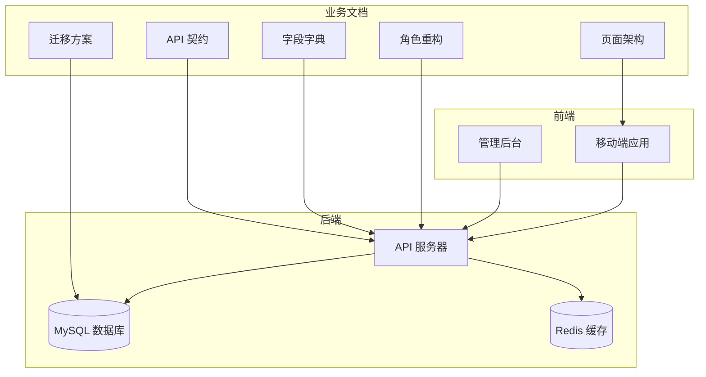
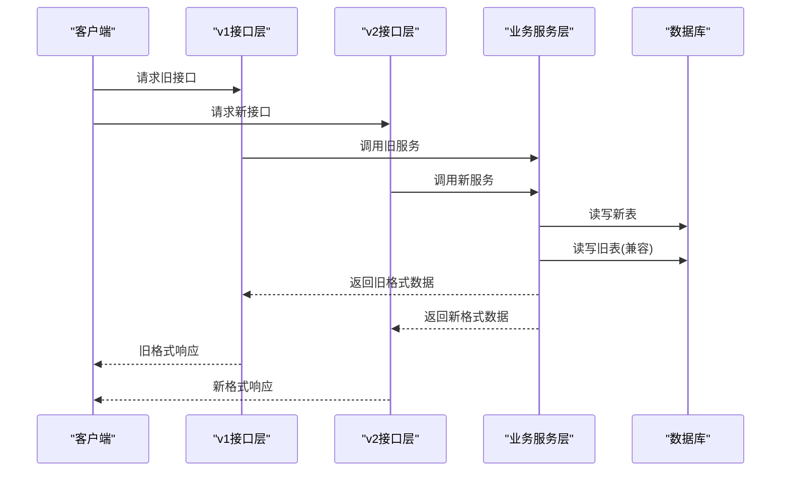
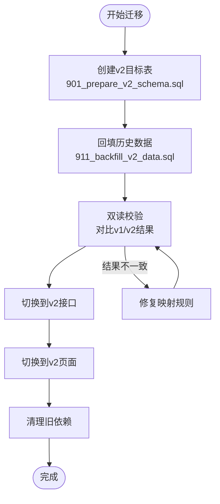
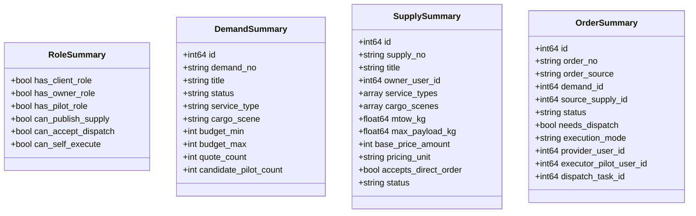
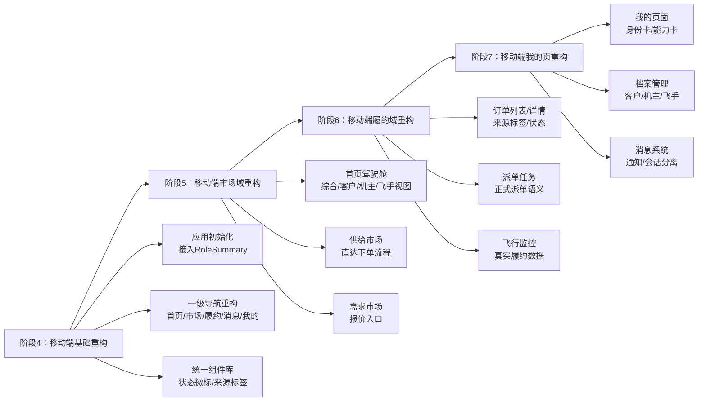
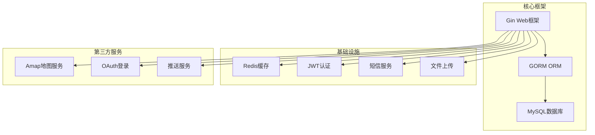

# 重构任务管理

<cite>
**本文档引用的文件**
- [REFACTOR_MASTER_TASKLIST.md](file://REFACTOR_MASTER_TASKLIST.md)
- [REFACTOR_TASK_TRACKER.md](file://REFACTOR_TASK_TRACKER.md)
- [BUSINESS_ROLE_REDESIGN.md](file://BUSINESS_ROLE_REDESIGN.md)
- [BUSINESS_FIELD_DICTIONARY.md](file://BUSINESS_FIELD_DICTIONARY.md)
- [BUSINESS_PAGE_INFORMATION_ARCHITECTURE.md](file://BUSINESS_PAGE_INFORMATION_ARCHITECTURE.md)
- [BUSINESS_API_CONTRACT.md](file://BUSINESS_API_CONTRACT.md)
- [BUSINESS_DATABASE_MIGRATION_PLAN.md](file://BUSINESS_DATABASE_MIGRATION_PLAN.md)
- [README.md](file://README.md)
- [backend/cmd/server/main.go](file://backend/cmd/server/main.go)
- [backend/internal/api/v2/router.go](file://backend/internal/api/v2/router.go)
- [backend/internal/model/models.go](file://backend/internal/model/models.go)
- [backend/go.mod](file://backend/go.mod)
</cite>

## 目录
1. [引言](#引言)
2. [项目结构](#项目结构)
3. [核心组件](#核心组件)
4. [架构概览](#架构概览)
5. [详细组件分析](#详细组件分析)
6. [依赖分析](#依赖分析)
7. [性能考虑](#性能考虑)
8. [故障排查指南](#故障排查指南)
9. [结论](#结论)
10. [附录](#附录)

## 引言

本文件为无人机租赁平台的重构任务管理文档，基于重构总表详细说明重构任务的分类、优先级、依赖关系、验收标准。文档解释重构阶段划分、每个阶段的目标和交付物、风险控制措施，包含任务跟踪方法、进度监控指标、质量保证标准，并提供重构过程中的技术决策记录、架构演进说明、迁移策略。同时阐述如何处理技术债务、如何平衡重构进度和业务需求、如何确保重构质量。

## 项目结构

项目采用前后端分离架构，后端使用 Go + Gin + GORM，前端包含移动端 React Native 应用和管理后台 React 应用。重构任务围绕业务角色、页面信息架构、API 契约、数据库迁移四个核心业务文档展开，形成完整的重构执行清单。

**图表来源**
- [backend/cmd/server/main.go:52-266](file://backend/cmd/server/main.go#L52-L266)
- [backend/internal/api/v2/router.go:72-282](file://backend/internal/api/v2/router.go#L72-L282)

**章节来源**
- [README.md:1-29](file://README.md#L1-L29)
- [backend/cmd/server/main.go:52-266](file://backend/cmd/server/main.go#L52-L266)

## 核心组件

### 重构任务总表

重构总表将业务设计文档转化为可执行的重构清单，包含10个阶段，每个阶段都有明确的复杂度评级和验收标准：

- **阶段0：文档基线与业务冻结** - 完成角色、字段、页面、API、数据库的基线设计
- **阶段1：数据库与领域模型重建** - 新建v2目标表结构
- **阶段2：后端领域服务重构** - 实现统一的业务服务层
- **阶段3：API v2实现与路由切换** - 建立独立的v2接口体系
- **阶段4-7：移动端重构** - 分域重构市场、履约、我的页等模块
- **阶段8：后台管理适配** - 适配新角色模型
- **阶段9：数据迁移与切流** - 实施历史数据迁移和系统切换
- **阶段10：测试验收** - 完成回归测试和业务验收

### 任务跟踪系统

任务跟踪系统基于差异分析，将重构任务分为P0-P3优先级，涵盖角色体系、功能模块、技术架构等方面：

- **P0优先级**：飞手认证体系、机主认证增强、智能派单系统
- **P1优先级**：空域管理系统、订单生命周期、支付分账系统
- **P2优先级**：信用评价体系、保险理赔系统、无人机SDK集成
- **P3优先级**：数据分析平台

**章节来源**
- [REFACTOR_MASTER_TASKLIST.md:1-512](file://REFACTOR_MASTER_TASKLIST.md#L1-L512)
- [REFACTOR_TASK_TRACKER.md:1-800](file://REFACTOR_TASK_TRACKER.md#L1-L800)

## 架构概览

重构采用"新表先建，旧表并存，逐步切流"的策略，确保系统稳定性的同时实现平滑过渡。

**图表来源**
- [backend/internal/api/v2/router.go:72-282](file://backend/internal/api/v2/router.go#L72-L282)
- [backend/cmd/server/main.go:247-248](file://backend/cmd/server/main.go#L247-L248)

### 技术决策记录

重构过程中的关键技术决策包括：

1. **角色模型重构**：从单一user_type改为"账号+档案+能力"的组合判断
2. **平台边界固化**：明确重载末端货物吊运业务范围
3. **数据库分层**：撮合层(demands/demand_quotes)与履约层(orders/dispatch_tasks)彻底分离
4. **API版本化**：v1仅用于历史兼容，v2作为新系统唯一接口

**章节来源**
- [BUSINESS_ROLE_REDESIGN.md:1-800](file://BUSINESS_ROLE_REDESIGN.md#L1-L800)
- [BUSINESS_DATABASE_MIGRATION_PLAN.md:1-550](file://BUSINESS_DATABASE_MIGRATION_PLAN.md#L1-L550)

## 详细组件分析

### 数据库迁移策略

数据库迁移采用"高位编号脚本+双读校验"的渐进式策略：

**图表来源**
- [BUSINESS_DATABASE_MIGRATION_PLAN.md:398-485](file://BUSINESS_DATABASE_MIGRATION_PLAN.md#L398-L485)

迁移策略的关键要点：
- 建表迁移与数据回填严格分离
- 结构迁移与数据迁移严格分离  
- 可重复执行的脚本保持幂等性
- 执行期使用高位编号脚本避免与开发脚本混跑

### API v2接口体系

v2接口体系提供统一的响应结构和业务对象：

**图表来源**
- [BUSINESS_API_CONTRACT.md:134-263](file://BUSINESS_API_CONTRACT.md#L134-L263)

**章节来源**
- [BUSINESS_API_CONTRACT.md:1-800](file://BUSINESS_API_CONTRACT.md#L1-L800)
- [backend/internal/api/v2/router.go:72-282](file://backend/internal/api/v2/router.go#L72-L282)

### 移动端重构流程

移动端重构按照"基础-市场-履约-我的"的顺序分阶段实施：

**图表来源**
- [REFACTOR_MASTER_TASKLIST.md:273-418](file://REFACTOR_MASTER_TASKLIST.md#L273-L418)

**章节来源**
- [BUSINESS_PAGE_INFORMATION_ARCHITECTURE.md:1-676](file://BUSINESS_PAGE_INFORMATION_ARCHITECTURE.md#L1-L676)
- [REFACTOR_MASTER_TASKLIST.md:273-418](file://REFACTOR_MASTER_TASKLIST.md#L273-L418)

## 依赖分析

### 技术栈依赖

后端技术栈采用现代化组合，确保重构的可维护性和扩展性：

**图表来源**
- [backend/go.mod:5-21](file://backend/go.mod#L5-L21)
- [backend/cmd/server/main.go:3-50](file://backend/cmd/server/main.go#L3-L50)

### 业务耦合关系

重构过程中需要重点关注的业务耦合点：

1. **角色判断逻辑**：从user_type单一判断改为多维度组合判断
2. **订单来源追溯**：demand_market与supply_direct两种来源的统一处理
3. **派单任务语义**：正式派单与历史任务池的彻底分离
4. **飞行记录归属**：履约飞行与演示飞行的明确区分

**章节来源**
- [BUSINESS_ROLE_REDESIGN.md:649-798](file://BUSINESS_ROLE_REDESIGN.md#L649-L798)
- [BUSINESS_DATABASE_MIGRATION_PLAN.md:398-485](file://BUSINESS_DATABASE_MIGRATION_PLAN.md#L398-L485)

## 性能考虑

重构过程中的性能优化策略：

### 数据库性能
- **索引优化**：为高频查询字段建立适当索引
- **分表策略**：按时间维度对历史数据进行分表
- **缓存策略**：热点数据使用Redis缓存
- **连接池**：合理配置数据库连接池大小

### 接口性能
- **分页优化**：默认分页大小20，最大100
- **批量查询**：支持批量接口减少请求次数
- **响应压缩**：启用Gzip压缩减少传输体积
- **超时控制**：合理设置接口超时时间

### 移动端性能
- **组件懒加载**：按需加载页面组件
- **图片优化**：使用适当的图片格式和尺寸
- **网络缓存**：合理利用HTTP缓存头
- **内存管理**：及时释放不再使用的资源

## 故障排查指南

### 常见问题及解决方案

**1. 数据迁移失败**
- 检查迁移脚本的幂等性
- 验证目标表结构与源表的映射关系
- 确认数据完整性约束

**2. 接口兼容性问题**
- 确认v1/v2接口的兼容层实现
- 验证响应格式的一致性
- 检查认证和授权逻辑

**3. 页面显示异常**
- 检查RoleSummary的计算逻辑
- 验证页面数据源的正确性
- 确认组件状态管理

**4. 性能问题**
- 分析慢查询日志
- 监控数据库连接池使用情况
- 检查缓存命中率

**章节来源**
- [BUSINESS_DATABASE_MIGRATION_PLAN.md:506-537](file://BUSINESS_DATABASE_MIGRATION_PLAN.md#L506-L537)

### 监控指标

建立完善的监控指标体系：

- **系统指标**：CPU使用率、内存占用、磁盘IO
- **数据库指标**：连接数、查询延迟、慢查询数量
- **接口指标**：响应时间、错误率、吞吐量
- **业务指标**：订单转化率、用户活跃度、飞行任务完成率

## 结论

无人机租赁平台的重构任务管理文档建立了完整的重构执行框架，通过明确的阶段划分、优先级管理和质量保证机制，确保重构工作的有序进行。重构采用渐进式策略，在保证系统稳定性的同时实现业务能力的全面提升。

关键成功因素包括：
1. 以业务文档为指导的重构策略
2. 渐进式的迁移和切换机制  
3. 完善的质量保证和监控体系
4. 清晰的风险控制和应急预案

通过严格执行重构任务管理规范，项目能够在保持业务连续性的同时，实现技术架构的现代化升级。

## 附录

### 重构任务跟踪方法

1. **任务分解**：将大任务拆分为可执行的小任务
2. **依赖管理**：明确任务间的依赖关系和执行顺序
3. **进度监控**：使用甘特图跟踪任务进度
4. **质量检查**：建立验收标准和测试清单
5. **风险评估**：定期评估技术风险和业务风险

### 进度监控指标

- **任务完成率**：已完成任务数量/总任务数量
- **里程碑达成率**：按时完成里程碑数量/总里程碑数量  
- **缺陷密度**：发现缺陷数量/代码行数
- **回归测试通过率**：通过回归测试用例数量/总用例数量

### 质量保证标准

- **代码质量**：静态分析通过率≥95%
- **测试覆盖率**：核心业务逻辑测试覆盖率≥80%
- **性能指标**：接口响应时间≤2秒，错误率≤0.1%
- **用户体验**：页面加载时间≤3秒，用户满意度≥4.5分