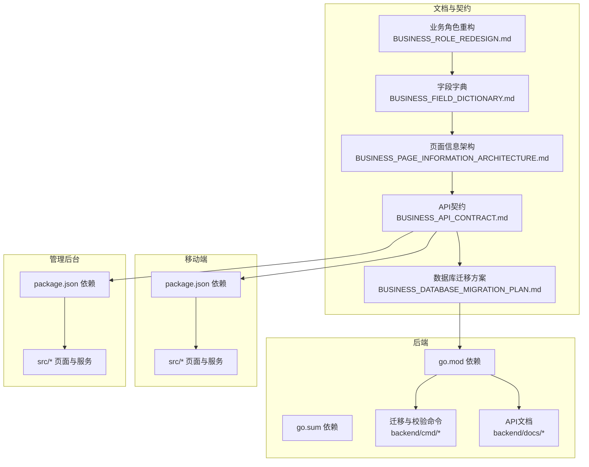
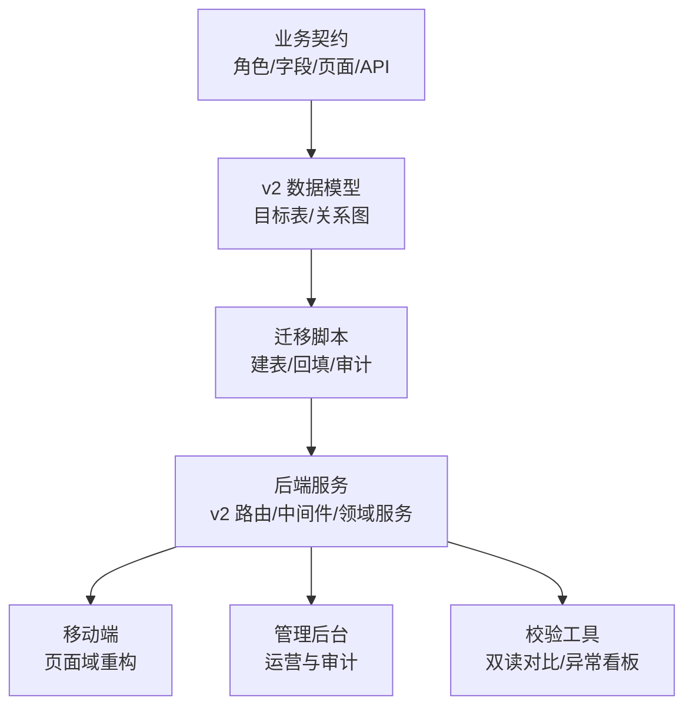
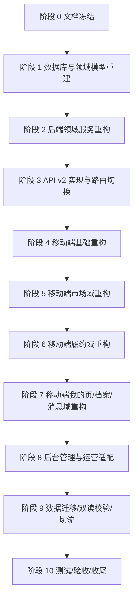
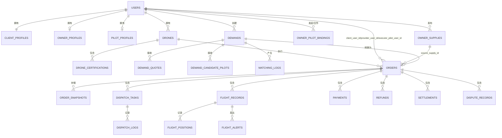
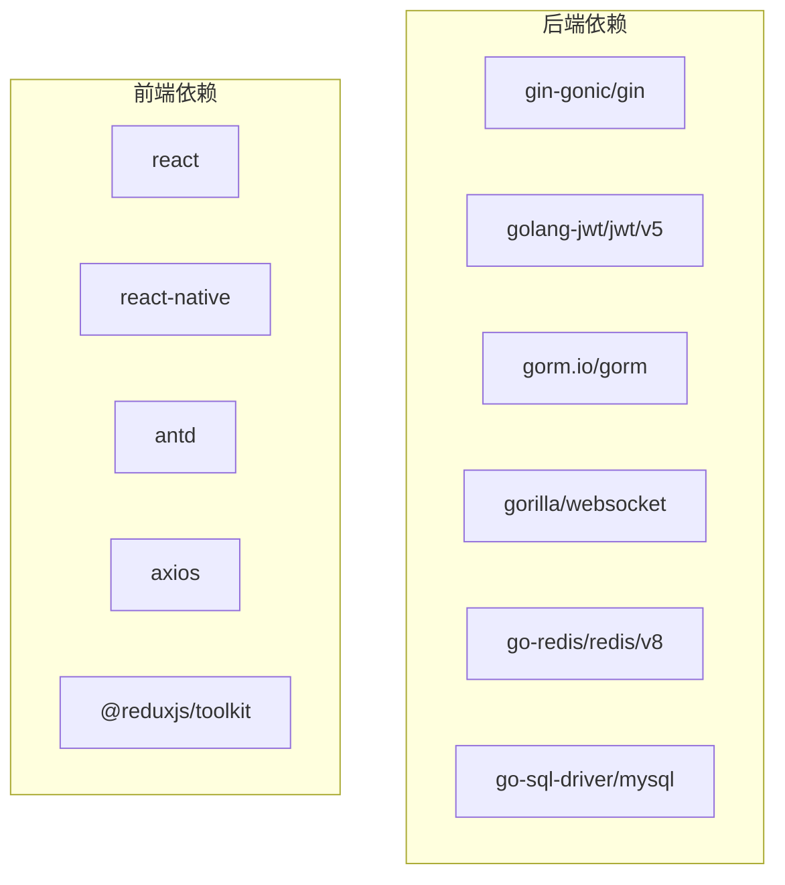

# 重构依赖关系跟踪

<cite>
**本文档引用的文件**
- [REFACTOR_MASTER_TASKLIST.md](file://REFACTOR_MASTER_TASKLIST.md)
- [BUSINESS_ROLE_REDESIGN.md](file://BUSINESS_ROLE_REDESIGN.md)
- [BUSINESS_FIELD_DICTIONARY.md](file://BUSINESS_FIELD_DICTIONARY.md)
- [BUSINESS_PAGE_INFORMATION_ARCHITECTURE.md](file://BUSINESS_PAGE_INFORMATION_ARCHITECTURE.md)
- [BUSINESS_API_CONTRACT.md](file://BUSINESS_API_CONTRACT.md)
- [BUSINESS_DATABASE_MIGRATION_PLAN.md](file://BUSINESS_DATABASE_MIGRATION_PLAN.md)
- [README.md](file://README.md)
- [backend/go.mod](file://backend/go.mod)
- [backend/go.sum](file://backend/go.sum)
- [admin/package.json](file://admin/package.json)
- [mobile/package.json](file://mobile/package.json)
</cite>

## 目录
1. [引言](#引言)
2. [项目结构](#项目结构)
3. [核心组件](#核心组件)
4. [架构总览](#架构总览)
5. [详细组件分析](#详细组件分析)
6. [依赖关系分析](#依赖关系分析)
7. [性能考虑](#性能考虑)
8. [故障排查指南](#故障排查指南)
9. [结论](#结论)
10. [附录](#附录)

## 引言
本文件面向无人机租赁平台的重构工程，系统化梳理重构任务间的依赖关系网络，识别传递依赖与潜在循环依赖，提供任务排序、关键路径识别与依赖风险评估方法。文档涵盖依赖变更影响分析、冲突解决方案、隔离策略、工具使用、可视化图表、状态监控、跨模块与第三方依赖管理、失效应对、清理与简化策略及优化建议。

## 项目结构
项目采用前后端分离与多端并行的架构：
- 后端（Go）：提供 v2 API、领域服务、数据迁移与校验工具
- 移动端（React/React Native）：客户端应用，承载角色与页面重构
- 管理后台（React）：运营与审计看板，适配新角色与数据模型
- 文档与任务清单：业务契约、字段字典、页面架构、数据库迁移与重构总表

**图表来源**
- [BUSINESS_ROLE_REDESIGN.md](file://BUSINESS_ROLE_REDESIGN.md)
- [BUSINESS_FIELD_DICTIONARY.md](file://BUSINESS_FIELD_DICTIONARY.md)
- [BUSINESS_PAGE_INFORMATION_ARCHITECTURE.md](file://BUSINESS_PAGE_INFORMATION_ARCHITECTURE.md)
- [BUSINESS_API_CONTRACT.md](file://BUSINESS_API_CONTRACT.md)
- [BUSINESS_DATABASE_MIGRATION_PLAN.md](file://BUSINESS_DATABASE_MIGRATION_PLAN.md)
- [backend/go.mod](file://backend/go.mod)
- [backend/go.sum](file://backend/go.sum)
- [admin/package.json](file://admin/package.json)
- [mobile/package.json](file://mobile/package.json)

**章节来源**
- [README.md](file://README.md)
- [BUSINESS_ROLE_REDESIGN.md](file://BUSINESS_ROLE_REDESIGN.md)
- [BUSINESS_FIELD_DICTIONARY.md](file://BUSINESS_FIELD_DICTIONARY.md)
- [BUSINESS_PAGE_INFORMATION_ARCHITECTURE.md](file://BUSINESS_PAGE_INFORMATION_ARCHITECTURE.md)
- [BUSINESS_API_CONTRACT.md](file://BUSINESS_API_CONTRACT.md)
- [BUSINESS_DATABASE_MIGRATION_PLAN.md](file://BUSINESS_DATABASE_MIGRATION_PLAN.md)
- [backend/go.mod](file://backend/go.mod)
- [backend/go.sum](file://backend/go.sum)
- [admin/package.json](file://admin/package.json)
- [mobile/package.json](file://mobile/package.json)

## 核心组件
- 业务契约层：角色、字段、页面与 API 的统一契约，确保前后端与文档一致性
- 数据模型层：v2 目标数据库模型与迁移方案，支撑撮合与履约分层
- 后端服务层：领域服务、中间件、响应结构与路由骨架
- 前端页面层：移动端与管理后台的页面与服务，按对象域拆分
- 迁移与校验工具：双读校验、审计清单与迁移脚本

**章节来源**
- [BUSINESS_ROLE_REDESIGN.md](file://BUSINESS_ROLE_REDESIGN.md)
- [BUSINESS_FIELD_DICTIONARY.md](file://BUSINESS_FIELD_DICTIONARY.md)
- [BUSINESS_PAGE_INFORMATION_ARCHITECTURE.md](file://BUSINESS_PAGE_INFORMATION_ARCHITECTURE.md)
- [BUSINESS_API_CONTRACT.md](file://BUSINESS_API_CONTRACT.md)
- [BUSINESS_DATABASE_MIGRATION_PLAN.md](file://BUSINESS_DATABASE_MIGRATION_PLAN.md)

## 架构总览
重构以“v2 API + v2 数据模型 + 页面域重构”为核心，采用“新表先建、旧表并存、逐步切流”的迁移策略，确保业务连续性与数据一致性。

**图表来源**
- [BUSINESS_DATABASE_MIGRATION_PLAN.md](file://BUSINESS_DATABASE_MIGRATION_PLAN.md)
- [BUSINESS_API_CONTRACT.md](file://BUSINESS_API_CONTRACT.md)
- [BUSINESS_PAGE_INFORMATION_ARCHITECTURE.md](file://BUSINESS_PAGE_INFORMATION_ARCHITECTURE.md)
- [backend/go.mod](file://backend/go.mod)

## 详细组件分析

### 任务依赖网络与排序
基于重构总表，任务按阶段与依赖关系形成有向无环图（DAG）。排序遵循“先模型后接口，先后端再前端”的原则，关键路径包括：
- 阶段 1（数据库与领域模型重建）→ 阶段 2（后端领域服务重构）
- 阶段 2 → 阶段 3（API v2 实现与路由切换）
- 阶段 3 → 阶段 4~7（移动端分域重构）
- 阶段 7 → 阶段 8（后台适配）
- 阶段 8 → 阶段 9（数据迁移、双读校验与切流）
- 阶段 9 → 阶段 10（测试、验收与收尾）

**图表来源**
- [REFACTOR_MASTER_TASKLIST.md](file://REFACTOR_MASTER_TASKLIST.md)

**章节来源**
- [REFACTOR_MASTER_TASKLIST.md](file://REFACTOR_MASTER_TASKLIST.md)

### 依赖识别与传递闭包
- 直接依赖：任务 A 依赖任务 B（如 R1.01 依赖 R0.01）
- 传递依赖：A→B→C，C 的执行需等待 A 与 B 完成
- 并行任务：同阶段内无依赖的任务可并行推进
- 循环依赖：通过任务编号与依赖标注未发现循环依赖

**章节来源**
- [REFACTOR_MASTER_TASKLIST.md](file://REFACTOR_MASTER_TASKLIST.md)

### 关键路径识别与风险评估
- 关键路径：R1 → R2 → R3 → R4~7 → R9 → R10
- 风险点：
  - 数据迁移与双读校验（R9.03/9.04）对业务连续性影响最大
  - API 切流（R9.04）对移动端与后台影响显著
  - 页面域重构（R4~7）对用户体验与数据一致性要求高

**章节来源**
- [REFACTOR_MASTER_TASKLIST.md](file://REFACTOR_MASTER_TASKLIST.md)

### 依赖变更影响分析
- 字段与页面架构变更（字段字典、页面信息架构）影响移动端与管理后台
- API 契约变更（v2）影响移动端与管理后台接口调用
- 数据库迁移（迁移方案）影响后端服务与数据一致性

**章节来源**
- [BUSINESS_FIELD_DICTIONARY.md](file://BUSINESS_FIELD_DICTIONARY.md)
- [BUSINESS_PAGE_INFORMATION_ARCHITECTURE.md](file://BUSINESS_PAGE_INFORMATION_ARCHITECTURE.md)
- [BUSINESS_API_CONTRACT.md](file://BUSINESS_API_CONTRACT.md)
- [BUSINESS_DATABASE_MIGRATION_PLAN.md](file://BUSINESS_DATABASE_MIGRATION_PLAN.md)

### 依赖冲突解决方案
- 命名与语义冲突：以字段字典与页面架构为准，统一命名与状态枚举
- 角色判断冲突：以角色重构文档为准，不再依赖 user_type
- 来源追溯冲突：统一 order_source 与来源字段，确保需求/供给来源可追溯

**章节来源**
- [BUSINESS_ROLE_REDESIGN.md](file://BUSINESS_ROLE_REDESIGN.md)
- [BUSINESS_FIELD_DICTIONARY.md](file://BUSINESS_FIELD_DICTIONARY.md)
- [BUSINESS_DATABASE_MIGRATION_PLAN.md](file://BUSINESS_DATABASE_MIGRATION_PLAN.md)

### 依赖隔离策略
- 前后端隔离：v2 API 与 v1 并存，前端逐步切流
- 页面域隔离：市场、履约、我的域严格分离，避免混页
- 数据隔离：v2 新表与旧表并存，迁移期双写与审计

**章节来源**
- [BUSINESS_PAGE_INFORMATION_ARCHITECTURE.md](file://BUSINESS_PAGE_INFORMATION_ARCHITECTURE.md)
- [BUSINESS_DATABASE_MIGRATION_PLAN.md](file://BUSINESS_DATABASE_MIGRATION_PLAN.md)

### 依赖跟踪工具使用
- 双读校验工具：对比 v1/v2 在关键列表与详情页的结果
- 迁移审计清单：识别来源缺失、状态异常与非目标场景数据
- 依赖可视化：基于任务总表生成依赖图谱与关键路径

**章节来源**
- [BUSINESS_DATABASE_MIGRATION_PLAN.md](file://BUSINESS_DATABASE_MIGRATION_PLAN.md)
- [REFACTOR_MASTER_TASKLIST.md](file://REFACTOR_MASTER_TASKLIST.md)

### 依赖可视化图表
- 任务依赖图：按阶段与依赖关系绘制
- 数据模型 ER 图：展示 v2 目标关系
- API 路由图：展示 v2 路由与中间件

**图表来源**
- [BUSINESS_DATABASE_MIGRATION_PLAN.md](file://BUSINESS_DATABASE_MIGRATION_PLAN.md)

### 依赖状态监控
- 迁移进度：按阶段与任务完成状态跟踪
- 双读校验：关键页面对比结果与差异分析
- 异常看板：迁移审计清单与异常订单统计

**章节来源**
- [BUSINESS_DATABASE_MIGRATION_PLAN.md](file://BUSINESS_DATABASE_MIGRATION_PLAN.md)
- [REFACTOR_MASTER_TASKLIST.md](file://REFACTOR_MASTER_TASKLIST.md)

### 跨模块依赖与第三方依赖管理
- 跨模块依赖：后端 v2 服务与前端页面域的契约依赖
- 第三方依赖：后端 go.mod 与 go.sum、前端 package.json
- 失效应对：依赖版本升级与兼容性验证，必要时回滚

**章节来源**
- [backend/go.mod](file://backend/go.mod)
- [backend/go.sum](file://backend/go.sum)
- [admin/package.json](file://admin/package.json)
- [mobile/package.json](file://mobile/package.json)

### 依赖清理与简化
- 清理旧逻辑：移除 user_type 主判断、旧订单混合展示与飞手任务兼容逻辑
- 简化接口：统一响应结构、分页规则与状态返回原则
- 优化模型：按撮合与履约分层，减少冗余字段与关联

**章节来源**
- [BUSINESS_API_CONTRACT.md](file://BUSINESS_API_CONTRACT.md)
- [BUSINESS_DATABASE_MIGRATION_PLAN.md](file://BUSINESS_DATABASE_MIGRATION_PLAN.md)
- [REFACTOR_MASTER_TASKLIST.md](file://REFACTOR_MASTER_TASKLIST.md)

## 依赖关系分析
后端依赖关系以 go.mod 与 go.sum 为依据，前端依赖以 package.json 为依据。依赖分析关注：
- 核心依赖：gin、jwt、gorm、websocket、redis、mysql 等
- 前端依赖：react、react-native、antd、axios、redux 等
- 版本兼容性：确保依赖版本与项目引擎（Go/Node）兼容

**图表来源**
- [backend/go.mod](file://backend/go.mod)
- [backend/go.sum](file://backend/go.sum)
- [admin/package.json](file://admin/package.json)
- [mobile/package.json](file://mobile/package.json)

**章节来源**
- [backend/go.mod](file://backend/go.mod)
- [backend/go.sum](file://backend/go.sum)
- [admin/package.json](file://admin/package.json)
- [mobile/package.json](file://mobile/package.json)

## 性能考虑
- 迁移脚本幂等与可回滚，避免对线上业务造成冲击
- 双读校验工具在迁移期高频运行，需优化对比算法与缓存
- 前端页面按对象域拆分，减少不必要的数据聚合与渲染
- 后端服务中间件与响应结构统一，降低网络与解析开销

## 故障排查指南
- 依赖冲突：核对字段字典与页面架构，统一命名与状态枚举
- API 不一致：检查 v2 路由与中间件，确保响应结构与分页规则一致
- 数据不一致：运行双读校验工具，定位差异并修复
- 迁移失败：检查迁移脚本与审计清单，回退到旧页面与接口

**章节来源**
- [BUSINESS_API_CONTRACT.md](file://BUSINESS_API_CONTRACT.md)
- [BUSINESS_DATABASE_MIGRATION_PLAN.md](file://BUSINESS_DATABASE_MIGRATION_PLAN.md)
- [REFACTOR_MASTER_TASKLIST.md](file://REFACTOR_MASTER_TASKLIST.md)

## 结论
通过系统化的依赖关系跟踪，本重构工程实现了从契约到模型、从服务到页面的全面升级。关键路径与风险点清晰，迁移策略稳健，工具与可视化保障了可控演进。建议持续监控迁移进度与双读校验结果，确保业务连续性与数据一致性。

## 附录
- 任务总表与阶段建议：参见重构总表
- API 文档与契约：参见 API 文档与契约
- 数据库迁移方案：参见迁移方案

**章节来源**
- [REFACTOR_MASTER_TASKLIST.md](file://REFACTOR_MASTER_TASKLIST.md)
- [README.md](file://README.md)
- [BUSINESS_API_CONTRACT.md](file://BUSINESS_API_CONTRACT.md)
- [BUSINESS_DATABASE_MIGRATION_PLAN.md](file://BUSINESS_DATABASE_MIGRATION_PLAN.md)