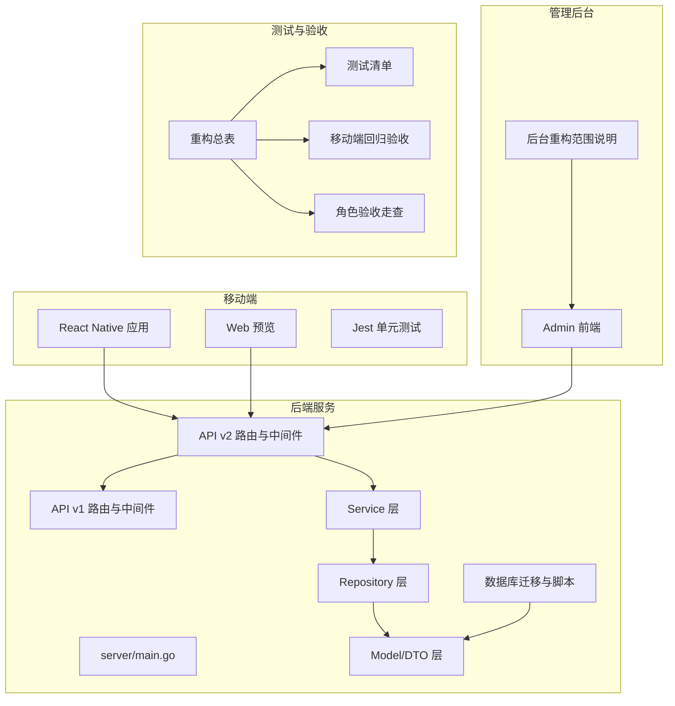
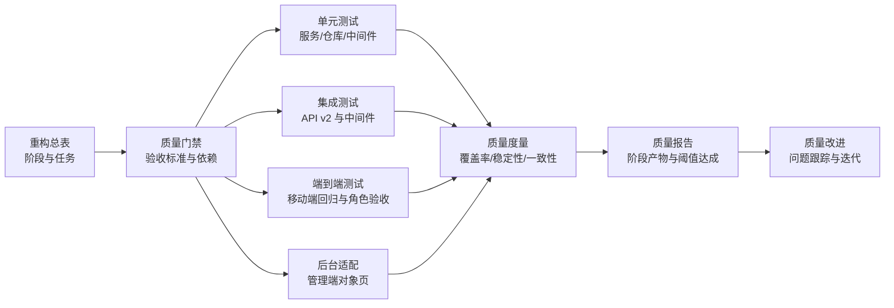
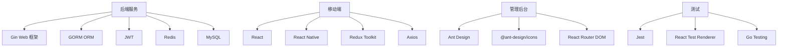

# 重构质量保证体系

<cite>
**本文引用的文件**
- [REFACTOR_MASTER_TASKLIST.md](file://REFACTOR_MASTER_TASKLIST.md)
- [TEST_CHECKLIST.md](file://TEST_CHECKLIST.md)
- [MOBILE_REGRESSION_ACCEPTANCE.md](file://MOBILE_REGRESSION_ACCEPTANCE.md)
- [ROLE_ACCEPTANCE_WALKTHROUGH.md](file://ROLE_ACCEPTANCE_WALKTHROUGH.md)
- [ADMIN_REFACTOR_SCOPE.md](file://admin/ADMIN_REFACTOR_SCOPE.md)
- [backend/go.mod](file://backend/go.mod)
- [mobile/package.json](file://mobile/package.json)
- [admin/package.json](file://admin/package.json)
- [mobile/__tests__/App.test.tsx](file://mobile/__tests__/App.test.tsx)
- [backend/internal/api/middleware/legacy_write_freeze_test.go](file://backend/internal/api/middleware/legacy_write_freeze_test.go)
- [backend/internal/api/middleware/pagination_test.go](file://backend/internal/api/middleware/pagination_test.go)
- [backend/internal/model/drone_test.go](file://backend/internal/model/drone_test.go)
- [backend/internal/repository/order_repo_test.go](file://backend/internal/repository/order_repo_test.go)
- [backend/internal/service/order_service_test.go](file://backend/internal/service/order_service_test.go)
- [backend/internal/service/home_service_test.go](file://backend/internal/service/home_service_test.go)
- [backend/internal/pkg/response/v2_test.go](file://backend/internal/pkg/response/v2_test.go)
- [backend/internal/model/json_test.go](file://backend/internal/model/json_test.go)
- [backend/cmd/testmessage/main.go](file://backend/cmd/testmessage/main.go)
- [backend/cmd/testpassword/main.go](file://backend/cmd/testpassword/main.go)
- [backend/cmd/testpwd/main.go](file://backend/cmd/testpwd/main.go)
- [backend/cmd/check_consistency/main.go](file://backend/cmd/check_consistency/main.go)
- [backend/cmd/check_data_relation/main.go](file://backend/cmd/check_data_relation/main.go)
- [backend/cmd/check_offers/main.go](file://backend/cmd/check_offers/main.go)
- [backend/cmd/check_status/main.go](file://backend/cmd/check_status/main.go)
- [backend/cmd/check_v2_parity/main.go](file://backend/cmd/check_v2_parity/main.go)
- [backend/cmd/checkmysql/main.go](file://backend/cmd/checkmysql/main.go)
- [backend/cmd/migrate/main.go](file://backend/cmd/migrate/main.go)
- [backend/cmd/sync_all_data/main.go](file://backend/cmd/sync_all_data/main.go)
- [backend/cmd/seed/main.go](file://backend/cmd/seed/main.go)
- [backend/cmd/seed_data/main.go](file://backend/cmd/seed_data/main.go)
- [backend/cmd/resetpwd/main.go](file://backend/cmd/resetpwd/main.go)
- [backend/cmd/fix_drone_status/main.go](file://backend/cmd/fix_drone_status/main.go)
- [backend/cmd/fixpassword/main.go](file://backend/cmd/fixpassword/main.go)
- [backend/cmd/genhash/main.go](file://backend/cmd/genhash/main.go)
- [backend/cmd/simulate_flight/main.go](file://backend/cmd/simulate_flight/main.go)
- [backend/cmd/addorders/main.go](file://backend/cmd/addorders/main.go)
- [backend/cmd/addadminorders/main.go](file://backend/cmd/addadminorders/main.go)
- [backend/cmd/server/main.go](file://backend/cmd/server/main.go)
- [backend/docs/API_V1_V2_DIFF.md](file://backend/docs/API_V1_V2_DIFF.md)
- [backend/docs/PHASE9_MIGRATION_RUNBOOK.md](file://backend/docs/PHASE9_MIGRATION_RUNBOOK.md)
- [backend/docs/phase10_role_acceptance_last_run.json](file://backend/docs/phase10_role_acceptance_last_run.json)
- [DEMO_ACCOUNTS.md](file://DEMO_ACCOUNTS.md)
- [.github/workflows/build-android-apk.yml](file://.github/workflows/build-android-apk.yml)
</cite>

## 目录
1. [引言](#引言)
2. [项目结构](#项目结构)
3. [核心组件](#核心组件)
4. [架构总览](#架构总览)
5. [详细组件分析](#详细组件分析)
6. [依赖分析](#依赖分析)
7. [性能考虑](#性能考虑)
8. [故障排除指南](#故障排除指南)
9. [结论](#结论)
10. [附录](#附录)

## 引言
本文件面向无人机租赁平台的重构质量保证体系，基于重构总表与测试清单，系统化阐述质量标准制定、质量检查方法、质量度量指标，以及多层次质量控制体系（单元测试、集成测试、端到端测试）的设计与实施。文档还涵盖质量门禁与阈值、异常处理流程、质量工具使用指南、质量报告模板与改进计划，并解释如何进行代码质量评估、监控重构过程中的质量变化、建立质量反馈机制，以及质量文化建设与持续改进方法。

## 项目结构
项目采用多模块组织：后端 Go 微服务、移动端 React Native/Web、管理后台 React/Vite、数据库迁移与脚本、测试与验收文档。质量保证贯穿各模块，以任务清单驱动执行，以测试清单与验收文档固化标准。

**图表来源**
- [backend/cmd/server/main.go](file://backend/cmd/server/main.go)
- [backend/internal/api/v1/router.go](file://backend/internal/api/v1/router.go)
- [backend/internal/api/v2/router.go](file://backend/internal/api/v2/router.go)
- [mobile/App.tsx](file://mobile/App.tsx)
- [admin/ADMIN_REFACTOR_SCOPE.md](file://admin/ADMIN_REFACTOR_SCOPE.md)
- [REFACTOR_MASTER_TASKLIST.md](file://REFACTOR_MASTER_TASKLIST.md)
- [TEST_CHECKLIST.md](file://TEST_CHECKLIST.md)
- [MOBILE_REGRESSION_ACCEPTANCE.md](file://MOBILE_REGRESSION_ACCEPTANCE.md)
- [ROLE_ACCEPTANCE_WALKTHROUGH.md](file://ROLE_ACCEPTANCE_WALKTHROUGH.md)

**章节来源**
- [REFACTOR_MASTER_TASKLIST.md](file://REFACTOR_MASTER_TASKLIST.md)
- [TEST_CHECKLIST.md](file://TEST_CHECKLIST.md)
- [MOBILE_REGRESSION_ACCEPTANCE.md](file://MOBILE_REGRESSION_ACCEPTANCE.md)
- [ROLE_ACCEPTANCE_WALKTHROUGH.md](file://ROLE_ACCEPTANCE_WALKTHROUGH.md)
- [admin/ADMIN_REFACTOR_SCOPE.md](file://admin/ADMIN_REFACTOR_SCOPE.md)

## 核心组件
- 重构总表：定义阶段、任务、验收标准与依赖关系，作为质量门禁与里程碑依据。
- 测试清单：提供后端 API、移动端、管理端的手工与自动化测试入口与验收标准。
- 移动端回归验收：聚焦页面对象边界、角色入口、状态与编号一致性、布局完整性。
- 角色验收走查：按客户/机主/飞手/复合身份主链路验证业务闭环与状态机正确性。
- 后台重构范围：明确管理端与新业务对象模型对齐的菜单与页面要求。
- 中间件与工具脚本：包括分页、写入冻结、一致性检查、迁移与同步等支撑质量的基础设施。

**章节来源**
- [REFACTOR_MASTER_TASKLIST.md](file://REFACTOR_MASTER_TASKLIST.md)
- [TEST_CHECKLIST.md](file://TEST_CHECKLIST.md)
- [MOBILE_REGRESSION_ACCEPTANCE.md](file://MOBILE_REGRESSION_ACCEPTANCE.md)
- [ROLE_ACCEPTANCE_WALKTHROUGH.md](file://ROLE_ACCEPTANCE_WALKTHROUGH.md)
- [admin/ADMIN_REFACTOR_SCOPE.md](file://admin/ADMIN_REFACTOR_SCOPE.md)

## 架构总览
质量保证体系以“任务驱动 + 多层次测试 + 门禁与阈值 + 工具与报告 + 反馈与改进”为主线，贯穿后端领域模型、API v2、移动端与管理后台的重构全过程。

**图表来源**
- [REFACTOR_MASTER_TASKLIST.md](file://REFACTOR_MASTER_TASKLIST.md)
- [TEST_CHECKLIST.md](file://TEST_CHECKLIST.md)
- [MOBILE_REGRESSION_ACCEPTANCE.md](file://MOBILE_REGRESSION_ACCEPTANCE.md)
- [ROLE_ACCEPTANCE_WALKTHROUGH.md](file://ROLE_ACCEPTANCE_WALKTHROUGH.md)
- [admin/ADMIN_REFACTOR_SCOPE.md](file://admin/ADMIN_REFACTOR_SCOPE.md)

## 详细组件分析

### 任务驱动的质量门禁与阈值
- 门禁规则：任务完成需通过对应验收标准，方可勾选；涉及真实数据操作需额外确认。
- 阈值定义：阶段复杂度分级（M/L/XL），关键流程自动化测试覆盖率与回归通过率作为阶段性阈值。
- 依赖管理：任务间依赖关系明确，前置任务未完成不得进入后续阶段。

**章节来源**
- [REFACTOR_MASTER_TASKLIST.md](file://REFACTOR_MASTER_TASKLIST.md)

### 多层次测试体系

#### 单元测试
- 覆盖范围：服务层（订单金额计算、首页摘要）、仓库层（空值归一化）、模型层（准入校验）、中间件（分页、写入冻结）、响应封装（v2 统一封装）。
- 示例要点：
  - 订单金额计算：按每趟/每公斤/每小时/每公里等不同计价单位的计算逻辑与边界。
  - 分页中间件：默认页码与页大小、上限封顶与非法参数处理。
  - 写入冻结中间件：仅阻止写操作，放行读操作，支持特定前缀绕过。
  - JSON 扫描：确保底层驱动字节拷贝，避免外部修改影响已扫描数据。
  - v2 响应：成功列表携带 trace_id、分页元数据；鉴权失败使用 v2 封装。

**章节来源**
- [backend/internal/service/order_service_test.go](file://backend/internal/service/order_service_test.go)
- [backend/internal/service/home_service_test.go](file://backend/internal/service/home_service_test.go)
- [backend/internal/repository/order_repo_test.go](file://backend/internal/repository/order_repo_test.go)
- [backend/internal/api/middleware/pagination_test.go](file://backend/internal/api/middleware/pagination_test.go)
- [backend/internal/api/middleware/legacy_write_freeze_test.go](file://backend/internal/api/middleware/legacy_write_freeze_test.go)
- [backend/internal/model/json_test.go](file://backend/internal/model/json_test.go)
- [backend/internal/pkg/response/v2_test.go](file://backend/internal/pkg/response/v2_test.go)

#### 集成测试
- 覆盖范围：API v2 路由与中间件、v1/v2 差异对照、双读校验工具、迁移与同步脚本。
- 示例要点：
  - API v2：统一响应结构、错误码与分页中间件。
  - v1/v2 差异：明确切换边界与兼容策略。
  - 双读校验：关键列表与详情页新旧结果对比。
  - 迁移与同步：结构迁移脚本幂等可回滚，历史数据回填与不确定数据审计。

**章节来源**
- [backend/docs/API_V1_V2_DIFF.md](file://backend/docs/API_V1_V2_DIFF.md)
- [backend/cmd/check_v2_parity/main.go](file://backend/cmd/check_v2_parity/main.go)
- [backend/cmd/migrate/main.go](file://backend/cmd/migrate/main.go)
- [backend/cmd/sync_all_data/main.go](file://backend/cmd/sync_all_data/main.go)

#### 端到端测试
- 移动端回归：页面对象边界、角色入口、状态与编号一致性、布局完整性。
- 角色验收：客户/机主/飞手/复合身份主链路闭环，状态机与编号不跳变。
- 管理后台：按新业务对象模型对齐的列表、筛选、详情与运营动作。

**章节来源**
- [MOBILE_REGRESSION_ACCEPTANCE.md](file://MOBILE_REGRESSION_ACCEPTANCE.md)
- [ROLE_ACCEPTANCE_WALKTHROUGH.md](file://ROLE_ACCEPTANCE_WALKTHROUGH.md)
- [admin/ADMIN_REFACTOR_SCOPE.md](file://admin/ADMIN_REFACTOR_SCOPE.md)

### 质量度量指标
- 任务完成率：阶段内任务勾选比例与按时完成率。
- 测试覆盖率：单元测试与集成测试的函数/分支覆盖率阈值。
- 回归通过率：移动端关键页面回归通过比例与截图验收通过率。
- 验收通过率：角色主链路自动验收通过比例与 last_run.json 指标。
- 稳定性指标：双读校验差异率、迁移审计异常订单占比。
- 性能指标：接口平均响应时间、分页上限命中率、并发场景下的错误率。

**章节来源**
- [REFACTOR_MASTER_TASKLIST.md](file://REFACTOR_MASTER_TASKLIST.md)
- [TEST_CHECKLIST.md](file://TEST_CHECKLIST.md)
- [MOBILE_REGRESSION_ACCEPTANCE.md](file://MOBILE_REGRESSION_ACCEPTANCE.md)
- [ROLE_ACCEPTANCE_WALKTHROUGH.md](file://ROLE_ACCEPTANCE_WALKTHROUGH.md)
- [backend/docs/phase10_role_acceptance_last_run.json](file://backend/docs/phase10_role_acceptance_last_run.json)

### 质量工具使用指南
- 后端工具脚本：
  - 测试与诊断：testmessage、testpassword、testpwd、check_consistency、check_data_relation、check_offers、check_status、check_v2_parity、checkmysql。
  - 迁移与同步：migrate、sync_all_data、seed、seed_data、resetpwd、fix_drone_status、fixpassword、genhash、simulate_flight、addorders、addadminorders。
  - 服务：server。
- 移动端工具：Jest 单测、ESLint、TypeScript 类型检查。
- 管理后台工具：Vite 构建与预览、TypeScript 类型检查。

**章节来源**
- [backend/cmd/testmessage/main.go](file://backend/cmd/testmessage/main.go)
- [backend/cmd/testpassword/main.go](file://backend/cmd/testpassword/main.go)
- [backend/cmd/testpwd/main.go](file://backend/cmd/testpwd/main.go)
- [backend/cmd/check_consistency/main.go](file://backend/cmd/check_consistency/main.go)
- [backend/cmd/check_data_relation/main.go](file://backend/cmd/check_data_relation/main.go)
- [backend/cmd/check_offers/main.go](file://backend/cmd/check_offers/main.go)
- [backend/cmd/check_status/main.go](file://backend/cmd/check_status/main.go)
- [backend/cmd/check_v2_parity/main.go](file://backend/cmd/check_v2_parity/main.go)
- [backend/cmd/checkmysql/main.go](file://backend/cmd/checkmysql/main.go)
- [backend/cmd/migrate/main.go](file://backend/cmd/migrate/main.go)
- [backend/cmd/sync_all_data/main.go](file://backend/cmd/sync_all_data/main.go)
- [backend/cmd/seed/main.go](file://backend/cmd/seed/main.go)
- [backend/cmd/seed_data/main.go](file://backend/cmd/seed_data/main.go)
- [backend/cmd/resetpwd/main.go](file://backend/cmd/resetpwd/main.go)
- [backend/cmd/fix_drone_status/main.go](file://backend/cmd/fix_drone_status/main.go)
- [backend/cmd/fixpassword/main.go](file://backend/cmd/fixpassword/main.go)
- [backend/cmd/genhash/main.go](file://backend/cmd/genhash/main.go)
- [backend/cmd/simulate_flight/main.go](file://backend/cmd/simulate_flight/main.go)
- [backend/cmd/addorders/main.go](file://backend/cmd/addorders/main.go)
- [backend/cmd/addadminorders/main.go](file://backend/cmd/addadminorders/main.go)
- [backend/cmd/server/main.go](file://backend/cmd/server/main.go)
- [mobile/package.json](file://mobile/package.json)
- [admin/package.json](file://admin/package.json)

### 质量报告模板
- 阶段报告模板（示例字段）：
  - 阶段编号与名称
  - 计划完成时间与实际完成时间
  - 任务完成率与通过率
  - 单元/集成/端到端测试覆盖率
  - 回归通过率与截图验收通过率
  - 验收通过率与 last_run.json 指标
  - 双读校验差异率与迁移审计异常订单占比
  - 性能指标（平均响应时间、分页上限命中率）
  - 质量门禁达成情况与阈值对比
  - 问题与改进项清单
  - 下一步计划

**章节来源**
- [REFACTOR_MASTER_TASKLIST.md](file://REFACTOR_MASTER_TASKLIST.md)
- [TEST_CHECKLIST.md](file://TEST_CHECKLIST.md)
- [MOBILE_REGRESSION_ACCEPTANCE.md](file://MOBILE_REGRESSION_ACCEPTANCE.md)
- [ROLE_ACCEPTANCE_WALKTHROUGH.md](file://ROLE_ACCEPTANCE_WALKTHROUGH.md)
- [backend/docs/phase10_role_acceptance_last_run.json](file://backend/docs/phase10_role_acceptance_last_run.json)

### 质量异常处理流程
- 异常识别：单元测试失败、集成测试差异、移动端回归不通过、角色验收断链、后台对象页缺失。
- 处理步骤：
  - 立即冻结相关任务的门禁放行。
  - 问题分类与优先级评估（阻塞性/非阻塞性）。
  - 修复与回归验证，必要时回滚至已知稳定版本。
  - 更新测试清单与验收文档，同步到重构总表。
  - 记录问题根因与改进措施，纳入质量改进计划。

**章节来源**
- [REFACTOR_MASTER_TASKLIST.md](file://REFACTOR_MASTER_TASKLIST.md)
- [TEST_CHECKLIST.md](file://TEST_CHECKLIST.md)
- [MOBILE_REGRESSION_ACCEPTANCE.md](file://MOBILE_REGRESSION_ACCEPTANCE.md)
- [ROLE_ACCEPTANCE_WALKTHROUGH.md](file://ROLE_ACCEPTANCE_WALKTHROUGH.md)

### 代码质量评估
- 静态检查：ESLint、TypeScript 类型检查、Go vet 与静态分析。
- 覆盖率：单元测试覆盖率阈值（例如 ≥80%），集成测试关键路径覆盖。
- 复杂度：圈复杂度与函数长度限制，避免过度嵌套与长函数。
- 规范：统一命名、状态枚举、来源追溯规则、响应结构与错误码规范。

**章节来源**
- [mobile/package.json](file://mobile/package.json)
- [backend/go.mod](file://backend/go.mod)
- [TEST_CHECKLIST.md](file://TEST_CHECKLIST.md)

### 质量监控与反馈机制
- 监控手段：双读校验工具、角色验收自动脚本、移动端回归截图验收、后台对象页运营看板。
- 反馈渠道：阶段报告、问题跟踪、质量改进会议、代码评审与结对编程。
- 持续改进：定期回顾质量趋势，调整阈值与工具，沉淀最佳实践。

**章节来源**
- [backend/cmd/check_v2_parity/main.go](file://backend/cmd/check_v2_parity/main.go)
- [ROLE_ACCEPTANCE_WALKTHROUGH.md](file://ROLE_ACCEPTANCE_WALKTHROUGH.md)
- [MOBILE_REGRESSION_ACCEPTANCE.md](file://MOBILE_REGRESSION_ACCEPTANCE.md)
- [admin/ADMIN_REFACTOR_SCOPE.md](file://admin/ADMIN_REFACTOR_SCOPE.md)

### 质量文化建设与持续改进
- 培训与意识：定期分享重构总表与测试清单，强调验收标准与门禁的重要性。
- 激励机制：对高质量交付与问题快速修复给予认可。
- 文化落地：将质量指标纳入团队 OKR/KPI，推动跨团队协作与知识共享。

**章节来源**
- [REFACTOR_MASTER_TASKLIST.md](file://REFACTOR_MASTER_TASKLIST.md)
- [TEST_CHECKLIST.md](file://TEST_CHECKLIST.md)

## 依赖分析
后端依赖以 Gin、GORM、JWT、Redis、MySQL 等为主，测试依赖 Jest、React Test Renderer、Go testing。移动端与管理后台分别使用 React 生态与 Ant Design 生态，构建工具为 Vite。

**图表来源**
- [backend/go.mod](file://backend/go.mod)
- [mobile/package.json](file://mobile/package.json)
- [admin/package.json](file://admin/package.json)

**章节来源**
- [backend/go.mod](file://backend/go.mod)
- [mobile/package.json](file://mobile/package.json)
- [admin/package.json](file://admin/package.json)

## 性能考虑
- 接口性能：分页上限与默认页大小控制，避免一次性拉取过多数据。
- 数据一致性：双读校验与迁移审计减少不一致带来的性能损耗。
- 并发与稳定性：中间件限流与熔断策略（如适用），确保在高负载下仍能返回稳定的 v2 响应。

## 故障排除指南
- 常见问题：
  - 无法发送验证码：检查后端服务与 Redis 容器状态。
  - 登录后页面空白：检查浏览器控制台与 API 地址配置。
  - 接口返回 401：确认 Token 有效性与 Authorization 头格式。
  - 数据库连接失败：检查 MySQL 容器与配置文件。
- 工具脚本：
  - 使用 testmessage、testpassword、testpwd 进行快速验证。
  - 使用 check_consistency、check_data_relation、check_offers、check_status、check_v2_parity 进行数据一致性与差异检查。
  - 使用 checkmysql 验证数据库连通性。

**章节来源**
- [TEST_CHECKLIST.md](file://TEST_CHECKLIST.md)
- [backend/cmd/testmessage/main.go](file://backend/cmd/testmessage/main.go)
- [backend/cmd/testpassword/main.go](file://backend/cmd/testpassword/main.go)
- [backend/cmd/testpwd/main.go](file://backend/cmd/testpwd/main.go)
- [backend/cmd/check_consistency/main.go](file://backend/cmd/check_consistency/main.go)
- [backend/cmd/check_data_relation/main.go](file://backend/cmd/check_data_relation/main.go)
- [backend/cmd/check_offers/main.go](file://backend/cmd/check_offers/main.go)
- [backend/cmd/check_status/main.go](file://backend/cmd/check_status/main.go)
- [backend/cmd/check_v2_parity/main.go](file://backend/cmd/check_v2_parity/main.go)
- [backend/cmd/checkmysql/main.go](file://backend/cmd/checkmysql/main.go)

## 结论
本质量保证体系以重构总表为纲，结合测试清单与验收文档，构建了覆盖单元、集成与端到端的多层次测试体系，并通过门禁与阈值、工具与报告、反馈与改进机制，确保重构过程中的质量可控、可度量、可追溯。通过持续监控与文化建设，平台能够在重构过程中稳步提升质量水平，降低风险并加速交付。

## 附录
- 质量工具清单与使用说明参见“质量工具使用指南”。
- 质量报告模板与字段建议参见“质量报告模板”。
- 质量改进计划建议包含问题跟踪、根因分析与改进措施闭环。