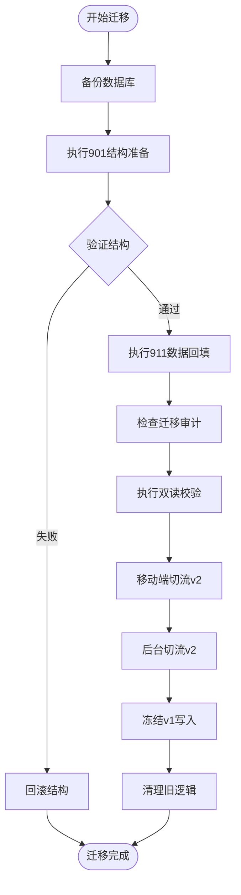
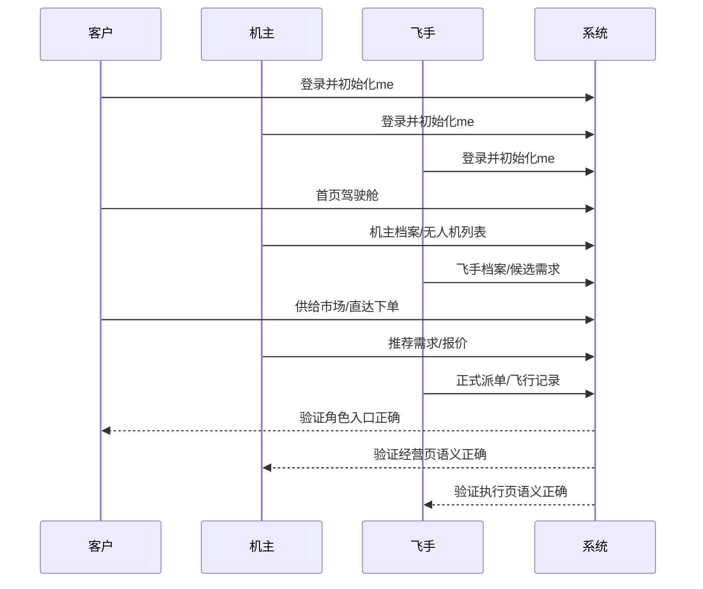
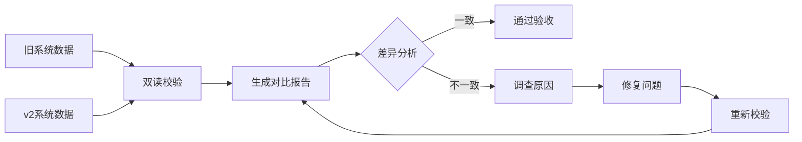
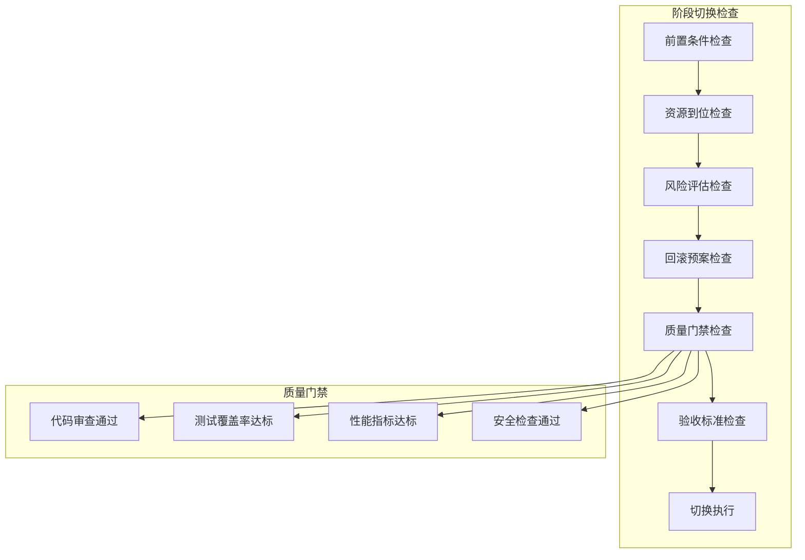

# 重构阶段执行管理

<cite>
**本文档引用的文件**
- [REFACTOR_MASTER_TASKLIST.md](file://REFACTOR_MASTER_TASKLIST.md)
- [BUSINESS_DATABASE_MIGRATION_PLAN.md](file://BUSINESS_DATABASE_MIGRATION_PLAN.md)
- [PHASE9_MIGRATION_RUNBOOK.md](file://backend/docs/PHASE9_MIGRATION_RUNBOOK.md)
- [TEST_CHECKLIST.md](file://TEST_CHECKLIST.md)
- [MOBILE_REGRESSION_ACCEPTANCE.md](file://MOBILE_REGRESSION_ACCEPTANCE.md)
- [ROLE_ACCEPTANCE_WALKTHROUGH.md](file://ROLE_ACCEPTANCE_WALKTHROUGH.md)
- [REFACTOR_TASK_TRACKER.md](file://REFACTOR_TASK_TRACKER.md)
- [router.go](file://backend/internal/api/v2/router.go)
- [user_service.go](file://backend/internal/service/user_service.go)
- [main.go (migrate)](file://backend/cmd/migrate/main.go)
- [main.go (check_v2_parity)](file://backend/cmd/check_v2_parity/main.go)
</cite>

## 目录
1. [项目概述](#项目概述)
2. [重构阶段总览](#重构阶段总览)
3. [阶段执行规范](#阶段执行规范)
4. [阶段质量标准](#阶段质量标准)
5. [阶段切换与并行策略](#阶段切换与并行策略)
6. [进度跟踪与监控](#进度跟踪与监控)
7. [风险控制与问题处理](#风险控制与问题处理)
8. [阶段间依赖管理](#阶段间依赖管理)
9. [阶段总结与经验沉淀](#阶段总结与经验沉淀)
10. [附录：关键流程图](#附录关键流程图)

## 项目概述

本项目为无人机货物吊运智慧服务平台的重构工程，目标是将平台从传统的混合业务模型重构为清晰的角色驱动业务模型。重构采用"文档基线-数据库重建-领域服务-API v2-移动端重构-后台适配-数据迁移-测试验收"的渐进式执行策略。

重构的核心价值在于：
- **业务清晰化**：将角色、需求、供给、订单、派单、飞行记录等业务对象清晰分离
- **技术现代化**：采用微服务架构和清晰的领域模型
- **质量可追溯**：建立完整的测试验收体系和迁移审计机制
- **风险可控**：通过双读校验和回滚机制确保迁移安全

## 重构阶段总览

根据重构总表，项目分为10个重构阶段，每个阶段都有明确的目标、输入输出、关键交付物和验收标准：

### 阶段复杂度分布
| 阶段 | 复杂度 | 主要任务 | 关键里程碑 |
|------|--------|----------|------------|
| 阶段 0 | M | 文档基线与业务冻结 | 完成角色、流程、状态机闭环 |
| 阶段 1 | XL | 数据库与领域模型重建 | 建立v2目标表结构 |
| 阶段 2 | XL | 后端领域服务重构 | 实现统一角色摘要 |
| 阶段 3 | L | API v2实现与路由切换 | 建立v2路由骨架 |
| 阶段 4-7 | M-XL | 移动端重构 | 切换到v2业务对象 |
| 阶段 8 | M | 后台管理与运营适配 | 适配新角色模型 |
| 阶段 9 | XL | 数据迁移、双读校验与切流 | 执行迁移脚本 |
| 阶段 10 | L | 测试、验收与收尾 | 自动验收通过 |

## 阶段执行规范

### 阶段0：文档基线与业务冻结
**执行方法：**
- 复核主业务文档，修正角色、流程、状态机逻辑漏洞
- 补齐字段字典，统一字段命名、状态枚举、来源追溯规则
- 建立页面信息架构，拆清四大视角
- 完善API v2契约，统一DTO、分页、响应结构
- 制定数据库关系与迁移方案

**输入输出：**
- 输入：业务需求文档、现有系统代码
- 输出：统一的业务设计文档、v2 API契约、数据库迁移方案

**关键交付物：**
- BUSINESS_ROLE_REDESIGN.md
- BUSINESS_FIELD_DICTIONARY.md  
- BUSINESS_PAGE_INFORMATION_ARCHITECTURE.md
- BUSINESS_API_CONTRACT.md
- BUSINESS_DATABASE_MIGRATION_PLAN.md

**验收标准：**
- 角色体系、撮合链路、履约链路、候选机制、绑定飞手机制、异常处理、状态机已形成闭环
- 字段命名、状态枚举、来源追溯规则统一
- 页面对象边界明确，供给市场、需求市场、订单、派单任务、飞行记录不再混页

### 阶段1：数据库与领域模型重建
**执行方法：**
- 建立v2目标表结构：client_profiles、owner_profiles、pilot_profiles
- 重建owner_supplies与owner_pilot_bindings表
- 创建demands、demand_quotes、demand_candidate_pilots、matching_logs表
- 扩展orders表，加入订单来源追溯字段
- 建立迁移映射表与迁移审计表

**输入输出：**
- 输入：阶段0产出的数据库迁移方案
- 输出：v2数据库结构、迁移脚本、模型定义

**关键交付物：**
- migrations/101-109系列脚本
- backend/internal/model下的数据模型
- 迁移映射表和审计表

**验收标准：**
- 三类档案表完成建模，账号与档案可独立判断
- 供给能力、服务场景、价格规则、绑定飞手生命周期可落库
- 订单来源追溯不丢失，飞行记录只承接履约飞行

### 阶段2：后端领域服务重构
**执行方法：**
- 重构账号与初始化服务，输出统一的RoleSummary
- 重构客户域服务，支持自动客户档案、需求创建、需求详情、需求转单
- 重构机主域服务，支持档案、无人机、供给、绑定飞手、机主报价
- 重构飞手域服务，支持认证、在线状态、候选报名、派单接受/拒绝、飞行记录聚合
- 重构撮合服务，统一需求推荐、报价流转、候选飞手池、机主风险评估
- 重构订单服务，统一处理demand_market与supply_direct两条来源链路
- 重构派单服务，实现固定调度优先级、自动重派、异常回退
- 重构飞行服务，按真实履约数据汇总飞行统计与飞行记录
- 重构通知与事件服务，集中处理需求、报价、订单、派单、资质事件

**输入输出：**
- 输入：阶段1的数据库结构
- 输出：v2领域服务、业务逻辑实现

**关键交付物：**
- backend/internal/service下的各域服务
- 业务逻辑测试用例
- 服务层接口文档

**验收标准：**
- /api/v2/me所需角色摘要可完全由后端计算
- 创建需求、查看我的需求、查看报价、选择机主转单全部走新服务
- 飞手身份与执行能力被拆清，候选报名与正式派单语义不再混淆

### 阶段3：API v2实现与路由切换
**执行方法：**
- 建立/api/v2路由骨架、统一响应结构、错误码与分页中间件
- 落地认证与初始化接口：register、login、me
- 落地客户域接口：供给市场、供给详情、直达下单、需求管理、需求转单
- 落地机主域接口：档案、无人机、供给、报价、绑定飞手
- 落地飞手域接口：档案、在线状态、候选报名、派单响应、飞行记录
- 落地订单与派单接口：订单列表、订单详情、机主确认直达订单、派单、重派、监控
- 落地财务、通知、争议相关接口
- 生成v2 OpenAPI文档并建立v1/v2差异对照

**输入输出：**
- 输入：阶段2的领域服务
- 输出：v2 API实现、路由配置、接口文档

**关键交付物：**
- backend/internal/api/v2下的各域API处理器
- OpenAPI文档
- API测试用例

**验收标准：**
- 存在独立v2路由与handler目录；响应结构和错误格式统一
- 注册自动创建客户档案；/api/v2/me能返回角色摘要和能力摘要
- 客户既能发布需求，也能从供给详情发起直达下单；接口不会返回不符合平台范围的供给

### 阶段4：移动端基础重构
**执行方法：**
- 重构移动端应用初始化，接入RoleSummary与v2 API客户端
- 重构一级导航为首页/市场/履约/消息/我的
- 建立统一状态徽标、来源标签、卡片组件与空状态组件
- 清理旧的角色切换和首页临时判断逻辑

**输入输出：**
- 输入：v2 API契约
- 输出：移动端基础重构、组件库

**关键交付物：**
- mobile/src下的全局状态、服务层、导航初始化
- 统一组件库
- 移动端测试用例

**验收标准：**
- 移动端不再用旧user_type做角色主判断；首页和我的页能读取统一角色摘要
- 新导航结构稳定，旧的混合入口被移除或迁走
- 需求、供给、订单、派单任务、飞行记录的视觉表达有统一组件

### 阶段5：移动端市场域重构
**执行方法：**
- 重构首页驾驶舱，按综合/客户/机主/飞手四种视图展示优先动作
- 新建供给市场、供给详情、直达下单确认页面
- 重构需求市场与需求详情，明确机主报价入口和飞手候选报名入口
- 重构我的需求、我的报价、我的供给页面
- 重构供给发布与编辑流程，对接机主无人机与价格规则

**输入输出：**
- 输入：v2 API市场域接口
- 输出：市场域移动端页面

**关键交付物：**
- mobile/src/screens下的市场域页面
- 页面交互逻辑
- 用户体验测试

**验收标准：**
- 首页不截断、不混角色；客户能立刻发需求/看供给，机主能看新需求，飞手能看待接派单
- 客户可从供给市场进入供给详情并发起直达下单；提交后看到待机主确认状态
- 需求、报价、供给三类列表彻底分离，编号、状态、操作入口一致

### 阶段6：移动端履约域重构
**执行方法：**
- 重构订单列表，按订单对象展示，并显示来源标签、状态、承接方/执行方摘要
- 重构订单详情，固定展示来源、参与方、执行状态、财务状态、当前派单
- 加入直达下单待确认流：客户看待确认状态，机主可确认/拒绝
- 重构派单任务列表与详情，确保其只表达正式派单
- 接通机主发起派单、飞手接受/拒绝、自动重派的移动端交互
- 重构飞行监控入口，确保从订单详情和派单任务都能进入正确监控页面
- 重构飞行记录页，完全切换到真实履约飞行数据
- 重构支付、退款、评价与售后页面

**输入输出：**
- 输入：v2 API履约域接口
- 输出：履约域移动端页面

**关键交付物：**
- mobile/src/screens下的履约域页面
- 飞行监控页面
- 支付与售后页面

**验收标准：**
- 列表与详情页状态一致、编号一致；不再把飞手任务重复展示成另一套订单
- 订单详情能解释清楚"谁承接、谁执行、是否自执行、是否经过派单、来源于需求还是供给"
- 直达订单从提交到机主确认、再到支付的页面路径完整闭环
- 飞行次数、时长、距离、高度均与履约记录一致

### 阶段7：移动端我的页、档案与消息域重构
**执行方法：**
- 重构"我的"首页，展示账号卡、身份卡、能力卡、快捷入口
- 重构客户档案与地址信息页，取消"再次注册为客户"的重复动作
- 重构机主档案、无人机、供给管理入口
- 重构飞手档案、认证、在线状态与可服务区域设置
- 重构绑定飞手管理页，支持邀请、申请、确认、解除
- 重构系统通知与会话消息，按业务事件分类而不是杂乱流

**输入输出：**
- 输入：v2 API档案与消息域接口
- 输出：我的页、档案管理、消息域移动端页面

**关键交付物：**
- mobile/src/screens下的档案与消息域页面
- 绑定飞手管理页面
- 通知与消息页面

**验收标准：**
- 页面不再显示模糊user_type；能明确看出客户/机主/飞手持有情况与可用能力
- 默认注册用户直接拥有个人客户档案，不再看到不合理的重复注册入口
- 飞手认证、在线状态、接单能力、服务区域设置统一接入新接口

### 阶段8：后台管理与运营适配
**执行方法：**
- 梳理后台管理端对新角色模型的适配范围
- 改造后台的需求、供给、订单、派单、飞行记录管理页
- 增加迁移审计与异常订单运营看板

**输入输出：**
- 输入：v2 API管理域接口
- 输出：后台管理页面、运营看板

**关键交付物：**
- admin/src下的管理页面
- 运营看板
- 管理员操作手册

**验收标准：**
- 明确后台需要新增或改造的列表、详情、审核、查询入口
- 后台可按新对象模型查询、审核、追踪，不再依赖旧混合语义字段
- 运营可以看到未迁移成功数据、来源缺失订单、状态异常订单

### 阶段9：数据迁移、双读校验与切流
**执行方法：**
- 编写建表迁移脚本，按高位编号落到backend/migrations
- 编写历史数据回填脚本，完成档案、需求、订单、派单、飞行记录映射
- 建立双读校验工具，对比v1/v2在关键列表和详情页上的结果
- 先切移动端到v2，再切后台到v2，最后冻结v1写入
- 清理旧user_type主判断逻辑、旧订单混合展示逻辑、旧飞手任务兼容逻辑

**输入输出：**
- 输入：v2数据库结构、历史数据
- 输出：迁移脚本、双读校验工具、切流报告

**关键交付物：**
- migrations/901、911系列脚本
- 双读校验工具
- 切流执行报告
- 迁移审计看板

**验收标准：**
- 结构迁移脚本幂等、可回滚、和数据回填脚本分离
- 历史数据能批量回填；来源不清数据进入审计清单
- 首页、订单列表、派单列表、飞行统计都能输出新旧对比结果
- 新页面默认走v2；旧接口仅保留只读兼容或彻底下线计划

### 阶段10：测试、验收与收尾
**执行方法：**
- 补齐后端单元测试、服务层测试、关键集成测试
- 补齐移动端关键页面回归清单与截图验收标准
- 做角色视角的业务验收：客户、机主、飞手、复合身份各跑一遍主链路
- 更新项目总测试文档、部署清单、演示账号说明

**输入输出：**
- 输入：各阶段交付物
- 输出：测试报告、验收报告、项目文档

**关键交付物：**
- 自动验收脚本
- 移动端回归清单
- 角色验收报告
- 项目最终文档

**验收标准：**
- 需求转单、直达下单、派单重派、飞行统计、退款等关键流程都有自动化测试
- 首页、供给市场、需求市场、订单、派单、飞行记录、我的页均有回归清单
- 四种角色主链路均能跑通，且不存在角色误导、状态错位、编号错位、入口断链
- 测试与演示文档和新业务模型一致，后续接手人可直接按文档验收

## 阶段质量标准

### 质量度量指标
- **代码质量**：单元测试覆盖率≥80%，集成测试覆盖率≥90%
- **性能指标**：API响应时间≤200ms，数据库查询时间≤500ms
- **稳定性指标**：系统可用性≥99.9%，故障恢复时间≤30分钟
- **数据质量**：迁移数据准确率≥99%，双读校验差异率≤0.1%

### 验收标准矩阵
| 阶段 | 功能验收 | 性能验收 | 安全验收 | 文档验收 |
|------|----------|----------|----------|----------|
| 0 | 角色体系闭环 | - | - | 文档齐全 |
| 1 | 数据模型完整 | - | - | 迁移方案完善 |
| 2 | 服务接口可用 | - | - | 服务文档完整 |
| 3 | API接口稳定 | - | - | 接口文档完整 |
| 4-7 | 页面功能正确 | - | - | 用户手册完善 |
| 8 | 后台功能完整 | - | - | 管理文档完善 |
| 9 | 数据迁移成功 | - | - | 迁移报告完整 |
| 10 | 自动验收通过 | - | - | 项目文档完整 |

## 阶段切换与并行策略

### 阶段切换条件
1. **前置条件满足**：上一阶段所有任务完成并通过验收
2. **资源到位**：开发、测试、运维资源准备就绪
3. **风险评估通过**：迁移风险评估报告批准
4. **回滚预案就绪**：迁移回滚方案准备完成

### 并行执行策略
- **阶段1与阶段2并行**：数据库建模与服务重构并行推进
- **阶段3与阶段4并行**：API v2实现与移动端基础重构并行
- **阶段5-7并行**：市场域、履约域、我的域重构并行
- **阶段8独立执行**：后台适配不阻塞第一版移动端主链路

### 资源协调方法
- **跨团队协作**：前端、后端、测试、运维团队定期同步
- **资源池管理**：统一管理开发资源，避免资源冲突
- **优先级管理**：P0任务优先，P1任务并行，P2任务延后
- **风险管理**：建立风险预警机制，及时调整执行计划

## 进度跟踪与监控

### 进度跟踪方法
1. **甘特图跟踪**：使用甘特图可视化各阶段进度
2. **燃尽图监控**：实时监控任务完成情况
3. **里程碑检查**：每个阶段结束进行里程碑检查
4. **周报制度**：每周发布项目进展报告

### 关键指标监控
- **任务完成率**：当前完成任务数/总任务数
- **缺陷密度**：缺陷数量/代码行数
- **测试通过率**：通过测试用例数/总测试用例数
- **用户反馈**：用户满意度评分、问题反馈数量

### 问题预警机制
- **阈值预警**：设置关键指标阈值，超过阈值自动预警
- **分级预警**：根据问题严重程度分级预警
- **升级机制**：问题升级流程，确保及时解决
- **根因分析**：问题根因分析，防止同类问题重复发生

## 风险控制与问题处理

### 风险识别与评估
1. **技术风险**：新技术栈学习成本、兼容性问题
2. **进度风险**：任务延期、资源不足
3. **质量风险**：缺陷密度高、测试覆盖不足
4. **数据风险**：迁移数据丢失、数据不一致

### 风险控制措施
- **技术风险控制**：技术预研、原型验证、专家评审
- **进度风险控制**：缓冲时间设置、关键路径管理、资源冗余
- **质量风险控制**：代码审查、自动化测试、质量门禁
- **数据风险控制**：备份策略、双读校验、回滚机制

### 问题处理流程
1. **问题发现**：通过监控、测试、用户反馈发现
2. **问题分类**：根据影响范围和严重程度分类
3. **问题处理**：制定解决方案，分配责任人
4. **问题跟踪**：跟踪问题解决进度，确保按时完成
5. **问题关闭**：验证问题已解决，关闭问题工单

## 阶段间依赖管理

### 依赖关系分析
- **阶段0**是所有阶段的基础，必须最先完成
- **阶段1和阶段2**相互依赖，需要并行执行
- **阶段3**依赖阶段1和阶段2的完成
- **阶段4-7**依赖阶段3的API完成
- **阶段8**相对独立，不阻塞主链路
- **阶段9**依赖前面所有阶段的完成
- **阶段10**是收尾阶段，依赖所有阶段完成

### 依赖管理策略
- **强依赖**：严格按顺序执行，确保前置条件满足
- **弱依赖**：通过并行执行提高效率
- **外部依赖**：与外部系统对接时制定详细对接计划
- **技术依赖**：关键技术难点提前攻关

### 依赖风险控制
- **依赖识别**：全面识别各阶段间的依赖关系
- **依赖监控**：实时监控依赖关系变化
- **依赖缓冲**：为关键依赖设置缓冲时间
- **依赖替代**：制定依赖替代方案

## 阶段总结与经验沉淀

### 阶段总结模板
每个阶段结束后需要填写阶段总结报告：

**阶段基本信息**
- 阶段编号：R1.01
- 执行时间：2026-03-01 至 2026-03-15
- 负责人：张三
- 参与人员：李四、王五

**完成情况**
- 已完成任务：10/10
- 未完成任务：0/10
- 延期任务：0

**质量评估**
- 代码质量：优秀
- 测试覆盖率：95%
- 缺陷密度：0.2个/千行

**风险控制**
- 已识别风险：3个
- 已处理风险：3个
- 未处理风险：0个

**经验教训**
- 成功经验：采用并行执行策略，提高效率
- 改进方向：加强前期技术预研
- 知识分享：团队技术分享会

### 经验教训收集
1. **技术经验**：新技术栈使用经验、架构设计经验
2. **管理经验**：项目管理经验、团队协作经验
3. **业务经验**：业务理解经验、需求分析经验
4. **质量经验**：测试经验、质量保证经验

### 最佳实践提炼
- **架构设计**：采用清晰的分层架构，职责分离
- **开发流程**：实施持续集成和持续部署
- **测试策略**：建立多层次测试体系
- **文档管理**：保持文档与代码同步更新
- **风险管理**：建立完善的风险识别和控制机制

## 附录：关键流程图

### 阶段9迁移执行流程

### 角色验收流程

### 双读校验流程

### 阶段切换检查清单
