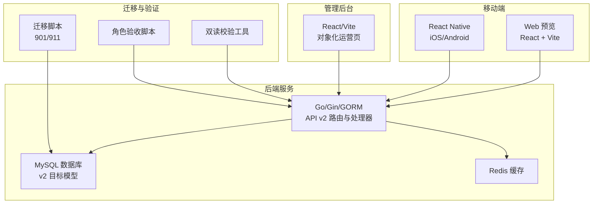
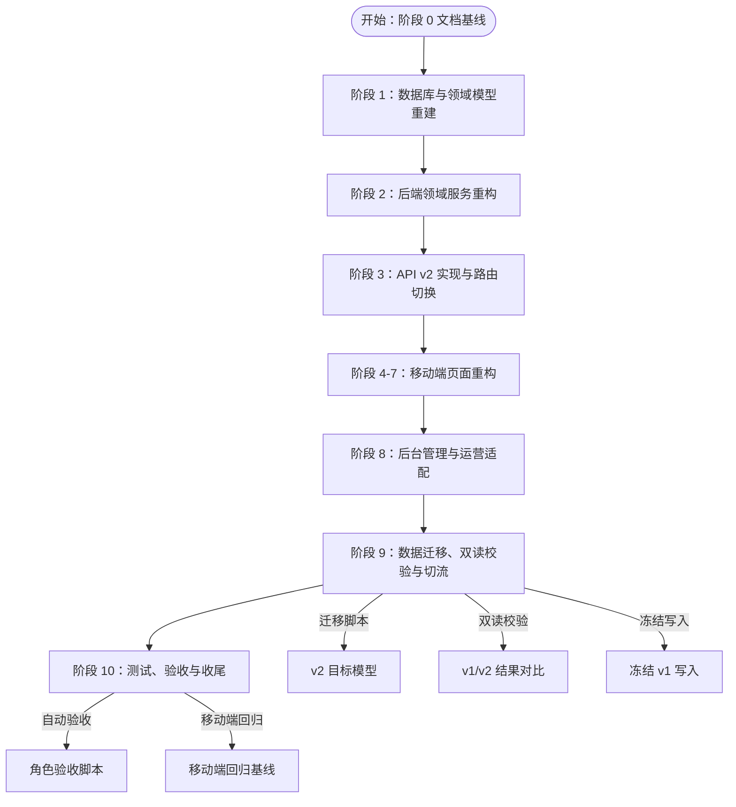
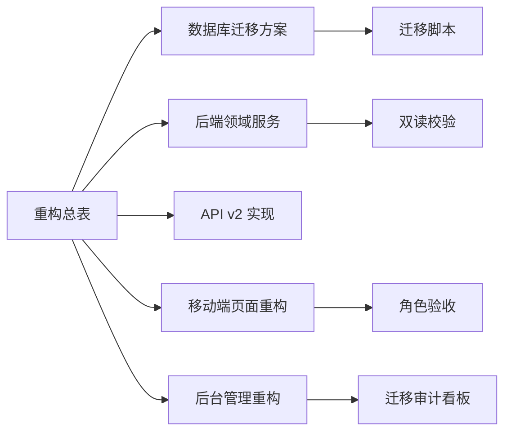

# 重构风险控制与应急预案

<cite>
**本文档引用的文件**
- [REFACTOR_MASTER_TASKLIST.md](file://REFACTOR_MASTER_TASKLIST.md)
- [BUSINESS_DATABASE_MIGRATION_PLAN.md](file://BUSINESS_DATABASE_MIGRATION_PLAN.md)
- [TEST_CHECKLIST.md](file://TEST_CHECKLIST.md)
- [MOBILE_REGRESSION_ACCEPTANCE.md](file://MOBILE_REGRESSION_ACCEPTANCE.md)
- [ROLE_ACCEPTANCE_WALKTHROUGH.md](file://ROLE_ACCEPTANCE_WALKTHROUGH.md)
- [DEMO_ACCOUNTS.md](file://DEMO_ACCOUNTS.md)
- [PRE_MANUAL_TEST_MASTER_TASKLIST.md](file://PRE_MANUAL_TEST_MASTER_TASKLIST.md)
- [DEPLOY_CHECKLIST.md](file://DEPLOY_CHECKLIST.md)
- [README.md](file://README.md)
- [admin/ADMIN_REFACTOR_SCOPE.md](file://admin/ADMIN_REFACTOR_SCOPE.md)
</cite>

## 目录
1. [简介](#简介)
2. [项目结构](#项目结构)
3. [核心组件](#核心组件)
4. [架构总览](#架构总览)
5. [详细组件分析](#详细组件分析)
6. [依赖分析](#依赖分析)
7. [性能考虑](#性能考虑)
8. [故障排查指南](#故障排查指南)
9. [结论](#结论)
10. [附录](#附录)

## 简介
本文件面向无人机租赁平台的重构项目，围绕“重构风险控制与应急预案”主题，基于重构总表与数据库迁移计划，系统化梳理重构过程中的技术风险、业务风险与管理风险，提出风险识别、评估、缓解与应急响应策略，并配套风险登记册模板、风险评估工具与风险应对策略库，帮助项目团队建立可执行的风险监控体系与沟通复盘机制。

## 项目结构
项目采用前后端分离与多端协同的架构，包含后端服务、移动端（React Native/Web）、管理后台（React/Vite）与迁移脚本。重构主线以“v2 业务模型 + v2 API + v2 页面 + v2 数据库”为核心，分阶段推进，确保在迁移过程中维持业务连续性与数据一致性。

图表来源
- [README.md:1-29](file://README.md#L1-L29)
- [REFACTOR_MASTER_TASKLIST.md:497-504](file://REFACTOR_MASTER_TASKLIST.md#L497-L504)

章节来源
- [README.md:1-29](file://README.md#L1-L29)
- [REFACTOR_MASTER_TASKLIST.md:497-504](file://REFACTOR_MASTER_TASKLIST.md#L497-L504)

## 核心组件
- 重构总表：明确阶段划分、任务清单与验收标准，作为风险识别与跟踪的基线。
- 数据库迁移方案：定义目标模型、映射规则、迁移阶段与验证清单，是技术风险与业务风险的交汇点。
- 测试与验收文档：提供自动验收脚本、移动端回归基线、演示账号与测试清单，支撑风险验证与应急处置。
- 部署配置清单：涵盖第三方服务、支付、短信、地图、推送等，是上线阶段的关键风险控制点。

章节来源
- [REFACTOR_MASTER_TASKLIST.md:1-512](file://REFACTOR_MASTER_TASKLIST.md#L1-L512)
- [BUSINESS_DATABASE_MIGRATION_PLAN.md:1-550](file://BUSINESS_DATABASE_MIGRATION_PLAN.md#L1-L550)
- [TEST_CHECKLIST.md:1-448](file://TEST_CHECKLIST.md#L1-L448)
- [MOBILE_REGRESSION_ACCEPTANCE.md:1-337](file://MOBILE_REGRESSION_ACCEPTANCE.md#L1-L337)
- [ROLE_ACCEPTANCE_WALKTHROUGH.md:1-217](file://ROLE_ACCEPTANCE_WALKTHROUGH.md#L1-L217)
- [DEMO_ACCOUNTS.md:1-116](file://DEMO_ACCOUNTS.md#L1-L116)
- [PRE_MANUAL_TEST_MASTER_TASKLIST.md:1-586](file://PRE_MANUAL_TEST_MASTER_TASKLIST.md#L1-L586)
- [DEPLOY_CHECKLIST.md:1-303](file://DEPLOY_CHECKLIST.md#L1-L303)

## 架构总览
重构以“v2 业务模型”为中心，贯穿“数据库模型重建—后端领域服务重构—API v2 实现—移动端与后台页面重构—数据迁移与双读校验—切流—验收与收尾”的完整闭环。阶段 9 的迁移与阶段 10 的验收是风险控制的关键节点。

图表来源
- [REFACTOR_MASTER_TASKLIST.md:54-512](file://REFACTOR_MASTER_TASKLIST.md#L54-L512)
- [BUSINESS_DATABASE_MIGRATION_PLAN.md:398-485](file://BUSINESS_DATABASE_MIGRATION_PLAN.md#L398-L485)

章节来源
- [REFACTOR_MASTER_TASKLIST.md:54-512](file://REFACTOR_MASTER_TASKLIST.md#L54-L512)
- [BUSINESS_DATABASE_MIGRATION_PLAN.md:398-485](file://BUSINESS_DATABASE_MIGRATION_PLAN.md#L398-L485)

## 详细组件分析

### 技术风险控制
- 代码质量风险
  - 风险点：v2 路由中存在未实现端点、旧常量与默认地址残留、并发刷新队列挂起等问题。
  - 控制措施：建立“未实现端点清单”与“旧接口残留清单”，在阶段 F 中完成修复与复验；对并发刷新队列补齐失败拒绝路径。
  - 验证手段：自动验收脚本、双读校验工具、移动端与后台构建检查。
  - 章节来源
    - [PRE_MANUAL_TEST_MASTER_TASKLIST.md:321-328](file://PRE_MANUAL_TEST_MASTER_TASKLIST.md#L321-L328)
    - [PRE_MANUAL_TEST_MASTER_TASKLIST.md:508-514](file://PRE_MANUAL_TEST_MASTER_TASKLIST.md#L508-L514)

- 性能影响风险
  - 风险点：构建包体过大、首屏体积与拆包优化不足、并发请求与异步刷新导致的抖动。
  - 控制措施：对移动端与后台进行动态拆包优化，降低 chunk 体积；优化并发刷新队列，避免请求堆积。
  - 验证手段：构建产物体积检查、移动端 Web 构建与 RN 原生构建复验。
  - 章节来源
    - [PRE_MANUAL_TEST_MASTER_TASKLIST.md:425-437](file://PRE_MANUAL_TEST_MASTER_TASKLIST.md#L425-L437)
    - [TEST_CHECKLIST.md:416-448](file://TEST_CHECKLIST.md#L416-L448)

- 兼容性问题风险
  - 风险点：v1/v2 并存期页面与接口混用、地图 SDK 配置告警、推送 SDK 配置差异。
  - 控制措施：在移动端与后台显式覆盖 API 基址，避免默认打到旧地址；补齐地图与推送配置。
  - 验证手段：环境配置检查、健康检查与路由可达性验证。
  - 章节来源
    - [PRE_MANUAL_TEST_MASTER_TASKLIST.md:555-564](file://PRE_MANUAL_TEST_MASTER_TASKLIST.md#L555-L564)
    - [DEPLOY_CHECKLIST.md:136-185](file://DEPLOY_CHECKLIST.md#L136-L185)

### 业务风险控制
- 数据迁移风险
  - 风险点：历史数据映射不准确、来源不明、准入门槛未落地、迁移审计清单缺失。
  - 控制措施：严格按迁移方案执行建表与回填脚本，建立迁移映射表与审计表；在阶段 9 前冻结 v1 写入，确保新旧数据隔离。
  - 验证手段：迁移验证清单、双读校验工具、阶段 10 自动验收。
  - 章节来源
    - [BUSINESS_DATABASE_MIGRATION_PLAN.md:486-505](file://BUSINESS_DATABASE_MIGRATION_PLAN.md#L486-L505)
    - [BUSINESS_DATABASE_MIGRATION_PLAN.md:506-537](file://BUSINESS_DATABASE_MIGRATION_PLAN.md#L506-L537)
    - [REFACTOR_MASTER_TASKLIST.md:439-470](file://REFACTOR_MASTER_TASKLIST.md#L439-L470)

- 业务中断风险
  - 风险点：v1 写入未冻结、页面对象边界不清、状态机错乱。
  - 控制措施：先切移动端到 v2，再切后台到 v2，最后冻结 v1 写入；通过对象边界验收与状态一致性检查避免中断。
  - 验证手段：移动端回归基线、对象边界验收、状态一致性专项检查。
  - 章节来源
    - [REFACTOR_MASTER_TASKLIST.md:459-470](file://REFACTOR_MASTER_TASKLIST.md#L459-L470)
    - [MOBILE_REGRESSION_ACCEPTANCE.md:262-271](file://MOBILE_REGRESSION_ACCEPTANCE.md#L262-L271)

- 用户体验影响
  - 风险点：页面断链、入口缺失、状态不一致、空状态与错误态布局破坏。
  - 控制措施：建立统一状态徽标与来源标签组件，强化空状态与错误态设计；通过回归基线与截图验收标准保障体验。
  - 验证手段：移动端回归矩阵、截图验收标准、空状态与错误态专项检查。
  - 章节来源
    - [MOBILE_REGRESSION_ACCEPTANCE.md:47-46](file://MOBILE_REGRESSION_ACCEPTANCE.md#L47-L46)
    - [MOBILE_REGRESSION_ACCEPTANCE.md:244-261](file://MOBILE_REGRESSION_ACCEPTANCE.md#L244-L261)

### 管理风险控制
- 进度延误
  - 风险点：阶段间依赖未达成、自动验收失败反复回退。
  - 控制措施：以阶段 9/10 为里程碑节点，前置环境与依赖检查；对高风险项（未实现端点、旧接口残留）建立“已知风险清单”与“修复优先级”。
  - 章节来源
    - [PRE_MANUAL_TEST_MASTER_TASKLIST.md:546-586](file://PRE_MANUAL_TEST_MASTER_TASKLIST.md#L546-L586)

- 资源不足
  - 风险点：第三方服务配置缺失、支付/短信/地图/推送未完成。
  - 控制措施：按部署清单逐项核对，生产环境禁止启用开发演示数据整理逻辑。
  - 章节来源
    - [DEPLOY_CHECKLIST.md:6-40](file://DEPLOY_CHECKLIST.md#L6-L40)

- 人员变动
  - 风险点：知识断层、文档与代码不一致。
  - 控制措施：定期复盘与知识沉淀，确保文档与代码同步更新；阶段 10 验收后形成可移交的文档资产。
  - 章节来源
    - [REFACTOR_MASTER_TASKLIST.md:505-512](file://REFACTOR_MASTER_TASKLIST.md#L505-L512)

### 风险监控体系与预警机制
- 监控指标
  - v2 健康状态、API 响应延迟与错误率、移动端 Web/原生构建成功率、后台运营看板可用性。
- 预警阈值
  - 健康检查失败、API 错误率超阈、构建失败、验收脚本失败。
- 触发机制
  - 自动化流水线失败即触发预警；移动端/后台构建失败即时阻断。
- 章节来源
  - [TEST_CHECKLIST.md:431-448](file://TEST_CHECKLIST.md#L431-L448)
  - [PRE_MANUAL_TEST_MASTER_TASKLIST.md:546-586](file://PRE_MANUAL_TEST_MASTER_TASKLIST.md#L546-L586)

### 应急响应预案
- v2 未实现端点
  - 应急：优先补齐关键端点（订单推进、飞行记录、会话消息）；手工测试阶段暂时规避相关按钮。
  - 章节来源
    - [PRE_MANUAL_TEST_MASTER_TASKLIST.md:560-564](file://PRE_MANUAL_TEST_MASTER_TASKLIST.md#L560-L564)

- 旧接口残留与默认地址
  - 应急：在本地环境显式覆盖 API 基址，避免误打到 cpolar/api/v1；对仍保留 v1 客户端的页面进行重点回归。
  - 章节来源
    - [PRE_MANUAL_TEST_MASTER_TASKLIST.md:555-558](file://PRE_MANUAL_TEST_MASTER_TASKLIST.md#L555-L558)

- 迁移审计与异常订单
  - 应急：通过迁移审计看板定位异常；冻结 v1 写入，确保新旧数据隔离；必要时回滚至上一稳定迁移脚本。
  - 章节来源
    - [admin/ADMIN_REFACTOR_SCOPE.md:217-227](file://admin/ADMIN_REFACTOR_SCOPE.md#L217-L227)
    - [BUSINESS_DATABASE_MIGRATION_PLAN.md:431-445](file://BUSINESS_DATABASE_MIGRATION_PLAN.md#L431-L445)

### 风险登记册模板
- 风险编号：R001
- 风险类别：技术/业务/管理
- 风险描述：v2 路由中存在 11 个未实现端点
- 影响范围：移动端/后台相关页面动作不可用
- 风险等级：高
- 现状：已知风险，正在补齐
- 责任人：后端团队
- 预防措施：优先补齐关键端点；手工测试阶段规避相关按钮
- 应急措施：回退至上一稳定版本；临时屏蔽相关入口
- 记录与更新：随阶段 9/10 验收更新
- 章节来源
  - [PRE_MANUAL_TEST_MASTER_TASKLIST.md:560-564](file://PRE_MANUAL_TEST_MASTER_TASKLIST.md#L560-L564)

### 风险评估工具
- 风险矩阵：按“可能性 × 影响度”评估，分为高/中/低三级，用于确定缓解优先级与资源投入。
- 自动化检查清单：健康检查、构建检查、验收脚本、双读校验工具，作为日常风险评估依据。
- 章节来源
  - [TEST_CHECKLIST.md:431-448](file://TEST_CHECKLIST.md#L431-L448)
  - [PRE_MANUAL_TEST_MASTER_TASKLIST.md:546-586](file://PRE_MANUAL_TEST_MASTER_TASKLIST.md#L546-L586)

### 风险应对策略库
- 高风险：v2 未实现端点、旧接口残留、迁移审计缺失
  - 策略：优先补齐端点与配置；冻结 v1 写入；建立审计看板
- 中风险：构建包体过大、并发刷新队列问题、第三方服务配置告警
  - 策略：动态拆包优化、修复并发刷新队列、补齐配置
- 低风险：启动日志索引调整告警、飞行监控阈值缺失
  - 策略：后续单独梳理迁移脚本；补齐默认配置
- 章节来源
  - [PRE_MANUAL_TEST_MASTER_TASKLIST.md:567-586](file://PRE_MANUAL_TEST_MASTER_TASKLIST.md#L567-L586)
  - [DEPLOY_CHECKLIST.md:136-185](file://DEPLOY_CHECKLIST.md#L136-L185)

### 风险沟通机制与复盘总结
- 沟通机制：每日站会同步风险进展；阶段评审输出风险状态与处置结论；问题升级流程明确责任人与时限。
- 复盘总结：以阶段 10 验收报告与回归基线为依据，形成“通过/需修复”结论与后续优化建议。
- 章节来源
  - [ROLE_ACCEPTANCE_WALKTHROUGH.md:128-217](file://ROLE_ACCEPTANCE_WALKTHROUGH.md#L128-L217)
  - [MOBILE_REGRESSION_ACCEPTANCE.md:320-337](file://MOBILE_REGRESSION_ACCEPTANCE.md#L320-L337)

## 依赖分析
重构涉及后端、移动端、管理后台与迁移脚本的多维依赖，关键依赖关系如下：

图表来源
- [REFACTOR_MASTER_TASKLIST.md:54-512](file://REFACTOR_MASTER_TASKLIST.md#L54-L512)
- [BUSINESS_DATABASE_MIGRATION_PLAN.md:398-485](file://BUSINESS_DATABASE_MIGRATION_PLAN.md#L398-L485)

章节来源
- [REFACTOR_MASTER_TASKLIST.md:54-512](file://REFACTOR_MASTER_TASKLIST.md#L54-L512)
- [BUSINESS_DATABASE_MIGRATION_PLAN.md:398-485](file://BUSINESS_DATABASE_MIGRATION_PLAN.md#L398-L485)

## 性能考虑
- 构建性能：通过动态拆包与资源压缩降低首屏体积，避免阻塞主链路回归。
- 运行性能：统一响应结构与错误码，减少前端解析成本；并发刷新队列优化避免请求堆积。
- 迁移性能：迁移脚本幂等与可回滚，避免长时间锁表与阻塞业务。

## 故障排查指南
- 健康检查失败：检查后端服务、数据库与 Redis 连通性，确认配置文件与环境变量。
- API 错误：使用统一错误响应格式定位问题；对未实现端点优先补齐。
- 构建失败：检查 Node/Go 工具链版本与依赖完整性；针对移动端原生构建补齐 JDK/SDK/模拟器。
- 验收失败：以角色验收脚本与移动端回归基线为依据，逐项复核对象边界与状态一致性。

章节来源
- [TEST_CHECKLIST.md:431-448](file://TEST_CHECKLIST.md#L431-L448)
- [PRE_MANUAL_TEST_MASTER_TASKLIST.md:546-586](file://PRE_MANUAL_TEST_MASTER_TASKLIST.md#L546-L586)

## 结论
通过以重构总表与数据库迁移方案为纲，结合测试与验收文档，项目建立了覆盖技术、业务与管理的全栈风险控制体系。阶段 9 的迁移与阶段 10 的验收是风险控制的关键节点，配合应急响应预案与持续复盘机制，可有效降低重构过程中的不确定性，确保系统在演进中保持稳定与可控。

## 附录
- 风险登记册模板与策略库可直接复用至项目日常管理。
- 建议在每次阶段评审后更新风险状态与处置结论，形成可追溯的风险轨迹。