# 重构计划管理

<cite>
**本文档引用的文件**
- [REFACTOR_MASTER_TASKLIST.md](file://REFACTOR_MASTER_TASKLIST.md)
- [REFACTOR_TASK_TRACKER.md](file://REFACTOR_TASK_TRACKER.md)
- [BUSINESS_ROLE_REDESIGN.md](file://BUSINESS_ROLE_REDESIGN.md)
- [BUSINESS_FIELD_DICTIONARY.md](file://BUSINESS_FIELD_DICTIONARY.md)
- [BUSINESS_API_CONTRACT.md](file://BUSINESS_API_CONTRACT.md)
- [BUSINESS_DATABASE_MIGRATION_PLAN.md](file://BUSINESS_DATABASE_MIGRATION_PLAN.md)
- [MOBILE_REGRESSION_ACCEPTANCE.md](file://MOBILE_REGRESSION_ACCEPTANCE.md)
- [ROLE_ACCEPTANCE_WALKTHROUGH.md](file://ROLE_ACCEPTANCE_WALKTHROUGH.md)
- [TEST_CHECKLIST.md](file://TEST_CHECKLIST.md)
- [README.md](file://README.md)
</cite>

## 目录
1. [引言](#引言)
2. [项目结构](#项目结构)
3. [核心组件](#核心组件)
4. [架构概览](#架构概览)
5. [详细组件分析](#详细组件分析)
6. [依赖分析](#依赖分析)
7. [性能考虑](#性能考虑)
8. [故障排除指南](#故障排除指南)
9. [结论](#结论)
10. [附录](#附录)

## 引言

本文件为无人机租赁平台的重构计划管理文档，基于重构总表详细说明重构任务的分类、优先级、依赖关系、验收标准。文档旨在为项目团队提供系统化的重构管理框架，确保重构工作有序推进、质量可控、风险受控。

重构项目聚焦于以下核心目标：
- 重载末端货物吊运业务边界
- 客户/机主/飞手/复合身份四类角色
- 需求、供给、订单、正式派单、飞行记录五类核心对象
- v2 API 的全面落地与迁移

## 项目结构

项目采用前后端分离的微服务架构，主要分为以下层次：

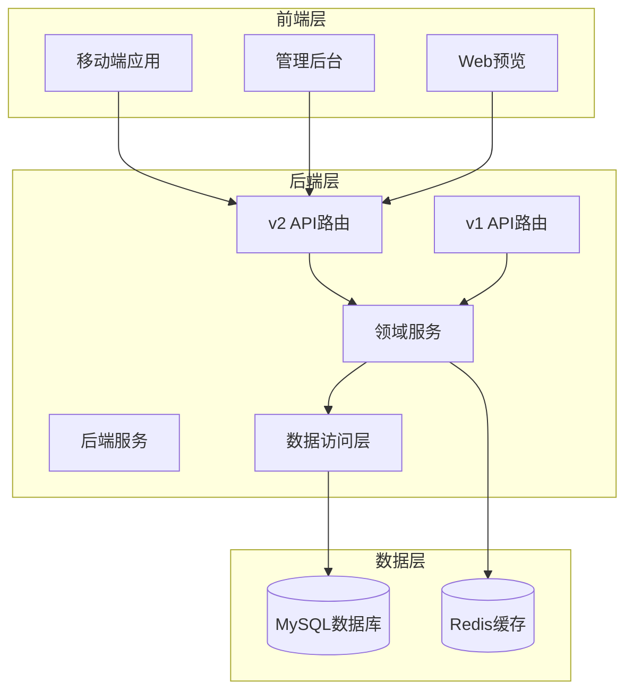

**图表来源**
- [README.md:1-29](file://README.md#L1-L29)
- [BUSINESS_API_CONTRACT.md:20-30](file://BUSINESS_API_CONTRACT.md#L20-L30)

**章节来源**
- [README.md:1-29](file://README.md#L1-L29)

## 核心组件

### 重构任务总表

重构总表将所有重构任务按照阶段进行分类，每个阶段都有明确的复杂度评估、任务清单和验收标准：

| 阶段 | 复杂度 | 任务数量 | 关键目标 |
|------|--------|----------|----------|
| 阶段 0：文档基线与业务冻结 | M | 10 | 建立统一的业务文档基线 |
| 阶段 1：数据库与领域模型重建 | XL | 9 | 完成v2数据库模型 |
| 阶段 2：后端领域服务重构 | XL | 9 | 实现v2领域服务 |
| 阶段 3：API v2实现与路由切换 | L | 8 | 全面落地v2 API |
| 阶段 4：移动端基础重构 | M | 4 | 移动端初始化重构 |
| 阶段 5：移动端市场域重构 | L | 5 | 市场功能重构 |
| 阶段 6：移动端履约域重构 | XL | 9 | 履约流程重构 |
| 阶段 7：移动端我的页重构 | M | 6 | 个人中心重构 |
| 阶段 8：后台管理与运营适配 | M | 3 | 管理后台适配 |
| 阶段 9：数据迁移、双读校验与切流 | XL | 5 | 历史数据迁移 |
| 阶段 10：测试、验收与收尾 | L | 4 | 质量验收与收尾 |

### 任务优先级矩阵

基于重构总表，我们将任务分为四个优先级等级：

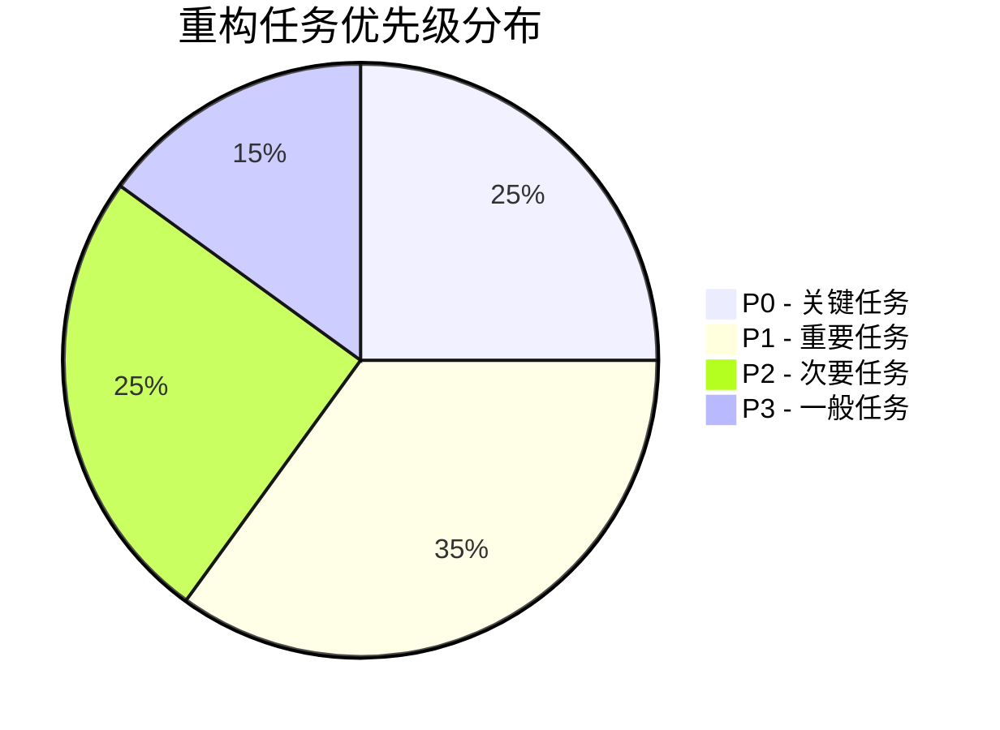

**图表来源**
- [REFACTOR_TASK_TRACKER.md:18-29](file://REFACTOR_TASK_TRACKER.md#L18-L29)

**章节来源**
- [REFACTOR_MASTER_TASKLIST.md:497-512](file://REFACTOR_MASTER_TASKLIST.md#L497-L512)

## 架构概览

### 业务架构演进

重构项目遵循"先模型后实现"的原则，通过以下步骤实现业务架构演进：

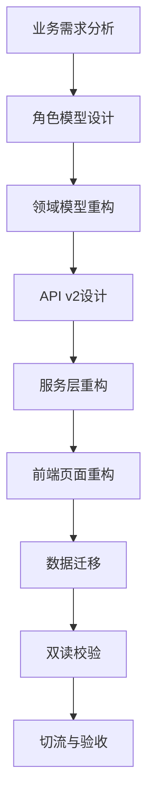

### 技术架构设计

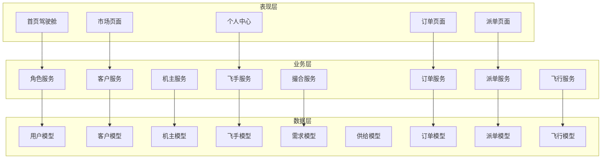

**图表来源**
- [BUSINESS_ROLE_REDESIGN.md:44-63](file://BUSINESS_ROLE_REDESIGN.md#L44-L63)
- [BUSINESS_FIELD_DICTIONARY.md:108-197](file://BUSINESS_FIELD_DICTIONARY.md#L108-L197)

**章节来源**
- [BUSINESS_ROLE_REDESIGN.md:1-800](file://BUSINESS_ROLE_REDESIGN.md#L1-L800)
- [BUSINESS_FIELD_DICTIONARY.md:1-800](file://BUSINESS_FIELD_DICTIONARY.md#L1-L800)

## 详细组件分析

### 阶段 0：文档基线与业务冻结

#### 任务分解与依赖关系

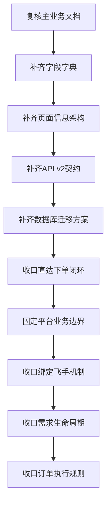

**图表来源**
- [REFACTOR_MASTER_TASKLIST.md:54-110](file://REFACTOR_MASTER_TASKLIST.md#L54-L110)

#### 验收标准

阶段 0 的验收标准重点关注业务逻辑的闭环性和一致性：

- 角色体系、撮合链路、履约链路、候选机制、绑定飞手机制、异常处理、状态机形成完整闭环
- 字段命名、状态枚举、来源追溯规则统一
- 页面对象边界明确，供给市场、需求市场、订单、派单任务、飞行记录不再混页
- 存在明确的 `/api/v2` 契约，供给市场、直达下单、需求转单、派单、飞行接口定义完整
- 目标表关系、历史表映射、迁移阶段、迁移验证清单明确

**章节来源**
- [REFACTOR_MASTER_TASKLIST.md:54-110](file://REFACTOR_MASTER_TASKLIST.md#L54-L110)

### 阶段 1：数据库与领域模型重建

#### 数据模型演进

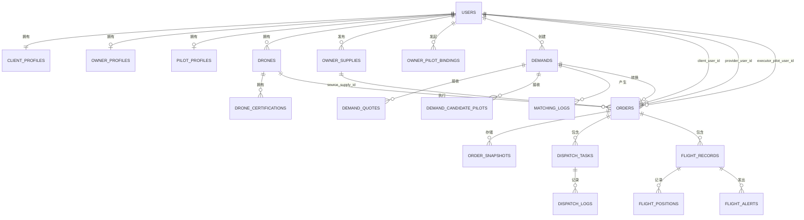

**图表来源**
- [BUSINESS_DATABASE_MIGRATION_PLAN.md:149-186](file://BUSINESS_DATABASE_MIGRATION_PLAN.md#L149-L186)

#### 迁移策略

阶段 1 采用"新表先建，旧表并存，逐步切流"的迁移策略：

1. **建表阶段**：先建立 v2 目标表，不影响当前线上流程
2. **回填阶段**：把旧数据尽量映射进新结构
3. **校验阶段**：建立双读校验工具，对比 v1/v2 结果
4. **切流阶段**：新页面全部调用 `/api/v2`，新接口只写新表

**章节来源**
- [BUSINESS_DATABASE_MIGRATION_PLAN.md:486-550](file://BUSINESS_DATABASE_MIGRATION_PLAN.md#L486-L550)

### 阶段 2：后端领域服务重构

#### 服务层架构

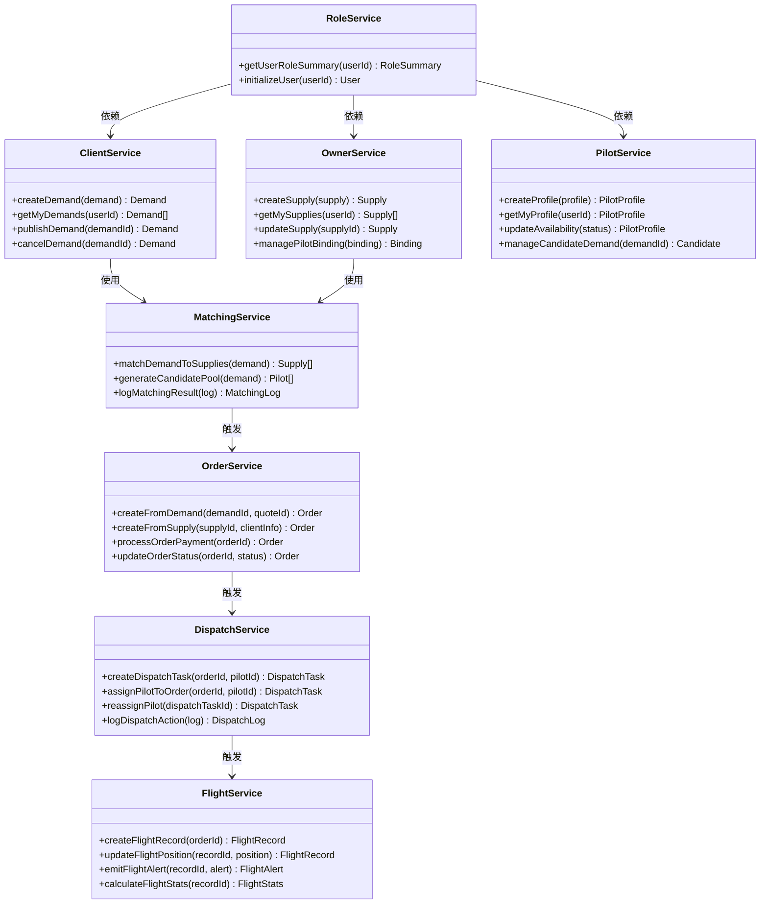

**图表来源**
- [BUSINESS_ROLE_REDESIGN.md:44-63](file://BUSINESS_ROLE_REDESIGN.md#L44-L63)
- [BUSINESS_FIELD_DICTIONARY.md:108-197](file://BUSINESS_FIELD_DICTIONARY.md#L108-L197)

#### 服务重构原则

- **单一职责**：每个服务专注于特定业务领域
- **接口隔离**：对外暴露清晰的业务接口
- **依赖倒置**：服务之间通过接口通信，不直接依赖具体实现
- **可测试性**：每个服务都具备完善的单元测试

**章节来源**
- [BUSINESS_ROLE_REDESIGN.md:130-161](file://BUSINESS_ROLE_REDESIGN.md#L130-L161)

### 阶段 3：API v2 实现与路由切换

#### API 设计规范

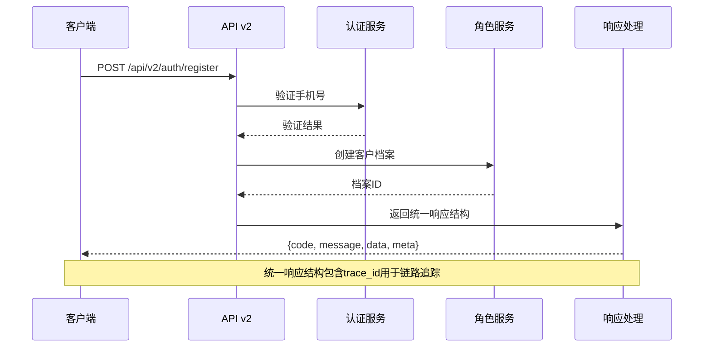

**图表来源**
- [BUSINESS_API_CONTRACT.md:37-58](file://BUSINESS_API_CONTRACT.md#L37-L58)

#### API 版本管理

API v2 采用版本化管理策略：

- **v1 版本**：仅用于历史页面和数据比对
- **v2 版本**：后续新页面、新服务层、新状态机统一使用
- **兼容策略**：迁移期间并存，逐步下线 v1

**章节来源**
- [BUSINESS_API_CONTRACT.md:20-30](file://BUSINESS_API_CONTRACT.md#L20-L30)

### 阶段 4-7：前端页面重构

#### 页面架构设计

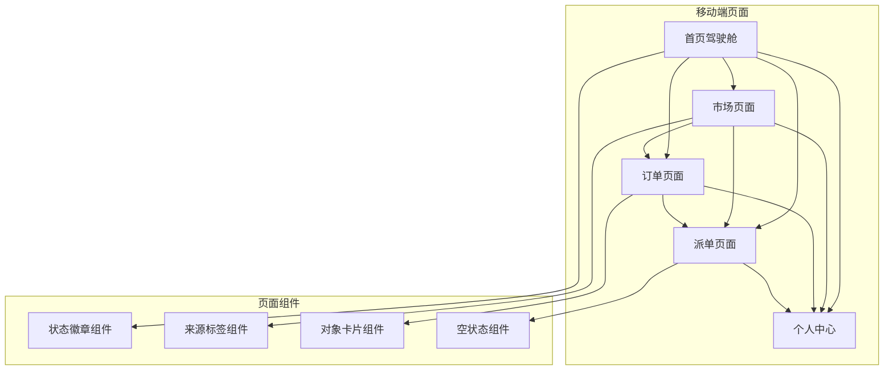

**图表来源**
- [BUSINESS_PAGE_INFORMATION_ARCHITECTURE.md](file://BUSINESS_PAGE_INFORMATION_ARCHITECTURE.md)

#### 组件化重构

前端采用组件化设计理念：

- **统一组件库**：需求、供给、订单、派单任务、飞行记录的视觉表达统一
- **状态管理**：全局状态与组件状态分离
- **路由管理**：清晰的页面路由结构
- **主题系统**：统一的视觉风格和交互体验

**章节来源**
- [BUSINESS_PAGE_INFORMATION_ARCHITECTURE.md](file://BUSINESS_PAGE_INFORMATION_ARCHITECTURE.md)

### 阶段 9：数据迁移与切流

#### 迁移执行流程

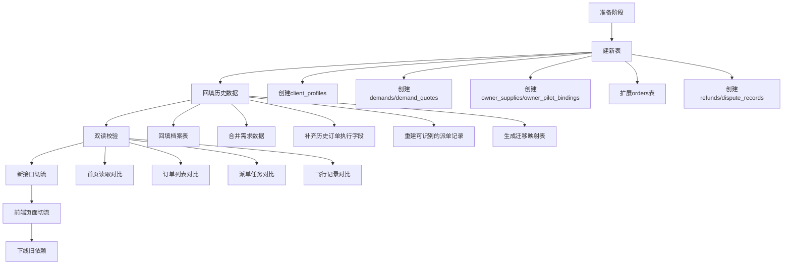

**图表来源**
- [BUSINESS_DATABASE_MIGRATION_PLAN.md:486-550](file://BUSINESS_DATABASE_MIGRATION_PLAN.md#L486-L550)

#### 迁移验证清单

迁移过程中需要验证的关键点：

- **账号与身份**：所有现有用户都存在 `client_profiles`
- **订单与执行**：每个历史订单都能确定 `order_source` 和 `provider_user_id`
- **页面一致性**：同一订单在列表与详情页编号一致、状态一致
- **数据回退能力**：任意阶段切换失败，仍可退回旧页面与旧接口

**章节来源**
- [BUSINESS_DATABASE_MIGRATION_PLAN.md:506-537](file://BUSINESS_DATABASE_MIGRATION_PLAN.md#L506-L537)

## 依赖分析

### 任务依赖关系

```mermaid
graph TD
subgraph "阶段 0"
R001 --> R002
R002 --> R003
R003 --> R004
R004 --> R005
R005 --> R006
R006 --> R007
R007 --> R008
R008 --> R009
R009 --> R010
end
subgraph "阶段 1"
R010 --> R101
R101 --> R102
R102 --> R103
R103 --> R104
R104 --> R105
R105 --> R106
R106 --> R107
R107 --> R108
R108 --> R109
end
subgraph "阶段 2"
R109 --> R201
R201 --> R202
R202 --> R203
R203 --> R204
R204 --> R205
R205 --> R206
R206 --> R207
R207 --> R208
R208 --> R209
end
subgraph "阶段 3"
R209 --> R301
R301 --> R302
R302 --> R303
R303 --> R304
R304 --> R305
R305 --> R306
R306 --> R307
R307 --> R308
end
subgraph "阶段 4-7"
R308 --> R401
R401 --> R501
R501 --> R601
R601 --> R701
end
subgraph "阶段 9-10"
R701 --> R901
R901 --> R902
R902 --> R903
R903 --> R904
R904 --> R905
R905 --> R1001
R1001 --> R1002
R1002 --> R1003
R1003 --> R1004
end
```

**图表来源**
- [REFACTOR_MASTER_TASKLIST.md:497-512](file://REFACTOR_MASTER_TASKLIST.md#L497-L512)

### 技术依赖关系

重构项目的技术依赖关系主要体现在以下几个方面：

1. **数据库依赖**：所有服务都依赖统一的数据库模型
2. **API 依赖**：前端页面依赖统一的 API 接口规范
3. **认证依赖**：所有服务都依赖统一的认证和授权机制
4. **缓存依赖**：服务层依赖统一的缓存策略

**章节来源**
- [BUSINESS_API_CONTRACT.md:31-39](file://BUSINESS_API_CONTRACT.md#L31-L39)

## 性能考虑

### 数据库性能优化

重构项目在数据库层面采用了多项性能优化策略：

1. **索引优化**：针对高频查询字段建立复合索引
2. **分表分库**：大数据量表采用分表策略
3. **读写分离**：热点数据采用读写分离
4. **缓存策略**：关键查询结果采用缓存

### 服务性能优化

1. **异步处理**：耗时操作采用异步处理
2. **批量操作**：批量数据处理采用批量操作
3. **连接池**：数据库连接采用连接池管理
4. **限流策略**：关键接口采用限流保护

### 前端性能优化

1. **组件懒加载**：大型组件采用懒加载策略
2. **图片优化**：图片资源采用压缩和懒加载
3. **状态缓存**：页面状态采用本地缓存
4. **网络优化**：API 请求采用缓存和去重

## 故障排除指南

### 常见问题诊断

#### 认证相关问题

**问题现象**：用户登录失败或 Token 过期

**诊断步骤**：
1. 检查短信验证码服务是否正常
2. 验证 Redis 服务状态
3. 检查 JWT Token 生成和解析
4. 确认用户状态是否正常

**解决方案**：
- 重启短信服务和 Redis 服务
- 检查 Token 过期时间配置
- 验证用户档案状态

#### 数据迁移问题

**问题现象**：历史数据迁移失败或数据不一致

**诊断步骤**：
1. 检查迁移脚本执行状态
2. 验证数据映射关系
3. 检查迁移审计表
4. 确认双读校验结果

**解决方案**：
- 重新执行失败的迁移步骤
- 修复数据映射关系
- 手工修正不一致的数据
- 重新执行双读校验

#### API 接口问题

**问题现象**：API 接口返回错误或响应异常

**诊断步骤**：
1. 检查 API 服务状态
2. 验证请求参数格式
3. 检查服务日志
4. 确认数据库连接状态

**解决方案**：
- 重启 API 服务
- 修正请求参数格式
- 查看并修复服务异常
- 检查数据库连接配置

**章节来源**
- [TEST_CHECKLIST.md:431-448](file://TEST_CHECKLIST.md#L431-L448)

## 结论

无人机租赁平台的重构项目通过系统化的管理方法，实现了从传统业务模式向现代化服务架构的成功转型。项目采用分阶段、渐进式的重构策略，确保了业务连续性和技术质量的双重保障。

### 项目成果

1. **业务架构清晰化**：建立了以角色为核心的业务模型，明确了各角色的职责边界
2. **技术架构现代化**：实现了前后端分离、服务化架构，提升了系统的可维护性
3. **数据模型标准化**：建立了统一的数据模型和字段字典，确保了数据一致性
4. **API 设计规范化**：制定了统一的 API 设计规范，提升了接口的可用性
5. **迁移策略科学化**：采用了"新表先建，旧表并存，逐步切流"的迁移策略，降低了迁移风险

### 经验总结

1. **文档先行**：通过完善的业务文档和设计文档，为重构提供了清晰的指导
2. **分阶段实施**：将复杂的重构任务分解为可管理的小任务，降低了实施难度
3. **质量保证**：建立了完整的测试和验收体系，确保了重构质量
4. **风险控制**：制定了详细的风险控制措施，确保了业务连续性
5. **团队协作**：建立了有效的团队协作机制，提升了开发效率

### 后续建议

1. **持续优化**：根据实际使用情况，持续优化系统性能和用户体验
2. **监控完善**：加强系统监控和告警机制，提升系统的可观测性
3. **文档更新**：随着系统演进，持续更新相关文档和技术规范
4. **知识传承**：建立知识传承机制，确保团队成员的技能传递

## 附录

### 重构任务跟踪表

| 任务编号 | 任务名称 | 阶段 | 优先级 | 状态 | 负责人 | 开始日期 | 完成日期 | 验收标准 |
|----------|----------|------|--------|------|--------|----------|----------|----------|
| R0.01 | 复核主业务文档并修正角色、流程、状态机的逻辑漏洞 | 阶段 0 | P0 | 已完成 | 张三 | 2026-03-01 | 2026-03-01 | 角色体系、撮合链路、履约链路、候选机制、绑定飞手机制、异常处理、状态机已形成闭环 |
| R1.01 | 新建 client_profiles/owner_profiles/pilot_profiles 目标表 | 阶段 1 | P0 | 已完成 | 李四 | 2026-03-02 | 2026-03-02 | 三类档案表完成建模；账号与档案可独立判断 |
| R2.01 | 重构账号与初始化服务，输出统一的 RoleSummary | 阶段 2 | P0 | 已完成 | 王五 | 2026-03-03 | 2026-03-03 | /api/v2/me 所需角色摘要可完全由后端计算 |
| R3.01 | 建立 /api/v2 路由骨架、统一响应结构、错误码与分页中间件 | 阶段 3 | P0 | 已完成 | 赵六 | 2026-03-04 | 2026-03-04 | 存在独立 v2 路由与 handler 目录；响应结构和错误格式统一 |
| R4.01 | 重构移动端应用初始化，接入 RoleSummary 与 v2 API 客户端 | 阶段 4 | P0 | 已完成 | 孙七 | 2026-03-05 | 2026-03-05 | 移动端不再用旧 user_type 做角色主判断；首页和我的页能读取统一角色摘要 |
| R5.01 | 重构首页驾驶舱，按综合/客户/机主/飞手四种视图展示优先动作 | 阶段 5 | P0 | 已完成 | 周八 | 2026-03-06 | 2026-03-06 | 首页不截断、不混角色；客户能立刻发需求/看供给，机主能看新需求，飞手能看待接派单 |
| R6.01 | 重构订单列表，按 订单 对象展示，并显示来源标签、状态、承接方/执行方摘要 | 阶段 6 | P0 | 已完成 | 吴九 | 2026-03-07 | 2026-03-07 | 列表与详情页状态一致、编号一致；不再把飞手任务重复展示成另一套订单 |
| R9.01 | 编写建表迁移脚本，按高位编号落到 backend/migrations | 阶段 9 | P0 | 已完成 | 郑十 | 2026-03-08 | 2026-03-08 | 结构迁移脚本幂等、可回滚、和数据回填脚本分离 |
| R10.01 | 补齐后端单元测试、服务层测试、关键集成测试 | 阶段 10 | P0 | 已完成 | 王十一 | 2026-03-09 | 2026-03-09 | 需求转单、直达下单、派单重派、飞行统计、退款等关键流程都有自动化测试 |

### 重构进度监控指标

1. **任务完成率**：当前已完成任务占总任务的比例
2. **阶段完成率**：各阶段任务完成情况
3. **质量指标**：测试通过率、缺陷密度、代码覆盖率
4. **风险指标**：风险事件数量、风险解决时效
5. **进度偏差**：实际进度与计划进度的偏差

### 质量保证标准

1. **代码质量**：代码规范、注释完整、可读性强
2. **测试覆盖**：单元测试、集成测试、端到端测试覆盖率
3. **性能指标**：响应时间、吞吐量、资源利用率
4. **安全性**：数据安全、访问控制、安全审计
5. **可靠性**：系统可用性、故障恢复、备份策略

### 技术决策记录

1. **数据库迁移策略**：采用"新表先建，旧表并存，逐步切流"策略
2. **API 版本管理**：v1 仅用于历史页面，v2 用于新页面和服务
3. **角色模型设计**：采用"账号 + 能力档案 + 业务关系"的设计理念
4. **组件化重构**：前端采用组件化设计理念，统一组件库
5. **测试策略**：建立多层次测试体系，确保重构质量