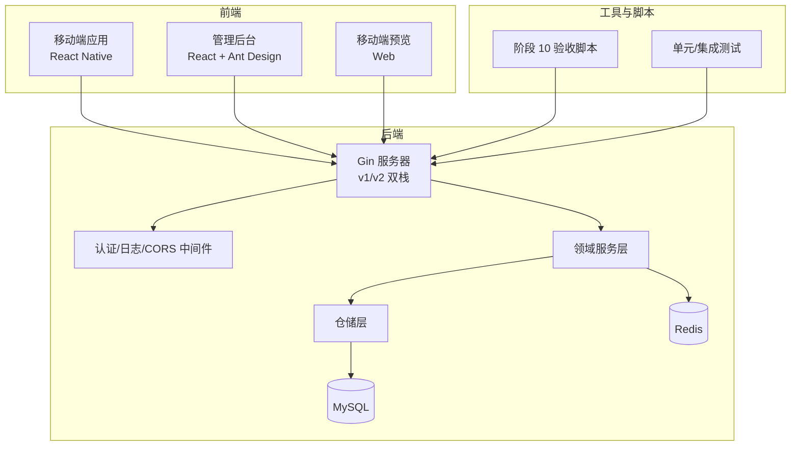
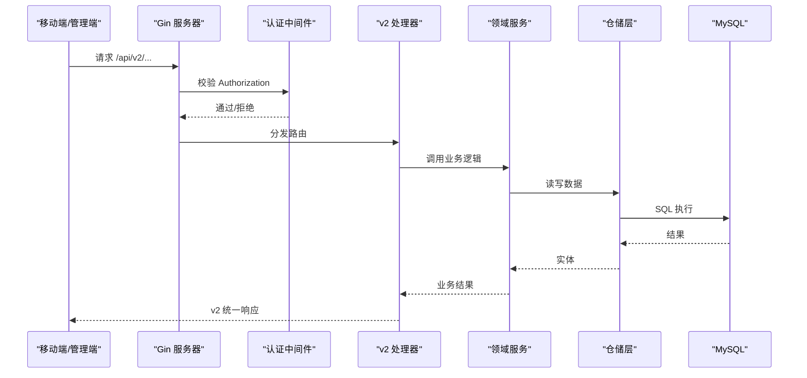
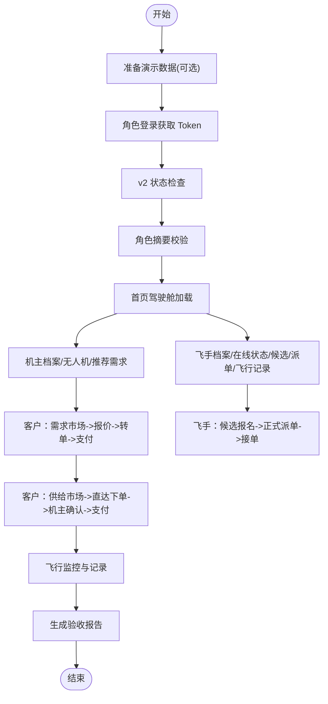
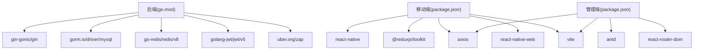

# 重构质量保证

<cite>
**本文引用的文件**
- [REFACTOR_MASTER_TASKLIST.md](file://REFACTOR_MASTER_TASKLIST.md)
- [TEST_CHECKLIST.md](file://TEST_CHECKLIST.md)
- [MOBILE_REGRESSION_ACCEPTANCE.md](file://MOBILE_REGRESSION_ACCEPTANCE.md)
- [README.md](file://README.md)
- [backend/go.mod](file://backend/go.mod)
- [mobile/package.json](file://mobile/package.json)
- [admin/package.json](file://admin/package.json)
- [backend/cmd/server/main.go](file://backend/cmd/server/main.go)
- [mobile/src/services/api.ts](file://mobile/src/services/api.ts)
- [admin/src/services/api.ts](file://admin/src/services/api.ts)
- [backend/internal/api/middleware/auth.go](file://backend/internal/api/middleware/auth.go)
- [backend/internal/api/middleware/pagination_test.go](file://backend/internal/api/middleware/pagination_test.go)
- [backend/internal/pkg/response/v2_test.go](file://backend/internal/pkg/response/v2_test.go)
- [backend/scripts/phase10_role_acceptance.sh](file://backend/scripts/phase10_role_acceptance.sh)
</cite>

## 目录
1. [引言](#引言)
2. [项目结构](#项目结构)
3. [核心组件](#核心组件)
4. [架构概览](#架构概览)
5. [详细组件分析](#详细组件分析)
6. [依赖分析](#依赖分析)
7. [性能考虑](#性能考虑)
8. [故障排除指南](#故障排除指南)
9. [结论](#结论)
10. [附录](#附录)

## 引言
本文件面向无人机租赁平台的重构质量保证工作，系统化阐述质量控制标准、代码审查流程、测试策略与验收规范，确保重构过程中的代码质量、性能指标与安全性要求得到持续保障。文档结合项目现有的任务总表、测试清单、回归验收标准与自动化脚本，构建从阶段划分到验收闭环的质量管理体系。

## 项目结构
项目采用前后端分离与多端协同的架构：
- 后端（Go）：提供 v1/v2 双栈 API、领域服务、中间件与基础设施服务
- 移动端（React Native）：Web 预览与移动端应用，接入 v2 API
- 管理后台（React + Ant Design）：基于 v2 API 的运营管理系统
- 自动化脚本：阶段 10 角色验收与回归测试

图表来源
- [backend/cmd/server/main.go:249-266](file://backend/cmd/server/main.go#L249-L266)
- [mobile/src/services/api.ts:1-155](file://mobile/src/services/api.ts#L1-L155)
- [admin/src/services/api.ts:1-402](file://admin/src/services/api.ts#L1-L402)

章节来源
- [README.md:1-29](file://README.md#L1-L29)
- [backend/cmd/server/main.go:249-266](file://backend/cmd/server/main.go#L249-L266)

## 核心组件
- 重构任务总表：定义阶段、任务、验收标准与依赖关系，形成可追踪的执行清单
- 测试清单：覆盖 v2 主链路与历史功能的手动测试项，指导验收与回归
- 移动端回归验收：针对关键页面的截图验收标准，确保对象边界、状态一致性与入口完整性
- 自动化验收脚本：阶段 10 的角色视角主链路自动化验收，输出可追溯的报告
- 前端 API 客户端：v1/v2 双栈客户端与拦截器，统一鉴权与错误处理
- 后端中间件与响应封装：认证、CORS、日志、分页与 v2 统一响应结构

章节来源
- [REFACTOR_MASTER_TASKLIST.md:1-512](file://REFACTOR_MASTER_TASKLIST.md#L1-L512)
- [TEST_CHECKLIST.md:1-448](file://TEST_CHECKLIST.md#L1-L448)
- [MOBILE_REGRESSION_ACCEPTANCE.md:1-337](file://MOBILE_REGRESSION_ACCEPTANCE.md#L1-L337)
- [backend/scripts/phase10_role_acceptance.sh:1-606](file://backend/scripts/phase10_role_acceptance.sh#L1-L606)
- [mobile/src/services/api.ts:1-155](file://mobile/src/services/api.ts#L1-L155)
- [admin/src/services/api.ts:1-402](file://admin/src/services/api.ts#L1-L402)

## 架构概览
重构质量保证贯穿以下关键路径：
- 任务驱动：以任务总表为唯一执行依据，每完成一项即回写并同步更新相关文档
- 双栈并行：v1 保持兼容，v2 逐步切流，通过脚本与中间件实现平滑过渡
- 统一响应：v2 采用统一响应结构与错误码，便于前端拦截与统一处理
- 安全与可观测：认证中间件支持黑名单、CORS 与日志中间件，配合 trace_id 追踪

图表来源
- [backend/cmd/server/main.go:249-266](file://backend/cmd/server/main.go#L249-L266)
- [backend/internal/api/middleware/auth.go:22-61](file://backend/internal/api/middleware/auth.go#L22-L61)
- [mobile/src/services/api.ts:66-152](file://mobile/src/services/api.ts#L66-L152)

## 详细组件分析

### 重构任务总表与质量门禁
- 任务状态：统一使用勾选标记，完成需通过验收标准方可勾选
- 依赖管理：任务间依赖关系明确，变更需先更新业务文档再更新任务总表
- 阶段复杂度：涵盖数据库重建、领域服务重构、API v2 实现、移动端重构、后台适配、数据迁移与切流、测试验收等
- 基线与冻结：阶段 0 完成业务基线与冻结，确保后续重构有据可依

章节来源
- [REFACTOR_MASTER_TASKLIST.md:18-26](file://REFACTOR_MASTER_TASKLIST.md#L18-L26)
- [REFACTOR_MASTER_TASKLIST.md:38-52](file://REFACTOR_MASTER_TASKLIST.md#L38-L52)
- [REFACTOR_MASTER_TASKLIST.md:497-503](file://REFACTOR_MASTER_TASKLIST.md#L497-L503)

### 测试策略与验收标准
- v2 验收基线：阶段 10 启动，以自动化脚本与回归清单为主
- 手动测试清单：覆盖认证、无人机、飞手、业主/客户、智能派单、订单执行、支付结算、信用评价、保险理赔、数据分析、空域管理等模块
- 移动端回归：关键页面的截图验收标准，强调对象边界、角色入口、状态一致性与布局完整性
- 自动化验收脚本：角色视角主链路自动化，输出可追溯报告，包含账户、需求、报价、订单、派单、供给等关键对象

章节来源
- [TEST_CHECKLIST.md:5-41](file://TEST_CHECKLIST.md#L5-L41)
- [TEST_CHECKLIST.md:44-60](file://TEST_CHECKLIST.md#L44-L60)
- [MOBILE_REGRESSION_ACCEPTANCE.md:3-13](file://MOBILE_REGRESSION_ACCEPTANCE.md#L3-L13)
- [MOBILE_REGRESSION_ACCEPTANCE.md:47-46](file://MOBILE_REGRESSION_ACCEPTANCE.md#L47-L46)
- [backend/scripts/phase10_role_acceptance.sh:422-606](file://backend/scripts/phase10_role_acceptance.sh#L422-L606)

### 前端 API 客户端与拦截器
- 双栈客户端：v1/v2 基础地址分离，统一请求头与超时配置
- 鉴权拦截：自动注入 Bearer Token，支持并发刷新与重试
- 业务拦截：根据 v1/v2 成功码解析响应，统一错误提示
- 管理端适配：后台使用本地存储管理 token，支持刷新与登出

章节来源
- [mobile/src/services/api.ts:6-155](file://mobile/src/services/api.ts#L6-L155)
- [admin/src/services/api.ts:15-139](file://admin/src/services/api.ts#L15-L139)

### 后端中间件与安全控制
- 认证中间件：校验 Authorization 头格式、解析 JWT、黑名单检查、注入用户上下文
- 管理端中间件：限制 admin 角色访问
- 统一响应：v1/v2 错误码与响应结构差异，v2 使用 OK 状态码与 trace_id
- 分页中间件：默认值与上限控制，避免过大页大小

章节来源
- [backend/internal/api/middleware/auth.go:22-106](file://backend/internal/api/middleware/auth.go#L22-L106)
- [backend/internal/api/middleware/pagination_test.go:11-42](file://backend/internal/api/middleware/pagination_test.go#L11-L42)
- [backend/internal/pkg/response/v2_test.go:12-80](file://backend/internal/pkg/response/v2_test.go#L12-L80)

### 自动化验收与回归流程

图表来源
- [backend/scripts/phase10_role_acceptance.sh:422-606](file://backend/scripts/phase10_role_acceptance.sh#L422-L606)

## 依赖分析
- 后端依赖：Gin、MySQL、Redis、JWT、Zap 日志、Viper 配置等
- 移动端依赖：React、React Native、Redux Toolkit、Axios、React Navigation、Vite 等
- 管理端依赖：Ant Design、Axios、React Router、Vite、TypeScript 等

图表来源
- [backend/go.mod:5-21](file://backend/go.mod#L5-L21)
- [mobile/package.json:14-35](file://mobile/package.json#L14-L35)
- [admin/package.json:14-24](file://admin/package.json#L14-L24)

章节来源
- [backend/go.mod:1-80](file://backend/go.mod#L1-L80)
- [mobile/package.json:1-64](file://mobile/package.json#L1-L64)
- [admin/package.json:1-33](file://admin/package.json#L1-L33)

## 性能考虑
- 服务端性能
  - 连接池配置：最大空闲连接数与最大打开连接数，避免连接争用
  - 字符集设置：显式设置 utf8mb4，减少字符集转换开销
  - 日志级别：生产模式使用 zap 生产日志，降低 IO 压力
- 客户端性能
  - v2 API 优先：移动端与管理端默认走 v2，减少兼容分支
  - 并发刷新：统一的 token 刷新队列，避免并发刷新导致的请求风暴
  - 超时与重试：合理超时与重试策略，提升弱网体验
- 测试与回归
  - 自动化验收脚本：快速验证主链路，减少人工回归成本
  - 截图验收：统一标准，避免 UI 变更导致的回归遗漏

章节来源
- [backend/cmd/server/main.go:268-292](file://backend/cmd/server/main.go#L268-L292)
- [mobile/src/services/api.ts:32-47](file://mobile/src/services/api.ts#L32-L47)
- [MOBILE_REGRESSION_ACCEPTANCE.md:35-46](file://MOBILE_REGRESSION_ACCEPTANCE.md#L35-L46)

## 故障排除指南
- 401 未授权
  - 检查 Authorization 头格式与 Token 是否过期
  - 管理端检查本地存储的 admin_token 与 admin_refresh_token
- 403 禁止访问
  - 确认用户角色为 admin
- v2 响应异常
  - 检查响应 code 是否为 OK，错误信息是否包含 trace_id
- 数据库连接失败
  - 检查 MySQL 容器状态与配置文件
- Redis 连接失败
  - 检查 Redis 容器状态与连接参数

章节来源
- [backend/internal/api/middleware/auth.go:75-89](file://backend/internal/api/middleware/auth.go#L75-L89)
- [admin/src/services/api.ts:77-133](file://admin/src/services/api.ts#L77-L133)
- [TEST_CHECKLIST.md:431-448](file://TEST_CHECKLIST.md#L431-L448)

## 结论
通过任务总表驱动、v2 主链路自动化验收、移动端回归截图标准与统一的前端拦截器，本项目建立了从阶段划分到验收闭环的质量保证体系。建议在后续迭代中持续完善自动化测试覆盖率、性能基准测试与安全扫描，确保重构成果的长期可维护性与稳定性。

## 附录

### 质量检查清单（模板）
- 任务完成标记与文档同步
- 依赖关系验证与回滚预案
- v2 API 响应一致性检查
- 移动端关键页面截图验收
- 自动化验收脚本运行与报告归档
- 安全与日志中间件验证
- 数据库迁移与双读校验

章节来源
- [REFACTOR_MASTER_TASKLIST.md:18-26](file://REFACTOR_MASTER_TASKLIST.md#L18-L26)
- [MOBILE_REGRESSION_ACCEPTANCE.md:272-284](file://MOBILE_REGRESSION_ACCEPTANCE.md#L272-L284)
- [backend/scripts/phase10_role_acceptance.sh:569-600](file://backend/scripts/phase10_role_acceptance.sh#L569-L600)