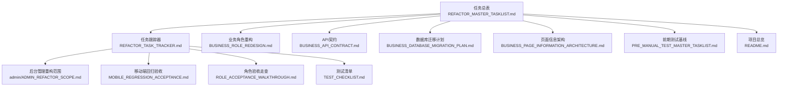
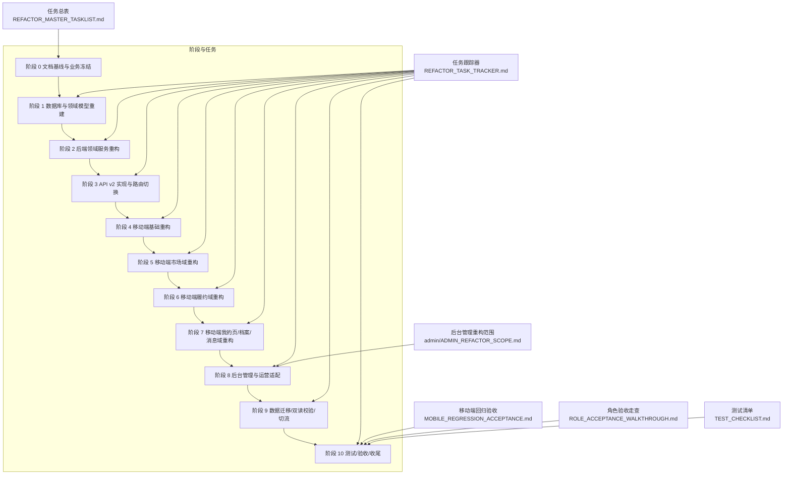
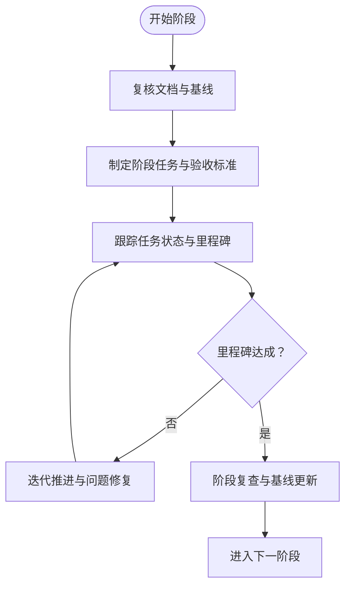
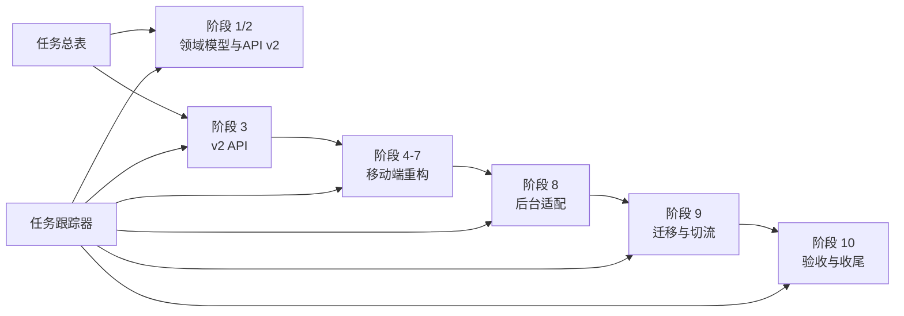

# 重构进度跟踪

<cite>
**本文引用的文件**
- [REFACTOR_MASTER_TASKLIST.md](file://REFACTOR_MASTER_TASKLIST.md)
- [REFACTOR_TASK_TRACKER.md](file://REFACTOR_TASK_TRACKER.md)
- [ADMIN_REFACTOR_SCOPE.md](file://admin/ADMIN_REFACTOR_SCOPE.md)
- [BUSINESS_ROLE_REDESIGN.md](file://BUSINESS_ROLE_REDESIGN.md)
- [BUSINESS_API_CONTRACT.md](file://BUSINESS_API_CONTRACT.md)
- [BUSINESS_DATABASE_MIGRATION_PLAN.md](file://BUSINESS_DATABASE_MIGRATION_PLAN.md)
- [BUSINESS_PAGE_INFORMATION_ARCHITECTURE.md](file://BUSINESS_PAGE_INFORMATION_ARCHITECTURE.md)
- [MOBILE_REGRESSION_ACCEPTANCE.md](file://MOBILE_REGRESSION_ACCEPTANCE.md)
- [ROLE_ACCEPTANCE_WALKTHROUGH.md](file://ROLE_ACCEPTANCE_WALKTHROUGH.md)
- [TEST_CHECKLIST.md](file://TEST_CHECKLIST.md)
- [PRE_MANUAL_TEST_MASTER_TASKLIST.md](file://PRE_MANUAL_TEST_MASTER_TASKLIST.md)
- [README.md](file://README.md)
</cite>

## 目录
1. [简介](#简介)
2. [项目结构](#项目结构)
3. [核心组件](#核心组件)
4. [架构总览](#架构总览)
5. [详细组件分析](#详细组件分析)
6. [依赖分析](#依赖分析)
7. [性能考虑](#性能考虑)
8. [故障排查指南](#故障排查指南)
9. [结论](#结论)
10. [附录](#附录)

## 简介
本文件面向“无人机租赁平台”的重构进度跟踪，围绕“重构任务跟踪器”与“重构任务总表”两大核心资产，系统化说明如何使用任务状态更新、里程碑达成、关键节点检查来监控重构进度；解释进度可视化方法（甘特图）、风险预警机制；提供进度报告模板（周报/月报）、关键指标计算方法；并给出进度偏差分析、资源调整建议与延期处理流程。文档同时结合后台管理端适配、移动端回归与角色验收等阶段性成果，帮助跨团队协同推进重构。

## 项目结构
重构相关的文档与资产分布如下：
- 任务总表与跟踪器：REFACTOR_MASTER_TASKLIST.md、REFACTOR_TASK_TRACKER.md
- 业务与技术基线：BUSINESS_ROLE_REDESIGN.md、BUSINESS_API_CONTRACT.md、BUSINESS_DATABASE_MIGRATION_PLAN.md、BUSINESS_PAGE_INFORMATION_ARCHITECTURE.md
- 验收与回归：MOBILE_REGRESSION_ACCEPTANCE.md、ROLE_ACCEPTANCE_WALKTHROUGH.md、TEST_CHECKLIST.md
- 管理后台适配：admin/ADMIN_REFACTOR_SCOPE.md
- 前期测试与基线：PRE_MANUAL_TEST_MASTER_TASKLIST.md
- 项目总览：README.md

图表来源
- [REFACTOR_MASTER_TASKLIST.md](file://REFACTOR_MASTER_TASKLIST.md)
- [REFACTOR_TASK_TRACKER.md](file://REFACTOR_TASK_TRACKER.md)
- [ADMIN_REFACTOR_SCOPE.md](file://admin/ADMIN_REFACTOR_SCOPE.md)
- [MOBILE_REGRESSION_ACCEPTANCE.md](file://MOBILE_REGRESSION_ACCEPTANCE.md)
- [ROLE_ACCEPTANCE_WALKTHROUGH.md](file://ROLE_ACCEPTANCE_WALKTHROUGH.md)
- [TEST_CHECKLIST.md](file://TEST_CHECKLIST.md)
- [PRE_MANUAL_TEST_MASTER_TASKLIST.md](file://PRE_MANUAL_TEST_MASTER_TASKLIST.md)
- [README.md](file://README.md)

章节来源
- [README.md:1-29](file://README.md#L1-L29)
- [REFACTOR_MASTER_TASKLIST.md:1-512](file://REFACTOR_MASTER_TASKLIST.md#L1-L512)
- [REFACTOR_TASK_TRACKER.md:1-1047](file://REFACTOR_TASK_TRACKER.md#L1-L1047)

## 核心组件
- 重构任务总表：定义阶段、任务、验收标准、依赖关系与完成标记，作为唯一执行清单与可追踪资产。
- 重构任务跟踪器：记录差异分析、模块任务、状态、交付物、API清单、移动端适配与更新日志，支撑进度可视化与风险预警。
- 后台管理重构范围：明确后台菜单与页面对象对齐新业务模型的要求。
- 验收与回归：移动端回归矩阵、角色验收脚本与报告、测试清单，保障阶段 10 验收质量。
- 前期测试基线：手工测试前的自动化检查与阶段性状态标记，降低手工测试阻塞。

章节来源
- [REFACTOR_MASTER_TASKLIST.md:18-27](file://REFACTOR_MASTER_TASKLIST.md#L18-L27)
- [REFACTOR_TASK_TRACKER.md:5-42](file://REFACTOR_TASK_TRACKER.md#L5-L42)
- [ADMIN_REFACTOR_SCOPE.md:1-11](file://admin/ADMIN_REFACTOR_SCOPE.md#L1-L11)
- [MOBILE_REGRESSION_ACCEPTANCE.md:1-13](file://MOBILE_REGRESSION_ACCEPTANCE.md#L1-L13)
- [ROLE_ACCEPTANCE_WALKTHROUGH.md:1-18](file://ROLE_ACCEPTANCE_WALKTHROUGH.md#L1-L18)
- [TEST_CHECKLIST.md:1-41](file://TEST_CHECKLIST.md#L1-L41)
- [PRE_MANUAL_TEST_MASTER_TASKLIST.md:14-23](file://PRE_MANUAL_TEST_MASTER_TASKLIST.md#L14-L23)

## 架构总览
重构采用“文档基线—领域模型—API v2—前端域重构—后台适配—迁移与切流—验收收尾”的阶段化推进路径。任务总表与任务跟踪器共同驱动阶段演进，后台管理与移动端分别按对象模型对齐，迁移与双读校验保障数据一致性，最终以角色验收与移动端回归收口。

图表来源
- [REFACTOR_MASTER_TASKLIST.md:54-512](file://REFACTOR_MASTER_TASKLIST.md#L54-L512)
- [REFACTOR_TASK_TRACKER.md:44-201](file://REFACTOR_TASK_TRACKER.md#L44-L201)
- [ADMIN_REFACTOR_SCOPE.md:77-227](file://admin/ADMIN_REFACTOR_SCOPE.md#L77-L227)
- [MOBILE_REGRESSION_ACCEPTANCE.md:47-200](file://MOBILE_REGRESSION_ACCEPTANCE.md#L47-L200)
- [ROLE_ACCEPTANCE_WALKTHROUGH.md:44-200](file://ROLE_ACCEPTANCE_WALKTHROUGH.md#L44-L200)
- [TEST_CHECKLIST.md:25-41](file://TEST_CHECKLIST.md#L25-L41)

## 详细组件分析

### 任务状态更新与里程碑达成
- 状态标记规范：统一使用“未开始/进行中/已完成/发现问题”等标记，确保跨团队一致理解。
- 里程碑节点：以阶段为单位，阶段内关键任务完成即视为里程碑达成；阶段末进行阶段性复查与基线更新。
- 完成回写：每完成一项任务，需在任务总表勾选并在被影响文档、接口文档、测试清单同步更新。

章节来源
- [REFACTOR_MASTER_TASKLIST.md:18-27](file://REFACTOR_MASTER_TASKLIST.md#L18-L27)
- [PRE_MANUAL_TEST_MASTER_TASKLIST.md:14-23](file://PRE_MANUAL_TEST_MASTER_TASKLIST.md#L14-L23)

### 关键节点检查
- 阶段 1/2：锁定领域模型与状态机，确保 v1/v2 差异边界清晰。
- 阶段 3：v2 API 可联调，路由与响应结构统一。
- 阶段 4-7：按页面域分批切移动端，确保对象边界与状态一致。
- 阶段 8：后台按新对象模型重排菜单与页面。
- 阶段 9：双读校验、迁移审计、切流与冻结写入。
- 阶段 10：单元/集成测试、移动端回归、角色验收与收尾。

章节来源
- [REFACTOR_MASTER_TASKLIST.md:497-503](file://REFACTOR_MASTER_TASKLIST.md#L497-L503)
- [REFACTOR_TASK_TRACKER.md:201-296](file://REFACTOR_TASK_TRACKER.md#L201-L296)
- [ADMIN_REFACTOR_SCOPE.md:77-93](file://admin/ADMIN_REFACTOR_SCOPE.md#L77-L93)

### 进度可视化与甘特图
- 甘特图建议维度：阶段、任务、负责人、计划开始/结束、实际开始/结束、状态、依赖、风险。
- 数据来源：任务总表的任务计划与完成标记、任务跟踪器的交付物与API清单、后台范围与移动端页面清单。
- 可视化要点：突出关键路径（v2 API、迁移脚本、移动端主链路）、风险节点（重载准入、双读校验、切流）。

```mermaid
gantt
title 重构进度甘特图示意
dateFormat X
axisFormat %Y-%m-%d
section 阶段 0
文档基线与业务冻结 :milestone, 2026-03-01, 0d
section 阶段 1
数据库与领域模型重建 :2026-03-01, 2026-03-10
section 阶段 2
后端领域服务重构 :2026-03-11, 2026-03-20
section 阶段 3
API v2 实现与路由切换 :2026-03-21, 2026-03-30
section 阶段 4-7
移动端域重构 :2026-03-31, 2026-04-20
section 阶段 8
后台管理与运营适配 :2026-04-21, 2026-04-30
section 阶段 9
数据迁移/双读校验/切流 :2026-05-01, 2026-05-15
section 阶段 10
测试/验收/收尾 :2026-05-16, 2026-05-31
```

图表来源
- [REFACTOR_MASTER_TASKLIST.md:54-512](file://REFACTOR_MASTER_TASKLIST.md#L54-L512)
- [REFACTOR_TASK_TRACKER.md:44-201](file://REFACTOR_TASK_TRACKER.md#L44-L201)

### 风险预警机制
- 风险识别：v1/v2 并存、API v2 未实现端点、重载准入数据缺失、Web/RN 双入口断链、Token/并发状态回退。
- 预警触发：静态残留扫描、编译/构建失败、路由断链、接口异常、状态错乱、依赖缺失。
- 处置流程：记录现象/影响/定位线索/修复建议/是否阻塞；优先修复可安全修复问题，无法当轮修复的问题需明确记录与升级。

章节来源
- [PRE_MANUAL_TEST_MASTER_TASKLIST.md:70-78](file://PRE_MANUAL_TEST_MASTER_TASKLIST.md#L70-L78)
- [REFACTOR_TASK_TRACKER.md:18-42](file://REFACTOR_TASK_TRACKER.md#L18-L42)

### 进度报告模板（周报/月报）
- 周报/月报模板要素：
  - 本周/本月完成任务清单与完成率
  - 里程碑达成情况与延迟任务
  - 关键指标（任务完成率、缺陷密度、阻塞问题数）
  - 风险与应对措施
  - 下一步计划与资源需求
- 关键指标计算：
  - 任务完成率 = 已完成任务数 / 总任务数 × 100%
  - 阻塞问题数 = 未关闭阻塞问题数
  - 缺陷密度 = 缺陷总数 / 代码行数（可选）

章节来源
- [PRE_MANUAL_TEST_MASTER_TASKLIST.md:14-23](file://PRE_MANUAL_TEST_MASTER_TASKLIST.md#L14-L23)
- [TEST_CHECKLIST.md:25-41](file://TEST_CHECKLIST.md#L25-L41)

### 进度偏差分析与资源调整
- 偏差识别：计划完成时间 vs 实际完成时间、任务依赖未满足、风险未及时暴露。
- 分析方法：对比甘特图与任务跟踪器，定位关键路径偏差；结合验收与回归结果评估质量偏差。
- 调整建议：优先保障v2 API与迁移脚本；必要时调整阶段顺序或延长关键路径；加强静态检查与自动化验收。

章节来源
- [REFACTOR_MASTER_TASKLIST.md:497-503](file://REFACTOR_MASTER_TASKLIST.md#L497-L503)
- [REFACTOR_TASK_TRACKER.md:201-296](file://REFACTOR_TASK_TRACKER.md#L201-L296)

### 延期处理流程
- 发现延期：任务跟踪器标注“延期”与原因；在周报/月报中同步。
- 评估与升级：评估对下游任务的影响与风险，必要时升级到项目管理委员会。
- 重新排期：调整关键路径任务的计划时间与资源；更新甘特图与里程碑。
- 跟踪与复盘：持续跟踪延期任务进展，阶段结束后进行复盘与改进。

章节来源
- [PRE_MANUAL_TEST_MASTER_TASKLIST.md:14-23](file://PRE_MANUAL_TEST_MASTER_TASKLIST.md#L14-L23)
- [REFACTOR_TASK_TRACKER.md:1024-1047](file://REFACTOR_TASK_TRACKER.md#L1024-L1047)

## 依赖分析
- 任务耦合：阶段 1/2 锁定领域模型与状态机，为阶段 3 的 API v2 提供基础；阶段 4-7 的移动端重构依赖 v2 接口；阶段 8 的后台适配依赖新对象模型；阶段 9 的迁移与切流依赖阶段 3-7 的完成度。
- 外部依赖：MySQL/Redis、短信模板、UOM 平台对接（待授权）。
- 潜在循环依赖：后台页面与后端接口应避免相互依赖，建议通过“后台全局读取接口”隔离。

图表来源
- [REFACTOR_MASTER_TASKLIST.md:54-512](file://REFACTOR_MASTER_TASKLIST.md#L54-L512)
- [REFACTOR_TASK_TRACKER.md:44-201](file://REFACTOR_TASK_TRACKER.md#L44-L201)

章节来源
- [REFACTOR_MASTER_TASKLIST.md:497-503](file://REFACTOR_MASTER_TASKLIST.md#L497-L503)
- [ADMIN_REFACTOR_SCOPE.md:199-227](file://admin/ADMIN_REFACTOR_SCOPE.md#L199-L227)

## 性能考虑
- 任务跟踪器与总表的维护成本：统一标记与回写流程可显著降低沟通成本，建议纳入CI/PR检查项。
- 验收与回归效率：阶段 10 的自动角色验收与移动端回归矩阵可大幅缩短手工测试周期。
- 迁移与双读校验：在阶段 9 引入双读校验工具，有助于早期发现数据不一致问题，降低后期返工。

章节来源
- [MOBILE_REGRESSION_ACCEPTANCE.md:23-34](file://MOBILE_REGRESSION_ACCEPTANCE.md#L23-L34)
- [ROLE_ACCEPTANCE_WALKTHROUGH.md:128-146](file://ROLE_ACCEPTANCE_WALKTHROUGH.md#L128-L146)
- [REFACTOR_TASK_TRACKER.md:453-458](file://REFACTOR_TASK_TRACKER.md#L453-L458)

## 故障排查指南
- 常见问题与定位：
  - v1/v2 并存导致页面入口可见但动作不可执行：检查路由与服务端实现。
  - 重载准入数据缺失导致供给/报价链路断裂：补齐 mtow_kg/max_payload_kg/certification。
  - Web/RN 双入口断链：检查导航参数、页面路由与 Web 包装器。
  - Token/并发状态回退：检查并发刷新与状态同步逻辑。
- 处理流程：记录现象与影响 → 定位线索 → 修复建议 → 修复与复验 → 关闭问题。

章节来源
- [PRE_MANUAL_TEST_MASTER_TASKLIST.md:70-78](file://PRE_MANUAL_TEST_MASTER_TASKLIST.md#L70-L78)
- [ROLE_ACCEPTANCE_WALKTHROUGH.md:90-109](file://ROLE_ACCEPTANCE_WALKTHROUGH.md#L90-L109)

## 结论
通过任务总表与任务跟踪器的协同，结合后台管理与移动端的领域对齐、迁移与双读校验、以及阶段 10 的自动验收与回归矩阵，重构进度可实现可视化、可量化、可预警与可追溯。建议持续完善甘特图与关键指标，强化静态检查与自动化验收，确保在阶段 9/10 高效完成数据切流与收尾。

## 附录
- 任务总表与跟踪器的使用建议：每周/每月更新任务状态与里程碑，定期复盘关键路径与风险。
- 验收与回归：优先执行自动验收与移动端回归矩阵，再进行手工测试补充。
- 文档与资产：所有任务完成需同步更新被影响文档、接口文档与测试清单，确保资产一致性。