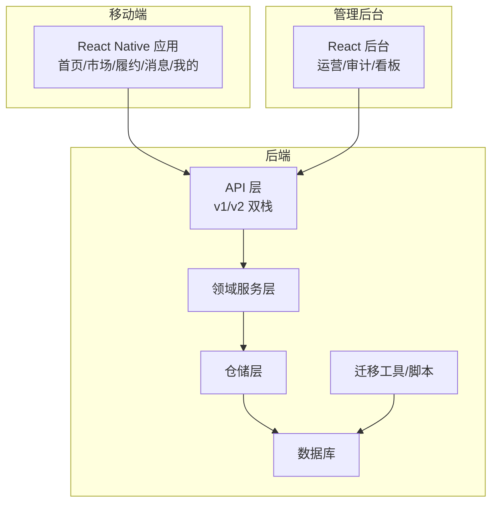
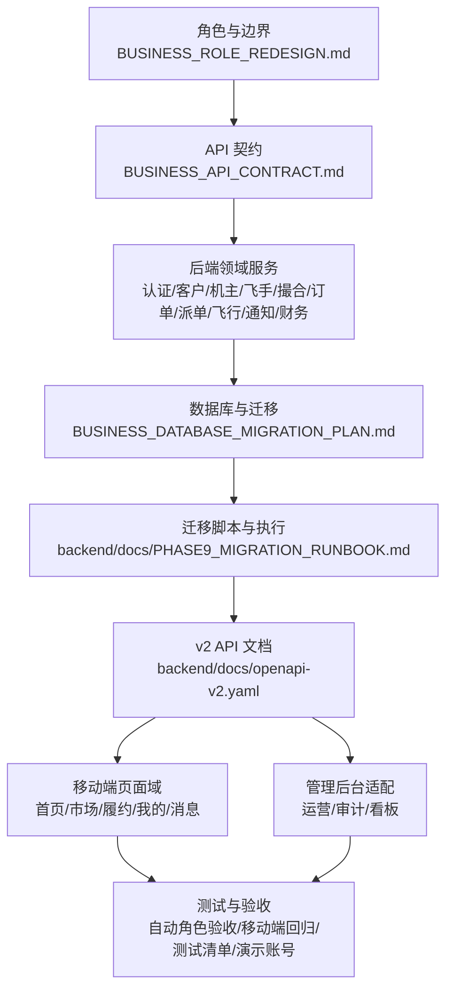
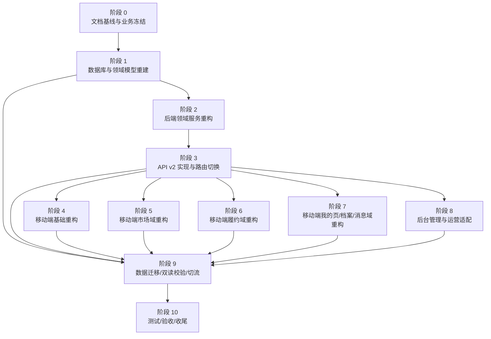

# 重构阶段规划

<cite>
**本文引用的文件**
- [REFACTOR_MASTER_TASKLIST.md](file://REFACTOR_MASTER_TASKLIST.md)
- [BUSINESS_ROLE_REDESIGN.md](file://BUSINESS_ROLE_REDESIGN.md)
- [BUSINESS_DATABASE_MIGRATION_PLAN.md](file://BUSINESS_DATABASE_MIGRATION_PLAN.md)
- [BUSINESS_API_CONTRACT.md](file://BUSINESS_API_CONTRACT.md)
- [README.md](file://README.md)
- [MOBILE_REGRESSION_ACCEPTANCE.md](file://MOBILE_REGRESSION_ACCEPTANCE.md)
- [ROLE_ACCEPTANCE_WALKTHROUGH.md](file://ROLE_ACCEPTANCE_WALKTHROUGH.md)
- [TEST_CHECKLIST.md](file://TEST_CHECKLIST.md)
- [DEPLOY_CHECKLIST.md](file://DEPLOY_CHECKLIST.md)
- [backend/docs/PHASE9_MIGRATION_RUNBOOK.md](file://backend/docs/PHASE9_MIGRATION_RUNBOOK.md)
- [backend/docs/API_V1_V2_DIFF.md](file://backend/docs/API_V1_V2_DIFF.md)
- [backend/docs/openapi-v2.yaml](file://backend/docs/openapi-v2.yaml)
- [backend/scripts/phase10_role_acceptance.sh](file://backend/scripts/phase10_role_acceptance.sh)
- [admin/ADMIN_REFACTOR_SCOPE.md](file://admin/ADMIN_REFACTOR_SCOPE.md)
</cite>

## 目录
1. [简介](#简介)
2. [项目结构](#项目结构)
3. [核心组件](#核心组件)
4. [架构总览](#架构总览)
5. [详细阶段分析](#详细阶段分析)
6. [依赖关系分析](#依赖关系分析)
7. [性能考虑](#性能考虑)
8. [故障排查指南](#故障排查指南)
9. [结论](#结论)
10. [附录](#附录)

## 简介
本文件基于仓库内的重构总表与业务文档，系统化梳理无人机租赁平台的重构阶段规划，明确各阶段目标、范围、时间安排、资源配置、阶段间依赖与并行策略、风险控制、交付物与里程碑检查点、关键成功因素、阶段切换标准、验收流程与总结报告，以及阶段衔接与风险调整方法。目标是为跨团队协作提供统一的执行蓝图，确保从数据库与领域模型重建到移动端与后台适配、再到数据迁移与切流、最终测试验收与收尾的全流程可控、可追踪、可回溯。

## 项目结构
项目采用前后端分离与多端并行的架构：
- 后端（Go）：提供 v1/v2 双栈 API，包含领域服务、仓储、中间件、响应封装、定时任务与迁移工具。
- 移动端（React Native）：按“首页/市场/履约/消息/我的”四大页面域重构，接入 v2 API。
- 管理后台（React）：适配新角色模型与业务对象，提供迁移审计与运营看板。
- 迁移与文档：数据库迁移脚本、迁移执行说明、API v2 文档与差异对照。

图表来源
- [README.md: 9-13:9-13](file://README.md#L9-L13)
- [backend/docs/openapi-v2.yaml](file://backend/docs/openapi-v2.yaml)
- [backend/docs/API_V1_V2_DIFF.md](file://backend/docs/API_V1_V2_DIFF.md)

章节来源
- [README.md: 1-29:1-29](file://README.md#L1-L29)

## 核心组件
- 重构总表：统一的执行清单与状态跟踪，明确各阶段任务、依赖与验收标准。
- 业务设计文档：角色与边界、页面信息架构、API 契约、数据库迁移方案。
- 后端服务：认证与初始化、客户/机主/飞手域服务、撮合、订单、派单、飞行、通知与事件、财务与结算。
- 前端页面：首页驾驶舱、市场域（供给/需求）、履约域（订单/派单/飞行）、我的页与档案、消息。
- 管理后台：角色模型适配、运营看板、迁移审计。
- 迁移与切流：结构迁移、数据回填、双读校验、切流与冻结 v1 写入。
- 测试与验收：自动角色验收脚本、移动端回归与截图验收、测试清单、演示账号。

章节来源
- [REFACTOR_MASTER_TASKLIST.md: 15-512:15-512](file://REFACTOR_MASTER_TASKLIST.md#L15-L512)
- [BUSINESS_ROLE_REDESIGN.md: 1-800:1-800](file://BUSINESS_ROLE_REDESIGN.md#L1-L800)
- [BUSINESS_API_CONTRACT.md: 1-800:1-800](file://BUSINESS_API_CONTRACT.md#L1-L800)
- [BUSINESS_DATABASE_MIGRATION_PLAN.md: 1-550:1-550](file://BUSINESS_DATABASE_MIGRATION_PLAN.md#L1-L550)

## 架构总览
重构以“v2 业务模型”为核心，贯穿以下主线：
- 业务对象：需求、供给、订单、正式派单、飞行记录。
- 角色与能力：客户/机主/飞手/复合身份，以“账号 + 能力档案 + 业务关系”判定。
- 数据库与领域模型：分层清晰、来源可追溯、准入门槛落地。
- API v2：统一响应结构、分页、错误码、版本隔离与路由切换。
- 前后端并行：移动端与后台按域分批切 v2，迁移期双读校验，最终冻结 v1 写入。
- 测试与验收：自动验收、回归截图、演示账号与文档对齐。

图表来源
- [BUSINESS_ROLE_REDESIGN.md: 1-800:1-800](file://BUSINESS_ROLE_REDESIGN.md#L1-L800)
- [BUSINESS_API_CONTRACT.md: 1-800:1-800](file://BUSINESS_API_CONTRACT.md#L1-L800)
- [BUSINESS_DATABASE_MIGRATION_PLAN.md: 1-550:1-550](file://BUSINESS_DATABASE_MIGRATION_PLAN.md#L1-L550)
- [backend/docs/PHASE9_MIGRATION_RUNBOOK.md: 1-121:1-121](file://backend/docs/PHASE9_MIGRATION_RUNBOOK.md#L1-L121)
- [backend/docs/openapi-v2.yaml](file://backend/docs/openapi-v2.yaml)
- [MOBILE_REGRESSION_ACCEPTANCE.md: 1-337:1-337](file://MOBILE_REGRESSION_ACCEPTANCE.md#L1-L337)
- [ROLE_ACCEPTANCE_WALKTHROUGH.md: 1-217:1-217](file://ROLE_ACCEPTANCE_WALKTHROUGH.md#L1-L217)
- [TEST_CHECKLIST.md: 1-448:1-448](file://TEST_CHECKLIST.md#L1-L448)
- [DEPLOY_CHECKLIST.md: 1-303:1-303](file://DEPLOY_CHECKLIST.md#L1-L303)

## 详细阶段分析

### 阶段 0：文档基线与业务冻结
- 目标：统一角色、流程、状态机闭环；统一字段字典与命名；统一页面信息架构；统一 API v2 契约；明确数据库关系与迁移方案；补齐直达下单闭环与平台边界；统一绑定飞手机制；收口需求生命周期；收口订单执行与飞行记录规则；收口价格/结算/评价/地址快照与候选/迁移细则。
- 关键交付物：业务文档对齐、字段字典、页面架构、API v2 契约、数据库迁移方案。
- 验收标准：角色体系、撮合链路、履约链路、候选机制、绑定机制、异常处理、状态机闭环；字段命名、状态枚举、来源追溯统一；页面对象边界明确；API v2 契约完整；数据库关系与迁移方案明确。
- 依赖：无或前置文档。
- 风险控制：确保文档修订与任务清单同步更新，避免“文档滞后”。

章节来源
- [REFACTOR_MASTER_TASKLIST.md: 54-110:54-110](file://REFACTOR_MASTER_TASKLIST.md#L54-L110)
- [BUSINESS_ROLE_REDESIGN.md: 1-800:1-800](file://BUSINESS_ROLE_REDESIGN.md#L1-L800)
- [BUSINESS_API_CONTRACT.md: 1-800:1-800](file://BUSINESS_API_CONTRACT.md#L1-L800)
- [BUSINESS_DATABASE_MIGRATION_PLAN.md: 1-550:1-550](file://BUSINESS_DATABASE_MIGRATION_PLAN.md#L1-L550)

### 阶段 1：数据库与领域模型重建
- 目标：新建三类档案表；重建供给与绑定飞手表；创建需求/报价/候选/匹配日志 v2 表；扩展订单表字段；补齐订单快照/退款/争议表；重定义派单任务与日志；重建飞行记录/位置/告警与订单/派单关联；建立迁移映射与审计表；落地重载准入字段与校验规则。
- 关键交付物：v2 目标表结构、迁移映射与审计表、准入校验落地。
- 验收标准：三类档案表建模完成；供给/绑定飞手/需求/报价/候选/匹配/订单/派单/飞行/财务/争议表结构完整；来源追溯与执行链路可落库；准入门槛统一校验。
- 依赖：阶段 0。
- 风险控制：幂等脚本、可回滚、结构与数据分离；不确定数据进入审计表。

章节来源
- [REFACTOR_MASTER_TASKLIST.md: 111-166:111-166](file://REFACTOR_MASTER_TASKLIST.md#L111-L166)
- [BUSINESS_DATABASE_MIGRATION_PLAN.md: 398-550:398-550](file://BUSINESS_DATABASE_MIGRATION_PLAN.md#L398-L550)

### 阶段 2：后端领域服务重构
- 目标：统一账号与初始化服务（RoleSummary）；客户域（需求创建/详情/转单）；机主域（档案/无人机/供给/绑定飞手/报价）；飞手域（认证/在线状态/候选/派单/飞行聚合）；撮合服务（需求推荐/报价流转/候选池/风险评估）；订单服务（demand_market/supply_direct 两条来源链路）；派单服务（固定调度优先级/自动重派/异常回退）；飞行服务（真实履约数据汇总）；通知与事件服务（需求/报价/订单/派单/资质事件）。
- 关键交付物：v2 领域服务实现、统一响应结构与中间件。
- 验收标准：/api/v2/me 角色摘要可完全由后端计算；需求转单/直达下单/派单重派/飞行统计/退款等关键流程服务层通过；通知入口集中。
- 依赖：阶段 1。
- 风险控制：服务层测试与集成测试覆盖；关键状态推进与日志可追踪。

章节来源
- [REFACTOR_MASTER_TASKLIST.md: 167-222:167-222](file://REFACTOR_MASTER_TASKLIST.md#L167-L222)
- [BUSINESS_API_CONTRACT.md: 265-800:265-800](file://BUSINESS_API_CONTRACT.md#L265-L800)

### 阶段 3：API v2 实现与路由切换
- 目标：建立 /api/v2 路由骨架、统一响应结构、错误码与分页中间件；落地认证与初始化接口；落地客户/机主/飞手/订单/派单/财务/通知相关接口；生成 v2 OpenAPI 文档与 v1/v2 差异对照。
- 关键交付物：v2 路由与 handler 目录、统一响应结构、OpenAPI 文档、v1/v2 差异对照。
- 验收标准：独立 v2 路由与 handler；响应结构与错误格式统一；接口覆盖核心业务对象；开发与联调可直接参考 API 文档。
- 依赖：阶段 2。
- 风险控制：中间件与统一响应结构先行；接口契约与文档同步更新。

章节来源
- [REFACTOR_MASTER_TASKLIST.md: 223-272:223-272](file://REFACTOR_MASTER_TASKLIST.md#L223-L272)
- [BUSINESS_API_CONTRACT.md: 18-112:18-112](file://BUSINESS_API_CONTRACT.md#L18-L112)

### 阶段 4：移动端基础重构
- 目标：接入 RoleSummary 与 v2 API 客户端；一级导航重构为“首页/市场/履约/消息/我的”；建立统一状态徽标/来源标签/卡片组件/空状态组件；清理旧角色切换与首页临时判断逻辑。
- 关键交付物：移动端初始化与导航重构、统一组件库、首页驾驶舱稳定。
- 验收标准：移动端不再用旧 user_type 做角色主判断；首页与我的页能读取统一角色摘要；导航结构稳定。
- 依赖：阶段 3。
- 风险控制：组件库统一、页面入口与状态一致。

章节来源
- [REFACTOR_MASTER_TASKLIST.md: 273-298:273-298](file://REFACTOR_MASTER_TASKLIST.md#L273-L298)

### 阶段 5：移动端市场域重构
- 目标：首页驾驶舱按综合/客户/机主/飞手视图展示优先动作；供给市场/详情/直达下单确认页面；需求市场与详情（机主报价/飞手候选入口）；我的需求/报价/供给页面分离；供给发布与编辑流程对接机主无人机与价格规则。
- 关键交付物：首页驾驶舱、供给/需求/报价/供给发布页面重构。
- 验收标准：首页不截断/不混角色；客户能立刻发需求/看供给；机主能看新需求；飞手能看待接派单；直达下单从提交到机主确认闭环。
- 依赖：阶段 4、阶段 3。
- 风险控制：页面对象边界明确、状态与编号一致。

章节来源
- [REFACTOR_MASTER_TASKLIST.md: 299-330:299-330](file://REFACTOR_MASTER_TASKLIST.md#L299-L330)

### 阶段 6：移动端履约域重构
- 目标：订单列表按“订单”对象展示；订单详情固定展示来源/参与方/执行状态/财务状态/当前派单；直达下单待确认流；派单任务列表与详情只表达正式派单；接通机主发起派单/飞手接收/拒绝/自动重派；飞行监控入口与真实履约飞行数据切换；支付/退款/评价与售后页面。
- 关键交付物：订单/派单/飞行/支付/退款/评价页面重构。
- 验收标准：列表与详情状态一致；订单详情解释清楚“谁承接/谁执行/是否自执行/是否经过派单/来源于需求还是供给”；派单页不再混需求和订单；飞行记录与履约一致。
- 依赖：阶段 3、阶段 4。
- 风险控制：状态推进与日志一致、自动重派与异常回退。

章节来源
- [REFACTOR_MASTER_TASKLIST.md: 331-380:331-380](file://REFACTOR_MASTER_TASKLIST.md#L331-L380)

### 阶段 7：移动端我的页、档案与消息域重构
- 目标：我的首页展示账号卡/身份卡/能力卡/快捷入口；客户档案与地址信息页取消“再次注册为客户”；机主档案/无人机/供给管理入口；飞手档案/认证/在线状态与可服务区域设置；绑定飞手管理页（邀请/申请/确认/解除）；系统通知与会话消息按业务事件分类。
- 关键交付物：我的页与档案页面重构、绑定飞手管理、通知与消息分类。
- 验收标准：页面不再显示模糊 user_type；能明确看出客户/机主/飞手持有情况与可用能力；绑定关系生命周期完整且不自动赋予执行权限；通知流可区分需求/报价/订单/派单/资质事件。
- 依赖：阶段 3、阶段 4。
- 风险控制：角色摘要驱动页面入口、绑定关系状态机清晰。

章节来源
- [REFACTOR_MASTER_TASKLIST.md: 381-418:381-418](file://REFACTOR_MASTER_TASKLIST.md#L381-L418)

### 阶段 8：后台管理与运营适配
- 目标：梳理后台对新角色模型的适配范围；改造需求/供给/订单/派单/飞行记录管理页；增加迁移审计与异常订单运营看板。
- 关键交付物：后台管理页面适配、迁移审计看板。
- 验收标准：后台可按新对象模型查询/审核/追踪；运营可以看到未迁移成功数据/来源缺失订单/状态异常订单。
- 依赖：阶段 3。
- 风险控制：后台与迁移审计表联动、运营看板可视化。

章节来源
- [REFACTOR_MASTER_TASKLIST.md: 419-438:419-438](file://REFACTOR_MASTER_TASKLIST.md#L419-L438)
- [admin/ADMIN_REFACTOR_SCOPE.md](file://admin/ADMIN_REFACTOR_SCOPE.md)

### 阶段 9：数据迁移、双读校验与切流
- 目标：编写建表迁移脚本（幂等/可回滚/与数据回填分离）；编写历史数据回填脚本；建立双读校验工具；先切移动端到 v2，再切后台到 v2，最后冻结 v1 写入；清理旧 user_type 主判断逻辑/旧订单混合展示逻辑/旧飞手任务兼容逻辑。
- 关键交付物：迁移脚本、双读校验工具、切流与冻结 v1。
- 验收标准：首页/订单列表/派单列表/飞行统计输出新旧对比结果；新页面默认走 v2；旧接口仅保留只读兼容或彻底下线计划；系统主链路不再依赖旧字段和旧页面语义。
- 依赖：阶段 1、阶段 3、阶段 4、阶段 5、阶段 6、阶段 7、阶段 8。
- 风险控制：结构迁移与数据回填分离、回滚策略、迁移审计表与异常订单看板。

章节来源
- [REFACTOR_MASTER_TASKLIST.md: 439-470:439-470](file://REFACTOR_MASTER_TASKLIST.md#L439-L470)
- [BUSINESS_DATABASE_MIGRATION_PLAN.md: 486-550:486-550](file://BUSINESS_DATABASE_MIGRATION_PLAN.md#L486-L550)
- [backend/docs/PHASE9_MIGRATION_RUNBOOK.md: 1-121:1-121](file://backend/docs/PHASE9_MIGRATION_RUNBOOK.md#L1-L121)

### 阶段 10：测试、验收与收尾
- 目标：补齐后端单元测试/服务层测试/关键集成测试；补齐移动端关键页面回归清单与截图验收标准；做角色视角业务验收（客户/机主/飞手/复合身份各跑一遍主链路）；更新项目总测试文档/部署清单/演示账号说明。
- 关键交付物：测试与演示文档、阶段 10 验收报告。
- 验收标准：需求转单/直达下单/派单重派/飞行统计/退款等关键流程自动化测试；首页/供给市场/需求市场/订单/派单/飞行记录/我的页均有回归清单；四种角色主链路均能跑通且不存在角色误导/状态错位/编号错位/入口断链；测试与演示文档与新业务模型一致。
- 依赖：阶段 5、阶段 6、阶段 7、阶段 8、阶段 9。
- 风险控制：自动验收脚本、回归截图、演示账号与文档对齐。

章节来源
- [REFACTOR_MASTER_TASKLIST.md: 471-496:471-496](file://REFACTOR_MASTER_TASKLIST.md#L471-L496)
- [MOBILE_REGRESSION_ACCEPTANCE.md: 1-337:1-337](file://MOBILE_REGRESSION_ACCEPTANCE.md#L1-L337)
- [ROLE_ACCEPTANCE_WALKTHROUGH.md: 1-217:1-217](file://ROLE_ACCEPTANCE_WALKTHROUGH.md#L1-L217)
- [TEST_CHECKLIST.md: 1-448:1-448](file://TEST_CHECKLIST.md#L1-L448)
- [DEPLOY_CHECKLIST.md: 1-303:1-303](file://DEPLOY_CHECKLIST.md#L1-L303)

## 依赖关系分析
- 阶段 0 为所有阶段的业务基线，确保角色、字段、页面、API、数据库方案统一。
- 阶段 1 与阶段 2 为“地基”，决定后续 v2 服务与页面能否稳定运行。
- 阶段 3 为“接口层”，为移动端与后台提供统一 v2 API。
- 阶段 4-7 为“前端域”，按页面域分批切 v2，与后端并行推进。
- 阶段 8 为“后台适配”，不阻塞第一版移动端主链路重构。
- 阶段 9 为“迁移与切流”，在确保双读校验与审计的前提下，逐步冻结 v1 写入。
- 阶段 10 为“收尾与验收”，确保测试与文档对齐。

图表来源
- [REFACTOR_MASTER_TASKLIST.md: 497-504:497-504](file://REFACTOR_MASTER_TASKLIST.md#L497-L504)

章节来源
- [REFACTOR_MASTER_TASKLIST.md: 497-504:497-504](file://REFACTOR_MASTER_TASKLIST.md#L497-L504)

## 性能考虑
- 数据库层面：分层建模、索引与约束设计、幂等迁移脚本、回填脚本与结构脚本分离，减少迁移期对线上业务的影响。
- 服务层：统一响应结构与中间件，减少重复逻辑；关键流程（撮合/派单/飞行统计/退款）通过服务层测试与集成测试保障。
- 前端层面：组件库统一、页面对象边界清晰、状态与编号一致，减少渲染与状态管理开销。
- 迁移与切流：双读校验工具与迁移审计表，确保迁移期性能与一致性；切流顺序先移动端再后台，最后冻结 v1 写入，降低风险。

## 故障排查指南
- 自动角色验收：使用自动验收脚本与报告，定位角色摘要与主链路问题。
- 移动端回归：按回归清单与截图标准执行，重点关注页面对象边界、状态一致性与入口断链。
- 测试清单：按阶段 10 验收基线执行，优先自动验收，再扩展手工测试。
- 部署检查：按部署清单逐项核对第三方服务、API 密钥与生产配置，确保健康检查通过与重载准入规则生效。
- 迁移回滚：结构迁移失败优先恢复快照；数据回填失败通过迁移审计表识别并修复后重跑。

章节来源
- [ROLE_ACCEPTANCE_WALKTHROUGH.md: 110-217:110-217](file://ROLE_ACCEPTANCE_WALKTHROUGH.md#L110-L217)
- [MOBILE_REGRESSION_ACCEPTANCE.md: 1-337:1-337](file://MOBILE_REGRESSION_ACCEPTANCE.md#L1-L337)
- [TEST_CHECKLIST.md: 1-448:1-448](file://TEST_CHECKLIST.md#L1-L448)
- [DEPLOY_CHECKLIST.md: 1-303:1-303](file://DEPLOY_CHECKLIST.md#L1-L303)
- [backend/docs/PHASE9_MIGRATION_RUNBOOK.md: 52-121:52-121](file://backend/docs/PHASE9_MIGRATION_RUNBOOK.md#L52-L121)

## 结论
本重构规划以“v2 业务模型”为主线，通过阶段化的任务分解与严格的验收标准，确保数据库与领域模型、后端服务、API v2、移动端与后台页面、迁移与切流、测试与验收的全流程可控。阶段间通过文档基线、统一契约、双读校验与审计看板实现有序衔接，配合自动验收与回归清单，提升交付质量与可追溯性。建议在执行过程中持续更新任务清单与相关文档，确保知识资产与执行过程同步演进。

## 附录
- 阶段切换标准：阶段 9 完成双读校验并通过迁移审计看板后，方可进行移动端与后台默认入口切换至 v2，并冻结 v1 核心写入。
- 阶段验收流程：阶段 10 通过自动角色验收、移动端回归截图、测试清单与演示账号说明，形成验收报告并归档。
- 阶段总结报告：涵盖各阶段完成情况、关键交付物、问题与改进、经验教训与后续建议，作为项目知识资产。

章节来源
- [REFACTOR_MASTER_TASKLIST.md: 497-512:497-512](file://REFACTOR_MASTER_TASKLIST.md#L497-L512)
- [backend/docs/PHASE9_MIGRATION_RUNBOOK.md: 106-121:106-121](file://backend/docs/PHASE9_MIGRATION_RUNBOOK.md#L106-L121)
- [DEPLOY_CHECKLIST.md: 6-40:6-40](file://DEPLOY_CHECKLIST.md#L6-L40)