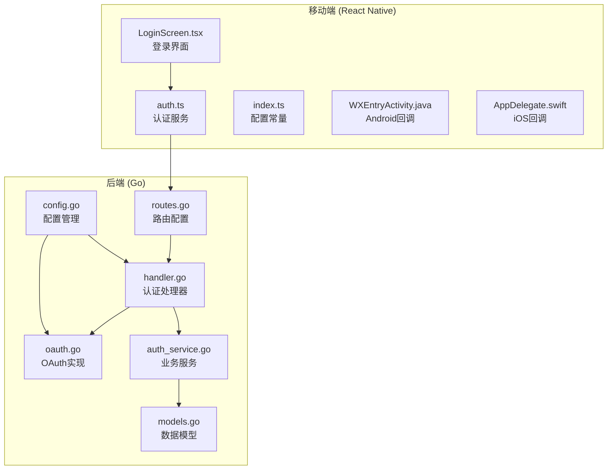
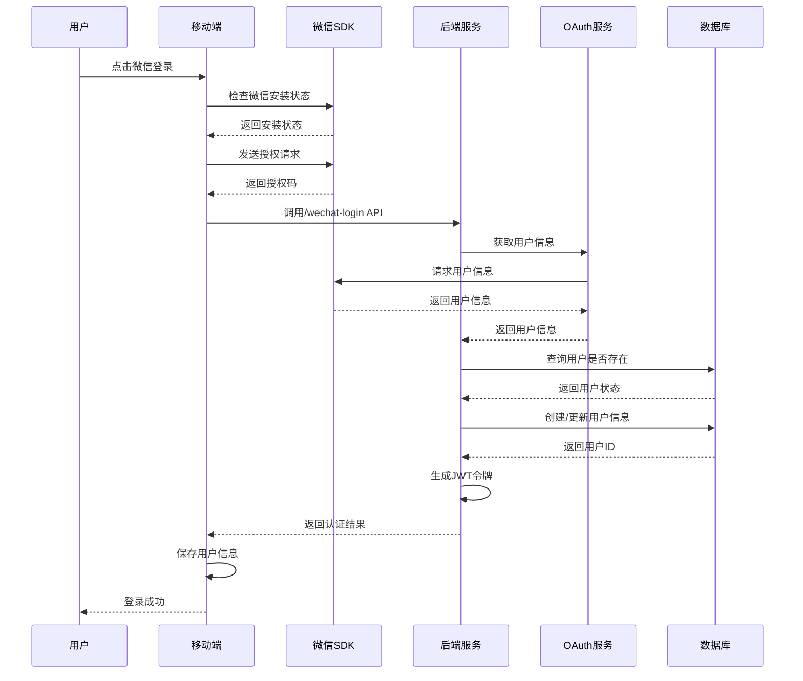
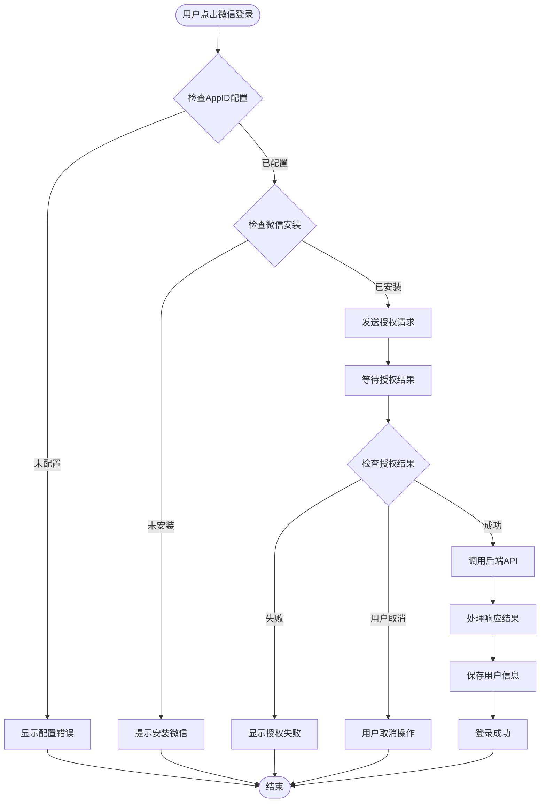
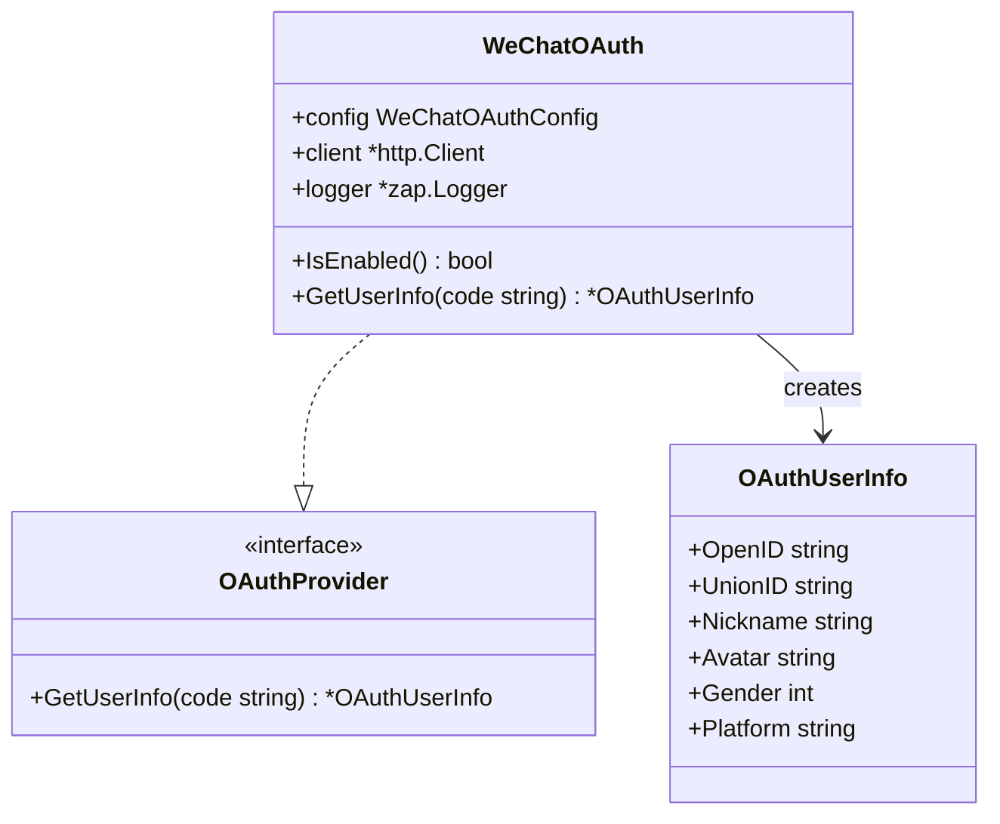
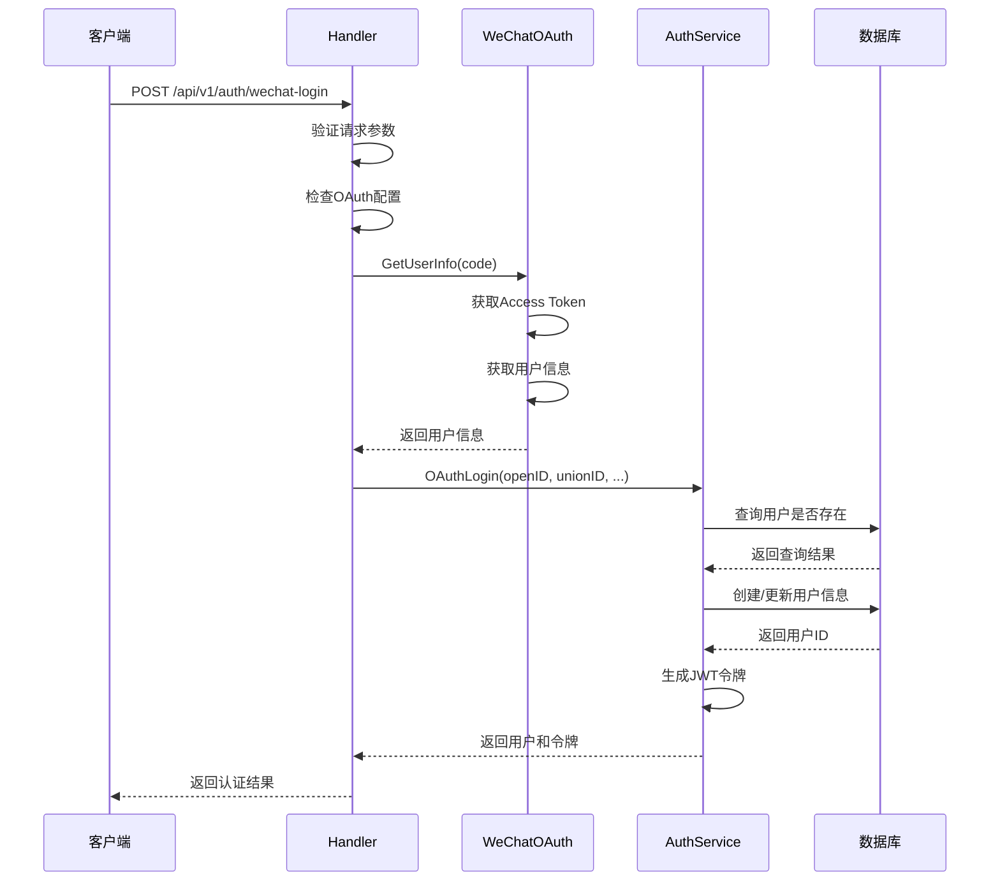
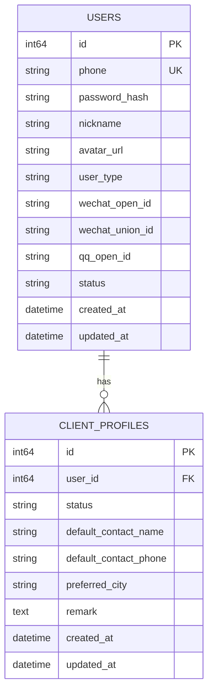
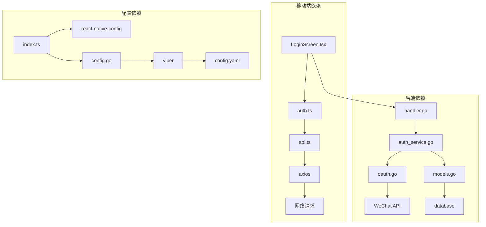

# 微信登录功能实现

<cite>
**本文档引用的文件**
- [LoginScreen.tsx](file://mobile/src/screens/auth/LoginScreen.tsx)
- [auth.ts](file://mobile/src/services/auth.ts)
- [index.ts](file://mobile/src/constants/index.ts)
- [WXEntryActivity.java](file://mobile/android/app/src/main/java/com/wurenjimobile/wxapi/WXEntryActivity.java)
- [AppDelegate.swift](file://mobile/ios/WurenjiMobile/AppDelegate.swift)
- [oauth.go](file://backend/internal/pkg/oauth/oauth.go)
- [handler.go](file://backend/internal/api/v1/auth/handler.go)
- [auth_service.go](file://backend/internal/service/auth_service.go)
- [models.go](file://backend/internal/model/models.go)
- [router.go](file://backend/internal/api/v1/router.go)
- [config.go](file://backend/internal/config/config.go)
- [config.example.yaml](file://backend/config.example.yaml)
</cite>

## 目录
1. [简介](#简介)
2. [项目结构](#项目结构)
3. [核心组件](#核心组件)
4. [架构概览](#架构概览)
5. [详细组件分析](#详细组件分析)
6. [依赖关系分析](#依赖关系分析)
7. [性能考虑](#性能考虑)
8. [故障排除指南](#故障排除指南)
9. [结论](#结论)

## 简介

本文档详细分析了无人机租赁平台项目的微信登录功能实现。该功能实现了完整的第三方OAuth登录流程，包括移动端微信授权、后端OAuth认证、用户信息获取和JWT令牌生成等完整链路。

微信登录功能采用标准的OAuth 2.0授权码模式，通过微信开放平台获取用户授权，然后在后端完成用户信息验证和账户绑定，最终生成JWT令牌供后续API调用使用。

## 项目结构

微信登录功能涉及前后端多个组件的协作：

**图表来源**
- [LoginScreen.tsx:97-142](file://mobile/src/screens/auth/LoginScreen.tsx#L97-L142)
- [oauth.go:61-144](file://backend/internal/pkg/oauth/oauth.go#L61-L144)
- [handler.go:146-179](file://backend/internal/api/v1/auth/handler.go#L146-L179)

**章节来源**
- [LoginScreen.tsx:97-142](file://mobile/src/screens/auth/LoginScreen.tsx#L97-L142)
- [auth.ts:35-44](file://mobile/src/services/auth.ts#L35-L44)
- [oauth.go:61-144](file://backend/internal/pkg/oauth/oauth.go#L61-L144)
- [handler.go:146-179](file://backend/internal/api/v1/auth/handler.go#L146-L179)

## 核心组件

### 移动端组件

**微信登录界面组件**
- 负责处理用户点击微信登录按钮的事件
- 集成微信SDK进行授权请求
- 处理授权结果并调用后端API

**认证服务**
- 封装微信登录API调用
- 统一处理认证相关的网络请求
- 提供类型安全的API接口

**配置常量**
- 管理第三方登录配置参数
- 提供环境变量读取机制
- 支持运行时配置切换

### 后端组件

**OAuth实现**
- 实现微信OAuth认证流程
- 处理微信API交互和用户信息获取
- 提供统一的OAuth接口抽象

**认证处理器**
- 处理微信登录HTTP请求
- 验证OAuth配置状态
- 调用业务服务完成用户认证

**业务服务**
- 实现OAuth登录逻辑
- 管理用户账户创建和更新
- 生成JWT令牌对

**数据模型**
- 定义用户表结构
- 支持微信OpenID和UnionID字段
- 提供用户信息存储

**章节来源**
- [LoginScreen.tsx:97-142](file://mobile/src/screens/auth/LoginScreen.tsx#L97-L142)
- [auth.ts:35-44](file://mobile/src/services/auth.ts#L35-L44)
- [oauth.go:61-144](file://backend/internal/pkg/oauth/oauth.go#L61-L144)
- [handler.go:146-179](file://backend/internal/api/v1/auth/handler.go#L146-L179)
- [auth_service.go:272-325](file://backend/internal/service/auth_service.go#L272-L325)
- [models.go:9-26](file://backend/internal/model/models.go#L9-L26)

## 架构概览

微信登录功能采用分层架构设计，确保各组件职责清晰、耦合度低：

**图表来源**
- [LoginScreen.tsx:97-142](file://mobile/src/screens/auth/LoginScreen.tsx#L97-L142)
- [handler.go:146-179](file://backend/internal/api/v1/auth/handler.go#L146-L179)
- [oauth.go:61-144](file://backend/internal/pkg/oauth/oauth.go#L61-L144)

## 详细组件分析

### 移动端微信登录实现

#### 登录界面处理流程

**图表来源**
- [LoginScreen.tsx:97-142](file://mobile/src/screens/auth/LoginScreen.tsx#L97-L142)

#### 微信SDK集成

移动端通过React Native WeChat模块实现微信登录集成：

**Android平台配置**
- WXEntryActivity处理微信回调
- 配置AndroidManifest.xml中的权限
- 集成微信SDK依赖

**iOS平台配置**
- AppDelegate处理URL Scheme回调
- 支持Universal Link
- 配置Info.plist中的URL Types

**章节来源**
- [LoginScreen.tsx:97-142](file://mobile/src/screens/auth/LoginScreen.tsx#L97-L142)
- [WXEntryActivity.java:1-15](file://mobile/android/app/src/main/java/com/wurenjimobile/wxapi/WXEntryActivity.java#L1-L15)
- [AppDelegate.swift:51-81](file://mobile/ios/WurenjiMobile/AppDelegate.swift#L51-L81)

### 后端OAuth认证实现

#### OAuth流程实现

**图表来源**
- [oauth.go:14-54](file://backend/internal/pkg/oauth/oauth.go#L14-L54)

#### 用户信息获取流程

后端通过微信API获取用户信息的具体步骤：

1. **获取Access Token**: 使用授权码交换Access Token
2. **获取用户信息**: 使用Access Token和OpenID获取用户详细信息
3. **错误处理**: 处理微信API返回的各种错误情况

**章节来源**
- [oauth.go:61-144](file://backend/internal/pkg/oauth/oauth.go#L61-L144)

### 认证处理器实现

#### HTTP请求处理

认证处理器负责处理微信登录的HTTP请求：

**图表来源**
- [handler.go:146-179](file://backend/internal/api/v1/auth/handler.go#L146-L179)
- [auth_service.go:272-325](file://backend/internal/service/auth_service.go#L272-L325)

**章节来源**
- [handler.go:146-179](file://backend/internal/api/v1/auth/handler.go#L146-L179)
- [auth_service.go:272-325](file://backend/internal/service/auth_service.go#L272-L325)

### 数据模型设计

#### 用户表结构

微信登录功能的数据模型设计支持第三方登录：

**图表来源**
- [models.go:9-26](file://backend/internal/model/models.go#L9-L26)

**章节来源**
- [models.go:9-26](file://backend/internal/model/models.go#L9-L26)

## 依赖关系分析

微信登录功能的依赖关系呈现清晰的分层结构：

**图表来源**
- [LoginScreen.tsx:97-142](file://mobile/src/screens/auth/LoginScreen.tsx#L97-L142)
- [auth.ts:1-45](file://mobile/src/services/auth.ts#L1-L45)
- [handler.go:1-20](file://backend/internal/api/v1/auth/handler.go#L1-L20)
- [auth_service.go:1-41](file://backend/internal/service/auth_service.go#L1-L41)

**章节来源**
- [index.ts:155-161](file://mobile/src/constants/index.ts#L155-L161)
- [config.go:380-406](file://backend/internal/config/config.go#L380-L406)

## 性能考虑

### OAuth调用优化

微信OAuth调用涉及外部API请求，需要考虑以下性能因素：

1. **超时设置**: OAuth调用设置了合理的超时时间
2. **错误重试**: 对于临时性网络错误提供重试机制
3. **缓存策略**: 用户信息可以适当缓存减少重复请求

### JWT令牌管理

1. **令牌生命周期**: 合理设置Access Token和Refresh Token的有效期
2. **令牌刷新**: 实现高效的令牌刷新机制
3. **内存管理**: 避免令牌信息泄露和内存泄漏

### 数据库性能

1. **索引优化**: 为OpenID和UnionID字段建立索引
2. **查询优化**: 减少不必要的数据库查询
3. **事务处理**: 在用户创建时使用事务确保数据一致性

## 故障排除指南

### 常见问题及解决方案

**微信App未安装**
- 检查设备是否安装微信应用
- 提示用户安装微信后再试
- 或提供其他登录方式

**授权失败**
- 检查微信AppID配置是否正确
- 验证应用是否已通过微信审核
- 确认授权作用域设置正确

**网络请求超时**
- 检查网络连接状态
- 调整超时时间设置
- 实现重试机制

**用户信息获取失败**
- 验证Access Token有效性
- 检查微信API接口状态
- 查看错误日志获取详细信息

### 调试技巧

1. **日志记录**: 在关键节点添加详细的日志输出
2. **错误捕获**: 捕获并处理各种异常情况
3. **状态检查**: 定期检查微信SDK状态
4. **配置验证**: 验证所有配置参数的正确性

**章节来源**
- [LoginScreen.tsx:102-141](file://mobile/src/screens/auth/LoginScreen.tsx#L102-L141)
- [handler.go:156-166](file://backend/internal/api/v1/auth/handler.go#L156-L166)

## 结论

微信登录功能实现了完整的第三方OAuth认证流程，具有以下特点：

1. **安全性**: 采用标准的OAuth 2.0协议，确保用户隐私安全
2. **可靠性**: 实现了完善的错误处理和重试机制
3. **可扩展性**: 支持多种第三方登录方式，便于未来扩展
4. **易维护性**: 清晰的代码结构和模块化设计

该实现为无人机租赁平台提供了便捷的用户登录体验，同时保证了系统的安全性和稳定性。通过合理的架构设计和完善的错误处理机制，确保了微信登录功能的可靠运行。