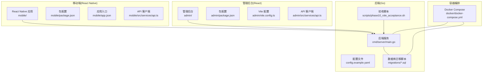
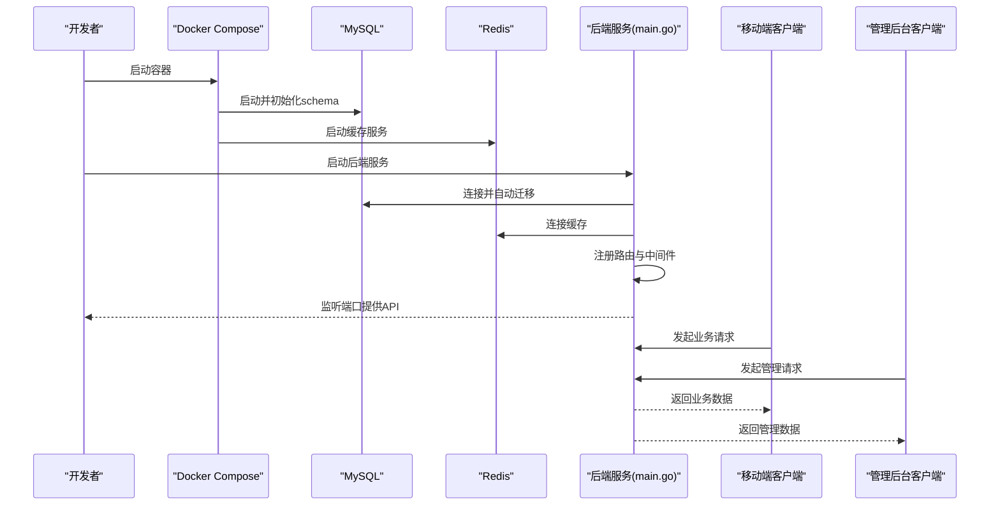
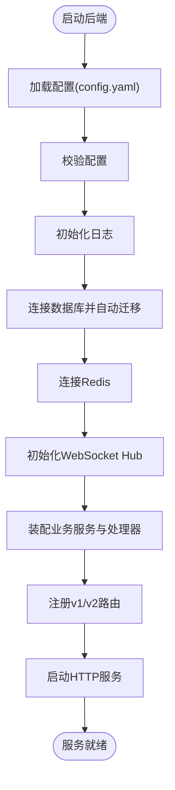
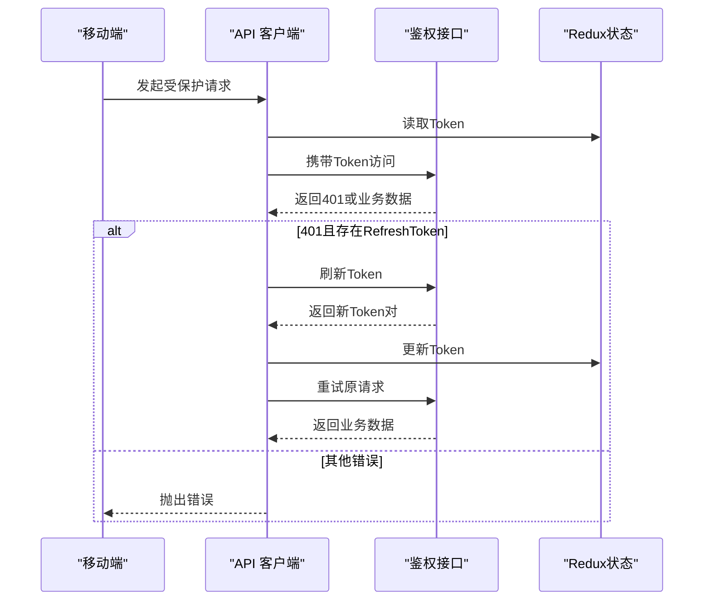
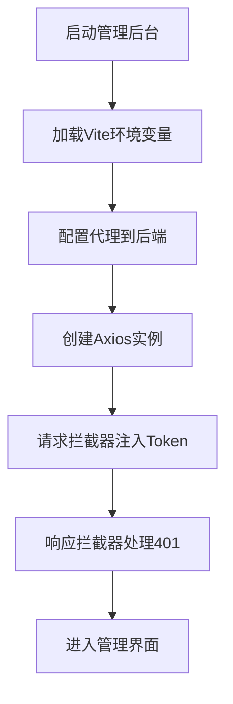
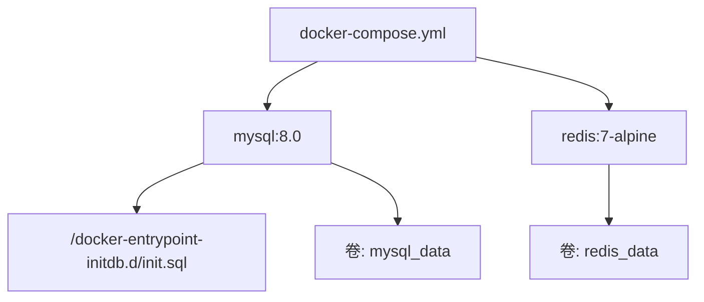
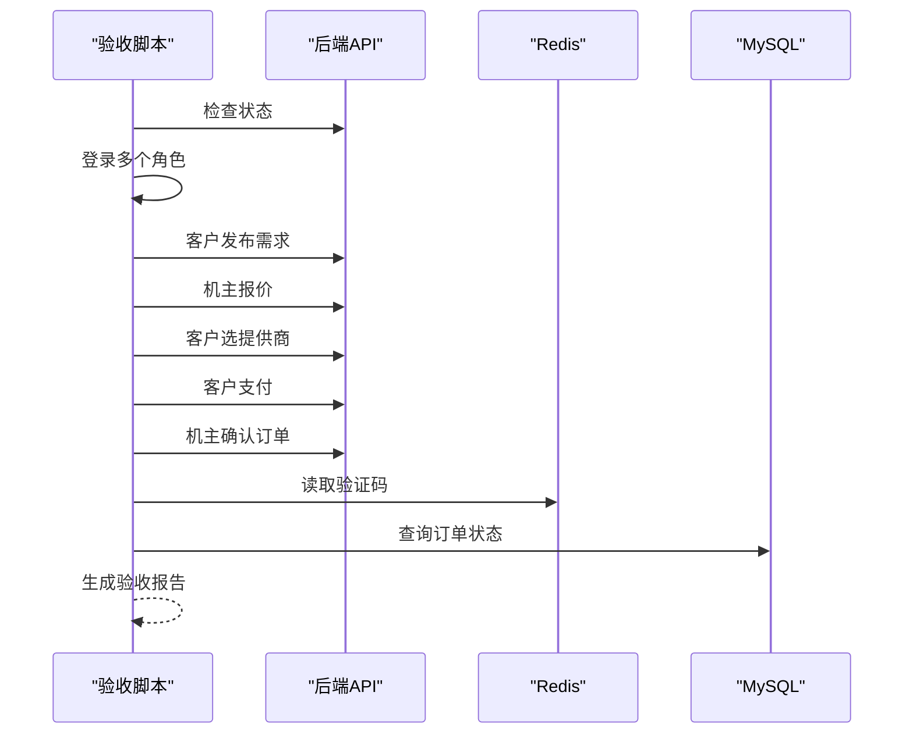
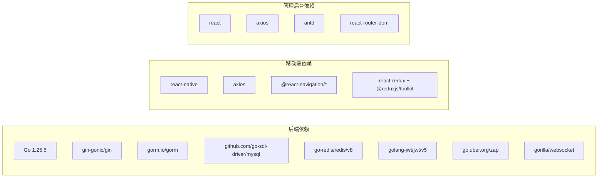

# 快速开始

<cite>
**本文引用的文件**
- [README.md](file://README.md)
- [backend/go.mod](file://backend/go.mod)
- [backend/config.example.yaml](file://backend/config.example.yaml)
- [backend/cmd/server/main.go](file://backend/cmd/server/main.go)
- [backend/scripts/phase10_role_acceptance.sh](file://backend/scripts/phase10_role_acceptance.sh)
- [docker/docker-compose.yml](file://docker/docker-compose.yml)
- [mobile/package.json](file://mobile/package.json)
- [mobile/app.json](file://mobile/app.json)
- [mobile/src/services/api.ts](file://mobile/src/services/api.ts)
- [admin/package.json](file://admin/package.json)
- [admin/vite.config.ts](file://admin/vite.config.ts)
- [admin/src/services/api.ts](file://admin/src/services/api.ts)
</cite>

## 目录
1. [简介](#简介)
2. [项目结构](#项目结构)
3. [核心组件](#核心组件)
4. [架构概览](#架构概览)
5. [详细组件分析](#详细组件分析)
6. [依赖分析](#依赖分析)
7. [性能考虑](#性能考虑)
8. [故障排查指南](#故障排查指南)
9. [结论](#结论)
10. [附录](#附录)

## 简介
本指南面向新开发者，帮助你从零开始搭建并运行无人机租赁平台项目。你将学会：
- 搭建 Go 后端开发环境与数据库
- 配置 React Native 移动端与管理后台
- 使用 Docker 容器化部署
- 初始化数据库与种子数据
- 本地调试与自动化验收测试
- 启动脚本与常用命令

## 项目结构
项目采用多模块组织方式：Go 后端、React Native 移动端、React 管理后台、Docker 编排与数据库迁移脚本。

图表来源
- [backend/cmd/server/main.go:1-390](file://backend/cmd/server/main.go#L1-L390)
- [backend/config.example.yaml:1-338](file://backend/config.example.yaml#L1-L338)
- [docker/docker-compose.yml:1-27](file://docker/docker-compose.yml#L1-L27)
- [mobile/package.json:1-63](file://mobile/package.json#L1-L63)
- [mobile/src/services/api.ts:1-155](file://mobile/src/services/api.ts#L1-L155)
- [admin/package.json:1-33](file://admin/package.json#L1-L33)
- [admin/vite.config.ts:1-64](file://admin/vite.config.ts#L1-L64)
- [admin/src/services/api.ts:1-402](file://admin/src/services/api.ts#L1-L402)

章节来源
- [README.md:1-29](file://README.md#L1-L29)
- [backend/go.mod:1-80](file://backend/go.mod#L1-L80)
- [docker/docker-compose.yml:1-27](file://docker/docker-compose.yml#L1-L27)

## 核心组件
- 后端服务：基于 Gin 框架，提供 v1/v2 API，集成数据库、Redis、WebSocket、短信、支付、OAuth 等能力。
- 移动端：React Native 应用，通过 Axios 客户端访问后端 API，内置鉴权与 Token 刷新逻辑。
- 管理后台：React + Vite 应用，通过 Axios 客户端访问后端 API，支持代理与开发调试。
- 容器编排：Docker Compose 提供 MySQL 与 Redis 服务，自动初始化数据库结构。
- 验收脚本：自动化执行角色验收流程，便于本地验证核心业务闭环。

章节来源
- [backend/cmd/server/main.go:52-266](file://backend/cmd/server/main.go#L52-L266)
- [mobile/src/services/api.ts:1-155](file://mobile/src/services/api.ts#L1-L155)
- [admin/src/services/api.ts:1-402](file://admin/src/services/api.ts#L1-L402)
- [docker/docker-compose.yml:1-27](file://docker/docker-compose.yml#L1-L27)
- [backend/scripts/phase10_role_acceptance.sh:1-606](file://backend/scripts/phase10_role_acceptance.sh#L1-L606)

## 架构概览
后端服务启动时加载配置、连接数据库与 Redis、初始化 WebSocket、注册路由并启动 HTTP 服务。移动端与管理后台通过 API 客户端访问后端接口；Docker Compose 提供数据库与缓存服务。

图表来源
- [backend/cmd/server/main.go:52-266](file://backend/cmd/server/main.go#L52-L266)
- [docker/docker-compose.yml:1-27](file://docker/docker-compose.yml#L1-L27)

## 详细组件分析

### 后端服务（Go）
- 配置加载与校验：支持从环境变量覆盖配置文件路径，启动时打印配置状态并校验关键项。
- 数据库初始化：使用 GORM 连接 MySQL，设置连接池与字符集，自动迁移模型。
- 中间件与路由：集成 CORS、日志、JWT 黑名单、分页等中间件，注册 v1/v2 路由。
- 服务装配：初始化短信、上传、支付、推送、OAuth、业务服务与处理器。
- WebSocket：启动 Hub 并在路由中接入 WebSocket。

图表来源
- [backend/cmd/server/main.go:52-266](file://backend/cmd/server/main.go#L52-L266)

章节来源
- [backend/cmd/server/main.go:52-266](file://backend/cmd/server/main.go#L52-L266)
- [backend/config.example.yaml:1-338](file://backend/config.example.yaml#L1-L338)

### 移动端（React Native）
- Axios 客户端：分别构建 v1/v2 基础 URL 的客户端实例。
- 请求拦截器：统一注入 Authorization 头，携带 Bearer Token。
- 响应拦截器：解析业务返回码，处理 401 未授权并触发 Token 刷新。
- Token 刷新：并发请求排队，避免重复刷新，成功后重试原请求。
- 常量与环境：通过常量定义 API 基础地址，便于切换环境。

图表来源
- [mobile/src/services/api.ts:1-155](file://mobile/src/services/api.ts#L1-L155)

章节来源
- [mobile/src/services/api.ts:1-155](file://mobile/src/services/api.ts#L1-L155)
- [mobile/package.json:1-63](file://mobile/package.json#L1-L63)
- [mobile/app.json:1-5](file://mobile/app.json#L1-L5)

### 管理后台（React）
- Vite 开发服务器：支持代理到后端 API，WebSocket 代理配置。
- Axios 客户端：统一请求与响应拦截，处理 401 并刷新 Token。
- 环境变量：通过 VITE_* 前缀配置 API 地址、超时、高德地图等。
- 管理接口封装：按模块导出 API 方法，便于页面调用。

图表来源
- [admin/vite.config.ts:1-64](file://admin/vite.config.ts#L1-L64)
- [admin/src/services/api.ts:1-402](file://admin/src/services/api.ts#L1-L402)

章节来源
- [admin/vite.config.ts:1-64](file://admin/vite.config.ts#L1-L64)
- [admin/src/services/api.ts:1-402](file://admin/src/services/api.ts#L1-L402)
- [admin/package.json:1-33](file://admin/package.json#L1-L33)

### Docker 容器化部署
- MySQL 8.0：设置字符集与 collation，挂载初始化 SQL，暴露 3306 端口。
- Redis 7：持久化数据卷，暴露 6379 端口。
- 自动初始化：首次启动时执行初始化 SQL，创建表结构与基础数据。

图表来源
- [docker/docker-compose.yml:1-27](file://docker/docker-compose.yml#L1-L27)

章节来源
- [docker/docker-compose.yml:1-27](file://docker/docker-compose.yml#L1-L27)

### 数据库初始化与迁移
- 初始化 SQL：位于 backend/migrations/001_init_schema.sql，随容器启动自动执行。
- 迁移脚本：后续版本迁移脚本位于同目录，按顺序执行。
- 自动迁移：后端启动时也会执行 GORM AutoMigrate，确保模型与表结构一致。

章节来源
- [docker/docker-compose.yml:13-13](file://docker/docker-compose.yml#L13-L13)
- [backend/cmd/server/main.go:294-389](file://backend/cmd/server/main.go#L294-L389)

### 验收测试与自动化
- 验收脚本：提供完整的角色登录、需求发布、报价、下单、派单、支付等流程自动化。
- 环境变量：支持自定义后端地址、数据库、Redis、演示账号等。
- 结果报告：生成 JSON 报告，包含步骤、状态与产物 ID。

图表来源
- [backend/scripts/phase10_role_acceptance.sh:422-606](file://backend/scripts/phase10_role_acceptance.sh#L422-L606)

章节来源
- [backend/scripts/phase10_role_acceptance.sh:1-606](file://backend/scripts/phase10_role_acceptance.sh#L1-L606)

## 依赖分析
- 后端依赖：Gin、GORM、MySQL 驱动、Redis 客户端、JWT、Zap 日志、WebSocket、短信与支付 SDK 等。
- 移动端依赖：React Native、Axios、导航与 Redux 工具链、地图与配置库等。
- 管理后台依赖：React、Ant Design、Axios、路由与 Vite 等。

图表来源
- [backend/go.mod:1-80](file://backend/go.mod#L1-L80)
- [mobile/package.json:14-35](file://mobile/package.json#L14-L35)
- [admin/package.json:14-24](file://admin/package.json#L14-L24)

章节来源
- [backend/go.mod:1-80](file://backend/go.mod#L1-L80)
- [mobile/package.json:1-63](file://mobile/package.json#L1-L63)
- [admin/package.json:1-33](file://admin/package.json#L1-L33)

## 性能考虑
- 数据库连接池：合理设置最大空闲与打开连接数，避免连接争用。
- 日志级别：开发使用详细日志，生产使用精简日志，降低 IO 压力。
- 缓存策略：Redis 用于验证码、会话与限流，注意键空间与过期策略。
- API 响应：移动端与管理后台均进行响应拦截与错误收敛，减少前端异常风暴。
- WebSocket：合理设置消息大小与心跳周期，避免资源泄漏。

## 故障排查指南
- 后端无法启动
  - 检查配置文件是否存在且可读，必要字段是否已修改。
  - 确认数据库与 Redis 服务可用，端口未被占用。
  - 查看启动日志，关注数据库连接与自动迁移错误。
- 移动端/管理后台无法登录
  - 确认后端 API 可访问，代理配置正确。
  - 检查 Token 是否过期，尝试刷新或重新登录。
- 验收脚本失败
  - 检查后端地址、数据库与 Redis 环境变量。
  - 查看脚本输出的步骤与错误详情，定位具体环节。
- 数据库初始化异常
  - 确认初始化 SQL 已挂载并执行，检查字符集与权限。
  - 如需重置，删除数据卷后重启容器。

章节来源
- [backend/config.example.yaml:1-338](file://backend/config.example.yaml#L1-L338)
- [backend/cmd/server/main.go:52-266](file://backend/cmd/server/main.go#L52-L266)
- [admin/vite.config.ts:22-41](file://admin/vite.config.ts#L22-L41)
- [backend/scripts/phase10_role_acceptance.sh:8-21](file://backend/scripts/phase10_role_acceptance.sh#L8-L21)

## 结论
通过本指南，你可以完成从环境准备、容器化部署、数据库初始化到本地调试与验收测试的全流程。建议先以 Docker 快速跑通后端与数据库，再逐步配置移动端与管理后台的开发环境。遇到问题时，优先检查配置文件、网络连通性与日志输出。

## 附录

### 快速开始清单
- 安装 Node.js 与 npm（移动端要求较高版本）
- 安装 Go 1.25+
- 安装 Docker 与 Docker Compose
- 准备 MySQL 与 Redis（或使用 Docker Compose）
- 下载项目并安装依赖
- 复制后端配置模板为最终配置文件并修改关键项
- 启动数据库与后端服务
- 启动移动端与管理后台
- 运行验收脚本验证核心流程

### 常用命令
- 启动数据库与缓存
  - docker compose up -d
- 启动后端服务
  - cd backend && go run cmd/server/main.go
- 启动移动端
  - cd mobile && npm run android 或 npm run ios
- 启动管理后台
  - cd admin && npm run dev
- 运行验收脚本
  - cd backend && ./scripts/phase10_role_acceptance.sh

章节来源
- [docker/docker-compose.yml:1-27](file://docker/docker-compose.yml#L1-L27)
- [backend/cmd/server/main.go:52-266](file://backend/cmd/server/main.go#L52-L266)
- [mobile/package.json:5-12](file://mobile/package.json#L5-L12)
- [admin/package.json:5-9](file://admin/package.json#L5-L9)
- [backend/scripts/phase10_role_acceptance.sh:1-606](file://backend/scripts/phase10_role_acceptance.sh#L1-L606)