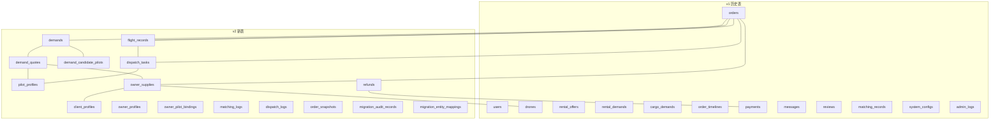
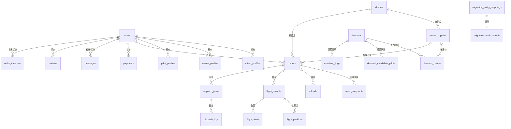
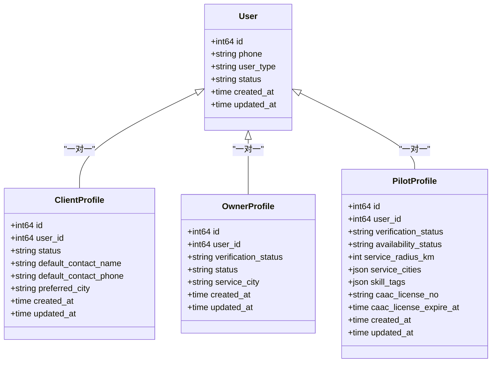
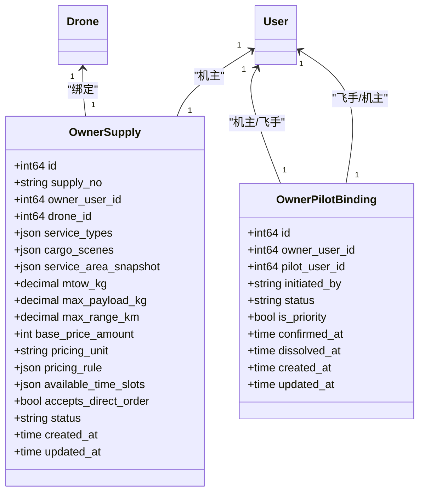
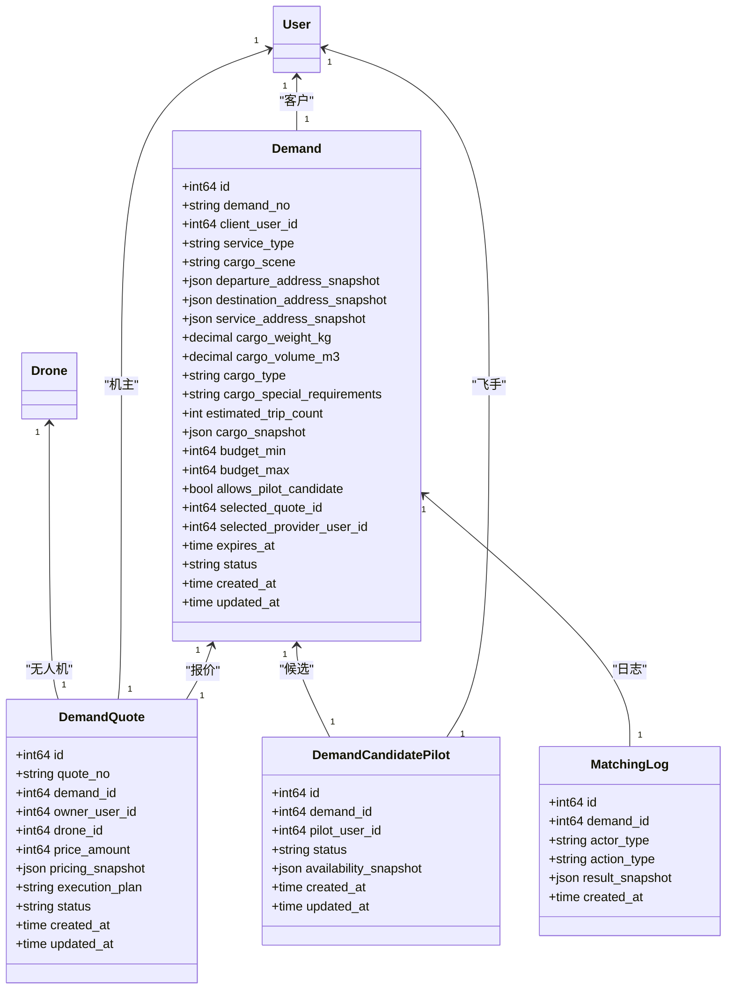
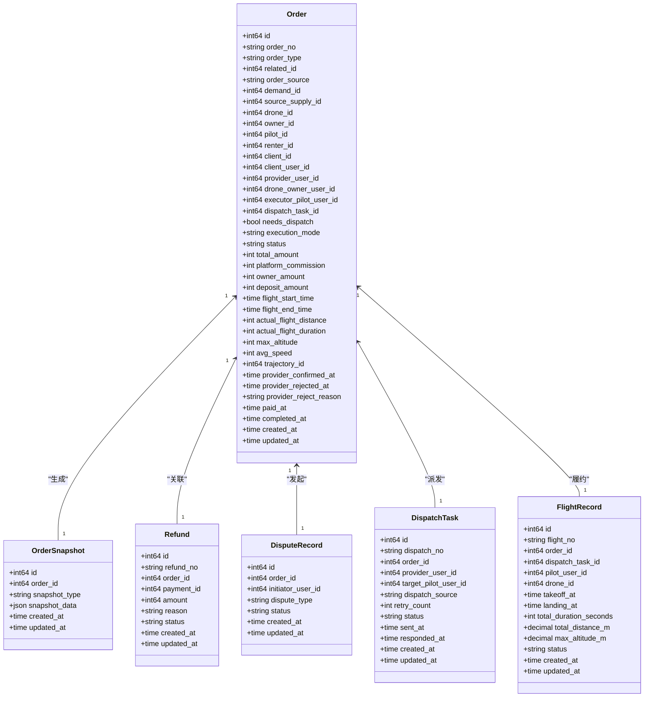
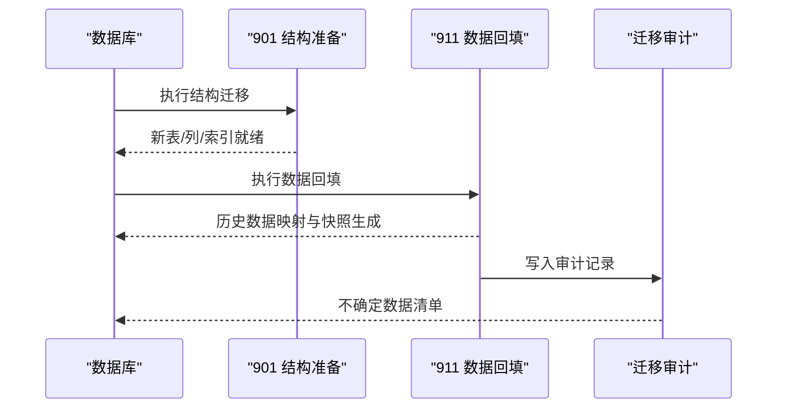
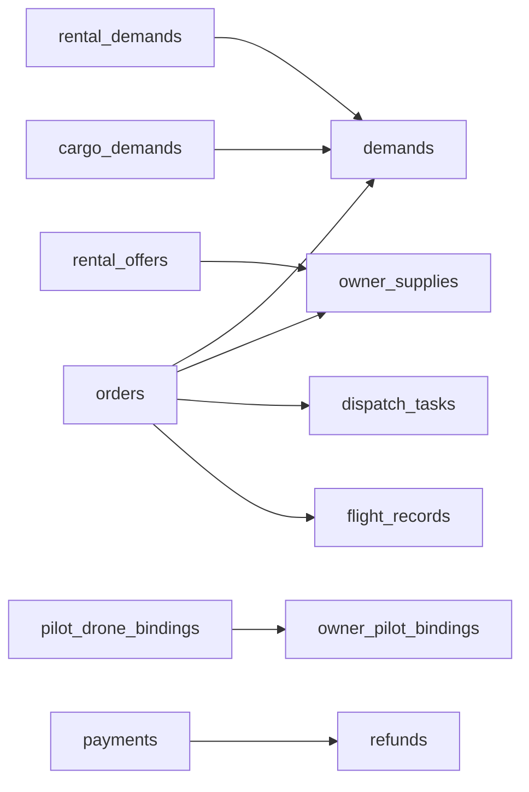

# 数据库设计

<cite>
**本文引用的文件**
- [001_init_schema.sql](file://backend/migrations/001_init_schema.sql)
- [101_create_role_profile_tables.sql](file://backend/migrations/101_create_role_profile_tables.sql)
- [102_create_supply_and_binding_tables.sql](file://backend/migrations/102_create_supply_and_binding_tables.sql)
- [103_create_demand_v2_tables.sql](file://backend/migrations/103_create_demand_v2_tables.sql)
- [104_extend_orders_for_v2_sources.sql](file://backend/migrations/104_extend_orders_for_v2_sources.sql)
- [105_create_order_artifacts.sql](file://backend/migrations/105_create_order_artifacts.sql)
- [106_split_dispatch_pool_and_formal_dispatch.sql](file://backend/migrations/106_split_dispatch_pool_and_formal_dispatch.sql)
- [107_rebuild_flight_records.sql](file://backend/migrations/107_rebuild_flight_records.sql)
- [108_create_migration_mapping_tables.sql](file://backend/migrations/108_create_migration_mapping_tables.sql)
- [901_phase9_prepare_v2_schema.sql](file://backend/migrations/901_phase9_prepare_v2_schema.sql)
- [911_phase9_backfill_v2_data.sql](file://backend/migrations/911_phase9_backfill_v2_data.sql)
- [models.go](file://backend/internal/model/models.go)
- [API_V1_V2_DIFF.md](file://backend/docs/API_V1_V2_DIFF.md)
- [PHASE9_MIGRATION_RUNBOOK.md](file://backend/docs/PHASE9_MIGRATION_RUNBOOK.md)
</cite>

## 目录
1. [简介](#简介)
2. [项目结构](#项目结构)
3. [核心组件](#核心组件)
4. [架构总览](#架构总览)
5. [详细组件分析](#详细组件分析)
6. [依赖分析](#依赖分析)
7. [性能考量](#性能考量)
8. [故障排查指南](#故障排查指南)
9. [结论](#结论)
10. [附录](#附录)

## 简介
本文件为无人机租赁平台 v1 到 v2 的数据库设计与迁移文档，覆盖数据模型关系、表结构设计、字段定义与约束规则，详述 v1 到 v2 的数据库迁移过程（含结构迁移与数据回填）、核心业务实体关系（用户、角色、需求、供给、订单等），并提供索引优化策略、查询性能考虑与数据一致性保障机制。文档同时给出数据库 schema 图与实体关系图，帮助开发者快速理解数据存储的设计思路与优化策略。

## 项目结构
数据库相关的核心内容分布在以下位置：
- 初始化与演进脚本：backend/migrations/*.sql
- v2 结构迁移与数据回填：backend/migrations/901*.sql 与 911*.sql
- ORM 模型定义：backend/internal/model/models.go
- 迁移执行说明与 API 对比：backend/docs/PHASE9_MIGRATION_RUNBOOK.md、API_V1_V2_DIFF.md

图表来源
- [001_init_schema.sql:8-314](file://backend/migrations/001_init_schema.sql#L8-L314)
- [101_create_role_profile_tables.sql:5-141](file://backend/migrations/101_create_role_profile_tables.sql#L5-L141)
- [102_create_supply_and_binding_tables.sql:5-227](file://backend/migrations/102_create_supply_and_binding_tables.sql#L5-L227)
- [103_create_demand_v2_tables.sql:5-302](file://backend/migrations/103_create_demand_v2_tables.sql#L5-L302)
- [104_extend_orders_for_v2_sources.sql:5-163](file://backend/migrations/104_extend_orders_for_v2_sources.sql#L5-L163)
- [105_create_order_artifacts.sql:9-227](file://backend/migrations/105_create_order_artifacts.sql#L9-L227)
- [106_split_dispatch_pool_and_formal_dispatch.sql:73-130](file://backend/migrations/106_split_dispatch_pool_and_formal_dispatch.sql#L73-L130)
- [107_rebuild_flight_records.sql:5-263](file://backend/migrations/107_rebuild_flight_records.sql#L5-L263)
- [108_create_migration_mapping_tables.sql:5-389](file://backend/migrations/108_create_migration_mapping_tables.sql#L5-L389)

章节来源
- [001_init_schema.sql:1-314](file://backend/migrations/001_init_schema.sql#L1-L314)
- [101_create_role_profile_tables.sql:1-141](file://backend/migrations/101_create_role_profile_tables.sql#L1-L141)
- [102_create_supply_and_binding_tables.sql:1-227](file://backend/migrations/102_create_supply_and_binding_tables.sql#L1-L227)
- [103_create_demand_v2_tables.sql:1-302](file://backend/migrations/103_create_demand_v2_tables.sql#L1-L302)
- [104_extend_orders_for_v2_sources.sql:1-163](file://backend/migrations/104_extend_orders_for_v2_sources.sql#L1-L163)
- [105_create_order_artifacts.sql:1-227](file://backend/migrations/105_create_order_artifacts.sql#L1-L227)
- [106_split_dispatch_pool_and_formal_dispatch.sql:1-238](file://backend/migrations/106_split_dispatch_pool_and_formal_dispatch.sql#L1-L238)
- [107_rebuild_flight_records.sql:1-263](file://backend/migrations/107_rebuild_flight_records.sql#L1-L263)
- [108_create_migration_mapping_tables.sql:1-389](file://backend/migrations/108_create_migration_mapping_tables.sql#L1-L389)

## 核心组件
- 用户与角色档案
  - v1 users 表承载基础身份信息；v2 引入 client_profiles、owner_profiles、pilot_profiles 三类角色档案，统一用户角色边界与扩展字段。
- 供给与协作
  - v1 rental_offers 与 v2 owner_supplies 对应机主供给；新增 owner_pilot_bindings 建立长期协作关系。
- 需求与报价
  - v1 rental_demands、cargo_demands 与 v2 demands 对齐；新增 demand_quotes、demand_candidate_pilots、matching_logs 支撑撮合与候选池。
- 订单与执行
  - v1 orders 与 v2 订单体系对齐，新增 order_snapshots、refunds、dispute_records；派单与飞行记录拆分为 dispatch_tasks、dispatch_logs、flight_records。
- 迁移与审计
  - migration_entity_mappings、migration_audit_records 记录映射与不确定数据，支撑迁移审计与回溯。

章节来源
- [101_create_role_profile_tables.sql:5-141](file://backend/migrations/101_create_role_profile_tables.sql#L5-L141)
- [102_create_supply_and_binding_tables.sql:5-227](file://backend/migrations/102_create_supply_and_binding_tables.sql#L5-L227)
- [103_create_demand_v2_tables.sql:5-302](file://backend/migrations/103_create_demand_v2_tables.sql#L5-L302)
- [104_extend_orders_for_v2_sources.sql:5-163](file://backend/migrations/104_extend_orders_for_v2_sources.sql#L5-L163)
- [105_create_order_artifacts.sql:9-227](file://backend/migrations/105_create_order_artifacts.sql#L9-L227)
- [106_split_dispatch_pool_and_formal_dispatch.sql:73-130](file://backend/migrations/106_split_dispatch_pool_and_formal_dispatch.sql#L73-L130)
- [107_rebuild_flight_records.sql:5-263](file://backend/migrations/107_rebuild_flight_records.sql#L5-L263)
- [108_create_migration_mapping_tables.sql:5-389](file://backend/migrations/108_create_migration_mapping_tables.sql#L5-L389)

## 架构总览
v2 数据库架构围绕“需求-供给-订单-派单-飞行”闭环展开，强调来源可追溯、执行可审计、财务可聚合。

图表来源
- [models.go:32-85](file://backend/internal/model/models.go#L32-L85)
- [models.go:230-259](file://backend/internal/model/models.go#L230-L259)
- [models.go:323-357](file://backend/internal/model/models.go#L323-L357)
- [models.go:413-484](file://backend/internal/model/models.go#L413-L484)
- [models.go:500-513](file://backend/internal/model/models.go#L500-L513)
- [models.go:534-551](file://backend/internal/model/models.go#L534-L551)
- [models.go:553-570](file://backend/internal/model/models.go#L553-L570)
- [models.go:654-688](file://backend/internal/model/models.go#L654-L688)

## 详细组件分析

### 用户与角色档案
- 用户表 users：承载手机号、密码哈希、用户类型、状态等基础信息，提供唯一索引 phone 与多维索引支持。
- 客户档案 client_profiles：统一客户默认联系人、常用城市、备注等，与 users 建立一对一外键关系。
- 机主档案 owner_profiles：审核状态、服务城市、联系方式、介绍等，支持状态与服务城市的检索。
- 飞手档案 pilot_profiles：验证状态、在线状态、服务半径、技能标签、CAAC 证件等，支持证件号与状态检索。

图表来源
- [models.go:32-85](file://backend/internal/model/models.go#L32-L85)

章节来源
- [101_create_role_profile_tables.sql:5-141](file://backend/migrations/101_create_role_profile_tables.sql#L5-L141)
- [models.go:32-85](file://backend/internal/model/models.go#L32-L85)

### 供给与协作关系
- 机主供给 owner_supplies：供给编号、服务类型、可承接场景、服务区域快照、计价规则、可服务时段、是否接受直单等，支持 owner_user_id、drone_id、状态等索引。
- 机主-飞手协作 owner_pilot_bindings：发起方、状态、优先级、备注、确认/解除时间等，支持联合索引 pair(owner_user_id, pilot_user_id)。

图表来源
- [models.go:230-259](file://backend/internal/model/models.go#L230-L259)
- [models.go:381-396](file://backend/internal/model/models.go#L381-L396)

章节来源
- [102_create_supply_and_binding_tables.sql:5-227](file://backend/migrations/102_create_supply_and_binding_tables.sql#L5-L227)
- [models.go:230-259](file://backend/internal/model/models.go#L230-L259)
- [models.go:381-396](file://backend/internal/model/models.go#L381-L396)

### 需求、报价与匹配
- 需求 demands：需求编号、客户用户ID、服务类型、场景类型、作业地址快照、预算、有效期、状态等，支持 client_user_id、status、cargo_scene、expires_at 等索引。
- 报价 demand_quotes：报价编号、需求ID、机主用户ID、拟投无人机ID、报价金额、执行说明、状态等，支持 demand_id、owner_user_id、drone_id、status 等索引。
- 候选飞手 demand_candidate_pilots：需求ID、飞手用户ID、状态、能力快照等，支持 demand_id、pilot_user_id、status 等索引。
- 匹配日志 matching_logs：需求ID、触发方、动作类型、结果快照等，支持 demand_id、actor_type、action_type 等索引。

图表来源
- [models.go:323-357](file://backend/internal/model/models.go#L323-L357)
- [models.go:359-379](file://backend/internal/model/models.go#L359-L379)
- [models.go:381-396](file://backend/internal/model/models.go#L381-L396)
- [models.go:398-411](file://backend/internal/model/models.go#L398-L411)

章节来源
- [103_create_demand_v2_tables.sql:5-302](file://backend/migrations/103_create_demand_v2_tables.sql#L5-L302)
- [models.go:323-357](file://backend/internal/model/models.go#L323-L357)
- [models.go:359-379](file://backend/internal/model/models.go#L359-L379)
- [models.go:381-396](file://backend/internal/model/models.go#L381-L396)
- [models.go:398-411](file://backend/internal/model/models.go#L398-L411)

### 订单与执行
- 订单 orders：订单编号、来源（需求市场/直单）、需求ID、来源供给ID、执行归属、派单需求、执行模式、确认/拒绝时间、支付/完成时间、轨迹ID等，支持 order_source、demand_id、source_supply_id、client_user_id、provider_user_id、drone_owner_user_id、executor_pilot_user_id、needs_dispatch、execution_mode 等索引。
- 订单快照 order_snapshots：client、demand、supply、pricing、execution 等快照类型，支持去重约束与索引。
- 退款 refunds：退款编号、订单ID、支付ID、金额、状态等，支持唯一约束与索引。
- 争议 dispute_records：订单ID、发起人、争议类型、状态等，支持索引。
- 正式派单 dispatch_tasks：派单编号、订单ID、机主用户ID、目标飞手用户ID、来源、重派次数、状态、时间戳等，支持唯一与多维索引。
- 飞行记录 flight_records：订单ID、派单ID、飞手用户ID、无人机ID、起飞/降落时间、总时长/距离、最大高度、状态等，支持多维索引。

图表来源
- [models.go:413-484](file://backend/internal/model/models.go#L413-L484)
- [models.go:500-513](file://backend/internal/model/models.go#L500-L513)
- [models.go:534-551](file://backend/internal/model/models.go#L534-L551)
- [models.go:553-570](file://backend/internal/model/models.go#L553-L570)
- [models.go:610-624](file://backend/internal/model/models.go#L610-L624)
- [models.go:654-688](file://backend/internal/model/models.go#L654-L688)

章节来源
- [104_extend_orders_for_v2_sources.sql:5-163](file://backend/migrations/104_extend_orders_for_v2_sources.sql#L5-L163)
- [105_create_order_artifacts.sql:9-227](file://backend/migrations/105_create_order_artifacts.sql#L9-L227)
- [106_split_dispatch_pool_and_formal_dispatch.sql:73-130](file://backend/migrations/106_split_dispatch_pool_and_formal_dispatch.sql#L73-L130)
- [107_rebuild_flight_records.sql:5-263](file://backend/migrations/107_rebuild_flight_records.sql#L5-L263)
- [models.go:413-484](file://backend/internal/model/models.go#L413-L484)
- [models.go:500-513](file://backend/internal/model/models.go#L500-L513)
- [models.go:534-551](file://backend/internal/model/models.go#L534-L551)
- [models.go:553-570](file://backend/internal/model/models.go#L553-L570)
- [models.go:610-624](file://backend/internal/model/models.go#L610-L624)
- [models.go:654-688](file://backend/internal/model/models.go#L654-L688)

### v1 到 v2 数据库迁移流程
- 结构迁移（901）：准备 v2 结构（建表、改列、加索引），不进行数据回填。
- 数据回填（911）：基于历史数据回填至 v2 表，生成映射与审计记录。
- 迁移审计：通过 migration_audit_records 与 migration_entity_mappings 跟踪不确定数据与映射关系。

图表来源
- [901_phase9_prepare_v2_schema.sql:253-462](file://backend/migrations/901_phase9_prepare_v2_schema.sql#L253-L462)
- [911_phase9_backfill_v2_data.sql:470-611](file://backend/migrations/911_phase9_backfill_v2_data.sql#L470-L611)
- [108_create_migration_mapping_tables.sql:195-389](file://backend/migrations/108_create_migration_mapping_tables.sql#L195-L389)

章节来源
- [PHASE9_MIGRATION_RUNBOOK.md:1-121](file://backend/docs/PHASE9_MIGRATION_RUNBOOK.md#L1-L121)
- [901_phase9_prepare_v2_schema.sql:1-800](file://backend/migrations/901_phase9_prepare_v2_schema.sql#L1-L800)
- [911_phase9_backfill_v2_data.sql:1-800](file://backend/migrations/911_phase9_backfill_v2_data.sql#L1-L800)
- [108_create_migration_mapping_tables.sql:1-389](file://backend/migrations/108_create_migration_mapping_tables.sql#L1-L389)

## 依赖分析
- v1 历史表与 v2 新表的映射关系通过 migration_entity_mappings 记录，便于审计与回溯。
- 订单 orders 与多张表强关联：demands、owner_supplies、dispatch_tasks、flight_records、order_snapshots、refunds。
- 飞手与机主协作通过 owner_pilot_bindings 实现，影响派单与执行归属。

图表来源
- [103_create_demand_v2_tables.sql:94-263](file://backend/migrations/103_create_demand_v2_tables.sql#L94-L263)
- [102_create_supply_and_binding_tables.sql:87-138](file://backend/migrations/102_create_supply_and_binding_tables.sql#L87-L138)
- [104_extend_orders_for_v2_sources.sql:29-157](file://backend/migrations/104_extend_orders_for_v2_sources.sql#L29-L157)
- [105_create_order_artifacts.sql:207-221](file://backend/migrations/105_create_order_artifacts.sql#L207-L221)
- [108_create_migration_mapping_tables.sql:45-180](file://backend/migrations/108_create_migration_mapping_tables.sql#L45-L180)

章节来源
- [103_create_demand_v2_tables.sql:94-263](file://backend/migrations/103_create_demand_v2_tables.sql#L94-L263)
- [102_create_supply_and_binding_tables.sql:87-138](file://backend/migrations/102_create_supply_and_binding_tables.sql#L87-L138)
- [104_extend_orders_for_v2_sources.sql:29-157](file://backend/migrations/104_extend_orders_for_v2_sources.sql#L29-L157)
- [105_create_order_artifacts.sql:207-221](file://backend/migrations/105_create_order_artifacts.sql#L207-L221)
- [108_create_migration_mapping_tables.sql:45-180](file://backend/migrations/108_create_migration_mapping_tables.sql#L45-L180)

## 性能考量
- 索引策略
  - 用户与角色档案：按 status、phone、user_id 建立索引，满足高频查询与唯一性约束。
  - 需求与报价：按 client_user_id、status、demand_id、owner_user_id、drone_id、expires_at 建立索引，提升筛选与排序效率。
  - 订单：按 order_source、demand_id、source_supply_id、client_user_id、provider_user_id、drone_owner_user_id、executor_pilot_user_id、needs_dispatch、execution_mode 建立索引，支撑来源追溯与执行模式判定。
  - 飞行记录：按 order_id、dispatch_task_id、pilot_user_id、drone_id、status 建立索引，支持履约统计与查询。
- 查询优化
  - 使用 JSON 字段（如 service_area_snapshot、pricing_rule、cargo_snapshot）时，结合必要索引与投影字段，避免全表扫描。
  - 订单快照（order_snapshots）采用按类型去重约束，减少重复写入与冗余存储。
- 一致性保障
  - 外键约束：client_profiles、owner_profiles、pilot_profiles、owner_supplies、owner_pilot_bindings、demand_quotes、demand_candidate_pilots、matching_logs、dispatch_tasks、flight_records 等均设置外键约束，确保引用完整性。
  - 并发控制：通过唯一索引（如 order_no、supply_no、quote_no、flight_no、refund_no）与事务控制，保证并发写入的一致性。

章节来源
- [101_create_role_profile_tables.sql:17-71](file://backend/migrations/101_create_role_profile_tables.sql#L17-L71)
- [102_create_supply_and_binding_tables.sql:28-56](file://backend/migrations/102_create_supply_and_binding_tables.sql#L28-L56)
- [103_create_demand_v2_tables.sql:34-91](file://backend/migrations/103_create_demand_v2_tables.sql#L34-L91)
- [104_extend_orders_for_v2_sources.sql:19-27](file://backend/migrations/104_extend_orders_for_v2_sources.sql#L19-L27)
- [105_create_order_artifacts.sql:16-34](file://backend/migrations/105_create_order_artifacts.sql#L16-L34)
- [107_rebuild_flight_records.sql:21-28](file://backend/migrations/107_rebuild_flight_records.sql#L21-L28)

## 故障排查指南
- 迁移执行失败
  - 901 结构迁移失败：停止执行 911，评估失败点并回滚快照；若可修复，修复后重试。
  - 911 数据回填失败：保留 901 结构结果，通过 migration_audit_records 识别已处理与未处理数据，修复脚本后重跑 911。
- 双读校验
  - 执行 go run ./cmd/check_v2_parity 校验新旧数据一致性，关注 missing_v2_tables 等阻塞性错误。
- 迁移审计
  - 通过 migration_audit_records 查看未映射的订单、退款、派单与飞行数据，按严重级别分类处理。

章节来源
- [PHASE9_MIGRATION_RUNBOOK.md:52-121](file://backend/docs/PHASE9_MIGRATION_RUNBOOK.md#L52-L121)
- [108_create_migration_mapping_tables.sql:195-389](file://backend/migrations/108_create_migration_mapping_tables.sql#L195-L389)

## 结论
v2 数据库设计以“需求-供给-订单-派单-飞行”为核心闭环，通过角色档案、供给与协作关系、需求报价与匹配、订单与执行、迁移与审计等模块，实现了来源可追溯、执行可审计、财务可聚合的目标。迁移脚本将 v1 历史数据安全回填至 v2 表，并通过映射与审计机制保障不确定性数据的可控与可回溯。配合合理的索引与查询优化策略，可有效支撑高并发场景下的性能与一致性需求。

## 附录
- API v1/v2 边界与差异：参见 [API_V1_V2_DIFF.md:1-222](file://backend/docs/API_V1_V2_DIFF.md#L1-L222)
- 阶段 9 迁移执行说明：参见 [PHASE9_MIGRATION_RUNBOOK.md:1-121](file://backend/docs/PHASE9_MIGRATION_RUNBOOK.md#L1-L121)